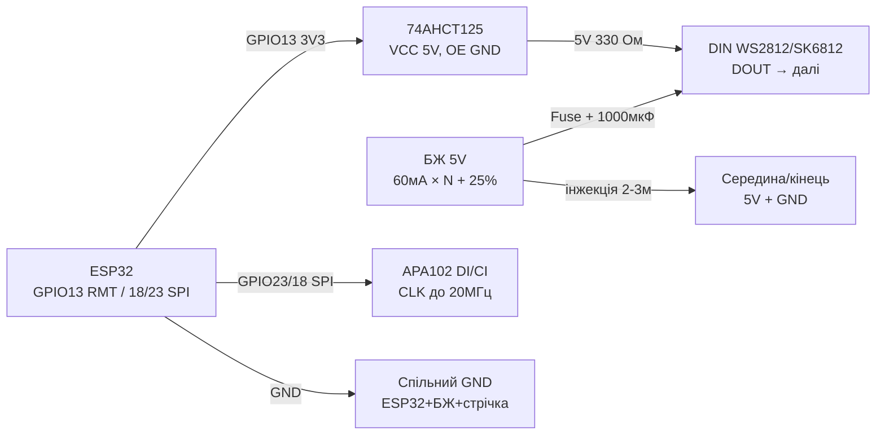
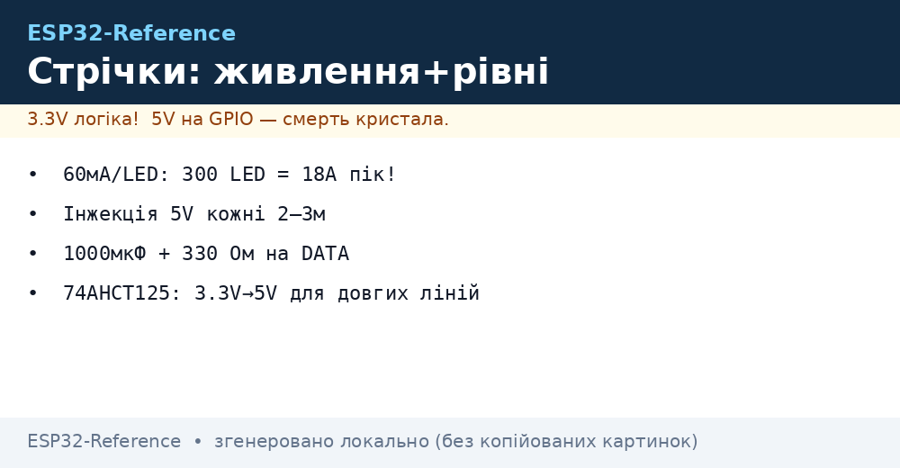
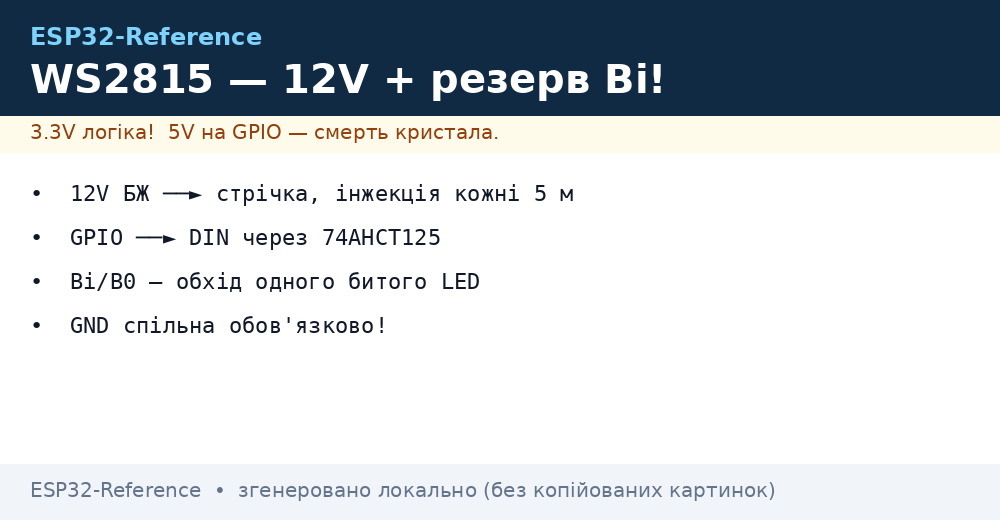

# Живлення LED-стрічок, SK6812, APA102 - RMT, DMA, ефекти

## Призначення

Живлення і керування адресними стрічками без магії диму: розрахунок струму (правило 60 мА/LED), інжекція живлення кожні 2-3 м, обв'язка DATA (330 Ом + 1000 мкФ), узгодження рівнів 3.3 В → 5 В через 74AHCT125, різниця SK6812 RGBW vs WS2812 vs APA102 (SPI з клоком до 20 МГц). Плюс апаратний RMT + DMA в ESP32 для безджитерних ефектів навіть під Wi-Fi - з готовим кодом веселки, бігучого вогню і стробоскопа.

## Характеристики

| Стрічка | Протокол | Живлення / струм | Ключове правило |
| --- | --- | --- | --- |
| WS2812B / NeoPixel | 1-wire 800 кГц, GRB | 5 В, 60 мА/LED білий (20 мА × RGB) | 330 Ом на DATA + 1000 мкФ на 5 В біля початку |
| SK6812 RGBW | 1-wire 800 кГц, RGBW (сумісний таймінг) | 5 В, до 80 мА/LED (білий канал окремо!) | Чистіший білий; W-канал = 4-й байт |
| APA102 / DotStar | SPI: DATA + CLOCK до 20 МГц | 5 В, 60 мА/LED | ШІМ 20 кГц - без мерехтіння на камеру; довгі лінії ок |
| WS2811 / WS2801 (зовнішній драйвер) | 1-wire 800 кГц як WS2812 | 12 В (WS2811) живлення стрічки | Драйвер окремо від LED: для 12 В стрічок і великої потужності; таймінг той же |
| Живлення | Правило 60 мА × N | 30 LED/м білий = 1.8 А/м; 60/м = 3.6 А/м | Інжекція кожні 2-3 м з обох боків довгих стрічок |
| Level shifter | 74AHCT125 / 74HCT245 | 3.3 В → 5 В на DATA | TXS0102 НЕ для NeoPixel (слабкий драйв); 74AHCT - так |
| ESP32 RMT | 8 каналів TX, DMA | Роздільна здатність 10 МГц тип. | led_strip (IDF) / NeoPixelBus RMT-метод (Arduino) |

> Струм білого на повну: 30 LED = 1.8 А, 60 LED = 3.6 А, 144 LED/м × 5 м = 43 А - це вже зварювальний апарат, а не USB. Блок живлення з запасом 20-30 %, дроти по струму (1.5 мм² на 10 А), запобіжник на кожну гілку.

## Легенда пінів модуля

| Пін | Тип | Куди | Примітка |
| --- | --- | --- | --- |
| Стрічка 5V (червоний) | Силове | БЖ 5 В (не плата!) | Інжекція кожні 2-3 м; запобіжник на гілку |
| Стрічка GND (білий/чорний) | Земля | GND БЖ + GND ESP32 | Спільна точка; товсті дроти! |
| WS2812/SK6812 DIN | Вхід даних | GPIO через 74AHCT125 + 330 Ом | Резистор біля ПЕРШОГО LED |
| WS2812/SK6812 DOUT | Вихід | DIN наступного відрізка | До 500+ LED в одному ланцюгу (RAM!) |
| APA102 DI (MOSI) | Вхід даних | GPIO23 / через shifter | SPI до 20 МГц |
| APA102 CI (SCK) | Вхід клоку | GPIO18 / через shifter | Окремий клок = стійкість до джитера |
| 74AHCT125 A (1A) | Вхід 3.3 В | GPIO ESP32 | Швидкий буфер, драйв 8 мА |
| 74AHCT125 Y (1Y) | Вихід 5 В | DIN стрічки через 330 Ом | Живлення буфера 5 В! OE на GND |
| Конденсатор 1000 мкФ | 6.3-16 В | 5V-GND біля початку стрічки | Гасить кидок при вмиканні білого |
| Запобіжник | 5-10 А | У розрив 5V кожної гілки | Автомобільний blade - дешево і сердито |

## Схема підключення

| ESP32 | Модуль | Примітка |
| --- | --- | --- |
| GPIO13 | 74AHCT125 1A (вхід) | 3.3 В логіка ESP32 |
| 74AHCT125 1Y через 330 Ом | DIN стрічки | 5 В рівень після буфера |
| GND | 74AHCT125 OE (активний LOW) | На землю = канал увімкнено |
| 5V | 74AHCT125 VCC | Буфер живиться від 5 В! |
| GND | GND стрічки + GND БЖ | Спільна земля обов'язкова |
| БЖ 5 В (N×60 мА + 25 %) | 5V стрічки + 1000 мкФ | Інжекція кожні 2-3 м |
| GPIO23 | APA102 DI (через shifter) | MOSI |
| GPIO18 | APA102 CI (через shifter) | SCK до 20 МГц |
| GPIO13 (RMT) | WS2812/SK6812 ланцюг | Один RMT-канал на стрічку |

### ASCII-схема

```text
ESP32 DevKit              74AHCT125 + стрічка + БЖ 5V
------------              --------------------------------
GPIO13 ──────────────────► 1A 74AHCT125 (VCC=5V, OE ──► GND)
1Y ────[330 Ом]──────────► DIN стрічки (резистор біля LED!)
GND ─────────────────────► GND стрічки (= GND БЖ 5V + ESP32!)
БЖ 5V (60мА×N+25%) ──┬───► 5V початок + [1000мкФ 6.3V]
                     ├──[Fuse 5A]──► 5V середина (інжекція 2-3м)
                     └──[Fuse 5A]──► 5V кінець (довгі ──► ззаду)
APA102: GPIO23 ──► DI ; GPIO18 ──► CI (обидва через shifter)
DOUT ────────────────────► DIN наступного відрізка (ланцюг)
```

### Mermaid




*Рис. БЖ 5 В з запасом і інжекцією кожні 2-3 м, 74AHCT125 для 3.3 В → 5 В, 330 Ом на DATA, 1000 мкФ на початку. Місце під фото - див. .*

## Код ESP-IDF

```c
// led_strip (RMT + DMA): веселка + rotate. SK6812 RGBW: LED_MODEL_SK6812, формат GRBW.
#include "led_strip.h"
#include "esp_timer.h"

#define N_LEDS 60
static led_strip_handle_t strip;

// HSV -> RGB (h 0..360)
static void hsv2rgb(float h, uint8_t *r, uint8_t *g, uint8_t *b) {
    float c = 1.0f, x = c * (1 - fabsf(fmodf(h / 60.0f, 2) - 1));
    float m = 0, rr = 0, gg = 0, bb = 0;
    int s = (int)(h / 60) % 6;
    if (s == 0) { rr = c; gg = x; }
    else if (s == 1) { rr = x; gg = c; }
    else if (s == 2) { gg = c; bb = x; }
    else if (s == 3) { gg = x; bb = c; }
    else if (s == 4) { rr = x; bb = c; }
    else { rr = c; bb = x; }
    *r = (rr + m) * 255; *g = (gg + m) * 255; *b = (bb + m) * 255;
}

void app_main(void) {
    led_strip_config_t sc = {.strip_gpio_num = 13, .max_leds = N_LEDS,
        .led_model = LED_MODEL_WS2812,
        .color_format = LED_STRIP_COLOR_COMPONENT_FMT_GRB,
        .flags.invert_out = false};
    led_strip_rmt_config_t rc = {.resolution_hz = 10 * 1000 * 1000,
        .flags.with_dma = true};  // DMA — довгі стрічки без навантаження CPU
    led_strip_new_rmt_device(&sc, &rc, &strip);
    led_strip_clear(strip);

    uint32_t t = 0;
    while (1) {
        for (int i = 0; i < N_LEDS; i++) {
            uint8_t r, g, b;
            hsv2rgb(fmodf(i * 360.0f / N_LEDS + t, 360), &r, &g, &b);
            // Обмежити яскравість 50% — і тепло, і струм:
            led_strip_set_pixel(strip, i, r / 2, g / 2, b / 2);
        }
        led_strip_refresh(strip);
        t += 5;
        vTaskDelay(pdMS_TO_TICKS(30));
    }
}
```

## Код Arduino

```cpp
#include <NeoPixelBus.h>
#include <SPI.h>

#define LED_PIN 13
#define N_LEDS 60
// WS2812: NeoGrbFeature; SK6812 RGBW: NeoGrbwFeature + метод Sk6812:
NeoPixelBus<NeoGrbFeature, NeoEsp32Rmt0Ws2812xMethod> strip(N_LEDS, LED_PIN);
// APA102 окремо по SPI:
#define APA_N 30
uint8_t apaBuf[4 + APA_N * 4 + 4];  // start + LED frames + end

void apaShow(uint8_t r, uint8_t g, uint8_t b, uint8_t bright = 31) {
  apaBuf[0] = apaBuf[1] = apaBuf[2] = apaBuf[3] = 0x00;
  for (int i = 0; i < APA_N; i++) {
    apaBuf[4 + i * 4 + 0] = 0xE0 | (bright & 31);  // глобальна яскравість 5 біт
    apaBuf[4 + i * 4 + 1] = b;
    apaBuf[4 + i * 4 + 2] = g;
    apaBuf[4 + i * 4 + 3] = r;
  }
  for (int i = 0; i < 4; i++) apaBuf[4 + APA_N * 4 + i] = 0xFF;
  SPI.begin(18, -1, 23);  // SCK, MISO(-), MOSI
  SPI.beginTransaction(SPISettings(8000000, MSBFIRST, SPI_MODE0));
  SPI.writeBytes(apaBuf, sizeof(apaBuf));
  SPI.endTransaction();
}

void rainbow(uint8_t base) {
  for (int i = 0; i < N_LEDS; i++) {
    // Просте колесо кольорів без float:
    uint8_t p = base + i * 256 / N_LEDS;
    uint8_t r = (p < 85) ? 255 - p * 3 : (p < 170) ? 0 : (p - 170) * 3;
    uint8_t g = (p < 85) ? p * 3 : (p < 170) ? 255 - (p - 85) * 3 : 0;
    uint8_t b = (p < 85) ? 0 : (p < 170) ? (p - 85) * 3 : 255 - (p - 170) * 3;
    strip.SetPixelColor(i, RgbColor(r / 2, g / 2, b / 2));  // 50% струму
  }
  strip.Show();
}

void fire() {  // бігучий вогонь: червоний з жовтим хвостом
  static int pos = 0;
  strip.ClearTo(RgbColor(0, 0, 0));
  for (int i = 0; i < 8; i++) {
    int p = (pos - i + N_LEDS) % N_LEDS;
    strip.SetPixelColor(p, RgbColor(255, 120 - i * 15, 0));
  }
  strip.Show();
  pos = (pos + 1) % N_LEDS;
}

void setup() {
  strip.Begin();
  strip.Show();
}

void loop() {
  static uint8_t h = 0;
  rainbow(h++);
  delay(30);
  // fire(); apaShow(255, 0, 0);  // альтернативні ефекти
}
```

## Код MicroPython

```python
from machine import Pin, SPI
import neopixel
import time
import math

N = 60
np = neopixel.NeoPixel(Pin(13), N)

def wheel(p):  # 0..255 -> (r,g,b)
    p %= 256
    if p < 85: return (255 - p * 3, p * 3, 0)
    if p < 170: p -= 85; return (0, 255 - p * 3, p * 3)
    p -= 170; return (p * 3, 0, 255 - p * 3)

def rainbow(base, scale=2):  # scale=2 -> 50% яскравості (струм!)
    for i in range(N):
        r, g, b = wheel(base + i * 256 // N)
        np[i] = (r // scale, g // scale, b // scale)
    np.write()

def fire(pos):  # бігучий вогонь
    for i in range(N): np[i] = (0, 0, 0)
    for i in range(8):
        np[(pos - i) % N] = (255, max(0, 120 - i * 15), 0)
    np.write()

# APA102 по SPI (DI=23, CI=18):
spi = SPI(2, baudrate=8_000_000, sck=Pin(18), mosi=Pin(23))
def apa_show(r, g, b, n=30, bright=15):
    buf = bytearray([0, 0, 0, 0])
    for _ in range(n):
        buf += bytes([0xE0 | bright, b, g, r])
    buf += b'\xff\xff\xff\xff'
    spi.write(buf)

h = 0
pos = 0
while True:
    rainbow(h)
    h = (h + 1) % 256
    pos = (pos + 1) % N
    # fire(pos); apa_show(255, 0, 0)
    time.sleep_ms(30)
```

### WS2815 / WS2813 - 12 В стрічки з резервом

| Параметр | WS2815 | WS2813 (5 В з резервом) |
| --- | --- | --- |
| Живлення | 12 В (менший струм на довжину!) | 5 В |
| Резервний вхід | BI: при обриві одного LED ланцюг не рветься | BI: те саме на 5 В |
| Логіка | 5 В (перетворювач рівнів обов'язковий!) | 5 В |
| Коли брати | Вулиця/фасад 5-10 м без інжекції кожні 2 м | Надійність всередині, де 12 В немає |

```text
БЖ 12V ──► 12V-шина стрічки (інжекція кожні 5 м)
ESP32 GPIO ──[74AHCT125]──► DIN; BI наступного ──► вільний або до BI-попереднього
GND спільна обов'язково!
```


*Рис. WS2815: живлення 12 В, резервна лінія BI, перетворювач рівнів на DIN.*

## Типові помилки

| # | Помилка | Симптом | Виправлення |
| --- | --- | --- | --- |
| 1 | Живлення 60+ LED від USB/піна плати | Ребут при білому, рожевий замість білого | БЖ 5 В: 60 мА × N + 25 %; USB лише для прошивки |
| 2 | Немає спільного GND | Випадкові кольори, мерехтіння | GND ESP32 = GND БЖ = GND стрічки, товстим дротом |
| 3 | Немає 330 Ом / 1000 мкФ | Згорілий перший LED, кидки струму | 330 Ом біля DIN, 1000 мкФ біля 5V початку |
| 4 | DATA 3.3 В безпосередньо на довгу лінію | Дальні LED глітчать | 74AHCT125 біля ESP32; TXS0102 не підходить |
| 5 | Тонкі дроти / одна точка живлення на 5 м | Дальній кінець жовтий/червоний | Інжекція кожні 2-3 м з обох боків, 1.5 мм² на 10 А |
| 6 | SK6812 як WS2812 (3 байти замість 4) | Зсув кольорів, білий кривий | RGBW = 4 байти, формат GRBW, LED_MODEL_SK6812 |
| 7 | APA102 без end-frame | Останні LED не оновлюються | +4 байти 0xFF в кінці; старт 4×0x00 |
| 8 | Повна яскравість білого надовго | Перегрів БЖ, плавлення роз'ємів | Ліміт 50-70 % у коді; запобіжник на гілку; вентиляція |
| 9 | Бітбенг NeoPixel під Wi-Fi | Мерехтіння при трафіку | Тільки RMT (+DMA для довгих): led_strip / NeoPixelBus RMT |
| 10 | WS2815 живлять від 5 В | Не стартує / тьмяні кольори | WS2815 - строго 12 В; 5 В - це WS2812B/WS2813 |

## Офіційні джерела

- [DotStar APA102-стрічка - живе фото (Adafruit)](https://www.adafruit.com/product/2343) - сторінка товару з фото; даташити SK6812/APA102 (WorldSemi) - `перевірити вручну`.
- [NeoPixel Überguide з кодом (Adafruit Learn)](https://learn.adafruit.com/adafruit-neopixel-uberguide) - живлення, рівні, ефекти.
- [ESP-IDF RMT - офіційна документація (Espressif)](https://docs.espressif.com/projects/esp-idf/en/latest/esp32/api-reference/peripherals/rmt.html) - генерація сигналів для адресних стрічок.

### WS2815: 12V-стрічка з резервною лінією

| Параметр | WS2812B (5V) | WS2815 (12V) |
| --- | --- | --- |
| Живлення | 5V (просадка на довжині!) | 12V (ті ж вати - в 2.4 рази менший струм!) |
| Резерв даних | Немає (один обрив = хвіст мертвий) | Bi/B0: обхід одного битого LED! |
| Логіка DIN | 5V (від 3.3V - на межі!) | 5V (shifter обов'язковий!) |
| Застосування | Кімната, стіл | Вулиця, фасад, довгі лінії 5-10 м |

```text
Живлення WS2815: 12V БЖ → інжекція кожні 5 м; ESP32 керує через 74AHCT125
(3.3V→5V, див. 13-02!); спільна GND обов'язкова; запобіжник на 12V-лінію.
Резерв Bi: при згорілому LED сигнал йде в обхід — гірлянда живе далі (але яскравість сусідів перевіряти!).
```

## Див. також

- [04-Pererivannya-PWM](../../../ESP32-Reference/03-GPIO/04-Pererivannya-PWM.md)
- [01-Timeri-MCPWM-PCNT-RMT](../../../ESP32-Reference/07-Timeri-Son/01-Timeri-MCPWM-PCNT-RMT.md)
- [01-Lancjugi-zhivlennya](../../../ESP32-Reference/02-Zhivlennya/01-Lancjugi-zhivlennya.md)
- [SPI](../../../ESP32-Reference/04-Shini/02-SPI.md)
- [I2C](../../../ESP32-Reference/04-Shini/03-I2C.md)
- [Home](../../../ESP32-Reference/Home.md)
- [03-NeoPixel-Servo-Rele-MOSFET](../../../ESP32-Reference/11-Vivid/03-NeoPixel-Servo-Rele-MOSFET.md)
- [05-MAX7219-TM1637-74HC595](../../../ESP32-Reference/11-Vivid/05-MAX7219-TM1637-74HC595.md)
