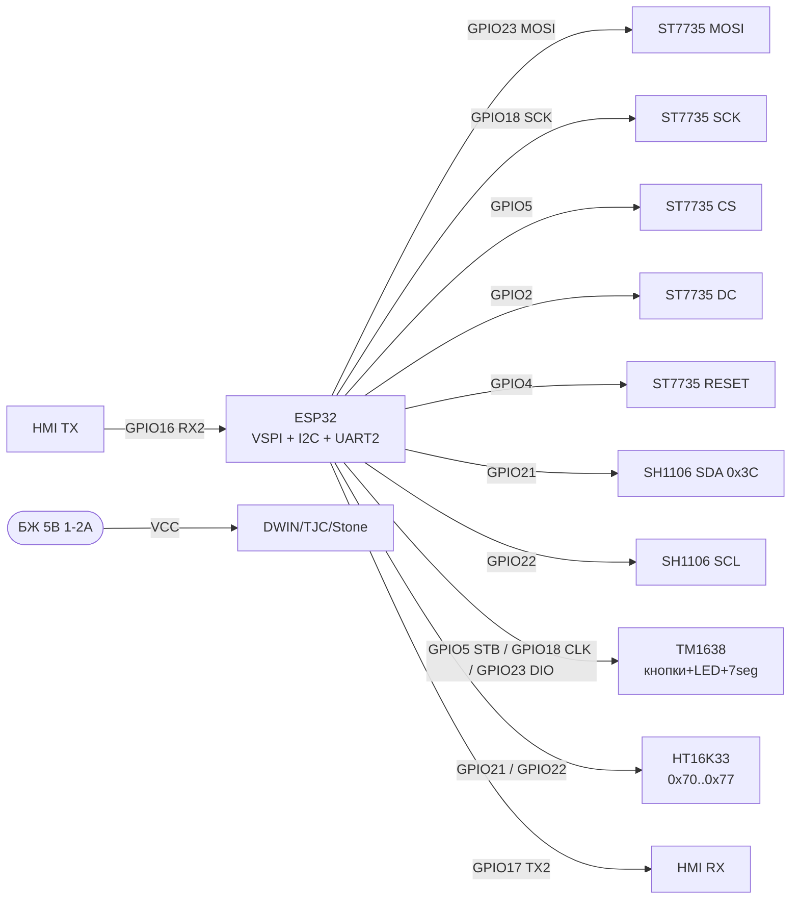
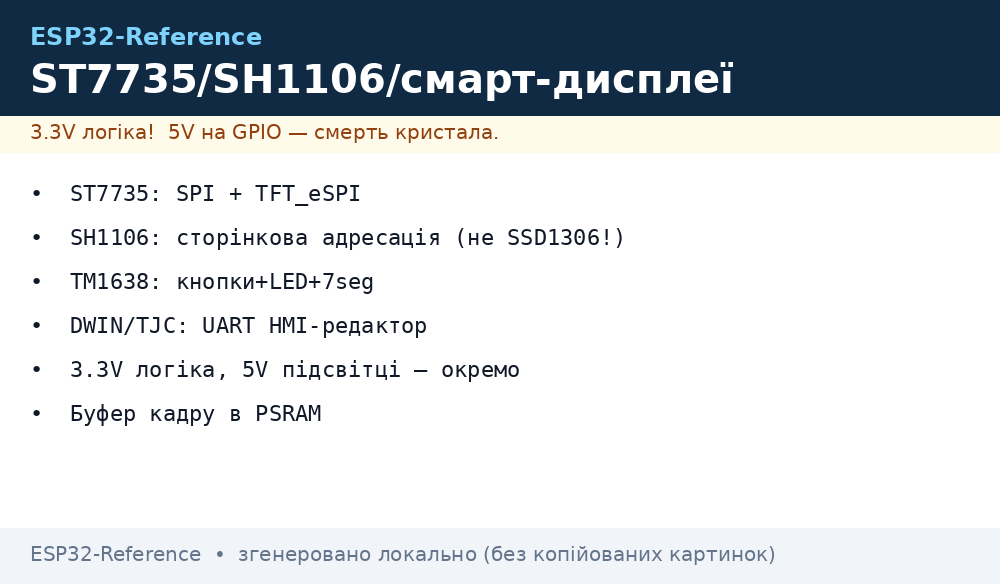

# Дисплеї 2 - TFT SPI, SH1106/SSD1309, HX8357, TM1638, HT16K33, розумні HMI

## Призначення

Розширений огляд дисплейних модулів для ESP32: кольорові TFT на SPI (ST7735 1.8", HX8357 3.5"),
монохромні OLED-контролери SH1106 та SSD1309 (чим відрізняються від SSD1306),
LED-контролери з кнопками TM1638 і I2C-матричний драйвер HT16K33,
а також розумні UART-дисплеї DWIN / TJC (TJC - клон Nextion) / Stone з власним HMI-редактором.
Базовий OLED SSD1306 - див. [01-OLED-SSD1306](../../../ESP32-Reference/11-Vivid/01-OLED-SSD1306.md), TFT/EPaper - [02-TFT-LCD-Epaper](../../../ESP32-Reference/11-Vivid/02-TFT-LCD-Epaper.md),
7-сегментні MAX7219/TM1637 - [05-MAX7219-TM1637-74HC595](../../../ESP32-Reference/11-Vivid/05-MAX7219-TM1637-74HC595.md), Nextion/LCD2004 - [08-DFPlayer-MAX98357-Nextion-LCD2004](../../../ESP32-Reference/11-Vivid/08-DFPlayer-MAX98357-Nextion-LCD2004.md).

## Характеристики

| Модуль | Діагональ / роздільність | Інтерфейс | Живлення / логіка | Особливість |
| --- | --- | --- | --- | --- |
| ST7735 1.8" TFT | 1.8", 128×160, 18-біт (262144 кольори) | SPI 4-wire + DC/RES/CS, слот microSD | 3.3 В (модулі з LDO), логіка 3.3 В OK | Бібліотека TFT_eSPI, швидкий фреймбуфер |
| SH1106 1.3" OLED | 1.3", 128×64 монохром | I2C (адреса 0x3C/0x3D) | 3.3 В | 132×64 GDDRAM зі зсувом 2 px - потрібен свій драйвер! |
| SSD1309 2.42" OLED | 2.42", 128×64 монохром | SPI / I2C (перемички BS1/BS2) | 3.3 В | Більший екран, зовнішній charge-pump, драйвер окремий від SSD1306 |
| HX8357 3.5" TFT | 3.5", 320×480, 16-біт | SPI або 8/16-біт parallel | 3.3 В, підсвітка ~100-150 мА | Великий екран, потрібен PSRAM/спрайт-буфер |
| TM1638 | 8×7-seg + 8 LED + 8 кнопок | 3-wire (STB/CLK/DIO) | 3.3-5 В | Все в одному чипі: індикація + клавіатура |
| HT16K33 | LED-матриці 8×8 / 16×8, 7-seg до 8 цифр | I2C (адреси 0x70-0x77) | 3.3-5 В | Апаратне мультиплексування + димінг 1/16, переривання INT |
| DWIN / TJC / Stone | 2.4"-7.0" TFT з тачем | UART (TTL, типово 115200) | 5 В окремий БЖ | GUI малюється в HMI-редакторі, ESP32 лише шле команди |

> SH1106 ≠ SSD1306: у SH1106 сторінкова адресація 132×64, тому драйвер SSD1306 дає зсув картинки на 2 px.
> SSD1309 - окремий контролер для великих OLED 2.42", сумісності з SSD1306 немає на рівні ініціалізації.

## Легенда пінів модуля

### ST7735 1.8" TFT (SPI, типовий модуль з microSD)

| Пін | Позначення | Тип | Куди на ESP32 | Примітка |
| --- | --- | --- | --- | --- |
| 1 | VCC | Живлення вхід | 3V3 (або 5V якщо є LDO) | Рекомендовано 3.3 В |
| 2 | GND | Земля | GND | Спільна земля |
| 3 | CS (TFT_CS) | Вхід CS, active low | GPIO5 | Chip Select дисплея |
| 4 | RESET (RST) | Вхід reset | GPIO4 (будь-який GPIO) | Апаратний скид, active low |
| 5 | A0 / DC | Вхід цифровий | GPIO2 (будь-який GPIO) | Data/Command: HIGH = дані, LOW = команда |
| 6 | SDA / MOSI | Вхід SPI | GPIO23 (VSPI MOSI) | ESP32 → дисплей |
| 7 | SCK | Вхід SPI | GPIO18 (VSPI SCK) | Тактування до 40 МГц |
| 8 | LED (BL) | Вхід живлення | 3V3 або GPIO через PWM | Підсвітка ~50 мА, можна димити ШІМ |
| 9 | SD_CS | Вхід CS карти | GPIO13 (будь-який GPIO) | Не використовувати без карти - підтягти HIGH |

### SH1106 1.3" OLED (I2C, 4-pin)

| Пін | Позначення | Тип | Куди на ESP32 | Примітка |
| --- | --- | --- | --- | --- |
| 1 | VCC | Живлення вхід | 3V3 | Тільки 3.3 В |
| 2 | GND | Земля | GND | Спільна земля |
| 3 | SCL | Вхід I2C | GPIO22 | 400 кГц, pull-up на модулі |
| 4 | SDA | Вхід/вихід I2C | GPIO21 | 400 кГц, pull-up на модулі |

> Відмінність від SSD1306 - сторінкова адресація: GDDRAM 132×64, видимі 128×64 зі зсувом 2 колонки.
> Драйвер: `U8G2_SH1106_128X64_NONAME_F_HW_I2C`, `Adafruit_SH110X`. Адреса та ж: 0x3C (SA0=0) / 0x3D (SA0=1).

### SSD1309 2.42" OLED (SPI/I2C, перемички BS1/BS2)

| Пін | Позначення | Тип | Куди на ESP32 | Примітка |
| --- | --- | --- | --- | --- |
| 1 | VCC | Живлення вхід | 3V3 | Логіка і панель 3.3 В |
| 2 | GND | Земля | GND | Спільна земля |
| 3 | SCL / SCK | Вхід | GPIO22 (I2C) або GPIO18 (SPI) | Залежить від BS1/BS2 |
| 4 | SDA / MOSI | Вхід/вихід | GPIO21 (I2C) або GPIO23 (SPI) | I2C-адреса 0x3C |
| 5 | RES | Вхід reset | GPIO4 | Active low |
| 6 | DC | Вхід цифровий | GPIO2 | Тільки у SPI-режимі |
| 7 | CS | Вхід CS | GPIO5 | Тільки у SPI-режимі, в I2C - на GND |

### HX8357 3.5" TFT 320×480 (SPI-версія)

| Пін | Позначення | Тип | Куди на ESP32 | Примітка |
| --- | --- | --- | --- | --- |
| 1 | VCC | Живлення вхід | 3V3 | Споживання з підсвіткою до 150 мА |
| 2 | GND | Земля | GND | Товсті короткі дроти |
| 3 | CS | Вхід CS, active low | GPIO5 | Chip Select |
| 4 | RESET | Вхід reset | GPIO4 | Active low |
| 5 | DC/RS | Вхід цифровий | GPIO2 | Data/Command |
| 6 | MOSI | Вхід SPI | GPIO23 | Дані ESP32 → дисплей |
| 7 | SCK | Вхід SPI | GPIO18 | SPI 20-40 МГц |
| 8 | LED/BL | Вхід | 3V3 або PWM GPIO | Підсвітка, можна ШІМ-димінг |
| 9 | MISO | Вихід SPI | GPIO19 | Читання GRAM (опційно) |
| 10 | T_CS | Вхід CS тачу | GPIO15 | XPT2046, опційно |
| 11 | T_IRQ | Вихід переривання | GPIO27 або NC | Дотик, опційно |

### TM1638 (модуль з кнопками, LED і 7-сегментами)

| Пін | Позначення | Тип | Куди на ESP32 | Примітка |
| --- | --- | --- | --- | --- |
| 1 | VCC | Живлення вхід | 3V3 або 5V | Логіка толерантна до 3.3 В |
| 2 | GND | Земля | GND | Спільна земля |
| 3 | STB | Вхід строб, active low | GPIO5 | Аналог CS |
| 4 | CLK | Вхід тактування | GPIO18 | Генерує ESP32 |
| 5 | DIO | Двонапрямлена | GPIO23 | Дані + зчитування кнопок |

### HT16K33 (I2C LED-драйвер, backpack-модулі)

| Пін | Позначення | Тип | Куди на ESP32 | Примітка |
| --- | --- | --- | --- | --- |
| 1 | VCC | Живлення вхід | 3V3 або 5V | Залежить від LED-матриці |
| 2 | GND | Земля | GND | Спільна земля |
| 3 | SCL | Вхід I2C | GPIO22 | 400 кГц |
| 4 | SDA | Вхід/вихід I2C | GPIO21 | Адреси 0x70-0x77 (перемички A0-A2) |
| 5 | INT | Вихід, active low | GPIO26 або NC | Переривання keyscan (тільки версії з клавіатурою) |

### Розумний дисплей DWIN / TJC / Stone (UART HMI)

| Пін | Позначення | Тип | Куди на ESP32 | Примітка |
| --- | --- | --- | --- | --- |
| 1 | VCC | Живлення вхід | 5V окремий БЖ 1-2 А | НЕ від 5V-піна DevKit для 5"+! |
| 2 | GND | Земля | GND | Спільна з ESP32 обов'язково |
| 3 | TX (дисплея) | Вихід UART | GPIO16 (RX2 ESP32) | Перехресно: TX→RX |
| 4 | RX (дисплея) | Вхід UART | GPIO17 (TX2 ESP32) | Перехресно: RX→TX, рівень 3.3 В OK |

> TJC - сумісний клон Nextion (той же редактор і протокол). Stone/DWIN - власні редактори,
> протокол інший. ESP32 GUI не малює - лише шле/приймає команди по UART 115200.

## Схема підключення

| ESP32 | ST7735 (головний приклад) | SH1106 | TM1638 | HT16K33 | HMI-UART |
| --- | --- | --- | --- | --- | --- |
| 3V3 | VCC | VCC | VCC | VCC | - (дисплей від 5 В БЖ) |
| GND | GND | GND | GND | GND | GND (спільна!) |
| GPIO18 | SCK | - | CLK | - | - |
| GPIO23 | SDA/MOSI | - | DIO | - | - |
| GPIO5 | CS | - | STB | - | - |
| GPIO2 | DC (A0) | - | - | - | - |
| GPIO4 | RESET | - | - | - | - |
| GPIO22 | - | SCL | - | SCL | - |
| GPIO21 | - | SDA | - | SDA | - |
| GPIO16 | - | - | - | - | TX дисплея |
| GPIO17 | - | - | - | - | RX дисплея |

Живлення: TFT-підсвітка ST7735 ~50 мА, HX8357 ~100-150 мА - вистачає 3V3 DevKit;
розумні HMI 5"+ (до 1-2 А) - тільки окремий БЖ 5 В, див. [01-Lancjugi-zhivlennya](../../../ESP32-Reference/02-Zhivlennya/01-Lancjugi-zhivlennya.md).
Шина SPI - [SPI](../../../ESP32-Reference/04-Shini/02-SPI.md), I2C - [I2C](../../../ESP32-Reference/04-Shini/03-I2C.md), UART - [UART](../../../ESP32-Reference/04-Shini/01-UART.md).

### ASCII-схема

```text
ESP32 DevKit              ST7735 1.8" TFT (SPI)
------------              ---------------------
3V3 ────────────────────► VCC
GND ────────────────────► GND
GPIO5 ──────────────────► CS (TFT_CS)
GPIO4 ──────────────────► RESET
GPIO2 ──────────────────► DC/A0 (HIGH=дані, LOW=команда)
GPIO23 ─────────────────► SDA/MOSI
GPIO18 ─────────────────► SCK (до 40 МГц)
3V3 ────────────────────► LED/BL (або GPIO+PWM для димінгу)
GPIO13 ─────────────────► SD_CS (HIGH якщо карти немає)

ESP32 DevKit              SH1106 1.3" / SSD1309-I2C
------------              ------------------------
3V3 ────────────────────► VCC
GND ────────────────────► GND
GPIO22 ─────────────────► SCL (400 кГц)
GPIO21 ─────────────────► SDA (адреса 0x3C; зсув 2 px — драйвер SH1106!)

ESP32 DevKit              TM1638 (кнопки+LED+7seg)
------------              -----------------------
3V3/5V ─────────────────► VCC
GND ────────────────────► GND
GPIO5 ──────────────────► STB
GPIO18 ─────────────────► CLK
GPIO23 ────────────────►► DIO (двонапрямлена!)

ESP32 DevKit              HT16K33 backpack (I2C матриця)
------------              -----------------------------
3V3/5V ─────────────────► VCC
GND ────────────────────► GND
GPIO22 ─────────────────► SCL
GPIO21 ─────────────────► SDA (0x70..0x77 перемичками A0-A2)
GPIO26 ◄───────────────── INT (опційно)

ESP32 DevKit              DWIN/TJC/Stone HMI (UART)
------------              ------------------------
GND ═════════════════════ GND (спільна обов'язково!)
GPIO16 (RX2) ◄──────────── TX дисплея
GPIO17 (TX2) ────────────► RX дисплея
[5V БЖ 1-2А] ────────────► VCC дисплея (НЕ від DevKit!)
Baud: 115200 8N1, перехресно TX-RX
```

### Mermaid




*Рис. Підключення ST7735 по SPI, SH1106 по I2C, TM1638/HT16K33 та UART HMI-дисплея. Місце під схему - див. .*

## Код ESP-IDF

```c
#include <stdio.h>
#include "driver/spi_master.h"
#include "driver/i2c.h"
#include "driver/uart.h"

// --- ST7735 через SPI (спрощено: ініціалізація + заливка) ---
#define TFT_HOST SPI2_HOST
#define PIN_MOSI 23
#define PIN_SCLK 18
#define PIN_CS   5
#define PIN_DC   2
#define PIN_RST  4

static spi_device_handle_t tft;

static void tft_cmd(uint8_t c)
{
    gpio_set_level(PIN_DC, 0);
    spi_transaction_t t = { .length = 8, .tx_buffer = &c, .flags = SPI_TRANS_USE_TXDATA };
    // спрощено: реальний код тримає CS через spi_device_transmit
    spi_device_transmit(tft, &t);
}

void app_main(void)
{
    // SPI-шина для ST7735
    spi_bus_config_t bus = {
        .mosi_io_num = PIN_MOSI, .sclk_io_num = PIN_SCLK,
        .miso_io_num = -1, .quadwp_io_num = -1, .quadhd_io_num = -1,
    };
    spi_bus_initialize(TFT_HOST, &bus, SPI_DMA_CH_AUTO);
    spi_device_interface_config_t dev = {
        .clock_speed_hz = 40 * 1000 * 1000, .mode = 0,
        .spics_io_num = PIN_CS, .queue_size = 4,
    };
    spi_bus_add_device(TFT_HOST, &dev, &tft);
    // Далі: MADCTL/COLMOD/CASET/RASET/RAMWR за даташитом ST7735,
    // зручніше — компонент esp_lcd (esp_lcd_new_panel_st7735).

    // I2C для SH1106 (адреса 0x3C) / HT16K33 (0x70): шина одна
    i2c_config_t icfg = {
        .mode = I2C_MODE_MASTER,
        .sda_io_num = 21, .scl_io_num = 22,
        .sda_pullup_en = GPIO_PULLUP_ENABLE,
        .scl_pullup_en = GPIO_PULLUP_ENABLE,
        .master.clk_speed = 400000,
    };
    i2c_param_config(I2C_NUM_0, &icfg);
    i2c_driver_install(I2C_NUM_0, icfg.mode, 0, 0, 0);
    // SH1106: слати команди 0x00-префіксом, дані 0x40-префіксом,
    // пам'ятати про зсув колонок +2 (column addr 2..133)!

    // UART2 для HMI (TJC-протокол приклад):
    uart_config_t ucfg = {
        .baud_rate = 115200, .data_bits = UART_DATA_8_BITS,
        .parity = UART_PARITY_DISABLE, .stop_bits = UART_STOP_BITS_1,
        .flow_ctrl = UART_HW_FLOWCTRL_DISABLE,
    };
    uart_param_config(UART_NUM_2, &ucfg);
    uart_set_pin(UART_NUM_2, 17, 16, UART_PIN_NO_CHANGE, UART_PIN_NO_CHANGE);
    uart_driver_install(UART_NUM_2, 1024, 1024, 0, NULL, 0);
    const char *cmd = "t0.txt=\"T=24.5C\"";
    uart_write_bytes(UART_NUM_2, cmd, 12);
    uint8_t end[3] = {0xFF, 0xFF, 0xFF};  // термінатор TJC/Nextion-команди
    uart_write_bytes(UART_NUM_2, (char *)end, 3);
}
```

## Код Arduino

```cpp
// ST7735 1.8" через TFT_eSPI (налаштування — у User_Setup.h!)
#include <TFT_eSPI.h>
TFT_eSPI tft = TFT_eSPI();
void setup_st7735() {
  tft.init();
  tft.setRotation(1);
  tft.fillScreen(TFT_BLACK);
  tft.setTextColor(TFT_WHITE, TFT_BLACK);
  tft.drawString("ESP32 ST7735 OK", 10, 10, 2);
  tft.drawString("T=24.5C", 10, 30, 2);
}

// SH1106 1.3" через U8g2 (зсув 2px враховано драйвером!)
#include <U8g2lib.h>
U8G2_SH1106_128X64_NONAME_F_HW_I2C u8g2(U8G2_R0, U8X8_PIN_NONE);
void setup_sh1106() {
  Wire.begin(21, 22);
  u8g2.begin();
  u8g2.clearBuffer();
  u8g2.setFont(u8g2_font_ncenB08_tr);
  u8g2.drawStr(0, 12, "SH1106 OK");
  u8g2.sendBuffer();
}

// TM1638: кнопки + LED + 7-сегментів (бібліотека TM1638 - rjbatista)
#include <TM1638.h>
TM1638 tm(23 /*DIO*/, 18 /*CLK*/, 5 /*STB*/);
void loop_tm1638() {
  uint8_t keys = tm.getButtons();       // бітова маска 8 кнопок
  tm.setLED(1, keys & 0x01);            // LED0 за кнопкою S1
  tm.displayText("24.5 55");            // 8 символів на 7-сегментів
  delay(100);
}

// HT16K33 матриця 8x8 (бібліотека Adafruit_LEDBackpack)
#include <Adafruit_LEDBackpack.h>
Adafruit_8x8matrix m8x8 = Adafruit_8x8matrix();
void setup_ht16k33() {
  m8x8.begin(0x70);
  m8x8.setBrightness(8);                // 0..15
  m8x8.setRotation(1);
  m8x8.drawPixel(3, 3, LED_ON);
  m8x8.writeDisplay();
}

// HMI (TJC/Nextion-протокол): текст + термінатор FF FF FF
void hmi_set_text(const char *obj, const char *txt) {
  Serial2.printf("%s.txt=\"%s\"", obj, txt);
  Serial2.write(0xFF); Serial2.write(0xFF); Serial2.write(0xFF);
}
void setup() {
  Serial.begin(115200);
  Serial2.begin(115200, SERIAL_8N1, 16, 17);  // RX=16, TX=17
  setup_st7735();
  setup_sh1106();
  m8x8.begin(0x70);
  hmi_set_text("t0", "ESP32 OK");
}
void loop() {
  loop_tm1638();
}
```

## Код MicroPython

```python
from machine import SPI, I2C, Pin, UART
import time

# --- ST7735 1.8" (драйвер st7735.py з репозиторію) ---
spi = SPI(2, baudrate=40000000, sck=Pin(18), mosi=Pin(23))
from st7735 import ST7735
tft = ST7735(spi, cs=Pin(5), dc=Pin(2), rst=Pin(4), width=160, height=128)
tft.fill(0x0000)
tft.text("ESP32 ST7735 OK", 5, 5, 0xFFFF)

# --- SH1106 1.3": драйвер sh1106.py, НЕ ssd1306! ---
i2c = I2C(0, scl=Pin(22), sda=Pin(21), freq=400000)
print("I2C:", [hex(a) for a in i2c.scan()])  # чекаємо 0x3c
import sh1106
oled = sh1106.SH1106_I2C(128, 64, i2c, addr=0x3C)
oled.fill(0)
oled.text("SH1106 OK +2px", 0, 0)  # драйвер сам компенсує зсув колонок
oled.show()

# --- HT16K33 матриця (мінімальний I2C без бібліотеки) ---
HT = 0x70
i2c.writeto(HT, bytes([0x21]))   # oscillator on
i2c.writeto(HT, bytes([0x81]))   # display on, no blink
i2c.writeto(HT, bytes([0xE8]))   # brightness 8/16
i2c.writeto_mem(HT, 0x00, bytes([0xFF, 0x00] * 8))  # тестовий візерунок

# --- TM1638 біт-бенг (STB/CLK/DIO) ---
stb, clk, dio = Pin(5, Pin.OUT), Pin(18, Pin.OUT), Pin(23, Pin.OUT)
def tm_send(b):
    for i in range(8):
        dio.value((b >> i) & 1); clk.value(1); clk.value(0)
stb.value(0); tm_send(0x8F); stb.value(1)  # display on, max brightness

# --- HMI UART (TJC/Nextion-протокол) ---
hmi = UART(2, baudrate=115200, tx=17, rx=16)
hmi.write(b't0.txt="ESP32 OK"')
hmi.write(bytes([0xFF, 0xFF, 0xFF]))
time.sleep_ms(50)
if hmi.any():
    print("HMI reply:", hmi.read())
```

## Типові помилки

1. **SH1106 з драйвером SSD1306** → картинка зсунута на 2 px / сміття. Використати `U8G2_SH1106_...` або `Adafruit_SH110X`.
2. **SSD1309 ініціалізують як SSD1306** → чорний екран. SSD1309 має свій init-sequence (charge-pump, COM-конфіг) і BS-перемички режиму.
3. **TFT_eSPI без User_Setup** → білий/чорний екран. Піни CS/DC/RST і драйвер задаються в `User_Setup.h`, а не в скетчі.
4. **HX8357 без буфера** → мерехтіння/повільність. Використати спрайт у PSRAM або DMA, оновлювати тільки змінені зони.
5. **TM1638 читають як SPI** → кнопки не працюють. DIO двонапрямлена: перед читанням перевести пін у INPUT.
6. **HT16K33 не стартує** → забули `0x21` (oscillator on). Без нього дисплей мовчить при правильній адресі.
7. **HMI без термінатора `FF FF FF`** → команда ігнорується. Кожна TJC/Nextion-команда закінчується трьома 0xFF.
8. **HMI живлять від DevKit** → ребут при підсвітці. Екрани 5"+ їдять 1-2 А - окремий БЖ 5 В + спільний GND.
9. **TX-TX / RX-RX у HMI** → тиша. UART перехресно: TX дисплея → RX ESP32 (GPIO16), RX дисплея ← TX ESP32 (GPIO17).
10. **Антени/друковані шлейфи TFT біля WiFi** → смуги на екрані. Віднести шлейф від антени ESP32, додати 100 нФ за живленням.

## Офіційні джерела

- [ST7735 1.8" TFT - сторінка товару з фото (Adafruit)](https://www.adafruit.com/product/358) - 128×160, 18-біт, microSD, EYESPI.
- [ST7735 1.8" TFT - гайд з кодом (Adafruit Learn)](https://learn.adafruit.com/1-8-tft-display) - розпіновка, бібліотека, приклади.
- [TFT_eSPI - бібліотека з кодом (GitHub Bodmer)](https://github.com/Bodmer/TFT_eSPI) - User_Setup, ST7735/HX8357, приклади.
- [HT16K33 LED Backpack - огляд з кодом (Adafruit Learn)](https://learn.adafruit.com/adafruit-led-backpack/overview) - матриці, адреси 0x70-0x77, бібліотека.
- [Розумні HMI-дисплеї - редактор і протокол (Nextion)](https://nextion.tech/editor_guide/) - UART HMI, Instruction Set, Editor.

## Див. також

- [Home](../../../ESP32-Reference/Home.md)
- [01-OLED-SSD1306](../../../ESP32-Reference/11-Vivid/01-OLED-SSD1306.md)
- [02-TFT-LCD-Epaper](../../../ESP32-Reference/11-Vivid/02-TFT-LCD-Epaper.md)
- [05-MAX7219-TM1637-74HC595](../../../ESP32-Reference/11-Vivid/05-MAX7219-TM1637-74HC595.md)
- [08-DFPlayer-MAX98357-Nextion-LCD2004](../../../ESP32-Reference/11-Vivid/08-DFPlayer-MAX98357-Nextion-LCD2004.md)
- [01-GPIO-oglyad](../../../ESP32-Reference/03-GPIO/01-GPIO-oglyad.md)
- [04-Pererivannya-PWM](../../../ESP32-Reference/03-GPIO/04-Pererivannya-PWM.md)
- [UART](../../../ESP32-Reference/04-Shini/01-UART.md)
- [SPI](../../../ESP32-Reference/04-Shini/02-SPI.md)
- [I2C](../../../ESP32-Reference/04-Shini/03-I2C.md)
- [01-Lancjugi-zhivlennya](../../../ESP32-Reference/02-Zhivlennya/01-Lancjugi-zhivlennya.md)
- [02-Troubleshooting-FAQ](../../../ESP32-Reference/99-Dodatki/02-Troubleshooting-FAQ.md)
