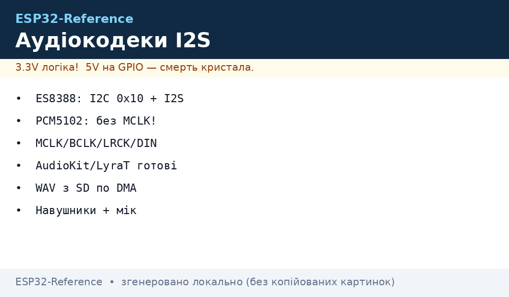
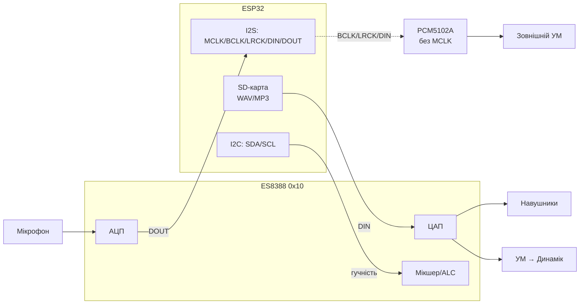

# Аудіо-кодеки на ESP32 - ES8388, AC101, WM8978, PCM5102A, LyraT/Korvo/S3-BOX

> [!info] Кодек ≠ просто ЦАП
> Кодек (ES8388/AC101/WM8978) - це АЦП + ЦАП: і мікрофон/лінія на вхід, і навушники/динамік на вихід, керування по I2C. PCM5102A - тільки ЦАП (вихід), зате без MCLK і з лінійним виходом під підсилювач.

База звуку: [I2S](../../../ESP32-Reference/04-Shini/04-I2S.md), простіше рішення [DFPlayer/MAX98357A](../../../ESP32-Reference/11-Vivid/08-DFPlayer-MAX98357-Nextion-LCD2004.md), старт [Home](../../../ESP32-Reference/Home.md).

## Призначення

Коли MAX98357A (I2S → динамік без налаштувань) вже мало:

- треба **запис** з мікрофона (голосовий асистент, домофон) - беріть кодек з АЦП: ES8388/AC101/WM8978;
- треба **навушники** з регулюванням гучності і тембру - кодек (а не голий ЦАП);
- треба **максимально чистий лінійний вихід** на зовнішній підсилювач - PCM5102A (без MCLK, менше клопоту з клоком);
- треба **швидкий старт** без розводки - готовий кит: LyraT v4.3, Korvo, S3-BOX.

Коли НЕ брати кодек: озвучка/пищалка (достатньо DFPlayer), один динамік без запису (достатньо MAX98357A).

## Порівняння кодеків

| Параметр | ES8388 | AC101 | WM8978 | PCM5102A |
| --- | --- | --- | --- | --- |
| Тип | кодек (АЦП+ЦАП) | кодек (АЦП+ЦАП) | кодек (АЦП+ЦАП) | тільки ЦАП |
| I2C-адреса | `0x10` | `0x1A` | `0x1A` | немає (без I2C!) |
| Керування | I2C-регістри (гучність, ALC, мікшер) | I2C-регістри | I2C-регістри, еквалайзер | перемички (FMT/FLT/DM) |
| Вхід | мікрофон + лінія (стерео АЦП) | мікрофон + лінія | мікрофон + лінія | немає |
| Вихід | навушники + динамік (2×?) | навушники + лінія | навушники + спікер-драйвер | лінійний 2.1 Vrms (треба УМ!) |
| MCLK | потрібен (від ESP32!) | потрібен | потрібен | НЕ потрібен (вбудований PLL) |
| Бітність/частота | 16/24 біт, до 96 кГц | 16/24 біт, до 96 кГц | 16/32 біт, до 96 кГц | до 32 біт / 384 кГц |
| Де стоїть | LyraT v4.3, AudioKit v2.2 | старі AudioKit v2.1, Orange Pi | DIY-плати, HiFi-шити | DIY ЦАП-модулі (фіолетові плати) |
| Ціна/доступність | дешево, масовий | зникає з продажу | дорожче, HiFi | дешево, масовий |
| Коли | голос + звук, старт за годину | ремонт старої плати | HiFi-навушники | чистий вихід на підсилювач |

> [!warning] AC101 vs WM8978 - одна адреса 0x1A, але різні драйвери!
> Не лийте драйвер ES8388 на плату з AC101: регістри різні, звуку не буде, а шина I2C «повисне» ACK. Завжди звіряйте маркування чіпа з `menuconfig`/дефайном плати.

## Готові аудіо-кити

| Кит | Чіп ESP | Кодек | Мікрофон | Кнопки/екран | Для чого |
| --- | --- | --- | --- | --- | --- |
| LyraT v4.3 | ESP32-WROVER | ES8388 | аналоговий мік + роз'єм | 6 кнопок, microSD, 3.5 мм | базова розробка звуку, ADF-приклади |
| LyraT-Mini | ESP32 | ES8311/ES8388 (за ревізією) | мік | microSD | компактний проєкт |
| ESP32-S3-Korvo-2 | ESP32-S3 | ES8311 (DAC) + ES7210 (ADC) | цифрова матриця міків | LCD, кнопки | голосовий асистент, AI |
| ESP32-S3-BOX / BOX-3 | ESP32-S3 | ES8311 + мікрофони | 2× цифровий мік | LCD touch, датчик | панель керування з голосом |
| AI-Thinker AudioKit v2.2 | ESP32-A1S | ES8388 | мікрофон на платі | microSD, 3.5 мм, динамік-роз'єм | дешевий старт з ES8388 |
| ESP32-P4-Function-EV | ESP32-P4 | ES8311 (за ревізією) | залежить від плати | LCD | аудіо на P4 |

Практика: починайте на LyraT v4.3 або AudioKit v2.2 (обидва ES8388 - код з ноти стане один в один), голосовий проєкт - Korvo-2/S3-BOX.

## Розводка: MCLK/BCLK/LRCK/DIN + I2C-адреси

| Сигнал | Напрям | Куди на ESP32 (приклад LyraT) | Примітка |
| --- | --- | --- | --- |
| MCLK | ESP → кодек | GPIO0 (LyraT) | 256×Fs (12.288 МГц при 48 кГц); обов'язковий для ES8388/AC101/WM8978! |
| BCLK (SCLK) | ESP → кодек | GPIO27 | бітовий клок I2S |
| LRCK (WS) | ESP → кодек | GPIO25 | 44.1/48 кГц, вибір L/R |
| DIN (DACDAT) | ESP → кодек | GPIO26 | музика на вихід |
| DOUT (ADCDAT) | кодек → ESP | GPIO35 | мікрофон/лінія на вхід |
| SDA / SCL | I2C | GPIO18 / GPIO23 (LyraT) | конфіг регістрів; підтяжки 4.7 кОм |
| PA_CTRL | ESP → УМ | GPIO21 (LyraT) | увімкнення підсилювача динаміка |

**I2C-адреси (7-біт):**

| Чіп | Адреса | Як перевірити |
| --- | --- | --- |
| ES8388 | `0x10` | `i2c.scan()` покаже `16` |
| AC101 | `0x1A` | `i2c.scan()` покаже `26` |
| WM8978 | `0x1A` | як AC101 - розрізняйте за маркуванням! |
| ES8311 | `0x18` | Korvo/S3-BOX DAC |
| ES7210 | `0x40` | Korvo-2 ADC (мікрофони) |
| PCF8574 (LCD) | `0x27/0x3F` | не плутати з кодеком на тій самій шині |

> [!warning] MCLK забувають найчастіше
> Без MCLK кодек мовчить або хрипить на всіх фреймворках однаково. Перша діагностика: осцилограф/логічний аналізатор на MCLK (має бути 12.288 МГц), потім `i2c.scan()`, і лише потім код.


*Рис. ES8388: I2C-конфігурація, I2S-потоки, мікрофон на вхід, навушники/динамік на вихід; PCM5102A - тільки I2S без MCLK.*

### ASCII-схема

```text
ESP32 (LyraT v4.3 / AudioKit v2.2)              ES8388 (addr 0x10)
─────────────────────────────────              ──────────────────
GPIO0  ──MCLK (12.288 МГц)──────────────────►  MCLK  (такт АЦП/ЦАП!)
GPIO27 ──BCLK ──────────────────────────────►  SCLK
GPIO25 ──LRCK (48 кГц) ─────────────────────►  LRCK
GPIO26 ──DIN (музика) ──────────────────────►  DACDAT ──► HP_OUT (навушники 3.5мм)
GPIO35 ◄──DOUT (мікрофон)────────────────────  ADCDAT ◄── MIC_IN (мік на платі)
GPIO18/23 SDA/SCL (I2C, 4.7к) ◄──────────────►  I2C (гучність/ALC/мікшер)
GPIO21 ──PA_CTRL ──► підсилювач динаміка ──► SPK

PCM5102A-варіант (тільки вихід, БЕЗ MCLK і I2C):
GPIO ──BCLK/LRCK/DIN──► PCM5102A ──RCA──► зовнішній УМ ──► колонки
```

### Mermaid



## Код - розмова і WAV з SD у 3 фреймворках

**ESP-IDF (ADF pipeline: SD → декодер → ES8388):**

```c
// Проєкт на ESP-ADF (LyraT v4.3): pipeline sd → mp3/wav-decoder → i2s → es8388.
// menuconfig: плата LyraT v4.3 (MCLK=GPIO0, I2C SDA=18/SCL=23, addr 0x10).
#include "audio_pipeline.h"
#include "sdcard_stream.h"
#include "wav_decoder.h"
#include "i2s_stream.h"
#include "es8388.h"

void app_main(void)
{
    audio_pipeline_handle_t pipe;
    audio_pipeline_cfg_t pipe_cfg = DEFAULT_AUDIO_PIPELINE_CONFIG();
    pipe = audio_pipeline_init(&pipe_cfg);

    sdcard_stream_cfg_t sd_cfg = SDCARD_STREAM_CFG_DEFAULT();
    sd_cfg.type = AUDIO_STREAM_READER;          // читаємо /sdcard/*.wav
    audio_element_handle_t sd = sdcard_stream_init(&sd_cfg);

    wav_decoder_cfg_t wav_cfg = DEFAULT_WAV_DECODER_CONFIG();
    audio_element_handle_t dec = wav_decoder_init(&wav_cfg);

    i2s_stream_cfg_t i2s_cfg = I2S_STREAM_CFG_DEFAULT(); // MCLK увімкнено!
    i2s_cfg.type = AUDIO_STREAM_WRITER;
    i2s_cfg.i2s_config.sample_rate = 44100;
    audio_element_handle_t i2s = i2s_stream_init(&i2s_cfg);

    audio_pipeline_register(pipe, sd, "sd");
    audio_pipeline_register(pipe, dec, "dec");
    audio_pipeline_register(pipe, i2s, "i2s");
    audio_pipeline_link(pipe, (const char *[]){"sd", "dec", "i2s"}, 3);

    es8388_config_t codec = { .dac_output = DAC_OUTPUT_ALL, // навушники + динамік
                              .adc_input = ADC_INPUT_LINPUT1_RINPUT1 };
    es8388_init(&codec);
    es8388_set_voice_volume(70);
    es8388_ctrl_state(AUDIO_HAL_CODEC_MODE_BOTH, AUDIO_HAL_CTRL_START);

    audio_pipeline_run(pipe); // грає /sdcard/talk.wav по колу подій
}
```

**Arduino (AudioKit + бібліотека AudioTools, ES8388):**

```cpp
// Arduino-ESP32 + https://github.com/pschatzmann/arduino-audiokit
// Плата: AI-Thinker AudioKit v2.2 (ES8388, addr 0x10). SD: VSPI.
#include "AudioTools.h"
#include "AudioLibs/AudioKit.h"

AudioKit kit;                 // обгортка ES8388: I2C-конфіг + I2S
WAVDecoder wav;               // декодер WAV з SD
File audioFile;
StreamCopy copier(wav, audioFile, kit); // SD → decode → кодек

void setup() {
  Serial.begin(115200);
  auto cfg = kit.defaultConfig();       // MCLK/BCLK/LRCK/DIN під AudioKit
  cfg.sd_active = true;
  cfg.sample_rate = 44100;
  kit.begin(cfg);                       // I2C-перевірка 0x10 всередині
  kit.setVolume(70);

  SD.begin(PIN_AUDIO_KIT_SD_CARD_CS);
  audioFile = SD.open("/talk.wav");     // 16-bit PCM WAV!
  wav.begin();
}

void loop() {
  if (!copier.copy()) {                 // кінець файлу → на початок
    audioFile.seek(0);
  }
  // "Talkie": запис з мікрофона — kit.stream() як джерело замість SD
}
```

**MicroPython (I2S + wave, запис/відтворення WAV):**

```python
# MicroPython: ES8388 конфігуруємо вручну по I2C (addr 0x10), звук — machine.I2S.
# Мінімум для старту: увімкнути DAC-гейн і вихід на навушники (див. даташит ES8388,
# регістри 0x00 chirp/clock, 0x04 DAC power, 0x2E LOUT volume). Повний init — ~20 записів.
from machine import I2C, I2S, Pin, SDCard
import wave, os

CODEC = 0x10
i2c = I2C(0, scl=Pin(23), sda=Pin(18), freq=100000)
assert CODEC in i2c.scan(), "ES8388 не знайдено! Перевір живлення і SDA/SCL"

def es8388_write(reg, val):
    i2c.writeto_mem(CODEC, reg, bytes([val]))

es8388_write(0x00, 0x80)  # reset
es8388_write(0x04, 0x3C)  # DAC power up (L/R)
es8388_write(0x2E, 0x1E)  # гучність навушників (приклад)
# MCLK/BCLK/LRCK генерує I2S-периферія:
audio = I2S(0, sck=Pin(27), ws=Pin(25), sd=Pin(26), mode=I2S.TX,
            bits=16, format=I2S.STEREO, rate=44100, ibuf=4096)

os.mount(SDCard(slot=2), "/sd")          # VSPI SD-модуль
w = wave.open("/sd/talk.wav", "rb")
assert (w.getsampwidth(), w.getnchannels()) == (2, 2), "треба 16-bit stereo WAV"
while True:
    chunk = w.readframes(1024)
    if not chunk:
        w.rewind(); continue
    audio.write(chunk)                   # PCM → ES8388 → навушники
```

> [!tip] Talkie-ефект (робо-голос)
> Ресемпл 44.1 кГц → 8 кГц + 1-бітна квантизація дає «радіо-робота» без бібліотек. У ADF - елемент `sonic`/resample, в Arduino - `ResampleStream`, у MicroPython - проріджування семплів вручну перед `audio.write()`.

## Типові помилки

| Симптом | Причина | Рішення |
| --- | --- | --- |
| Тиша на всіх фреймворках | немає MCLK (ES8388/AC101/WM8978) | перевірити 12.288 МГц на MCLK; у ADF/I2S увімкнути MCLK-вихід |
| `i2c.scan()` порожній | не ті SDA/SCL; немає підтяжок; кодек без живлення | звірити піни плати (LyraT: 18/23); 4.7 кОм до 3V3; AVDD=3.3 В |
| Знайдено `0x1A`, але хрип/тиша | AC101 vs WM8978 - не той драйвер | звірити маркування чіпа і дефайн плати |
| PCM5102A мовчить | чекають I2C/MCLK, яких немає | це нормально: тільки BCLK/LRCK/DIN; перевірити FMT=GND (I2S-режим) |
| Клацання на старті/стопі | УМ увімкнено раніше ЦАП | спочатку `es8388_ctrl_state(START)`, потім `PA_CTRL=1`; mute-рампа |
| Хрип на басах | живлення просідає (динамік 4 Ом!) | окремий БЖ 5 В/2 А на УМ; 470+ мкФ біля живлення |
| WAV не грає | MP3 перейменовано у .wav; 8-біт/моно без конверта | тільки PCM 16-bit; конверт: `ffmpeg -i in.mp3 -ar 44100 -ac 2 out.wav` |
| Запис шумить (фон WiFi) | аналогові доріжки мікрофона поруч з антеною | короткі екран. дроти міка; AGC/ALC у регістрах; рознести антену |
| Гучність «0 або 100» | пишуть у не той регістр гучності | ES8388: LOUT1/ROUT1 (0x2E/0x2F) для навушників, DAC-volume окремо |

## Офіційні джерела

- [ESP-ADF - Programming Guide](https://docs.espressif.com/projects/esp-adf/en/latest/) - pipeline, плати, аудіо-приклади.
- [ESP-ADF Get Started (v2.x) - плати LyraT/Korvo](https://docs.espressif.com/projects/esp-adf/en/release-v2.x/get-started/index.html) - огляд аудіо-китів Espressif.
- [esp-adf - GitHub](https://github.com/espressif/esp-adf) - драйвери ES8388/ES8311/AC101, приклади плеєрів.
- [esp-dev-kits - документація](https://docs.espressif.com/projects/esp-dev-kits/en/latest/) - схеми і піни дев-китів.

## Див. також

- [Home](../../../ESP32-Reference/Home.md)
- [I2S](../../../ESP32-Reference/04-Shini/04-I2S.md) - сигнали, DMA, мікрофон INMP441 + MAX98357A
- [DFPlayer/MAX98357A](../../../ESP32-Reference/11-Vivid/08-DFPlayer-MAX98357-Nextion-LCD2004.md) - звук без кодеків
- [BLE Mesh / A2DP / HID](../../../ESP32-Reference/05-Radio/05-BLE-Mesh-A2DP-HID.md) - A2DP-sink на цей же ЦАП
- [Matter/Thread/Zigbee](../../../ESP32-Reference/15-Protokoli/09-Matter-Thread-Zigbee.md) - голосові пристрої в екосистемах
- [SD/SDIO](../../../ESP32-Reference/04-Shini/07-SD-SDIO.md) - звідки грати WAV/MP3
- [I2C](../../../ESP32-Reference/04-Shini/03-I2C.md) - сканер адрес, підтяжки для конфігу кодеків
