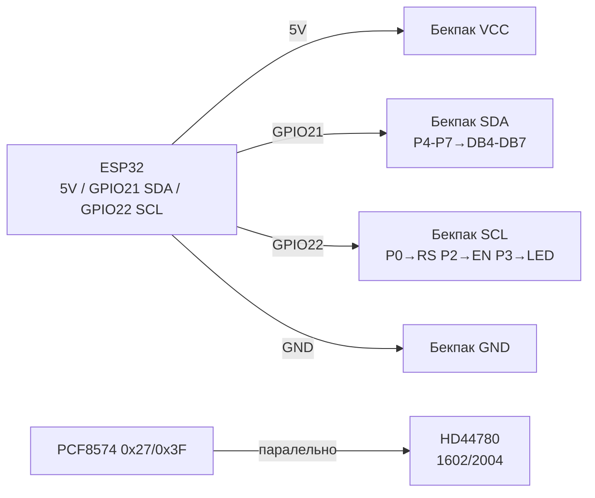
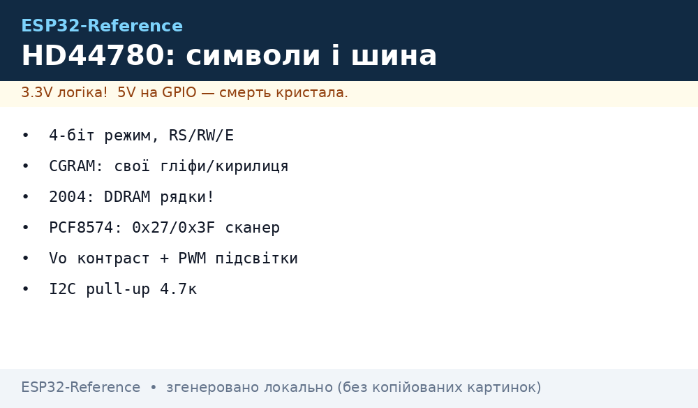

# LCD символьні HD44780 / KS0066 / ST7066 - 1602/2004 вглиб

## Призначення

Символьні LCD (16×2, 20×4) на контролерах HD44780 / KS0066 / ST7066 -
найдешевший текстовий вивід: меню кавоварки, лічильники, статуси реле,
налагодження без комп'ютера. Працюють роками, читаються без підсвітки
під кутом, живуть від 5 В.

Нота - вглиб, а не «hello world»: 4-бітний режим (6 GPIO замість 11);
свої символи CGRAM (градус, батарея, стрілки, прогрес-бар); великі цифри
з кастомних гліфів; різниця адресації DDRAM у 1602 vs 2004 (чому 3-й рядок
«стрибає»); контраст Vo і PWM підсвітки; мапінг бітів PCF8574-бекпака
і конфлікти адрес 0x27 / 0x3F (сканер!); код LiquidCrystal_I2C;
кирилиця (її НЕМАЄ в ROM - тільки свої гліфи!).

> Бачиш «кубики» в першому рядку - це НЕ смерть,
> це неініціалізований HD44780 (живлення є, init не пройшов / контраст не той).

## Характеристики

| Параметр | Значення |
| --- | --- |
| Контролери | HD44780 (Hitachi-оригінал), KS0066 (Samsung-клон), ST7066 (Sitronix-клон) - сумісні за командами |
| Формати | 1602 (16×2), 2004 (20×4), рідше 0802 / 1604 / 4002 |
| Матриця символу | 5×8 точок (8-й рядок - курсор), CGRAM - 8 слотів 0-7 |
| ROM-знакогенератор | A00 (японська катакана) або A02 (європейська з діакритикою); КИРИЛИЦІ НЕМАЄ в жодному! |
| Інтерфейс голий | 8-біт (DB0-DB7) або 4-біт (DB4-DB7) + RS + EN (+ RW на землю) |
| Інтерфейс через бекпак | I2C PCF8574: SDA/SCL, адреси 0x27 / 0x3F (рідше 0x20-0x26) |
| Живлення | Логіка 5 В (деякі 3.3 В-версії з ICL7660); підсвітка LED ~4.2 В / 20-120 мА |
| Контраст | Vo (пін 3) через потенціометр 10 кОм між VCC-GND; без нього - «порожньо» або «кубики» |
| Струм | Логіка ~1-2 мА + підсвітка 20-100 мА (через транзистор бекпака!) |
| Швидкість | EN-цикл ~1 мкс; `clear()` ~1.5 мс - не слати команди частіше без затримок! |
| Температура | 0…+50 °C типово; на морозі символи «повзуть» (повільний LC) |
| Бібліотеки | LiquidCrystal (паралель), LiquidCrystal_I2C / LCD_I2C (бекпак), HD44780 (Bill Perry, найповніша) |

### 4-бітний режим - чому всі так роблять

| Режим | Піни даних | Всього GPIO | Коли брати |
| --- | --- | --- | --- |
| 8-біт | DB0-DB7 + RS + EN | 10 (+RW) | Ніколи на ESP32 (марнотратство пінів) |
| 4-біт | DB4-DB7 + RS + EN | 6 | Голий LCD без бекпака, навчальний стенд |
| I2C-бекпак | SDA + SCL | 2 | Бойовий варіант: 2 дроти, адресація, підсвітка командою |

У 4-бітному режимі кожен байт шлеться двома напівбайтами (старший → молодший),
бібліотека LiquidCrystal робить це сама: `LiquidCrystal(rs, en, d4, d5, d6, d7)`.
RW притискають до GND (тільки запис) - читання busy-flag не потрібне,
затримки вшиті в бібліотеку.

### DDRAM-адресація: 1602 vs 2004 (головний підступ!)

| Рядок | 1602 (16×2) адреса | 2004 (20×4) адреса | Довжина |
| --- | --- | --- | --- |
| 0 | 0x00-0x0F | 0x00-0x13 | 16 / 20 |
| 1 | 0x40-0x4F | 0x40-0x53 | 16 / 20 |
| 2 | - | 0x14-0x27 | Тільки 2004! |
| 3 | - | 0x54-0x67 | Тільки 2004! |

Наслідки:

- Рядки 2004 йдуть НЕ підряд: порядок адрес 0, 1, 2, 3 = 0x00, 0x40, 0x14, 0x54.
  Тому «бібліотека для 1602» на 2004 пише 3-й рядок зі зсувом на 4 символи -
  класичний баг з `setCursor(0,2)`.
- Рішення: передавати правильну геометрію `LiquidCrystal_I2C(0x27, 20, 4)`,
  ніколи `16, 2` на фізичному 2004!
- 40-символьний контролер обрізає рядок до вікна: символи 16-39 існують
  у DDRAM, але невидимі - туди можна «ховати» текст для прокрутки.

### CGRAM - свої символи (8 слотів)

Кожен слот - 8 байтів (5 молодших біт кожного = точки рядка):

| Слот | Гліф | Байти (приклад) | Використання |
| --- | --- | --- | --- |
| 0 | Градус `°` | 0x06,0x09,0x09,0x06,0x00,0x00,0x00,0x00 | `24°C` |
| 1 | Батарея-рамка | 0x0E,0x1B,0x11,0x11,0x11,0x11,0x11,0x1F | Індикатор заряду |
| 2 | Стрілка вгору | 0x04,0x0E,0x15,0x04,0x04,0x04,0x04,0x00 | Меню/тренди |
| 3 | Стрілка вниз | 0x00,0x04,0x04,0x04,0x04,0x15,0x0E,0x04 | Меню/тренди |
| 4-6 | Прогрес 1/3, 2/3, 3/3 | Стовпчики 0x10/0x18/0x1C… | Бар-граф 0-100% |
| 7 | Галочка OK | 0x00,0x01,0x03,0x16,0x1C,0x08,0x00,0x00 | Статуси |

Обмеження: всього 8! Для кирилиці + іконок одночасно не вистачить -
перезавантажувати CGRAM при зміні екрану (`createChar` перед кожним екраном).

### Великі цифри (double-size)

Прийом: цифра 0-9 малюється двома рядками по 3 кастомних гліфи
(верх/низ половинки). Потрібно 6 слотів на набір - тому великі цифри
займають ВСЮ CGRAM і несумісні з одночасною кирилицею на тому ж екрані.
Чергувати: екран «годинник» (великі цифри) vs екран «меню» (кирилиця).

### Контраст Vo + підсвітка

- **Vo (пін 3):** 0-1 В для видимих символів (не 2.5 В «посередині»!).
  Потенціометр 10 кОм: VCC-Vo-GND. Без бекпака - крутити ОБОВ'ЯЗКОВО.
  На I2C-бекпаку потенціометр вже розпаяний (синій кубик) - крутити викруткою.
- **Підсвітка (піни 15/16, A/K):** LED через резистор ~100 Ом на модулі.
  Струм 20-100 мА - НЕ з GPIO безпосередньо! На бекпаку - транзистор,
  керування `lcd.backlight()` / `lcd.noBacklight()`.
- **PWM-диммінг:** відпаяти перемичку J (LED) на бекпаку → пін катода
  через N-MOSFET на GPIO з `ledc` 5 кГц. Або залишити J і миритися з ON/OFF.

## Легенда пінів модуля

Голий HD44780 (16 пінів) + що робить PCF8574-бекпак:

| Пін LCD | Позначення | Тип | Куди / через бекпак | Примітка |
| --- | --- | --- | --- | --- |
| 1 | VSS | GND | GND | Земля |
| 2 | VDD | +5 В | 5V (VU/VIN!) | 5 В! Від 3V3 - тьмяно/порожньо |
| 3 | Vo | Контраст | Потенціометр 10 кОм | 0-1 В; на бекпаку - синій підстроєчник |
| 4 | RS | Вибір регістр | Бекпак P0 | 0 = команда, 1 = дані |
| 5 | RW | Читання/запис | GND (запис) | На бекпаку притиснуто до GND |
| 6 | EN | Строб | Бекпак P2 | Фронт записує напівбайт |
| 7-10 | DB0-DB3 | Дані | Нікуди (4-біт!) | Залишити вільними |
| 11-14 | DB4-DB7 | Дані | Бекпак P4-P7 | Старший напівбайт першим |
| 15 | A/LED+ | Підсвітка + | 5 В через резистор/транзистор | На бекпаку - ключ + `backlight()` |
| 16 | K/LED− | Підсвітка − | GND | Через J-перемичку на бекпаку |

Мапінг PCF8574 → LCD (стандартний бекпак, запам'ятати!):

| Біт PCF8574 | Куди | Призначення |
| --- | --- | --- |
| P0 | RS | Register Select |
| P1 | RW | У більшості бекпаків - NC/GND-логіка (не RW!) |
| P2 | EN | Enable-строб |
| P3 | LED | Підсвітка (1 = ON) |
| P4-P7 | DB4-DB7 | 4 біти даних |

Адреси PCF8574/PCF8574A:

| Мікросхема | Діапазон | Типові | Як розрізнити |
| --- | --- | --- | --- |
| PCF8574 | 0x20-0x27 (A0-A2) | **0x27** (всі джампери розімкнуті) | Маркування `PCF8574T` |
| PCF8574A | 0x38-0x3F | **0x3F** (всі розімкнуті) | Маркування `PCF8574AT` з літерою A! |

> Купив «такий самий» дисплей, а адреса інша - це 8574 vs 8574A.
> Джампери A0-A2 запаюванням ЗМЕНШУЮТЬ адресу. Завжди ганяти сканер!

## Схема підключення

| ESP32 | LCD + PCF8574-бекпак | Примітка |
| --- | --- | --- |
| 5V (VU/VIN) | VCC | 5 В! Підсвітка і контраст хочуть 5 В |
| GND | GND | Спільна земля |
| GPIO22 | SCL | Апаратний I2C0 |
| GPIO21 | SDA | Апаратний I2C0, pull-up 4.7 кОм (є на бекпаку) |
| - | Vo-потенціометр | Покрутити до появи символів! |
| GPIO16 (опційно) | LED-катод через MOSFET | Тільки якщо знято J-перемичку (PWM-диммінг) |

Голий LCD без бекпака (4-біт, навчальний варіант):

| ESP32 | HD44780 голий | Примітка |
| --- | --- | --- |
| 5V / GND | VDD / VSS | Живлення 5 В |
| Потенціометр 10 кОм | Vo (пін 3) | Середній вивід → Vo |
| GPIO4 | RS (пін 4) | |
| GND | RW (пін 5) | Притиснути до землі! |
| GPIO5 | EN (пін 6) | |
| GPIO13/12/14/27 | DB4-DB7 (піни 11-14) | Уникати strapping-пінів на EN/RS! |

### ASCII-схема

```text
ESP32 DevKit              PCF8574-бекпак ──► HD44780 LCD
-------------             --------------------------------
5V (VU) ────────────────► VCC (5 В! підсвітка+контраст)
GND ────────────────────► GND
GPIO22 ─────────────────► SCL (I2C 100-400 кГц)
GPIO21 ─────────────────► SDA (pull-up 4.7к на бекпаку)
                          P0→RS | P2→EN | P3→LED | P4-P7→DB4-DB7
                          [синій потенціометр] → крутити до символів!
Адреса: 0x27 (PCF8574) або 0x3F (PCF8574A) — ганяти I2C-сканер!

Голий 4-біт (без бекпака):
5V→VDD, GND→VSS+RW, Vo→[10к]→VCC/GND, GPIO4→RS, GPIO5→EN,
GPIO13/12/14/27→DB4/DB5/DB6/DB7, 5V→A(15), GND→K(16)
```

### Mermaid




*Рис. Символьний LCD через PCF8574: 2 дроти I2C, 5 В живлення, адреса 0x27/0x3F. Місце під схему - див. .*

## Код ESP-IDF

ESP-IDF (через I2C-драйвер + HD44780-компонент `esp-idf-lib`):

```c
#include "driver/i2c.h"
#include "hd44780.h" // компонент esp-idf-lib hd44780 + pcf8574

#define I2C_PORT I2C_NUM_0
#define LCD_ADDR 0x27 // або 0x3F — перевірити сканером!

void app_main(void) {
    i2c_config_t cfg = {
        .mode = I2C_MODE_MASTER,
        .sda_io_num = GPIO_NUM_21, .scl_io_num = GPIO_NUM_22,
        .sda_pullup_en = GPIO_PULLUP_ENABLE,
        .scl_pullup_en = GPIO_PULLUP_ENABLE,
        .master.clk_speed = 100000, // бекпаку вистачить 100 кГц
    };
    i2c_param_config(I2C_PORT, &cfg);
    i2c_driver_install(I2C_PORT, cfg.mode, 0, 0, 0);

    // Сканер: шукаємо 0x27 або 0x3F
    for (uint8_t a = 1; a < 127; a++) {
        i2c_cmd_handle_t c = i2c_cmd_link_create();
        i2c_master_start(c);
        i2c_master_write_byte(c, (a << 1) | I2C_MASTER_WRITE, true);
        i2c_master_stop(c);
        if (i2c_master_cmd_begin(I2C_PORT, c, pdMS_TO_TICKS(50)) == ESP_OK) {
            printf("I2C found: 0x%02X\n", a);
        }
        i2c_cmd_link_delete(c);
    }

    hd44780_t lcd = {
        .write_cb = NULL, // прив'язка PCF8574 за прикладом esp-idf-lib
        .addr = LCD_ADDR, .cols = 20, .rows = 4, // УВАГА: геометрія своєї панелі!
        .backlight = true,
    };
    // hd44780_init(&lcd); hd44780_gotoxy(&lcd, 0, 0);
    // hd44780_puts(&lcd, "ESP32 LCD OK");
    printf("Init LCD %dx%d at 0x%02X\n", lcd.cols, lcd.rows, lcd.addr);
}
```

> На практиці в ESP-IDF найшвидше - взяти готовий приклад
> `esp-idf-lib/examples/hd44780` цілком, а не писати `write_cb` вручну.

## Код Arduino - LiquidCrystal_I2C

```cpp
#include <Wire.h>
#include <LiquidCrystal_I2C.h>

// УВАГА: адреса і геометрія — ПІД СВОЮ ПАНЕЛЬ!
// 0x27 + 16x2  або  0x3F + 20x4 — перевірити сканером і написом на PCB!
LiquidCrystal_I2C lcd(0x27, 16, 2);

// Свої символи CGRAM: градус, батарея, стрілки
byte degGlyph[8]   = {0x06,0x09,0x09,0x06,0x00,0x00,0x00,0x00};
byte battGlyph[8]  = {0x0E,0x1B,0x11,0x11,0x11,0x11,0x11,0x1F};
byte upGlyph[8]    = {0x04,0x0E,0x15,0x04,0x04,0x04,0x04,0x00};
byte downGlyph[8]  = {0x00,0x04,0x04,0x04,0x04,0x15,0x0E,0x04};
byte bar1[8]       = {0x10,0x10,0x10,0x10,0x10,0x10,0x10,0x10};
byte bar2[8]       = {0x18,0x18,0x18,0x18,0x18,0x18,0x18,0x18};
byte bar3[8]       = {0x1C,0x1C,0x1C,0x1C,0x1C,0x1C,0x1C,0x1C};
byte okGlyph[8]    = {0x00,0x01,0x03,0x16,0x1C,0x08,0x00,0x00};

void i2c_scanner() {
  Serial.println("I2C scan:");
  for (uint8_t a = 1; a < 127; a++) {
    Wire.beginTransmission(a);
    if (Wire.endTransmission() == 0) {
      Serial.printf("  found 0x%02X\n", a);
    }
  }
}

void setup() {
  Serial.begin(115200);
  Wire.begin(21, 22);
  Wire.setClock(100000);
  i2c_scanner(); // 0x27 vs 0x3F — дивитись у монітор!

  lcd.init();      // замість lcd.begin() у нових версіях!
  lcd.backlight();
  lcd.createChar(0, degGlyph);
  lcd.createChar(1, battGlyph);
  lcd.createChar(2, upGlyph);
  lcd.createChar(3, downGlyph);
  lcd.createChar(4, bar1);
  lcd.createChar(5, bar2);
  lcd.createChar(6, bar3);
  lcd.createChar(7, okGlyph);

  lcd.setCursor(0, 0);
  lcd.print("ESP32 LCD OK ");
  lcd.write(7); // галочка
  lcd.setCursor(0, 1);
  lcd.print("T=24.5");
  lcd.write(0); // градус
  lcd.print("C ");
  lcd.write(1); // батарея
  lcd.print(" ");
  lcd.write(2); // вгору
  lcd.write(3); // вниз
}

void loop() {
  // Прогрес-бар другим рядком (приклад):
  static int pct = 0;
  lcd.setCursor(0, 1);
  int full = pct * 16 / 100;
  for (int i = 0; i < 16; i++) {
    if (i < full) lcd.write(6);
    else lcd.print(" ");
  }
  pct = (pct + 5) % 105;
  delay(500);
}
```

Кирилиця своїми гліфами (приклад - літери big-5, решту домалювати!):

```cpp
// Кирилиці в ROM НЕМАЄ — кожну літеру малюємо самі (5x8).
// Приклад: А, Д, Ж, І, Т (повний алфавіт — 33 літери > 8 слотів!
// перезавантажувати CGRAM постранично: екран1 — А-З, екран2 — І-П...).
byte cyrA[8] = {0x0E,0x11,0x11,0x1F,0x11,0x11,0x11,0x00}; // А
byte cyrD[8] = {0x00,0x1E,0x11,0x11,0x11,0x1F,0x11,0x1F}; // Д спрощено
void cyrDemo() {
  lcd.createChar(0, cyrA);
  lcd.createChar(1, cyrD);
  lcd.setCursor(0, 0);
  lcd.write(0); lcd.write(1); // А Д
}
```

## Код MicroPython

```python
from machine import I2C, Pin, PWM
import time

# I2C-сканер — ПЕРШІМ ділом (0x27 vs 0x3F)!
i2c = I2C(0, scl=Pin(22), sda=Pin(21), freq=100000)
found = i2c.scan()
print("I2C:", [hex(a) for a in found])
ADDR = 0x27 if 0x27 in found else (0x3F if 0x3F in found else None)
assert ADDR, "LCD не знайдено! Перевір 5V і Vo!"

# Мінімальний драйвер PCF8574-бекпака (мапінг: P0=RS P2=EN P3=LED P4-7=DB)
RS, EN, LED = 0x01, 0x04, 0x08
bl = True
def nibble(n, rs):
    b = (n << 4) | (LED if bl else 0) | (RS if rs else 0)
    i2c.writeto(ADDR, bytes([b | EN])); time.sleep_us(1)
    i2c.writeto(ADDR, bytes([b & ~EN])); time.sleep_us(50)

def cmd(c):
    nibble(c >> 4, 0); nibble(c & 0x0F, 0)
    if c in (0x01, 0x02): time.sleep_ms(2)

def putc(ch):
    nibble(ord(ch) >> 4, 1); nibble(ord(ch) & 0x0F, 1)

def goto(col, row):
    # DDRAM 2004: 0x00,0x40,0x14,0x54 — для 1602 тільки перші два!
    off = [0x00, 0x40, 0x14, 0x54][row] + col
    cmd(0x80 | off)

def puts(s):
    for ch in s: putc(ch)

def custom(slot, glyph):
    cmd(0x40 | (slot << 3))
    for b in glyph: putc(chr(b))

# Init HD44780 в 4-біт:
time.sleep_ms(50)
for _ in range(3):
    nibble(0x03, 0); time.sleep_ms(5)
nibble(0x02, 0)  # 4-біт режим
cmd(0x28); cmd(0x0C); cmd(0x06); cmd(0x01); time.sleep_ms(2)

DEG = [0x06,0x09,0x09,0x06,0x00,0x00,0x00,0x00]
custom(0, DEG)
goto(0, 0); puts("ESP32 LCD OK")
goto(0, 1); puts("T=24.5"); putc(chr(0)); puts("C")

# PWM підсвітки (якщо знято J-перемичку, катод через MOSFET на GPIO16):
# pwm = PWM(Pin(16), freq=5000, duty=512)  # 0-1023, диммінг
```

## Типові помилки

| Помилка (симптом) | Причина | Виправлення |
| --- | --- | --- |
| Кубики в 1-му рядку | Init не пройшов (не та адреса/бібліотека) або RW не на GND | Сканер I2C, правильний конструктор, RW→GND, `lcd.init()` |
| Порожньо, але підсвітка є | Контраст Vo на нулі | Крутити синій потенціометр на бекпаку до символів |
| `No I2C device` у сканері | Живлення 3V3 замість 5V / переплутані SDA/SCL | VCC→5V (VU), SDA=21/SCL=22, спільна GND |
| Працює на 0x27, новий - мовчить | Новий модуль на PCF8574A (0x3F) | Сканер + `LiquidCrystal_I2C(0x3F, ...)` |
| 3-й рядок 2004 зі зсувом 4 символи | Конструктор `16,2` на фізичному `20,4` | `LiquidCrystal_I2C(addr, 20, 4)` |
| Тьмяні символи від 3V3 | Логіка хоче 5 В, ICL7660 відсутній | Живити 5V; SDA/SCL 3.3 В достатньо (підтяжка до 5V через 4.7к - норма) |
| Кирилиця - ієрогліфи/крапки | Її немає в ROM A00/A02 | Тільки `createChar` (8 слотів, перезавантаження по екранах) |
| CGRAM злетіла після `clear()` | `clear()` не чіпає CGRAM, але чужий `createChar` перезаписав | `createChar` викликати ПЕРЕД кожним екраном, слоти не ділити мовчки |
| Підсвітка не гасне `noBacklight()` | Перемичка J запаяна безпосередньо | Для PWM - зняти J, катод через MOSFET; для ON/OFF - лишити J |
| Сміття при довгих дротах | I2C 400 кГц + 50 см Dupont | 100 кГц, коротші дроти, 100 нФ за живленням |

## Офіційні джерела

- [RNT - I2C LCD з ESP32 в Arduino IDE](https://randomnerdtutorials.com/esp32-esp8266-i2c-lcd-arduino-ide/) - проводка, сканер адреси, `LiquidCrystal_I2C`, кастомні символи.
- [LiquidCrystal_I2C - бібліотека Marco Schwartz (форк fdebrabander)](https://github.com/fdebrabander/Arduino-LiquidCrystal-I2C-library) - API `init/backlight/createChar`.
- [LiquidCrystal_I2C - бібліотека DFRobot (johnrickman)](https://github.com/johnrickman/LiquidCrystal_I2C) - альтернативний форк, приклади Hello World.
- [Adafruit - Character LCDs (HD44780)](https://learn.adafruit.com/character-lcds) - 4-бітний режим, проводка голого LCD, контраст.

## Див. також

- [Home](../../../ESP32-Reference/Home.md)
- [02-TFT-LCD-Epaper](../../../ESP32-Reference/11-Vivid/02-TFT-LCD-Epaper.md)
- [12-LVGL-SquareLine](../../../ESP32-Reference/11-Vivid/12-LVGL-SquareLine.md)
- [EInk](../../../ESP32-Reference/11-Vivid/15-EInk.md)
- [16-LCD-Char](../../../ESP32-Reference/11-Vivid/16-LCD-Char.md)
- [Тачскріни](../../../ESP32-Reference/11-Vivid/17-Touchscreens.md)
- [I2C](../../../ESP32-Reference/04-Shini/03-I2C.md)
- [SPI](../../../ESP32-Reference/04-Shini/02-SPI.md)
