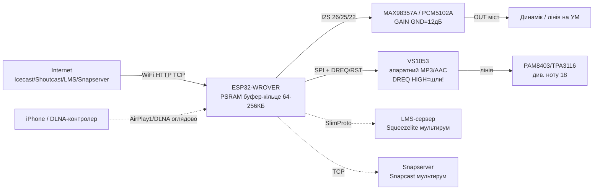
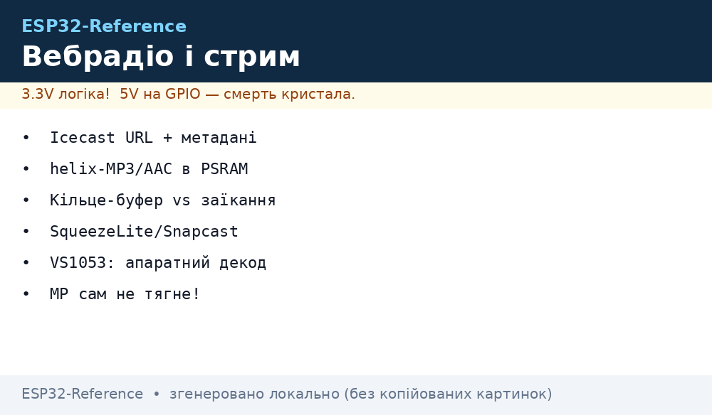

# Вебрадіо та стримінг на ESP32 - Icecast/Shoutcast, AAC, буфери, Squeezelite, Snapcast, AirPlay, DLNA, VS1053, PSRAM

> [!info] Де це в довіднику
> База звуку: [I2S](../../../ESP32-Reference/04-Shini/04-I2S.md), WiFi: [WiFi-STA-AP](../../../ESP32-Reference/05-Radio/01-WiFi-STA-AP.md), локальні файли: [Файлові системи](../../../ESP32-Reference/08-Pamyat/02-Filesystem.md), локальний звук: [DFPlayer](../../../ESP32-Reference/11-Vivid/08-DFPlayer-MAX98357-Nextion-LCD2004.md), [Audio-Codecs](../../../ESP32-Reference/11-Vivid/13-Audio-Codecs.md), парна нота: [MP3-TTS-Amps](../../../ESP32-Reference/11-Vivid/18-MP3-TTS-Amps.md), старт [Home](../../../ESP32-Reference/Home.md).
> Працює тільки з мережею: без стабільного WiFi і PSRAM буде заїкання - це нормально, читайте розділ про буфер!

## Призначення

Ця нота - **мережеве аудіо** ESP32: інтернет-радіо (потік MP3/AAC з Icecast/Shoutcast-серверів), мультирум-синхронізація (кілька колонок грають одне й те саме), прийом звуку з телефона (AirPlay/DLNA) і апаратне декодування (VS1053, коли CPU не тягне).

Коли брати що:

- треба «радіо на кухню» з кнопками станцій - **ESP32-audioI2S або ESP8266Audio + Icecast/Shoutcast URL**;
- треба кілька кімнат синхронно - **Squeezelite-ESP32 + Logitech Media Server** або **Snapcast-клієнт**;
- треба кидати звук з iPhone - **shairport/AirPlay-рендер** (оглядово, з обмеженнями!);
- треба кидати звук з Android/Windows - **DLNA-рендер** (оглядово);
- ESP32 без PSRAM заїкається на AAC - **VS1053 по SPI** як апаратний декодер;
- треба просто озвучка без мережі - вам у [18-MP3-TTS-Amps](../../../ESP32-Reference/11-Vivid/18-MP3-TTS-Amps.md) або [08-DFPlayer-MAX98357-Nextion-LCD2004](../../../ESP32-Reference/11-Vivid/08-DFPlayer-MAX98357-Nextion-LCD2004.md).

Коли НЕ брати: немає стабільного WiFi (−70 дБм і гірше = заїкання), немає PSRAM для AAC/SBR, потрібен HiFi 24/192 (ESP32 - максимум практично 16/48, див. таблицю нижче).

## Характеристики

| Варіант | Протокол | Кодек | Що треба | Ключове правило |
| --- | --- | --- | --- | --- |
| Пряме вебрадіо (audioI2S) | HTTP → Icecast/Shoutcast | MP3, AAC, FLAC, OGG, OPUS | WiFi + I2S-ЦАП (MAX98357A/PCM5102A) | Буфер-кільце в PSRAM; метадані ICY окремо! |
| ESP8266Audio | HTTP-стрім / файл | MP3 (libMAD), AAC (helix) | I2S-ЦАП або NoDAC-емуляція | На ESP32 AAC-SBR підтримується, на ESP8266 - ні (немає RAM!) |
| Squeezelite-ESP32 | SlimProto → LMS | Все, що вміє LMS (транскодує сервер!) | LMS-сервер + PSRAM 4 МБ | Мультирум-синхронізація; керування з браузера/додатка |
| Snapcast-клієнт | TCP → Snapserver | PCM/FLAC/Opus (декодує клієнт) | Snapserver у мережі | Мультирум з точною синхронізацією; затримка налаштовується |
| shairport/AirPlay | AirPlay 1 (оглядово) | ALAC | iPhone/iTunes-джерело | Тільки AirPlay 1; стабільність залежить від прошивки форку! |
| DLNA-рендер | UPnP/DLNA (оглядово) | MP3/WAV (залежить від рендера) | DLNA-контролер (BubbleUPnP тощо) | Оглядово: важкий стек для ESP32, брати готові приклади |
| VS1053-декодер | SPI (SCI/SDI) + SD | MP3/AAC/OGG/WMA/MIDI/WAV | Модуль VS1053 + microSD | CPU вільний: декодує чіп, ESP32 тільки годує даними |

## Icecast / Shoutcast потоки: URL станцій і метадані

Інтернет-радіо - це звичайний HTTP-GET на адресу потоку; сервер віддає безкінечні аудіо-байтів. Два сімейства:

- **Icecast** (відкритий, Xiph): потоки MP3/Ogg/Opus; адмінка `/status-json.xsl`; каталог станцій - dir.xiph.org.
- **Shoutcast** (пропрієтарний, але відкриті URL): потік зазвичай `http://host:port/;` або `/stream`; каталог - shoutcast.com.

Типові URL (приклади формату - станції змінюються, перевіряйте в каталогах!):

```text
http://stream.antennethueringen.de/live/aac-64/stream.antennethueringen.de/  (AAC 64k)
http://ice1.somafm.com/groovesalad-128-mp3  (MP3 128k, SomaFM)
http://stream.somafm.com/dronezone-128-aac  (AAC, SomaFM)
http://live.wbur.org:8000/boston  (приклад структури mount-point)
```

### Метадані ICY (назва станції / що грає)

Клієнт шле заголовок `Icy-MetaData: 1`. Якщо сервер згоден - відповідає `icy-metaint: N` (кожні N аудіо-байтів вставлено блок метаданих) плюс заголовки:

| Заголовок | Зміст |
| --- | --- |
| `icy-name` | Назва станції |
| `icy-genre` | Жанр |
| `icy-bitrate` | Бітрейт потоку |
| `icy-url` | Сайт станції |
| `StreamTitle` (у блоках) | «Виконавець - Трек» (оновлюється!) |

Бібліотеки ESP32-audioI2S/ESP8266Audio парсять це самі і віддають у колбек (`audio_info` / `ID3/ICY-callback`) - у коді нижче показано, як вивести назву і трек у Serial/дисплей. Пастка: мета-інтервал розриває аудіо-байтів - **не годуйте сирий потік декодеру без вирізання метаблоків**, якщо пишете свій клієнт!

## Декодери: helix-MP3 + AAC (пам'ять / PSRAM!)

| Декодер | Звідки | RAM | CPU ESP32 | Нотатки |
| --- | --- | --- | --- | --- |
| helix-MP3 | ESP32-audioI2S, ESP-ADF | ~30 КБ heap | Легко, 240 МГц з запасом | Основа вебрадіо; MP3 до 320 кбіт/с |
| AAC (helix, без SBR) | ESP8266Audio, audioI2S | ~30 КБ heap | Середньо | Більшість станцій AAC-LC грає |
| AAC-SBR (HE-AAC) | ESP8266Audio на ESP32 | Більше RAM | Важко | На ESP32 підтримується, на ESP8266 - ні (мало RAM!) |
| libMAD MP3 | ESP8266Audio | Більше, ніж helix | Важко на 160 МГц ESP8266 | На ESP32 ок, але helix економніший |
| FLAC/OGG/Opus | audioI2S | Залежить від потоку | Середньо-важко | Тільки стабільний WiFi + PSRAM |
| VS1053 (апаратний) | Чіп | ~0 RAM ESP32 | ~0 CPU | Див. розділ VS1053 |

Практичні межі ESP32 (звичайний WROOM/WROVER, 240 МГц):

| Формат | Бітрейт | Результат |
| --- | --- | --- |
| MP3 128 кбіт/с | Стандарт радіо | Стабільно навіть без PSRAM |
| MP3 320 кбіт/с | Максимум | Треба хороший WiFi; PSRAM бажано |
| AAC-LC 64-128 кбіт/с | Економні станції | Стабільно з PSRAM |
| HE-AAC SBR | Низькобітрейтні станції | Тільки ESP32 + PSRAM; можливі хрипи на піках |
| FLAC/Opus стрім | Рідкість | Тільки PSRAM + ідеальний WiFi |
| 24/192 | Не для ESP32 | Ні - див. Squeezelite-обмеження (16/48 практично) |

## Буфер мережі проти заїкання: розмір кільця

Заїкання = декодер з'їв дані швидше, ніж WiFi привіз нові. Ліки - **кільцевий буфер** (ring) між сокетом і декодером:

| Розмір буфера | Де живе | Ефект |
| --- | --- | --- |
| 2-8 КБ | Внутрішня RAM | Тільки ідеальний WiFi, MP3 128k |
| 32-64 КБ | PSRAM / велика RAM | Нормальний WiFi, переживає джитер 1-3 с |
| 128-256 КБ | PSRAM | Слабкий WiFi, AAC, перепідключення без тиші |
| 512 КБ+ | Тільки велика PSRAM (8 МБ) | Запас на ребуферизацію роутера |

Правила:

1. **Буфер - в PSRAM**, декодер-стейт - у внутрішній RAM (швидкість!).
2. Старт відтворення - після **передзаповнення 50-75 %** (інакше перші секунди рвані).
3. `loop()` / `audio.loop()` крутити **без `delay()`**; великі затримки = порожній буфер = тиша.
4. HTTPS-потоки - важчі (TLS з'їдає RAM/CPU): за можливості беріть **http**, не https.
5. При обриві - **експоненційний реконект** (1 с, 2 с, 4 с… до 30 с), а не hammering сервера.
6. RSSI гірше −75 дБм - спочатку чиніть антену/роутер, потім код.

## Squeezelite-ESP32 (LMS!)

Squeezelite-ESP32 - порт SlimProto-плеєра на ESP32: колонка реєструється в **Logitech Media Server** (LMS), сервер шле аудіо і команди (гучність, синхронізація, плейлисти, Spotify/Deezer/Tidal через плагіни LMS).

- Залізо-мінімум: **WROVER (4 МБ Flash + 4 МБ PSRAM)**; WROOM без PSRAM - ні!
- Вихід: I2S-ЦАП (PCM5102A, MAX98357A) або SPDIF; Bluetooth-динамік як приймач теж можливий (тільки 44.1 кГц!).
- Ядро 16 біт (за замовч.): MP3/AAC/Opus до 48 кГц, FLAC/ALAC до 96 кГц, PCM до 192 кГц (на межі!); рекомендовано обмежити сервером до 96 кГц (`-Z 96000`).
- Мультирум: кілька ESP32 синхронізуються сервером (затримки кімнат налаштовуються в LMS).
- Керування: веб LMS, додатки (iPeng, Squeezer, Material Skin), кнопки/ІЧ/дисплей на самій колонці, еквалайзер 10 смуг (16-біт режим).
- Прошивка: готові бінарники I2S/SqueezeAMP/Muse + веб-налаштування WiFi і NVS-параметрів (`dac_config`, `spdif_config`).

## Snapcast-клієнт (мультирум!)

Snapcast = сервер (Snapserver бере звук з MPD/LMS/лінії) + клієнти (Snapclient на кожній колонці) з точною синхронізацією по часу.

- Клієнт на ESP32: відкриті порти snapclient (шукати актуальний форк під ESP-IDF 5.x!); транспорт TCP + керування гучністю/затримкою з сервера/додатка.
- Затримка кімнати: виставляється в мілісекундах на клієнта (компенсація відстані/ЦАП).
- Кодек: FLAC/Opus/PCM - вибирайте Opus для слабкого WiFi, FLAC/PCM для дротового/ідеального.
- Плюс проти Squeezelite: простіший сервер, точна синхронізація; мінус: менше музичних сервісів «з коробки» (немає екосистеми плагінів LMS).

## shairport / AirPlay + DLNA-рендер (оглядово)

| Технологія | Що вміє ESP32 | Обмеження - чесно! |
| --- | --- | --- |
| AirPlay 1 (shairport-порти) | Прийом звуку з iPhone/iTunes, метадані | Тільки AirPlay 1; AirPlay 2 - ні; дрейф синхронізації; якість залежить від форку - брати свіжий і тестований |
| AirPlay-синхронізація | Одна колонка - ок | Мультирум AirPlay-синхрону на кількох ESP32 - нестабільно, краще Squeezelite/Snapcast |
| DLNA/UPnP-рендер | Прийом з BubbleUPnP/Windows Media Player | Важкий стек (SOAP/HTTP/AVTransport); на ESP32 тільки готові приклади, свого не писати! |
| Bluetooth A2DP-sink | Прийом з будь-якого телефона | Див. [A2DP](../../../ESP32-Reference/05-Radio/05-BLE-Mesh-A2DP-HID.md); це не WiFi-стримінг, але для кухні часто простіше! |

Порада: якщо мета - «кидати музику з телефона на колонку», спочатку спробуйте **Bluetooth A2DP-sink** (простіше і стабільніше), а AirPlay/DLNA - тільки якщо точно треба саме Apple/UPnP-екосистема.

## VS1053 - апаратний MP3-декодер по SPI (альтернатива!)

Коли CPU/RAM не тягнуть (ESP32 без PSRAM, ESP8266, паралельні задачі):

- Чіп декодує сам: MP3/AAC/Ogg/WMA/MIDI/FLAC/WAV; ESP32 тільки ллє дані в SDI і шле команди в SCI.
- Піни: `SCS` (SCI chip-select), `SDCS/XDCS` (SDI data-select), `DREQ` (готовий прийняти - чекати HIGH!), `RST`, SPI SCK/MOSI/MISO + microSD на борту прориву.
- **DREQ - святе**: не слати байт, поки DREQ=LOW, інакше глухий зависон до ресету!
- Швидкість SPI: команди - до ~2 МГц, дані - до 8-12 МГц (за даташитом ревізії!).
- Запис теж вміє (PCM/Ogg з мікрофона/лінії) - але для запису краще кодек з [Audio-Codecs](../../../ESP32-Reference/11-Vivid/13-Audio-Codecs.md).
- Мінус: окрема плата, ціна, якість ЦАП середня (для кухні/гаража - відмінно, для HiFi - беріть PCM5102A + софт-декодер).

## PSRAM-вимоги (коротко і жорстко)

| Сценарій | PSRAM | Чому |
| --- | --- | --- |
| MP3 128k, голі, без дисплея | Не обов'язкова | Влазить у внутрішню RAM |
| MP3 128k + дисплей/кнопки | Бажана 2+ МБ | Дисплей з'їдає RAM і пріоритети |
| AAC / AAC-SBR | **Обов'язкова** | Стейт декодера + буфер |
| FLAC/Opus/Vorbis | **Обов'язкова 4 МБ** | Великі фрейми |
| Squeezelite/Snapclient | **Обов'язкова 4 МБ (WROVER!)** | Дизайн під PSRAM |
| HTTPS-потік | Обов'язкова | TLS-буфери ~30-50 КБ |
| Без PSRAM взагалі | Тільки MP3-стрім або VS1053 | Інакше заїкання - не баг коду! |

Як перевірити PSRAM: `esp_spiram_get_size()` / Arduino `ESP.getPsramSize()` / MicroPython `esp32` + спроба алокації. WROOM-модулі без PSRAM для цієї ноти - тільки MP3 128k або VS1053!

## Легенда пінів модуля

| Пін | Тип | Куди | Примітка |
| --- | --- | --- | --- |
| I2S BCLK (MAX98357A/PCM5102A) | Вихід ESP32 | GPIO26 (приклад) | Бітовий клок; короткий дріт! |
| I2S LRCK/WS | Вихід ESP32 | GPIO25 | 44.1/48 кГц |
| I2S DIN/DOUT | Вихід ESP32 | GPIO22 | Дані (назви різняться: DIN на ЦАП = DOUT ESP32!) |
| MAX98357A SD | Вхід | 3V3 (HIGH) | LOW = shutdown |
| MAX98357A GAIN | Конфіг | GND = 12 дБ (рекоменд.) | VIN = 15 дБ (хрип!), NC = 9 дБ |
| PCM5102A SCK | Вхід | GND (PLL-режим!) | Без MCLK від ESP32 - фішка PCM5102A |
| PCM5102A FMT/FLT/DMP/XMT | Конфіг | FMT=GND (I2S), XMT=3V3 | Див. [кодеки](../../../ESP32-Reference/11-Vivid/13-Audio-Codecs.md) |
| VS1053 SCK/MOSI/MISO | SPI | GPIO18/23/19 (приклад) | Дані до 8-12 МГц |
| VS1053 SCS / SDCS | CS-виходи | GPIO5 / GPIO16 | SCI-команди vs SDI-дані! |
| VS1053 DREQ | Вхід ESP32 | GPIO4 | HIGH = можна слати; чекати завжди! |
| VS1053 RST | Вихід | GPIO17 | Апаратний ресет чіпа |
| VS1053 microSD | SPI (спільна) | Той же SPI-хаб, свій CS | Файли + потік з мережі впереміш |
| Живлення ЦАП/VS1053 | 5 В / 3.3 В | За схемою плати | 100 мкФ + 100 нФ біля плати |

## Схема підключення

| ESP32 | Модуль | Примітка |
| --- | --- | --- |
| GPIO26 | BCLK I2S-ЦАП | MAX98357A / PCM5102A |
| GPIO25 | LRCK/WS I2S-ЦАП | |
| GPIO22 | DIN I2S-ЦАП | DOUT ESP32 → DIN ЦАП! |
| 3V3 | SD (MAX98357A) | HIGH = працює |
| 5 В / GND | VIN ЦАП | Запас по струму; зірка GND |
| Динамік 4 Ом | OUT MAX98357A | Мостовий вихід - не на землю! |
| GPIO18/23/19 | SCK/MOSI/MISO VS1053 | Варіант з апаратним декодером |
| GPIO5 / GPIO16 | SCS / SDCS VS1053 | Команди / дані |
| GPIO4 | DREQ VS1053 | Вхід; слати тільки при HIGH! |
| GPIO17 | RST VS1053 | Ресет чіпа |
| 3V3 USB / WiFi | Антена вільна! | Металеві корпуси вбивають стрім |

### ASCII-схема

```text
ESP32-WROVER (PSRAM!)        Вебрадіо-тракт
--------------------         --------------
GPIO26 ────────────────────► BCLK MAX98357A/PCM5102A (VIN=5V/3V3)
GPIO25 ────────────────────► LRCK MAX98357A/PCM5102A (GAIN=GND 12дБ)
GPIO22 ────────────────────► DIN  MAX98357A/PCM5102A ──► OUT динамік/лінія
3V3  ──────────────────────► SD   MAX98357A (HIGH=працює)
  --- варіант VS1053 (без PSRAM / розвантаження CPU): ---
GPIO18 ────────────────────► SCK  VS1053 (команди 2МГц, дані до 12МГц)
GPIO23 ────────────────────► MOSI VS1053 ; MISO ◄──── GPIO19
GPIO5  ────────────────────► SCS  VS1053 (SCI-команди)
GPIO16 ────────────────────► SDCS VS1053 (SDI-дані потоку!)
GPIO4  ◄──────────────────── DREQ VS1053 (HIGH=можна слати!)
GPIO17 ────────────────────► RST  VS1053
WIFI ))) ─── роутер ─── Internet ─── Icecast/Shoutcast/LMS/Snapserver
GND ───────────────────────► ЗІРКА (ЦАП + ESP32 + БЖ в одній точці)
```

### Mermaid




*Рис. ESP32-WROVER з PSRAM: WiFi-потік у кільцевий буфер, далі I2S на MAX98357A/PCM5102A або SPI на VS1053 з контролем DREQ; мультирум через LMS/Snapserver. Місце під фото - див. .*

## Код ESP-IDF

```c
// ESP-IDF 5.x: HTTP Icecast-стрім + helix-MP3 через ADF/audioI2S-ідею.
// Мінімальний каркас: WiFi STA + HTTP-клієнт + кільцевий буфер + I2S-out.
// Повний декодер — бібліотекою (audioI2S/ADF); тут — транспорт і буфер.
#include <string.h>
#include "freertos/FreeRTOS.h"
#include "freertos/task.h"
#include "esp_wifi.h"
#include "esp_event.h"
#include "esp_log.h"
#include "esp_http_client.h"
#include "driver/i2s_std.h"

static const char *TAG = "webradio";
#define RING_SIZE (96 * 1024) // 96 КБ кільце (PSRAM!)

static uint8_t *ring;
static volatile int ring_w = 0, ring_r = 0;

static int ring_free(void) {
    return (ring_r - ring_w - 1 + RING_SIZE) % RING_SIZE;
}
static int ring_avail(void) {
    return (ring_w - ring_r + RING_SIZE) % RING_SIZE;
}
static void ring_push(const uint8_t *d, int n) {
    for (int i = 0; i < n; i++) {
        ring[ring_w] = d[i];
        ring_w = (ring_w + 1) % RING_SIZE;
    }
}

// Icy-MetaData: просимо метадані окремо від аудіо!
static esp_err_t http_event(esp_http_client_event_t *e) {
    if (e->event_id == HTTP_EVENT_ON_DATA && !esp_http_client_is_chunked_response(e->client)) {
        int free = ring_free();
        int n = e->data_len < free ? e->data_len : free; // переповнення = дроп (лічильник!)
        if (n < e->data_len) ESP_LOGW(TAG, "ring full, drop %d", e->data_len - n);
        ring_push((uint8_t *)e->data, n);
    }
    return ESP_OK;
}

void radio_task(void *arg) {
    // Передстарт: чекаємо 75% буфера, інакше перші секунди рвані!
    while (ring_avail() < (int)(RING_SIZE * 0.75)) vTaskDelay(pdMS_TO_TICKS(100));
    ESP_LOGI(TAG, "buffer prefilled, start decoder feed");
    // Тут: віддавати байти з ring_r у декодер (helix-MP3/AAC) -> i2s_channel_write().
    // Контроль метаблоків icy-metaint — вирізати ДО декодера!
    while (1) {
        int a = ring_avail();
        if (a == 0) { ESP_LOGW(TAG, "underrun! weak WiFi?"); vTaskDelay(pdMS_TO_TICKS(50)); continue; }
        // feed_decoder(&ring[ring_r], chunk); ring_r = (ring_r + chunk) % RING_SIZE;
        vTaskDelay(pdMS_TO_TICKS(10));
    }
}

void app_main(void) {
    // PSRAM-перевірка — обов'язкова для AAC/буфера!
    size_t ps = esp_spiram_get_size();
    ESP_LOGI(TAG, "PSRAM: %u bytes", (unsigned)ps);
    if (ps < (2 * 1024 * 1024)) ESP_LOGW(TAG, "мало PSRAM: тільки MP3 128k або VS1053!");
    ring = heap_caps_malloc(RING_SIZE, MALLOC_CAP_SPIRAM);
    configASSERT(ring);

    // WiFi STA init (скорочено; деталі — [[05-Radio/01-WiFi-STA-AP]]):
    // esp_netif_init(); esp_event_loop_create_default(); wifi_init_sta(ssid, pass);

    esp_http_client_config_t cfg = {
        .url = "http://ice1.somafm.com/groovesalad-128-mp3",
        .event_handler = http_event,
    };
    esp_http_client_handle_t c = esp_http_client_init(&cfg);
    esp_http_client_set_header(c, "Icy-MetaData", "1"); // просимо StreamTitle!
    esp_http_client_set_header(c, "User-Agent", "ESP32-webradio/1.0");
    xTaskCreate(radio_task, "radio", 4096, NULL, 5, NULL);
    esp_err_t err = esp_http_client_perform(c); // блокуючий стрім + реконект зовні
    if (err != ESP_OK) ESP_LOGE(TAG, "stream err: %s, реконект з backoff!", esp_err_to_name(err));
}
```

## Код Arduino

```cpp
// Arduino: ESP32-audioI2S — вебрадіо за 30 рядків (I2S-ЦАП MAX98357A/PCM5102A).
#include <Arduino.h>
#include <WiFi.h>
#include "Audio.h" // https://github.com/schreibfaul1/ESP32-audioI2S

#define I2S_BCLK 27
#define I2S_LRC  26
#define I2S_DOUT 25  // ESP32 DOUT -> DIN ЦАП!

const char *SSID = "your-ssid";
const char *PASS = "your-pass";
// Перевірені формати URL: MP3 128k стартує навіть без PSRAM; AAC — треба PSRAM!
const char *STATIONS[] = {
  "http://ice1.somafm.com/groovesalad-128-mp3",
  "http://stream.antennethueringen.de/live/aac-64/stream.antennethueringen.de/",
};
int cur = 0;
Audio audio;

void audio_info(const char *info) { // метадані ICY сюди!
  Serial.printf("info: %s\n", info);
  // info буває: "StreamTitle='Artist - Track'", "icy-name: ...", "bitrate: ..."
}

void setup() {
  Serial.begin(115200);
  Serial.printf("PSRAM: %u\n", ESP.getPsramSize());
  if (ESP.getPsramSize() < 2000000)
    Serial.println("WARN: мало PSRAM — тільки MP3 128k, AAC буде заїкатись!");
  WiFi.mode(WIFI_STA);
  WiFi.begin(SSID, PASS);
  while (WiFi.status() != WL_CONNECTED) { delay(500); Serial.print("."); }
  Serial.printf("\nRSSI %d dBm (гірше -75 = заїкання!)\n", WiFi.RSSI());
  audio.setPinout(I2S_BCLK, I2S_LRC, I2S_DOUT);
  audio.setVolume(15); // 0..21
  audio.connecttohost(STATIONS[cur]);
}

void loop() {
  audio.loop(); // БЕЗ delay()! Інакше порожній буфер і тиша.
  if (Serial.available()) {
    char c = Serial.read();
    if (c == 'n') { cur = (cur + 1) % 2; audio.connecttohost(STATIONS[cur]); }
    if (c == '+') audio.setVolume(min(21, audio.getVolume() + 1));
    if (c == '-') audio.setVolume(max(0, audio.getVolume() - 1));
  }
}
```

## Код MicroPython

```python
# MicroPython: ЧЕСНІ ОБМЕЖЕННЯ!
# - Повноцінного MP3/AAC-декодера в чистому MicroPython нема (CPU!).
# - Варіант A: VS1053 по SPI (чіп декодує, ESP32 годує HTTP-потік).
# - Варіант B: PCM/WAV-стрім 8-16 кГц через I2S (низька якість, навчальний).
# Нижче — варіант A (робочий): HTTP-стрім -> VS1053 SDI з контролем DREQ.
import socket
import time
from machine import Pin, SPI

# --- VS1053 розводка (приклад) ---
spi = SPI(2, baudrate=8000000, sck=Pin(18), mosi=Pin(23), miso=Pin(19))
SCS = Pin(5, Pin.OUT, value=1)    # SCI commands
SDCS = Pin(16, Pin.OUT, value=1)  # SDI data
DREQ = Pin(4, Pin.IN)
RST = Pin(17, Pin.OUT, value=1)

def vs_cmd(addr, val):
    while not DREQ.value():  # DREQ святе: LOW = не чіпати!
        time.sleep_ms(1)
    SCS.off()
    spi.write(bytes([0x02, addr, (val >> 8) & 0xFF, val & 0xFF]))
    while not DREQ.value():
        time.sleep_ms(1)
    SCS.on()

def vs_feed(chunk):
    # Дані — 32-байтовими порціями з контролем DREQ
    SDCS.off()
    for i in range(0, len(chunk), 32):
        while not DREQ.value():
            time.sleep_ms(1)
        spi.write(chunk[i:i + 32])
    SDCS.on()

def vs_init():
    RST.off(); time.sleep_ms(50); RST.on()
    time.sleep_ms(100)
    vs_cmd(0x00, 0x0804)  # MODE: SDINEW + RESET
    time.sleep_ms(100)
    vs_cmd(0x03, 0x9800)  # CLOCKF: 3.5x множник
    vs_cmd(0x05, 0xBB81)  # AUDATA: 48 кГц стерео (за даташитом!)
    vs_cmd(0x0B, 0x2020)  # VOL: середня гучність (0x0000 = макс!)

def radio_stream(host, path, port=80):
    s = socket.socket()
    s.connect((host, port))
    s.send(("GET %s HTTP/1.0\r\nHost: %s\r\n"
            "Icy-MetaData: 1\r\nUser-Agent: ESP32-MPy/1.0\r\n\r\n"
            % (path, host)).encode())
    # Пропустити HTTP-заголовки (і прочитати icy-metaint!)
    head = b""
    while b"\r\n\r\n" not in head:
        head += s.recv(512)
    print("headers:", head.split(b"\r\n\r\n")[0][:400])
    # NB: метаблоки icy-metaint тут НЕ вирізаються — для чистого звуку
    # потрібен парсер metaint (домашнє завдання) або станція без метаданих!
    rest = head.split(b"\r\n\r\n", 1)[1]
    if rest:
        vs_feed(rest)
    while True:
        data = s.recv(1024)
        if not data:
            print("stream closed, reconnect with backoff...")
            time.sleep(2)
            return
        vs_feed(data)

vs_init()
print("VS1053 ready, DREQ:", DREQ.value())
while True:
    try:
        radio_stream("ice1.somafm.com", "/groovesalad-128-mp3")
    except Exception as e:
        print("err:", e, "retry in 5s")
        time.sleep(5)
```

## Типові помилки

| # | Помилка | Симптом | Виправлення |
| --- | --- | --- | --- |
| 1 | WROOM без PSRAM + AAC | Хрип, ребути, `out of memory` | Тільки MP3 128k або VS1053; AAC/SBR - тільки WROVER з PSRAM |
| 2 | `delay()` у `loop()` | Періодична тиша 0.5-2 с | `audio.loop()` без затримок; кнопки - по мілісах/перериваннях |
| 3 | Старт без передзаповнення | Перші секунди рвані | Чекати 50-75 % кільця перед feed декодера |
| 4 | HTTPS замість HTTP | Не вистачає RAM, рве на TLS | Брати http-потік станції; https - тільки з PSRAM 4 МБ+ |
| 5 | Сирий потік з метаданими в декодер | Періодичний «булькіт»/клік | Парсити `icy-metaint`, вирізати метаблоки до декодера |
| 6 | RSSI −80 дБм і гірше | Заїкання, реконекти | Антена/роутер ближче; металевий корпус - отвір під антену |
| 7 | ESP8266 + HE-AAC SBR | Тиша/шум | SBR тільки на ESP32 (див. README ESP8266Audio); станцію - AAC-LC/MP3 |
| 8 | 24/192 через Squeezelite | Не грає / рве | Обмежити сервером до 96 кГц (`-Z 96000`); ESP32 - практично 16/48 |
| 9 | GAIN MAX98357A на 15 дБ | Хрип і кліппінг на басах | GAIN на GND (12 дБ); гучність - кодом/потенціометром |
| 10 | VS1053: шлють при DREQ=LOW | Глухий зависон до ресету | Чекати DREQ=HIGH перед кожною порцією; дані - по 32 байти |
| 11 | VS1053 SPI занадто швидкий | Сміття/тиша | Команди ≤2 МГц; дані ≤8-12 МГц за ревізією чіпа |
| 12 | Реконект-hammering | Бан від станції (403/timeout) | Експоненційний backoff 1-2-4…30 с + User-Agent |
| 13 | Не той URL (сторінка замість потоку) | Грає тиша / HTML у декодері | URL має вести на mount/stream, не на сайт; перевірити curl -v |
| 14 | Дисплей/NeoPixel гальмує стрім | Рве при скролі/VU | Дисплей - найнижчий пріоритет; Squeezelite: повільний SPI дисплея вбиває 24/96 |
| 15 | Bluetooth-динамік + не 44.1 кГц | Тиша/писк на BT | На BT-приймач тільки 44.1 кГц (ресемплінг у LMS/`-R`) |

## Офіційні джерела

- [ESP32-audioI2S - бібліотека вебрадіо (GitHub, schreibfaul1)](https://github.com/schreibfaul1/ESP32-audioI2S) - MP3/AAC/FLAC/Opus, ICY-метадані, приклади станцій, вимоги до ядер/PSRAM.
- [ESP8266Audio - декодери MP3/AAC-helix (GitHub, Earle Philhower)](https://github.com/earlephilhower/ESP8266Audio) - libMAD/helix, буфер `AudioFileSourceBuffer`, обмеження AAC-SBR на ESP8266.
- [Icecast - офіційний сайт стримінг-сервера (Xiph)](https://icecast.org/docs/) - протоколи Icecast, mount-points, каталог станцій.
- [Squeezelite-ESP32 - мультирум плеєр + LMS (GitHub)](https://github.com/sle118/squeezelite-esp32) - вимоги WROVER+PSRAM, NVS-конфіг ЦАП, синхронізація кімнат.
- [Shairport Sync - AirPlay-приймач (GitHub)](https://github.com/mikebrady/shairport-sync) - як працює AirPlay-синхронізація/латентність; орієнтир для ESP32 AirPlay-рендерів.
- [VS1053 MP3/AAC Codec Tutorial (Adafruit Learn)](https://learn.adafruit.com/adafruit-vs1053-mp3-aac-ogg-midi-wav-play-and-record-codec-tutorial) - апаратний декодер: SPI SCI/SDI, DREQ, формати.
- [FAT Filesystem - ESP-IDF (Espressif)](https://docs.espressif.com/projects/esp-idf/en/latest/esp32/api-reference/storage/fatfs.html) - SD/FAT32 для локальних файлів поруч зі стрімом.
- [ESP-IDF I2S - офіційна документація (Espressif)](https://docs.espressif.com/projects/esp-idf/en/latest/esp32/api-reference/peripherals/i2s.html) - I2S-вихід на ЦАП, MCLK/BCLK/WS.

## Див. також

- [Home](../../../ESP32-Reference/Home.md)
- [I2S](../../../ESP32-Reference/04-Shini/04-I2S.md)
- [UART](../../../ESP32-Reference/04-Shini/01-UART.md)
- [08-DFPlayer-MAX98357-Nextion-LCD2004](../../../ESP32-Reference/11-Vivid/08-DFPlayer-MAX98357-Nextion-LCD2004.md)
- [13-Audio-Codecs](../../../ESP32-Reference/11-Vivid/13-Audio-Codecs.md)
- [18-MP3-TTS-Amps](../../../ESP32-Reference/11-Vivid/18-MP3-TTS-Amps.md)
- [01-WiFi-STA-AP](../../../ESP32-Reference/05-Radio/01-WiFi-STA-AP.md)
- [05-BLE-Mesh-A2DP-HID](../../../ESP32-Reference/05-Radio/05-BLE-Mesh-A2DP-HID.md)
- [Файлові системи](../../../ESP32-Reference/08-Pamyat/02-Filesystem.md)
- [01-Lancjugi-zhivlennya](../../../ESP32-Reference/02-Zhivlennya/01-Lancjugi-zhivlennya.md)
