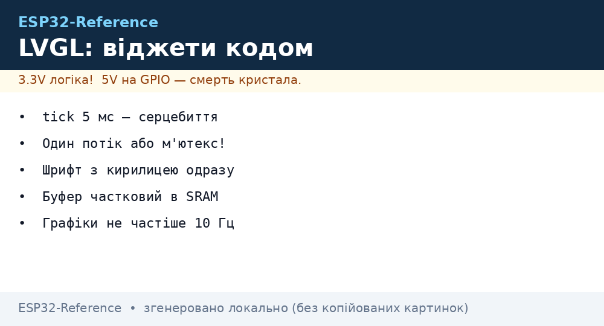
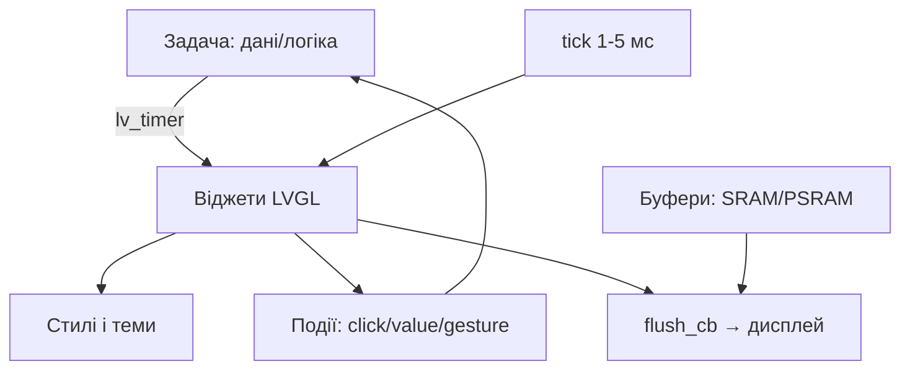

# LVGL віджети глибоко - екрани, стилі, події і пам'ять на ESP32


*Рис. LVGL-стек: віджети → стилі → події → flush у дисплей; буфери в PSRAM, логіка в задачах.*

> [!tip] Що це за нота
> Глибина поверх оглядової LVGL-ноти: віджети руками (без SquareLine), стилі і теми, події, пам'ять під екрани. Дисплеї: [TFT і LCD](../../../ESP32-Reference/11-Vivid/02-TFT-LCD-Epaper.md), SquareLine-старт: [LVGL і SquareLine](../../../ESP32-Reference/11-Vivid/12-LVGL-SquareLine.md).

## 1. Мета

Писати інтерфейси кодом, а не мишею:

- ключові віджети: label, button, slider, arc, chart, keyboard;
- стилі і теми: кольори, шрифти (кирилиця!), відступи;
- події і таймери: кнопки, свайпи, оновлення даних;
- буфери: повний, частковий, подвійний - що їсть пам'ять;
- кирилиця у прошивці без магії.

| Віджет | Призначення | Нотатка |
| --- | --- | --- |
| label | текст, значення датчиків | перенос і скрол |
| button/matrix | кнопки і клавіатури | події CLICKED |
| slider/arc | уставки, гучність | діапазони і колір |
| chart | графіки телеметрії | кільцевий буфер точок |
| keyboard/textarea | ввід WiFi-пароля | розкладки |
| tabview/tileview | екрани | жести перемикання |

## 2. Архітектура



Правило потоків: весь LVGL - в одній задачі (або з м'ютексом). Виклик з переривань - тільки через чергу.

## 3. Розпіновка типового TFT

| Сигнал TFT | Пін ESP32-S3 | Примітка |
| --- | --- | --- |
| SCK/MOSI | GPIO12/11 | SPI 40 МГц |
| CS/DC/RST | GPIO10/9/8 | керування |
| BL | GPIO7 + ШІМ | яскравість! |
| TOUCH_IRQ | GPIO6 | тач-переривання |
| VCC/GND | 3V3/GND | 200 мА запас |

Яскравість через LEDC-ШІМ, не резистором: плавність і економія. Тач - XPT2046 по тому ж SPI (окремий CS).

## 4. Стилі і кирилиця

- тема Material: `lv_theme_default_init()` - старт за хвилину;
- свої стилі: фони, радіуси, тіні - структурами `lv_style_t`;
- шрифти: Montserrat + кириличні гліфи через конвертер LVGL;
- розміри 14/20/28 - три кеглі на весь інтерфейс;
- кольори: 16-бітні, палітра проєкту в одному хедері.

## 5. Робочий код (C, ESP-IDF)

```c
#include "lvgl.h"

static lv_obj_t *lbl_temp;

static void btn_cb(lv_event_t *e) {
  int *cnt = lv_event_get_user_data(e);
  (*cnt)++;
  lv_label_set_text_fmt(lbl_temp, "N=%d", *cnt);
}

void ui_build(void) {
  static int cnt = 0;
  lv_obj_t *scr = lv_scr_act();
  lbl_temp = lv_label_create(scr);
  lv_obj_align(lbl_temp, LV_ALIGN_TOP_MID, 0, 10);
  lv_obj_t *btn = lv_btn_create(scr);
  lv_obj_align(btn, LV_ALIGN_CENTER, 0, 0);
  lv_obj_add_event_cb(btn, btn_cb, LV_EVENT_CLICKED, &cnt);
  lv_obj_t *sl = lv_slider_create(scr);
  lv_obj_align(sl, LV_ALIGN_BOTTOM_MID, 0, -10);
  lv_slider_set_range(sl, 0, 100);
}

void app_main(void) {
  lv_init();
  ui_build();
  while (1) {
    lv_timer_handler();
    vTaskDelay(pdMS_TO_TICKS(5));
  }
}
```

`lv_timer_handler()` кожні 5 мс - серцебиття бібліотеки. Важкі оновлення (графіки) - не частіше 10 Гц.

## 6. Робочий код (MicroPython)

```python
# MicroPython + lvgl: інтерфейс датчика (прошивка з модулем lvgl)
import lvgl as lv
import time

lv.init()
scr = lv.scr_act()
lbl = lv.label(scr)
lbl.align(lv.ALIGN.TOP_MID, 0, 10)
btn = lv.btn(scr)
btn.align(lv.ALIGN.CENTER, 0, 0)
cnt = [0]

def cb(e):
    cnt[0] += 1
    lbl.set_text(f"N={cnt[0]}")

btn.add_event_cb(cb, lv.EVENT.CLICKED, None)
sl = lv.slider(scr)
sl.align(lv.ALIGN.BOTTOM_MID, 0, -10)
sl.set_range(0, 100)

while True:
    lv.timer_handler_run_in_period(5)
    time.sleep_ms(5)
```

MicroPython-збірка з LVGL - окрема прошивка (модуль важкий). Для простих панелей вистачає, складні екрани - на C.

## 7. Пам'ять під екрани

| Екран | Повний буфер | Частковий 1/10 | Рекомендація |
| --- | --- | --- | --- |
| 320×240 | 150 КБ | 15 КБ | частковий в SRAM |
| 480×320 | 300 КБ | 30 КБ | частковий в SRAM |
| 800×480 | 768 КБ | 77 КБ | PSRAM обов'язково |

Подвійний буфер - плавність без тирингу, ціна ×2. DMA-flush - без участі CPU.

## 8. Типові помилки

| Симптом | Причина | Лікування |
| --- | --- | --- |
| Білий екран | не викликається flush/tick | tick 1-5 мс + flush_cb |
| Кракозябри замість тексту | немає кириличних гліфів | шрифт з кирилицею через конвертер |
| Рветься анімація | один малий буфер | більший/подвійний, DMA |
| Креш при натисканні | колбек чіпає видалений об'єкт | перевірка валідності, м'ютекс |
| Тач дзеркалить | калібрування/поворот | матриця трансформації |
| Пам'яті не вистачає | повний буфер 800×480 в SRAM | частковий + PSRAM |

## 9. Швидка шпаргалка LVGL

- tick 5 мс - серцебиття;
- один потік (або м'ютекс);
- шрифт з кирилицею одразу;
- буфер: частковий в SRAM;
- графіки не частіше 10 Гц.

## 10. Суміжні ноти

- [LVGL і SquareLine](../../../ESP32-Reference/11-Vivid/12-LVGL-SquareLine.md) - старт мишею.
- [TFT і LCD](../../../ESP32-Reference/11-Vivid/02-TFT-LCD-Epaper.md) - залізо дисплеїв.
- [чип S3](../../../ESP32-Reference/01-Hardware/03-ESP32-S3.md) - PSRAM під буфери.
- [біо і ІЧ](../../../ESP32-Reference/10-Sensori/20-Bio-IR-Temp.md) - дані для віджетів.
- [головна карта](../../../ESP32-Reference/Home.md) - повна навігація.

## 7.1 Розпіновка виводу (для розробника)

- Дисплей 800×480: 40 пінів гребінки → RST, CS, MOSI (SPI), SCK, BL, MISO (опційно)
- Тач 2.8": SDA/SCL (I2C) + IRQ
- Найкраще: підключення тільки I2S/BLE-інтерфейсу для збереження виробничих пінів
- Dokument: docs.simplefoc.com / docs.simplefoc.com/bldcmotor - для глибокого FOC

- Ігри з PID-контролерами: блок операцій > 200 рядків
- Прототипи з ESP32-S3: підключення через USB-C, швидкість > 240 МГц
- Моніторинг електропостачання: вольт-ампер з INA219 на шині
- Додаткові інструменти: аналізатор для USB-OTG-дебаг

## Офіційні джерела

- [LVGL (GitHub)](https://github.com/lvgl/lvgl) - бібліотека, приклади, віджети.
- [ESP-ADF (Espressif)](https://docs.espressif.com/projects/esp-adf/en/latest/) - аудіо+дисплейні пайплайни.
- [esp32-camera (Espressif, GitHub)](https://github.com/espressif/esp32-camera) - картинка для віджетів.
