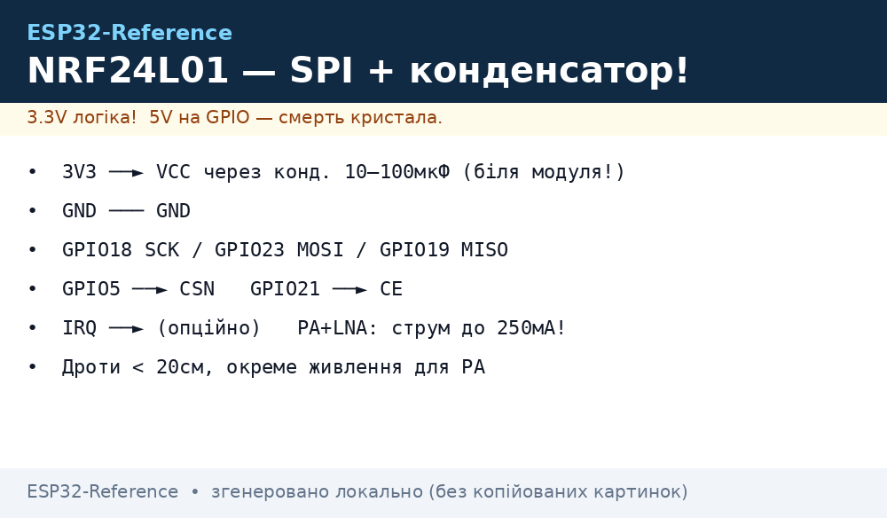
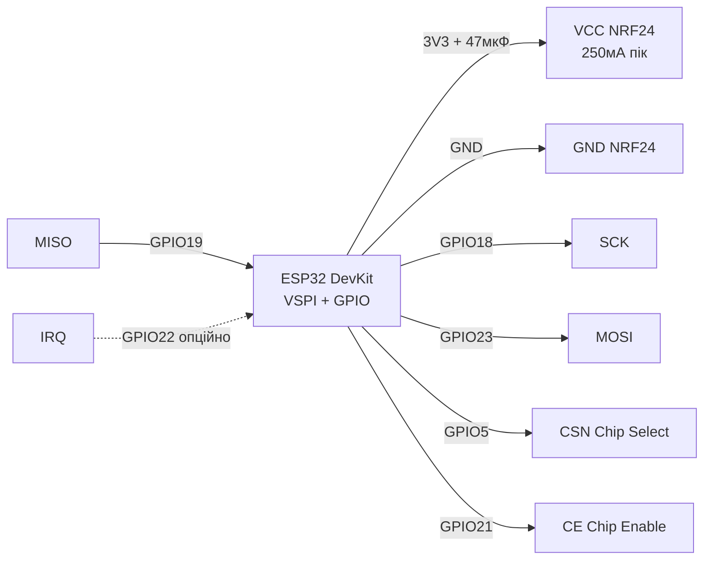
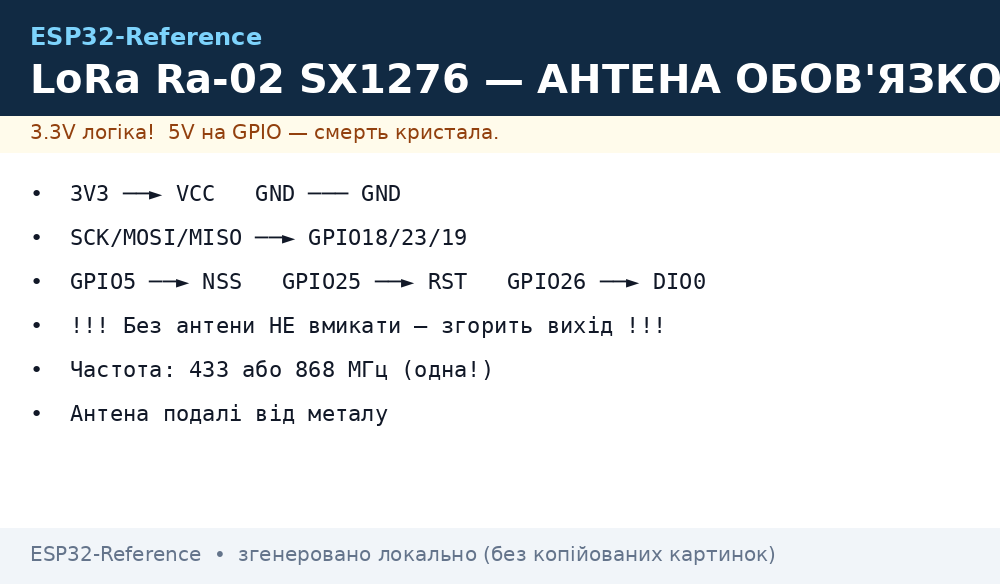
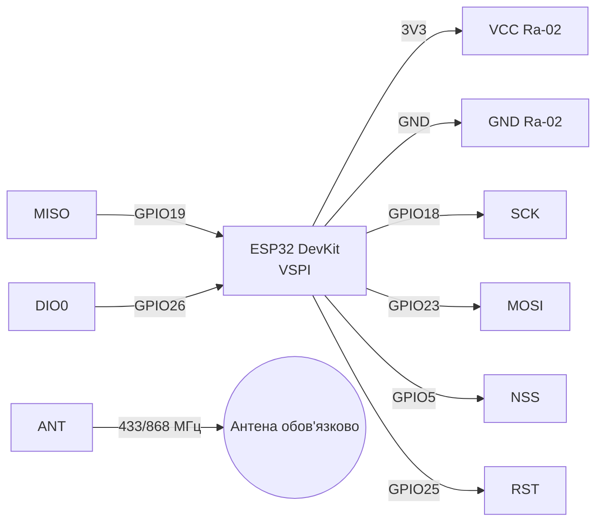

# NRF24L01+ та LoRa SX1276 (Ra-02)

> [!warning] Обидва модулі - тільки 3.3V! NRF24 з PA+LNA споживає до 250 мА в TX - потрібен конденсатор 10 мкФ. LoRa без антени НЕ вмикати - згорить вихідний каскад!

Огляд радіо: [01-WiFi-STA-AP](../../../ESP32-Reference/05-Radio/01-WiFi-STA-AP.md), шина [SPI](../../../ESP32-Reference/04-Shini/02-SPI.md), живлення [01-Lancjugi-zhivlennya](../../../ESP32-Reference/02-Zhivlennya/01-Lancjugi-zhivlennya.md), піни [01-GPIO-oglyad](../../../ESP32-Reference/03-GPIO/01-GPIO-oglyad.md), діагностика [02-Troubleshooting-FAQ](../../../ESP32-Reference/99-Dodatki/02-Troubleshooting-FAQ.md), старт [Home](../../../ESP32-Reference/Home.md).

## Призначення

NRF24L01+ та LoRa SX1276 (Ra-02) - NRF24L01+PA+LNA; Легенда пінів модуля NRF24L01; Підключення ESP32 до NRF24. Обидва модулі - тільки 3.3V! NRF24 з PA+LNA споживає до 250 мА в TX - потрібен конденсатор 10 мкФ. LoRa без антени НЕ вмикати - згорить вихідний каскад! Огляд радіо: [01-WiFi-STA-AP](../../../ESP32-Reference/05-Radio/01-WiFi-STA-AP.md), шина [SPI](../../../ESP32-Reference/04-Shini/02-SPI.md), живлення [01-Lancjugi-zhivlennya](../../../ESP32-Reference/02-Zhivlennya/01-Lancjugi-zhivlennya.md), піни [01-GPIO-oglyad](../../../ESP32-Reference/03-GPIO/01-GPIO-oglyad.md), діагностика [02-Troubleshooting-FAQ](../../../ESP32-Reference/99-Dodatki/02-Troubleshooting-FAQ.md), старт Home.

## 1. NRF24L01+PA+LNA

Характеристики: 2.4 ГГц, Enhanced ShockBurst, 250 кбіт/1M/2M, PA+LNA + зовнішня антена, дальність до 1 км на 250 кбіт у прямій видимості.
Живлення: 1.9-3.6V, пік 250 мА (PA+LNA). Стабілізатор DevKit не тягне піки - ставити електроліт 10-47 мкФ + кераміку 100 нФ прямо на піни VCC/GND модуля. Адаптер-плата з AMS1117-3.3 під NRF24 - рекомендоване рішення.


*Рис. NRF24L01+PA+LNA - підключення по SPI, конденсатор 10-100 мкФ прямо на VCC/GND.*

### Легенда пінів модуля NRF24L01

| Пін | Позначення | Тип | Куди на ESP32 | Примітка |
| --- | --- | --- | --- | --- |
| 1 | VCC | Живлення вхід | 3V3 (краще через адаптер AMS1117-3.3 від 5V) | Тільки 3.3V! Пік 250 мА у PA+LNA - вбудований LDO DevKit просідає без конденсатора |
| 2 | GND | Земля | GND | Спільна земля, короткі товсті дроти |
| 3 | CE | Вхід цифровий | GPIO21 (будь-який GPIO) | Chip Enable: HIGH = TX/RX режим, LOW = standby; це НЕ Chip Select |
| 4 | CSN | Вхід CS, active low | GPIO5 (CS) | Chip Select Not: LOW на час SPI-транзакції; `RF24(CE, CSN)` |
| 5 | SCK | Вхід SPI | GPIO18 (VSPI SCK) | Тактування SPI до 10 МГц |
| 6 | MOSI | Вхід SPI | GPIO23 (VSPI MOSI) | ESP32 → NRF24 |
| 7 | MISO | Вихід SPI | GPIO19 (VSPI MISO) | NRF24 → ESP32 |
| 8 | IRQ | Вихід, active low | GPIO22 або не підключати | Переривання TX_DS / RX_DR / MAX_RT; можна опитувати без нього |

CE vs CSN - у чому різниця:

- **CSN (Chip Select Not)** - стандартний CS шини SPI, див. [SPI](../../../ESP32-Reference/04-Shini/02-SPI.md). Активний LOW лише на час байтів `SPI.transfer()`. Один на кожен пристрій шини.
- **CE (Chip Enable)** - керування радіо-автоматом Nordic: `LOW` = standby/sleep, імпульс `HIGH >10 мкс` = старт TX, постійний `HIGH` = режим RX. Тому бібліотека приймає два піни: `RF24 radio(CE, CSN)`.
- Типова помилка - поміняти їх місцями: тоді ініціалізація проходить, а `write()` завжди `false`.

Чому потрібен конденсатор 10-100 мкФ:

1. PA (підсилювач потужності) бере імпульс ~250 мА за мікросекунди - LDO DevKit з повільним відгуком просідає до 2.6V і чип перезапускається.
2. Електроліт 10-47 мкФ (для PA+LNA краще 47-100 мкФ) + кераміка 100 нФ паяються/вставляються прямо на VCC-GND модуля, піни максимально короткі.
3. Без конденсатора симптоми: `TX fail`, «радіо бачить регістри, але не передає», дальність 2 метри замість 500 м.
4. Ідеально - адаптерна плата NRF24 з AMS1117-3.3: живиться від 5V, дає чисті 3.3V з запасом по струму, на ній уже є електроліти.

Звичайний NRF24 vs PA+LNA:

- **Звичайний (PCB-антена):** струм TX ~12 мА, дальність 30-100 м, працює від 3V3 DevKit, достатньо 10 мкФ.
- **PA+LNA (зовнішня антена SMA):** струм TX до 250 мА, дальність до 1 км на 250 кбіт, обов'язково 47-100 мкФ або адаптер, починати з `RF24_PA_LOW`/`RF24_PA_MIN`, інакше просадка.
- Живлення PA+LNA від 3V3 ESP32 без конденсатора - головна причина «не працює» на форумах. Живлення живленням, а рівні логіки в обох - 3.3V, див. [01-Lancjugi-zhivlennya](../../../ESP32-Reference/02-Zhivlennya/01-Lancjugi-zhivlennya.md) та [01-GPIO-oglyad](../../../ESP32-Reference/03-GPIO/01-GPIO-oglyad.md).

### Підключення ESP32 до NRF24

| ESP32 | NRF24L01 | Примітка |
| --- | --- | --- |
| 3V3 | VCC | 3.3V + конд. 10 мкФ, НЕ 5V |
| GND | GND | спільна земля |
| GPIO18 | SCK | VSPI SCK |
| GPIO23 | MOSI | VSPI MOSI |
| GPIO19 | MISO | VSPI MISO |
| GPIO5 | CSN | Chip Select |
| GPIO21 | CE | Chip Enable, будь-який GPIO |
| GPIO22 | IRQ | опційно, active low |

### ASCII-схема (NRF24)

```text
ESP32 DevKit          NRF24L01+PA+LNA
────────────          ───────────────
3V3 ───────────────►  VCC (3.3V! + 47мкФ між VCC і GND прямо на модулі)
GND ────────────────  GND
GPIO18 (SCK) ──────►  SCK
GPIO23 (MOSI) ─────►  MOSI
GPIO19 (MISO) ◄─────  MISO
GPIO5  (CSN) ──────►  CSN
GPIO21 (CE) ───────►  CE
GPIO22 ────────────◄  IRQ (опційно, можна NC)
                      ANT ──► антена 2.4 ГГц SMA (для PA+LNA обов'язково накрутити!)

Конденсатор: (+) до VCC, (-) до GND, ноги < 5 мм
RF24 radio(21, 5); SPI.begin(18, 19, 23, 5);
```

### Mermaid (NRF24)



## 2. LoRa SX1276 Ra-02

Характеристики: SX1276, частоти 433 / 868 / 915 МГц (версія плати фіксована!), потужність до +20 дБм, чутливість -148 дБм, LoRa + FSK/OOK.
Антана обов'язкова перед TX! Без антени або з антеною не на ту частоту - КСХ > 3, перегрів PA. Живлення 3.3V, TX ~120 мА, RX ~12 мА.
Частоти в Україні: 433.05-434.79 МГц без ліцензії (10 мВт), 868 МГц - EU 863-870 МГц. Не плутати версії Ra-02 433 vs 868.

### SX1278 / E32 / E22 - UART-модулі з прошивкою

| Позиція | Що це | Відмінність від голої Ra-02 |
| --- | --- | --- |
| SX1278 | Той же кристал, що SX1276, але лише 433 МГц версія | Дешевший; для нових проєктів різниці з 1276 немає - беріть що є |
| E32-433T20D / E22-900T22S (Ebyte) | LoRa-модем з UART і AT-подібними командами | Не треба писати LoRa-стек: шлеш байти в UART - вилітають в ефір; режими M0-M3 перемичкою |
| Коли брати Ebyte | Точка-точка без LoRaWAN: два модулі з однаковими параметрами (частота/канал/адреса) бачать один одного з коробки |


*Рис. LoRa Ra-02 - підключення SPI + DIO0/RST, антена на свою частоту обов'язкова до вмикання TX.*

### Легенда пінів модуля LoRa Ra-02

| Пін | Позначення | Тип | Куди на ESP32 | Примітка |
| --- | --- | --- | --- | --- |
| 1 | VCC | Живлення | 3V3 ESP32 | Тільки 3.3V, TX ~120 мА - бажано 10 мкФ на живленні |
| 2 | GND | Земля | GND | Земля + екран антени, спільна з ESP32 |
| 3 | SCK | Вхід SPI | GPIO18 | SPI SCK |
| 4 | MOSI | Вхід SPI | GPIO23 | SPI MOSI |
| 5 | MISO | Вихід SPI | GPIO19 | SPI MISO |
| 6 | NSS | Вхід CS | GPIO5 | Chip Select LoRa (аналог CSN у NRF24) |
| 7 | RST | Вхід reset | GPIO25 | Скидання SX1276, active low |
| 8 | DIO0 | Вихід цифра | GPIO26 | Переривання RX Done / TX Done - обов'язкове для бібліотеки LoRa |
| 9 | DIO1 | Вихід цифра | NC або GPIO | FIFO Level / CadDetected - для базового прикладу не потрібне |
| 10 | DIO2 | Вихід цифра | NC або GPIO | FHSS / CadDone - для базового прикладу не потрібне |
| 11 | ANT | ВЧ-вихід | Антена 433 або 868 МГц | Підключати ДО першого `LoRa.begin()`! Без антени TX спалить PA |

Пояснення DIO і антени:

- **NSS vs DIO0:** NSS вибирає чип на SPI (як CSN), а DIO0 сигналізує «пакет прийнято/передано». Без DIO0 бібліотека Sandeep Mistry висить у `endPacket()`. Тому DIO0 обов'язковий, а DIO1/DIO2 - опційні.
- **RST:** SX1276 скидається низьким імпульсом при `LoRa.setPins(NSS, RST, DIO0)`. Не вішати RST на strap-піни ESP32 (GPIO0/2/12/15).
- **Антена обов'язкова:** передавач +20 дБм (100 мВт) без навантаження відбиває потужність назад у PA - перегрів і деградація. Правило: накрутив антену → потім живлення → потім TX. Антена строго на частоту плати: 433 МГц антена на 868 МГц платі = дальність метри і КСХ > 3.
- **Живлення:** 3.3V стабільне, піки TX 120 мА - вистачає DevKit, але електроліт 10-47 мкФ не завадить. Логіка 3.3V безпосередньо до ESP32, див. [01-GPIO-oglyad](../../../ESP32-Reference/03-GPIO/01-GPIO-oglyad.md).

### Підключення ESP32 до Ra-02

| ESP32 | Ra-02 SX1276 | Примітка |
| --- | --- | --- |
| 3V3 | 3.3V | тільки 3.3V |
| GND | GND | земля + екран антени |
| GPIO18 | SCK | SPI SCK |
| GPIO23 | MOSI | SPI MOSI |
| GPIO19 | MISO | SPI MISO |
| GPIO5 | NSS | CS |
| GPIO26 | DIO0 | переривання RX/TX done |
| GPIO25 | RST | reset |
| - | ANT | антена 433 або 868 МГц, обов'язково! |

### ASCII-схема (LoRa Ra-02)

```text
ESP32 DevKit          Ra-02 SX1276
────────────          ────────────
3V3 ───────────────►  VCC (3.3V)
GND ────────────────  GND
GPIO18 ────────────►  SCK
GPIO23 ────────────►  MOSI
GPIO19 ◄────────────  MISO
GPIO5 ─────────────►  NSS
GPIO25 ────────────►  RST
GPIO26 ◄────────────  DIO0 (обов'язково!)
                      DIO1 ── NC (опційно)
                      DIO2 ── NC (опційно)
                      ANT ──► антена 433/868 МГц (ДО вмикання!)

LoRa.setPins(5, 25, 26); SPI.begin(18, 19, 23, 5);
```

### Mermaid (LoRa Ra-02)



## Код

### NRF24 Arduino (RF24)

```cpp
#include <SPI.h>
#include <RF24.h>
RF24 radio(21, 5); // CE, CSN
const byte addr[6] = "ESP32";
void setup() {
  Serial.begin(115200);
  SPI.begin(18, 19, 23, 5);
  radio.begin();
  radio.setPALevel(RF24_PA_LOW); // почати з LOW, HIGH лише з добрим живленням
  radio.setDataRate(RF24_250KBPS);
  radio.openWritingPipe(addr);
}
void loop() {
  const char msg[] = "hello";
  bool ok = radio.write(&msg, sizeof(msg));
  Serial.println(ok ? "TX ok" : "TX fail");
  delay(500);
}
```

### NRF24 MicroPython (nrf24l01.py)

```python
from machine import Pin, SPI
from nrf24l01 import NRF24L01
spi = SPI(2, sck=Pin(18), mosi=Pin(23), miso=Pin(19))
radio = NRF24L01(spi, Pin(5), Pin(21), payload_size=32)
radio.open_tx_pipe(b"ESP32")
radio.send(b"hello")
```

### LoRa Arduino (LoRa by Sandeep Mistry)

```cpp
#include <SPI.h>
#include <LoRa.h>
#define NSS 5
#define RST 25
#define DIO0 26
void setup() {
  Serial.begin(115200);
  SPI.begin(18, 19, 23, NSS);
  LoRa.setPins(NSS, RST, DIO0);
  if (!LoRa.begin(433E6)) { Serial.println("LoRa init fail"); while(1); }
  LoRa.setSpreadingFactor(9);
  LoRa.setSignalBandwidth(125E3);
  LoRa.setCodingRate4(5);
}
void loop() {
  LoRa.beginPacket(); LoRa.print("hello"); LoRa.endPacket();
  delay(2000);
}
```

### LoRa MicroPython (sx127x)

```python
from machine import Pin, SPI
from sx127x import SX127x
spi = SPI(2, baudrate=8000000, sck=Pin(18), mosi=Pin(23), miso=Pin(19))
lora = SX127x(spi, pins={"ss":5, "reset":25, "dio0":26}, parameters={"frequency":433e6})
lora.send(b"hello")
```

### ESP-IDF (NRF24 / LoRa)

```c
// NRF24: esp-idf-nrf24 (nrf24_init(VSPI_HOST, CE=21, CSN=5)), LoRa: sx1276 driver
// LoRa: lora_init({spi_host=VSPI_HOST, nss=5, rst=25, dio0=26, freq=433e6})
```

### Поради з дальності і стабільності

1. NRF24: почати з `RF24_PA_MIN`, канал подалі від WiFi (напр. 108-й), швидкість 250 кбіт для дальності.
2. NRF24 PA+LNA: антена закручена до упору, блок живлення з запасом, `setPALevel(HIGH/MAX)` лише після конденсатора.
3. LoRa: SF9/BW125 для балансу, SF12 для максимуму дальності; антена вертикально, подалі від металу.
4. Обидва модулі - SPI, див. [SPI](../../../ESP32-Reference/04-Shini/02-SPI.md); не ділити один CS між NRF24 і LoRa; живлення - [01-Lancjugi-zhivlennya](../../../ESP32-Reference/02-Zhivlennya/01-Lancjugi-zhivlennya.md).
5. Два радіо на одній платі: рознести антени мінімум на 10 см, не вмикати TX одночасно.

| Симптом | Причина | Рішення |
| --- | --- | --- |
| NRF24 TX fail завжди | немає конд. / слабке 3.3V | 10-47 мкФ на модулі, PA_LOW спочатку |
| LoRa init fail | переплутані NSS/RST/DIO0, не та частота | перевірити розпіновку, Ra-02 маркування 433/868 |
| Мала дальність | антена 2.4 ГГц на 433 МГц і навпаки | антена на свою частоту, земляний противаг |
| NRF24 гріється / ребутить ESP32 | PA+LNA без адаптера | адаптер AMS1117-3.3 від 5V 1A |
| LoRa зависає на endPacket | немає DIO0 | підключити DIO0 на GPIO26 |

## Офіційні джерела

- [SX1276 - даташит і документи (Semtech)](https://www.semtech.com/products/wireless-rf/lora-connect/sx1276) - LoRa-модем, link budget, фото.
- [ESP32 + LoRa - туторіал з кодом (RNT)](https://randomnerdtutorials.com/esp32-lora-rfm95-transceiver-arduino-ide/) - Sender/Receiver, антена обов'язково.
- [nRF24L01+ - розбір з фото і кодом (LME)](https://lastminuteengineers.com/nrf24l01-arduino-wireless-communication/) - Multiceiver, конденсатор на живлення.
- nRF24L01 (nordicsemi.com) - *перевірити вручну*: сайт блокує автозапити, шукати «nRF24L01 Product Specification».

## Див. також

- [Home](../../../ESP32-Reference/Home.md)
- [UART](../../../ESP32-Reference/04-Shini/01-UART.md)
- [SPI](../../../ESP32-Reference/04-Shini/02-SPI.md)
- [01-Lancjugi-zhivlennya](../../../ESP32-Reference/02-Zhivlennya/01-Lancjugi-zhivlennya.md)
- [01-GPIO-oglyad](../../../ESP32-Reference/03-GPIO/01-GPIO-oglyad.md)
- [01-WiFi-STA-AP](../../../ESP32-Reference/05-Radio/01-WiFi-STA-AP.md)
- [01-RC522-RFID](../../../ESP32-Reference/12-Moduli-zvyazku/01-RC522-RFID.md)
- [02-NRF24-LoRa](../../../ESP32-Reference/12-Moduli-zvyazku/02-NRF24-LoRa.md)
- [03-SIM800L-GPS](../../../ESP32-Reference/12-Moduli-zvyazku/03-SIM800L-GPS.md)
- [04-RS485-CAN-Ethernet-Kamera](../../../ESP32-Reference/12-Moduli-zvyazku/04-RS485-CAN-Ethernet-Kamera.md)
- [01-Pinout-tablici](../../../ESP32-Reference/99-Dodatki/01-Pinout-tablici.md)
- [02-Troubleshooting-FAQ](../../../ESP32-Reference/99-Dodatki/02-Troubleshooting-FAQ.md)
