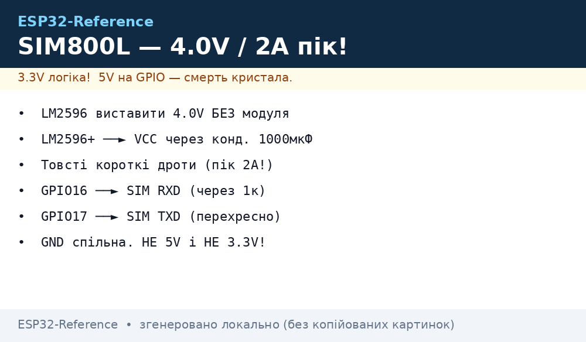
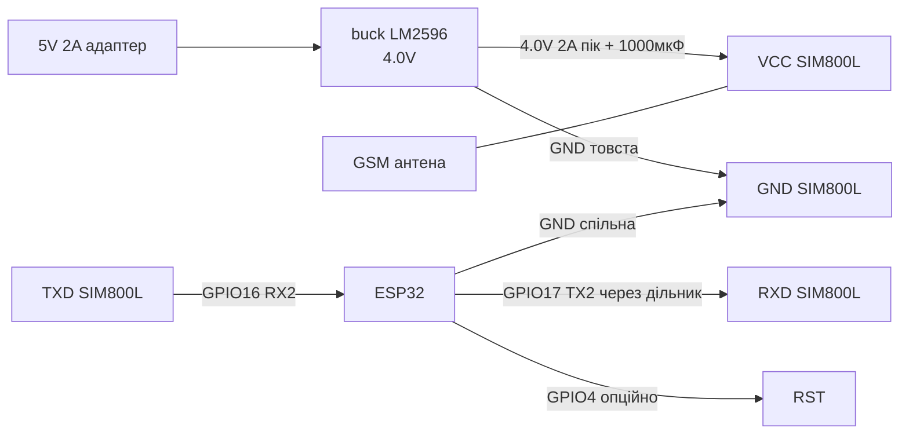
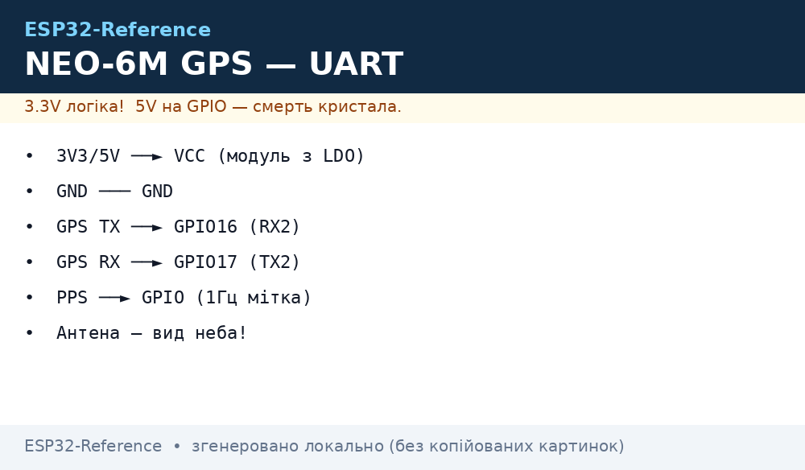
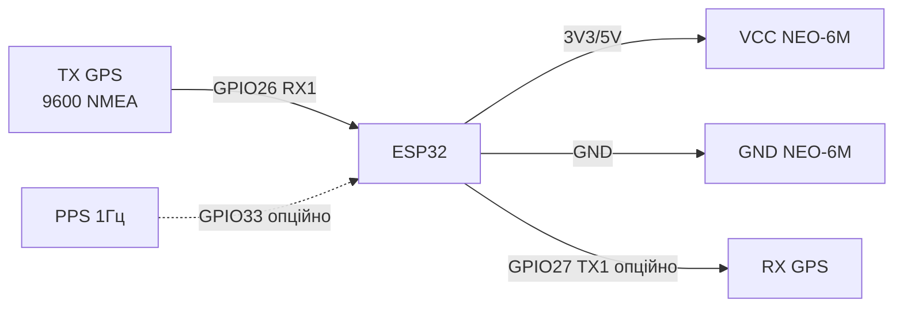
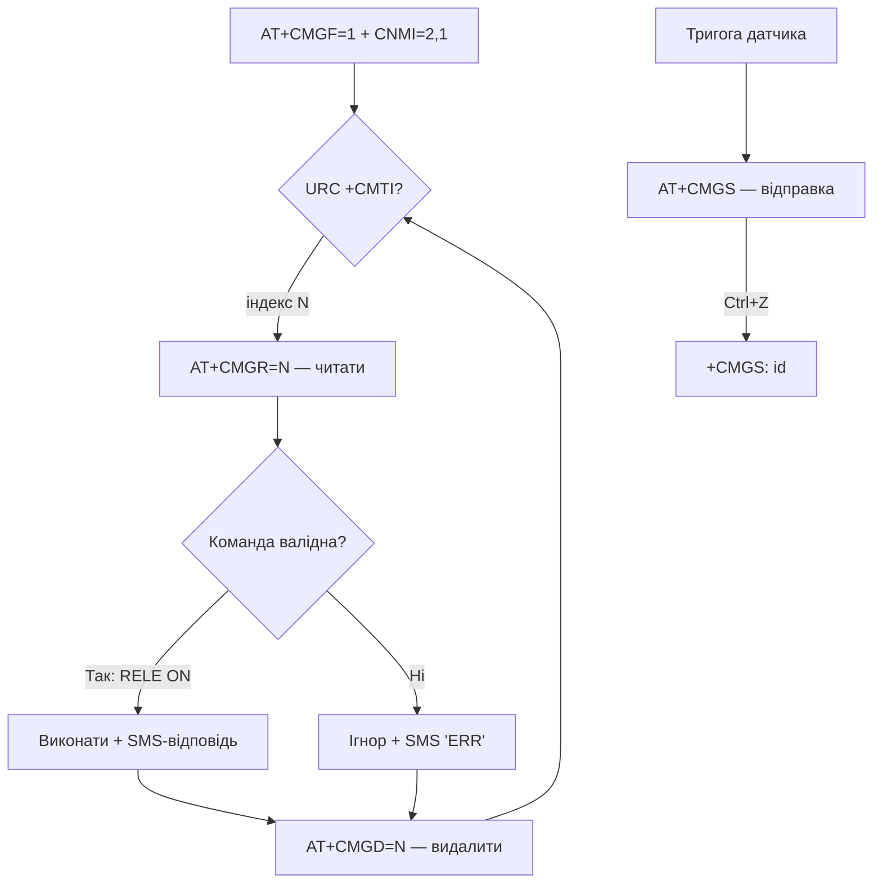
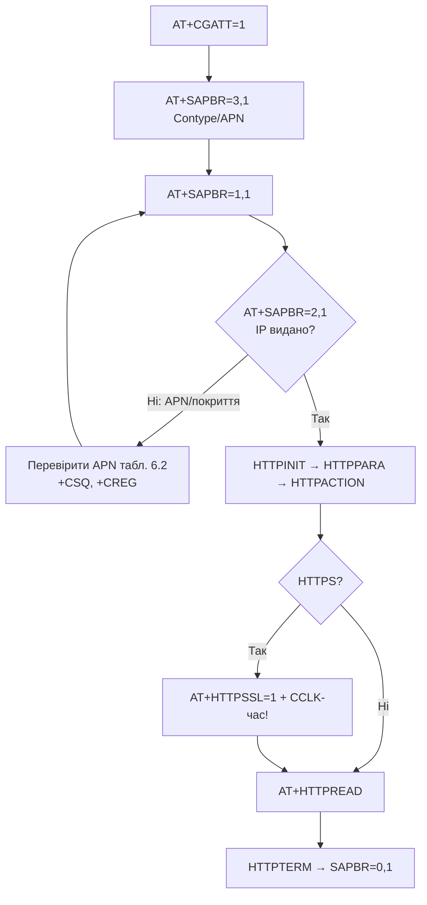
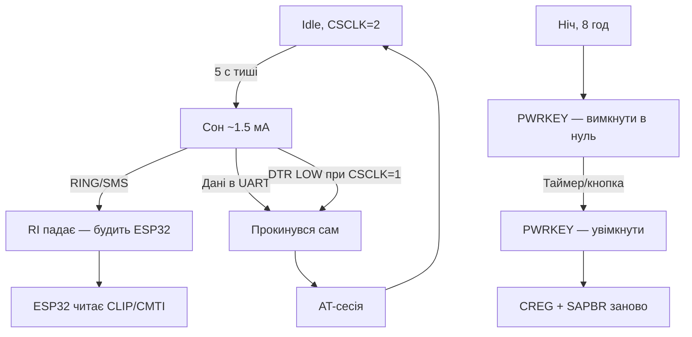
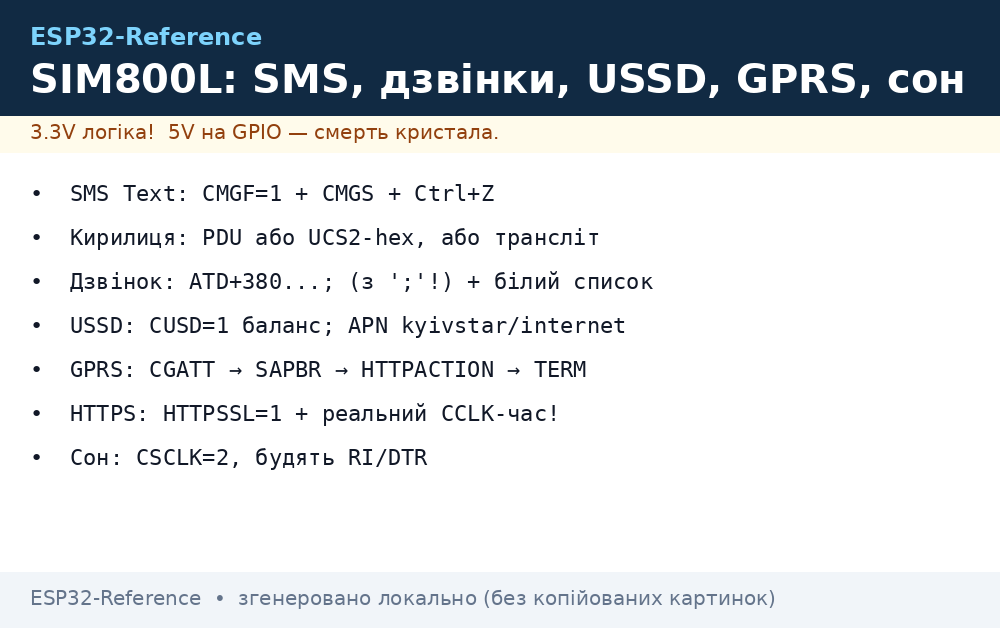

# SIM800L GSM + NEO-6M GPS

> [!danger] SIM800L НЕ живити від 5V і НЕ від 3.3V ESP32! Норма: 3.7-4.2V, пік 2A в TX-бурсті. Без потужного живлення - вічні перезавантаження і мережа не реєструється.

Контекст: UART див. [UART](../../../ESP32-Reference/04-Shini/01-UART.md), живлення [01-Lancjugi-zhivlennya](../../../ESP32-Reference/02-Zhivlennya/01-Lancjugi-zhivlennya.md) та [01-Buck-Boost-Solar](../../../ESP32-Reference/13-Moduli-zhivlennya-rivniv/01-Buck-Boost-Solar.md), рівні [02-Level-Shifters](../../../ESP32-Reference/13-Moduli-zhivlennya-rivniv/02-Level-Shifters.md), піни [01-Pinout-tablici](../../../ESP32-Reference/99-Dodatki/01-Pinout-tablici.md), діагностика [02-Troubleshooting-FAQ](../../../ESP32-Reference/99-Dodatki/02-Troubleshooting-FAQ.md), старт [Home](../../../ESP32-Reference/Home.md).

## Призначення

SIM800L GSM + NEO-6M GPS - SIM800L - живлення (найважливіше); Легенда пінів модуля SIM800L; ASCII-схема (SIM800L). SIM800L НЕ живити від 5V і НЕ від 3.3V ESP32! Норма: 3.7-4.2V, пік 2A в TX-бурсті. Без потужного живлення - вічні перезавантаження і мережа не реєструється. Середній струм 200-500 мА, пік TX до 2A (577 мкс слот).

## 1. SIM800L - живлення (найважливіше)

- Чіп SIM800L: 3.4-4.4V (номінал 4.0V). 5V - смерть. 3.3V - нестабільність.
- Середній струм 200-500 мА, пік TX до 2A (577 мкс слот).
- Рекомендована схема: 5V 2A адаптер -> buck LM2596 виставлений на 4.0V -> електроліт 1000 мкФ low-ESR + кераміка 100 нФ біля SIM800L. Діод Шотткі проти переполюсовки.
- Дроти живлення товсті й короткі (<10 см). Земля спільна з ESP32.
- Світлодіод NET: блимає 1 раз/сек - немає мережі, 1 раз/3 сек - зареєстровано.


*Рис. SIM800L - живлення 4.0V 2A через buck LM2596 + 1000 мкФ, UART перехресно до ESP32.*

### Легенда пінів модуля SIM800L

Синя маленька плата SIM800L має гребінку: VCC, RST, RXD, TXD, GND + окремо виводи NET (індикація), MIC/ SPK (аудіо), ANT (U.FL для GSM-антени).

| Пін | Позначення | Тип | Куди на ESP32 / живлення | Примітка |
| --- | --- | --- | --- | --- |
| 1 | VCC | Живлення 3.4-4.4V, пік 2A | Вихід buck LM2596 виставлений на 4.0V | НЕ 5V (пробій!) і НЕ 3.3V ESP32 (просадки, ребути); + електроліт 1000 мкФ low-ESR + 100 нФ біля піна |
| 2 | RST | Вхід reset, active low | GPIO4 або кнопка до GND | Імпульс LOW >100 мс = перезапуск; у роботі підтягнутий до HIGH |
| 3 | RXD | Вхід UART | GPIO17 (TX2 ESP32) через дільник | ESP32 TX → SIM800L RX: дільник 1к/2к або 2к/3.3к, або level-shifter, див. [02-Level-Shifters](../../../ESP32-Reference/13-Moduli-zhivlennya-rivniv/02-Level-Shifters.md) |
| 4 | TXD | Вихід UART | GPIO16 (RX2 ESP32) безпосередньо | SIM800L TX → ESP32 RX перехресно; рівень ~2.8V - ESP32 читає як HIGH без проблем |
| 5 | GND | Земля | GND ESP32 + GND buck | Спільна товста земля, дроти <10 см, зірка заземлення |
| 6 | NET | Вихід індикація | LED на платі / GPIO-вхід (опційно) | Блимання: 1 Гц = пошук мережі, 1 раз/3 с = зареєстровано |
| 7 | MIC_P / MIC_N | Аналоговий вхід | Електретний мікрофон | Для дзвінків, у IoT зазвичай NC |
| 8 | SPK_P / SPK_N | Аналоговий вихід | Динамік 8 Ом | Для дзвінків, у IoT зазвичай NC |
| 9 | ANT | ВЧ | GSM-антена (U.FL або клема) | Без антени не реєструється, TX на повну потужність гріється |

Чому НЕ 5V і НЕ 3.3V:

1. **НЕ 5V:** абсолютний максимум чипа 4.4V. Подача 5V пробиває RF-підсилювач - модуль гріється і вмирає за секунди. Виняток - лише червона плата EVB з власним стабілізатором і micro-USB: їй можна 5V, бо на платі стоїть buck. Перевіряй свою версію візуально!
2. **НЕ 3.3V ESP32:** нижня межа чипа 3.4V, а в TX-бурсті 2A просадка на тонких доріжках DevKit сягає 0.3-0.5V → 2.8V на чипі → brownout і перезапуск саме в момент реєстрації в мережі. Симптом класичний: «AT OK, а AT+CREG ніколи не 0,1».
3. **Правильно:** окремий buck LM2596 (або MP1584) з 5V 2A адаптера, на виході рівно 4.0V під навантаженням, електроліт 1000 мкФ low-ESR + кераміка 100 нФ біля SIM800L, товсті короткі дроти, див. [01-Lancjugi-zhivlennya](../../../ESP32-Reference/02-Zhivlennya/01-Lancjugi-zhivlennya.md) і [01-Buck-Boost-Solar](../../../ESP32-Reference/13-Moduli-zhivlennya-rivniv/01-Buck-Boost-Solar.md).
4. **UART перехресно:** TX модуля → RX ESP32, RX модуля → TX ESP32. Швидкість за замовчуванням 115200, див. [UART](../../../ESP32-Reference/04-Shini/01-UART.md). RX SIM800L не 5V-толерантний - дільник обов'язковий.
5. **AT-повідомлення:** після `AT+CMGF=1` і `AT+CMGS` модуль відповідає `>` і чекає текст + Ctrl+Z (0x1A). Довгі AT-сесії вести через міст Serial↔Serial2 для відладки.

| ESP32 | SIM800L | Примітка |
| --- | --- | --- |
| - (LM2596 4.0V) | VCC | 4.0V 2A + 1000 мкФ, НЕ 5V/3.3V |
| GND | GND | спільна товста земля |
| GPIO16 (RX2) | TX | SIM800L TX -> ESP32 RX, дільник/level-shift якщо 5V-версія плати |
| GPIO17 (TX2) | RX | ESP32 TX -> SIM800L RX через дільник 2к/3.3к або 1к/2к |
| GPIO4 | RST | опційно, active low |
| - | ANT | GSM-антена, без неї не реєструється |

> Червона плата SIM800L EVB з micro-USB - має свій стабілізатор, їй можна 5V. Синя маленька плата без стабілізатора - тільки 4V! Перевіряй свою версію.

### ASCII-схема (SIM800L)

```text
Живлення SIM800L (обов'язково окремо!):
  5V 2A адаптер ──► [buck LM2596] ──(4.0V)──► VCC SIM800L
                                          ├─► 1000мкФ low-ESR (+) до VCC, (-) до GND
                                          └── 100нФ кераміка прямо на пінах

ESP32 DevKit          SIM800L (синя плата)
────────────          ───────────────────
GND ────────────────  GND (товстий провід <10 см, спільна з buck!)
GPIO16 (RX2) ◄──────  TXD (безпосередньо)
GPIO17 (TX2) ──[1к]──► RXD
                      [2к] від RXD до GND (дільник 5V→3.3V)
GPIO4 ─────────────►  RST (опційно)
                      ANT ──► GSM-антена (обов'язково!)
                      NET ──► LED блимає 1/3с = OK

Serial2.begin(115200, SERIAL_8N1, 16, 17);
```

### Mermaid (SIM800L)



## 2. AT-команди базові

```text
AT                  -> OK (зв'язок)
AT+CPIN?            -> READY (SIM-карта)
AT+CSQ              -> рівень сигналу 0-31 (норма >10)
AT+CREG?            -> 0,1 зареєстровано home; 0,5 роумінг
AT+COPS?            -> оператор
AT+CBC              -> напруга живлення SIM800L
AT+CMGF=1           -> текстовий режим SMS
AT+CMGS="+380..."   -> відправка SMS (далі текст + Ctrl+Z)
AT+SAPBR=3,1,"APN","internet" -> налаштування GPRS
AT+HTTPINIT / AT+HTTPPARA / AT+HTTPACTION=0 -> HTTP GET
```

### Зведена шпаргалка (єдиний формат бази: команда → відповідь → зміст → помилка)

Деталі кожної групи - у розділах 4-9; повна шпаргалка на 35 команд (EC200U/A7670) - в [18-Cellular-LoRa-2](../../../ESP32-Reference/12-Moduli-zvyazku/18-Cellular-LoRa-2.md), базова 4G-таблиця - в [07-SIM7600-W5500-MCP2515](../../../ESP32-Reference/12-Moduli-zvyazku/07-SIM7600-W5500-MCP2515.md).

| Команда | Відповідь OK | Що означає | Типова помилка |
| --- | --- | --- | --- |
| `AT` | `OK` | Зв'язок по UART | Тиша: baud 115200? RX/TX перехресно? |
| `AT+CPIN?` | `+CPIN: READY` | SIM готова | `SIM PIN`: `AT+CPIN="1234"`; IoT - зняти CLCK (розд. 1 ноти 26) |
| `AT+CSQ` | `+CSQ: 18,0` | Рівень, норма >10 | 99,99: антена/екран/підвал |
| `AT+CREG?` | `+CREG: 0,1` | Реєстрація home | 0,2: живлення/антена/PIN; блимання NET 1/с |
| `AT+CBC` | `+CBC: 0,95,4100` | VBAT ~4100 мВ | <3600: дроти/buck/конденсатор (розд. 5 ноти 26) |
| `AT+CMGF=1` | `OK` | Text-режим SMS | Без нього `CMGS` → ERROR (розд. 4) |
| `AT+CMGS="..."` + текст + `0x1A` | `+CMGS: id` | SMS надіслано | `+CMS ERROR 305`: пам'ять/мережа; кирилиця - PDU (розд. 4) |
| `ATD+380...;` | `OK` | Голосовий дзвінок | Без `;` - data-дзвінок/тиша (розд. 5) |
| `AT+CUSD=1,"*101#"` | URC `+CUSD` за 2-10 с | USSD-баланс | Порожньо: повторити; кирилиця - UCS2-hex (розд. 6) |
| `AT+SAPBR=1,1` | `OK` | Bearer відкрито | ERROR: APN буквально з табл. 6.2; спочатку `CGATT=1` (розд. 7) |
| `AT+HTTPACTION=0` | `+HTTPACTION: 0,200,N` | HTTP OK, N байт | 601: URL/SSL/час `CCLK` (розд. 7) |
| `AT+CSCLK=2` | `OK` | Автосон | Не будиться: смикнути DTR (розд. 9) |

## 3. NEO-6M GPS

Характеристики: u-blox NEO-6M, UART 9600 NMEA, холодний старт ~30 с, гарячий ~5 с, антена керамічна + опційно активна. Живлення 3.3-5V (на платі є LDO), логіка 3.3V толерантна до ESP32 безпосередньо.


*Рис. NEO-6M - UART до ESP32 перехресно (TX модуля → RX контролера), PPS опційно.*

### Легенда пінів модуля NEO-6M GPS

| Пін | Позначення | Тип | Куди на ESP32 | Примітка |
| --- | --- | --- | --- | --- |
| 1 | VCC | Живлення 3.3-5V | 3V3 або 5V за маркуванням плати | На платі GY-GPS6MV2 стоїть LDO - їй можна 5V; логіка все одно 3.3V |
| 2 | GND | Земля | GND | Спільна земля з ESP32 |
| 3 | TX | Вихід UART 9600 NMEA | GPIO26 (RX1 ESP32) | TX модуля → RX ESP32 перехресно! Потік NMEA $GPGGA/$GPRMC |
| 4 | RX | Вхід UART | GPIO27 (TX1 ESP32) або NC | ESP32 TX → GPS RX; потрібен лише для конфігурації u-blox (можна не підключати) |
| 5 | PPS | Вихід цифра 1 Гц | Будь-який GPIO з перериванням (опційно) | Точний імпульс секунди для синхронізації часу, ширина ~100 мс |

Пояснення:

- **TX модуля → RX ESP32:** головне правило UART, див. [UART](../../../ESP32-Reference/04-Shini/01-UART.md). GPS лише передає NMEA, тому мінімальна схема - 4 дроти: VCC, GND, TX→RX. RX GPS можна залишити вільним.
- **PPS:** імпульс точної секунди від супутників (джиттер ~десятки нс). Використовується для RTC-синхронізації або міток часу. Без PPS час беруть з NMEA-речення `$GPRMC`.
- **Антена:** керамічний квадрат на платі працює лише з видом неба; у приміщенні - зовнішня активна антена з живленням 3.3V через коаксіал. Холодний старт з видом неба 30 с - 15 хв.
- **Два UART одночасно:** SIM800L на Serial2 (16/17), GPS на Serial1 (26/27). Не вішати обидва на один UART - NMEA потопить AT-відповіді.

| ESP32 | NEO-6M | Примітка |
| --- | --- | --- |
| 3V3 або 5V | VCC | за маркуванням плати (зазвичай 3.3-5V) |
| GND | GND | спільна земля |
| GPIO16 (RX2) | TX | GPS TX -> ESP32 RX |
| GPIO17 (TX2) | RX | для конфігурації u-blox, можна не підключати |
| - | PPS | опційно, точний імпульс 1 Гц |

> Два UART-пристрої одночасно: SIM800L на Serial2 (16/17), GPS на Serial1 (напр. RX=26 TX=27) або програмний. Не вішати обидва на один UART.

### ASCII-схема (NEO-6M)

```text
ESP32 DevKit          NEO-6M GPS
────────────          ──────────
3V3 (або 5V) ──────►  VCC (за маркуванням плати)
GND ────────────────  GND
GPIO26 (RX1) ◄──────  TX (9600 NMEA, перехресно!)
GPIO27 (TX1) ──────►  RX (опційно, для конфігу u-blox)
GPIO33 ────────────◄  PPS (опційно, 1 Гц)

gpsSer.begin(9600, SERIAL_8N1, 26, 27);
Вид неба обов'язковий! У приміщенні — активна антена.
```

### Mermaid (NEO-6M)



### Порівняння NEO-6M vs 7/8/M10: що брати у 2026

| Модуль | Супутники | Холодний старт | Струм | Ціна (орієнтир) | Вердикт |
| --- | --- | --- | --- | --- | --- |
| NEO-6M | GPS+SBAS (72 канали) | ~30 с (з небом) | ~40 мА | $5-8 | Класика для навчання; для виробу - застарів |
| NEO-7M | GPS+GLONASS | ~25 с | ~35 мА | $7-10 | GLONASS у місті допомагає, але рідкісний |
| NEO-8M (M8N) | GPS+GLONASS+BeiDou+Galileo | ~20 с | ~30 мА | $10-15 | **Золота середина**: 3 сузір'я, PPS, той же footprint |
| NEO-M10 (M10Q) | 4 сузір'я, L1 | ~15 с + низьке споживання | ~20 мА | $15-25 | Батарейні трекери; I2C+UART, крихітний 9.7×10.1 мм |
| ZED-F9P | L1+L2, RTK | сантиметри з поправками | ~70 мА | $150+ | Геодезія, див. [17-GNSS-RTK](../../../ESP32-Reference/12-Moduli-zvyazku/17-GNSS-RTK.md) |

> Піни NEO-6M/7M/8M на платах GY-GPSxx сумісні (VCC/GND/TX/RX/PPS) - апгрейд перепайкою без зміни прошивки. M10Q - інший footprint (Qwiic), зате їсть удвічі менше.

### Холодний / теплий / гарячий старт + батарейка V_BCKP

| Старт | Що збережено | Час до Fix | Коли |
| --- | --- | --- | --- |
| Холодний | Нічого (перше ввімкнення, переїзд >500 км) | 30 с - 15 хв | З коробки, після місяця без живлення |
| Теплий | Альманах + приблизний час | 5-30 с | V_BCKP живий, доба без неба |
| Гарячий | Ефемериди + час + позиція | 1-5 с | Короткий сон, тунель 5 хв |

```text
V_BCKP (резервне живлення RTC+SRAM приймача):
  NEO-6M плата GY-GPS6MV2 ──► пін V_BCKP (якщо виведений) ──► CR1220/ML414 через діод
  або суперкап 0.22 Ф: тримає теплий старт ~2–7 діб без основного живлення.
  Без V_BCKP кожне ввімкнення = холодний старт = 30+ с очікування в полі!
```

### AssistNow (AGPS): ефемериди через інтернет

Замість чекати ефемериди з неба (12.5 хв повний альманах!) - залити через UART:

```text
1. Скачати AssistNow Online (u-blox сервер) або Offline (3–14 діб прогнозу).
2. Залити бінарник у приймач UBX-пакетом (115200 бод, RX GPS підключений!).
3. Холодний старт стискається до 3–10 с.
Для ESP32-практики: ESP32 качає файл по WiFi/GPRS (розділи 7–8) і переливає в GPS.
Окупність: трекер, що прокидається раз на годину — тільки з AssistNow або M10.
```

### PPS-синхронізація часу (точність без NTP)

PPS - імпульс секунди з джиттером десятки нс (проти мілісекунд у NTP через WiFi!):

```cpp
// Arduino: мітка точної секунди за PPS + добивка часу з RMC
volatile unsigned long ppsMicros = 0;
void IRAM_ATTR onPPS() { ppsMicros = micros(); }
void setup() {
  pinMode(33, INPUT);
  attachInterrupt(33, onPPS, RISING);  // PPS від NEO-6M/M8N
}
// У loop: коли TinyGPS++ розпарсив RMC (година:хв:сек) — прив'язати до ppsMicros.
// Точність міток: ±1 мс без зусиль (обмеження — джиттер loop, не PPS).
// Для TLS/HTTPS через модем цього досить; для науки — input capture таймера.
```

## 4. SMS докладно: Text vs PDU, читання, видалення, URC

### 4.1. Два режими: Text (латиниця) vs PDU (кирилиця)

| Режим | Команда | Що вміє | Обмеження |
| --- | --- | --- | --- |
| Text | `AT+CMGF=1` | Прості ASCII-SMS, читабельні команди | Тільки GSM 7-bit (латиниця, цифри); кирилиця - кракозябри |
| PDU | `AT+CMGF=0` | Будь-який алфавіт через UCS2-hex, довгі/конкатеновані | Треба кодувати/декодувати PDU (онлайн-кодувальники або бібліотека) |
| Кодування | `AT+CSCS?` | `"GSM"` за замовчуванням; `"UCS2"` для hex-тексту в Text-режимі | Після `AT+CSCS="UCS2"` номер теж hex: `AT+CMGS="002B0033..."` |

Практичне правило: сповіщення латиницею/транслітом - Text-режим; кирилиця клієнту - PDU або UCS2-hex. Трансліт в аварійних SMS - нормальна інженерна практика (доставка важливіша за красу).

### 4.2. Відправка SMS покроково (Text-режим)

```text
AT+CMGF=1            -> OK (текстовий режим)
AT+CSCS="GSM"        -> OK (кодування)
AT+CMGS="+380971234567"
>                    <- модуль чекає текст (запрошення ">")
ALARM: temp 85C!     <- текст, БЕЗ Enter зайвого
<Ctrl+Z 0x1A>        -> +CMGS: 12 / OK (надіслано, номер в архіві)
<Esc 0x1B>           -> скасувати набір (якщо передумав після ">")
```

> Після `>` чекати не більше 10-15 с: модуль сам повернеться в командний режим. Довгі паузи між символами тексту - модуль вирішить, що це кінець, і відправить обрізане.

### 4.3. Читання, видалення, пам'ять, нові повідомлення

```text
AT+CPMS?             -> +CPMS: "SM",3,50,"SM",3,50,"SM",3,50 (зайнято/всього)
AT+CPMS="SM","SM","SM" -> OK (сховище: SIM; альтернатива "ME" — пам'ять модуля)
AT+CMGL="ALL"        -> список усіх (повільно при 50 шт — краще "REC UNREAD")
AT+CMGR=2            -> прочитати №2 з індексом
AT+CMGD=2            -> видалити №2
AT+CMGD=1,4          -> видалити ВСІ (індекс ігнорується, прапор 4)
AT+CNMI=2,1,0,0,0    -> URC +CMTI при новій SMS (індекс одразу в події!)
```

> SIM-карта тримає зазвичай 30-50 SMS. Переповнення = нові не доходять МОВЧКИ. В автономному пристрої: після обробки кожної вхідної - `AT+CMGD`, плюс раз на добу `AT+CMGD=1,4` як страховка.

### 4.4. Mermaid: життєвий цикл SMS



## 5. Голосові дзвінки: ATD/ATA/ATH, АОН, автовідповідь, аудіо

### 5.1. Команди дзвінка

```text
ATD+380971234567;    -> OK → дзвінок (крапка з комою ОБОВ'ЯЗКОВА = голосовий режим!)
ATD+380971234567     -> без ";" = DATA-дзвінок (не те, буде помилка/тиша)
ATA                  -> підняти вхідний (після URC RING)
ATH                  -> покласти трубку (свою або чужу)
AT+CLIP=1            -> АОН: вхідний RING йде з +CLIP: "+380...",145
ATS0=2               -> автовідповідь після 2 гудків (0 = вимкнено)
AT+CHUP              -> альтернатива ATH (покласти)
```

Розбір вхідного з АОН:

```text
RING                          <- гудок 1
+CLIP: "+380971234567",145    <- хто дзвонить (при AT+CLIP=1)
RING                          <- гудок 2 …
```

> Білий список номерів - у прошивці: порівнювати `+CLIP`-номер з NVS-списком, чужих - `ATH` одразу. Дзвінок як безкоштовний канал керування: «дзвінок з номера господаря = відкрити ворота, передзвонювати не треба» (визначаємо по 1-2 RING і кладемо самі - 0 грн).

### 5.2. Аудіо: мікрофон/динамік синьої плати

| Пін/команда | Призначення | Налаштування |
| --- | --- | --- |
| MIC_P / MIC_N | Електретний мікрофон | Безпосередньо капсуль, живлення дає сам модуль |
| SPK_P / SPK_N | Динамік 8 Ом | Диференційно, НЕ садити один кінець на GND! |
| `AT+CMIC=0,10` | Чутливість мікрофона (канал 0, рівень 0-15) | Підбирати: фон/луна |
| `AT+CLVL=60` | Гучність динаміка 0-100 | 60 - стартова |
| `AT+CHFA=1` | Перемикання аудіоканалу (гарнітура/гучномовець на EVB) | На синій платі зазвичай один канал |

## 6. USSD і APN українських операторів

### 6.1. USSD-запити

```text
AT+CUSD=1,"*101#"     -> OK, відповідь приходить URC:
+CUSD: 0,"Balans 45.20 UAH",15   <- текст (може бути UCS2-hex при AT+CSCS="UCS2")
AT+CUSD=1,"*101#",15  -> той самий запит з явним кодуванням GSM 7-bit (15)
AT+CUSD=2             -> скасувати активну USSD-сесію
```

> USSD-відповідь - НЕ синхронна: приходить окремим `+CUSD` через 2-10 с. Парсер AT має вміти URC посеред будь-якого очікування. Кирилична відповідь у UCS2-hex - декодувати hex→UTF-16.

### 6.2. Оператори України: USSD-портали та APN

| Оператор | Баланс/меню (USSD) | APN (GPRS) | Логін/пароль | Примітка |
| --- | --- | --- | --- | --- |
| Kyivstar | `*111#` (меню «Мій Київстар», там і баланс) | `kyivstar` | порожні | Старий `www.kyivstar.net` - legacy, не використовувати |
| Vodafone UA | `*101#` (баланс одразу) | `internet` | порожні | - |
| Lifecell | `*111#` (баланс/меню) | `internet` | порожні | - |

> APN чутливий до регістру і пробілів: `"Internet"` ≠ `"internet"` - мережа відхилить PDP-контекст з `AT+SAPBR=1,1` помилкою. Копіювати з таблиці буквально.

## 7. GPRS → HTTP/HTTPS: SAPBR-послідовність і SSL

### 7.1. Підняття GPRS-сесії (порядок суворий!)

```text
AT+CGATT=1                              -> OK (attach до GPRS-мережі)
AT+SAPBR=3,1,"Contype","GPRS"            -> OK
AT+SAPBR=3,1,"APN","kyivstar"            -> OK (свій APN з таблиці 6.2!)
AT+SAPBR=1,1                             -> OK (відкрити bearer; чекати до 30 с)
AT+SAPBR=2,1                             -> +SAPBR: 1,1,"10.20.30.40" (IP видано!)
```

### 7.2. HTTP GET / POST вбудованим стеком

```text
AT+HTTPINIT                              -> OK
AT+HTTPPARA="CID",1                      -> OK (прив'язка до bearer 1)
AT+HTTPPARA="URL","http://api.example.com/data?id=esp32_01" -> OK
AT+HTTPACTION=0                          -> OK, далі URC: +HTTPACTION: 0,200,142
AT+HTTPREAD                              -> +HTTPREAD: 142 <тіло відповіді>
AT+HTTPTERM                              -> OK (закрити HTTP)
AT+SAPBR=0,1                             -> OK (закрити bearer — економить трафік!)
```

POST з JSON:

```text
AT+HTTPPARA="URL","http://api.example.com/post" -> OK
AT+HTTPPARA="CONTENT","application/json"        -> OK
AT+HTTPDATA=48,10000                             -> DOWNLOAD (запрошення "DOWNLOAD")
{"id":"esp32_01","t":23.5}                       -> OK (48 байт тіла)
AT+HTTPACTION=1                                  -> +HTTPACTION: 1,200,16
```

### 7.3. HTTPS (SSL) - чесно про межі

```text
AT+HTTPSSL=1                             -> OK (увімкнути TLS для наступних HTTPACTION)
AT+HTTPPARA="URL","https://api.example.com/data" -> OK
AT+HTTPACTION=0                          -> +HTTPACTION: 0,200,...
```

| Питання | Відповідь |
| --- | --- |
| Чи вміє SIM800 HTTPS? | Так, `AT+HTTPSSL=1`. TLS 1.0-1.2, набір шифрів старий - частина сучасних серверів відмовить у handshake |
| Свій CA-сертифікат | Завантажити у файлову систему модуля (`AT+FSWRITE`), прив'язати через SSL-команди; процедура громіздка |
| Перевірка hostname | Слабка/відсутня - для критичних даних краще свій шлюз: ESP32→HTTP→свій сервер→HTTPS далі |
| Час для TLS | Сертифікати валідуються за часом: спочатку `AT+CCLK?` має показувати реальний час (NITZ від мережі або `AT+CCLK="26/09/30,08:00:00+12"`) |

### 7.4. Mermaid: GPRS-сесія



## 8. E-mail через GPRS (оглядово - краще шлюзом)

SIM800 має вбудований SMTP-клієнт (`AT+EMAILCID`, `AT+EMAILTO`, `AT+SMTPSRV`, `AT+SMTPAUTH`, `AT+SMTPSEND`). Послідовність робоча, але:

1. Авторизація сучасних поштовиків (OAuth2, app-passwords) - через AT-термінал біль і сльози.
2. Кирилиця в темі/тілі - кодування вручну.
3. Будь-яка зміна політики Gmail - і прошивка в полі ламається.

> Інженерне рішення: ESP32 шле HTTP POST на СВІЙ сервер (розділ 7.2), а листи відправляє сервер звичайною бібліотекою (Python `smtplib`, Node `nodemailer`). Модем лишається дурним транспортом - так надійніше на порядок.

## 9. Енергоспоживання та сон: CSCLK, DTR, PWRKEY

### 9.1. Режими SIM800L

| Режим | Струм (орієнтир) | Як увійти | Як вийти | Коли |
| --- | --- | --- | --- | --- |
| Активний (TX-бурст) | до 2000 мА пік | Дзвінок/GPRS-трафік | Кінець трафіку | Передача |
| Idle зареєстрований | ~20 мА | Просто чекати | - | Чергування |
| Сон `AT+CSCLK=1` | ~1-2 мА | DTR HIGH + 5 с тиші | DTR LOW | Батарейні датчики |
| Сон `AT+CSCLK=2` | ~1-2 мА | Автоматично після 5 с тиші | Дзвінок/SMS/дані по UART | Те саме без дроту DTR |
| Вимкнений | ~0 (десятки мкА) | PWRKEY LOW 1-2 с | PWRKEY LOW 1-2 с | Глибоке чергування |

```text
AT+CSCLK=0     -> OK (сон заборонено, за замовчуванням)
AT+CSCLK=1     -> OK (сон за рівнем DTR: HIGH = спати)
AT+CSCLK=2     -> OK (автосон: засне сам, прокинеться сам)
```

### 9.2. Схема сну з DTR і RI

```text
ESP32 DevKit          SIM800L
───────────          ───────
GPIO18 ────────────►  DTR (HIGH = "можна спати" при CSCLK=1)
GPIO19 ◄────────────  RI (прокидається LOW на 120 мс при дзвінку/SMS!)
GND ────────────────  GND
```

> PSM як у NB-IoT у SIM800 НЕМАЄ - не шукати. Економія будується так: `CSCLK=2` між сеансами + повне вимкнення PWRKEY на години (з MOSFET-ключем живлення, див. [04-LDO-Buck-XL4015-Protect](../../../ESP32-Reference/13-Moduli-zhivlennya-rivniv/04-LDO-Buck-XL4015-Protect.md)). RI-пін - будильник ESP32: прокинувся → читай `+CLIP`/`+CMTI`.

### 9.3. Mermaid: сон і пробудження




*Рис. SIM800L як термінал сповіщень: SMS (Text/PDU), голос з білим списком, USSD-баланс, GPRS-сесія SAPBR, сон через DTR/RI.*

## Код (3 фреймворки)

### Arduino - SIM800L AT + NEO-6M TinyGPS++

```cpp
#include <TinyGPS++.h>
TinyGPSPlus gps;
HardwareSerial sim(2); // RX=16 TX=17
HardwareSerial gpsSer(1); // RX=26 TX=27
void sendAT(const char* cmd, int wait=1000){
  sim.println(cmd); delay(wait);
  while(sim.available()) Serial.write(sim.read());
}
// Відправка SMS (Text-режим, латиниця/трансліт), розділ 4.2
bool smsSend(const char* num, const char* text){
  sim.println("AT+CMGF=1"); delay(300);
  sim.print("AT+CMGS=\""); sim.print(num); sim.println("\"");
  delay(500);
  if(!sim.find(">")) return false;   // немає запрошення — вихід
  sim.print(text); delay(300);
  sim.write(0x1A);                    // Ctrl+Z = відправити
  return sim.find("+CMGS:");          // чекаємо підтвердження
}
// Дзвінок-тривога з білим списком (розділ 5.1): дзвонимо самі
void alarmCall(const char* num){
  sim.print("ATD"); sim.print(num); sim.println(";"); // ";" = голос!
  delay(25000);                       // 25 с гудків
  sim.println("ATH");                 // покласти
}
void setup(){
  Serial.begin(115200); sim.begin(115200, SERIAL_8N1, 16, 17); gpsSer.begin(9600, SERIAL_8N1, 26, 27);
  delay(3000); sendAT("AT"); sendAT("AT+CSQ"); sendAT("AT+CREG?");
  sendAT("AT+CLIP=1");                // АОН для білого списку
  sendAT("AT+CNMI=2,1,0,0,0");        // URC нових SMS
}
void setup(){
  Serial.begin(115200); sim.begin(115200, SERIAL_8N1, 16, 17); gpsSer.begin(9600, SERIAL_8N1, 26, 27);
  delay(3000); sendAT("AT"); sendAT("AT+CSQ"); sendAT("AT+CREG?");
}
void loop(){
  while(gpsSer.available()) if(gps.encode(gpsSer.read())){
    if(gps.location.isValid()){ Serial.printf("LAT %.6f LON %.6f SAT %d\n", gps.location.lat(), gps.location.lng(), gps.satellites.value()); }
  }
  if(Serial.available()) sim.write(Serial.read()); // AT-міст з монітора
  if(sim.available()) Serial.write(sim.read());
}
```

### MicroPython - AT через UART + micropyGPS

```python
from machine import UART
import time
sim = UART(2, baudrate=115200, rx=16, tx=17)
gps = UART(1, baudrate=9600, rx=26, tx=27)
def at(cmd, wait=1):
    sim.write(cmd + "\r\n")
    time.sleep(wait)
    print(sim.read())
def sms_send(num, text):
    sim.write('AT+CMGF=1\r\n'); time.sleep(0.3)
    sim.write('AT+CMGS="%s"\r\n' % num); time.sleep(0.5)
    sim.write(text); time.sleep(0.3)
    sim.write(bytes([0x1A]))  # Ctrl+Z
    time.sleep(3)
    print(sim.read())
def ussd(code="*101#"):
    sim.write('AT+CUSD=1,"%s"\r\n' % code)
    time.sleep(8)  # відповідь приходить URC +CUSD із затримкою!
    print(sim.read())
at("AT"); at("AT+CSQ"); at("AT+CREG?")
at('AT+CLIP=1'); at('AT+CNMI=2,1,0,0,0')
while True:
    if gps.any(): print(gps.readline())
```

### ESP-IDF

```c
// uart_driver_install(UART_NUM_2, 2048, 2048, 0, NULL, 0);
// uart_set_pin(UART_NUM_2, 17, 16, UART_PIN_NO_CHANGE, UART_PIN_NO_CHANGE);
// AT через uart_write_bytes + парсинг OK/CSQ/CREG; GPS NMEA через minmea lib на UART_NUM_1 (26/27)
```

### Живлення SIM800L - покрокова перевірка

1. Виставити buck LM2596 на 4.0V без навантаження, потім підключити SIM800L через 1000 мкФ.
2. `AT+CBC` має показати 3900-4200 мВ; якщо менше - товстіші дроти, коротші, зірка GND.
3. `AT+CSQ` > 10, інакше винести GSM-антену до вікна.
4. `AT+CREG?` чекати `0,1` до 60 с; блимання NET 1 раз/3 с = успіх.
5. GPRS: `AT+SAPBR`, HTTP або MQTT - лише після стабільної реєстрації, див. [01-WiFi-STA-AP](../../../ESP32-Reference/05-Radio/01-WiFi-STA-AP.md) для порівняння з WiFi.

| Симптом | Причина | Рішення |
| --- | --- | --- |
| SIM800L перезавантажується, NET блимає | просадка живлення, пік 2A | LM2596 на 4.0V + 1000 мкФ, товсті дроти |
| AT+CREG 0,2 довго | немає антени / слабкий сигнал / SIM без PIN знято | антена, AT+CPIN, винести до вікна |
| GPS нулі 00.0000 | холодний старт у приміщенні | чекати 5-15 хв з видом неба, активна антена |
| Сміття в UART | різні baud / спільний UART на два модулі | SIM 115200 на Serial2, GPS 9600 на Serial1 |
| SIM800L гріється | подано 5V на синю плату | негайно вимкнути, перевірити 4.0V |
| `AT+CMGS` → `ERROR` / `+CMS ERROR: 305` | не Text-режим або немає пам'яті/мережі | `AT+CMGF=1` перед відправкою; `AT+CPMS?` - чистити; `AT+CREG?` має бути 0,1 |
| SMS кирилицею - кракозябри | Text-режим тільки GSM 7-bit | PDU-режим або `AT+CSCS="UCS2"` з hex, або трансліт (розділ 4.1) |
| Після `>` нічого не відправляється | забутий Ctrl+Z / пауза >15 с | `sim.write(0x1A)` одразу після тексту; Esc скасовує |
| Нові SMS не доходять | переповнена SIM (30-50 шт) | `AT+CMGD=1,4` раз на добу + видаляти після читання |
| USSD порожня відповідь / `+CUSD: 2` | сесія обірвана оператором | повторити через 10 с; `AT+CUSD=2` перед новим запитом |
| `AT+SAPBR=1,1` → ERROR | неправильний APN / немає GPRS-покриття | APN буквально з таблиці 6.2; `AT+CGATT=1` перед SAPBR |
| HTTPS `+HTTPACTION: 0,601` | немає маршруту/сертифікат відхилено (601 = network error) | перевірити URL, `AT+HTTPSSL=1`, `AT+CCLK?` - реальний час! |
| Не прокидається з `CSCLK=2` | дані шлються в сплячий UART | смикнути DTR LOW або слати символ-пробудження і чекати 100 мс |
| `ATD` без `;` - тиша | пішов DATA-дзвінок замість голосового | завжди `ATD+380...;` з крапкою з комою |

## Офіційні джерела

- [SIM800 - даташити й AT Manual (SIMCom)](https://www.simcom.com/product/SIM800.html) - Hardware Design, живлення 3.4-4.4V.
- [NEO-6 - даташит (u-blox)](https://www.u-blox.com/en/product/neo-6-series) - NMEA, антени, фото.
- [ESP32 SIM800L SMS - туторіал з кодом (RNT)](https://randomnerdtutorials.com/esp32-sim800l-send-text-messages-sms/) - TinyGSM, пороги.
- [ESP32 + NEO-6M - туторіал з кодом (RNT)](https://randomnerdtutorials.com/esp32-neo-6m-gps-module-arduino/) - TinyGPS++, широта/довгота.
- [SIM800 Series AT Command Manual (SIMCom)](https://www.simcom.com/product/SIM800.html) - повний довідник: CMGF/CMGS/CUSD/SAPBR/HTTP/CSCLK/CSCS.
- [u-blox NEO-6M Hardware Integration Manual](https://www.u-blox.com/en/product/neo-6-series) - PPS, V_BCKP, активні антени.

## Див. також

- [Home](../../../ESP32-Reference/Home.md)
- [UART](../../../ESP32-Reference/04-Shini/01-UART.md)
- [SPI](../../../ESP32-Reference/04-Shini/02-SPI.md)
- [01-Lancjugi-zhivlennya](../../../ESP32-Reference/02-Zhivlennya/01-Lancjugi-zhivlennya.md)
- [01-GPIO-oglyad](../../../ESP32-Reference/03-GPIO/01-GPIO-oglyad.md)
- [01-Buck-Boost-Solar](../../../ESP32-Reference/13-Moduli-zhivlennya-rivniv/01-Buck-Boost-Solar.md)
- [02-Level-Shifters](../../../ESP32-Reference/13-Moduli-zhivlennya-rivniv/02-Level-Shifters.md)
- [01-RC522-RFID](../../../ESP32-Reference/12-Moduli-zvyazku/01-RC522-RFID.md)
- [02-NRF24-LoRa](../../../ESP32-Reference/12-Moduli-zvyazku/02-NRF24-LoRa.md)
- [03-SIM800L-GPS](../../../ESP32-Reference/12-Moduli-zvyazku/03-SIM800L-GPS.md)
- [04-RS485-CAN-Ethernet-Kamera](../../../ESP32-Reference/12-Moduli-zvyazku/04-RS485-CAN-Ethernet-Kamera.md)
- [01-Pinout-tablici](../../../ESP32-Reference/99-Dodatki/01-Pinout-tablici.md)
- [02-Troubleshooting-FAQ](../../../ESP32-Reference/99-Dodatki/02-Troubleshooting-FAQ.md)
