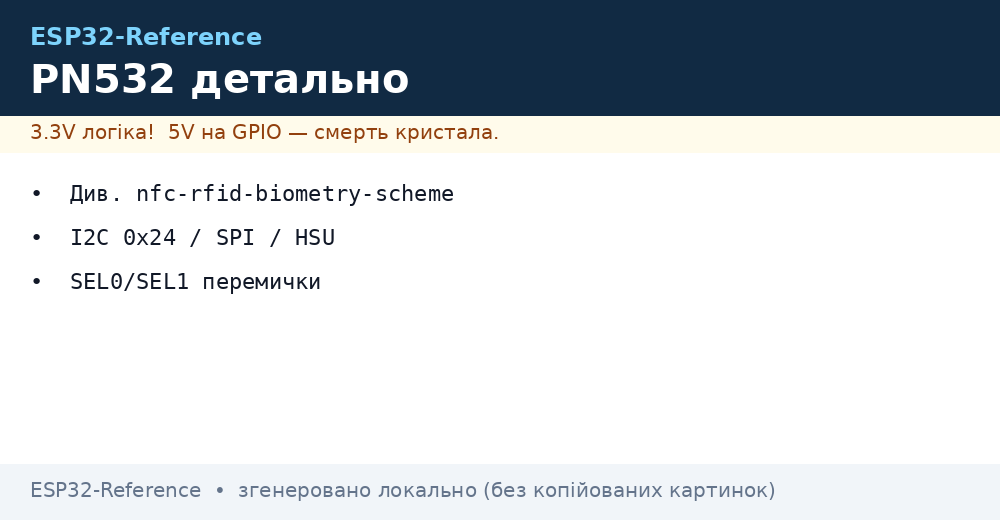
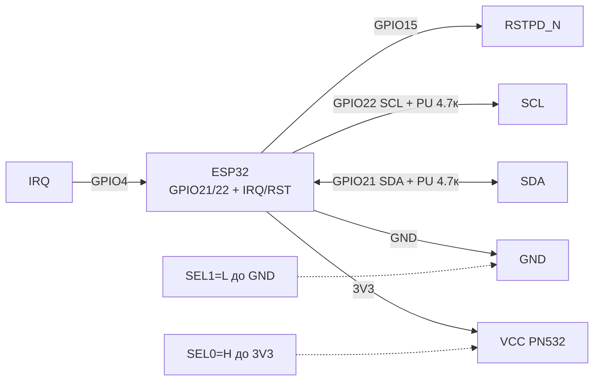
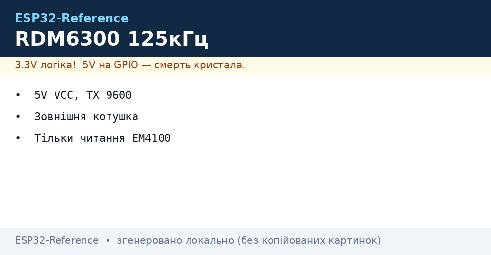
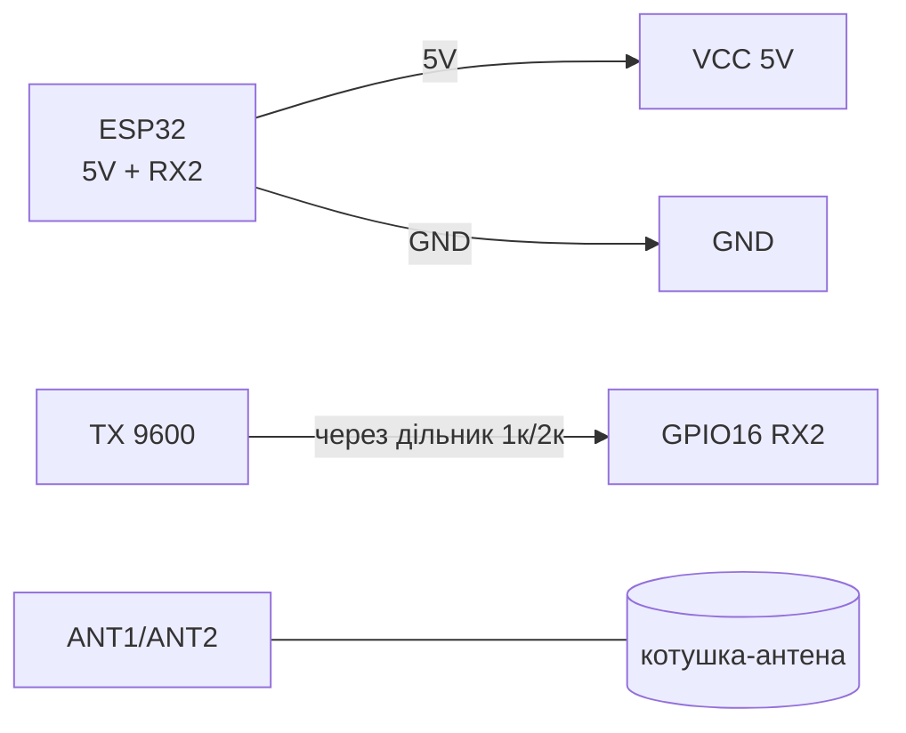
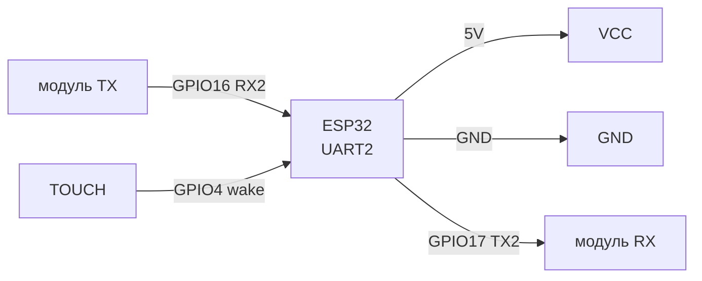
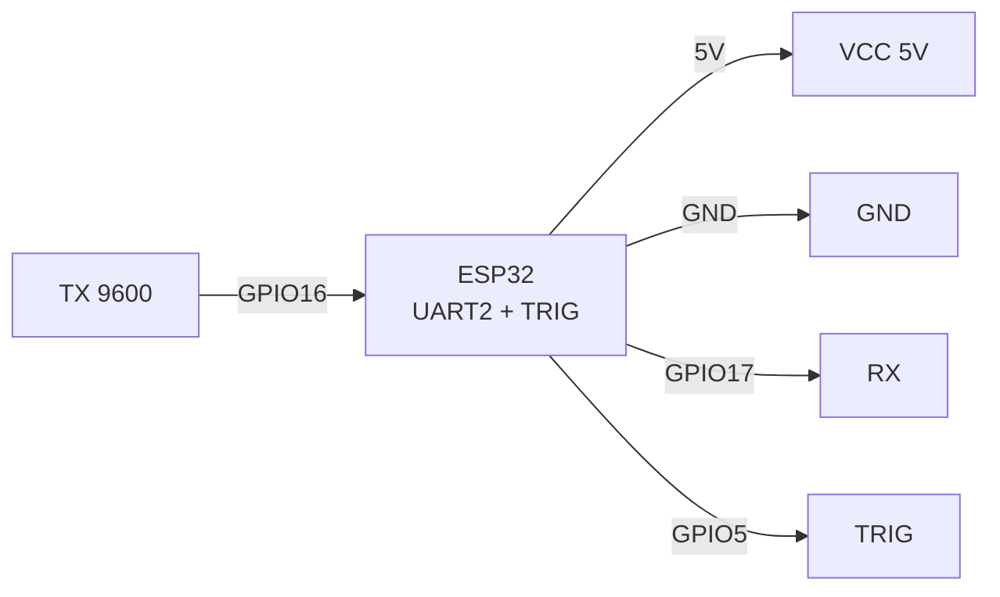
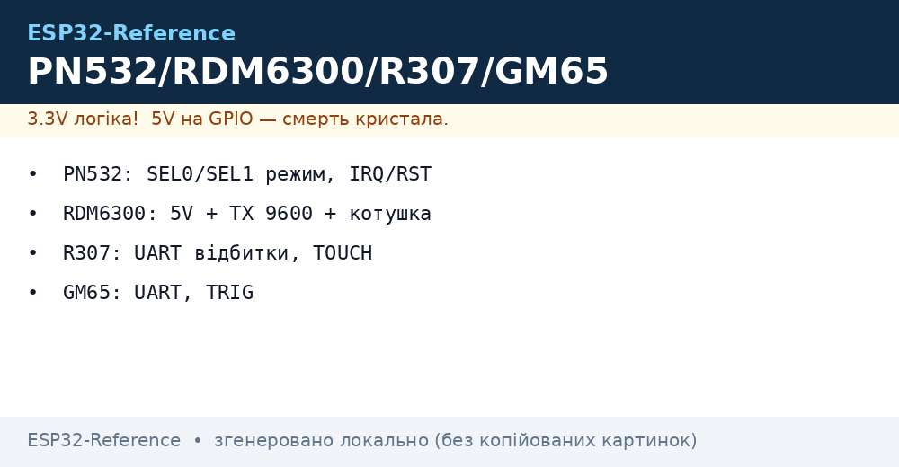

# PN532 NFC / RDM6300 125 кГц / Fingerprint R307 / GM65 сканер

> [!info] Призначення
> Ця нотатка покриває модулі ідентифікації: **PN532** (NFC 13.56 МГц, NDEF/UID, три інтерфейси), **RDM6300** (дешевий RFID 125 кГц EM4100, тільки читання), **R307 / AS608** (оптичний сканер відбитків пальців, UART), **GM65** (сканер штрих- і QR-кодів, UART/USB-HID). Спільне: усі віддають «ID» по UART/I2C/SPI, логіка ESP32 - порівняти з білим списком і відкрити замок / залогувати подію.

Характеристики (порівняльна таблиця):

| Модуль | Частота / тип | Інтерфейс | Живлення | Дальність | Що вміє |
| --- | --- | --- | --- | --- | --- |
| PN532 | 13.56 МГц ISO14443A/B, FeliCa | I2C / SPI / HSU-UART (перемикачі SEL0/SEL1) | 3.3V (VCC 3.3V, 5V-версії плати мають LDO) | 3-7 см | Читання/запис Mifare, NDEF, P2P, емуляція картки |
| RDM6300 | 125 кГц EM4100 | UART 9600 8N1 (TX) | 5V (стабільно! 3.3V не працює) | 2-5 см (зі штатною антеною) | Тільки читання UID 10 hex-символів + контрольна сума |
| R307 / AS608 | Оптичний сенсор 500 dpi | UART 57600 (завод.) / можна 9600-115200 | 3.3-6V (всередині LDO 3.3V) | Палець на склі | Зберігання до 1000 шаблонів, порівняння 1:N на модулі |
| GM65 | CMOS 640×480 + червона підсвітка | UART 9600 / USB-HID (перемикається) | 5V (піки струму підсвітки ~200 мА) | 5-30 см від коду | EAN-13, Code128, QR, DataMatrix; режим тригера / автосканування |

Зв'язок з шинами: I2C [I2C](../../../ESP32-Reference/04-Shini/03-I2C.md), SPI [SPI](../../../ESP32-Reference/04-Shini/02-SPI.md), UART [UART](../../../ESP32-Reference/04-Shini/01-UART.md), живлення [01-Lancjugi-zhivlennya](../../../ESP32-Reference/02-Zhivlennya/01-Lancjugi-zhivlennya.md), базовий RFID [01-RC522-RFID](../../../ESP32-Reference/12-Moduli-zvyazku/01-RC522-RFID.md), старт [Home](../../../ESP32-Reference/Home.md).

## Призначення

PN532 NFC / RDM6300 125 кГц / Fingerprint R307 / GM65 сканер - PN532 NFC (I2C / SPI / UART); Легенда пінів модуля PN532; Схема підключення (I2C-режим - рекомендований). Зв'язок з шинами: I2C [I2C](../../../ESP32-Reference/04-Shini/03-I2C.md), SPI [SPI](../../../ESP32-Reference/04-Shini/02-SPI.md), UART [UART](../../../ESP32-Reference/04-Shini/01-UART.md), живлення [01-Lancjugi-zhivlennya](../../../ESP32-Reference/02-Zhivlennya/01-Lancjugi-zhivlennya.md), базовий RFID 12-Moduli-zvyazku/01-RC522-RFID, старт Home. 1. PN532 NFC (I2C / SPI / UART).

## 1. PN532 NFC (I2C / SPI / UART)

Перемикачі режиму **SEL0 / SEL1** (DIP або перемички L/H на платі Elechouse):

| SEL0 | SEL1 | Режим |
| --- | --- | --- |
| L | L | HSU (UART) |
| L | H | SPI |
| H | L | I2C (заводський типово) |

> [!warning] Після зміни SEL - перепідключити живлення (Power-On Reset), інакше режим не застосується.


*Рис. PN532 - I2C-режим за замовчуванням, перемикачі SEL0=H, SEL1=L.*

### Легенда пінів модуля PN532

| Пін | Тип | Куди | Примітка |
| --- | --- | --- | --- |
| VCC | Живлення вхід | 3V3 ESP32 | Тільки 3.3V для голої плати; сині плати Elechouse мають LDO і терплять 5V, але логіка все одно 3.3V - див. [01-Lancjugi-zhivlennya](../../../ESP32-Reference/02-Zhivlennya/01-Lancjugi-zhivlennya.md) |
| GND | Земля | GND | Спільна земля, короткий провід |
| SDA / SCL (I2C) | Двонапрямлені OD | GPIO21 (SDA), GPIO22 (SCL) | I2C-адреса 0x24 (7-біт); потрібні pull-up 4.7к до 3.3V, див. [I2C](../../../ESP32-Reference/04-Shini/03-I2C.md) |
| SCK / MISO / MOSI / SS (SPI) | SPI | GPIO18/19/23, SS GPIO5 | Режим SPI вимагає SEL0=L, SEL1=H; швидкість до 5 МГц |
| TX / RX (HSU-UART) | UART | GPIO16 (RX2) ← TX, GPIO17 (TX2) → RX перехресно | Швидкість 115200 за замовчуванням; режим SEL0=L, SEL1=L |
| IRQ | Вихід, active low | GPIO4 (будь-який) | Переривання «картка в полі»; в I2C-режимі опитується бібліотекою |
| RSTO / RSTPD_N | Вхід reset | GPIO15 або 3V3 через 10к | RSTPD_N = HIGH робота, LOW = power-down; імпульс LOW 100 мс = скидання |
| SEL0 / SEL1 | Вхід вибору шини | Перемички L/H (GND або VCC) | H = HIGH (до VCC), L = LOW (до GND); не залишати висячими |

### Схема підключення (I2C-режим - рекомендований)

| ESP32 | PN532 | Примітка |
| --- | --- | --- |
| 3V3 | VCC | 3.3V |
| GND | GND | спільна земля |
| GPIO21 | SDA | pull-up 4.7к |
| GPIO22 | SCL | pull-up 4.7к |
| GPIO4 | IRQ | переривання |
| GPIO15 | RSTPD_N | reset |
| VCC (3V3) | SEL0 | H |
| GND | SEL1 | L |

### ASCII-схема

```text
ESP32 DevKit              PN532 (I2C, SEL0=H SEL1=L)
─────────────              ─────────────────────────
3V3 ────────────────────►  VCC (3.3V!)
GND ────────────────────   GND
GPIO21 (SDA) ◄──────────►  SDA  (pull-up 4.7к до 3V3)
GPIO22 (SCL) ──────────►   SCL  (pull-up 4.7к до 3V3)
GPIO4  ◄────────────────   IRQ  (картка в полі)
GPIO15 ─────────────────►  RSTPD_N (HIGH=робота)
3V3 ───────────────────►   SEL0 (=H)
GND ────────────────────   SEL1 (=L)

Примітки:
- I2C-адреса 0x24. Довжина SDA/SCL < 30 см.
- Після зміни SEL0/SEL1 — відключити/підключити живлення!
```

### Mermaid



## 2. RDM6300 125 кГц (UART 9600)

Дешевий приймач EM4100-карток («товсті» брелоки). Видає 14 байт: `0x02 + 10 ASCII hex + 2 checksum + 0x03`.


*Рис. RDM6300 - живлення 5V, TX до ESP32 через дільник, зовнішня антена-котушка.*

### Легенда пінів модуля RDM6300

| Пін | Тип | Куди | Примітка |
| --- | --- | --- | --- |
| VCC (+5V) | Живлення вхід | 5V (VIN/VU DevKit або окремий БЖ 5V) | Строго 5V ±5%! Від 3.3V не стартує / рве пакети; струм ~50 мА |
| GND | Земля | GND | Спільна з ESP32 |
| TX (TXD, пін 1 на гребінці) | Вихід UART 5V-рівень | GPIO16 (RX2) через дільник 1к/2к | Швидкість 9600 8N1; рівень 5V - ESP32 терпить короткочасно, але правильно - дільник або транзистор; див. [UART](../../../ESP32-Reference/04-Shini/01-UART.md) |
| ANT1 / ANT2 | Аналогові до котушки | Штатна квадратна антена з комплекту | Без антени дальність 0! Не класти антену на метал; металеві двері - виносити антену назовні |
| LED | Вихід індикації | Не підключати / світлодіод | Блимає при читанні |

### ASCII-схема

```text
ESP32 DevKit              RDM6300
─────────────              ───────
5V (VIN) ───────────────►  VCC 5V (НЕ 3V3!)
GND ────────────────────   GND
GPIO16 (RX2) ◄──[1к/2к]──  TX (5V рівень → дільник!)
                 ANT1/ANT2 ══► котушка-антена з комплекту

Дільник: TX --1к--+-- GPIO16, + --2к-- GND. Отримуємо ~3.3V.
```

### Mermaid



## 3. Сканер відбитків R307 / AS608 (UART)

Оптичний модуль з DSP: enrollment і match виконуються всередині, ESP32 лише надсилає команди і отримує ID. Бібліотека Arduino - `Adafruit_Fingerprint`.

### Легенда пінів модуля R307

| Пін | Тип | Куди | Примітка |
| --- | --- | --- | --- |
| VCC (3.3-6V) | Живлення вхід | 5V або 3V3 (за версією; червоний провід шлейфа) | Всередині LDO 3.3V; при 5V стабільніше підсвічування; струм до 120 мА в момент скану |
| GND | Земля | GND | Чорний провід |
| TX (жовтий) | Вихід UART | GPIO16 (RX2) | Заводська швидкість 57600 8N1; пароль за замовчуванням 0x00000000 |
| RX (білий) | Вхід UART | GPIO17 (TX2) | Перехресно: модуль TX → ESP32 RX |
| TOUCH / WAKE (зелений, опційно) | Вихід, HIGH при дотику | GPIO4 | Wake-сигнал «палець прикладено»; можна будити ESP32 з light-sleep |
| NC | - | Не підключати | Зарезервовано |

### ASCII-схема

```text
ESP32 DevKit              R307 (шлейф 6pin)
─────────────              ────────────────
5V ─────────────────────►  VCC (червоний)
GND ────────────────────   GND (чорний)
GPIO16 (RX2) ◄──────────   TX (жовтий)
GPIO17 (TX2) ──────────►   RX (білий)
GPIO4 ◄─────────────────   TOUCH (зелений, опційно)
```

### Mermaid



## 4. GM65 сканер штрих-кодів (UART / USB)

CMOS-сканер з червоною підсвіткою. Для ESP32 використовувати **UART-режим 9600** (заводський - USB-HID; перемикається скануванням спецкодів з мануала «UART Mode»). Вихід - ASCII рядок коду + `\r\n`.

### Легенда пінів модуля GM65

| Пін | Тип | Куди | Примітка |
| --- | --- | --- | --- |
| VCC 5V | Живлення вхід | 5V окремий / VIN | Піки підсвітки ~200 мА - від слабкого USB-UART може блимати; електроліт 470 мкФ біля модуля |
| GND | Земля | GND | Спільна земля |
| TX | Вихід UART | GPIO16 (RX2) | 9600 8N1, формат: `<код>\r\n` |
| RX | Вхід UART | GPIO17 (TX2) | Команди конфігурації з мануала |
| TRIG | Вхід, active low | GPIO5 (кнопка до GND) | Імпульс LOW ≥100 мс = одне сканування; у режимі «Auto/Continuous» можна залишити NC |
| USB D+/D− | USB-HID | Не використовувати з ESP32 | Альтернатива UART; для ESP32-S2/S3 з USB-host - можливо, але нестабільно |

### ASCII-схема

```text
ESP32 DevKit              GM65
─────────────              ────
5V ─────────────────────►  VCC 5V (+470мкФ до GND!)
GND ────────────────────   GND
GPIO16 (RX2) ◄──────────   TX (9600)
GPIO17 (TX2) ──────────►   RX
GPIO5 ──[кнопка]────────►  TRIG (LOW=скан)
```

### Mermaid



### SE3307 / GM65-reader - готові OEM-рідери

| Параметр | SE3307 (scan engine) | GM65-reader (готовий пристрій) |
| --- | --- | --- |
| Формат | Плата-движок без корпусу (вбудовується) | Корпус + кнопка + кабель |
| Інтерфейс | UART/TTL (той же ASCII-протокол `<код>\r\n`) | UART або USB-HID (перемикається) |
| Живлення | 3.3 В | 5 В (підсвітка!) |
| Коли брати | Свій корпус/термінал | Готовий USB-сканер до каси + UART-гілка до ESP32 |

> Протокол однаковий з GM65-модулем: код вище повністю застосовний, різниця лише в обв'язці та живленні.

## Код - читання UID / подій

### Arduino (PN532 I2C - Adafruit_PN532)

```cpp
#include <Wire.h>
#include <Adafruit_PN532.h>
#define IRQ 4
#define RESET 15
Adafruit_PN532 nfc(IRQ, RESET);
void setup() {
  Serial.begin(115200);
  Wire.begin(21, 22);
  nfc.begin();
  uint32_t v = nfc.getFirmwareVersion();
  if (!v) { Serial.println("PN532 не знайдено (0x24?)"); while (1) delay(100); }
  nfc.SAMConfig();
  Serial.println("Піднесіть картку...");
}
void loop() {
  uint8_t uid[7]; uint8_t len;
  if (nfc.readPassiveTargetID(PN532_MIFARE_ISO14443A, uid, &len)) {
    Serial.print("UID:");
    for (int i = 0; i < len; i++) Serial.printf(" %02X", uid[i]);
    Serial.println();
    delay(1000);
  }
}
```

### Arduino (RDM6300 - читання UID)

```cpp
// RDM6300: TX -> GPIO16, 9600 8N1, пакет 14 байт: 02 + 10 ASCII + 2 CS + 03
void setup() {
  Serial.begin(115200);
  Serial2.begin(9600, SERIAL_8N1, 16, -1); // RX=16, TX не потрібен
}
void loop() {
  if (Serial2.available() >= 14) {
    if (Serial2.read() == 0x02) {
      char tag[11]; Serial2.readBytes(tag, 10); tag[10] = 0;
      uint8_t cs[2]; Serial2.readBytes(cs, 2);
      uint8_t end = Serial2.read();
      if (end == 0x03) { Serial.print("RDM6300 UID: "); Serial.println(tag); }
    }
  }
}
```

### Arduino (R307 - Adafruit_Fingerprint)

```cpp
#include <Adafruit_Fingerprint.h>
HardwareSerial fpSerial(2);
Adafruit_Fingerprint finger(&fpSerial);
void setup() {
  Serial.begin(115200);
  fpSerial.begin(57600, SERIAL_8N1, 16, 17);
  finger.begin(57600);
  Serial.printf("Шаблонів: %d\n", finger.getTemplateCount());
}
void loop() {
  if (finger.getImage() != FINGERPRINT_OK) { delay(100); return; }
  if (finger.image2Tz() != FINGERPRINT_OK) return;
  if (finger.fingerFastSearch() == FINGERPRINT_OK) {
    Serial.printf("Збіг! ID=%d точність=%d\n", finger.fingerID, finger.confidence);
  } else Serial.println("Невідомий палець");
  delay(500);
}
```

### ESP-IDF (PN532 I2C, polling UID)

```c
#include "driver/i2c.h"
#define PN532_ADDR 0x24
// Спрощено: ініціалізація I2C + SAMConfig + InListPassiveTarget.
// Повний драйвер див. esp-idf-lib / adafruit port.
void app_main(void) {
    i2c_config_t c = {.mode = I2C_MODE_MASTER, .sda_io_num = 21, .scl_io_num = 22,
        .master.clk_speed = 100000};
    i2c_param_config(I2C_NUM_0, &c);
    i2c_driver_install(I2C_NUM_0, c.mode, 0, 0, 0);
    // TODO: wakeup (0x00), SAMConfiguration (0x14 0x01 0x14 0x01),
    // InListPassiveTarget (0x4A 0x01 0x00) з IRQ-очікуванням на GPIO4.
}
```

### MicroPython (PN532 I2C - мінімальний)

```python
from machine import I2C, Pin
import time
i2c = I2C(0, sda=Pin(21), scl=Pin(22), freq=100000)
print("I2C scan:", [hex(a) for a in i2c.scan()])  # чекаємо 0x24
# Повний обмін PN532 вимагає IRQ-хендшейку; для продакшену візьміть
# бібліотеку micropython-pn532 (pnguyen/pn532) з прикладом read_uid().
```

### MicroPython (RDM6300 / GM65 - UART читання рядка)

```python
from machine import UART
u = UART(2, baudrate=9600, rx=16, tx=17)  # RDM6300: tx не використовується
buf = b""
while True:
    if u.any():
        b = u.read(1)
        if b == b"\x02":  # RDM6300 STX
            tag = u.read(12)  # 10 ASCII + 2 CS (+ETX наступним)
            print("UID:", tag[:10])
        else:
            buf += b  # GM65: накопичуємо до \r\n
            if buf.endswith(b"\n"):
                print("Штрих-код:", buf.decode().strip())
                buf = b""
```

## Типові помилки

| # | Симптом | Причина | Виправлення |
| --- | --- | --- | --- |
| 1 | PN532 не видно на `i2c.scan()` | SEL у режимі SPI/UART; немає pull-up; живлення 5V просівше | Виставити SEL0=H SEL1=L, перепідключити живлення; pull-up 4.7к; перевірити 3.3V під навантаженням |
| 2 | PN532 відповідає, але карток не бачить | Антена накрита металом / телефон поруч; NDEF-приклад без `SAMConfig()` | Віднести від металу ≥5 см; викликати `SAMConfig()` після `begin()` |
| 3 | RDM6300 мовчить | Живлення 3.3V замість 5V; антена не підключена; швидкість не 9600 | Дати 5V; підключити штатну котушку; `Serial2.begin(9600, SERIAL_8N1, 16, -1)` |
| 4 | RDM6300 видає сміття | 5V-рівень TX без дільника; довгі дроти; спільна земля відсутня | Дільник 1к/2к на RX ESP32; дроти <30 см; спільний GND |
| 5 | R307 `Did not find fingerprint sensor` | Швидкість не 57600; переплутані TX/RX; пароль змінено | Спробувати 9600/57600/115200; поміняти місцями; скинути пароль через SFGDemo |
| 6 | R307 не впізнає палець | Сухий/мокрий палець; enrollment з 1 зразком | Enrollment з 2-3 зразками; протерти скло; поріг `finger.setSecurityLevel()` |
| 7 | SE3307/GM65-reader мовчить по UART | Заводський USB-HID режим | Відсканувати код «UART Mode» з мануала; перевірити 9600 8N1 |
| 7 | GM65 мовчить по UART | Модуль у USB-HID режимі з заводу | Відсканувати код «Enter Setup → UART Output → 9600 → Exit» з мануала |
| 8 | GM65 перезавантажується при скані | Пік струму підсвітки просаджує 5V | Окремий БЖ 5V 1A + електроліт 470 мкФ біля VCC |


*Рис. Загальна схема: всі модулі ідентифікації на одному ESP32 (різні UART + I2C).*

## Офіційні джерела

- [PN532 - даташит (PDF, NXP)](https://www.nxp.com/docs/en/nxp/data-sheets/PN532_C1.pdf) - режими reader/writer, емуляція картки.
- [PN532 - сторінка продукту з фото (NXP)](https://www.nxp.com/products/rfid-nfc/nfc-hf/nfc-readers/nfc-integrated-solution:PN5321A3HN) - документи, антени.
- [ESP32 + MFRC522 - туторіал з кодом (RNT)](https://randomnerdtutorials.com/esp32-mfrc522-rfid-reader-arduino/) - суміжний RFID-код для порівняння.
- [RC522 - розбір з фото (LME)](https://lastminuteengineers.com/how-rfid-works-rc522-arduino-tutorial/) - база RFID, структура UID.

## Див. також

- [UART](../../../ESP32-Reference/04-Shini/01-UART.md) - налаштування UART2, перехрестя TX/RX
- [SPI](../../../ESP32-Reference/04-Shini/02-SPI.md) - PN532 у режимі SPI
- [I2C](../../../ESP32-Reference/04-Shini/03-I2C.md) - pull-up, адреса 0x24, сканування шини
- [01-Lancjugi-zhivlennya](../../../ESP32-Reference/02-Zhivlennya/01-Lancjugi-zhivlennya.md) - живлення 3.3V/5V, LDO, електроліти
- [01-RC522-RFID](../../../ESP32-Reference/12-Moduli-zvyazku/01-RC522-RFID.md) - базовий RFID RC522 (порівняти з PN532/RDM6300)
- [02-NRF24-LoRa](../../../ESP32-Reference/12-Moduli-zvyazku/02-NRF24-LoRa.md) - радіомодулі (альтернатива ідентифікації по радіо)
- [01-GPIO-oglyad](../../../ESP32-Reference/03-GPIO/01-GPIO-oglyad.md) - IRQ/TOUCH/TRIG як входи пробудження
- [Home](../../../ESP32-Reference/Home.md) - стартова сторінка довідника
