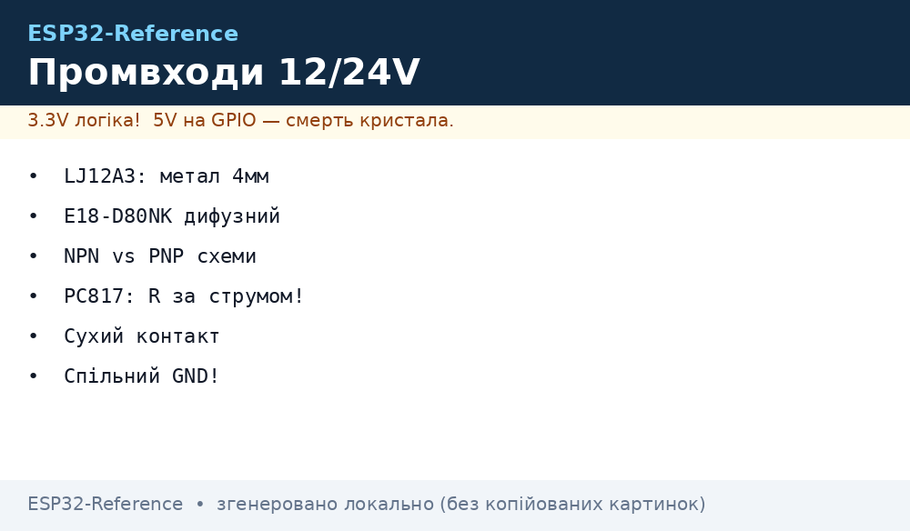
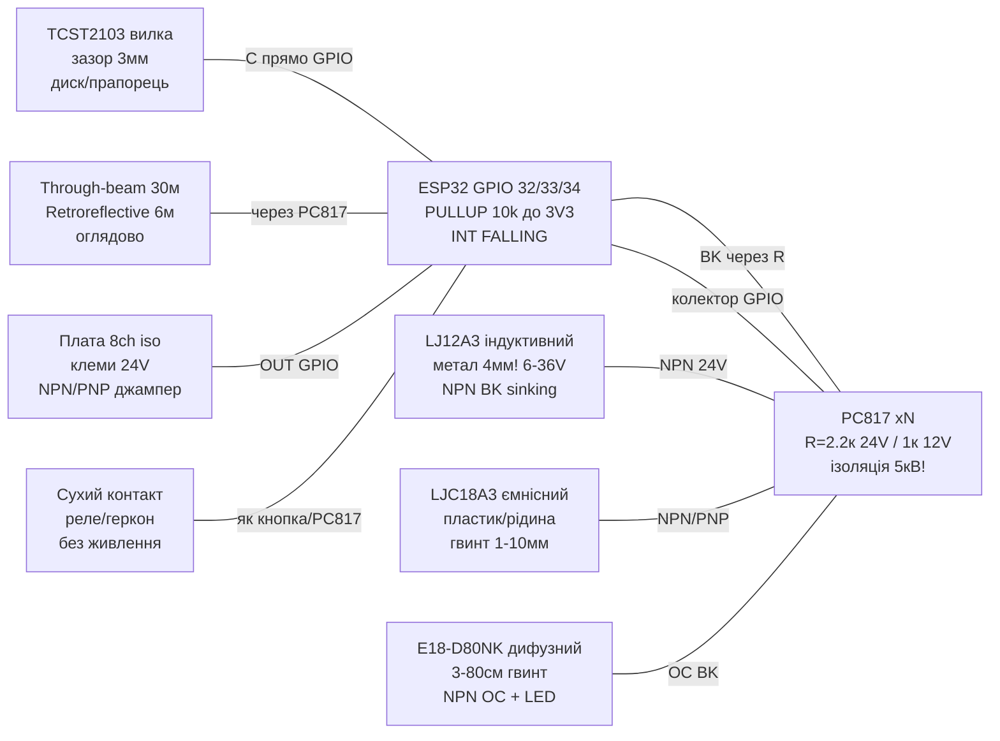

# Промислові дискретні входи: індуктивні LJ12A3, ємнісні, фотоелектричні E18-D80NK, NPN/PNP, PC817 для 12/24 В, сухий контакт, ізольовані 8ch


*Рис. 1. Промислові входи ESP32: індуктивний LJ12A3 по металу, дифузний E18-D80NK, вилочний TCST2103, NPN/PNP через PC817 з 24 В на 3.3 В GPIO.*

> [!danger] 12/24 В - НЕ в GPIO!
> Індуктивні/ємнісні/фотоелектричні датчики живляться від **6-36 В** і видають стільки ж на виході. Пряме підключення вб'є ESP32. Правило: **дільник для лабораторії, оптопара PC817 для цеху**. Див. [Level-shifters](../../../ESP32-Reference/13-Moduli-zhivlennya-rivniv/02-Level-Shifters.md) та [Industrial fieldbus](../../../ESP32-Reference/12-Moduli-zvyazku/10-Industrial.md).
>
> [!tip] Де це живе
> Кінцевик осі ЧПК (LJ12A3 бачить гайку каретки), контроль наявності деталі (ємнісний LJC бачить пластик/рідину), лічильник пляшок на конвеєрі (E18-D80NK), енкодер принтера/лічильник обертів (TCST2103), кнопки пульта 24 В у шафі керування (PC817), «сухий контакт» реле/геркона, 8-канальна ізольована плата входів ПЛК-стилю.

## Призначення

Ця нота - міст від «лабораторних» кнопок ([34-Buttons-Switches-Pots](../../../ESP32-Reference/10-Sensori/34-Buttons-Switches-Pots.md)) до цехових дискретних входів: безконтактні датчики наближення (proximity), які самі живляться від 12/24 В і самі перемикають вихід, та способи безпечно завести їх у 3.3 В GPIO ESP32. На відміну від сухої кнопки (пасивний контакт), proximity-датчик - **активний 3-дротовий пристрій**: коричневий `BN = +V`, синій `BU = GND`, чорний `BK = вихід`.

Що покрито: індуктивні LJ12A3 (метал, 4 мм!), ємнісні LJC18 (метал/пластик/рідина), фотоелектричні дифузні E18-D80NK з підстроюванням дистанції, through-beam (випромінювач + приймач) та retroreflective (датчик + катафот) оглядово, щілинні/вилочні TCST2103 (енкодери принтера, лічильники обертів!), NPN vs PNP виходи + sinking/sourcing з обома схемами, дільник напруги vs опторозв'язка PC817 для 12/24 В з розрахунком резистора світлодіода, поняття «сухий контакт», оглядові ізольовані 8-канальні плати входів ПЛК-стилю.

Головна формула ноти - резистор світлодіода оптопари: `R = (Vвх − Vf − Vce_датчика) / If`. Головне правило: **спільна земля 24 В і ESP32 - тільки через оптопару або ізольовану плату; інакше петлі земель і кидки пускачів дійдуть до кристала**.

## Характеристики

### Безконтактні датчики наближення: порівняння

| Параметр | Індуктивний LJ12A3-4-Z/BX | Ємнісний LJC18A3 | Фотоелектричний E18-D80NK (дифузний) |
| --- | --- | --- | --- |
| Що бачить | **Тільки метал!** (сталь 4 мм, алюміній ~2 мм) | Метал/пластик/дерево/рідина/сипучі (через стінку!) | Будь-яка непрозора поверхня (відбиття ІЧ) |
| Дистанція | 4 мм (M12), гістерезис ~10% | 1-10 мм (регулюється гвинтом!) | 3-80 см (гвинт чутливості!) |
| Живлення | 6-36 В DC (типово 12/24 В) | 6-36 В DC | 5 В (є версії 6-36 В E18-D80NK!) |
| Вихід | NPN NO (BX) / NC (BY); PNP версії AX/AY | NPN/PNP NO/NC | NPN NO (транзистор до GND) |
| Струм виходу | До 300 мА (перемикає реле безпосередньо!) | До 300 мА | До 100-300 мА (за версією) |
| Індикація | Червоний LED на тильній стороні (горить при спрацюванні) | Червоний LED | Червоний LED + зелений «живлення» |
| Частота | До ~500 Гц (метал!) | До ~100 Гц | До ~100 Гц (ІЧ-модуляція 38 кГц всередині) |
| Ціна/доступність | Дешевий, стандарт ЧПК-кінцевиків | Дешевий, контроль рівня/наявності | Дешевий, лічильники/об'їзди роботів |
| Підводний камінь | Не бачить пластик/руку! Зменшення дистанції на кольорових металах | Реагує на руку/вологу/пил - хибні спрацювання | Сліпне на сонці/чорному оксамиті; потрібне юстування гвинта |

### Фотоелектричні топології оглядово: diffuse vs through-beam vs retroreflective

| Топологія | Як влаштовано | Дальність | Плюси | Мінуси |
| --- | --- | --- | --- | --- |
| Дифузна (diffuse, E18-D80NK) | Випромінювач + приймач в одному корпусі, відбиття від об'єкта | 0.03-0.8 м | Один корпус, дешево, нічого не ставити навпроти | Залежить від кольору/блиску; чорний матовий «невидимий» |
| Through-beam (на просвіт) | Окремий TX (ІЧ-LED) навпроти RX (фотодіод), промінь переривається | 1-30 м! | Найдальше, найнадійніше, прозорі об'єкти ловить | Два корпуси + два живлення + юстування осі |
| Retroreflective (з катафотом) | Датчик + кутовий відбивач (катафот) навпроти | 0.5-6 м | Один активний корпус, дальність більша за дифузну | Бликаючі/прозорі об'єкти можуть «просвічувати»; катафот брудниться |
| Щілинна/вилочна (slot, TCST2103) | U-вилка: LED + фототранзистор, зазор 3-5 мм | 3 мм (прапорця!) | Ідеальна для енкодерів/лічильників, різкий фронт | Тільки тонкий прапорець у зазорі; бруд вбиває |

### Щілинний TCST2103 (енкодери принтера!)

| Параметр | Значення | Примітка |
| --- | --- | --- |
| Конструкція | ІЧ-LED (анод/катод) + фототранзистор (колектор/емітер), зазор ~3 мм | 4 виводи, крок 2.54 мм |
| LED | Vf ~1.2 В, If 10-20 мА (резистор 150-220 Ом від 5 В!) | Без резистора LED згорає миттєво |
| Фототранзистор | NPN, колектор через 10 кОм до 3V3, емітер на GND | Вихід-колектор → GPIO (LOW = промінь перекрито) |
| Застосування | Енкодери принтерів (лінійка зі штрихами!), лічильники обертів диска з прорізами | Диск з N прорізами → N імпульсів/оберт |
| Швидкість | Фронти ~10 мкс, до десятків кГц | Краще за механіку в 100 разів; дебаунс не потрібен! |
| Бруд | Пил у зазорі = «завжди перекрито» | Продувати/закривати кожухом |

### NPN vs PNP + sinking/sourcing (схеми обох!)

Датчик з NPN-виходом **стягує (sinks)** струм на землю; з PNP - **віддає (sources)** струм з плюса. ESP32 з pull-up любить NPN; PNP вимагає pull-down або оптопари.

```text
 NPN NO (sinking), датчик живиться 24В:         PNP NO (sourcing), датчик живиться 24В:
   +24В ---[BN коричневий]                        +24В ---[BN коричневий]
   GND ----[BU синій]                             GND ----[BU синій]
   BK (чорний) -----+                              BK (чорний) -----+
        (транзистор NPN                            (транзистор PNP
         до GND всередині)                          до +24В всередині)
   При спрацюванні: BK замикається на GND!     При спрацюванні: BK видає +24В!
   => Навантаження/вхід між +24В та BK.        => Навантаження/вхід між BK та GND.
   => Для ESP32: BK через PC817 на GND         => Для ESP32: BK через PC817/дільник
      (ідеально: NPN + pull-up до 3V3).            з pull-down (див. схеми нижче).
```

| Вихід датчика | У спокої (немає об'єкта) | При спрацюванні | Вхід ESP32 (через PC817) |
| --- | --- | --- | --- |
| NPN NO | BK висить (транзистор закритий) | BK = GND (відкритий) | LED оптопари світить при спрацюванні |
| NPN NC | BK = GND | BK висить | Інверсія: світить у спокої (рідше беруть) |
| PNP NO | BK висить | BK = +24 В | LED через резистор до GND світить при спрацюванні |
| PNP NC | BK = +24 В | BK висить | Інверсія |

> [!tip] Як розпізнати на корпусі
> Маркування `BX` (LJ12A3-4-Z/BX) = NPN NO; `BY` = NPN NC; `AX` = PNP NO; `AY` = PNP NC. На E18-D80NK - NPN NO за замовчуванням (є PNP-версії E18-D80PK). Якщо сумнів - мультиметр: чорний щуп на BU, червоний на BK: при спрацюванні NPN покаже ~0 В, PNP покаже ~+24 В.

### Дільник vs опторозв'язка: коли що

| Метод | Схема | Коли брати | Коли НЕ брати |
| --- | --- | --- | --- |
| Дільник 24→3.3 (напр. 22к/3.3к) | BK → 22к → GPIO → 3.3к → GND (GND спільна!) | Лабораторія, спільний БЖ, короткі дроти, NPN/PNP статика | Цех, різні шафи, пускачі/частотники, довгі лінії, грози |
| Оптопара PC817 | BK → R → LED → GND_поле; фототранзистор → GPIO + pull-up 3V3 | **Цех за замовчуванням**, гальваніка 5 кВ, різні землі | Швидкість >20 кГц без прискорення (PC817 повільна!) |
| Ізольована плата 8ch | Готовий модуль: клеми 12/24 В + оптопари + виходи 3V3 | 4+ входів, шафа керування, ПЛК-стиль | Один датчик (надлишково) |

### Розрахунок резистора світлодіода PC817 (обов'язково!)

Формула: `R = (Vвх − Vf − Vce_датчика) / If`, потужність `P = I²·R`.

PC817: `Vf ≈ 1.2 В` (ІЧ-LED), потрібний `If = 5-10 мА` (CTR ≥50% дає 2.5-5 мА на транзисторі - достатньо для GPIO з pull-up 10к), ізоляція 5 кВ, швидкість ~4-20 кГц.

| Вхід | Розрахунок (If=10 мА, Vce NPN≈0.3 В) | Стандарт E12 | Потужність | Перевірка |
| --- | --- | --- | --- | --- |
| 12 В (кнопка/датчик PNP) | R = (12−1.2−0.3)/0.01 = 1050 Ом | **1 кОм** | 0.1 Вт (беремо 0.25 Вт) | If = 10.5 мА ✓ |
| 24 В (цеховий стандарт) | R = (24−1.2−0.3)/0.01 = 2250 Ом | **2.2 кОм** | 0.23 Вт (беремо 0.5 Вт!) | If = 10.2 мА ✓ |
| 24 В економ (If=5 мА) | R = 22.5/0.005 = 4500 Ом | **4.7 кОм** | 0.12 Вт (0.25 Вт) | If = 4.8 мА, CTR мінімум перевірити! |
| 5 В (E18-D80NK 5V-версія) | R = (5−1.2)/0.01 = 380 Ом | **390 Ом** | 0.04 Вт | If ≈ 9.7 мА ✓ |

Зворотний діод 1N4148 антипаралельно LED - якщо вхід може отримати зворотну полярність (клеми плутають!). Резистор підтяжки фототранзистора - 10 кОм до 3V3 на стороні ESP32.

### «Сухий контакт» vs «мокрий» вихід

| Термін | Що це | Приклади | Підключення до ESP32 |
| --- | --- | --- | --- |
| Сухий контакт (dry contact) | Пасивний контакт без власного живлення: реле NO/NC, геркон, кнопка, мікрик | Реле SRD-05, геркон скляний, кінцевик | Як кнопка: один бік на GND, другий на GPIO + pull-up 10к |
| Мокрий/активний вихід | Датчик сам видає напругу (NPN/PNP, 0-10 В, 4-20 мА) | LJ12A3, E18-D80NK, XTR115 | Тільки через дільник/оптопару/шунт, ніколи безпосередньо! |
| Відкритий колектор (open-collector) | NPN-транзистор без верхнього резистора (підвид сухого логічного) | E18-D80NK BK, енкодери з OC | Зовнішній pull-up до 3V3 (10к) - працює як кнопка до GND! |

## Легенда пінів модуля

### LJ12A3 / LJC18 (3 дроти, кольори за стандартом!)

| Дріт | Колір | Призначення | Куди |
| --- | --- | --- | --- |
| BN | Коричневий | +V живлення 6-36 В | +12/+24 В цехового БЖ (!) |
| BU | Синій | GND живлення | GND цехового БЖ → (через оптопару розв'язано!) |
| BK | Чорний | Вихід NPN/PNP | Через R → LED PC817 (див. схему) |
| LED | Червоний на корпусі | Індикація спрацювання | Візуально: горить = метал поруч (LJ12A3) |

### E18-D80NK (дифузний, 3 дроти + гвинт)

| Дріт | Колір | Призначення | Куди |
| --- | --- | --- | --- |
| Brown | Коричневий | +V (5 В або 6-36 В за версією!) | Перевірити етикетку! 5V-версія згорить від 24 В |
| Blue | Синій | GND | GND БЖ датчика |
| Black | Чорний | NPN NO вихід (open-collector) | Pull-up або PC817 |
| Гвинт | Пластиковий шліц ззаду | Дистанція 3-80 см (за годинниковою = далі) | Крутити при встановленій мішені! |

### TCST2103 (вилочний, 4 піни)

| Пін | Сторона | Призначення | Куди |
| --- | --- | --- | --- |
| A | LED анод | + через 220 Ом | 3V3/5V через резистор! (If ~15 мА) |
| K | LED катод | GND | GND |
| C | Фототранзистор колектор | Вихід через 10 кОм до 3V3 | GPIO (LOW = перекрито) |
| E | Фототранзистор емітер | GND | GND |

### PC817 (оптопара, 4 піни DIP)

| Пін | Призначення | Сторона |
| --- | --- | --- |
| 1 (анод) | LED+ через R від BK/24В | Польова (12/24 В!) |
| 2 (катод) | LED− на GND_поле | Польова |
| 3 (емітер) | На GND ESP32 | Логічна (3.3 В) |
| 4 (колектор) | Вихід → GPIO + pull-up 10к до 3V3 | Логічна |

### Ізольована плата 8ch (оглядово, типова)

| Клема | Призначення | Куди |
| --- | --- | --- |
| IN1-IN8 | Входи 12/24 В (кожен через свій оптрон + R) | BK датчиків / кнопки 24 В / реле |
| COM / GND_поле | Спільна земля польової сторони | GND цехового БЖ |
| OUT1-OUT8 / VCC_лог | Виходи open-collector + живлення логіки 3.3/5 В | GPIO ESP32 (+ pull-up), 3V3/GND ESP32 |
| Перемичка NPN/PNP | Вибір полярності входів (sinking/sourcing!) | За типом датчиків у шафі |

## Схема підключення

| ESP32 | LJ12A3/LJC (NPN) | E18-D80NK | TCST2103 | Кнопка 24 В / сухий контакт | Примітка |
| --- | --- | --- | --- | --- | --- |
| 3V3 | - (датчик від 24 В!) | - | A через 220 Ом (LED) | - | Логіка окремо від поля! |
| GND_лог | PC817 пін 3 | PC817 пін 3 | E + K | - | Земля ESP32 |
| GPIO32 | PC817 пін 4 + 10к до 3V3 | - | - | PC817 пін 4 | Вхід з оптопари (LOW=активно) |
| GPIO33 | - | PC817 пін 4 + 10к | - | - | Дифузний лічильник |
| GPIO34 | - | - | C (+10к до 3V3) | - | Вилочний енкодер (тільки вхід!) |
| +24В_поле | BN (коричневий) | BN (якщо 24V-версія!) | - | Кнопка → R 2.2к → PC817 пін 1 | Польовий БЖ окремо! |
| GND_поле | BU (синій) | BU | - | PC817 пін 2 | Польова земля |
| BK | → R 2.2к → PC817 пін 1 | → R → PC817 пін 1 (або 10к pull-up до 3V3 для 5V-версії!) | - | - | NPN стягує LED на землю |

### ASCII-схема

NPN-датчик 24 В через PC817 (базова цехова схема, sinking):

```text
 ПОЛЬОВА СТОРОНА (24В):              ГАЗОРОЗРЯДНИК НЕ ТРЕБА, АЛЕ TVS БАЖАНО
  +24В ---[BN] LJ12A3 [BU]--- GND_поле
                [BK]---+---[2.2к 0.5Вт]---(1)PC817(2)--- GND_поле
                       |    R=(24-1.2-0.3)/0.01=2.25к => 2.2к, If≈10мА
  Спрацював (метал 4мм!): BK=GND => LED горить (струм 10мА через R+LED+BK)
  Спокій: BK висить => LED не горить.
                       xxxxxxxxx ІЗОЛЯЦІЯ 5кВ xxxxxxxxx
 ЛОГІЧНА СТОРОНА (3.3В):
  3V3 ---[10к]---+--- GPIO32 (INPUT, переривання FALLING!)
                 |
              (4)PC817(3)--- GND_лог
  LED горить => фототранзистор відкритий => GPIO=LOW (АКТИВНО!)
  LED не горить => 10к тягне GPIO=HIGH.
```

PNP-датчик 24 В через PC817 (sourcing):

```text
 ПОЛЬОВА СТОРОНА (24В):
  +24В ---[BN] датчик PNP [BU]--- GND_поле
                [BK]---+---[2.2к]---(1)PC817(2)--- GND_поле
  Спрацював: BK=+24В => струм через R+LED до GND_поле (If≈10мА) => LED горить.
  Спокій: BK висить (0В) => LED не горить.
  (Той самий R 2.2к! Різниця лише всередині датчика: PNP віддає +, NPN стягує.)
 ЛОГІКА: та сама — GPIO LOW = спрацювання.
 УВАГА: PNP NC-версія дає +24В у спокої => LED горить завжди, гасне при спрацюванні (інверсія!).
```

Сухий контакт 24 В (кнопка пульта/реле) через PC817:

```text
 +24В ---[кнопка/реле NO]---[2.2к 0.5Вт]---(1)PC817(2)--- GND_поле
 Натиснуто: ланцюг замкнувся => LED If≈10мА => GPIO LOW.
 Відпущено: ланцюг розімкнено => GPIO HIGH (10к до 3V3).
 Сухий контакт НЕ має полярності — R можна ставити з будь-якого боку LED.
 Діод 1N4148 антипаралельно LED — захист від переплутаних клем 24В.
```

Дільник 24→3.3 (тільки лабораторія, спільна GND!):

```text
 BK (NPN/PNP 24В) ---[22к]---+--- GPIO (INPUT, БЕЗ внутрішнього pull!)
                             |
                           [3.3к]
                             |
                            GND (СПІЛЬНА з БЖ 24В!)
 Vout = 24 * 3.3/(22+3.3) = 3.13В ✓ (HIGH), 0В при NPN-спрацюванні.
 Струм: 24/25.3к ≈ 0.95мА постійно. НЕ для цеху (немає ізоляції!).
```

E18-D80NK 5V-версія безпосередньо (open-collector, тільки якщо датчик 5V і короткий дріт!):

```text
 E18 Brown --- 5V; Blue --- GND (спільна з ESP32!)
 E18 Black ---[10к pull-up до 3V3]--- GPIO33
             (НЕ до 5V! Інакше 5V на GPIO!)
 Об'єкт у 3-80см: BK стягується на GND => GPIO LOW.
```

TCST2103 вилка (енкодер принтера, лічильник):

```text
 3V3 ---[220 Ом]---(A)LED(K)--- GND        If=(3.3-1.2)/220≈9.5мА
 3V3 ---[10к]---+---(C)фото(E)--- GND
                |
               GPIO34 (LOW = прапорець у зазорі!)
 Диск з 20 прорізами => 20 імпульсів/оберт => RPM = f*60/20.
 Дебаунс НЕ потрібен (оптика!), але потрібен кожух від пилу.
```

### Mermaid



## Код ESP-IDF

```c
#include "driver/gpio.h"
#include "esp_log.h"
#include "esp_timer.h"
#include "freertos/FreeRTOS.h"
#include "freertos/task.h"

#define IN_LJ  GPIO_NUM_32 // LJ12A3 через PC817 (LOW=метал!)
#define IN_E18 GPIO_NUM_33 // E18-D80NK через PC817 (LOW=об'єкт!)
#define IN_SLOT GPIO_NUM_34 // TCST2103 колектор безпосередньо (LOW=перекрито)
static const char *TAG = "prox";
static volatile uint32_t slot_cnt = 0;
static volatile int64_t slot_t = 0;
static volatile float slot_rpm = 0;

// Лічильник обертів: кожен проріз диска = імпульс FALLING
static void IRAM_ATTR slot_isr(void *a) {
    int64_t now = esp_timer_get_time();
    int64_t dt = now - slot_t; // період між прорізами, мкс
    slot_t = now; slot_cnt++;
    if (dt > 0) slot_rpm = 60.0e6 / (dt * 20); // 20 прорізів/оберт!
}

void app_main(void) {
    gpio_config_t c = {.pin_bit_mask = (1ULL<<IN_LJ)|(1ULL<<IN_E18)|(1ULL<<IN_SLOT),
        .mode = GPIO_MODE_INPUT, .pull_up_en = GPIO_PULLUP_ENABLE,
        .pull_down_en = GPIO_PULLDOWN_DISABLE,
        .intr_type = GPIO_INTR_NEGEDGE};
    gpio_config(&c);
    // LJ/E18: опитування в loop (повільні, 100Гц достатньо + SW-фільтр)
    // Слот: переривання (кГц, без дебаунсу — оптика!)
    gpio_install_isr_service(0);
    gpio_isr_handler_add(IN_SLOT, slot_isr, NULL);

    bool lj_last = true, e18_last = true;
    for (;;) {
        bool lj = gpio_get_level(IN_LJ);   // LOW = метал у 4мм!
        bool e18 = gpio_get_level(IN_E18); // LOW = об'єкт у 3-80см
        if (!lj && lj_last) ESP_LOGI(TAG, "LJ: МЕТАЛ (NPN спрацював)");
        if (!e18 && e18_last) ESP_LOGI(TAG, "E18: ОБ'ЄКТ (дифузне відбиття)");
        lj_last = lj; e18_last = e18;
        ESP_LOGI(TAG, "LJ=%d E18=%d slot=%lu rpm=%.0f", lj, e18, slot_cnt, slot_rpm);
        vTaskDelay(pdMS_TO_TICKS(200));
    }
}
// PNP NC-датчик дасть інверсію (LOW у спокої!) — інвертувати логіку або брати NO-версію.
// Ізольована плата 8ch: ті самі GPIO, тільки OUT плати замість колекторів PC817.
// Through-beam/retroreflective: підключення ідентичне E18 (той самий NPN BK через PC817).
```

## Код Arduino

```cpp
#define IN_LJ 32    // LJ12A3 NPN через PC817
#define IN_E18 33   // E18-D80NK через PC817
#define IN_SLOT 34  // TCST2103 колектор

volatile unsigned long slotCnt = 0;
volatile unsigned long slotT = 0;
volatile float rpm = 0;
void IRAM_ATTR onSlot() { // 20 прорізів/оберт
  unsigned long now = micros(), dt = now - slotT;
  slotT = now; slotCnt++;
  if (dt > 0) rpm = 60.0e6 / (dt * 20);
}

void setup() {
  Serial.begin(115200);
  pinMode(IN_LJ, INPUT_PULLUP);   // PC817 колектор: LOW=активно
  pinMode(IN_E18, INPUT_PULLUP);
  pinMode(IN_SLOT, INPUT_PULLUP); // TCST колектор: LOW=перекрито
  attachInterrupt(digitalPinToInterrupt(IN_SLOT), onSlot, FALLING);
}

void loop() {
  static int ljLast = HIGH, e18Last = HIGH;
  int lj = digitalRead(IN_LJ);   // LOW = метал 4мм!
  int e18 = digitalRead(IN_E18); // LOW = об'єкт!
  // SW-фільтр 20мс для LJ/E18 (механічна вібрація деталі дає дзвін!)
  if (lj != ljLast) { delay(20); lj = digitalRead(IN_LJ); }
  if (e18 != e18Last) { delay(20); e18 = digitalRead(IN_E18); }
  if (lj == LOW && ljLast == HIGH) Serial.println("LJ: МЕТАЛ");
  if (e18 == LOW && e18Last == HIGH) Serial.println("E18: ОБ'ЄКТ");
  ljLast = lj; e18Last = e18;
  Serial.printf("LJ=%d E18=%d slot=%lu rpm=%.0f\n", lj, e18, slotCnt, rpm);
  delay(200);
}
// Сухий контакт реле 24В: та сама схема PC817 (R 2.2к), код ідентичний IN_LJ.
// PNP-датчик: той самий код, але світить/спрацьовує навпаки для NC-версій.
```

## Код MicroPython

```python
from machine import Pin
import time

lj = Pin(32, Pin.IN, Pin.PULL_UP)    # LJ12A3 NPN/PC817: 0 = метал!
e18 = Pin(33, Pin.IN, Pin.PULL_UP)   # E18-D80NK/PC817: 0 = об'єкт!
slot = Pin(34, Pin.IN, Pin.PULL_UP)  # TCST2103: 0 = перекрито

cnt = [0]
last_t = [time.ticks_us()]
rpm = [0.0]
SLOTS = 20  # прорізів диска на оберт

def on_slot(p):
    now = time.ticks_us()
    dt = time.ticks_diff(now, last_t[0])
    last_t[0] = now; cnt[0] += 1
    if dt > 0:
        rpm[0] = 60.0e6 / (dt * SLOTS)

slot.irq(trigger=Pin.IRQ_FALLING, handler=on_slot)

lj_last, e18_last = 1, 1
while True:
    v_lj, v_e18 = lj.value(), e18.value()
    time.sleep_ms(20)  # SW-фільтр вібрації деталі
    v_lj, v_e18 = lj.value(), e18.value()
    if v_lj == 0 and lj_last == 1: print("LJ: МЕТАЛ")
    if v_e18 == 0 and e18_last == 1: print("E18: ОБ'ЄКТ")
    lj_last, e18_last = v_lj, v_e18
    print("LJ={} E18={} slot={} rpm={:.0f}".format(v_lj, v_e18, cnt[0], rpm[0]))
    time.sleep_ms(200)
```

## Типові помилки

| № | Помилка | Симптом | Рішення |
| --- | --- | --- | --- |
| 1 | BK 24 В безпосередньо в GPIO | Миттєва смерть піна/кристала | Тільки дільник (лабораторія) або PC817 (цех); перевірити мультиметром до ввімкнення! |
| 2 | Pull-up до 5V на BK E18 5V-версії | 5 В на GPIO | Pull-up тільки до 3V3 (10 кОм); ніколи до 5V |
| 3 | LJ12A3 не бачить пластик/руку | «Датчик несправний» | LJ - тільки метал 4 мм! Пластик/рідина - ємнісний LJC; рука - E18 |
| 4 | Алюміній на 4 мм не спрацьовує | Спрацьовує лише впритул | Коефіцієнт редукції: Al ~0.5 дистанції; брати запас 2× або сталь-мішень |
| 5 | E18 гвинт викручено на максимум | Ловить стіну за 80 см / самозбудження | Юстувати на реальній мішені: від мінімуму до впевненого спрацювання + 1/4 оберту |
| 6 | E18 сліпне на сонці / чорному оксамиті | Пропуски / хибні | Козирок від сонця; чорний матовий - ближче/більша мішень або through-beam |
| 7 | Переплутано NPN/PNP (sinking/sourcing) | Інверсія або «завжди активно» | Продзвонити BK мультиметром; NC-версії інвертують логіку; джампер NPN/PNP на платі 8ch |
| 8 | R світлодіода PC817 навмання (10к на 24В) | If=2 мА, CTR не відкриває транзистор | Рахувати: 24В→2.2к (10мА), 12В→1к; резистор 0.5 Вт на 24 В! |
| 9 | Спільна GND 24В і ESP32 без ізоляції | Скидання при пусках пускачів, вигоряння | PC817/плата 8ch: землі розділені; екран до PE в одній точці |
| 10 | TCST2103 LED без резистора | LED згорів за секунду | 150-220 Ом послідовно з A; перевірити If ~10-15 мА |
| 11 | Пил у зазорі TCST | «Завжди перекрито» | Кожух + продувка; поріг по фронту, не по рівню |
| 12 | Сухий контакт реле прийнято за «5V-вихід» | Дзвін/наводки на довгому шлейфі | Сухий контакт = кнопка: GND + pull-up 10к; довгий шлейф - 4.7к + RC або PC817 |
| 13 | PC817 на швидкий енкодер (>20 кГц) | Змазані фронти, втрата імпульсів | PC817 лише до ~20 кГц; швидше - 6N137/TLP2362 або прямий TCST |
| 14 | E18 5V-версія живиться від 24 В | Дим, смерть датчика | Читати етикетку! 5V-версія - окремо; 6-36V-версія - в цех |

## Офіційні джерела

- [GPIO & RTC GPIO - ESP-IDF Programming Guide (Espressif)](https://docs.espressif.com/projects/esp-idf/en/stable/esp32/api-reference/peripherals/gpio.html) - входи, pull-up, переривання для дискретних сигналів з оптопар.
- [ISO124 Precision Isolation Amplifier - Texas Instruments](https://www.ti.com/product/ISO124) - принцип гальванічної розв'язки польової та логічної сторін (концепція для 24 В входів).
- [XTR115 4-20 mA Transmitter - Texas Instruments](https://www.ti.com/product/XTR115) - цехові рівні 24 В, петля, IRET/Vref (контекст промислових сигналів).
- [CAN Bus BFF Guide - Adafruit Learn](https://learn.adafruit.com/adafruit-can-bus-bff) - дифпари в шумі, термінатор 120 Ом, MCP2515/SPI (цехова практика поруч з дискретними входами).

## Див. також

- [Головна карта довідника](../../../ESP32-Reference/Home.md)
- [Підтяжки та рівні 3.3V/5V](../../../ESP32-Reference/03-GPIO/03-Pidtyaguvannya-rivni.md)
- [Level-shifters та опторозв'язка](../../../ESP32-Reference/13-Moduli-zhivlennya-rivniv/02-Level-Shifters.md)
- [Industrial fieldbus: CAN/DMX/4-20мА/TRIAC](../../../ESP32-Reference/12-Moduli-zvyazku/10-Industrial.md)
- [Кнопки, тумблери, E-Stop, потенціометри](../../../ESP32-Reference/10-Sensori/34-Buttons-Switches-Pots.md)
