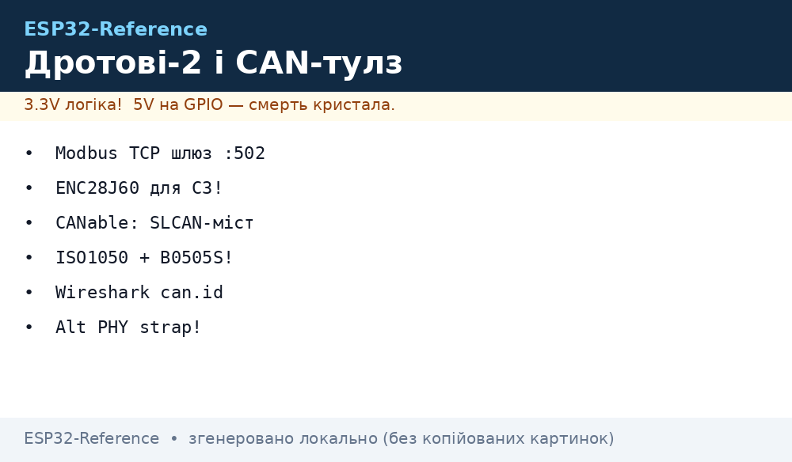
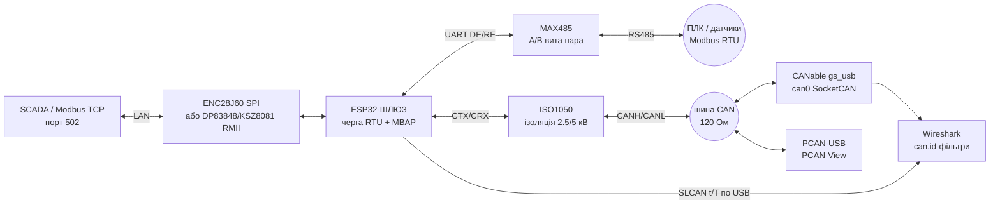

# Wired-2 - Modbus TCP (шлюз RTU↔TCP), alt-PHY, ENC28J60, CAN-інструменти

> [!info] Призначення
> Ця нотатка - друга частина дротових модулів (продовження [04-RS485-CAN-Ethernet-Kamera](../../../ESP32-Reference/12-Moduli-zvyazku/04-RS485-CAN-Ethernet-Kamera.md) і [07-SIM7600-W5500-MCP2515](../../../ESP32-Reference/12-Moduli-zvyazku/07-SIM7600-W5500-MCP2515.md)): **Modbus TCP** і код шлюзу RTU↔TCP, альтернативні Ethernet-PHY **DP83848 / KSZ8081** (коли LAN8720 немає в наявності), **ENC28J60** - SPI-Ethernet для ESP32-C3 (без вбудованого EMAC), а також інструменти CAN-шини: **CANable / SLCAN-прошивка**, ізольований трансивер **ISO1050**, огляд **PCAN**, **Wireshark з CAN** і код **SLCAN-моста** на ESP32.


*Рис. ESP32 як шлюз Modbus RTU↔TCP і CAN-аналізатор: RMII-PHY / ENC28J60 з одного боку, TWAI + ISO1050 + CANable/SLCAN з іншого, PC керує через Wireshark/SocketCAN.*

Зв'язок з [Home](../../../ESP32-Reference/Home.md), [04-RS485-CAN-Ethernet-Kamera](../../../ESP32-Reference/12-Moduli-zvyazku/04-RS485-CAN-Ethernet-Kamera.md), [07-SIM7600-W5500-MCP2515](../../../ESP32-Reference/12-Moduli-zvyazku/07-SIM7600-W5500-MCP2515.md), [20-NFC-Biometry-2](../../../ESP32-Reference/12-Moduli-zvyazku/20-NFC-Biometry-2.md), [SPI](../../../ESP32-Reference/04-Shini/02-SPI.md), [UART](../../../ESP32-Reference/04-Shini/01-UART.md), [01-Lancjugi-zhivlennya](../../../ESP32-Reference/02-Zhivlennya/01-Lancjugi-zhivlennya.md), [02-Troubleshooting-FAQ](../../../ESP32-Reference/99-Dodatki/02-Troubleshooting-FAQ.md).

Характеристики (порівняльна таблиця):

| Вузол | Роль | Інтерфейс до ESP32 | Живлення | Швидкість / межа | Коли брати |
| --- | --- | --- | --- | --- | --- |
| Modbus TCP (шлюз) | RTU↔TCP міст, порт 502 | Wi-Fi / Ethernet + UART RS485 | як ESP32 | 10/100 Мбіт + 115200 бод RTU | ПЛК + датчики RS485 в одну SCADA-мережу |
| DP83848C | Alt RMII-PHY 10/100 | RMII (9 сигналів) + SMI MDC/MDIO | 3.3V, ~270 мВт | 100 Мбіт, до 150 м | Немає LAN8720; потрібен JTAG/SNI, industrial T |
| KSZ8081MNX | Alt RMII-PHY 10/100 | RMII + SMI, strap-піни | 3.3V (ядро 1.2V внутр.) | 100 Мбіт, Auto-MDIX | Низька ціна, LinkMD, EEE-версія KSZ8081RNA |
| ENC28J60 | SPI-Ethernet 10 Мбіт | SPI до 20 МГц + INT | 3.3V, ~160 мА TX | 10 Мбіт half/full | ESP32-C3/S2 без EMAC; повільний, але дешевий |
| CANable (candleLight) | USB→CAN адаптер, gs_usb/SLCAN | USB до ПК; CANH/CANL до шини | 5V USB | 1 Мбіт CAN 2.0 | Дешевий аналізатор під SocketCAN |
| ISO1050 | Ізольований CAN-трансивер | CTX/CRX 3.3V/5V логіка | VCC1 3.3/5V + VCC2 5V ізольов. | 1 Мбіт, ізоляція 2500/5000 В | Гальванічна розв'язка ESP32 від шини 24V/авто |
| PCAN-USB | Промисловий USB→CAN | USB до ПК | 5V USB | 1 Мбіт + CAN FD (версії FD) | Еталонний інструмент, PCAN-View/Explorer |
| Wireshark + CAN | Аналіз кадрів SocketCAN | pcap/socketcan, vcan/can0 | - | - | Декодування UDS/J1939, фільтри `can.id` |

## Призначення

Wired-2 - Modbus TCP (шлюз RTU↔TCP), alt-PHY, ENC28J60, CAN-інструменти - Modbus TCP і шлюз RTU↔TCP; Альтернативні PHY: DP83848 / KSZ8081; 1. DP83848C. Wired-2 - Modbus TCP (шлюз RTU↔TCP), alt-PHY, ENC28J60, CAN-інструменти. Зв'язок з Home, 12-Moduli-zvyazku/04-RS485-CAN-Ethernet-Kamera, 12-Moduli-zvyazku/07-SIM7600-W5500-MCP2515, 12-Moduli-zvyazku/20-NFC-Biometry-2, [SPI](../../../ESP32-Reference/04-Shini/02-SPI.md), [UART](../../../ESP32-Reference/04-Shini/01-UART.md), [01-Lancjugi-zhivlennya](../../../ESP32-Reference/02-Zhivlennya/01-Lancjugi-zhivlennya.md), [02-Troubleshooting-FAQ](../../../ESP32-Reference/99-Dodatki/02-Troubleshooting-FAQ.md).

## 1. Modbus TCP і шлюз RTU↔TCP

Modbus TCP = Modbus-кадр в TCP-сегменті, порт **502**, заголовок **MBAP** (7 байт: Transaction ID 2 + Protocol ID 2 (`0x0000`) + Length 2 + Unit ID 1), далі класичний PDU (Function Code + дані). Відмінності від RTU: немає CRC (його замінює TCP), немає таймаутів міжсимвольних 3.5t, Unit ID маршрутизує за шлюзом на конкретний RTU-адрес.

Шлюз RTU↔TCP на ESP32: з одного боку TCP-сервер (порт 502, кілька сокетів), з іншого - UART RS485 (DE/RE, див. [04-RS485-CAN-Ethernet-Kamera](../../../ESP32-Reference/12-Moduli-zvyazku/04-RS485-CAN-Ethernet-Kamera.md)). Логіка: прийняв MBAP+PDU → відрізав MBAP → додав RTU-адрес (= Unit ID) + CRC16 → відправив у RS485 → чекає відповідь → відрізав CRC → додав MBAP з тим же Transaction ID → відправив TCP-клієнту. Transaction ID копіюється 1:1 - це дозволяє мультиплексувати кілька одночасних TCP-запитів на один напівдуплексний RTU.

> [!warning] Один RTU - один запит одночасно
> RS485 напівдуплекс: шлюз мусить серіалізувати запити м'ютексом/чергою. Два TCP-клієнти без черги = колізія і биті CRC. Таймаут RTU 100-300 мс, після - Modbus exception `0x0B` (Gateway Target Failed) у TCP-відповіді.

Карта функцій для шлюзу (що реально треба):

| FC | Назва | TCP→RTU мапінг | Примітка |
| --- | --- | --- | --- |
| 0x01 | Read Coils | як є + CRC | Бітові виходи |
| 0x02 | Read Discrete Inputs | як є + CRC | Бітові входи |
| 0x03 | Read Holding Registers | як є + CRC | 90% трафіку SCADA |
| 0x04 | Read Input Registers | як є + CRC | Датчики |
| 0x06 / 0x10 | Write Single/Multiple | як є + CRC | Запис уставок |
| 0x2B/0x0E | Read Device ID | можна відповісти локально | Візитка шлюзу без звернення до RTU |

## 2. Альтернативні PHY: DP83848 / KSZ8081

Коли LAN8720 немає в продажу або потрібен ширший температурний діапазон - беруть **DP83848C** (TI) або **KSZ8081MNX** (Microchip). Обидва RMII 10/100, обидва працюють з ESP32-EMAC через SMI (MDC/MDIO). ESP-IDF має готові драйвери: `dp83848` і `ksz80xx` у репозиторії додаткових Ethernet-драйверів.

### 2.1. DP83848C

| Параметр | Значення |
| --- | --- |
| Інтерфейс | MII / RMII / SNI (конфігурується), RMII для ESP32 |
| Керування | SMI: MDC + MDIO, PHY-адреса strap-пінами RXD[3:0] |
| Тактування | 25 МГц кварц → внутрішній помножувач дає 50 МГц REF_CLK назовні (режим EXT_IN для ESP32, GPIO0) |
| LED | 3 програмовані (Link / Speed / Activity) |
| Корпус | LQFP-48, 3.3V, <270 мВт тип. |
| Фішки | Auto-MDIX, Energy Detect, BIST, JTAG boundary scan |

Strap-увага: адреса PHY задається рівнями на RXD0-RXD3 у момент reset. Якщо на платі підтяжки конфліктують з strapping ESP32 (GPIO0!) - розводьте уважно: REF_CLK на GPIO0 + PHY reset в активному стані під час boot = ризик вічного download-mode. Ліки: тримати PHY у reset до старту драйвера (reset-GPIO з ESP32) або живити кварц PHY через ключ.

### 2.2. KSZ8081MNX

| Параметр | Значення |
| --- | --- |
| Інтерфейс | MII / RMII, RMII для ESP32 |
| Керування | SMI, адреса strap-пінами RXD[2:0]/CONFIG |
| Тактування | 25 МГц кварц; REF_CLK 50 МГц назовні (є версії з вбудованим генератором) |
| LED | 2 (Link/Activity, Speed), режими strap |
| Корпус | QFN-32, 3.3V single supply |
| Фішки | Auto-MDIX з вимкенням, LinkMD (діагностика кабелю!), EEE у KSZ8081RNA/RND |

LinkMD - вбудований TDR-тестер пари: драйвер може повідомити «обрив на ~13 м» без теодолітів. Для field-діагностики безцінне.

### 2.3. DP83848 vs KSZ8081 vs LAN8720

| Критерій | LAN8720 | DP83848C | KSZ8081MNX |
| --- | --- | --- | --- |
| Ціна/наявність | дешевий, але часто out-of-stock | дорожчий, industrial | дешевий, стабільно є |
| REF_CLK | 50 МГц назовні (власний осцилятор) | 50 МГц з 25 МГц кварцу | 50 МГц з 25 МГц кварцу |
| Діагностика | мінімум | BIST, JTAG | LinkMD (TDR по парі) |
| Споживання | ~100 мА | ~80 мА | ~50 мА |
| ESP-IDF драйвер | вбудований (`lan87xx` покриває) | `dp83848` з esp-eth-drivers | `ksz80xx` з esp-eth-drivers |
| Коли брати | default-вибір | industrial −40…+85, JTAG | бюджет + LinkMD |

## 3. ENC28J60 - SPI-Ethernet для ESP32-C3

ESP32-C3 / S2 **не мають** внутрішнього EMAC - дротовий Ethernet тільки через SPI-модуль. **ENC28J60** (Microchip): MAC+PHY 10BASE-T в одному чипі, SPI до 20 МГц, переривання INT, 8 КБ буфер. ESP-IDF підтримує його як `esp_eth_mac_new_enc28j60` (SPI-Ethernet). Повільний (реально 1-5 Мбіт корисного TCP через SPI-накладні), але для Modbus TCP / MQTT / HTTP-конфігуратора вистачає з запасом.

> [!warning] 3.3V і SPI-швидкість
> ENC28J60 - строго 3.3V (5V вбиває). SPI 20 МГц максимум, дроти <10 см, окремий CS. INT-пин обов'язковий (модуль interrupt-driven). Живлення: пік ~160-180 мА на передачі - слабкий LDO DevKit просадить шину.

Порівняння SPI-Ethernet для C3:

| Модуль | Швидкість лінії | SPI | Буфер | ESP-IDF | Висновок |
| --- | --- | --- | --- | --- | --- |
| ENC28J60 | 10 Мбіт | до 20 МГц | 8 КБ | `enc28j60` (esp-eth-drivers) | Дешевий, вистачає для телеметрії |
| W5500 | 10/100 Мбіт | до 80 МГц | 32 КБ | вбудований `w5500` | Швидший, апаратний TCP/IP; див. [07-SIM7600-W5500-MCP2515](../../../ESP32-Reference/12-Moduli-zvyazku/07-SIM7600-W5500-MCP2515.md) |
| DM9051 | 10/100 Мбіт | до 50 МГц | 16 КБ | вбудований `dm9051` | Компроміс |

Типовий SPI-мапінг ENC28J60 на ESP32-C3: SCK=GPIO4, MOSI=GPIO6, MISO=GPIO5, CS=GPIO7, INT=GPIO3, RST=GPIO8 (або −1). На classic ESP32 - будь-які вільні GPIO через матрицю.

## 4. Інструменти CAN: CANable / SLCAN-прошивка

**CANable** (і клони: candleLight, CANable-MKS) - плата на STM32F042 + TJA1050: USB з одного боку, CANH/CANL з іншого. Прошивки два стандарти:

- **candleLight_fw (gs_usb)** - емулює USB-пристрій `gs_usb`, в Linux підхоплюється ядром як `can0` через SocketCAN (`ip link set can0 type can bitrate 500000`). Нуль коду на ПК - працюють `candump`, `cansend`, Wireshark.
- **SLCAN (serial-line CAN)** - текстовий протокол: `t1234DEADBEEF\r` (стандартний ID 0x123, 4 байти), `T1234567881122334455667788\r` (розширений), `r`/`R` - RTR, `S4` - швидкість 500 кбіт, `O`/`C` - open/close. Будь-який USB-UART + `slcand` в Linux або прямий парсинг у терміналі.

Коли що: gs_usb - швидкість і зручність (до 1 Мбіт без втрат); SLCAN - коли адаптер саморобний (ESP32 + TJA1050 + USB-UART) або треба міст через Wi-Fi/TCP (slcan по telnet - класика віддаленої діагностики).

Мінімальна шпаргалка SocketCAN (ПК з CANable):

```bash
sudo ip link set can0 type can bitrate 500000   # налаштувати швидкість
sudo ip link set up can0                        # підняти інтерфейс
candump can0                                    # слухати все
cansend can0 123#DEADBEEF                       # відправити кадр
candump -L can0 > log.asc                       # писати лог для Wireshark
```

## 5. ISO1050 - ізольований CAN-трансивер

**ISO1050** (TI) = трансивер CAN + бар'єр SiO2 в одному корпусі: гальванічна ізоляція 2500 В (DUB-8) / 5000 В (DW-16) між логікою (ESP32) і шиною. На шині 24V-автоматики, частотників, електромобілів - різниця земель легко дає десятки вольт: без ізоляції згорає спочатку трансивер, потім ESP32, потім ноутбук через USB.

| Параметр | Значення |
| --- | --- |
| Стандарт | ISO11898-2, до 1 Мбіт |
| Ізоляція | 2500 В RMS (DUB) / 5000 В RMS (DW), CMTI 25 кВ/мкс |
| Логіка | 3.3V/5V (VCC1), шина - ізольовані 5V (VCC2 через DC-DC, напр. B0505S) |
| Захист | Bus-fault −27…+40V, TXD dominant timeout, thermal shutdown |
| Затримка петлі | 150 нс тип. - запас по таймінгу на 1 Мбіт зберігається |

> [!warning] Ізольованій стороні - ізольоване живлення
> Сама мікросхема бар'єр не живить: VCC2 мусить іти від **ізольованого DC-DC** (B0505S-1W або аналог) + розв'язувальні конденсатори з обох боків. Спільна земля між VCC1 і VCC2 = ізоляції немає, гроші на вітер. GND2 шини - тільки на екран/землю шини через 1 МОм + 4.7 нФ за потреби.

ISO1050 vs звичайні трансивери:

| Трансивер | Ізоляція | VCC | Коли |
| --- | --- | --- | --- |
| TJA1050 | немає | 5V | Лабораторія, живлення від одного БЖ |
| SN65HVD230 | немає | 3.3V | ESP32 безпосередньо, див. [04-RS485-CAN-Ethernet-Kamera](../../../ESP32-Reference/12-Moduli-zvyazku/04-RS485-CAN-Ethernet-Kamera.md) |
| ISO1050 | 2.5/5 кВ | 3.3/5V + ізол. 5V | Поле, 24V-системи, частотники, авто |
| ISO1042/TCAN1042 | 5 кВ + CAN FD | 3.3V | CAN FD з ізоляцією (апгрейд) |

## 6. PCAN-огляд

**PCAN** (PEAK-System) - промисловий стандарт USB→CAN адаптерів: PCAN-USB (CAN 2.0), PCAN-USB FD (CAN FD до 12 Мбіт data-phase), гальванічно ізольовані версії. Софт: **PCAN-View** (безкоштовний монітор/трасувальник), **PCAN-Explorer** (символи, скрипти), драйвери Windows/Linux (SocketCAN-сумісні). Чим відрізняється від CANable за $30: сертифікація, стабільні драйвери під Windows, підтримка CAN FD, тривала доступність однієї ревізії (важливо для серії). Для цеху/стенда - PCAN; для столу розробника - CANable.

## 7. Wireshark з CAN

Wireshark вміє CAN двома шляхами: живий захват з `can0` (Linux: `wireshark -k -i can0`) і відкриття логів (`candump -L`, `.asc`, `.trc` від PCAN). Ключове:

- Display-фільтри: кампус `can` - `can.id == 0x123`, `canfd.fdf == 1`, `can.err == 1` (error-фрейми).
- Колонка даних: кадр CAN показується як ID + DLC + байти; DBC-файли (Vector-формат) через плагіни розкладають сигнали.
- UDS-діагностика (0x7DF/0x7E8): фільтр `can.id == 0x7e8`, далі вручну або LUA-дисектором.
- SocketCAN error-frames: увімкнути `ip link set can0 type can berr-reporting on` - і в дампі видно bus-off/arbitration-lost.

Зв'язка ESP32→Wireshark без дротів: SLCAN-міст ESP32 шле `t.../T...` рядки по TCP, на ПК `socat` загортає в pty → `slcand` → `can0` → Wireshark. Схема - нижче.

## Легенда пінів модулів

### ENC28J60 (модуль mini, 10-pin)

| Пін | Позначення | Тип | Куди на ESP32-C3 | Примітка |
| --- | --- | --- | --- | --- |
| 1 | VCC | Живлення 3.3V | 3V3 (окремий LDO 300 мА) | Тільки 3.3V! Пік 180 мА TX |
| 2 | GND | Земля | GND | Короткий провід, зірка земель |
| 3 | CS | Вхід SPI | GPIO7 (будь-який) | Активний LOW, підтяжка 10к до 3.3V |
| 4 | SI | Вхід SPI MOSI | GPIO6 | ESP32 MOSI → SI |
| 5 | SO | Вихід SPI MISO | GPIO5 | SO → ESP32 MISO |
| 6 | SCK | Вхід SPI | GPIO4 | До 20 МГц, дроти <10 см |
| 7 | INT | Вихід, active low | GPIO3 | Обов'язковий! Модуль interrupt-driven |
| 8 | RST | Вхід, active low | GPIO8 або −1 | Імпульс LOW 100 мкс при старті |
| 9 | CLKOUT | Вихід | не підключати | 25 МГц клок - залишити висячим |
| 10 | WOL | Вихід | не підключати | Wake-on-LAN, не потрібен |

### CANable / candleLight (USB→CAN)

| Пін/роз'єм | Позначення | Тип | Куди | Примітка |
| --- | --- | --- | --- | --- |
| USB-C | USB | USB FullSpeed | ПК | gs_usb або SLCAN-прошивка |
| G | GND | Земля | GND шини | Спільна земля з вузлами CAN |
| CANH | Шина High | Диференційна | Вита пара CANH | 120 Ом на кінцях шини |
| CANL | Шина Low | Диференційна | Вита пара CANL | 120 Ом на кінцях шини |
| Перемичка 120R | Термінатор | - | замкнути якщо крайній вузол | На платах з джампером TERM |

### ISO1050 (плата з B0505S)

| Пін | Позначення | Тип | Куди на ESP32 | Примітка |
| --- | --- | --- | --- | --- |
| 1 | VCC1 | Живлення логіки | 3V3 ESP32 | 3.3V або 5V за версією |
| 2 | GND1 | Земля логіки | GND ESP32 | Тільки сторона ESP32! |
| 3 | CTX | Вхід цифровий | GPIO5 (CAN TX) | ESP32 TX → CTX |
| 4 | CRX | Вихід цифровий | GPIO4 (CAN RX) | CRX → ESP32 RX |
| 5 | VCC2 | Живлення шини | +5V ізольованого B0505S | НЕ від ESP32! |
| 6 | GND2 | Земля шини | GND ізольована | НЕ з'єднувати з GND1! |
| 7 | CANH | Шина | Вита пара | 120 Ом на кінцях |
| 8 | CANL | Шина | Вита пара | 120 Ом на кінцях |

## Схема

Загальна схема стенда: ESP32-шлюз (Ethernet через ENC28J60 або RMII-PHY + RS485 + TWAI через ISO1050), ПК аналізує через CANable/PCAN і Wireshark.

### ASCII-схема

```text
                    ESP32-ШЛЮЗ (Modbus RTU<->TCP + SLCAN-міст)
                    ─────────────────────────────────────────
  Ethernet:         ENC28J60 (SPI) ---- RJ45 ---- LAN (SCADA, порт 502)
   (C3: SPI;        GPIO4 SCK / GPIO6 MOSI / GPIO5 MISO / GPIO7 CS / GPIO3 INT
    classic:        або RMII-PHY DP83848/KSZ8081: REF_CLK 50МГц -> GPIO0,
    REF_CLK 50МГц)  TXD0/TXD1/RXD0/RXD1/TXEN/CRS_DV + MDC/MDIO
  RS485:            GPIO17 TX -> DI MAX485, GPIO16 RX <- RO, GPIO4 -> DE+RE
                    A/B ---- вита пара ---- датчики/ПЛК (120 Ом на кінцях)
  CAN:              GPIO5 CTX -> ISO1050 -> CANH/CANL ---- шина CAN (120 Ом)
                    GPIO4 CRX <- ISO1050    (VCC2 від B0505S, GND2 ізольована!)

  USB-UART:         ESP32 TX0/RX0 ---- ПК (SLCAN-потік t.../T... по /dev/ttyUSB0)
                                              │
                        ┌─────────────────────┼─────────────────────┐
                        │                     │                     │
                     CANable               PCAN-USB              Wireshark
                   (gs_usb/can0)        (PCAN-View)         (can.id-фільтри,
                    candump/cansend       цех/стенд           UDS 0x7DF/0x7E8)
```

### Mermaid (graph LR)



## Код

### ESP-IDF - Modbus TCP slave (esp-modbus, порт 502)

```c
// ESP-IDF + esp-modbus (idf.py add-dependency espressif/esp-modbus).
// Тримає 8 holding-регістрів, доступних SCADA по Modbus TCP :502.
#include "esp_log.h"
#include "esp_event.h"
#include "esp_netif.h"
#include "esp_eth.h"
#include "mbcontroller.h"   // esp-modbus: mbc_slave_*

#define MB_TCP_PORT 502
static const char *TAG = "mb_tcp_slave";

static void mb_tcp_slave_init(void)
{
    void *slave_hdl = NULL;
    mb_communication_info_t comm = {
        .ip_port = MB_TCP_PORT,
        .ip_addr_type = MB_IPV4,
        .ip_mode = MB_MODE_TCP,
        .ip_slave_addr = NULL,          // слухаємо всі інтерфейси
    };
    ESP_ERROR_CHECK(mbc_slave_init(MB_PORT_TCP, &slave_hdl));
    ESP_ERROR_CHECK(mbc_slave_setup((void*)&comm));
    mb_register_area_descriptor_t reg = {
        .start_offset = 0, .type = MB_PARAM_HOLDING,
        .address = (void*)holding_regs, .size = sizeof(holding_regs),
    };
    ESP_ERROR_CHECK(mbc_slave_set_descriptor(reg));
    ESP_ERROR_CHECK(mbc_slave_start());
    ESP_LOGI(TAG, "Modbus TCP slave on :%d", MB_TCP_PORT);
}
```

### ESP-IDF - Ethernet RMII з alt-PHY (DP83848 / KSZ8081)

```c
// ESP-IDF: classic ESP32 + зовнішній RMII-PHY. REF_CLK 50 МГц від PHY -> GPIO0.
// PHY-драйвер: esp_eth_phy_new_dp83848() або esp_eth_phy_new_ksz80xx()
// з компонента espressif/esp-eth-drivers (esp-eth-drivers/dp83848, .../ksz80xx).
#include "esp_eth.h"
#include "esp_eth_phy_dp83848.h"   // або esp_eth_phy_ksz80xx.h

#define PHY_ADDR      1            // звірити зі strap RXD-пінів плати!
#define PHY_RST_GPIO  5
#define SMI_MDC_GPIO  23
#define SMI_MDIO_GPIO 18

void eth_rmii_altphy_init(esp_eth_handle_t *out)
{
    eth_mac_config_t mac_cfg = ETH_MAC_DEFAULT_CONFIG();
    eth_esp32_emac_config_t emac_cfg = ETH_ESP32_EMAC_DEFAULT_CONFIG();
    emac_cfg.smi_gpio.mdc_num = SMI_MDC_GPIO;
    emac_cfg.smi_gpio.mdio_num = SMI_MDIO_GPIO;
    emac_cfg.clock_config.rmii.clock_mode = EMAC_CLK_EXT_IN; // REF_CLK від PHY
    emac_cfg.clock_config.rmii.clock_gpio = 0;               // GPIO0 вхід!
    esp_eth_mac_t *mac = esp_eth_mac_new_esp32(&emac_cfg, &mac_cfg);

    eth_phy_config_t phy_cfg = ETH_PHY_DEFAULT_CONFIG();
    phy_cfg.phy_addr = PHY_ADDR;
    phy_cfg.reset_gpio_num = PHY_RST_GPIO;
    // DP83848:
    esp_eth_phy_t *phy = esp_eth_phy_new_dp83848(&phy_cfg);
    // KSZ8081: esp_eth_phy_t *phy = esp_eth_phy_new_ksz80xx(&phy_cfg);

    esp_eth_config_t cfg = ETH_DEFAULT_CONFIG(mac, phy);
    esp_eth_handle_t hdl = NULL;
    ESP_ERROR_CHECK(esp_eth_driver_install(&cfg, &hdl));
    ESP_ERROR_CHECK(esp_eth_start(hdl));
    *out = hdl;
}
```

### Arduino - шлюз Modbus RTU↔TCP (eModbus)

```cpp
// Arduino (ESP32): шлюз Modbus RTU (RS485) <-> TCP :502 на eModbus.
// TCP-сервер приймає MBAP+PDU, черга м'ютексу серіалізує доступ до RTU.
#include <WiFi.h>
#include <ModbusServerTCP.h>   // eModbus: https://github.com/eModbus/eModbus
#include <ModbusBridge.h>

#define DE_RE 4
#define MB_TCP_PORT 502
ModbusServerTCP mbServer;
ModbusBridge bridge;           // RTU<->TCP міст eModbus

void setup() {
  Serial.begin(115200);
  Serial2.begin(9600, SERIAL_8N1, 16, 17);  // RS485: RX=16 TX=17
  pinMode(DE_RE, OUTPUT);
  digitalWrite(DE_RE, LOW);
  WiFi.begin("ssid", "pass");
  while (WiFi.status() != WL_CONNECTED) delay(200);
  // RTU-клієнт мосту на Serial2, керування DE/RE через колбеки мосту
  bridge.attachServer(mbServer);            // TCP-сторона
  // bridge.useSerial(Serial2, DE_RE);      // RTU-сторона (API eModbus)
  mbServer.start(MB_TCP_PORT, 4, 2000);     // порт, сокети, таймаут мс
}

void loop() {
  mbServer.loop();   // качає MBAP, міст ходить в RTU під м'ютексом
  delay(1);
}
```

### Arduino - SLCAN-міст ESP32→ПК (TWAI + USB-Serial)

```cpp
// Arduino (ESP32 classic): SLCAN-міст. TWAI-кадри -> рядки slcan в USB-Serial:
//   t1234DEADBEEF\r  (std ID 0x123)   T1234567888AABB.. \r (ext)
// Приймає з ПК: O (open), C (close), S4 (500k), t/T-кадри -> у шину.
#include "driver/twai.h"

#define CAN_RX 4
#define CAN_TX 5
static bool slcan_open = false;

void twai_init(uint32_t baud) {
  twai_general_config_t g = TWAI_GENERAL_CONFIG_DEFAULT(
      (gpio_num_t)CAN_TX, (gpio_num_t)CAN_RX, TWAI_MODE_NORMAL);
  twai_timing_config_t t = TWAI_TIMING_CONFIG_500KBITS(); // S4
  twai_filter_config_t f = TWAI_FILTER_CONFIG_ACCEPT_ALL();
  twai_driver_install(&g, &t, &f);
  twai_start();
}

void send_slcan(const twai_message_t &m) {
  char buf[80]; int n = 0;
  if (m.extd) n += sprintf(buf + n, "T%08lX", m.identifier);
  else        n += sprintf(buf + n, "t%03lX", m.identifier);
  n += sprintf(buf + n, "%d", m.data_length_code);
  for (int i = 0; i < m.data_length_code; i++) n += sprintf(buf + n, "%02X", m.data[i]);
  buf[n++] = '\r'; buf[n] = 0;
  Serial.print(buf);
}

void setup() {
  Serial.begin(115200);
  twai_init(500000);
}

void loop() {
  twai_message_t m;
  if (slcan_open && twai_receive(&m, pdMS_TO_TICKS(5)) == ESP_OK && !m.rtr)
    send_slcan(m);
  while (Serial.available()) {
    char c = Serial.read();
    if (c == 'O') slcan_open = true;
    else if (c == 'C') slcan_open = false;
    // S4/S5/t../T.. — розбір швидкості і TX-кадрів за спектром slcan
  }
}
```

### MicroPython - Modbus TCP slave (мінімальний, порт 502)

```python
"""MicroPython (ESP32 + WiFi або ENC28J60 через драйвер): мінімальний Modbus TCP
slave: відповідає на FC 0x03 (read holding) з 8 регістрів. Без залежностей."""
import socket, struct
import network

REG = [0] * 8  # holding-регістри; оновлюйте з датчиків

def serve(port=502):
    s = socket.socket()
    s.setsockopt(socket.SOL_SOCKET, socket.SO_REUSEADDR, 1)
    s.bind(("0.0.0.0", port))
    s.listen(2)
    while True:
        c, _ = s.accept()
        try:
            hdr = c.recv(7)
            if len(hdr) < 7:
                c.close(); continue
            tid, pid, ln, uid = struct.unpack(">HHHB", hdr)
            pdu = c.recv(ln - 1)
            fc = pdu[0]
            if fc == 0x03:
                _, addr, cnt = struct.unpack(">BHH", pdu[:5])
                vals = REG[addr:addr + cnt]
                body = struct.pack(">BB", fc, len(vals) * 2)
                for v in vals:
                    body += struct.pack(">H", v)
                resp = struct.pack(">HHHB", tid, 0, len(body) + 1, uid) + body
                c.send(resp)
            else:
                exc = struct.pack(">BB", fc | 0x80, 0x01)  # illegal function
                c.send(struct.pack(">HHHB", tid, 0, len(exc) + 1, uid) + exc)
        finally:
            c.close()

    # serve()  # викликати після підключення WiFi/Ethernet
```

### MicroPython - SLCAN-вивід TWAI-кадрів

```python
"""MicroPython (ESP32 classic, прошивка з CAN/TWAI): шле кадри шини в USB як slcan."""
from machine import UART
import time

    # can = CAN(0, CAN.NORMAL, baudrate=500_000, rx=4, tx=5)  # залежно від порту
uart = UART(0, 115200)

def slcan_send(can_id, data, ext=False):
    head = "T%08X" % can_id if ext else "t%03X" % can_id
    uart.write(head + "%d" % len(data) + "".join("%02X" % b for b in data) + "\r")

    # while True:
    #     f = can.recv(50)          # (id, ext, rtr, dlc, data...) залежно від API
    #     if f: slcan_send(f[0], f[4])
```

### SNMP-агент на ESP32 (моніторинг мережевих вузлів)

| Параметр | Значення |
| --- | --- |
| Версія | SNMPv2c (community `public/private` - ТІЛЬКИ в LAN!) |
| OID-мінімум | sysUpTime, sysName + свої: heap (1.3.6.1.4.1.xxxx.1), RSSI, vbat |
| Traps | Події (reboot, low-batt) на менеджер; polling - раз на 1-5 хв |
| Бібліотека | Arduino SNMP-agent / esp-snmp (IDF, важкий - тільки з PSRAM!) |

```text
Архітектура: ESP32-агент → Zabbix/LibreNMS опитує → графіки heap/RSSI/vbat →
алерт «heap падає» ловить витоки ДО зависання!
Безпека: SNMPv2c без шифрування — ТІЛЬКИ закрита LAN; через інтернет — VPN або SNMPv3 (рідко на ESP32).
```

## Типові помилки

| # | Симптом | Причина | Ліки |
| --- | --- | --- | --- |
| 1 | SCADA: timeout на всіх Modbus TCP запитах | ESP32 слухає не той порт / firewall | Перевірити `:502`, `SO_REUSEADDR`, ping до ESP32 |
| 2 | Биті дані: Transaction ID не збігається | Шлюз переплутав Transaction ID при мультиплексі | Копіювати TID запит→відповідь 1:1, черга за TID |
| 3 | Два TCP-клієнти - CRC-помилки RTU | Паралельні запити на напівдуплекс без м'ютексу | М'ютекс/черга RTU, таймаут 100-300 мс, exception 0x0B |
| 4 | Unit ID ігнорується, відповідає не той пристрій | Шлюз не мапить Unit ID→RTU-адрес | Unit ID = RTU-адреса; 0 = broadcast (без відповіді!) |
| 5 | Ethernet не лінкується з DP83848/KSZ8081 | Неправильний PHY_ADDR (strap) | Зчитати strap RXD-пінів, спробувати автоскан 0-31 |
| 6 | ESP32 вічно в download-mode з alt-PHY | REF_CLK на GPIO0 активний під час boot | PHY у reset до старту драйвера; ключ живлення кварцу |
| 7 | Лінк є, DHCP немає | Auto-MDIX вимкнено strap, перехресний кабель | Увімкнути Auto-MDIX або прямий кабель; перевірити LED |
| 8 | KSZ8081: лінк 10 Мбіт замість 100 | Погані пари / довжина / завади | LinkMD-діагностика, переобжати RJ45, коротший кабель |
| 9 | ENC28J60 мовчить (REV 0x00/0xFF) | 5V живлення або довгі SPI-дроти | Тільки 3.3V! SPI <10 см, 8-12 МГц для старту, INT підключити |
| 10 | ENC28J60: ping є, TCP рветься | Малий 8 КБ буфер + великий MSS | Зменшити MSS/MTU в LwIP, один сокет, повільний polling |
| 11 | CANable не видно як can0 | Прошивка SLCAN замість candleLight_fw | Перепрошити candleLight_fw або використати `slcand` для SLCAN |
| 12 | `candump` - тиша, error-frames | Швидкість шини ≠ 500000 або немає термінаторів | `ip link set can0 type can bitrate X`, 120 Ом з обох кінців |
| 13 | ISO1050 гріється / немає кадрів | VCC2 від ESP32 або спільна GND1=GND2 | VCC2 тільки від B0505S, GND2 ізольована, перевірити CTX/CRX |
| 14 | PCAN-View бачить error-passive | Один вузол на 1 Мбіт серед 125 кбіт | Уніфікувати bitrate всіх вузлів; перевірити кварци |
| 15 | Wireshark: кадри є, фільтр `can.id` не працює | Захват з неправильним DLT / старий Wireshark | Оновити Wireshark, інтерфейс `can0`, фільтр `can.id == 0x123` |

## Офіційні джерела

> Усі посилання нижче перевірені завантаженням (webfetch, 2026-09-29). Вгаданих URL немає.

- ESP-IDF Ethernet API (EMAC + RMII, SMI, esp_netif) - <https://docs.espressif.com/projects/esp-idf/en/stable/esp32/api-reference/network/esp_eth.html>
- esp-modbus - офіційна бібліотека Modbus RTU/TCP (Espressif) - <https://github.com/espressif/esp-modbus>
- esp-eth-drivers - DP83848 / KSZ80XX / ENC28J60 драйвери (Espressif) - <https://github.com/espressif/esp-eth-drivers>
- ESP-IDF Ethernet basic-приклад (EMAC + esp_netif + DHCP) - <https://github.com/espressif/esp-idf/tree/master/examples/ethernet/basic>
- DP83848C - 10/100 PHY з RMII, datasheet і документація (TI) - <https://www.ti.com/product/DP83848C>
- ISO1050 - ізольований CAN-трансивер, datasheet (TI) - <https://www.ti.com/product/ISO1050>
- PCAN-USB - промисловий USB→CAN адаптер (PEAK-System) - <https://www.peak-system.com/PCAN-USB.199.0.html?&L=1>
- Wireshark Display Filter Reference: CAN - <https://www.wireshark.org/docs/dfref/c/can.html>
- SocketCAN - CAN-підсистема ядра Linux (kernel docs) - <https://docs.kernel.org/networking/can.html>
- candleLight_fw - gs_usb-прошивка для CANable/cantact (candle-usb) - <https://github.com/candle-usb/candleLight_fw>
- UIPEthernet - Arduino Ethernet-API для ENC28J60 - <https://github.com/UIPEthernet/UIPEthernet>
- eModbus - Modbus RTU/ASCII/TCP + міст для ESP32 (Arduino) - <https://github.com/eModbus/eModbus>

## 8. Modbus TCP повний стек: MBAP, exception-коди, приклади кадрів усіх FC

> [!info] Специфікація
> Modbus TCP описаний у документах Modbus-IDA: **MODBUS Messaging on TCP/IP Implementation Guide V1.0b** і **MODBUS Application Protocol V1.1b** (шукати на modbus.org за точними назвами - прямі URL не вбудовано, щоб не вгадувати). Нижче - повна витримка, достатня для написання парсера/шлюзу без читання спеки цілком.

### 8.1. MBAP-заголовок побайтово

Кожен Modbus TCP-кадр = **MBAP (7 байт) + PDU (1-253 байти)**. Максимальна довжина TCP-сегмента - 260 + 7 = 267 байт (поле Length ніколи не перевищує 260).

| Байти | Поле | Розмір | Значення |
| --- | --- | --- | --- |
| 0-1 | Transaction ID (TID) | 2 (big-endian) | Довільний лічильник клієнта; сервер копіює 1:1 у відповідь |
| 2-3 | Protocol ID (PID) | 2 (big-endian) | Завжди `0x0000` (Modbus). Інше значення - відкинути кадр |
| 4-5 | Length | 2 (big-endian) | Кількість байтів **після** цього поля: Unit ID (1) + PDU (N). Мін. 2, макс. 260 |
| 6 | Unit ID (UID) | 1 | Адреса RTU-пристрою за шлюзом (`0x00` = broadcast, `0xFF` = локальний шлюз за домовленістю) |
| 7+ | PDU | 1-253 | Function Code (1) + дані |

ASCII-схема кадру:

```text
 0         1         2         3         4         5         6         7 ...
+---------+---------+---------+---------+---------+---------+---------+---------+
|         TID       |         PID=0000  |        Length     |  UID  | FC | дані… |
+---------+---------+---------+---------+---------+---------+---------+---------+
|<-------------- MBAP 7 байт -------------------->|<-------- PDU ----------->|
```

Правила парсера (жорсткі, інакше - діри безпеки):

1. Прочитати рівно 7 байт; якщо PID ≠ 0 - закрити з'єднання (не exception, а TCP-reset: це не Modbus).
2. Length < 2 або Length > 260 - закрити з'єднання (захист від переповнення буфера).
3. Дочитати рівно Length байтів (Length включає UID!). Недовантаження - чекати з таймаутом 2-5 с, потім закрити сокет.
4. FC з бітом 7 (`FC | 0x80`) у запиті - нелегал; відповісти exception `0x01`.

### 8.2. Exception-коди (повна таблиця)

Відповідь-помилка = MBAP (той же TID!) + `FC|0x80` + 1 байт коду. Length відповіді завжди 3 (`UID + FC + code`).

| Код | Назва (спека) | Коли |
| --- | --- | --- |
| 0x01 | Illegal Function | FC не підтримується (напр. 0x17 у простому slave) |
| 0x02 | Illegal Data Address | Регістр/койл поза картою (addr+cnt виходить за масив) |
| 0x03 | Illegal Data Value | Довжина/значення поза допуском (cnt=0, cnt>125 для 0x03, byte-count не збігається) |
| 0x04 | Slave Device Failure | Внутрішня помилка (датчик відвалився, flash не пишеться) |
| 0x05 | Acknowledge | Довга операція прийнята, відповідь пізніше (рідко в TCP; частіше програмування) |
| 0x06 | Slave Device Busy | Шлюз зайнятий RTU-транзакцією - клієнт має повторити |
| 0x08 | Memory Parity Error | Помилка файлових операцій (FC 0x14/0x15, майже не зустрічається) |
| 0x0A | Gateway Path Unavailable | Шлюз налаштований, але маршруту до RTU-мережі немає (немає лінка UART/RS485) |
| 0x0B | Gateway Target Failed | RTU-пристрій не відповів (таймаут 100-300 мс) - найчастіший код шлюзу |

> [!warning] Gateway-коди - візитка шлюзу
> Звичайний slave ніколи не шле 0x0A/0x0B. Якщо SCADA бачить 0x0B - проблема НЕ в мережі TCP, а на стороні RS485 (адреса, baud, обрив, два master). Не чіпайте Ethernet - ідіть міряти A/B.

### 8.3. Приклади кадрів hex (запит → відповідь, TID=0x0001, UID=0x01)

Нижче байти як на дроті (Wireshark: фільтр `tcp.port == 502`, далі `mbtcp`/`modbus`-дисектор).

**FC 0x01 Read Coils (0x0013, 19 шт від 20-го):**

```text
REQ: 00 01 00 00 00 06 01 01 00 13 00 13
     |TID  |PID  |Len  |UID|FC|addr   |cnt    |
RSP: 00 01 00 00 00 06 01 01 03 CD 6B 05
     |TID  |PID  |Len  |UID|FC|bytes=3|стани койлів (молодший біт = перший койл)|
```

**FC 0x02 Read Discrete Inputs (8 входів від 0x0064):**

```text
REQ: 00 02 00 00 00 06 01 02 00 64 00 08
RSP: 00 02 00 00 00 04 01 02 01 AC
```

**FC 0x03 Read Holding Registers (3 регістри від 0x006B):**

```text
REQ: 00 03 00 00 00 06 01 03 00 6B 00 03
RSP: 00 03 00 00 00 09 01 03 06 02 2B 00 00 00 64
                                       |hi lo|hi lo|hi lo| = 0x022B, 0x0000, 0x0064
```

**FC 0x04 Read Input Registers (2 регістри від 0x0008):**

```text
REQ: 00 04 00 00 00 06 01 04 00 08 00 02
RSP: 00 04 00 00 00 07 01 04 04 00 0A 01 02
```

**FC 0x05 Write Single Coil (койл 0x00AC = ON):**

```text
REQ: 00 05 00 00 00 06 01 05 00 AC FF 00
                                       |FF 00 = ON, 00 00 = OFF (інші значення — exception 0x03!)|
RSP: 00 05 00 00 00 06 01 05 00 AC FF 00   (ехо запиту)
```

**FC 0x06 Write Single Register (регістр 0x0001 = 0x0003):**

```text
REQ: 00 06 00 00 00 06 01 06 00 01 00 03
RSP: 00 06 00 00 00 06 01 06 00 01 00 03   (ехо запиту)
```

**FC 0x0F Write Multiple Coils (10 койлів від 0x0013, значення `CD 01`):**

```text
REQ: 00 07 00 00 00 09 01 0F 00 13 00 0A 02 CD 01
                                    |addr   |cnt  |bytes|дані   |
RSP: 00 07 00 00 00 06 01 0F 00 13 00 0A
```

**FC 0x10 Write Multiple Registers (2 регістри від 0x0001: `000A 0102`):**

```text
REQ: 00 08 00 00 00 0B 01 10 00 01 00 02 04 00 0A 01 02
                                          |addr   |cnt  |bytes|дані       |
RSP: 00 08 00 00 00 06 01 10 00 01 00 02
```

**Exception-відповідь (FC 0x03 на неіснуючий регістр, код 0x02):**

```text
REQ: 00 09 00 00 00 06 01 03 FF FF 00 01
RSP: 00 09 00 00 00 03 01 83 02
                             |FC|0x80|code 0x02 Illegal Data Address|
```

Ліміти кількостей (перевіряти ДО звернення до RTU, інакше - exception 0x03 локально): FC01/02 - 1-2000 біт; FC03/04 - 1-125 регістрів; FC05 - тільки `FF 00`/`00 00`; FC06 - будь-яке 16-біт; FC0F - 1-1968 біт, byte-count = ceil(cnt/8); FC10 - 1-123 регістри, byte-count = cnt×2.

### 8.4. MBAP-парсер кодом (Arduino, повний цикл з exception)

```cpp
// Arduino (ESP32): повний MBAP-парсер з валідацією + exception-відповіді.
// Виклик: на кожен прийнятий TCP-буфер. Повертає довжину відповіді (0 = чекати ще).
#include <WiFi.h>
#define MB_MAX_PDU 253

static uint16_t holding[8] = {0};

int mbap_handle(const uint8_t *rx, int rxlen, uint8_t *tx) {
  if (rxlen < 7) return 0;                              // чекаємо заголовок
  uint16_t tid = (rx[0] << 8) | rx[1];
  uint16_t pid = (rx[2] << 8) | rx[3];
  uint16_t len = (rx[4] << 8) | rx[5];
  uint8_t  uid = rx[6];
  if (pid != 0) return -1;                              // не Modbus — рвати сокет
  if (len < 2 || len > 260) return -1;                  // атака/битий кадр
  if (rxlen < 7 + (len - 1)) return 0;                  // чекаємо весь PDU
  uint8_t fc = rx[7];
  auto fail = [&](uint8_t code) {                        // exception-відповідь
    tx[0] = tid >> 8; tx[1] = tid & 0xFF; tx[2] = 0; tx[3] = 0;
    tx[4] = 0; tx[5] = 3; tx[6] = uid;
    tx[7] = fc | 0x80; tx[8] = code; return 9;
  };
  if (fc == 0x03 && len >= 6) {
    uint16_t addr = (rx[8] << 8) | rx[9], cnt = (rx[10] << 8) | rx[11];
    if (cnt < 1 || cnt > 125) return fail(0x03);
    if (addr + cnt > 8) return fail(0x02);
    tx[0] = tid >> 8; tx[1] = tid & 0xFF; tx[2] = 0; tx[3] = 0;
    tx[4] = 0; tx[5] = 3 + cnt * 2; tx[6] = uid; tx[7] = fc; tx[8] = cnt * 2;
    for (int i = 0; i < cnt; i++) { tx[9 + 2*i] = holding[addr+i] >> 8; tx[10 + 2*i] = holding[addr+i] & 0xFF; }
    return 9 + cnt * 2;
  }
  if (fc == 0x06 && len == 6) {                          // write single
    uint16_t addr = (rx[8] << 8) | rx[9];
    if (addr >= 8) return fail(0x02);
    holding[addr] = (rx[10] << 8) | rx[11];
    for (int i = 0; i < 7 + (len - 1); i++) tx[i] = rx[i]; // ехо
    return 7 + (len - 1);
  }
  return fail(0x01);                                     // інше FC — Illegal Function
}
```

MicroPython-еквівалент - у розділі «Код» (мінімальний slave FC 0x03); розширити його exception-гілкою 0x02/0x03 за тим же шаблоном.

### 8.5. Unit ID мапінг кількох RTU-пристроїв

Шлюз тримає **таблицю маршрутизації UID → (RTU-адреса, baud-група, профіль)**. Три стратегії:

| Стратегія | Мапінг | Коли |
| --- | --- | --- |
| 1:1 прозора | UID = RTU-адреса (1-247) | Default; SCADA сама знає адреси датчиків |
| Таблична | UID 1-8 → RTU 11,12,13… (довільна таблиця) | RTU-адреси спадщина/дублікати; ховаємо реальні адреси |
| Віртуальні UID | UID 100+ = обчислені теги шлюзу (середнє, статус) | Шлюз відповідає локально, в RTU не ходить |

```cpp
// Табличний мапінг UID->RTU + локальні віртуальні регістри шлюзу.
struct Route { uint8_t uid; uint8_t rtu; };
static const Route ROUTES[] = {{1,11},{2,12},{3,21},{4,22}};
static uint8_t uid_to_rtu(uint8_t uid, bool *local) {
  *local = (uid >= 100);                  // UID 100+ — віртуальні теги шлюзу
  for (auto &r : ROUTES) if (r.uid == uid) return r.rtu;
  return 0;                               // 0 = нема маршруту -> exception 0x0A
}
// Логіка шлюзу: parse MBAP -> uid_to_rtu() ->
//   local? відповісти з holding шлюзу :
//   зібрати RTU-кадр [rtu][PDU][CRC16], UART-обмін під м'ютексом 100-300 мс ->
//   нема відповіді? exception 0x0B : відрізати CRC, додати MBAP з тим же TID.
```

> [!warning] UID 0 = broadcast - відповіді НЕМА
> Modbus broadcast (UID 0, тільки FC 0x05/0x06/0x0F/0x10): шлюз розсилає в RTU і **мовчить у TCP** (клієнт чекає до свого таймауту - це норма, а не зависання). Ніколи не маршрутизуйте UID 0 як звичайний запит з очікуванням відповіді - отримаєте фантомний таймаут на кожен broadcast. UID 248-255 зарезервовані.

Черга RTU: один `xQueue` + один worker-task володіє UART; TCP-сесії лише кладуть запити з семафором відповіді. TID зберігається в контексті запиту - відповідь збирається з правильним TID навіть якщо RTU відповів пізніше іншого запиту (порядок відповідей ≠ порядку запитів - це лежить на TCP-клієнті, спека це дозволяє).

## 9. Strap-таблиця DP83848 / LAN8720 / KSZ8081 + LinkMD-діагностика

### 9.1. Повна strap-таблиця (що ловиться на reset)

Strap-піни читаються фронтом деасерту RESET (або power-up). PU/PD на платі задають default; перерізати доріжки - останній засіб, спочатку - резистори 2.2-10 кОм.

| Функція | LAN8720 | DP83848C | KSZ8081MNX | Коментар |
| --- | --- | --- | --- | --- |
| PHY-адреса біт 0 | RXER / PHYAD0 | RXD0 | RXD0 / CONFIG0 | Молодший біт SMI-адреси |
| PHY-адреса біт 1 | - (фікс. 0/1 за версією) | RXD1 | RXD1 / CONFIG1 | DP83848/KSZ дають 0-31 через RXD[3:0]/[2:0] |
| PHY-адреса біт 2-3 | - | RXD2 / RXD3 | RXD2 / CONFIG2 | LAN8720 адреса часто лише 0/1 - **автоскан 0-31 обов'язковий** |
| Auto-Negotiation EN | strap nINT/TESTMODE | AN_EN (RXD2+LED) | NWAYEN (CONFIG) | Вимкнення AN → тільки примусові 10/100 на обох кінцях! |
| Speed / Duplex | - | LED_ACT/COL | SPEED / DUPLEX strap | Примусово лише для тестів; у полі - завжди AN |
| RMII/MII вибір | фікс. RMII (LAN8720) | MII/RMII/SNI strap | MII/RMII strap | Для ESP32 - тільки RMII |
| REF_CLK напрям | 50 МГц OUT (кварц 25 МГц на PHY) | 50 МГц OUT (кварц 25 МГц) | 50 МГц OUT (кварц 25 МГц) | Усі три - `EMAC_CLK_EXT_IN`, GPIO0 вхід |
| Isolate / PowerDown | ISOLATE strap | PWRDOWN/INT | PD strap | Не підтягувати в ізоляцію випадково! |
| Auto-MDIX | завжди ON (LAN8720) | ON + strap OFF | ON + strap OFF | OFF лише з відомим прямим кабелем |
| LED-режим | LED1/LED2 фікс | 3 LED програмовані | 2 LED, режими strap | LED1=Link/Activity - перший індикатор поля |

Конфлікт №1 (усі три PHY): **REF_CLK 50 МГц на GPIO0 ESP32** - strapping-пин boot-режиму. Ліки за пріоритетом: (а) PHY у reset (reset-GPIO з ESP32, тримати LOW до `esp_eth_driver_install`); (б) живлення кварца PHY через ключ, що вмикається після boot; (в) RC-затримка REF_CLK (останній засіб, псує цілісність клоку). Перевірка: зняти REF_CLK - ESP32 має бутатись нормально; повернути - лінк має піднятись.

PHY-адреса автоскан (ESP-IDF, коли strap невідомий):

```c
// Шукаємо PHY перебором адрес 0..31: читаємо регистр 0x02 (PHYIDR1), чекаємо non-0xFFFF.
#include "esp_eth.h"
int phy_scan(esp_eth_handle_t h) {
  for (int a = 0; a < 32; a++) {
    uint32_t id = 0;
    if (esp_eth_ioctl(h, ETH_CMD_S_PHY_ADDR, &a) == ESP_OK
        && esp_eth_ioctl(h, ETH_CMD_G_PHY_ID, &id) == ESP_OK
        && id != 0 && id != 0xFFFFFFFF) return a;
  }
  return -1;
}
```

### 9.2. LinkMD (KSZ8081) - TDR-діагностика кабелю без приладів

LinkMD посилає імпульс у пару і слухає відбиття: обрив/замикання/норма + відстань до дефекту. Запуск - біт у PHY-регістрі діагностики (номер регістра - за даташитом ревізії KSZ8081MNX/RNA, шукати `LinkMD` у розділі Remote Loopback/Cable Diagnostic; типово розширений регістр через MMD-доступ).

| Результат LinkMD | Розшифровка | Дія |
| --- | --- | --- |
| Normal, довжина ≈ фактичній | Пара ціла, термінація 100 Ом з обох кінців | Шукати проблему вище (AN, duplex, софт) |
| Open, X м | Обрив на X метрах (±2 м) | Переобжати ближчий кінець; якщо X ≈ довжині - дальній роз'єм/розетка |
| Short, X м | Замикання на X метрах | Перевірити роз'єми на заломи/вологу; замінити сегмент |
| Fail / timeout | Сильні завади або довжина >150 м | Коротший/екранований кабель, прибрати паралель з 220V |

```c
// Псевдокод LinkMD через SMI (регістри — з даташиту вашої ревізії KSZ8081!):
// 1. Перевести PHY у forced 10M half + вимкнути AN (інакше TDR бреше).
// 2. Запустити LinkMD біт self-clear; чекати готовності до 1 с.
// 3. Прочитати статус пари A/B: 00=OK, 01=open, 10=short, 11=fail + 8 біт дистанції.
// Дистанція (м) ≈ count; точність ±2 м на кабелях cat5e до 120 м.
```

DP83848 замість LinkMD має **BIST + JTAG boundary scan**: BIST ганяє внутрішню петлю (перевіряє сам PHY), JTAG - цілісність пайки RMII/SMI на конвеєрі. Для field-діагностики кабелю DP83848 слабший за KSZ8081 - закладайте KSZ8081RNA/RND якщо потрібні виїзди з одним ноутбуком. Детальніше про RMII-таймінги - див. [SPI](../../../ESP32-Reference/04-Shini/02-SPI.md) (контекст шин) і [04-RS485-CAN-Ethernet-Kamera](../../../ESP32-Reference/12-Moduli-zvyazku/04-RS485-CAN-Ethernet-Kamera.md) (базовий LAN8720).

## 10. ENC28J60 errata rev B1 і обхідні шляхи

> [!warning] Перевірте ревізію кремнію першою
> Регістр **EREVID (0x12)**: `0x02` = B1, `0x04` = B4, `0x05` = B5, `0x06` = B7 (остання, брати її). Модулі з B1 ще гуляють барахолками - з ними половина багів нижче відтворюється стабільно, з B7 - ні. Код нижче читає EREVID при старті і вмикає workaround-и лише для старих ревізій.

| # | Errata (B1, документ DS80064) | Симптом на ESP32 | Обхід |
| --- | --- | --- | --- |
| 1 | RX lockup: прийом зупиняється після короткого/битого пакета | ping був - і пропав до reset | Періодичний лічильник пакетів; при стопі - програмний RX-reset (див. код) |
| 2 | TX abort при пізній колізії не чистить ECON1.TXRTS | TCP рветься під навантаженням | Після TX abort - зняти TXRTS, виставити заново, backoff-затримка |
| 3 | Читання MAC/MII-регістрів одразу після запису дає старе значення | Лінк-статус бреше | Dummy-затримка + повторне читання; PHY-статус читати двічі |
| 4 | CLKOUT глітчить при зміні дільника на ходу | ESP32-C3 тактується нестабільно (якщо CLKOUT використано) | CLKOUT не використовувати взагалі; дільник - лише до вмикання RX/TX |
| 5 | Half-duplex back-pressure зависає при певному патерні | Мережа «глухне» у half-duplex хабі | Примусово full-duplex де можливо; інакше - RX-reset за таймером |
| 6 | SPI SO тримається після FFFF-читань при довгих дротах | Сміття на MISO на 20 МГц | Знизити SPI до 8-12 МГц, дроти <10 см, окремий CS без розділення |

```c
// ESP-IDF: перевірка ревізії + програмний RX-reset ENC28J60 (суть workaround-ів errata).
#include "driver/spi_master.h"
#define ENC_RCR 0x00  /* read control register, далі addr */
static uint8_t enc_rcr(spi_device_handle_t s, uint8_t addr) {
  uint8_t tx[2] = {(uint8_t)(ENC_RCR | (addr & 0x1F)), 0xFF}, rx[2] = {0};
  spi_transaction_t t = {.length = 16, .tx_buffer = tx, .rx_buffer = rx};
  spi_device_transmit(s, &t);
  return rx[1];
}
void enc28j60_check_rev(spi_device_handle_t s) {
  uint8_t rev = enc_rcr(s, 0x12);              // EREVID
  // 0x02=B1 (потрібні всі workaround), 0x06=B7 (мінімум). rev==0x00/0xFF = нема зв'язку/5V!
  // Зберігати rev у NVS-лог для діагностики поля.
}
void enc_rx_reset(spi_device_handle_t s) {
  // Скорочена процедура з errata: ECON1.RST=1, пауза, =0, пауза,
  // реініт RX-буферів ERXST/ERXND/ERXRDPT, ECON1.RXEN=1. Повні адреси — з datasheet.
}
```

Практичний висновок: для нових плат під ESP32-C3 беріть **W5500/DM9051** (апаратний TCP/IP, менше errata-ризиків; див. [07-SIM7600-W5500-MCP2515](../../../ESP32-Reference/12-Moduli-zvyazku/07-SIM7600-W5500-MCP2515.md)), ENC28J60 - лише коли ціна вирішує і трафік = Modbus/MQTT-телеметрія. Живлення - окрема гілка 3.3V LDO 300 мА + 10 мкФ + 100 нФ біля модуля (пік TX 160-180 мА).

## 11. CAN-діагностика: UDS (0x22), J1939 PGN, CANopen SDO

### 11.1. UDS-діагностика (ISO 14229, транспорт ISO-TP 15765-2)

Фізична адресація: запит `0x7E0` → відповідь `0x7E8` (ECU#1; наступні ECU `0x7E1/0x7E9`…); функціональна (broadcast): `0x7DF` - відповідають усі (без Flow Control!). Перші байти даних = PCI транспортного рівня:

| PCI | Байт 0 | Значення |
| --- | --- | --- |
| Single Frame | `0x0N` | N = довжина 1-7 (класичний CAN 8 байт) |
| First Frame | `0x1N LL` | Довжина 12 біт (N<<8\|LL), далі 6 байт даних |
| Consecutive | `0x2S` | S = лічильник 0-F, далі 7 байт |
| Flow Control | `0x30 BS ST` | BS = block size, ST = min separation (мс) |

**ReadDataByIdentifier 0x22 (DID 0xF190 = VIN):**

```text
REQ  ID 0x7E0: 02 22 F1 90 00 00 00 00     (SF, len=3: 22 F1 90)
RSP  ID 0x7E8: 10 14 62 F1 90 57 30 30     (FF, len=0x14=20: 62 F1 90 + VIN…)
ECU  ID 0x7E0: 30 00 00 00 00 00 00 00     (FC: continue, BS=0, ST=0)
RSP  ID 0x7E8: 21 31 31 31 31 31 31 31 ...  (CF seq=1, далі байти VIN)
```

Головні сервіси для ESP32-діагностера: `0x10` DiagnosticSessionControl, `0x22` ReadDID, `0x2E` WriteDID, `0x19` ReadDTC, `0x14` ClearDTC, `0x11` ECUReset, `0x27` SecurityAccess, `0x3E` TesterPresent (heartbeat кожні 2-5 с, інакше ECU випаде з сесії!).

NRC (негативна відповідь `7F SID CODE`):

| NRC | Значення | Дія |
| --- | --- | --- |
| 0x10 | General Reject | Перевірити довжину/PCI |
| 0x11/0x12 | Service/SubFunction Not Supported | ECU не вміє; спробувати іншу сесію 0x10 |
| 0x13 | Incorrect Length | Перерахувати PCI len |
| 0x22 | Conditions Not Correct | Двигун/запалювання не в тому стані |
| 0x31 | Request Out Of Range | Невірний DID |
| 0x33 | Security Access Denied | Спочатку 0x27 seed&key |
| 0x35 | Invalid Key | Перерахувати key-алгоритм |
| 0x37 | Required Time Delay Not Expired | Затримка перед повтором 0x27 |
| 0x78 | Response Pending | Чекати, ECU ще думає (до 5 с) |

```cpp
// Arduino (ESP32 TWAI): UDS 0x22 запит + збір багатофреймової відповіді (спрощений ISO-TP).
#include "driver/twai.h"
bool uds_read_did(uint16_t did, uint8_t *out, int *olen) {
  twai_message_t m = {.identifier = 0x7E0, .data_length_code = 8,
                      .data = {3, 0x22, (uint8_t)(did >> 8), (uint8_t)did, 0x55, 0x55, 0x55, 0x55}};
  twai_transmit(&m, pdMS_TO_TICKS(100));
  uint8_t buf[64]; int n = 0; bool first = true;
  for (int i = 0; i < 20; i++) {
    if (twai_receive(&m, pdMS_TO_TICKS(200)) != ESP_OK) return false;
    if (m.identifier != 0x7E8) continue;
    if (first && (m.data[0] & 0xF0) == 0x00) {           // SF
      n = m.data[0] & 0x0F; for (int k = 0; k < n - 1 && k < 6; k++) out[k] = m.data[2 + k];
      *olen = n - 1; return (out[0] == 0x62);            // 0x62 = позитивна відповідь
    }
    if (first && (m.data[0] & 0xF0) == 0x10) {           // FF -> шлемо FC
      int total = ((m.data[0] & 0x0F) << 8) | m.data[1];
      for (int k = 0; k < 6; k++) buf[n++] = m.data[2 + k];
      twai_message_t fc = {.identifier = 0x7E0, .data_length_code = 8,
                           .data = {0x30, 0, 0, 0, 0, 0, 0, 0}};
      twai_transmit(&fc, pdMS_TO_TICKS(100)); first = false;
      (void)total; continue;
    }
    if (!first && (m.data[0] & 0xF0) == 0x20) {          // CF
      for (int k = 0; k < 7 && n < 64; k++) buf[n++] = m.data[1 + k];
      if (n >= 4 && buf[0] == 0x62) { *olen = n - 1; for (int k = 0; k < *olen; k++) out[k] = buf[k + 1]; return true; }
    }
    if (!first && m.data[1] == 0x7F) return false;       // NRC
  }
  return false;
}
```

### 11.2. J1939 (SAE, 29-біт ID, 250 кбіт) - оглядово

Структура 29-біт ID: `PPP EDP DP PF PS SA` (Prio 3б | 2б резерв | PGN 18б | Source Address 8б). PGN = DP+PF (+PS якщо PF ≥ 240, PDU2-broadcast; інакше PS = адреса призначення, PDU1).

| PGN (hex) | Назва | Тип | Зміст |
| --- | --- | --- | --- |
| 0x00EE00 | Address Claimed | PDU2 | NAME 8 байт - арбітраж адрес при старті |
| 0x00F002 | ETC1 | PDU2 | Трансмісія: передача, зчеплення |
| 0x00F003 | EEC2 | PDU2 | Оберти/педаль (доповнення EEC1) |
| 0x00F004 | EEC1 | PDU2 | **Оберти RPM (SPN 190)**, момент - 10 Гц від ECU |
| 0x00FE6C | CCVS | PDU2 | Швидкість авто (SPN 84), круїз, гальма |
| 0x00FECA | DM1 | PDU2 | Активні DTC (лампа + SPN/FMI) - аналог UDS 0x19 |
| 0x00FECB | DM2 | PDU2 | Історія DTC |
| 0x00EA00 | Request | PDU1 | Запит PGN у конкретного SA |

Міні-практика на ESP32: слухати EEC1 (`cansend`-аналог не потрібен - лише `candump can0,0xCF00400:0xFFFFFF0` маскою PGN), RPM = байти 3-4 LE × 0.125. Address Claim: при колізії адрес молодший NAME поступається (див. спек SAE J1939-81 за точним кодом документа). Швидкість - 250 кбіт (рідко 500), термінатори 120 Ом × 2 обов'язково. Деталі таймінгів TWAI - див. [05-CAN-TWAI-RS485](../../../ESP32-Reference/04-Shini/05-CAN-TWAI-RS485.md).

### 11.3. CANopen SDO: expedited vs segmented

COB-ID: запит `0x600 + NodeID`, відповідь `0x580 + NodeID`. NMT/HB/SDO всі йдуть з function-code у старших 4 бітах COB-ID.

**Expedited (≤4 байти, один запит - одна відповідь):**

```text
Читання VendorID (0x1018:01):
REQ  0x601: 40 18 10 01 00 00 00 00     (cs=0x40 initiate upload)
RSP  0x581: 43 18 10 01 0A 00 00 00     (cs=0x43: expedited, 4-n байт даних; тут n=4 -> 0x0A)
Запис TargetVelocity (0x6042:00 = 0x1234, 2 байти):
REQ  0x601: 2B 42 60 00 34 12 00 00     (cs=0x2B: expedited download, n=2)
RSP  0x581: 60 42 60 00 00 00 00 00     (cs=0x60 OK)
```

cs-розшифровка першого байта: `0x40` upload-init, `0x60` download-OK, `0x43/0x47/0x4B/0x4F` expedited-upload (4/3/2/1 байт даних), `0x23/0x27/0x2B/0x2F` expedited-download, `0x21` segmented-download-init (`0x60` у відповідь), `0x00/0x10` сегменти (toggle-біт!), abort `0x80 + код 4 байти` (напр. `80 18 10 01 00 00 09 06` = sub-index не існує).

**Segmented (рядок/прошивка, >4 байти):** init `21 IDX LO HI SUB LEN_LO LEN_HI 00` → `60 …` → сегменти `00 D0..D6` / `10 D0..D6` (toggle кожен кадр, останній з бітом `c=1`: `01/11`) → фінал `60 …`. На ESP32 сегменти ганяти state-machine з таймаутом 1 с на кадр і abort при обриві.

## 12. SLCAN повний протокол + Wireshark DBC-файли

### 12.1. SLCAN-команди (повна таблиця, `\r` = CR 0x0D)

| Команда | Формат | Відповідь | Значення |
| --- | --- | --- | --- |
| S | `Sn\r` n=0-8 | `\r` / `\a` | Швидкість: 0=10k 1=20k 2=50k 3=100k **4=125k 5=250k 6=500k 7=800k 8=1M** |
| s / m | `sxxyy…\r` | `\r` / `\a` | Нестандартні BTR (залежить від прошивки; на ESP32-мості - stub) |
| O | `O\r` | `\r` / `\a` | Open канал (почати TX/RX CAN) |
| L | `L\r` | `\r` / `\a` | Open у listen-only (без ACK, для сніффера!) |
| C | `C\r` | `\r` / `\a` | Close канал |
| t | `tiiiDl…\r` | `z\r` / `\a` | TX стандартний 11-біт: iii=hex ID, D=dlc 0-8, дані hex |
| T | `tIIIIIIII Dl…\r` | `z\r` / `\a` | TX розширений 29-біт (8 hex ID) |
| r | `riiiD\r` | `z\r` / `\a` | TX RTR стандартний |
| R | `rIIIIIIII D\r` | `z\r` / `\a` | TX RTR розширений |
| F | `F\r` | `Fxx\r` | Статус-прапори адаптера (hex) |
| V / v | `V\r` / `v\r` | `V1013\r` / `v1013\r` | Версія HW / SW (ASCII) |
| N | `Nxxxx\r` | `\r` / `\a` | Serial number |
| U | `Un\r` | `\r` / `\a` | UART-швидкість slcan (не CAN!): 0=230400 … |
| W / M / A | `Wxxxx\r` | `\r` / `\a` | Фільтри прийому (прошивко-залежні; ESP32-міст - приймає все) |
| Z | `Zn\r` | `\r` / `\a` | Timestamp on/off (мітки часу в RX-рядках) |
| Q | `Qn\r` | `\r` / `\a` | Auto-startup (зберігати O/S у EEPROM адаптера) |
| - | будь-що інше | `\a` (BEL 0x07) | Помилка команди |

Приклади на дроті (ПК → адаптер, адаптер → ПК):

```text
PC:  S6\r            (CAN 500 кбіт)
DEV: \r              (OK)
PC:  O\r             (open)
DEV: \r
PC:  t1234DEADBEEF\r (TX std 0x123, 4 байти)
DEV: z\r             (прийнято в чергу TX)
DEV→PC (RX з шини): t1242112233\r
PC:  C\r             (close)
```

> [!warning] `\r`, а не `\n`!
> 90% «SLCAN не відповідає» - це `\n` замість `\r` в `Serial.println()` (вона шле `\r\n` - зайвий `\n` дає `\a`-помилку наступної команди). Шліть байти вручну з термінатором `\r` (див. `send_slcan()` у розділі «Код»: там правильно).

### 12.2. Wireshark + DBC: з сирих байтів у сигнали

DBC (Vector-формат, текстовий) описує повідомлення і сигнали:

```text
VERSION ""
NS_ :
BS_:
BU_: ECU Gateway
BO_ 291 EngineData: 8 ECU
 SG_ RPM : 16|16@1+ (0.125,0) [0|8000] "rpm" Gateway
 SG_ TPS : 32|8@1+ (0.392,0) [0|100] "%" Gateway
BO_ 800 DiagRequest: 8 Tester
 SG_ Service : 0|8@1+ (1,0) [0|255] "" ECU
```

Конвеєр ESP32 → сигнали:

1. ESP32-міст шле `t/T` по USB/TCP → на ПК `socat pty,link=/tmp/slcan,raw,echo=0 TCP:ESP32-IP:5000` → `slcand -o -s6 /tmp/slcan can0` → `ip link set up can0`.
2. Живий захват: `wireshark -k -i can0`. Display-фільтри: `can.id == 0x123`, `can.id >= 0x700 && can.id <= 0x7ff` (вся UDS-діагностика), `can.len == 8`, `can.err == 1`.
3. DBC-декод: чистий Wireshark DBC з коробки не їсть - варіанти: (а) `cantools decode log.asc db.dbc`; (б) Lua-дисектор з DBC-парсингом (шукати `wireshark-can-dbc` на GitHub за точною назвою); (в) SavvyCAN (відкриває `.asc`/`.trc` + DBC одразу з графіками сигналів - для reverse-інжинірингу зручніше за Wireshark).
4. Запис для аналізу: `candump -L can0 > trace.asc` (формат, що розуміють усі три інструменти).

## 13. CAN-логер на SD (TWAI + FAT32, з ротацією файлів)

```cpp
// Arduino (ESP32 classic): CAN-логер TWAI 500k -> SD (candump-формат + авто-ротація щогодини).
// Формат рядка: (1698744001.123456) can0 123#DEADBEEF   — відкривається Wireshark/cantools.
#include "driver/twai.h"
#include "SD.h"
#include "time.h"

#define CAN_RX 4
#define CAN_TX 5
#define SD_CS  13
static File logf;
static int last_hour = -1;

void logger_open() {
  char name[32];
  struct tm tm; getLocalTime(&tm);
  snprintf(name, sizeof(name), "/can_%02d%02d_%02d.asc", tm.tm_mon + 1, tm.tm_mday, tm.tm_hour);
  logf = SD.open(name, FILE_APPEND);
  if (logf) logf.printf("date %s\nbase hex  timestamps absolute\n", asctime(&tm));
}

void setup() {
  Serial.begin(115200);
  SD.begin(SD_CS, SPI, 20000000);
  twai_general_config_t g = TWAI_GENERAL_CONFIG_DEFAULT((gpio_num_t)CAN_TX, (gpio_num_t)CAN_RX, TWAI_MODE_NORMAL);
  twai_timing_config_t t = TWAI_TIMING_CONFIG_500KBITS();
  twai_filter_config_t f = TWAI_FILTER_CONFIG_ACCEPT_ALL();
  twai_driver_install(&g, &t, &f); twai_start();
  configTzTime("EET-2EEST", "pool.ntp.org");   // мітки часу для кореляції з Wireshark
  logger_open();
}

void loop() {
  twai_message_t m;
  if (twai_receive(&m, pdMS_TO_TICKS(20)) == ESP_OK) {
    struct timeval tv; gettimeofday(&tv, NULL);
    struct tm tm; getLocalTime(&tm);
    if (tm.tm_hour != last_hour) { last_hour = tm.tm_hour; logf.close(); logger_open(); }
    if (logf) {
      logf.printf("(%ld.%06ld) can0 %X#", tv.tv_sec, tv.tv_usec, m.identifier);
      if (m.extd) logf.printf("%08lX", m.identifier);
      for (int i = 0; i < m.data_length_code; i++) logf.printf("%02X", m.data[i]);
      logf.printf("\n");
      static int n = 0;                        // flush кожні 20 кадрів: баланс знос SD vs втрата при знеструмленні
      if (++n % 20 == 0) logf.flush();
    }
    // + дзеркало в Serial як slcan (send_slcan з розділу «Код») для живого Wireshark
  }
}
```

> [!warning] Живлення логера при записі
> SD-карта їсть піками 100-200 мА на записі сектора + TWAI/PHY - слабкий USB-порт ноутбука дає просадку і битий FAT. Живити стенд від окремого 5V/2A через короткий кабель, `logf.flush()` - порціями (див. код), файл закривати по годинах (ротація рятує від втрати всього треку при раптовому знеструмленні). SD-шина - див. [07-SD-SDIO](../../../ESP32-Reference/04-Shini/07-SD-SDIO.md).

## 14. Доповнення до типових помилок (поглиблення)

| # | Симптом | Причина | Ліки |
| --- | --- | --- | --- |
| 16 | Modbus TCP: клієнт бачить відповідь з чужим TID | Шлюз не копіює TID 1:1 при черзі | Зберігати TID у контексті запиту (див. 8.5), ніколи не генерувати свій |
| 17 | FC 0x05 з `FF FF` відкидається | Спека дозволяє лише `FF 00`/`00 00` | Суворий парсер (див. 8.4): інше → exception 0x03 |
| 18 | Broadcast UID 0 «висить» у SCADA | Клієнт чекає відповіді, якої не буде | Таймаут клієнта під broadcast мінімальний; шлюз мовчить - це норма |
| 19 | PHY не знаходиться на strap-адресі | Адреса задана RXD-підтяжками плати | Автоскан 0-31 (код 9.1), потім зафіксувати адресу в конфігу |
| 20 | LinkMD каже Short на цілому кабелі | TDR при увімкненому AN бреше | Перед LinkMD - forced 10M half + AN OFF, потім повернути AN |
| 21 | ENC28J60: EREVID читається 0x00/0xFF | 5V живлення або обрив SPI | Тільки 3.3V, SPI ≤12 МГц для діагностики, перевірити CS/INT |
| 22 | UDS: `7F 22 33` на читання DID | Потрібен SecurityAccess 0x27 | Сесія 0x10 → seed/key 0x27 → повтор 0x22 |
| 23 | UDS багатофреймова відповідь обривається | Немає Flow Control від тестера | Шліть `30 00 00` одразу після First Frame (див. код 11.1) |
| 24 | J1939: два вузли з однією адресою | Дубль SA, Address Claim програв | Перепризначити SA, переслухати 0x00EE00 при старті |
| 25 | SDO abort `06 02 00 00` | Невірний data-type/size об'єкта | Звірити OD: expedited тільки ≤4 байти, інакше segmented |
| 26 | SLCAN: адаптер відповідає `\a` на все | `\n` замість `\r` або швидкість UART | Шліть `...\r` байтами; звірити baud slcan-UART vs CAN-Sn |
| 27 | Логер б'є FAT на SD | Просадка живлення на записі сектора | Окремий 5V/2A, flush порціями, ротація файлів щогодини |

## 15. Офіційні джерела - доповнення (перевірено webfetch 2026-09-29)

- MODBUS Messaging on TCP/IP Implementation Guide V1.0b + MODBUS Application Protocol V1.1b - шукати на modbus.org за точними назвами (прямі URL не вбудовано, щоб не вгадувати)
- TI DP83848C - 10/100 PHY з RMII, datasheet - <https://www.ti.com/product/DP83848C> (уже в списку вище, strap-деталі - розділ Bootstrap Options даташиту)
- Microchip KSZ8081MNX / ENC28J60 (+ errata DS80064) - шукати за точними кодами на microchip.com (LinkMD - розділ Cable Diagnostic даташиту KSZ8081; EREVID 0x12 - datasheet ENC28J60)
- ESP-IDF Ethernet API (EMAC + RMII, SMI, REF_CLK EXT_IN на GPIO0) - <https://docs.espressif.com/projects/esp-idf/en/stable/esp32/api-reference/network/esp_eth.html>
- esp-eth-drivers: dp83848 / ksz80xx / enc28j60 (компоненти реєстру) - <https://github.com/espressif/esp-eth-drivers>
- SocketCAN - CAN-підсистема ядра Linux (recv lists, RAW/BCM, error frames) - <https://docs.kernel.org/networking/can.html>
- candleLight_fw - gs_usb-прошивка для CANable/cantact (вихідний код протоколу) - <https://github.com/candle-usb/candleLight_fw>
- CiA 301 (CANopen application layer, SDO) і SAE J1939-21/71/81 - шукати за точними кодами на can-cia.org / sae.org (номери документів стабільні, URL - ні)
- ISO 14229-1 (UDS) / ISO 15765-2 (ISO-TP) - шукати за кодами на iso.org

### RS232/MAX3232: коли зустрівся «великий» COM-порт

| Параметр | RS232 (ПК/промисловість) | TTL-UART (ESP32) |
| --- | --- | --- |
| Рівні | ±3…±15V (негативна логіка!) | 0/3.3V |
| Роз'єм | DB9 (2-RX, 3-TX, 5-GND) | Піни/Dupont |
| Міст | MAX3232 (3.3V-версія MAX232!) + 4×100нФ charge-pump | - |

```text
ESP32 ←→ MAX3232 ←→ DB9-пристрій (ваги, принтер чеків, старий PLC):
  T1IN ← GPIO17 (TX), R1OUT → GPIO16 (RX); T1OUT/R1IN → DB9 3/2; GND спільна.
  НЕ плутати MAX232 (5V!) і MAX3232 (3.3V!): 232-й від 3.3V не заведеться.
  RTS/CTS — тільки якщо пристрій вимагає (більшість — ні, 3 дроти достатньо).
```

## Див. також

- [Home](../../../ESP32-Reference/Home.md)
- [01-RC522-RFID](../../../ESP32-Reference/12-Moduli-zvyazku/01-RC522-RFID.md) - базовий RFID перед CAN/Ethernet-частиною
- [15-RFID-Advanced](../../../ESP32-Reference/12-Moduli-zvyazku/15-RFID-Advanced.md) - поглиблений RFID
- [04-RS485-CAN-Ethernet-Kamera](../../../ESP32-Reference/12-Moduli-zvyazku/04-RS485-CAN-Ethernet-Kamera.md) - перша частина: MAX485, SN65HVD230, LAN8720, камера
- [05-PN532-RDM6300-Fingerprint-GM65](../../../ESP32-Reference/12-Moduli-zvyazku/05-PN532-RDM6300-Fingerprint-GM65.md) - PN532, RDM6300, R307, GM65
- [07-SIM7600-W5500-MCP2515](../../../ESP32-Reference/12-Moduli-zvyazku/07-SIM7600-W5500-MCP2515.md) - W5500 і MCP2515
- [20-NFC-Biometry-2](../../../ESP32-Reference/12-Moduli-zvyazku/20-NFC-Biometry-2.md) - парна нотатка: NFC-фронтенди, DESFire, NTAG, біометрія
- [SPI](../../../ESP32-Reference/04-Shini/02-SPI.md) - шина SPI для ENC28J60 і SMI/RMII-контекст
- [UART](../../../ESP32-Reference/04-Shini/01-UART.md) - UART/RS485 для Modbus RTU-сторони шлюзу
- [01-Lancjugi-zhivlennya](../../../ESP32-Reference/02-Zhivlennya/01-Lancjugi-zhivlennya.md) - живлення PHY і ENC28J60
- [02-Troubleshooting-FAQ](../../../ESP32-Reference/99-Dodatki/02-Troubleshooting-FAQ.md) - загальна діагностика
