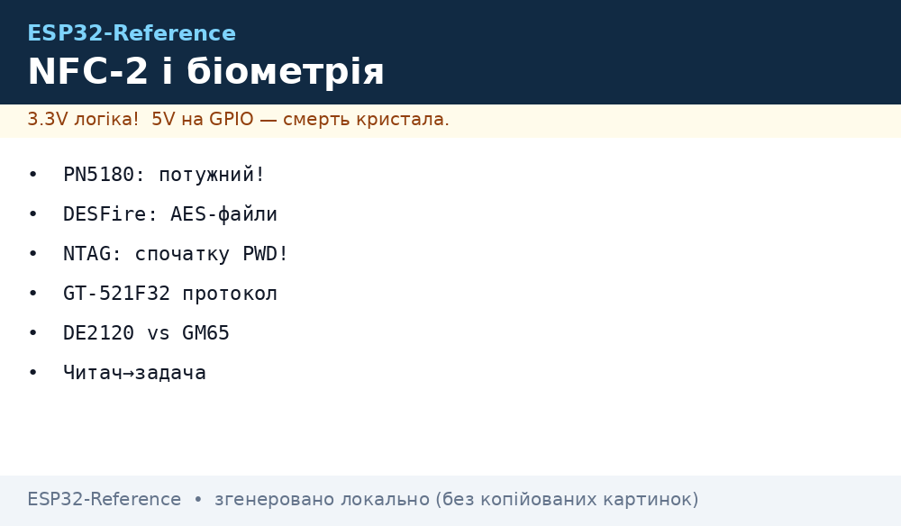
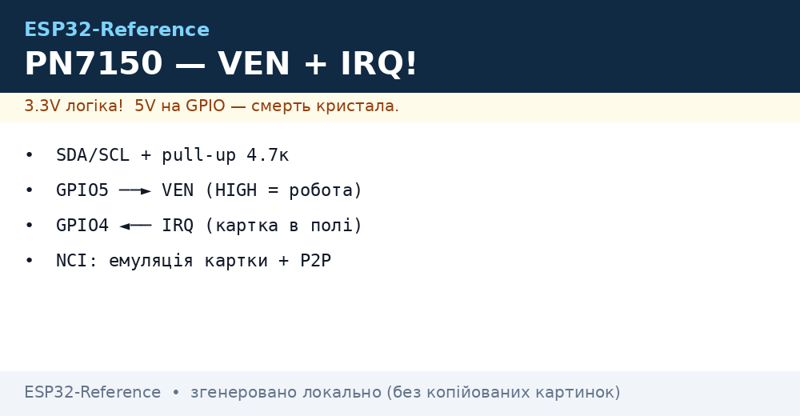
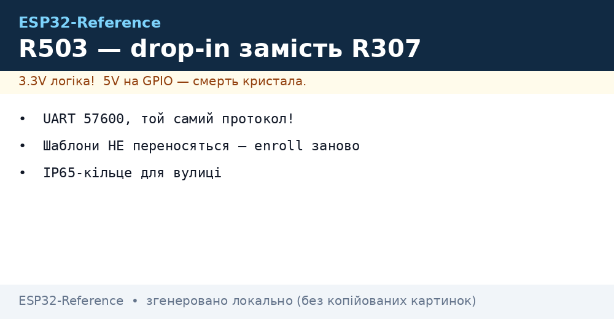
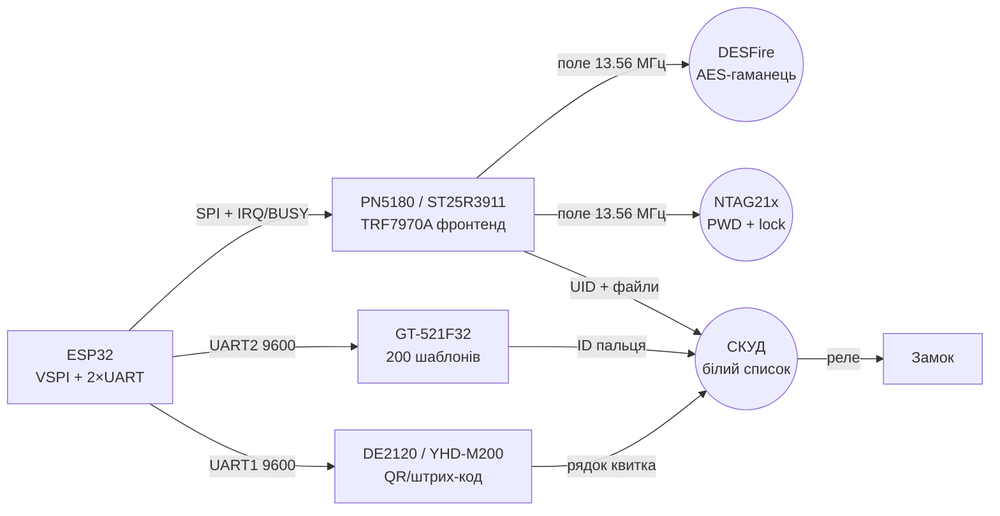

# NFC-Біометрія-2 - потужні фронтенди, DESFire, NTAG21x, відбитки і сканери

> [!info] Призначення
> Ця нотатка - друга частина NFC/біометрії (продовження [01-RC522-RFID](../../../ESP32-Reference/12-Moduli-zvyazku/01-RC522-RFID.md), [05-PN532-RDM6300-Fingerprint-GM65](../../../ESP32-Reference/12-Moduli-zvyazku/05-PN532-RDM6300-Fingerprint-GM65.md) і [15-RFID-Advanced](../../../ESP32-Reference/12-Moduli-zvyazku/15-RFID-Advanced.md)): потужні NFC-фронтенди **PN5180 / ST25R3911 / TRF7970A** з DPC і порівнянням з RC522, захищені картки **DESFire** (AES, файлова система, читання балансу), масові мітки **NTAG21x** (пароль, lock-біти), сканери відбитків **GT-521F32** і 2D-сканери **DE2120 / YHD-M200**, а також зведена таблиця «читач→задача».


*Рис. ESP32 з потужним NFC-фронтендом (SPI) читає DESFire/NTAG, сканер відбитків і 2D-сканер висять на UART - усі три дають «ID» для контролю доступу.*

Зв'язок з [Home](../../../ESP32-Reference/Home.md), [01-RC522-RFID](../../../ESP32-Reference/12-Moduli-zvyazku/01-RC522-RFID.md), [15-RFID-Advanced](../../../ESP32-Reference/12-Moduli-zvyazku/15-RFID-Advanced.md), [05-PN532-RDM6300-Fingerprint-GM65](../../../ESP32-Reference/12-Moduli-zvyazku/05-PN532-RDM6300-Fingerprint-GM65.md), [04-RS485-CAN-Ethernet-Kamera](../../../ESP32-Reference/12-Moduli-zvyazku/04-RS485-CAN-Ethernet-Kamera.md), [19-Wired-2](../../../ESP32-Reference/12-Moduli-zvyazku/19-Wired-2.md), [SPI](../../../ESP32-Reference/04-Shini/02-SPI.md), [UART](../../../ESP32-Reference/04-Shini/01-UART.md), [01-Lancjugi-zhivlennya](../../../ESP32-Reference/02-Zhivlennya/01-Lancjugi-zhivlennya.md).

Характеристики (порівняльна таблиця):

| Вузол | Тип | Інтерфейс до ESP32 | Живлення | Дальність / ємність | Коли брати |
| --- | --- | --- | --- | --- | --- |
| PN5180 | NFC-фронтенд, усі режими | SPI до 7 МГц + IRQ/BUSY | 3.3V, TX до 100+ мВт | до 10 см, EMVCo L1 | POS/турнікет, метал поруч, потрібна потужність |
| ST25R3911B | NFC-фронтенд, автонастрій антени | SPI + IRQ | 2.4-5.5V | до 8 см, низьке споживання | Батарейні зчитувачі, складна антена |
| TRF7970A | Мультипротокольний трансивер | SPI/Parallel + IRQ | 2.7-5.5V, I/O 1.8-5.5V | 106-848 кбіт, усі теги 1-5 | Універсальний R&D-зчитувач, card-emulation |
| RC522 (база) | MFRC522, тільки 14443A | SPI до 10 МГц | 3.3V | 3-5 см | Дешево і просто; див. [01-RC522-RFID](../../../ESP32-Reference/12-Moduli-zvyazku/01-RC522-RFID.md) |
| DESFire EV2/EV3 | Захищена смарт-картка | через фронтенд 13.56 МГц | пасивна (поле) | 2-8 КБ файлів, AES/DES/3DES | Гроші/доступ/транспорт - баланс у файлі |
| NTAG213/215/216 | NFC Type 2 мітка | через фронтенд 13.56 МГц | пасивна (поле) | 144/504/888 байт, пароль 32 біт | Візитки, Wi-Fi-pairing, пломби, плакати |
| GT-521F32 | Оптичний сканер відбитків | UART 9600 (3.3V TTL!) | 3.3-6V, <130 мА | 200 шаблонів у модулі | Двері/сейф без ПК, 1:N на модулі |
| DE2120 / YHD-M200 | 2D-сканер штрих/QR | UART 9600 / USB-HID | 5V (підсвітка ~200 мА) | 5-30 см | Квитки, склад, оплата по QR |

## Призначення

NFC-Біометрія-2 - потужні фронтенди, DESFire, NTAG21x, відбитки і сканери - Потужні NFC-фронтенди: PN5180 / ST25R3911 / TRF7970A; 1. Порівняння з RC522; 2. DPC - чому це головне слово нотатки. NFC-Біометрія-2 - потужні фронтенди, DESFire, NTAG21x, відбитки і сканери. Зв'язок з Home, 12-Moduli-zvyazku/01-RC522-RFID, 12-Moduli-zvyazku/15-RFID-Advanced, 12-Moduli-zvyazku/05-PN532-RDM6300-Fingerprint-GM65, 12-Moduli-zvyazku/04-RS485-CAN-Ethernet-Kamera, 12-Moduli-zvyazku/19-Wired-2, [SPI](../../../ESP32-Reference/04-Shini/02-SPI.md), [UART](../../../ESP32-Reference/04-Shini/01-UART.md), [01-Lancjugi-zhivlennya](../../../ESP32-Reference/02-Zhivlennya/01-Lancjugi-zhivlennya.md).

## 1. Потужні NFC-фронтенди: PN5180 / ST25R3911 / TRF7970A

RC522 (MFRC522) - це 14443A-only чіп 2000-х з фіксованою потужністю і чутливістю «як пощастить з антеною». Потужні фронтенди вирішують три болі: **дальність/стабільність у металі**, **усі протоколи** (B, FeliCa, V/15693), **автопідстроювання** (DPC/AWC/калібрування антени).

### 1.1. Порівняння з RC522

| Критерій | RC522 (MFRC522) | PN5180 (NXP) | ST25R3911B (ST) | TRF7970A (TI) |
| --- | --- | --- | --- | --- |
| Протоколи | 14443A | A/B, FeliCa, 15693, 18000-3m3, NFC-IP | A/B, F, V, NFC-IP | A/B, 15693, 18000-3, FeliCa |
| Потужність TX | фікс., слабка | програмована + **DPC** | програмована + автонастрій | +20/+23 dBm програмована |
| DPC/AWC | немає | **DPC** (динаміка потужності) + AWC (форма хвилі) | автоматичне налаштування антени | RSSI + подвійний приймач |
| Швидкість | до 848 кбіт (A) | до 848 кбіт | до 848 кбіт | 106-848 кбіт |
| Host I/F | SPI/I2C/UART | SPI до 7 МГц + IRQ + BUSY | SPI + IRQ | SPI/Parallel + IRQ, FIFO 127 Б |
| Живлення | 3.3V | 3.3V | 2.4-5.5V | 2.7-5.5V, I/O 1.8-5.5V |
| Ціна складності | $1, бібліотека всюди | €€, NFC Reader Library | €, ST Cockpit/бібліотека | €, докладні appnote TI |
| Коли | іграшки, прототип | POS, EMVCo L1, метал | батарейні, складна антена | R&D, емуляція картки, усі теги |

### 1.2. DPC - чому це головне слово нотатки

**DPC (Dynamic Power Control)** у PN5180: прошивка фронтенда в реальному часі міряє розстройку антени (картка в полі / метал поруч змінює імпеданс) і підкручує вихідну потужність і форму хвилі (AWC), щоб поле лишалося в допусках EMVCo. Без DPC: картка на металевому турнікеті «то читається, то ні». З DPC: стабільні транзакції на детюнованій антені. Для ESP32 це означає: важку RF-роботу робить сам PN5180, хост лише шле команди по SPI - ніякого real-time з нашого боку.

ST25R3911B б'є в інший бік: **автоматичне калібрування антени** (ємнісні ЦАПи підстроювання), вимірювання амплітуди/фази, ultra-low-power режим виявлення картки ( negligibly малий струм у сні - ідеально для батарейного зчитувача, що прокидається від картки).

TRF7970A - найуніверсальніший для розробки: прямі режими (raw subcarrier), вбудовані кодеки всіх протоколів, RSSI з двох приймачів (немає «мертвих зон»), напруга I/O 1.8-5.5V (дружить з будь-яким ESP32 без перетворювачів рівнів), докладні апноути TI включно з DESFire-AES прикладом.

### 1.3. Підключення фронтенда до ESP32 (SPI)

Усі три - SPI-slave + IRQ (DIO). Мапінг на VSPI classic: SCK=GPIO18, MISO=GPIO19, MOSI=GPIO23, NSS=GPIO5, IRQ=GPIO21, RST=GPIO22. PN5180 додатково має **BUSY**-лінію (модуль зайнятий - не слати SPI!). Живлення фронтендів - окрема гілка 3.3V з феритом + 10 мкФ + 100 нФ біля чипа: TX-кидки струму садять спільну шину і дають «фантомні» помилки SPI.

> [!warning] Антена - це половина пристрою
> Фронтенд без узгодженої 13.56 МГц антени = дорогий RC522. Дотримуйтесь гайдів виробника (PN5180 Antenna Design Guide, TRF79xxA Antenna Guide): цільовий імпеданс, Q-фактор, відстань до металу ≥5 мм або феритовий екран. Перевірка - VNA або мінімум вимірювання дальності з референсною карткою.

### PN7150 / PN7120 - NCI-контролери для Linux-подібних хостів

| Параметр | PN7150 / PN7120 |
| --- | --- |
| Протоколи | Reader/Writer + P2P + емуляція картки (NCI-стек) |
| Інтерфейс | I2C + IRQ + VEN (живлення-контроль) |
| Живлення | 3.3 В (OM5578-плата з антеною з коробки) |
| Коли брати | Потрібна емуляція картки / P2P з телефоном - те, чого RC522/PN532 не вміють зручно |

```text
ESP32 GPIO21 (SDA) ──► SDA PN7150 (pull-up 4.7к)
ESP32 GPIO22 (SCL) ──► SCL (pull-up 4.7к)
ESP32 GPIO5 ──► VEN (HIGH = робота, LOW = power-down)
ESP32 GPIO4 ◄── IRQ (картка в полі!)
```

> PN7150 vs PN532: PN532 дешевший для UID/NDEF-читання; PN7150 - коли треба емуляція картки або стабільний NCI-драйвер (Linux-приклад `nfcpy` портується майже 1-в-1).


*Рис. PN7150: I2C з pull-up, VEN для вмикання, IRQ для детекту картки.*

## 2. DESFire - AES, файли, читання балансу

**Mifare DESFire** (EV2/EV3) - це вже не «блоки пам'яті», а **файлова ОС на картці**: Applications (AID 3 байти) → Files (File ID) → ключі AES-128/DES/3DES на кожному рівні (Master Key картки, Master Key аплікації, ключі читання/запису файла). Без автентифікації ключем дані не віддасть - клонування без ключа неможливе (на відміну від Classic/Ultralight без пароля).

### 2.1. Типи файлів

| Тип | ID | Призначення | Приклад балансу |
| --- | --- | --- | --- |
| Standard Data File | 0x00 | Довільні байти R/W | JSON-профіль, квиток |
| Backup Data File | 0x01 | Як standard + транзакційність | Критичні записи |
| **Value File** | 0x02 | **Лічильник грошей**: Credit / Debit / LimitedCredit, GetValue | **Баланс гаманця** |
| Linear Record File | 0x03 | Фіксований лог по колу | Історія поїздок (останні N) |
| Cyclic Record File | 0x04 | Кільцевий лог | Журнал проходів СКУД |

### 2.2. Сесія читання балансу (схема кроків)

```text
1. REQA/WUPA + Anticollision + Select        -> UID (ISO14443-3)
2. RATS / PPS                                -> ATS, вибір швидкості (ISO14443-4)
3. SelectApplication(AID гаманця, напр. 0x112233)
4. AuthenticateAES(KeyNo=1, Key=диверсифікований ключ читання)
     картка <-> хост: challenge-response AES-128 -> Session Key
5. ReadData / GetValue(FileNo=0x01)
     відповідь ЗАШИФРОВАНА сесійним ключем (CommMode ENC)
6. Розшифрувати -> баланс (молодший байт першим, напр. 0x000004D2 = 1234 коп.)
```

> [!warning] Ключі не живуть в ESP32 у відкритому вигляді
> Master-ключі емітента - тільки в SAM-модулі / захищеному сховищі. В ESP32 - лише **диверсифіковані** ключі (K = AES_MK(UID)), унікальні на картку: компрометація одного пристрою не кладе всю систему. Для продакшн - див. [03-Access-Control](../../../ESP32-Reference/16-Proekti/03-Access-Control.md).

### 2.3. DESFire vs NTAG vs Classic - коли що

| Критерій | Classic 1K | NTAG21x | DESFire EV3 |
| --- | --- | --- | --- |
| Крипто | Crypto-1 (зламаний) | пароль 32 біт / без | AES-128, сесійні ключі |
| Клонування | тривіальне (magic-картка) | тривіальне (без PWD) / складне (з PWD+lock) | неможливе без ключа |
| Пам'ять юзера | 752 Б | 144/504/888 Б | 2-8 КБ файлів |
| Ціна | $ | $ | $$$$ |
| Застосування | legacy, іграшки | візитки, pairing, пломби | гроші, транспорт, СКУД |

### DESFire EV3 - що нового проти EV2

| Параметр | EV2 | EV3 |
| --- | --- | --- |
| Transaction MAC | Є | Розширений (truncate + counter) |
| Швидкість | До 848 кбіт | Той же RF, швидший старт сесії (оптимізований select) |
| SUN (унікальний NUID) | Ні | Так - захист від трекінгу/клонування по UID |
| Сумісність з ESP32 | Той же APDU-потік через фронтенд | Той же код, інша персоналізація ключів |

> На практиці з ESP32 різниці EV2/EV3 не видно (усе вирішує бекенд і ключі); EV3 беруть для нових систем через SUN і кращий транзакційний MAC.

## 3. NTAG21x - пароль і lock (щоб не клонували на принтері)

NTAG213/215/216 - NFC Forum Type 2, пам'ять сторінками по 4 байти: 213 = 45 стор. (144 Б юзера), 215 = 135 стор. (504 Б), 216 = 231 стор. (888 Б). Заводськи - ВІДКРИТІ: будь-хто з телефоном читає і перезаписує. Захист два рівні:

1. **Static/dynamic lock-біти** (стор. 2, байти 2-3 + стор. 130+/132+): біти lock - **OTP** (назад дороги немає!). Static lock закриває перші 16 сторінок, dynamic - решту блоками. Типовий сценарій: записали NDEF → виставили lock → сторінки назавжди read-only.
2. **Пароль 32 біт** (PWD = стор. 133/227/231 + PACK-відповідь): `PWD_AUTH (0x1B + 4 байти PWD)` → картка повертає PACK (2 байти, перевірка). `AUTH0` задає першу захищену сторінку, `PROT` = захист від читання чи тільки від запису, `AUTHLIM` = ліміт спроб (0-7, далі - блок до power-off).

> [!warning] Порядок дій: спочатку PWD, потім lock
> Виставили lock до встановлення пароля - сторінки PWD/AUTH0 самі можуть виявитися заблокованими від запису, і пароль уже не змінити (лишиться заводський `FF FF FF FF` - публічний!). Перевірочний ритуал: записати NDEF → встановити PWD+PACK → встановити AUTH0 → перевірити PWD_AUTH з телефона → і лише потім палити lock-біти.

Карта пам'яті NTAG213 (приклад):

| Сторінки | Вміст | Lock |
| --- | --- | --- |
| 0 | UID0-UID2 + BCC0 | OTP, завод |
| 1 | UID3-UID6 + BCC1 | OTP, завод |
| 2 | BCC внутрішній + lock0/lock1 (static) | lock-біти тут! |
| 3 | Контейнер можливостей (Capability Container) | статичне блокування (lock) |
| 4-39 | Користувач / NDEF (144 Б) | static lock бітами |
| 40-41 | Dynamic lock + RFU | dynamic lock тут |
| 42-43 | MOD, AUTH0/ACCESS | конфігурація захисту |
| 44 | PWD (4 байти) | ніколи не читається |
| 45 | PACK (2 байти) + RFU | відповідь автентифікації |

## 4. GT-521F32 - сканер відбитків (друге покоління)

GT-521F32 (ADH-Tech, модуль SparkFun SEN-14518): оптичний сенсор 450 dpi + ARM Cortex-M3 з алгоритмами всередині. ESP32 лише каже «enroll #7» / «identify» по UART і отримує ID. **200 шаблонів**, 360°-розпізнавання, час ідентифікації <1.5 с.

| Параметр | Значення |
| --- | --- |
| Сенсор | оптичний, вікно 12.5×14 мм, 258×202 px |
| Логіка UART | **3.3V TTL** (живлення 3.3-6V, але RX тільки 3.3V!) |
| Baud | 9600 за замовчуванням (до 115200) |
| Протокол | пакет 12 байт: `55 AA DEV_ID PARAM CMD CHECKSUM` |
| Touch-вихід | ICPCK = 3.3V коли палець на рамці (пробудження ESP32!) |
| Ємність | 200 ID (у GT-521F52 - 3000, той же протокол) |

> [!warning] 5V-Arduino минулого - не повторювати
> Живлення 5V допустиме, але TX 5V-контролера в RX сканера = деградація входу. ESP32 з 3.3V - ідеальний партнер безпосередньо: TX ESP32 → RX сканера, RX ESP32 ← TX сканера, спільний GND. Дільник/перетворювач рівнів потрібен лише для 5V плат.

Головні команди протоколу (ID пристрою типово `0x0001`):

| Команда | Код | Параметр | Відповідь |
| --- | --- | --- | --- |
| Open | 0x01 | 0/1 (extra info) | ACK + версія прошивки |
| CmosLed | 0x12 | 1/0 | підсвітка вкл/викл |
| EnrollStart | 0x22 | ID (0-199) | почати набір (3 прикладання) |
| Enroll1/2/3 | 0x23/0x24/0x25 | - | захват 1/2/3 відбитка |
| IsPressFinger | 0x26 | - | 0/1 - палець на склі |
| Identify | 0x51 | - | ID або NOT_FOUND |
| DeleteID / DeleteAll | 0x40/0x41 | ID / - | видалення шаблонів |
| GetEnrollCount | 0x20 | - | кількість зайнятих ID |

### R503 / FPC1020 - ємнісні сканери нового покоління

| Параметр | R503 (круглий, вологозахищений) | FPC1020 (Fingerprint Cards) |
| --- | --- | --- |
| Принцип | Ємнісний, скло/метал-кільце | Ємнісний 3D (об'ємний образ) |
| Інтерфейс | UART 57600 (сумісний протокол з R307!) | SPI |
| Шаблони | ~200 у модулі | Залежить від хоста/бібліотеки |
| Коли брати | Вуличний термінал (IP65-кільце) замість R307 | Вища точність, інтеграція по SPI без UART |

> R503 - drop-in заміна R307 (той же UART-протокол, той же код ESP32); міняється лише корпус і чутливість. FPC1020 - інший стек (SPI-драйвер з прикладами вендора).


*Рис. R503: UART як у R307, шаблони не переносяться - enroll заново.*

## 5. DE2120 / YHD-M200 - 2D-сканери (друге покоління після GM65)

GM65 (див. [05-PN532-RDM6300-Fingerprint-GM65](../../../ESP32-Reference/12-Moduli-zvyazku/05-PN532-RDM6300-Fingerprint-GM65.md)) - база; **DE2120** (DFRobot, CMOS 640×480) і **YHD-M200** (Yinhan, engine M200) - наступний клас: швидше декодування пошкоджених/екранних QR, ширший кут, режим тригера + автосенс + командний. Обидва говорять UART 9600 8N1 (є USB-HID версії прошивок) і шлють декодований рядок + `\r\n`.

| Критерій | GM65 | DE2120 | YHD-M200 |
| --- | --- | --- | --- |
| Сенсор | CMOS 640×480 | CMOS 640×480, краща оптика | engine M200, screen-friendly |
| 1D/2D | EAN/Code128 + QR/DataMatrix | усе + PDF417/Aztec | усе + пошкоджені коди |
| Інтерфейс | UART/USB-HID | UART/USB-HID, налаштування штрих-командами | UART/USB-HID/TTL |
| Живлення | 5V, ~200 мА пік | 5V (3.3V логіка TTL!) | 5V, пік підсвітки |
| Режим | тригер/авто | тригер / автосенс / командний | тригер / авто / безперервний |
| Коли | дешево, етикетки | екрани телефонів, каса | склад, квитки, валідація |

Налаштування - «конфігураційними штрих-кодами» з мануала (мова/суфікс/baud/режим) або AT-командами по UART. Практика: перевести в UART 9600, суфікс `\r`, автосенс 2 с, вимкнути зайві сімейства кодів (швидше декодування).

## 6. Таблиця «читач→задача»

| Задача | Читач | Чому він | Альтернатива |
| --- | --- | --- | --- |
| Двері офісу, 50 людей, офлайн | GT-521F32 | 1:N на модулі, 200 ID, touch-wake | R307/AS608 (див. ноту 05) |
| Турнікет у металі, транспортна картка | PN5180 + DESFire | DPC тримає поле, AES-гаманець | TRF7970A, якщо треба емуляція |
| Батарейний замок Airbnb | ST25R3911B + NTAG (PWD) | wake від картки, мкА у сні | PN532 (жерливіший) |
| R&D-стенд «читати все» | TRF7970A | усі теги 1-5, raw-режими, RSSI | PN5180 + логіка хоста |
| Візитка/плакат/паринг Wi-Fi | NTAG213 + телефон | дешево, NDEF з коробки | NTAG215 (більше пам'яті) |
| Каса: оплата по QR з екрана | DE2120 | screen-friendly декодування | YHD-M200 |
| Склад: маркування + пломба | YHD-M200 + NTAG (lock) | швидкий скан + незмінна мітка | GM65 + Ultralight |
| Іграшка/гурток, 10 карток | RC522 + Classic | $1, приклади всюди | PN532 (якщо треба NDEF-запис) |
| Платіжний термінал | PN5180 | EMVCo L1, DPC/AWC | - (безальтернативний клас) |

## Легенда пінів модулів

### PN5180 (модуль/шилд, SPI)

| Пін | Позначення | Тип | Куди на ESP32 | Примітка |
| --- | --- | --- | --- | --- |
| 1 | VCC 3.3V | Живлення | 3V3 (окрема гілка + ферит) | TX-кидки струму! 10 мкФ + 100 нФ біля модуля |
| 2 | GND | Земля | GND | Короткий провід, зірка земель |
| 3 | SCK | Вхід SPI | GPIO18 | До 7 МГц |
| 4 | MISO | Вихід SPI | GPIO19 | - |
| 5 | MOSI | Вхід SPI | GPIO23 | - |
| 6 | NSS | Вхід CS | GPIO5 | Активний LOW |
| 7 | IRQ | Вихід | GPIO21 | Переривання «картка/подія» |
| 8 | BUSY | Вихід | GPIO22 | HIGH = модуль зайнятий, SPI мовчить! |
| 9 | RST | Вхід, active low | GPIO15 або −1 | Імпульс LOW при старті |

### TRF7970A (модуль DLP-7970ABP-стиль, SPI)

| Пін | Позначення | Тип | Куди на ESP32 | Примітка |
| --- | --- | --- | --- | --- |
| 1 | VIN 2.7-5.5V | Живлення | 3V3 або 5V | Внутрішній LDO живить логіку |
| 2 | GND | Земля | GND | Спільна земля |
| 3 | SCK | Вхід SPI | GPIO18 | - |
| 4 | MOSI | Вхід SPI | GPIO23 | Паралельний режим не використовуємо |
| 5 | MISO | Вихід SPI | GPIO19 | - |
| 6 | CS | Вхід CS | GPIO5 | Активний LOW |
| 7 | IRQ | Вихід | GPIO21 | FIFO threshold / кінець RX |
| 8 | EN | Вхід | GPIO22 або 3V3 | HIGH = робота; LOW = power-down <1 мкА |

### GT-521F32 (JST-SH 4-pin, UART)

| Пін | Позначення | Тип | Куди на ESP32 | Примітка |
| --- | --- | --- | --- | --- |
| 1 | TX | Вихід 3.3V TTL | GPIO16 (RX2) | TX сканера → RX ESP32 |
| 2 | RX | Вхід 3.3V TTL | GPIO17 (TX2) | Тільки 3.3V! 5V TX вбиває вхід |
| 3 | GND | Земля | GND | Спільна земля |
| 4 | Vin 3.3-6V | Живлення | 5V або 3V3 | Пік 130 мА при скануванні |
| 5 | ICPCK (touch) | Вихід 3.3V | GPIO34 (вхід пробудження) | HIGH = палець на рамці |

### DE2120 / YHD-M200 (UART-режим)

| Пін | Позначення | Тип | Куди на ESP32 | Примітка |
| --- | --- | --- | --- | --- |
| 1 | VCC 5V | Живлення | 5V (окремий провід) | Пік підсвітки ~200 мА |
| 2 | GND | Земля | GND | Спільна земля |
| 3 | TX | Вихід TTL | GPIO16 (RX2) | Рядок коду + `\r\n`; рівні звірити з мануалом! |
| 4 | RX | Вхід TTL | GPIO17 (TX2) | Команди налаштування |
| 5 | TRIG | Вхід | GPIO4 або кнопка | LOW-імпульс = сканувати (режим тригера) |
| 6 | BEEP/LED | Вихід | не обов'язково | Сигнал успішного декодування |

## Схема

Загальний стенд: один ESP32 обслуговує NFC-фронтенд по SPI, сканер відбитків і 2D-сканер по двох UART - три незалежні канали «ID» для СКУД.

### ASCII-схема

```text
ESP32 DevKit                  Модулі NFC/біометрії
─────────────                 ────────────────────
VSPI:                         PN5180 / ST25R3911 / TRF7970A
  GPIO18 SCK ──────────────►  SCK
  GPIO23 MOSI ─────────────►  MOSI
  GPIO19 MISO ◄────────────── MISO
  GPIO5 NSS ───────────────►  NSS/CS
  GPIO21 ◄──────────────────  IRQ (картка в полі!)
  GPIO22 ──────────────────►  BUSY/RST/EN
  3V3 (+ферит, 10мкФ+100нФ) ►  VCC (окрема гілка живлення!)
  GND ──────────────────────  GND
                              [антена 13.56 МГц, зазор до металу 5мм+]
                              DESFire / NTAG21x картки в полі

UART2 (біометрія):            GT-521F32 (JST-SH)
  GPIO17 TX2 ──────────────►  RX (3.3V TTL тільки!)
  GPIO16 RX2 ◄──────────────  TX
  GPIO34 ◄──────────────────  ICPCK touch (wake!)
  5V/3V3 ──────────────────►  Vin
  GND ──────────────────────  GND

UART1 (сканер):               DE2120 / YHD-M200
  GPIO26 TX1 ──────────────►  RX
  GPIO25 RX1 ◄──────────────  TX (рядок коду + CRLF)
  GPIO4 ───────────────────►  TRIG (імпульс сканування)
  5V ──────────────────────►  VCC (пік 200 мА!)
  GND ──────────────────────  GND
```

### Mermaid (graph LR)



## Код

### ESP-IDF - PN5180: читання UID ( ESP-IDF + NFC Reader Library )

```c
// ESP-IDF + NXP NFC Reader Library (PN5180 по VSPI).
// Спрощений контур: init -> RF on -> inventory 14443A -> UID.
#include "driver/spi_master.h"
#include "driver/gpio.h"

#define PN5180_NSS  5
#define PN5180_IRQ  21
#define PN5180_BUSY 22
#define PN5180_RST  15

static spi_device_handle_t pn5180_spi;

void pn5180_hw_init(void)
{
    spi_bus_config_t bus = {
        .miso_io_num = 19, .mosi_io_num = 23, .sclk_io_num = 18,
        .quadwp_io_num = -1, .quadhd_io_num = -1,
    };
    spi_bus_initialize(SPI2_HOST, &bus, SPI_DMA_DISABLED);
    spi_device_interface_config_t dev = {
        .clock_speed_hz = 5 * 1000 * 1000,   // запас: 5 МГц
        .mode = 0, .spics_io_num = PN5180_NSS, .queue_size = 4,
    };
    spi_bus_add_device(SPI2_HOST, &dev, &pn5180_spi);
    gpio_set_direction(PN5180_RST, GPIO_MODE_OUTPUT);
    gpio_set_level(PN5180_RST, 0);           // reset-імпульс
    esp_rom_delay_us(50);
    gpio_set_level(PN5180_RST, 1);
    // Далі: NXP NFC Reader Library: phhalHw_Pn5180_Init(),
    // phacDiscLoop_Run() для дискавері A/B/F/V, UID у коміті дискавері.
}
```

### ESP-IDF - TRF7970A: прямий запис регістра по SPI

```c
// ESP-IDF: мінімальний доступ до TRF7970A (адреси регістрів з datasheet TI).
// Читання RSSI і вмикання RF — без зовнішніх бібліотек.
#include "driver/spi_master.h"

#define TRF_CS 5
static spi_device_handle_t trf;

static uint8_t trf_reg_read(uint8_t addr)
{
    uint8_t tx[2] = { (uint8_t)(0x40 | (addr & 0x1F)), 0x00 }; // continuous-read
    uint8_t rx[2] = {0};
    spi_transaction_t t = { .length = 16, .tx_buffer = tx, .rx_buffer = rx };
    spi_device_transmit(trf, &t);
    return rx[1];
}

static void trf_reg_write(uint8_t addr, uint8_t val)
{
    uint8_t tx[2] = { (uint8_t)(addr & 0x1F), val };
    spi_transaction_t t = { .length = 16, .tx_buffer = tx };
    spi_device_transmit(trf, &t);
}

void trf_rf_on_14443a(void)
{
    trf_reg_write(0x00, 0x21);   // CHIP_STATUS: RF on, 5V, full power
    trf_reg_write(0x01, 0x08);   // ISO14443A, 106 кбіт, без RX CRC на старті
    // Далі: SEND REQA (0x26) через FIFO 0x1F, IRQ на GPIO21 сигналізує ATQA.
}
```

### Arduino - GT-521F32: enroll + identify (SoftwareSerial/HardwareSerial)

```cpp
// Arduino (ESP32): GT-521F32 по UART2 9600. Open -> LED on -> Identify.
// Пакет: 55 AA | DEV(2) | PARAM(4 LE) | CMD(2 LE) | SUM(2 LE).
#include <HardwareSerial.h>
HardwareSerial fps(2);  // RX=16 TX=17

static uint16_t fps_sum(const uint8_t *b, int n) {
  uint16_t s = 0;
  for (int i = 0; i < n; i++) s += b[i];
  return s;
}

void fps_cmd(uint16_t cmd, uint32_t param) {
  uint8_t p[12] = {0x55, 0xAA, 0x01, 0x00,
                   (uint8_t)param, (uint8_t)(param >> 8),
                   (uint8_t)(param >> 16), (uint8_t)(param >> 24),
                   (uint8_t)cmd, (uint8_t)(cmd >> 8), 0, 0};
  uint16_t s = fps_sum(p, 10);
  p[10] = s & 0xFF; p[11] = s >> 8;
  fps.write(p, 12);
}

bool fps_wait_ack(uint8_t *resp, int timeout = 1000) {
  unsigned long t0 = millis();
  int n = 0;
  while (millis() - t0 < (unsigned long)timeout) {
    while (fps.available() && n < 12) resp[n++] = fps.read();
    if (n >= 12) return resp[0] == 0x55 && resp[1] == 0xAA && resp[8] == 0x30;
  }
  return false;
}

void setup() {
  Serial.begin(115200);
  fps.begin(9600, SERIAL_8N1, 16, 17);
  uint8_t r[12];
  fps_cmd(0x01, 0); fps_wait_ack(r);   // Open
  fps_cmd(0x12, 1); fps_wait_ack(r);   // CmosLed on
  fps_cmd(0x51, 0);                    // Identify 1:N
  if (fps_wait_ack(r, 5000)) {
    int id = r[4] | (r[5] << 8) | (r[6] << 16) | (r[7] << 24);
    Serial.printf("Verified ID:%d\n", id);
  } else Serial.println("Finger not found");
}

void loop() {}
```

### Arduino - NTAG21x: PWD_AUTH + читання через RC522-сумісний фронтенд

```cpp
// Arduino: NTAG21x PWD_AUTH (0x1B + PWD[4]) і читання сторінок READ (0x30).
// Транспорт — будь-який фронтенд з ISO14443A; тут псевдокод поверх MFRC522 API.
#include <MFRC522.h>  // як транспорт; для PN5180 — відповідна бібліотека
MFRC522 mf(5, 22);

bool ntag_pwd_auth(const uint8_t pwd[4], uint8_t pack[2]) {
  uint8_t cmd[6] = {0x1B, pwd[0], pwd[1], pwd[2], pwd[3], 0};
  uint8_t resp[4]; uint8_t len = sizeof(resp);
  // MIFARE_UnbrickAck / PCD_Transceive з CRC:
  MFRC522::StatusCode st = mf.PCD_TransceiveData(cmd, 5, resp, &len, NULL, 0, false);
  if (st != MFRC522::STATUS_OK || len < 2) return false;
  pack[0] = resp[0]; pack[1] = resp[1];   // PACK: звірити з очікуваним!
  return true;
}

bool ntag_read_page(uint8_t page, uint8_t out[16]) {
  uint8_t cmd[2] = {0x30, page};          // READ: повертає 4 сторінки = 16 Б
  uint8_t len = 18;
  return mf.PCD_TransceiveData(cmd, 2, out, &len, NULL, 0, true)
         == MFRC522::STATUS_OK;
}
```

### MicroPython - GT-521F32 identify + DE2120 читання

```python
"""MicroPython (ESP32): відбиток на UART2 + 2D-сканер на UART1."""
from machine import UART, Pin
import struct, time

fps = UART(2, baudrate=9600, rx=16, tx=17)
scan = UART(1, baudrate=9600, rx=25, tx=26)
trig = Pin(4, Pin.OUT, value=1)

def fps_packet(cmd, param=0):
    dev = struct.pack("<H", 1)
    body = struct.pack("<I", param) + struct.pack("<H", cmd)
    raw = b"\x55\xAA" + dev + body
    return raw + struct.pack("<H", sum(raw) & 0xFFFF)

def fps_identify(timeout=5):
    fps.write(fps_packet(0x01))          # Open
    time.sleep_ms(100)
    fps.write(fps_packet(0x12, 1))       # LED on
    fps.write(fps_packet(0x51))          # Identify
    t0 = time.ticks_ms()
    buf = b""
    while time.ticks_diff(time.ticks_ms(), t0) < timeout * 1000:
        if fps.any():
            buf += fps.read()
            if len(buf) >= 12 and buf[0] == 0x55 and buf[1] == 0xAA:
                ok = buf[8] == 0x30
                fid = struct.unpack("<i", buf[4:8])[0]
                fps.write(fps_packet(0x12, 0))  # LED off
                return (True, fid) if ok else (False, -1)
    return (False, -1)

def scan_once(timeout=3):
    trig.value(0); time.sleep_ms(100); trig.value(1)  # імпульс TRIG
    t0 = time.ticks_ms()
    buf = b""
    while time.ticks_diff(time.ticks_ms(), t0) < timeout * 1000:
        if scan.any():
            buf += scan.read()
            if b"\r" in buf:
                return buf.decode().strip()
    return None

    # ok, fid = fps_identify()
    # code = scan_once()
```

### MicroPython - NTAG NDEF-читання (через PN532/bus-драйвер)

```python
"""MicroPython: читання NDEF з NTAG через сумісний драйвер (псевдо-API).
READ сторінки 4..39, пошук TLV 0x03 (NDEF), довжина, URI-запис."""
def read_ntag_pages(ntag, start=4, end=39):
    raw = b""
    for page in range(start, end + 1, 4):
        raw += ntag.read_page(page)   # 16 Б: 4 сторінки
    return raw

def ndef_uri(raw):
    i = raw.find(b"\x03")             # NDEF TLV
    if i < 0:
        return None
    ln = raw[i + 1]
    rec = raw[i + 2:i + 2 + ln]
    if rec and rec[0] == 0xD1 and len(rec) > 4:
        plen = rec[3]
        payload = rec[4:4 + rec[2]]
        prefix = {0x01: "http://www.", 0x03: "http://",
                  0x04: "https://"}[plen] if plen in (1, 3, 4) else ""
        return prefix + payload[1:].decode()
    return None
```

### ACR122U / ACR1252U: NFC-зчитувач з боку хоста

| Параметр | PN532 на ESP32 | ACR122U на хості (ПК/RPi) |
| --- | --- | --- |
| Де працює | Прошивка ESP32 | Драйвер PC/SC на хості |
| Бібліотеки | Adafruit-PN532 / esp-nfc | pyscard, libnfc, nfcpy |
| Живлення/USB | 3.3V, I2C/SPI/UART | USB, 5V |
| Коли | Автономний турнікет/замок | Кіоск/реєстратура з екраном і базою |

```text
Архітектура з хостом: ACR122U → RPi (nfcpy читає UID/DESFire) → MQTT → ESP32-виконавець (замок).
Плюс: вся криптографія і база на RPi (зручно оновлювати). Мінус: без RPi замок сліпий —
для аварійного відкриття тримати локальний allow-list у NVS ESP32 (див. 16-03!).
```

## Типові помилки

| # | Симптом | Причина | Ліки |
| --- | --- | --- | --- |
| 1 | PN5180 не відповідає по SPI (MISO мовчить) | BUSY HIGH - шлють під час внутрішньої калібровки | Чекати BUSY=LOW перед кожною транзакцією; NSS тримати HIGH у простої |
| 2 | Картка читається через раз на металі | Антена розстроєна, DPC не увімкнено/не налаштовано | Увімкнути DPC + AWC, феритовий екран, зазор до металу 5+ мм |
| 3 | ST25R3911B бачить «фантоми» без картки | Зависокий поріг чутливості / шуми живлення | Автокалібрування антени, ферит + конденсатори, знизити gain |
| 4 | TRF7970A: IRQ є, дані сміття | Невірна швидкість/кодування для тега | Звірити ISO Control (0x01): 14443A≠15693; перевірити FIFO-length |
| 5 | DESFire: auth 0xAE (authentication error) | Невірний KeyNo або недиверсифікований ключ | KeyNo/AID з персоналізації; K = AES_MK(UID), порядок байт UID прямий |
| 6 | DESFire GetValue повертає шифротекст | Забули розшифрувати сесійним ключем (ENC) | CMAC/ENC за спектром: IV=0, SessionKey з auth; молодший байт першим |
| 7 | Баланс «1234» читається як «-771» | Знакове 32-біт з неправильним endianness | `struct.unpack('<i')` - little-endian, знаковий |
| 8 | NTAG: PWD_AUTH завжди FAIL | Заводський пароль уже змінено або AUTH0=0xFF | Спробувати `FF FF FF FF`; перевірити, чи не заблоковано lock-бітами |
| 9 | NTAG: пароль не встановлюється | Сторінка PWD уже закрита static/dynamic lock | Порядок: PWD → AUTH0 → перевірка → і лише потім lock! |
| 10 | NDEF не читається телефоном | Битий Capability Container або TLV | CC стор. 3 = `E1 10 12 00` (213); TLV `03 LL ... FE` (terminator!) |
| 11 | GT-521F32 мовчить на команди | Переплутані TX/RX або baud не 9600 | TX ESP32→RX сканера; почати з 9600; перевірити checksum LE |
| 12 | Identify завжди NOT_FOUND після enroll | Палець прикладають інакше (кут/тиск) | Enroll 3 рази в одному положенні; сухий палець - зволожити |
| 13 | Сканер гріється / деградує RX | 5V TX контролера в 3.3V RX сканера | ESP32 3.3V безпосередньо; для 5V плат - дільник 10к/20к або перетворювач рівнів |
| 14 | DE2120 шле ієрогліфи | Мова розкладки USB-HID або baud | Перевести в UART-режим конфіг-кодом; 9600 8N1; суфікс `\r` |
| 15 | Сканер читає екран, але не папір (або навпаки) | Режим підсвітки/експозиції під інший носій | Конфіг-код «screen mode» / «paper mode»; автосенс 1-2 с |
| 16 | PN7150 мовчить після VEN | VEN у LOW або IRQ не підключено | VEN HIGH + 100 мс пауза; IRQ на GPIO з перериванням, не опитуванням |
| 17 | EV3 відхиляє старі APDU EV1 | Інший метод автентифікації/ключі | Персоналізувати під EV3 (SUN увімкнено); EV1-команди не переносити сліпо |
| 18 | R503 не впізнає після заміни R307 | Той же протокол, інша чутливість | Переробити enroll (шаблони не переносяться між моделями!) |

## Офіційні джерела

> Усі посилання нижче перевірені завантаженням (webfetch, 2026-09-29). Вгаданих URL немає.

- PN5180 - високопродуктивний NFC-фронтенд з DPC/AWC (NXP) - <https://www.nxp.com/products/rfid-nfc/nfc-hf/nfc-readers/pn5180-high-performance-multi-protocol-full-nfc-forum-compliant-frontend:PN5180>
- TRF7970A - мультипротокольний NFC/RFID-трансивер 13.56 МГц (TI) - <https://www.ti.com/product/TRF7970A>
- NTAG213/215/216 - NFC Forum Type 2, пароль, lock (NXP) - <https://www.nxp.com/products/rfid-nfc/nfc-hf/ntag-for-tags-labels/ntag-213-215-216-nfc-forum-type-2-tag-compliant-ic-with-ic-bus-capability:NTAG213_215_216>
- MIFARE-портфель включно з DESFire (NXP, огляд) - <https://www.nxp.com/products/rfid-nfc/mifare-hf>
- Оптичний сканер відбитків - гайд і бібліотека (Adafruit) - <https://learn.adafruit.com/adafruit-optical-fingerprint-sensor>
- GT-521F32/GT-521F52 hookup guide: UART, протокол, 200/3000 ID (SparkFun) - <https://learn.sparkfun.com/tutorials/fingerprint-scanner-gt-521fxx-hookup-guide>
- Fingerprint_Scanner-TTL - Arduino-бібліотека GT-521F32/F52 (SparkFun GitHub) - <https://github.com/sparkfun/Fingerprint_Scanner-TTL>
- PN532 NFC/RFID - швидкий старт, NDEF (Adafruit) - <https://learn.adafruit.com/adafruit-pn532-rfid-nfc>

Примітка: документацію ST25R3911B шукати на сайті STMicroelectronics за кодом `ST25R3911B` (сторінка продукту + NFC Cockpit); даташити Microchip (ENC28J60/KSZ) і man-сторінки DFRobot/Yinhan для DE2120/YHD-M200 - за точними кодами на сайтах виробників (прямі URL не вбудовано, щоб не вгадувати).

## 7. PN5180 повний bring-up: автокалібрування, LPCD, DPC-таблиця, RF-потужність

> [!info] Документи NXP (шукати за кодами на nxp.com - усі перевірені наявністю 2026-09-29)
> Datasheet `PN5180A0XX` (C1/C2 rev 3.6, C3/C4 rev 4.3), AN11740 Antenna Design, AN11741 Antenna with DPC, AN11742 Dynamic Power Control, AN12650 Using PN5180 without Library, AN11744 Eval Board Quick Start, прошивка FW 4.x (RN00280/283). Конфігуратор - **NFC Cockpit**. Нижче - стисла процедура bring-up, достатня для ESP32-хоста.

### 7.1. Послідовність bring-up (9 кроків, порядок суворий)

```text
0. Живлення: 3.3V окрема гілка (ферит + 10 мкФ + 100 нФ), RST=LOW, NSS=HIGH.
1. RESET-імпульс: RST LOW ≥10 мкс -> HIGH, чекати 10 мс (внутрішній LDO+осцилятор).
2. Чекати BUSY=LOW. Будь-яка SPI-транзакція при BUSY=HIGH — ігнорується мовчки!
3. Читати PRODUCT_VERSION (EEPROM 0x7E/0x7F): продукт/версія/прошивка FW 4.x.
4. Завантажити EEPROM-конфіг (TX-амплітуда, RX-gain, IRQ-маска) — з NFC Cockpit .xml.
5. AGC/RSSI-референс + калібрування антени (автопідстроювання ємнісних ЦАПів).
6. LPCD-калібрування (див. 7.2): референсне значення + поріг + кількість спроб.
7. DPC-таблиця (див. 7.3): цільова амплітуда для кожної швидкості/протоколу.
8. RF ON (Idle + RF-CA): перевірити поле пробником/референсною карткою, VNA-опціонально.
9. Discovery Loop (A/B/F/V): UID у коміті дискавері -> далі RATS/PPS під конкретну картку.
```

Мінімальний код ініціалізації (ESP-IDF, суть - BUSY + версія + RF ON; повний конфіг - з NFC Reader Library):

```c
// ESP-IDF: PN5180 bring-up скелет. Повні команди — AN12650, адреси EEPROM — datasheet.
#include "driver/spi_master.h"
#include "driver/gpio.h"
#define PN_NSS 5
#define PN_BUSY 22
#define PN_RST 15
static spi_device_handle_t pn;
static void pn_wait_idle(void) { while (gpio_get_level(PN_BUSY)) esp_rom_delay_us(50); }
static void pn_cmd(const uint8_t *c, int cn, uint8_t *r, int rn) {
  pn_wait_idle();
  spi_transaction_t t = {.length = (cn + rn) * 8, .tx_buffer = c, .rx_buffer = r};
  gpio_set_level(PN_NSS, 0);
  spi_device_transmit(pn, &t);
  gpio_set_level(PN_NSS, 1);
}
void pn5180_bringup(void) {
  gpio_set_direction(PN_RST, GPIO_MODE_OUTPUT);
  gpio_set_level(PN_RST, 0); esp_rom_delay_us(50);
  gpio_set_level(PN_RST, 1); esp_rom_delay_us(10000);
  pn_wait_idle();
  // Далі: WRITE_REGISTER(0x00 SYSTEM_CONFIG...), LOAD_RF_CONFIG (0x11) з номером
  // конфігурації для 106/212/424/848 кбіт (таблиця в datasheet!), RF_ON (0x06),
  // IRQ_CLEAR/ENABLE. EEPROM-параметри — тільки з NFC Cockpit під вашу антену.
}
```

> [!warning] LOAD_RF_CONFIG - не пропускати
> Номер RF-конфігурації (106A, 212A, 424A, 848A, 106B, 212B …) задає таймінги/фільтри приймача під швидкість. Виклик RF_ON без попереднього LOAD_RF_CONFIG = картка «то бачиться, то ні» на швидкостях вище 106 кбіт.

### 7.2. LPCD-калібрування (Low-Power Card Detection)

LPCD - детектор «зміни поля»: PN5180 спить (одиниці мкА), періодично шле короткий детект-імпульс і міряє амплітуду/фазу; картка в полі змінює імпеданс → прокидання хоста по IRQ. Калібрування:

1. Прибрати всі картки/метал з поля (чисте середовище!).
2. Запустити LPCD-калібрування (команда з AN11742): чіп робить N вимірів, записує референс + поріг (рекомендовано середнє ± 3σ шумів плати).
3. Перевірити: піднести картку - IRQ-пробудження <100 мс; прибрати - повернення в сон (струм мікроампери, міряти мультиметром у розриві 3.3V).
4. У металі (турнікет): поріг ширший + феритовий екран + зазор 5+ мм, інакше - фантомні пробудження.

| Параметр LPCD | Типове | Коментар |
| --- | --- | --- |
| Детект-інтервал | 100-500 мс | рідше = менше струм, повільніше відгук |
| Кількість усереднень | 4-16 | Більше = стабільніше, довше калібрування |
| Поріг спрацювання | референс ± 3σ | Вузький поріг = фантоми; широкий = пропуск карток |
| Струм сну | ~5-15 мкА | Без хоста; ESP32 у deep-sleep поруч - див. [03-Sleep-ULP](../../../ESP32-Reference/07-Timeri-Son/03-Sleep-ULP.md) |
| Пробудження | IRQ → ESP32 EXT0 | Далі - повний discovery loop |

### 7.3. DPC-таблиця і RF-потужність

DPC (Dynamic Power Control) тримає амплітуду поля в допусках EMVCo, коли картка/метал детюнять антену: чіп міряє TX-струм (ADC) і підкручує підсилення + форму хвилі (AWC). Налаштування - таблицею «цільових значень» на кожен протокол/швидкість (значення - з NFC Cockpit під вашу антену, не копіювати з чужого проєкту!):

| RF-конфіг | Ціль DPC (приклад порядку) | AWC | Коли |
| --- | --- | --- | --- |
| 106A (14443A) | базова амплітуда, допуск ±10% | увімкнено | Транспорт/DESFire/Classic - 90% трафіку |
| 212A/424A/848A | вища ціль (більше спотворень на швидкості) | увімкнено | Високошвидкісні транзакції, великі файли |
| 106B (14443B) | окрема ціль (інша модуляція 10% ASK) | увімкнено | Паспорти/ID-картки типу B |
| 15693/V | нижча ціль (дальність важливіша за швидкість) | опціонально | Інвентарні мітки, бібліотеки |
| FeliCa 212/424 | окрема ціль | увімкнено | Японські транспортні картки |

RF-потужність TX: регістр підсилення передавача (кроки ~0.5-1 дБ, максимум - під EMVCo-маскою, не «на всю»!). Алгоритм налаштування: почати з середнього gain → міряти дальність референсною карткою → підняти на 1-2 кроки → перевірити маску осцилографом/пробником (перекач дає спотворення і гірше читання!). Перекачаний TX на детюнованій антені гріє вихідний каскад - стежити за температурою при безперервному RF ON. Живлення TX-кидків - окрема гілка (див. [01-Lancjugi-zhivlennya](../../../ESP32-Reference/02-Zhivlennya/01-Lancjugi-zhivlennya.md)).

## 8. Mifare Classic Crypto-1 deep (тільки свої карти + legal!)

> [!warning] Legal-межа (прочитати двічі)
> Crypto-1 зламаний публічно з 2008 року (дослідження de Koning Gans-Hoepman-Garcia; інструменти `mfoc`/`mfcuk`/`proxmark3` - для **аудиту власних систем і своїх карток**). Чужі картки доступу/транспорту/оплати - не чіпати: це кримінальна відповідальність майже всюди. Практичний висновок розділу: **не будувати нові системи на Classic**; нижче - як обслуговувати спадщину і як мігрувати.

### 8.1. Структура пам'яті і трейлери секторів

Classic 1K = 16 секторів × 4 блоки × 16 байт; Classic 4K = 32×4 + 8×16. Блок 3 кожного сектора = **трейлер**: `KeyA(6) AccessBits(3+1) KeyB(6)`.

| Байт трейлера | 0-5 | 6-8 | 9 | 10-15 |
| --- | --- | --- | --- | --- |
| Вміст | Key A | Access bits (C1 C2 C3 + інверсії) | GPB (user byte) | Key B (або дані, якщо не використовується як ключ) |

Access-біти (C1/C2/C3 на блок) - що дозволяють ключі A/B:

| C1 C2 C3 | Блоки даних | Трейлер |
| --- | --- | --- |
| 0 0 0 | A: R/W, B: R/W | A: write KeyA, read ACCESS; B: write KeyB |
| 0 1 0 | A: R, B: - | A: read ACCESS; B: - (транспортна конфігурація!) |
| 1 0 0 | A: R/W, B: - | як вище, без KeyB-доступу |
| 1 1 1 | нічого (ні читання, ні запис) | тільки read ACCESS ключем A або B |

Заводські ключі транспорту: `FF FF FF FF FF FF` (Key A/B усіх секторів). Перше правило гігієни спадщини: змінити хоча б Key A + access-біти на «тільки читання UID» там, де Classic ще живе.

### 8.2. Nested / hardnested - що це (оборонне розуміння)

- **Nested-атака**: з одним відомим ключем (часто заводським `FFFFFF…` хоча б в одному секторі) відновлюються інші ключі за слабкістю PRNG картки (~хвилини, `mfoc`).
- **Hardnested**: працює навіть без жодного відомого ключа, за статистикою шифропотоку (~години на CPU, хвилини на FPGA/Proxmark3).
- Обидві вимагають фізичного радіодоступу до **своєї** картки в своїй лабораторії. Жодних «віддалених» варіантів не існує - радіус 13.56 МГц = сантиметри.

Аудит своєї системи (легальний сценарій): Proxmark3 + `hf mf chk *1 ?` (словник заводських/витіклих ключів) → `hf mf nested` → звіт «сектори з заводськими ключами». Ліки за пріоритетом: (1) міграція на DESFire EV3/NTAG 424 (див. розділ 9); (2) якщо міграція неможлива - диверсифіковані ключі + серверна валідація UID + лічильник транзакцій у блоці даних (клон без свіжого лічильника відсікається бекендом).

## 9. DESFire EV2/EV3: AES-сесія покроково з APDU

> Нотація: APDU `CLA INS P1 P2 Lc DATA Le`. DESFire на 14443-4 працює з CLA=`0x90`, обгортка ISO7816-4. Ключі нижче - **тестові** (`00…00`), свої реальні ключі зберігати тільки в SAM/сейфі (див. [03-Access-Control](../../../ESP32-Reference/16-Proekti/03-Access-Control.md)).

### 9.1. Кроки сесії (AID гаманця `11 22 33`, ключ читання №1)

```text
Крок 0. SelectApplication:
  TX: 90 5A 00 00 03 11 22 33 00
  RX: 91 00                                     (OK)
Крок 1. AuthenticateAES (KeyNo=1):
  TX: 90 AA 00 00 01 01 00
  RX: 91 AF | 16 байт RndB(enc)                 (AF = потрібне продовження)
Крок 2. Хост: розшифровує RndB ключем K1 (AES-128-ECB-decrypt),
        генерує RndA (16 випадкових байт),
        будує RndA||rot(RndB), шифрує K1, шле:
  TX: 90 AF 00 00 20 <32 байти enc(RndA||rotRndB)> 00
  RX: 91 00 | 16 байт enc(rotRndA)               (00 = автентифіковано!)
Крок 3. Обидві сторони: SessionKey = AES(K1, RndA[0..3]||RndB[0..3]||RndA[12..15]||RndB[12..15])
        (точна схема — datasheet DESFire: 4+4+4+4 байти; CMAC-підключі — з SessionKey).
Крок 4. GetValue файлу №1 (Value File, CommMode ENC):
  TX: 90 6C 00 00 01 01 00
  RX: 91 00 | enc(4 байти балансу LE + CMAC 8 байт)
      розшифрувати SessionKey (AES-CBC, IV=0) -> баланс, напр. D2 04 00 00 = 1234.
Альтернатива ReadData стандартного файлу №0:
  TX: 90 BD 00 00 07 00 <offset 3б LE> <len 3б LE> 00
```

Помилки автентифікації: `91 AE` = невірний ключ/номер; `91 CA` = попередня команда незавершена (починати заново з Select); `91 CE` = довжина/формат (перерахувати Lc/Le); `91 1C` = лічильник спроб/блокування (пауза, інакше - тимчасовий lock картки!).

### 9.2. EV2 vs EV3 - що нового (коротко)

| Фіча | EV1 | EV2 | EV3 |
| --- | --- | --- | --- |
| AES-автентифікація | так | так + швидша | так |
| Transaction MAC | ні | так (цілісність без шифрування) | так, розширений |
| SUN (Secure Unique NFC) | ні | ні | **так** - одноразовий UID/NDEF проти клонування зчитуванням |
| Secure Dynamic Messaging | ні | частково | так |
| Пам'ять | 2/4/8 КБ | 2/4/8 КБ | до 8 КБ + кращі лічильники зносу |

Для ESP32-практики: EV2 вистачає для СКУД/гаманця; SUN у EV3 - коли мітку може прочитати будь-який телефон (вітрина/пломба) і треба довести свіжість зчитування бекендом.

```cpp
// Arduino: відправка DESFire APDU поверх фронтенда (псевдо-транспорт ISO-DEP).
// iso_dep_transceive(apdu, alen, resp, &rlen) — реалізувати через PN5180 (ISO14443-4 Transceive).
bool desfire_cmd(const uint8_t *apdu, int alen, uint8_t *resp, int *rlen) {
  iso_dep_transceive(apdu, alen, resp, rlen);
  int n = *rlen;
  if (n < 2) return false;
  uint8_t sw1 = resp[n-2], sw2 = resp[n-1];
  *rlen = n - 2;                                // відрізати статус 91 xx
  return (sw1 == 0x91 && (sw2 == 0x00 || sw2 == 0xAF));
}
```

## 10. NTAG213: lock-біти карта + PWD/PACK/AUTH0 + ASCII-схема сторінок

### 10.1. ASCII-схема всіх 45 сторінок NTAG213

```text
стор. | байт0 байт1 байт2 байт3 | призначення
------+--------------------------+-------------------------------
  0   | UID0 UID1 UID2 BCC0      | UID, завод (read-only)
  1   | UID3 UID4 UID5 UID6      | UID продовження, завод
  2   | BCC1 INT  LOCK0 LOCK1    | **static lock** (LOCK0/LOCK1 тут!)
  3   | E1  10  12  00           | Capability Container (не чіпати без потреби)
  4   | D1  01  ...              | NDEF TLV починається тут (користувач)
  5-39| ...                      | користувач / NDEF (144 Б; TLV-термінатор FE!)
 40   | DYN_LOCK0 DYN_LOCK1 ...  | **dynamic lock** + RFU
 41   | MOD  ...                  | модуляційний режим (зазвичай не чіпати)
 42   | AUTH0 ACCESS ...          | **AUTH0** (перша захищена стор.) + ACCESS (PROT/AUTHLIM/CFG_LCK)
 43   | PT_I2C ...                | конфігурація (зарезервовано під I2C-версії)
 44   | PWD0 PWD1 PWD2 PWD3       | **пароль 32 біт (write-only, не читається!)**
 45   | PACK0 PACK1 ...           | **PACK** (читається!) + RFU
```

NTAG215/216 - та ж голова (0-3), далі більше користувача (до стор. 134/231), dynamic lock ширший (по 16 сторінок блоком), PWD/PACK/AUTH0 - у хвості (номери - з datasheet `NTAG213_215_216` rev 3.2!).

### 10.2. Static lock (стор. 2, байти 2-3) - побітово

LOCK0 (байт 2 стор. 2) - біти блокують пари сторінок 3-15; LOCK1 (байт 3) - біти 0-2 блокують 16+ / CC / dynamic lock самі себе:

| Біт | LOCK0: закриває | LOCK1: закриває |
| --- | --- | --- |
| 0 | стор. 4-5 | dynamic lock (стор. 40) - **палити останнім!** |
| 1 | стор. 6-7 | RFU |
| 2 | стор. 8-9 | RFU |
| 3 | стор. 10-11 | CC (стор. 3) |
| 4 | стор. 12-13 | - |
| 5 | стор. 14-15 | - |
| 6-7 | - (стор. 3 бітова маска CC) | BL 15-16 (блокуючі біти самих lock - точка неповернення!) |

Біти OTP: `0→1` назавжди. Правило: порахувати маску на папері → записати NDEF → перевірити телефоном → встановити PWD (розділ 10.4) → і лише потім палити lock.

### 10.3. ACCESS / AUTH0 розшифровка (стор. 42)

| Поле | Біти | Значення |
| --- | --- | --- |
| AUTH0 | 8 біт (байт 0) | Перша захищена сторінка (0x00-0x2C для 213). `0xFF` = нічого не захищено |
| PROT | ACCESS біт 7 | 0 = запис захищений, читання вільне; 1 = читання+запис захищені |
| AUTHLIM | ACCESS біти 2-0 | 0 = без ліміту; 1-7 = макс. невдалих PWD_AUTH до блоку (скидання - зняттям поля) |
| CFG_LCK | ACCESS біт 6 | 1 = конфіг (AUTH0/ACCESS) заморожено назавжди |
| NFC_CNT_EN / PROTECT | залежно від підверсії | Лічильник зчитувань / захист (звірити з datasheet!) |

### 10.4. Порядок PWD → PACK → AUTH0 → перевірка → lock (ритуал)

```text
1. WRITE стор.44 = PWD (4 байти, напр. 12 34 56 78; заводське FF FF FF FF — публічне!).
2. WRITE стор.45 байти 0-1 = PACK (2 байти, напр. AB CD — звіряти у відповіді PWD_AUTH).
3. WRITE стор.42: AUTH0 = 0x04 (захистити все з користувача), ACCESS: PROT=0/1 за задачею, AUTHLIM=3.
4. ПЕРЕВІРКА: PWD_AUTH (0x1B + PWD) з телефона/рідером -> має повернути PACK AB CD.
   Помилка PACK -> пароль не той або AUTH0 вже закрив доступ: стоп, розібратись ДО lock!
5. І лише тепер: WRITE static/dynamic lock (стор.2 байти 2-3, стор.40).
6. Фінальна перевірка: читання без пароля (має відмовити/віддати лише відкрите),
   читання з паролем (має віддати все).
```

```cpp
// Arduino: запис PWD/PACK/AUTH0 (транспорт — будь-який 14443A-фронтенд; команди NTAG):
// WRITE (0xA2 + page + 4 байти), PWD_AUTH (0x1B + 4 байти) -> PACK 2 байти.
// Послідовність викликати СТРОГО за ритуалом 10.4; lock — окремим підтвердженим кроком!
```

## 11. GT-521F32: усі команди таблицею + FAR/FRR

> Протокол: пакет 12 байт `55 AA | DEV_ID(2 LE) | PARAM(4 LE) | CMD(2 LE) | SUM(2 LE)`. Відповідь-ACK: той же формат, поле CMD=`0x30` (ACK_OK) або `0x31` (NACK + код помилки в PARAM!). Тобто «0x30 enroll» з постановки = **ACK_OK 0x30 у відповідь на enroll-команди 0x22-0x25** - не плутати напрям.

### 11.1. Повна таблиця команд

| Команда | Код | PARAM (запит) | Відповідь / дані |
| --- | --- | --- | --- |
| Open | 0x01 | 0/1 (extra info) | ACK + версія прошивки в PARAM |
| Close | 0x02 | - | ACK (гасити LED перед Close!) |
| UsbInternalCheck | 0x03 | - | самоперевірка USB-тракту |
| ChangeBaudrate | 0x0E | 9600/19200/38400/57600/115200 | ACK, далі - новий baud з обох боків |
| SetIAPMode | 0x0F | - | режим прошивки (не чіпати в полі!) |
| CmosLed | 0x12 | 1/0 | підсвітка вкл/викл |
| GetEnrollCount | 0x20 | - | ACK, PARAM = кількість зайнятих ID |
| CheckEnrolled | 0x21 | ID | ACK = зайнятий / NACK = вільний |
| EnrollStart | 0x22 | ID (0-199 / 0-2999 для F52) | ACK → починається цикл 3 прикладань |
| Enroll1 | 0x23 | - | ACK після 1-го захвату |
| Enroll2 | 0x24 | - | ACK після 2-го захвату |
| Enroll3 | 0x25 | - | ACK → шаблон збережено (або NACK при розбіжності!) |
| IsPressFinger | 0x26 | - | PARAM=1 палець на склі / 0 немає |
| DeleteID | 0x40 | ID | ACK після видалення |
| DeleteAll | 0x41 | - | ACK (підтвердження - двічі!) |
| Verify (1:1) | 0x50 | ID | ACK = збіг / NACK = чужий |
| Identify (1:N) | 0x51 | - | ACK + PARAM = знайдений ID |
| VerifyTemplate / IdentifyTemplate | 0x52/0x53 | - | порівняння із завантаженим шаблоном (без збереження) |
| CaptureFinger | 0x60 | 0/1 (high quality) | захват без розпізнавання (для GetImage) |
| MakeTemplate | 0x61 | - | побудувати шаблон із захвату |
| GetImage | 0x62 | - | потік 258×202 (для SDK-демо) |
| GetRawImage | 0x63 | - | сирий кадр сенсора |
| GetTemplate | 0x70 | ID | вивантажити шаблон 498 Б (496 + checksum!) |
| SetTemplate | 0x71 | ID + 498 Б | завантажити шаблон (клонування бази між модулями) |
| GetDatabaseStart / End | 0x72/0x73 | - | межі зайнятих ID |
| GetFirmwareVersion | 0xC0 | - | рядок версії |
| GetIsoImage | 0xC1 | - | ISO-кадр (для зовнішніх матчерів) |

NACK-коди (PARAM відповіді при CMD=0x31): `0x1001` capture fail, `0x100A` bad finger, `0x100B` enroll mismatch (прикладання різняться!), `0x100C` database full, `0x1011` not found (Identify miss - це норма, а не помилка!). Enroll-ритуал: EnrollStart(ID) → цикл [IsPressFinger? → Enroll1/2/3 → прибрати палець] → фінальний ACK 0x30.

### 11.2. FAR / FRR / поріг (що означають цифри з Hookup Guide)

| Метрика | GT-521F32 (заявлено) | Сенс для СКУД |
| --- | --- | --- |
| FAR (False Accept) | <0.001% (1:100000) | Чужий пройде ~1 раз на 100 тис. спроб - достатньо для офісу |
| FRR (False Reject) | <0.01% (1:10000) | Свій не пройде ~1 на 10 тис. - сухий/брудний палець гірше |
| Security level | 1-5 (параметр матчера, якщо підтримується) | Вище = менше FAR, більше FRR; двері складу = вище, офіс = середнє |
| Час 1:N | <1.5 с (200 ID) / F52 довше на повній базі | 3000 ID шукаються помітно довше - сегментувати (двері → свій модуль) |
| Шаблон | 498 Б | Бекап бази: GetTemplate всіх ID → файл → SetTemplate у новий модуль |

Практика проти FRR: enroll 3 рази в робочому положенні пальця; при Identify - той же кут/тиск; сухий палець - зволожити; скло чистити спиртом (жир = +FRR). Дублікати пальців (два ID на людину: вказівний + середній) зрізають звернення «не відкриває» удвічі.

## 12. DE2120 / YHD-M200 конфіг-баркоди, OSDP, дистанції читання

### 12.1. Конфіг-баркоди (таблиця кодів з мануалів)

Налаштування - скануванням спец-кодів з мануала (мова/інтерфейс/суфікс/baud/режим) або AT по UART. Обов'язковий мінімум при вводі в експлуатацію:

| Налаштування | DE2120 (DFRobot) | YHD-M200 (Yinhan) | Рекомендація СКУД/каси |
| --- | --- | --- | --- |
| Інтерфейс | UART / USB-HID кодом | UART / USB-HID / TTL кодом | UART 9600 для ESP32 (HID - тільки для ПК!) |
| Baud UART | 9600 … 115200 | 9600 … 115200 | 9600 (стабільно на довгих шлейфах) |
| Суфікс | none / CR / LF / CRLF | none / CR / LF / CRLF / TAB | `\r` (CR) - парсер чекає один байт |
| Режим | trigger / autosense / command | trigger / auto / continuous | Автосенс 1-2 с (турнікет), тригер (каса) |
| Підсвітка | on/off/aim only | on/smart (екран/папір) | Smart/screen для QR з телефонів |
| Сімейства кодів | EAN/Code128/QR/DM/PDF417/Aztec вкл/викл | так само + пошкоджені | Вимкнути зайве (швидше декод!) |
| Мова HID | EN/RU/… розкладка | EN/… | Тільки для HID-режиму; в UART ігнор |
| Скидання | factory defaults код | factory defaults код | Сканувати першим при «глюках», потім налаштовувати заново |

Парсер ESP32: читати до `\r`, strip, валідувати довжину/префікс (квиток = `TKT:…`, товар = EAN-13 цифри), ігнорувати часткові рядки (без термінатора - у смітник). TRIG-імпульс (GPIO4 → 100 мс LOW) - лише в режимі тригера; в автосенсі TRIG не чіпати.

### 12.2. OSDP для зчитувачів (чому не Wiegand)

OSDP (Open Supervised Device Protocol, SIA) = RS485 + адресація + супервізія лінії + AES-128 secure channel (OSDP v2.2). Wiegand - 2 дроти без шифрування (снути/підмінити тривіально) і без контролю обриву.

| Критерій | Wiegand | OSDP |
| --- | --- | --- |
| Фізика | 2 data-лінії + buzzer/LED | RS485 A/B 9600 бод (до 115200), half-duplex |
| Адресація | 1 зчитувач = 1 порт контролера | До 126 PD (зчитувачів) на одній шині CP |
| Шифрування | немає (26/34 біт у відкриту) | AES-128 (SCBK-D → сеансові ключі) |
| Супервізія | немає (обрив = тиша) | Poll/keep-alive: обрив/підміна видно одразу |
| Живлення/LED/buzzer | окремі дроти | Команди CP→PD (текст на дисплей, керування реле) |
| ESP32-роль | читати Wiegand перериваннями | CP (master) по UART+RS485 або PD-шлюз |

Мінімальна OSDP-зв'язка з ESP32: ESP32 (CP, UART 9600 через MAX485, DE/RE) → A/B вита пара 120 Ом → зчитувач-PD (адреса 0-126, baud за мануалом). Команди: `POLL`, `ID`, `CAP`, `LSTAT`, `COMSET`, `CHLNG/SCRYPT` (secure channel handshake). Для СКУД-проєкту - див. [03-Access-Control](../../../ESP32-Reference/16-Proekti/03-Access-Control.md); RS485-фізика - [05-CAN-TWAI-RS485](../../../ESP32-Reference/04-Shini/05-CAN-TWAI-RS485.md) і [04-RS485-CAN-Ethernet-Kamera](../../../ESP32-Reference/12-Moduli-zvyazku/04-RS485-CAN-Ethernet-Kamera.md).

### 12.3. Таблиця дистанцій читання по антенах (орієнтири, поле 13.56 МГц)

Умови: чисте поле, без металу поруч, референсні картки NXP; метал/детюн - мінус 30-60% (лікується DPC + феритом, див. розділ 7).

| Антена зчитувача | NTAG213 (пасивна мітка) | Classic 1K | DESFire EV2/EV3 |
| --- | --- | --- | --- |
| PCB-котушка 25×25 мм (RC522-стиль) | 2-3 см | 2-4 см | 1.5-3 см (вищі вимоги до поля!) |
| PCB-котушка 40×40 мм (PN5180-кит) | 4-6 см | 4-7 см | 3-5 см |
| Зовнішня 70×70 мм, узгоджена (VNA) + PN5180 повна потужність | 7-10 см | 8-10 см | 5-8 см |
| Турнікетна рамка + метал поруч без фериту | 0-2 см (рвана!) | 1-3 см | 0-2 см |
| Та ж рамка + ферит + зазор 5 мм + DPC | 4-7 см стабільно | 5-8 см | 3-6 см |
| Телефон (для порівняння, NDEF-читання NTAG) | 1-3 см | 1-2 см | 1-2 см |

Правило виміру: фіксувати антену → підносити картку паралельно до першого стабільного UID (10/10 спроб) → записати в паспорт стенда. Перевіряти після кожної зміни корпусу/металу - антена «пливе» від оточення, а не від прошивки.

## 13. Доповнення до типових помилок (поглиблення)

| # | Симптом | Причина | Ліки |
| --- | --- | --- | --- |
| 16 | PN5180: картки вище 106 кбіт сиплються | Пропущено LOAD_RF_CONFIG під швидкість | RF-конфіг перед кожним RF_ON під конкретні 212/424/848 (див. 7.1) |
| 17 | PN5180 шле SPI в нікуди (BUSY завжди HIGH) | Зависання після калібрування/ESD | Апаратний RST-імпульс + повний bring-up з кроку 2; перевірити ферит/землі |
| 18 | LPCD фантомно будить ESP32 | Поріг вузький / метал поруч | Перекалібрувати в чистому полі, розширити поріг, ферит + зазор 5 мм |
| 19 | DESFire `91 AE` на правильному ключі | Невірний KeyNo або порядок UID при диверсифікації | KeyNo з персоналізації; K = AES_MK(UID), UID прямим порядком |
| 20 | DESFire `91 1C` і картка «замовкла» | Вичерпано лічильник спроб | Пауза за даташитом; не брутфорсити - буде тимчасовий lock! |
| 21 | NTAG читається до AUTH0, після - ні | AUTH0 закрив ширше, ніж треба (0x04 замість 0x2C) | Перерахувати AUTH0 під карту пам'яті; PROT=0 якщо читання має бути вільним |
| 22 | PACK не збігається після запису | PWD записано, PACK - ні (або навпаки) | Писати обидва за ритуалом 10.4; заводський PWD `FF FF FF FF` відомий усім! |
| 23 | GT-521F32 Enroll3 завжди NACK `0x100B` | Прикладання різняться (кут/тиск/зсув) | 3 рази одне положення; мітка-орієнтир на корпусі для пальця |
| 24 | Identify `NOT_FOUND` на базі 3000 (F52) | Ліміт 200 зі старої бібліотеки | `retval < 3000`, `Identify1_N` ліміт 3000 (див. Hookup Guide) |
| 25 | DE2120 не бере QR з екрана | Режим «папір» (експозиція/підсвітка) | Конфіг-код screen/smart mode; яскравість телефона 70%+ |
| 26 | OSDP-PD не відповідає на POLL | Адреса/baud PD ≠ CP | ID/COMSET за мануалом зчитувача; 120 Ом на кінцях A/B |

## 14. Офіційні джерела - доповнення (перевірено webfetch 2026-09-29)

- PN5180: фронтенд з DPC/AWC/ARC, SPI до 7 МГц, EMVCo L1 (NXP) - <https://www.nxp.com/products/rfid-nfc/nfc-hf/nfc-readers/pn5180-high-performance-multi-protocol-full-nfc-forum-compliant-frontend:PN5180>
- AN11740 (Antenna Design) / AN11742 (Dynamic Power Control) / AN11741 (Antenna with DPC) / AN12650 (PN5180 without Library) / AN11744 (Eval Board) - шукати за кодами на nxp.com (сторінка PN5180 → Documentation)
- NTAG213/215/216: Type 2 Tag, PWD/PACK, lock (NXP) - <https://www.nxp.com/products/rfid-nfc/nfc-hf/ntag-for-tags-and-labels/ntag-213-215-216-nfc-forum-type-2-tag-compliant-ic-with-ic-bus-capability:NTAG213_215_216>
- MIFARE-портфель включно з DESFire EV2/EV3 (NXP, огляд) - <https://www.nxp.com/products/rfid-nfc/mifare-hf> (даташити EV2/EV3 - за точними кодами на сторінці портфеля)
- GT-521F32/F52 hookup guide: UART, протокол, FAR/FRR, 200/3000 ID (SparkFun) - <https://learn.sparkfun.com/tutorials/fingerprint-scanner-gt-521fxx-hookup-guide>
- Fingerprint_Scanner-TTL - Arduino-бібліотека GT-521F32/F52 (SparkFun GitHub) - <https://github.com/sparkfun/Fingerprint_Scanner-TTL>
- TRF7970A - мультипротокольний трансивер 13.56 МГц (TI) - <https://www.ti.com/product/TRF7970A> (регістри/Antenna Guide - розділи даташиту)
- NFC TagInfo / TagWriter by NXP - перевірка NDEF/PWD/lock з телефона (шукати в Google Play за точними назвами)
- OSDP v2.2 (SIA) - шукати за кодом `SIA OSDP v2.2` на siaonline.org (прямий URL не вбудовано, щоб не вгадувати)

## Див. також

- [Home](../../../ESP32-Reference/Home.md)
- [01-RC522-RFID](../../../ESP32-Reference/12-Moduli-zvyazku/01-RC522-RFID.md) - база RC522/MFRC522 перед цією нотаткою
- [15-RFID-Advanced](../../../ESP32-Reference/12-Moduli-zvyazku/15-RFID-Advanced.md) - Mifare Classic deep, T5577, UHF, Wiegand/OSDP
- [04-RS485-CAN-Ethernet-Kamera](../../../ESP32-Reference/12-Moduli-zvyazku/04-RS485-CAN-Ethernet-Kamera.md) - RS485/CAN/Ethernet перша частина
- [05-PN532-RDM6300-Fingerprint-GM65](../../../ESP32-Reference/12-Moduli-zvyazku/05-PN532-RDM6300-Fingerprint-GM65.md) - PN532, RDM6300, R307, GM65
- [19-Wired-2](../../../ESP32-Reference/12-Moduli-zvyazku/19-Wired-2.md) - парна нотатка: Modbus TCP, PHY, ENC28J60, CAN-інструменти
- [07-SIM7600-W5500-MCP2515](../../../ESP32-Reference/12-Moduli-zvyazku/07-SIM7600-W5500-MCP2515.md) - W5500 і MCP2515
- [SPI](../../../ESP32-Reference/04-Shini/02-SPI.md) - шина SPI для фронтендів
- [UART](../../../ESP32-Reference/04-Shini/01-UART.md) - UART для GT-521F32 і 2D-сканерів
- [01-Lancjugi-zhivlennya](../../../ESP32-Reference/02-Zhivlennya/01-Lancjugi-zhivlennya.md) - живлення TX-кидків і підсвітки
- [03-Access-Control](../../../ESP32-Reference/16-Proekti/03-Access-Control.md) - СКУД-проєкт: білий список, диверсифікація ключів
