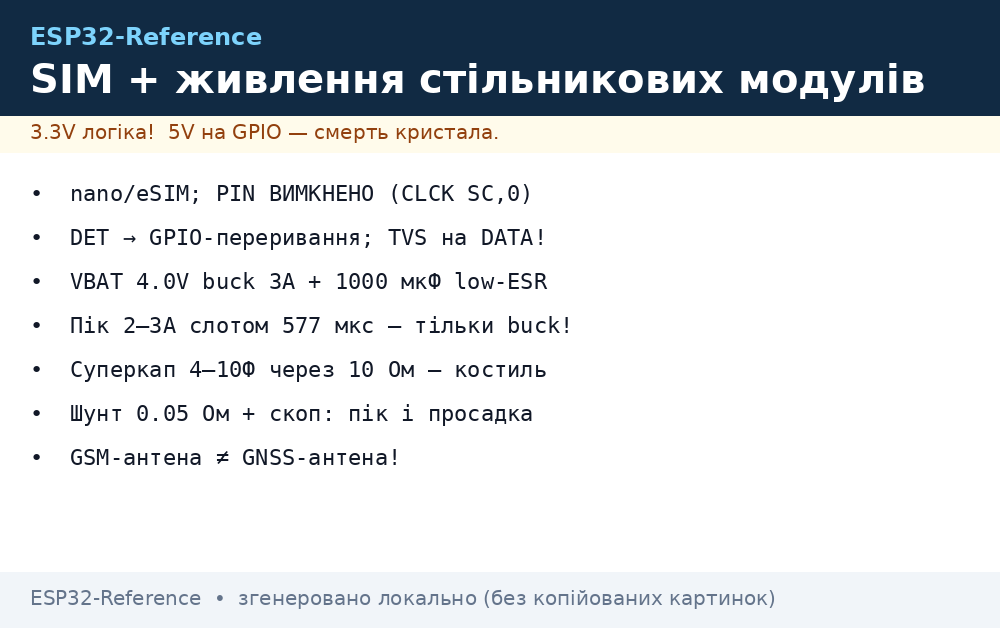
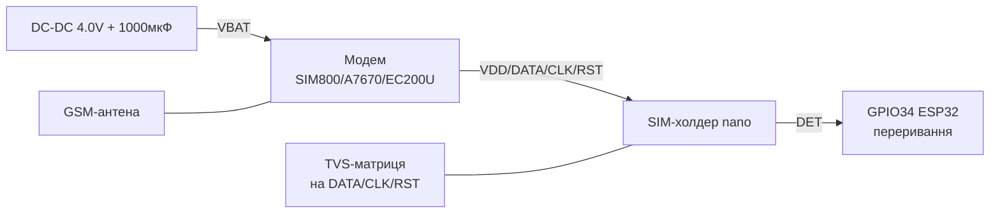
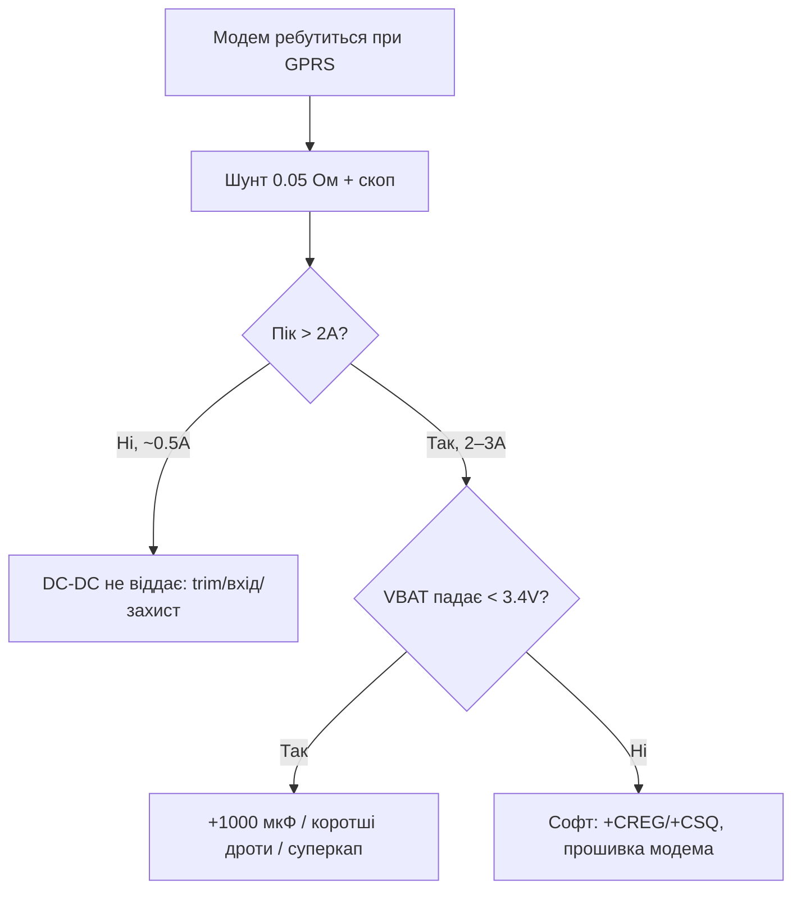
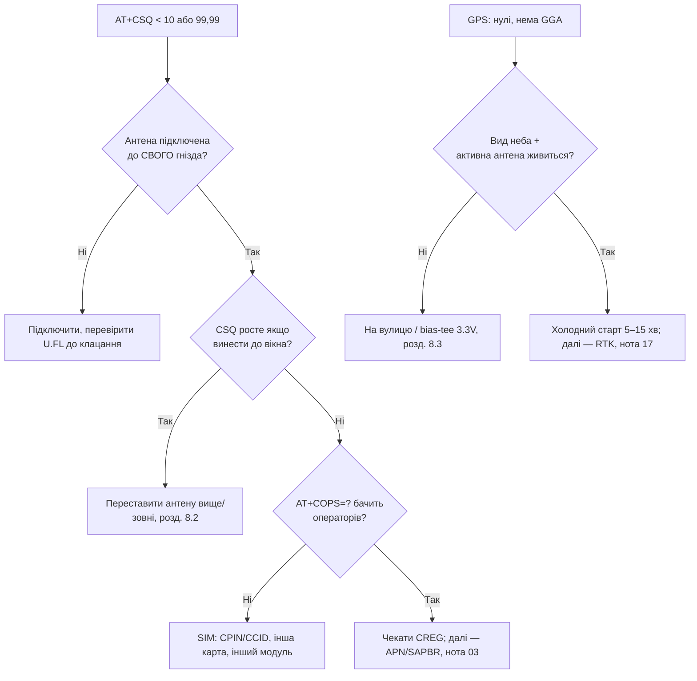

# SIM-карти та живлення стільникових модулів - холдери, eSIM, TX-бурсти, суперкап

## Призначення

Половина «мертвих» GSM-проєктів - це не прошивка, а дві залізні теми: SIM-карта (формат, PIN, холдер, детект) і живлення (піки 2-3A в TX-бурсті, які не тримає жоден LDO DevKit-плати). Нота збирає обидві в одному місці як фундамент під практику.

База: перший GSM - [03-SIM800L-GPS](../../../ESP32-Reference/12-Moduli-zvyazku/03-SIM800L-GPS.md), 4G - [07-SIM7600-W5500-MCP2515](../../../ESP32-Reference/12-Moduli-zvyazku/07-SIM7600-W5500-MCP2515.md), Cat-1 - [18-Cellular-LoRa-2](../../../ESP32-Reference/12-Moduli-zvyazku/18-Cellular-LoRa-2.md), NB-IoT - [09-Cellular-NBIoT-UARTLoRa](../../../ESP32-Reference/12-Moduli-zvyazku/09-Cellular-NBIoT-UARTLoRa.md), UART - [UART](../../../ESP32-Reference/04-Shini/01-UART.md), живлення - [01-Lancjugi-zhivlennya](../../../ESP32-Reference/02-Zhivlennya/01-Lancjugi-zhivlennya.md), захист - [04-LDO-Buck-XL4015-Protect](../../../ESP32-Reference/13-Moduli-zhivlennya-rivniv/04-LDO-Buck-XL4015-Protect.md), старт - [Home](../../../ESP32-Reference/Home.md).

> [!danger] Два вбивці стільникових модулів
>
> 1. **5V на VBAT** синьої плати (SIM800/A7670/EC200U без свого стабілізатора) - пробій RF-підсилювача за секунди. 2. **Живлення від 3.3V DevKit** - TX-бурст 2A садить рейку, модуль перезавантажується саме в момент реєстрації (`AT+CREG` ніколи не `0,1`). Обидва симптоми лікуються ТІЛЬКИ окремим DC-DC + 1000 мкФ, розділ 5.


*Рис. Вузол стільникового зв'язку: DC-DC 4.0V/3A + 1000 мкФ + TVS → VBAT, SIM-холдер з детектом і ESD, GSM-антена окремо від GNSS.*

## Характеристики

### Живлення популярних модулів (звести в одну таблицю!)

| Модуль | Діапазон VBAT | Номінал | Пік TX | Наслідок неправильного живлення |
| --- | --- | --- | --- | --- |
| SIM800L (синя плата) | 3.4-4.4V | 4.0V | до 2A (слот 577 мкс) | 5V = смерть; 3.3V = ребути при реєстрації |
| SIM800L EVB (червона, micro-USB) | 5V на вхід плати | свій buck на платі | - | Їй МОЖНА 5V - стабілізатор свій; перевіряти візуально! |
| A7670E/SA/G | 3.4-4.2V | 3.8-4.0V | до 2A | Те саме, що SIM800; плюс PWRKEY-імпульс |
| SIM7600E-H | 3.4-4.2V | 3.8V | до 3A | 3A - товстіший провід, той же 1000 мкФ |
| SIM7080G | 2.7-4.8V | 4.0V | до 2A | Ширший діапазон, але пік той же |
| EC200U / Air724UG | 3.4-4.3V | 3.8V | до 2.5-3A | USB-режими ECM/RNDIS не знімають вимоги до VBAT! |

### SIM-карти: формати

| Формат | Розмір | Де зустрічається | Коментар для ESP32-проєктів |
| --- | --- | --- | --- |
| Mini-SIM (2FF) | 25×15 мм | Старі холдери, автотрекери | Рідко, але холдери дешеві і живучі |
| Micro-SIM (3FF) | 15×12 мм | SIM800 EVB, частина Cat-1 плат | Перехідний формат |
| Nano-SIM (4FF) | 12.3×8.8 мм | A7670, EC200U, SIM7600 - стандарт де-факто | **Проєктувати під nano**, адаптери - тільки для столу |
| eSIM (MFF2, паяна) | 6×5 мм | Серійні вироби | Профіль заливається по RSP; для України - уточнювати підтримку в оператора |
| SoftSIM / solderable | чип | Промислові партії | Той же eSIM-клас, інша назва в каталогах |

> Адаптери nano→micro/mini - ТІЛЬКИ для лабораторії: у вібрації/полі адаптер розхитується, контакт пропадає, модем мовчки відвалюється від мережі. У виріб - холдер рідного формату карти.

## Легенда пінів SIM-інтерфейсу

| Пін (сторона модуля) | Призначення | Куди / що | Примітка |
| --- | --- | --- | --- |
| SIM_VDD | Живлення карти 1.8V / 3.0V | Всередині модуля, автоматичний вибір | НЕ підтягувати ззовні! Модуль сам домовляється з картою |
| SIM_DATA (I/O) | Дані, open-drain | Всередині модуля + TVS-матриця за потреби | Підтяжка всередині; довжина доріжок мінімальна |
| SIM_CLK | Такт 1-5 МГц | Всередині модуля | Поруч - ніяких силових трас (наведення = помилки ATR) |
| SIM_RST | Скидання карти | Всередині модуля | - |
| SIM_DET / SIM_PRESENCE | Детект карти в холдері | GPIO ESP32 (вхід з pull-up) або NC | Переривання «карту вийняли» → коректно закрити PDP/MQTT |
| GND | Земля SIM-блоку | Спільна GND | - |

### ASCII-схема: SIM-блок

```text
Модемний модуль              SIM-холдер (nano, push-push)
───────────────              ────────────────────────────
SIM_VDD ───────────────────►  VCC (1.8/3.0V авто)
SIM_DATA ──[TVS]────────────►  DATA (доріжка < 30 мм!)
SIM_CLK ───────────────────►  CLK (далі від VBAT-силової!)
SIM_RST ───────────────────►  RST
GND ────────────────────────  GND
                               DET ──► GPIO34 ESP32 (переривання FALLING)
                               корпус холдера ──► GND (екран!)
```

### Mermaid: SIM-блок



## 1. PIN/PUK: команди і ритуали

```text
AT+CPIN?              -> +CPIN: READY (карта без PIN — ідеал для IoT!)
AT+CPIN?              -> +CPIN: SIM PIN (просить PIN)
AT+CPIN="1234"        -> OK (ввести PIN; 3 спроби!)
AT+CPIN?              -> +CPIN: SIM PUK (PIN вичерпано — тільки PUK!)
AT+CPIN="87654321","0000" -> OK (PUK + новий PIN)
AT+CLCK="SC",0,"1234" -> OK (вимкнути запит PIN назавжди — ТАК для IoT)
AT+CCID               -> +CCID: 89380... (серійник карти — інвентаризація!)
AT+CIMI               -> 25501... (IMSI: MCC+MNC+абонент; 25501 = Vodafone UA)
AT+CNUM               -> +CNUM: ""," +380...",129 (свій номер, якщо записаний)
```

| Правило | Чому |
| --- | --- |
| Усі IoT-карти - з ВИМКНЕНИМ PIN (`AT+CLCK="SC",0`) | Після кожного ребута/просадки модем інакше висітиме на `SIM PIN` без мережі |
| PUK зберігати в реєстрі партії, не в прошивці | 10 невірних PUK = карта мертва назавжди, заміна в полі |
| `AT+CCID`/`AT+CIMI` - в self-test і в лог | Прив'язка «серійник пристрою ↔ SIM» ловить підміну карт |
| 3 спроби PIN - і стоп | Прошивка НЕ має брутфорсити PIN: після 2 невдач - стоп і аварійний статус |

> [!warning] PUK - це останній рубіж
> 10 невірних введень PUK спалюють карту безповоротно. Тому PUK вводять тільки руками з папірця/сховища, ніколи - автоматичним перебором у коді.

## 2. Холдери: типи, детект, гаряча заміна

| Тип холдера | Як працює | Де ставити | Пастка |
| --- | --- | --- | --- |
| Push-push (натисни-клац) | Натиснув - виїхала | Столова розробка, доступні корпуси | У вібрації карта може відійти - для авто/трактора брати з замком |
| Push-pull / tray (лоток з голкою) | Як у телефоні | Герметичні корпуси (лоток + гумка = IP!) | Голка-скріпка в полі губиться - класти запасну в корпус |
| Hinged/lock (кришка з замком) | Відкидна кришка | Вібрація, промзона | Найнадійніший контакт, але більший |
| eSIM MFF2 (паяний) | Профіль по RSP | Серія 100+ | Немає «вийняти і перевірити» - потрібен стенд з тестовим профілем |

### SIM_DET - переривання «карту вийняли»

```cpp
// Arduino: детект карти → коректне завершення сесії
#define SIM_DET 34
volatile bool simGone = false;
void IRAM_ATTR onSimDet() { simGone = true; }
void setup() {
  pinMode(SIM_DET, INPUT_PULLUP);
  attachInterrupt(SIM_DET, onSimDet, FALLING); // холдер замикає DET на GND
}
void loop() {
  if (simGone) {
    simGone = false;
    sim.println("AT+SAPBR=0,1");   // закрити bearer
    delay(500);
    // MQTT LWT сам повідомить хмару про відвал
  }
}
```

Гаряча заміна (вийняти/вставити без ребута): можлива ТІЛЬКИ якщо модем її підтримує (`AT+QSIMDET` у Quectel-лінійки; у SIM800 - умовно). Безпечний ритуал без підтримки: `AT+CFUN=0` (радіо викл) → заміна → `AT+CFUN=1` → чекати `+CPIN: READY` → `AT+CREG?` → підняти SAPBR заново.

## 3. ESD на SIM-лініях

SIM-холдер - це отвір у корпусі, куди тицяють пальцями: статичний розряд 8 кВ прямо в `SIM_DATA`.

| Захід | Як | Чому |
| --- | --- | --- |
| TVS-матриця (напр. PRTR5V0U2X) на DATA/CLK/RST | Біля холдера, земля - коротко в plane | Зрізає розряд до ~10V, далі вмирати нікуди |
| Послідовні 22-33 Ом на DATA/CLK | Між TVS і модулем | Обмежують струм розряду + давлять дзвін на 5 МГц CLK |
| Корпус холдера - на GND | Металева клітка холдера паяється в землю | Екран від пальців і наведень |
| Доріжки SIM < 30 мм, без силових сусідів | Розведення за главою RF-keepout | CLK 5 МГц ловить TX-бурсти VBAT поруч |

## 4. TX-бурсти: фізика просадки

GSM - TDMA: передавач вмикається слотом 577 мкс з піком 2A (2G) / 1-3A (Cat-1/LTE залежно від смуги і відстані до вишки). Середній струм смішний (200-500 мА), а от пік - ні.

```text
Струм VBAT у часі (реєстрація в мережі, слабкий сигнал):

 2.0A ─┤  ┌──┐    ┌──┐    ┌──┐
       │  │  │    │  │    │  │   слот 577 мкс
 0.3A ─┤──┘  └────┘  └────┘  └─── idle між слотами
       └──────────────────────────► t

 Конденсатор 1000 мкФ віддає заряд у слоті:
 ΔV = I × Δt / C = 2.0 × 577e-6 / 1000e-6 ≈ 1.15V  ← без DC-DC було б лихо!
 DC-DC з швидким transient-відгуком підхоплює — тому потрібен саме
 імпульсний buck (LM2596/MP1584/SY8113), а не лінійний LDO.
```

> Чому не LDO: лінійник з 5V на 4V при 2A розсіює (5−4)×2 = 2 Вт + не встигає за фронтом 577 мкс без величезного bulk. Buck - ККД 85-90%, гріється мало, transient тримає.

## 5. DC-DC для VBAT: вибір і обв'язка

| Варіант | Струм | Плюс | Мінус | Коли |
| --- | --- | --- | --- | --- |
| LM2596 (модуль) | до 3A | Дешевий, всюди є, гвинтовий trim | 150 кГц - велика котушка, гріється без радіатора | Стіл, перші прототипи |
| MP1584 (модуль/чіп) | до 3A | 1.5 МГц - компактний, холодніший | Trim дрібний, крутити обережно | Виріб середній |
| SY8113 / TPS5632xx (своя плата) | 3A+ | Сучасні, малий dropout обв'язки | Тільки своя розводка | Серія, див. [04-PCB-Design](../../../ESP32-Reference/17-Lab/04-PCB-Design.md) |
| 2×18650 → buck | 3A+ | Автономність | BMS + заряд обов'язкові | Поле без мережі 220V |

### Еталонна обв'язка VBAT (збирати буквально!)

```text
Вхід 5V 2A+ (адаптер / USB-C PD-тригер / АКБ через boost)
  │
  ├─► TVS SMBJ5.0A на землю (кидки адаптера!)
  ├─► електроліт 470 мкФ на ВХОДІ buck
  │
[buck: LM2596/MP1584, виставлено 4.0V БЕЗ навантаження!]
  │
  ├─► електроліт 1000 мкФ low-ESR (ESR ≤ 100 мОм!)
  ├─► кераміка 100 нФ + 10 мкФ прямо біля VBAT-піна модуля
  └─► VBAT модуля (провід ≥0.5 мм², <10 см!)
        GND — товста зірка: buck GND = SIM GND = ESP32 GND в ОДНІЙ точці
```

Порядок введення в експлуатацію:

1. Без модуля виставити 4.0V мультиметром, покрутити trim, почекати 5 хв (дрейф!).
2. Підключити модуль через 1000 мкФ, `AT+CBC` має показати 3900-4200.
3. `AT+CSQ` > 10, `AT+CREG?` → `0,1` (NET блимає 1 раз/3 с).
4. Прогнати 10 HTTP-сесій підряд - жодного ребута (лічильник `AT+CCLK?` не має стрибати).

## 6. Суперкап як буфер піків

Коли DC-DC слабкий, а переробляти плату ніколи: суперконденсатор 1-10 Ф на 5.5V паралельно VBAT-рейці через діод Шотткі.

```text
buck 4.0V ──►|діод Шотткі|──┬──► VBAT модуля
                            │
                       [суперкап 4–10 Ф, 5.5V]
                            │
                           GND

 Заряд: повільно через резистор 10 Ом (обмежити пусковий струм!)
 Розряд: у TX-слоті діод закритий — кап віддає пік сам.
```

| Параметр | Значення | Коментар |
| --- | --- | --- |
| Ємність | 4-10 Ф | 1 Ф тримає слот 577 мкс з просадкою ~0.5V - мінімум; 10 Ф - з запасом |
| Напруга | 5.5V | З запасом над 4.0V (деградація!) |
| ESR | < 100 мОм | Високий ESR = кап не встигає за слотом |
| Зарядний резистор | 10 Ом, 1W | Без нього пусковий струм виб'є захист buck |
| Витік (leakage) | десятки мкА | Для батарейних - рахувати в бюджеті сну! |

> Суперкап - костиль, не архітектура. У новій ревізії плати - нормальний buck на 3A замість капа.

## 7. Вимірювання піків осцилографом

Без цього - гадання. Процедура з [Прилади](../../../ESP32-Reference/17-Lab/01-Instruments.md) стосовно до модема:

1. Шунт 0.05 Ом (2W!) у розрив VBAT + диференційний пробник, або кліщі improvized - НІ, тільки шунт.
2. Тригер - по GPIO-маркеру ESP32 перед `AT+HTTPACTION`.
3. Очікуване: пачки 577 мкс, амплітуда 1.5-2A (2G) / до 3A (LTE, слабкий сигнал).
4. Одночасно другим каналом - VBAT: просадка не глибше 3.4V (нижня межа SIM800). Глибше → більший bulk / коротші дроти / інший buck.
5. Слабкий сигнал = максимальні піки: вимірювати з прикритою антеною (рука поверх - чесний worst case).



## 8. Антени GSM/LTE/GNSS: роз'єми, розміщення, активні GPS, грозозахист

### 8.1. Типи антен і роз'єми

| Антена | Діапазон | Роз'єм | Де | Пастка |
| --- | --- | --- | --- | --- |
| Штирьова «палиця» GSM | 900/1800 МГц (2G), 700-2700 (LTE wideband) | SMA (на платі) | Стіл, тести | Без ground plane під основою - КСХ > 3, гріється PA |
| PIFA/друкована на платі модема | Той же | - (розведена) | Компактні вироби | Поруч метал/АКБ - розстроювання, міряти `AT+CSQ` до/після корпусу |
| Зовнішня на кабелі | За маркуванням | U.FL (I-PEX) на модулі → SMA на корпусі | Вуличні корпуси | U.FL - 30 циклів макс! Не смикати щотижня |
| GNSS patch кераміка 25×25 | 1575 МГц (L1) | Пін/коаксіал | NEO-6M плати | Працює тільки видом у небо + ground plane знизу |
| GNSS активна (з LNA) | L1 (+L2/L5 у F9P) | SMA + живлення 3.3V по коаксіалу (bias-tee!) | Дах, щогла | Без bias-tee LNA мовчить - «антена є, супутників немає» |
| Комбінована LTE+GNSS «шайба» | Два кабелі всередині! | 2× SMA | Авто/трекери | НЕ переплутати хвости: LTE в LTE-гніздо, GNSS в GNSS |

> LTE-антена (700-2700 МГц) і LoRa-антена (433/868 МГц) НЕ взаємозамінні - чужа антена = КСХ 5+ = смерть вихідного каскаду за хвилини. Маркувати роз'єми на корпусі гравіюванням, див. [18-Cellular-LoRa-2](../../../ESP32-Reference/12-Moduli-zvyazku/18-Cellular-LoRa-2.md) (смуги B1/B3/B7/B20 + КСХ).

### 8.2. Розміщення: правила, які видно на `AT+CSQ`

1. GSM/LTE-антена - НАЙВИЩЕ в корпусі, далі від DC-DC (дроселі свистять у приймач).
2. Відстань до ESP32-WiFi-антени - ≥10 см (десенсибілізація: LTE TX глушить WiFi RX).
3. Металевий корпус = клітка Фарадея: антена ТІЛЬКИ зовні (SMA-перехід у стінці + гумка IP65).
4. GNSS patch - горизонтально небом вгору, під ним суцільний ground plane ≥70×70 мм (для F9P - 100×100, див. [17-GNSS-RTK](../../../ESP32-Reference/12-Moduli-zvyazku/17-GNSS-RTK.md)).
5. Коаксіал не перегинати (радіус ≥5× діаметра), не класти паралельно силовим 220V.

### 8.3. Активна GNSS-антена і bias-tee

```text
NEO-6M / F9P модуль                Активна антена (3.3V LNA всередині)
───────────────────                ──────────────────────────────────
ANT/RF_IN ◄─── коаксіал 50 Ом ───►  RF (живлення LNA ЇДЕ ТИМ САМИМ кабелем!)
  └─► bias-tee: котушка до 3.3V + конденсатор у тракт (на платі приймача
      або окремим модулем, якщо приймач пасивний)
Перевірка: AT/NMEA показує супутники → LNA живиться; нулі → міряти 3.3V на кабелі!
Струм LNA 5–15 мА: закорочений кабель = перегрів bias-tee, ставити PTC.
```

### 8.4. Грозозахист зовнішньої антени

| Рівень | Захід | Коментар |
| --- | --- | --- |
| Обов'язково | Заземлена щогла + розрядник (coax lightning arrestor) перед вводом у будівлю | Розрядник - витратник: після близької грози перевіряти/міняти |
| Обов'язково | Заземлення корпусу вузла (шина 4 мм² до контуру) | Інакше різниця потенціалів піде через ESP32 |
| Бажано | TVS на коаксіал (спец. прохідні) | Другий рубіж після розрядника |
| Заборонено | «Авось пронесе» з антеною на даху без заземлення | Наведена перенапруга вбиває модем і все, що за ним по UART |

### 8.5. Mermaid: діагностика «немає мережі / немає супутників»



## Код (3 фреймворки)

### Arduino - self-test SIM + живлення

```cpp
// Самоперевірка SIM і живлення перед роботою (розділи 1, 5)
HardwareSerial sim(2); // RX=16 TX=17
String atQuery(const char* cmd, int wait = 2000) {
  sim.println(cmd); delay(wait);
  String r; while (sim.available()) r += (char)sim.read();
  return r;
}
bool simCheck() {
  String cpin = atQuery("AT+CPIN?");
  if (cpin.indexOf("READY") < 0) { Serial.println("SIM не готова: " + cpin); return false; }
  Serial.println(atQuery("AT+CCID"));   // інвентаризація карти
  Serial.println(atQuery("AT+CIMI"));   // IMSI оператора
  String cbc = atQuery("AT+CBC");       // напруга VBAT
  Serial.println(cbc);                  // чекаємо ~4000 мВ
  String csq = atQuery("AT+CSQ");
  Serial.println(csq);                  // перше число > 10
  return atQuery("AT+CREG?").indexOf(",1") > 0 || atQuery("AT+CREG?").indexOf(",5") > 0;
}
void setup() {
  Serial.begin(115200); sim.begin(115200, SERIAL_8N1, 16, 17);
  delay(3000);
  if (!simCheck()) Serial.println("SELF-TEST FAIL: SIM/живлення/мережа");
  else Serial.println("SELF-TEST PASS");
}
```

### MicroPython - self-test SIM + живлення

```python
from machine import UART
import time
sim = UART(2, baudrate=115200, rx=16, tx=17)
def atq(cmd, wait=2):
    sim.write(cmd + "\r\n"); time.sleep(wait)
    return (sim.read() or b"").decode(errors="ignore")
print(atq("AT+CPIN?"))   # READY?
print(atq("AT+CCID"))    # серійник карти
print(atq("AT+CBC"))     # ~4000 мВ
print(atq("AT+CSQ"))     # > 10
print(atq("AT+CREG?"))   # 0,1 або 0,5
```

### ESP-IDF - self-test SIM + живлення

```c
// uart_write_bytes(UART_NUM_2, "AT+CPIN?\r\n", 9); → читати до "READY"/"SIM PIN"
// "AT+CBC" → парсити мВ, поріг 3600; "AT+CSQ" → поріг 10; "AT+CREG?" → ",1"/",5"
// Послідовність як в Arduino-прикладі; результат — в NVS selftest (див. 17-Lab/03).
```

## Типові помилки

| # | Помилка | Чому погано | Як правильно |
| --- | --- | --- | --- |
| 1 | Живлення модема від 3.3V DevKit | Пік 2A садить рейку, ребути при `CREG` | Окремий buck 4.0V + 1000 мкФ, розділ 5 |
| 2 | 5V на синю плату SIM800 | Пробій RF-підсилювача | 4.0V! Виняток - тільки червона EVB зі своїм стабілізатором |
| 3 | Адаптер nano→micro в полі | Розхитування, мовчазний відвал від мережі | Холдер рідного формату карти |
| 4 | PIN увімкнений на IoT-карті | Після ребута модем висить на `SIM PIN` | `AT+CLCK="SC",0` один раз при введенні в експлуатацію |
| 5 | Брутфорс PIN у коді | 3 спроби → PUK, 10 PUK → карта мертва | Після 2 невдач - стоп і аварійний статус |
| 6 | SIM_DATA довга, поруч VBAT | Помилки ATR, `SIM not inserted` | <30 мм, TVS біля холдера, без силових сусідів |
| 7 | Холдер без DET в корпусі з доступом | Вийняту карту помічають по таймаутах | DET на GPIO-переривання, розділ 2 |
| 8 | Немає TVS на SIM-лініях | ESD 8 кВ з пальців у `SIM_DATA` | PRTR5V0U2X + 22 Ом, розділ 3 |
| 9 | LDO замість buck на VBAT | 2 Вт тепла + не тримає transient 577 мкс | Buck LM2596/MP1584, розділ 5 |
| 10 | Суперкап без зарядного резистора | Пусковий струм вибиває захист buck | 10 Ом 1W послідовно, розділ 6 |
| 11 | APN з великої літери | Мережа відхиляє PDP-контекст | Буквально з таблиці 6.2 ноти 03 (`kyivstar`, `internet`) |
| 12 | Вимір піків кліщами/на око | Не видно 577 мкс слотів | Шунт 0.05 Ом + скоп з тригером, розділ 7 |

## Офіційні джерела

- [SIM800 Hardware Design V1.09 (SIMCom)](https://www.simcom.com/product/SIM800.html) - VBAT 3.4-4.4V, піки 2A, SIM-інтерфейс, ESD.
- [A7670 Hardware Design (SIMCom)](https://www.simcom.com/product/A7670.html) - VBAT, PWRKEY, SIM-холдер.
- [EC200U Hardware Design (Quectel)](https://www.quectel.com/product/lte-ec200u-series) - VBAT 3.4-4.3V, SIM_DET (`AT+QSIMDET`), USB ECM/RNDIS.
- [Espressif - Hardware Design Guidelines](https://docs.espressif.com/projects/esp-hardware-design-guidelines/en/latest/esp32/index.html) - розв'язка, TVS, розведення (застосовно до SIM-блоку).

## Див. також

- [Головна](../../../ESP32-Reference/Home.md)
- [SIM800L + GPS](../../../ESP32-Reference/12-Moduli-zvyazku/03-SIM800L-GPS.md)
- [SIM7600E 4G](../../../ESP32-Reference/12-Moduli-zvyazku/07-SIM7600-W5500-MCP2515.md)
- [SIM7080/A7670](../../../ESP32-Reference/12-Moduli-zvyazku/09-Cellular-NBIoT-UARTLoRa.md)
- [Cat-1 + LoRa-2](../../../ESP32-Reference/12-Moduli-zvyazku/18-Cellular-LoRa-2.md)
- [GNSS-RTK](../../../ESP32-Reference/12-Moduli-zvyazku/17-GNSS-RTK.md)
- [GPS-трекер](../../../ESP32-Reference/16-Proekti/02-GPS-Tracker.md)
- [Ланцюги живлення](../../../ESP32-Reference/02-Zhivlennya/01-Lancjugi-zhivlennya.md)
- [LDO/buck/захист](../../../ESP32-Reference/13-Moduli-zhivlennya-rivniv/04-LDO-Buck-XL4015-Protect.md)
- [Buck/Boost/Solar](../../../ESP32-Reference/13-Moduli-zhivlennya-rivniv/01-Buck-Boost-Solar.md)
- [Прилади](../../../ESP32-Reference/17-Lab/01-Instruments.md)
- [PCB-Design](../../../ESP32-Reference/17-Lab/04-PCB-Design.md)
