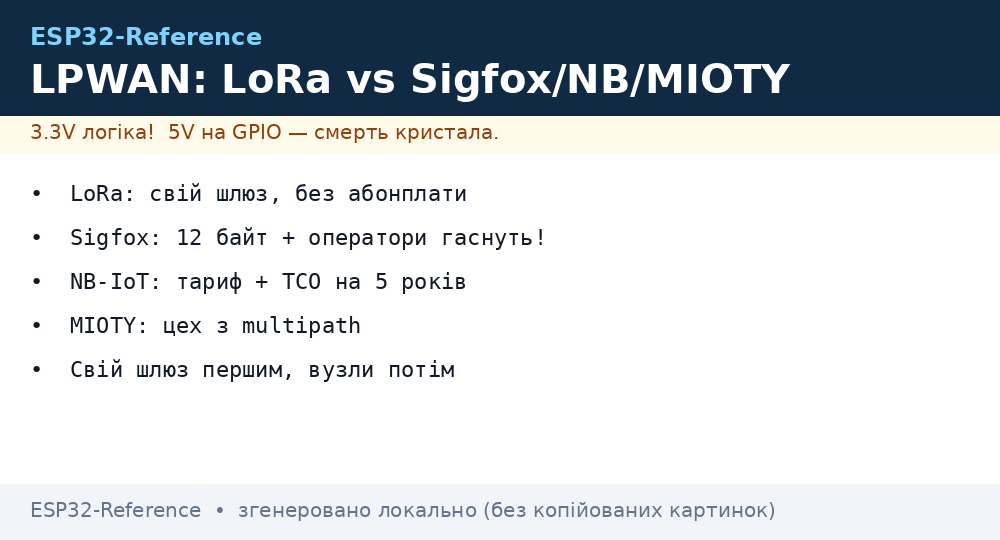
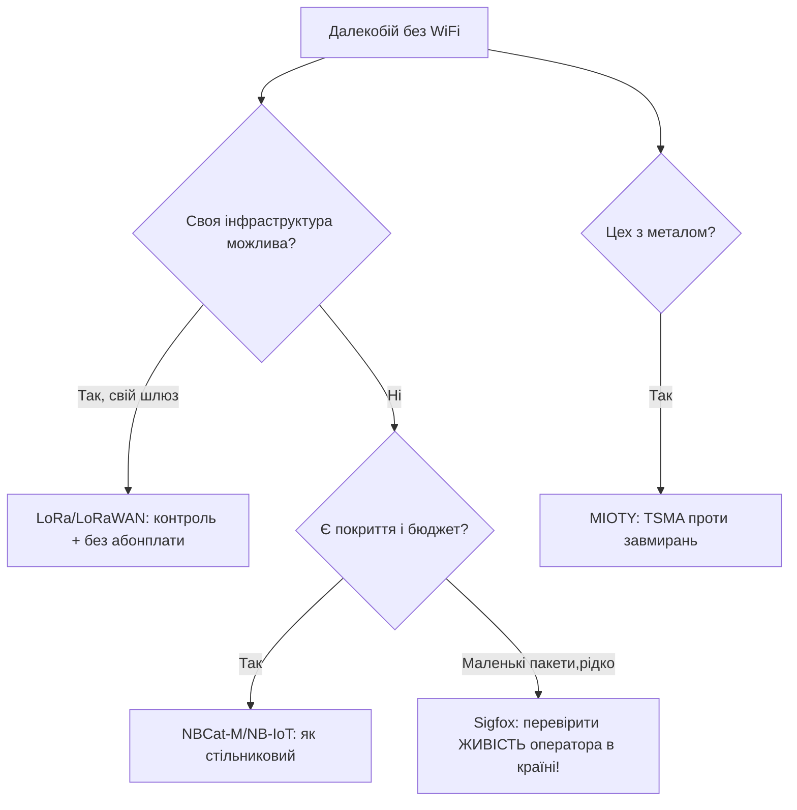

# LPWAN-альтернативи LoRa: Sigfox, Weightless, MIOTY, Wize

## Призначення

LoRa перемогла, але не скрізь і не назавжди: Sigfox (0G-оператор), Weightless (відкритий стандарт), MIOTY (TSMA для цехів), Wize (169 МГц, лічильники). Нота - чесне порівняння, щоб вибрати свідомо, а не за звичкою.

База: старт - [Home](../../../ESP32-Reference/Home.md), LoRa-база - [LoRa](../../../ESP32-Reference/12-Moduli-zvyazku/02-NRF24-LoRa.md), Cat-1 - [Cat-1](../../../ESP32-Reference/12-Moduli-zvyazku/18-Cellular-LoRa-2.md), NB-IoT - [NB-IoT](../../../ESP32-Reference/12-Moduli-zvyazku/09-Cellular-NBIoT-UARTLoRa.md).


*Рис. LPWAN-карта: LoRa (своя мережа), Sigfox (0G-оператор), NB-IoT (стільниковий), MIOTY/Wize (ніші).*

## Порівняльна таблиця (станом на 2026!)

| Параметр | LoRa/LoRaWAN | Sigfox (0G) | NB-IoT | MIOTY | Wize (169 МГц) |
| --- | --- | --- | --- | --- | --- |
| Своя мережа | Так (свій шлюз!) | Ні (оператор) | Ні (оператор) | Так | Так |
| Пейлоад | До 242 байт | 12 байт uplink! | ~1.6 КБ | ~200 байт | ~200 байт |
| Downlink | Так (класи A/B/C) | 4×8 байт/добу! | Так | Так | Так |
| Дальність | 2-15 км | 10-50 км | Як LTE | 5-15 км (цех!) | 5-10 км |
| Статус 2026 | Росте (private!) | Стагнація, банкрутства операторів | Живий (телко) | Ніша цехів | Ніша лічильників (FR) |
| Модуль | $5-15 (RAK/E78) | $10+абонплата | $15+тариф | $20+ | $15+ |

### Mermaid: що вибрати



## Чому LoRa перемогла (і коли це неважливо)

1. **Свій шлюз**: $50-200 один раз - і ніяких абонплат/банкрутств операторів (урок Sigfox!).
2. **Екосистема**: RAK/E78/модулі, TTN/ChirpStack, приклади під ESP32 - нічого цього в MIOTY/Wize для хобі немає.
3. **Коли НЕ LoRa**: лічильники під ключ з оператором (NB-IoT), спадщина Sigfox-датчиків (підтримка, не нові), цех з жорстким multipath (MIOTY).

### Helium-статус: перевіряти перед проєктом

```text
Helium (LongFi, блокчейн-мережа LoRa): пік 2021–2022, далі — згасання покриття
і міграція на Solana/IoT-токени. Правило: НЕ проєктувати під Helium у 2026
без живої перевірки (карта explorer + тестовий вузол на місцевості!).
TCO-корекція: «безкоштовний» Helium з мертвим покриттям = свій шлюз все одно
потрібен → рахувати як LoRa-приватну мережу з розділу TCO вище.
```

## Типові помилки

| # | Помилка | Чому погано | Як правильно |
| --- | --- | --- | --- |
| 1 | Новий проєкт на Sigfox | Оператори згортаються | LoRa або NB-IoT |
| 2 | 12 байт не вистачає | Архітектура Sigfox не зміниться | Проєктувати пейлоад під 12 Б з початку |
| 3 | Downlink як uplink | 4×8 байт/добу в Sigfox! | Команди - рідко і коротко |
| 4 | «Безкоштовний» NB-IoT | Тариф + eSIM-логістика | Рахувати TCO на 5 років |
| 5 | Своя LoRa без шлюзу | Немає кому слухати | Шлюз першим (див. 29-Gateway) |

## Офіційні джерела

- [Sigfox 0G technology](https://www.sigfox.com/en) - специфікація, покриття.
- [Weightless - історія стандарту (Wikipedia)](https://en.wikipedia.org/wiki/Weightless_(wireless_communications)) - відкритий стандарт.
- [MIOTY technology](https://mioty-alliance.com/miotytechnology/) - TSMA, кейси цехів.
- [LoRaWAN Specification v1.0.3](https://lora-alliance.org/resource_hub/lorawan-specification-v1-0-3/) - для порівняння.

## Sigfox детально: 12 байт і 4 даунлінки

```text
Uplink: 12 байт, ≤140/добу; модуляція UNB 100 Гц (ультравузька!) — звідси дальність.
Downlink: ТІЛЬКИ після uplink, 8 байт, 4 рази на добу МАКСИМУМ.
Пристрій: ATA8520E / Wisol-модулі; мережа: оператор 0G (перевірити карту покриття країни!).
Ціна: модуль $10–15 + абонплата $1–3/рік/пристрій (при парку!).
Вердикт 2026: підтримка існуючого парку — так; нові проєкти — тільки якщо оператор живий і дешевший за NB-IoT.
```

## Weightless / MIOTY / Wize коротко

| Технологія | Фішка | Статус модулів для хобі |
| --- | --- | --- |
| Weightless-P/N | Відкритий стандарт, двосторонній | Майже немає (телко-історія) |
| MIOTY (TSMA) | Telegram Splitting: пакет рветься на шматки - стійкість до завмирань у цеху | Промислові (AG/Gemtek), дорого |
| Wize (169 МГц) | Проникнення в будівлі (низька частота!) | Французькі лічильники, вузко |

### TCO-приклад (100 датчиків, 5 років)

```text
LoRa свій шлюз: 2× шлюз $150 + вузли $12×100 = $1500 РАЗОМ, далі $0/рік.
NB-IoT: вузли $20×100 + $2/рік×100×5 = $2000 + $1000 = $3000.
Sigfox: вузли $12×100 + $1.5/рік×100×5 = $1200 + $750 = $1950 (ЯКЩО оператор живий!).
Висновок: свій LoRa-шлюз окупається на 2-й рік проти будь-якої абонплати.
```

## Покриття в Україні/ЄС: де що ловить (орієнтири!)

| Мережа | Місто | Поле/траса | Коментар |
| --- | --- | --- | --- |
| LoRa своя | Свій шлюз - своє покриття | Щогла 15 м ≈ 20 км | Контроль у своїх руках |
| NB-IoT | Оператори трійки (перевіряти карту!) | Вздовж трас - так, глушина - ні | eSIM/M2M-тариф окремо! |
| Sigfox | Колишні зони (стискаються!) | Рідко | Перед проєктом - тестовий девайс на місцевості |
| Wize/MIOTY | Точково (проєкти) | Ні | Тільки під конкретний тендер |

### Чек-лист вибору (5 питань!)

```text
[ ] Пейлоад вміщається? (12 Б Sigfox vs 242 Б LoRa)
[ ] Даунлінк потрібен часто? (Sigfox — ні!)
[ ] Своя інфраструктура можлива? (Так → LoRa)
[ ] Оператор живий у моїй країні? (Перевірити, не повірити!)
[ ] TCO на 5 років пораховано? (Розділ TCO вище)
```

## Міграція з Sigfox на LoRa (план для живого парку!)

```text
Проблема: 500 датчиків на Sigfox, оператор гасне. План:
  1. Шлюзи: поставити 2–3 SX1302 поруч із зонами (покрити ті самі точки!).
  2. Прошивка: OTA/заміна — LoRaWAN-стек замість Sigfox (часто той самий модуль-носій!).
  3. Сервер: ChirpStack, мапінг device EUI 1:1 зі старою базою.
  4. Паралельний період: 1 місяць обидві мережі → звірка втрат → відключення Sigfox.
  5. Пейлоад переробити: 12 Б → повноцінний CBOR/JSON (можна більше — не стримуватись!).
Ризик: корпуси/антени 868 МГц ті самі — залізо міняти НЕ треба, тільки плати зв'язку.
```

## Джерела по міграціях (кейси!)

```text
Шукати: "Sigfox migration LoRaWAN case study" + свій вертикаль (лічильники/логістика).
Патерн успіху: спочатку шлюзи, потім вузли, паралельний період обов'язковий.
Патерн провалу: «переключимо за вихідні» без паралельного періоду.
```

## Глосарій LPWAN за 30 секунд

| Термін | Що означає |
| --- | --- |
| UNB | Ultra-Narrow-Band (Sigfox: 100 Гц!) |
| TSMA | Telegram Splitting (MIOTY: пакет шматками) |
| 0G | Мережа оператора без роумінгу даних (Sigfox-модель) |
| Duty cycle | Ліміт ефіру 1% (EU868!) - стосується ВСІХ технологій |

## Див. також

- [Головна](../../../ESP32-Reference/Home.md)
- [NRF24/LoRa](../../../ESP32-Reference/12-Moduli-zvyazku/02-NRF24-LoRa.md)
- [Cat-1/LoRa-2](../../../ESP32-Reference/12-Moduli-zvyazku/18-Cellular-LoRa-2.md)
- [NB-IoT](../../../ESP32-Reference/12-Moduli-zvyazku/09-Cellular-NBIoT-UARTLoRa.md)
- [LoRaWAN-шлюз](../../../ESP32-Reference/12-Moduli-zvyazku/29-LoRaWAN-Gateway.md)
