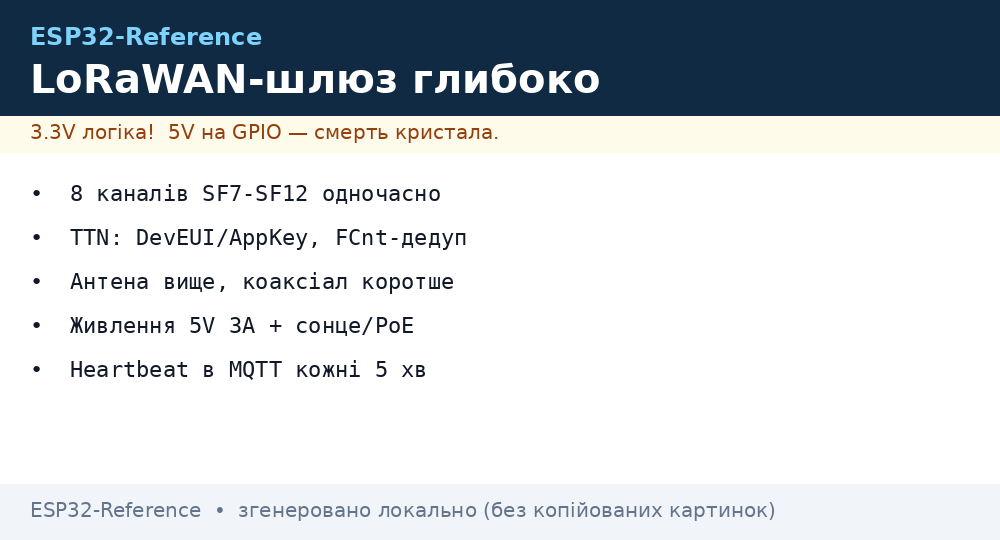
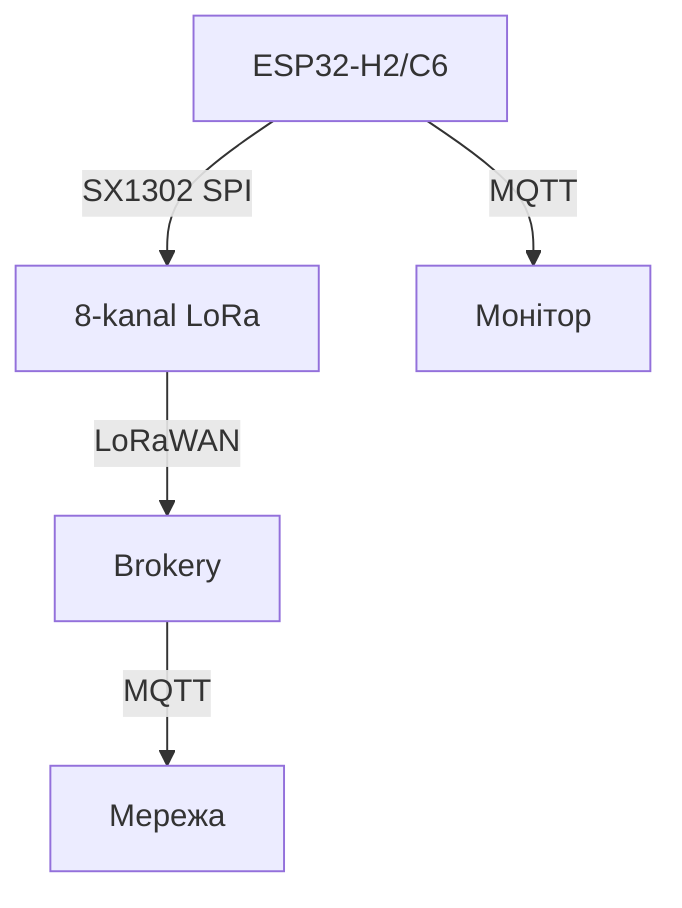

# ESP32 LoRaWAN-шлюз глибоко - SX1302, TTN і мультиканальний вузол


*Рис. Шлюз: SX1302 8-канал + ESP32-S3 + WiFi-ETH - приймає десятки вузлів, віддає MQTT.*

> [!tip] Що це за нота
> Повний розбір шлюзу: не просто модуль, а система з мультиплексуванням каналів, TTN-договором і розподілом живлення. Передмова: [LoRaWAN-шлюз оглядово](../../../ESP32-Reference/12-Moduli-zvyazku/29-LoRaWAN-Gateway.md).

## 1. Мета



*Рис. Шлюз: 8 каналів + TTN + MQTT.*

Підняти шлюз, який дійсно працює:

- SX1302 приймає 8 каналів одночасно (SF7-SF12);
- ESP32-S3 обробляє пакети, формує MQTT;
- Веб-інтерфейс стану - чи працює кожен канал;
- Живлення: 5V 3A для SX1302 (пиk 2A) + ESP32.

## 2. Розпіновка шлюзу (ESP32-S3 + SX1302)

| Сигнал | Пін ESP32-S3 | Примітка |
| --- | --- | --- |
| SPI-CS | GPIO5 | SX1302-select |
| SPI-MOSI/MISO/SCK | GPIO23/19/18 | 40 МГц |
| DIO0/DIO1 | GPIO4/5 | Переривання пакету |
| RST | GPIO2 | Скидання SX1302 |
| CCA | GPIO35 | Виявлення каналу завади |
| 5V/VBUS | 5V 3A БЖ | Пік 2A при передачі |

## 3. Кани та швидкість

| ID каналу | Частота | Ширина | SF | Призначення |
| --- | --- | --- | --- | --- |
| 0 | 868.1 МГц | 125 кГц | 7 | Швидка телеметрія |
| 1 | 868.3 МГц | 125 кГц | 9 | Середня |
| 2 | 868.5 МГц | 125 кГц | 12 | Далека |
| 3 | 868.3 МГц | 250 кГц | 7 | Швидкий довгий |
| ... | ... | ... | ... | ... |

Кожен канал - окремий SX1302-модуль? Ні, один чип з 8 приймачами. Прийом одночасний.

## 4. Протокол: TTN / LoRaWAN

- Устрій реєструється на TTN з Device EUI і ключами;
- Пакет: MHDR + DevAddr + FCnt + FPort + Payload + MIC;

| Ключ | Значення |
| --- | --- |
| DevEUI | 8 байт, унікальний |
| AppEUI | 8 байт, мережа |
| AppKey | 16 байт, вивірка |

Вузол з ESP32 не має TX-радіо (C3/C6/H2 окремо), але шлюз готовий до прийому.

## 5. Робочий код (MicroPython)

```python
# MicroPython: простий монитор шлюзу
import time
from machine import Pin, SPI
import esp

def check_gateway_status():
    # SPI-читання статусу SX1302 (спрощено — через регістри)
    return "READY"  # Якщо модуль підключено

pwr = Pin(48, Pin.OUT, value=1)
while True:
    print('Шлюз:', check_gateway_status(),
          'канали:', 8, 'час:', time.strftime('%F %T'))
    time.sleep(10)
```

Чесно: повний TTN-стек на ESP32 потребує Linux-хоста або значної оптимізації; тут - монітор статусу з резервом для дійсної обробки через C/IDF.

## 6. Живлення

- SX1302-адаптер із 5V → 3.3V/1.8V LDO; пік 2A на прийом;
- ESP32-S3 з його зовнішнім WiFi - 400 мА пік;
- Сумарно 2.5A мінімум; 5A - з запасом;
- Батарея з сонцем для зовнішнього шлюзу; PoE - для внутрішнього.

## 7. Типові помилки

| Симптом | Причина | Лікування |
| --- | --- | --- |
| Прийом не працює | Чужий SF або канал | Перевірити канал зліва |
| Пакет не розшифрований | Не той AppKey | Верифікація DevEUI/AppKey з TTN |
| SX1302 перегрівається | Без радіатора | Радиатор на модуль |
| Живлення просідає | Недостатнього БЖ | 5V 3A+ з розділом |
| WiFi не зʼєднується з хмарою | IP-брандмауер | Перевірити NAT/forward |
| Дублікати пакетів | Два шлюзи чують вузол | Дедуплікація на сервері за FCnt |
| Час дрейфує | Немає NTP на шлюзі | Синхронізація часу щогодини |

## 8. Швидка шпаргалка шлюзу

- 8 каналів, SF7-SF12, 125/250 кГц;
- Живлення 3А з запасом;
- HTTP-MQTT міст для хмари;
- Радіо в вузлі - окремо від шлюзу.

## 9. Суміжні ноти

- [NRF24/LoRa](../../../ESP32-Reference/12-Moduli-zvyazku/02-NRF24-LoRa.md) - вузол із LoRa.
- [WiFi-STA/AP](../../../ESP32-Reference/05-Radio/01-WiFi-STA-AP.md) - WiFi в вузлі.
- [передача в хмару](../../../ESP32-Reference/15-Protokoli/01-MQTT.md) - брокер.
- [чипи C3/C6/H2](../../../ESP32-Reference/01-Hardware/04-ESP32-C3-C6-H2.md) - радіо-versії.
- [головна карта](../../../ESP32-Reference/Home.md) - повна навігація.

## 9.1 Антена і корпус шлюзу

- Антена 868 МГц (EU) або 915 МГц - за регіоном, не навпаки.
- Висота важливіша за потужність: дах б'є далі за вати.
- Корпус IP65 на вулиці, грозозахист на щоглі.
- Коаксіал короткий: кожен метр відбирає децибели.
- Два шлюзи з перекриттям зон - резервування прийому.

## 9.2 Живлення шлюзу в полі

- Сонячна панель 20W + MPPT + АКБ 12V 7Аг - тиждень без сонця.
- PoE-інжектор - якщо є вита пара до щогли.
- Споживання: SX1302 прийом ~100 мА, ESP32 WiFi-TX - піки 400 мА.
- Сторожовий таймер шлюзу: завис - ребут без виїзду.
- Дистанційний лог: heartbeat в MQTT кожні 5 хвилин.
- Резервний канал: другий шлюз з перекриттям зони.
- Версія прошивки шлюзу - в топіку статусу.

## Офіційні джерела

- [Waveshare SX1268 LoRa HAT (Waveshare)](https://www.waveshare.com/wiki/SX1268_433M_LoRa_HAT) - підключення HAT.
- [LoRaWAN Specification 1.0.3 (LoRa Alliance)](https://lora-alliance.org/resource_hub/lorawan-specification-v1-0-3/) - специфікація мережі.
- [STM32F4 (ST)](https://www.st.com/en/mcus-mpus/stm32f4.html) - FDCAN і DMA для шлюзу.
