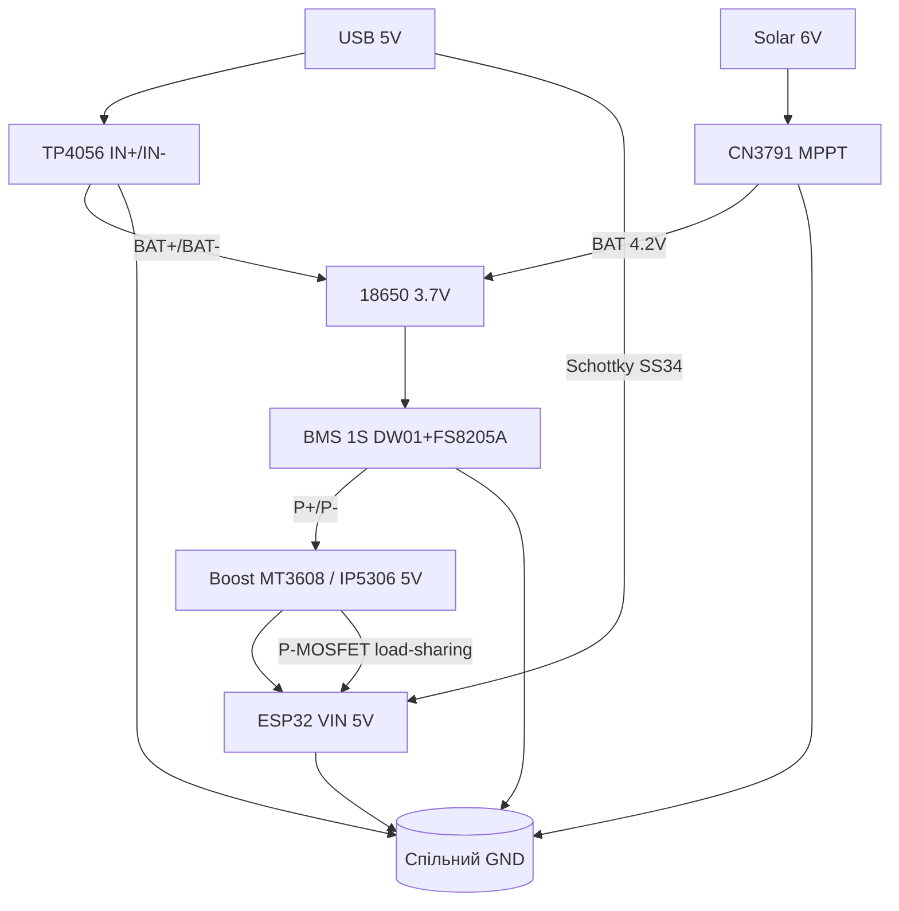
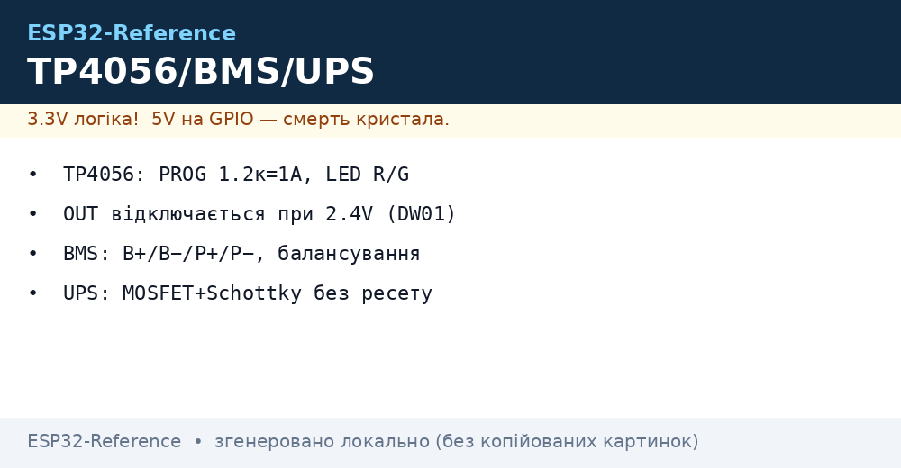

# 03 - TP4056, IP5306, BMS та UPS для ESP32

## Призначення

Вузол автономного живлення ESP32 від Li-Ion 18650: заряд від USB 5V або сонячної панелі через CN3791, захист банки, підвищення до 5V (IP5306 / MT3608) та безперебійне перемикання UPS (load-sharing), щоб ESP32 не ресетився при зникненні USB.

Модулі покривають повний цикл: CC/CV-заряд → захист від перерозряду/перезаряду/КЗ → boost до 5V → резервування живлення.

## Характеристики

| Модуль | Вхід | Вихід / Заряд | Струм | Захист | Особливість |
| --- | --- | --- | --- | --- | --- |
| TP4056 (micro-USB, з захистом) | 4.5-5.5V (IN+/IN-) | 4.2V CC/CV на BAT | до 1A (PROG 1.2к) | DW01 + FS8205A | OUT+/OUT- від DW01 |
| TC4056A (Type-C) | 5V Type-C | 4.2V CC/CV | до 1A | залежить від плати (часто з DW01) | зручний роз'єм Type-C |
| IP5306 powerbank | 5V micro-USB/Type-C | 5V boost 2.1A | 2.1A (пік 2.4A) | від КЗ, перегріву | KEY + 4 LED індикація |
| BMS 1S 3A (HX-1S-01) | B+/B- від банки | P+/P- навантаження | 3A cont. | 4.25V/2.5V, КЗ | без балансування (1S не треба) |
| BMS 2S 8A | 7.4V (2 банки) | P+/P- | 8A | 4.25×2 / 2.5×2 | балансування 4.2V/60мА |
| BMS 3S 12-25A | 11.1V | P+/P- | 12-25A | 4.25×3 / 2.5×3 | балансування, радіатор |
| UPS load-sharing (MOSFET+Schottky) | USB 5V + BAT-boost | 5V без просадки | до 2-3A | Schottky від зворотного струму | безшовне перемикання |

Параметри TP4056 (лінійний charger):

- Режими: trickle (<2.9V, ~100мА) → CC (const current) → CV 4.2V → cutoff C/10 → standby.
- Точність 4.2V ±1%.
- PROG-резистор задає струм: Rprog = 1200 / I(A) кОм.
- Термозахист: при ~145°C струм падає.

| Rprog | Струм заряду |
| --- | --- |
| 10к | 130 мА |
| 5к | 250 мА |
| 3к | 400 мА |
| 2к | 600 мА |
| 1.2к (штатний) | 1000 мА |
| 1к | 1200 мА (перегрів!) |

IP5306:

- Boost 5V 2.1A, ККД ~90%.
- Режим ліхтарика (подвійний клік KEY), автосон при малому струмі (<45мА 30с) - проблема для deep-sleep!
- 4 LED: 25/50/75/100%.

## Легенда пінів модуля

### TP4056 з захистом (6 клем + USB)

| Пін | Напрям | Опис |
| --- | --- | --- |
| IN+ | вхід | +5V від USB / сонячної панелі через діод (4.5-5.5V) |
| IN- | вхід | GND входу |
| BAT+ | двонапрямлений | + банки 18650 (3.0-4.2V) |
| BAT- | двонапрямлений | - банки (через FS8205A до GND) |
| OUT+ | вихід | + навантаження (через захист DW01, = BAT+ при нормі) |
| OUT- | вихід | - навантаження (вимкається при аварії) |

LED:

- Червоний горить - заряд іде.
- Зелений горить - standby / заряд завершено (струм < C/10).
- Обидва блимають / тьмяно - немає банки або поганий контакт.

### TC4056A (Type-C версія)

| Пін | Опис |
| --- | --- |
| USB-C 5V / IN+ | вхід 5V, часто 2× IN+ площадки для зручності |
| GND / IN- | загальний |
| BAT+ / B+ | + банки |
| BAT- / B- | - банки |
| OUT+ / OUT- | як у TP4056, якщо є DW01; на дешевих платах без захисту - OUT = BAT |

Увага: частина TC4056A-плат розведена тільки як charger без DW01 - тоді захист покладається на захищену банку або зовнішню BMS.

### IP5306 powerbank-модуль

| Пін | Опис |
| --- | --- |
| VIN / 5V_IN | вхід заряду 5V |
| BAT | вивід на банку 3.7V (часто площадка під 18650-тримач) |
| 5V_OUT / USB-A | вихід boost 5V 2.1A |
| KEY | кнопка: клік - показати заряд, дабл-клік - ліхтарик/вихід постійно |
| L1-L4 LED | індикація 25/50/75/100% |
| EN / SET | налаштування струму/режиму (залежно від плати) |

### BMS 1S / 2S / 3S

| Пін | Опис |
| --- | --- |
| B+ / B- (1S) | банка 3.7V |
| B+ / BM / B- (2S) | дві банки послідовно, середня точка BM |
| B+ / B1 / B2 / B- (3S) | три банки, балансувальні відводи |
| P+ / P- | навантаження + заряд (спільний порт) |
| T / NTC | термістор (на старших BMS) |

> Готові плати HX-1S (1S) / HX-2S (2S): DW01 + подвійний MOSFET на борту, окремо докуповувати нічого. Перевірити пороги мультиметром: відсікання ~2.4-2.5 В, перезаряд ~4.25 В.

## Схема підключення

Базовий вузол: USB 5V → TP4056 → 18650 → OUT → MT3608 boost → ESP32 5V (VIN).

Для solar-вузла заряд іде через CN3791 (MPPT), а TP4056 залишається для USB-сервісного заряду.

### ASCII-схема

```text
[USB 5V]----+----> IN+ TP4056
            |
           [D] Schottky SS34 (опційно від solar)
GND --------+----> IN- TP4056

TP4056:
  BAT+ ----> [+] 18650 (незахищена, 2500-3500mAh)
  BAT- ----> [-] 18650
  OUT+ ----> VIN boost MT3608 / IP5306 BAT
  OUT- ----> GND boost

[Boost MT3608]  BAT 3.0-4.2V -> 5.0V
  VIN  <---- OUT+ TP4056
  GND  <---- OUT- TP4056
  VOUT ----> VIN (5V) ESP32-DevKit
  GND  ----> GND ESP32 (спільна земля!)

LED TP4056:
  RED   ON = charging
  GREEN ON = done / standby

UPS load-sharing (щоб не ресетився):
  USB 5V --[Schottky SS34]--+--> 5V ESP32 VIN
                            |
  Boost 5V --[P-MOSFET AO3401 / Schottky]--+
```

Повний solar-вузол Solar → CN3791 → 18650 → boost → ESP32:

```text
                   +------------------+
 [Solar 6V/5W] --> | CN3791 (MPPT)    |  Rcs=0.1 Ом -> 1A charge
                   | VIN  GND  BAT FB |  MPPT R1/R2 під 6V панель
                   +--------+---------+
                            | BAT+ (4.2V CC/CV)
                            v
                     [+] 18650 [-]  (1S, бажано Samsung 35E / MJ1)
                            |
                     +------+------+
                     | BMS 1S 3A   |  B+ B- | P+ P-
                     +------+------+
                            | P+ -> boost IN+
                            | P- -> boost GND
                     +------+------+
                     | MT3608/IP5306|  3.0-4.2V -> 5.0V 2A
                     +------+------+
                            | 5V -> VIN ESP32
                            v
                      [ESP32 + датчики]
                       GND спільний по всьому вузлу!

 USB-сервісний вхід (TP4056) підключається до P+/P- через
 Schottky (load-sharing), щоб не заважати CN3791.
```

### Mermaid





## Процедури налаштування

### Процедура 1: Безпечний заряд 18650 через TP4056

1. Виставте струм PROG під банку: 0.5C. Для 2500mAh → 1.2A забагато, перепаяйте Rprog на 2к (600мА) або 3к (400мА).
2. Підключіть БЕЗ банки: подайте 5V на IN, поміряйте BAT+ - має бути ~4.17-4.22V холостого.
3. Підключіть банку (дотримуйтесь полярності!). Червоний LED має засвітитись.
4. Контролюйте температуру TP4056 перші 10 хв - гарячий (>70°C) = зменшіть струм або додайте радіатор.
5. Кінець: зелений LED, струм <100мА. Напруга банки 4.18-4.20V.
6. Навантаження підключайте ТІЛЬКИ до OUT+/OUT-, а не до BAT - інакше обійдете захист DW01.

### Процедура 2: IP5306 для ESP32 (обхід автосну)

1. Підключіть банку до BAT, USB-заряд до VIN.
2. Натисніть KEY - LED покажуть заряд.
3. Перевірте автосон: переведіть ESP32 у deep-sleep (струм <20мА). Якщо IP5306 вимикається через 30с - це автосон.
4. Обхід: а) прошийте IP5306 без light-load shutdown (потрібен програматор), б) додайте імпульсне навантаження 50мА кожні 20с, в) замініть на MT3608 + TP4056 для IoT.
5. Для постійного живлення утримуйте KEY 2с або замкніть KEY на GND через 100к (на деяких платах).

### Процедура 3: BMS 2S/3S - перше ввімкнення

1. Спочатку припаяйте балансувальні дроти B-, B1, B2, B+ до банок (однаковий заряд!).
2. Потім підключіть P-/P+ до навантаження.
3. Активуйте BMS: подайте 12.6V (3S) на P+/P- від БЖ на 2с - інакше BMS спить (0V на виході - норма!).
4. Перевірте балансування: зарядіть до 12.6V, поміряйте кожну банку - розкид <50мВ.

### UPS load-sharing на MOSFET + Schottky

Ідея: USB 5V живить ESP32 безпосередньо через Schottky, а boost від батареї підхоплює через P-MOSFET, коли USB зникає. Без цього ESP32 ресетиться на 50-200мс, поки boost стартує.

```cpp
// Моніторинг батареї + USB для UPS-логіки
#define PIN_BAT 34   // через дільник 100k/100k до BAT+
#define PIN_USB 35   // через дільник до USB 5V (або VBUS detect)

void setup() {
  Serial.begin(115200);
  analogReadResolution(12);
}

void loop() {
  int rawBat = analogRead(PIN_BAT);
  int rawUsb = analogRead(PIN_USB);
  float vBat = rawBat / 4095.0 * 3.3 * 2.0; // дільник 1:1
  float vUsb = rawUsb / 4095.0 * 3.3 * 2.0;
  Serial.printf("BAT=%.2fV USB=%.2fV %s\n", vBat, vUsb,
    vUsb > 4.5 ? "MAINS" : "BATTERY");
  if (vBat < 3.2) Serial.println("WARN: low battery, go deep-sleep!");
  delay(1000);
}
```

## Захищені vs незахищені 18650

| Параметр | Незахищена (flat-top) + TP4056/DW01 | Захищена (button-top, з PCB) |
| --- | --- | --- |
| Довжина | 65мм | 68-69мм (не влізе в деякі тримачі!) |
| Захист | на платі TP4056/BMS | вбудований (2.5V/4.28V) |
| Струм | до 10-20A (залежно від банки) | обмежено 3-5A PCB |
| Для ESP32 + TP4056 з DW01 | рекомендовано (дешевше, коротша) | подвійний захист, але довша |
| Для голої TP4056 без DW01 | НЕБЕЗПЕЧНО | обов'язково захищена або зовнішня BMS |

Правило: один рівень захисту - мінімум. Два - норма для solar-вузла на вулиці.

Чому OUT вимкається при 2.4V: поріг DW01 Vovp=2.4V ±0.1V вимкає FS8205A (розрив B- від P-). Це захист від незворотної деградації Li-Ion (мідні шунти при <2.5V). Повторне ввімкнення - тільки зарядом (подати 5V на IN або 4.2V на BAT).

### TP5100 / IP5328P / 21700 / HX-1S - сусіди за живленням

| Позиція | Що це | Відмінність |
| --- | --- | --- |
| TP5100 | Заряд 1S/2S перемичкою (1-2 А) | 2S-пак для 7.4 В систем; струм виставляється резистором |
| IP5328P | PowerBank-SoC (boost + заряд + індикація) | Готовий павербанк однією мікросхемою; для ESP32-прототипів на ходу |
| 21700 | Формат банки 21×70 мм (4000-5000 мАг) | +40 % ємності проти 18650 тим самим BMS |
| HX-1S / HX-2S (плата BMS) | Готовий захист 1S/2S на DW01+FS8205 | Перевіряти пороги: відсікання 2.4 В, перезаряд 4.25 В |

> IP5328P vs TP4056+MT3608: перший - компактно і з індикацією, другий - дешевше і ремонтопридатніше; струм boost в обох рахувати з запасом ×1.5 від піків WiFi.

## Типові помилки

| Симптом | Причина | Виправлення |
| --- | --- | --- |
| OUT=0V, банка 3.7V є | DW01 у захисті (була просадка <2.4V або КЗ) | подати 5V на IN на 10с для скидання |
| TP4056 гріється до 80°C+ | 1A + Vin 5.5V, мала мідь | зменшити струм (Rprog 2-3к), радіатор, вентилятор |
| Зелений LED одразу, банка пуста | немає контакту BAT / обрив | перевірити пайку BAT+/BAT-, тримач |
| IP5306 вимикається в deep-sleep | light-load shutdown 45мА | MT3608 замість IP5306 або dummy-load |
| BMS 3S видає 0V | спить після збірки | активувати зарядником 12.6V на P+/P- |
| ESP32 ресетиться при витяганні USB | немає load-sharing, boost стартує повільно | Schottky + MOSFET UPS, конденсатор 1000мкФ на 5V |
| Навантаження до BAT замість OUT | обхід DW01, немає вимкення при 2.4V | перепідключити на OUT+/OUT- |
| Захищена банка не влізає | 69мм vs 65мм тримач | взяти незахищену + BMS або більший тримач |
| Заряд 18650 від 5V безпосередньо | перезаряд, пожежа | тільки через TP4056/CN3791 CC/CV 4.2V |
| 21700 в тримач 18650 | бовтається, іскрить | тільки тримач 21700; HX-1S перевірити під 1S |

## Офіційні джерела

- [BQ24074 - charger-референс (TI)](https://www.ti.com/product/BQ24074) - лінійний CC/CV-заряд 1-cell з Power Path: фази заряду, termination (орієнтир для TP4056-вузла).
- TP4056 / DW01 / IP5306 / BMS-плати - *перевірити вручну* (єдиного вендора немає, багато клонів; звіряти маркування на платі).

## Див. також

- [01-Lancjugi-zhivlennya](../../../ESP32-Reference/02-Zhivlennya/01-Lancjugi-zhivlennya.md)
- [02-LDO-DC-DC](../../../ESP32-Reference/02-Zhivlennya/02-LDO-DC-DC.md)
- [04-Esptool-Flash](../../../ESP32-Reference/09-Proshivka/04-Esptool-Flash.md)
- [Home](../../../ESP32-Reference/Home.md)
- 01-Buck-Boost-Solar - сонячні вузли та CN3791 MPPT
- 02-Level-Shifters - узгодження рівнів при живленні від батареї
