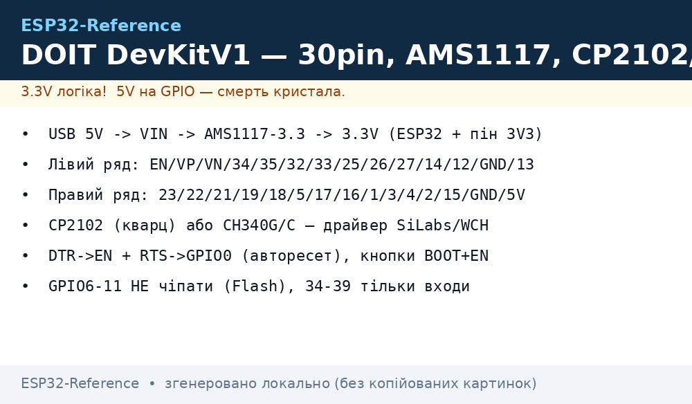
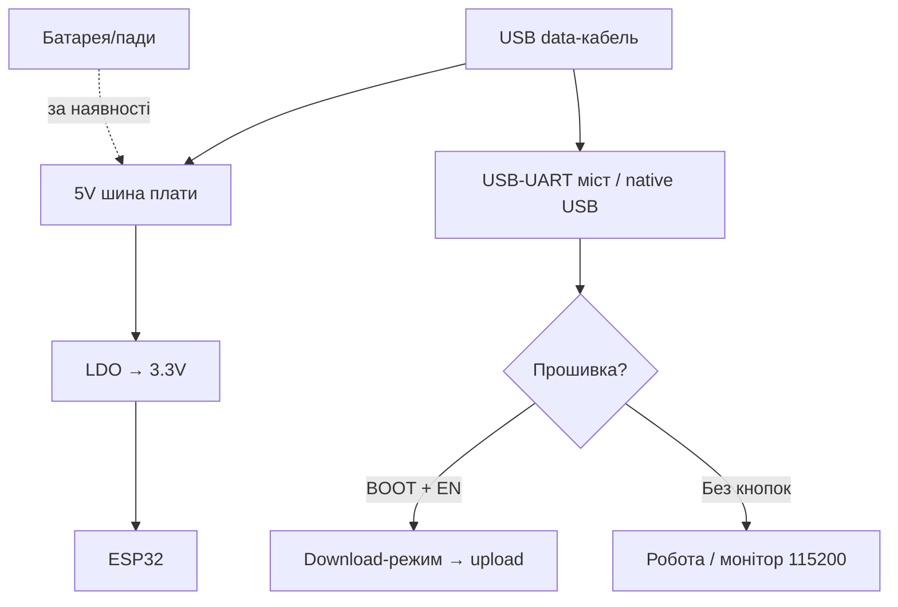

# DOIT DevKitV1 / NodeMCU-32S - класика 30pin

> [!tip] Еталон для початківця
> Саме ця плата мається на увазі у 90% прикладів з інтернету. Якщо приклад не працює на іншій платі - спочатку перевірте саме на DOIT V1. Порівняння кристалів - [Порівняння чипів](../../../ESP32-Reference/00-Start/03-Porivnyannya-chipiv.md), загальний огляд плат - [DevKit плати](../../../ESP32-Reference/00-Start/04-Devkit-plati.md), середовище - [Вибір середовища](../../../ESP32-Reference/00-Start/05-Vibir-seredovischa.md).
>
> [!warning] 3.3V логіка!
> Усі GPIO - 3.3V, **не 5V-толерантні**. Пін `5V/VIN` - тільки вхід живлення. Деталі про рівні - [Рівні 3.3V/5V](../../../ESP32-Reference/03-GPIO/03-Pidtyaguvannya-rivni.md).

## Призначення

DOIT ESP32 DevKit V1 (клонована під іменами NodeMCU-32S, ESP32 DEVKITV1, MH-ET LIVE) - наймасовіша налагоджувальна плата на кристалі ESP32 Classic (WROOM-32). Призначення: навчання, прототипування, IoT-вузли з Wi-Fi + Bluetooth, прошивка через USB-UART з авторесетом. Широкий форм-фактор (52×28 мм) займає багато місця на макеті, зате всі 30 пінів підписані і повторюють «канонічну» розпіновку з туторіалів.

| Параметр | Значення |
| --- | --- |
| Призначення | Навчання, прототипи, еталон для прикладів |
| Кристал | ESP32-D0WDQ6 Classic, 240 МГц dual-core |
| Сумісність прикладів | Максимальна (усі туторіали пишуться під неї) |

## Характеристики

| Характеристика | Значення | Примітка |
| --- | --- | --- |
| Модуль | ESP32-WROOM-32 (4 МБ Flash) | PSRAM немає |
| Кількість пінів | 30 (2×15) | Широка версія; вузька - теж 30, але 52×25 мм |
| USB-UART | CP2102 (оригінал) або CH340G/C (клони) | Див. відмінності нижче |
| USB-роз'єм | Micro-USB | Кабель тільки data, не charge-only! |
| LDO | AMS1117-3.3, до 1 А (реально ~500 мА без радіатора) | Гріється при Wi-Fi TX + периферія |
| Кнопки | BOOT (GPIO0) + EN | Авто-прошивка через DTR/RTS |
| Живлення | USB 5V / VIN 5V / 3V3 (обхід LDO) | VIN min ~4.75V через dropout AMS1117 |
| Розмір | ~52×28 мм (широка) / ~52×25 мм (вузька) | Широка закриває обидва ряди макету |
| Струм | ~80 мА idle, до 500 мА пік Wi-Fi TX | Електроліт 470-1000 мкФ проти brownout |

> [!tip] Живлення
> USB дає 500 мА. AMS1117 має dropout ~1.1V, тому на VIN подавайте 4.75-5.5V. Для реле/серво/моторів - окремий блок 5V 2A зі спільною GND, див. [Ланцюги живлення](../../../ESP32-Reference/02-Zhivlennya/01-Lancjugi-zhivlennya.md).

## Особливості розпіновки

Класична розпіновка DOIT V1 (лівий ряд зверху вниз): EN, VP(36), VN(39), 34, 35, 32, 33, 25, 26, 27, 14, 12, GND, 13. Правий ряд: 23, 22, 21, 19, 18, 5, TX2(17), RX2(16), TX0(1), RX0(3), 4, 2, 15, GND, 5V/VIN. Увага: на частині клонів порядок 5V/GND переплутаний - звіряйте шовкографію!

| Особливість | DOIT V1 | Еталон DevKitC V4 |
| --- | --- | --- |
| Ширина | Широка, закриває макет | Вузька, лишає по 1 ряду |
| GPIO34-39 | Виведені, тільки входи | Так само |
| GPIO6-11 | НЕ виведені (зайняті Flash) | Так само |
| Strapping | GPIO0/2/5/12/15 доступні | Так само, див. [Strapping](../../../ESP32-Reference/03-GPIO/02-Strapping-pini.md) |
| Світлодіод | Blue LED на GPIO2 | Так само |

Не використовуйте GPIO6-GPIO11 (SPI Flash), GPIO34-39 тільки на вхід без pull-up/pull-down. ADC2 (GPIO4/0/2/15/13/12/14/27/25/26) конфліктує з Wi-Fi - для аналогових вимірів з Wi-Fi беріть ADC1, див. [ADC](../../../ESP32-Reference/06-Analog/01-ADC.md).

## Особливості живлення

| Джерело | Куди подавати | Обмеження |
| --- | --- | --- |
| USB Micro 5V | Роз'єм | 500 мА, тонкий кабель = brownout |
| Зовнішні 5V | VIN (5V) + GND | 4.75-5.5V, далі AMS1117 → 3.3V |
| Зовнішні 3.3V | 3V3 + GND | В обхід LDO, тільки стабільні 3.2-3.4V! |
| 3V3 вихід для датчиків | Пін 3V3 | До ~400 мА сумарно, далі гріється |

> [!warning] AMS1117 гріється
> При (5V−3.3V)×400 мА ≈ 0.7 Вт корпус SOT-223 без радіатора нагрівається до 70-90 °C. Це нормально, але при 500 мА+ додайте радіатор або окремий buck, див. [XL4015/Захист](../../../ESP32-Reference/13-Moduli-zhivlennya-rivniv/04-LDO-Buck-XL4015-Protect.md).

## Особливості USB-UART

| Версія плати | Міст | Драйвер | Відмінності |
| --- | --- | --- | --- |
| DOIT V1 оригінал | CP2102 | SiLabs CP210x (Win - встановити, Linux/macOS - з коробки) | Кварц поруч з чипом, стабільні 921600 бод |
| NodeMCU-32S клон | CH340G | WCH CH341SER | Без кварца у CH340C, дешевше, 460800 надійніше |
| MH-ET LIVE | CH340C | WCH CH341SER | Аналогічно, часто краща шовкографія |

Як відрізнити: CP2102 - корпус QFN-28 з кварцом 12 МГц поруч; CH340G - SOP-16 з кварцом; CH340C - SOP-16 без кварца. Підробки з написом CP2102, але чипом CH340 всередині - лікуються драйвером WCH і швидкістю 115200. Детальніше - [USB-UART](../../../ESP32-Reference/13-Moduli-zhivlennya-rivniv/05-USB-UART-AutoReset.md).

## Кнопки BOOT/EN

Обидві кнопки є завжди. Схема авторесету на 2 NPN (DTR→EN, RTS→GPIO0) дозволяє esptool шити без рук. Якщо авторесет не спрацював (дешевий клон): утримуйте BOOT → клікніть EN → відпустіть BOOT → прошивайте. Після прошивки клікніть EN для запуску.

| Дія | BOOT (GPIO0) | EN | Результат |
| --- | --- | --- | --- |
| Робота | Відпущена | Клік | Reset, запуск firmware |
| Download вручну | Утримувати | Клік, потім відпустити BOOT | `waiting for download` |
| Стерти flash | Утримувати | Клік | Потім `erase_flash` |

## Для чого підходить

- Навчання Arduino/ESP-IDF/MicroPython - усі приклади сходяться пін-в-пін.
- Домашні IoT-вузли з живленням від USB-зарядки (датчики температури, реле, MQTT).
- Прототипи на макеті з I2C/SPI модулями: [BME280](../../../ESP32-Reference/10-Sensori/03-BME280-BMP280-SHT31.md), [OLED](../../../ESP32-Reference/11-Vivid/01-OLED-SSD1306.md), [RC522](../../../ESP32-Reference/12-Moduli-zvyazku/01-RC522-RFID.md).
- НЕ підходить: мініатюрні батарейні пристрої (AMS1117 їсть ~5 мА в простої, плата широка), проєкти з PSRAM/камерою (беріть S3), Arduino-шилди 5V (беріть Wemos D1 R32 з застереженнями).

## Прошивка

Arduino IDE: плати `DOIT ESP32 DEVKIT V1`, параметри за замовчуванням, Partition `Default 4MB`, Upload Speed `921600` (клони - `460800` або `115200`).

```ini
; PlatformIO (platformio.ini)
[env:doit-v1]
platform = espressif32
board = esp32dev
framework = arduino
upload_speed = 460800
monitor_speed = 115200
```

```bash
# Esptool безпосередньо
esptool.py --chip esp32 --port /dev/ttyUSB0 --baud 460800 write_flash -z 0x1000 firmware.bin
# Якщо Failed to connect — ручний BOOT+EN і 115200
esptool.py --chip esp32 --port /dev/ttyUSB0 --baud 115200 write_flash -z 0x1000 firmware.bin
```

MicroPython: прошивається стандартно через USB-UART, див. [MicroPython](../../../ESP32-Reference/09-Proshivka/03-MicroPython.md). ESP-IDF: ціль `esp32`, див. [IDF](../../../ESP32-Reference/09-Proshivka/01-ESP-IDF-setup.md).

## Типові помилки

| Симптом | Причина | Рішення |
| --- | --- | --- |
| `Failed to connect` | Charge-only кабель, немає драйвера, завис EN | Data-кабель, драйвер WCH/SiLabs, ручний BOOT+EN |
| Brownout при старті Wi-Fi | Тонкий USB-кабель, слабкий LDO | Короткий кабель, 470 мкФ на VIN+GND, блок 5V 2A |
| Плата гріється | AMS1117 під навантаженням | Норма до ~70 °C; зняти навантаження з 3V3 |
| GPIO34-39 не працюють на вихід | Це входи без pull-up | Використовувати тільки як входи/ADC |
| ADC2 показує нісенітницю з Wi-Fi | Апаратний конфлікт | Перейти на ADC1, див. [ADC](../../../ESP32-Reference/06-Analog/01-ADC.md) |
| 5V датчик спалив пін | 5V на GPIO | Тільки через дільник/TXS0108E |

## Схема живлення та прошивки

> [!example] Фото/схема: 

```text
[USB 5V / Зарядка 5V 2A] ──► Micro-USB ──► AMS1117-3.3 ──► 3.3V (ESP32 + піни 3V3)
        │                                                     │
        └────────► VIN (5V) ──► реле/серво 5V (ОКРЕМИЙ БЖ!) ──┘
GND спільна для всіх модулів! Електроліт 470–1000 мкФ між VIN і GND.

[ПК] ─USB─► CP2102/CH340 ─TX─► RX0(GPIO3) / ─RX─◄ TX0(GPIO1)
                        ─DTR─► EN / ─RTS─► GPIO0 (авто-програмування)
Кнопки: BOOT(GPIO0→GND) + EN(ресет). Ручний режим: тримати BOOT, клік EN.
```

## Офіційні джерела

- Espressif - сторінка плати ESP32-DevKitC (еталон, схема та документація): <https://www.espressif.com/en/products/devkits/esp32-devkitc>
- Espressif - гайд користувача ESP32-DevKitC (розпіновка, живлення): <https://docs.espressif.com/projects/esp-idf/en/latest/esp32/hw-reference/esp32/get-started-devkitc.html>

### Mermaid: живлення і перша прошивка плати



## Див. також

- [Головна карта](../../../ESP32-Reference/Home.md)
- [DevKit плати](../../../ESP32-Reference/00-Start/04-Devkit-plati.md)
- [Порівняння чипів](../../../ESP32-Reference/00-Start/03-Porivnyannya-chipiv.md)
- [Вибір середовища](../../../ESP32-Reference/00-Start/05-Vibir-seredovischa.md)
- [USB-UART та Auto-Reset](../../../ESP32-Reference/13-Moduli-zhivlennya-rivniv/05-USB-UART-AutoReset.md)
- [Ланцюги живлення](../../../ESP32-Reference/02-Zhivlennya/01-Lancjugi-zhivlennya.md)
- [Strapping-піни](../../../ESP32-Reference/03-GPIO/02-Strapping-pini.md)
- [ADC](../../../ESP32-Reference/06-Analog/01-ADC.md)
- [Arduino/PlatformIO](../../../ESP32-Reference/09-Proshivka/02-Arduino-PlatformIO.md)
- [Esptool](../../../ESP32-Reference/09-Proshivka/04-Esptool-Flash.md)
- [FAQ](../../../ESP32-Reference/99-Dodatki/02-Troubleshooting-FAQ.md)
