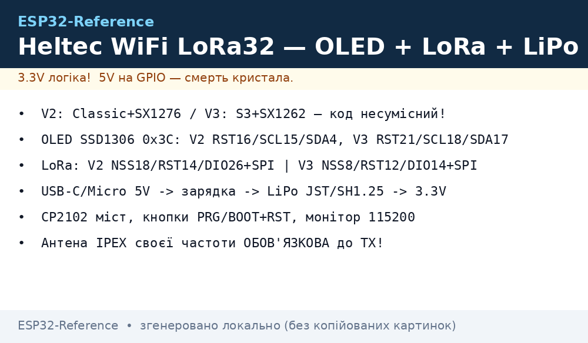
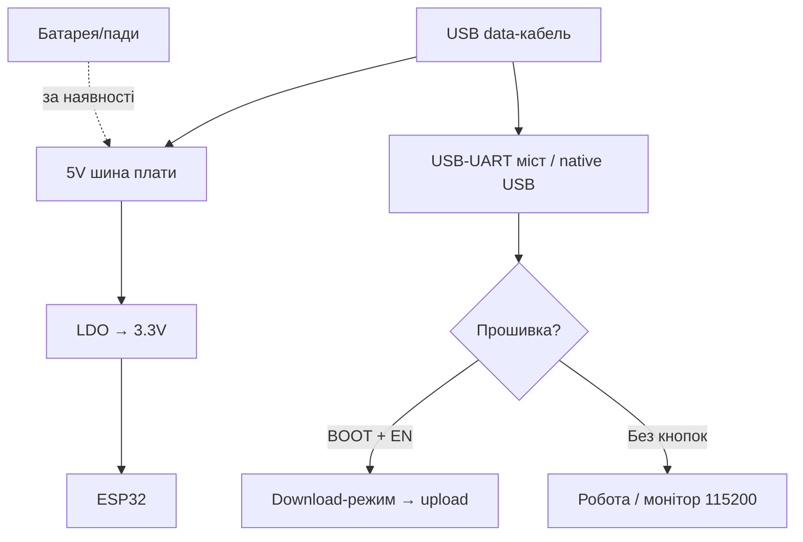

# Heltec WiFi LoRa 32

> [!tip] Навіщо Heltec
> Найзручніша плата для старту з LoRa: OLED для дебагу «без комп'ютера», нормальна документація і Arduino-бібліотека Heltec ESP32 з прикладами LoRa/LoRaWAN. Загальний огляд - [DevKit плати](../../../ESP32-Reference/00-Start/04-Devkit-plati.md), LoRa-база - [NRF24/LoRa](../../../ESP32-Reference/12-Moduli-zvyazku/02-NRF24-LoRa.md), OLED - [OLED](../../../ESP32-Reference/11-Vivid/01-OLED-SSD1306.md).
>
> [!warning] V2 ≠ V3!
> V2 - ESP32 Classic + SX1276. V3 - ESP32-S3 + SX1262, інша розпіновка і живлення. Код V2 на V3 не стане без правок. Звіряйте напис на шовкографії плати.

## Призначення

Heltec WiFi LoRa 32 (V2: Classic, V3: S3) - компактна плата 51×26 мм з вбудованим OLED 0.96" (SSD1306, 128×64), LoRa-трансивером з IPEX-антеною і роз'ємом LiPo-батареї із зарядкою. Призначення: LoRa-вузли з екраном статусу, Meshtastic/MeshCore-термінали, LoRaWAN-сенсори з дисплеєм, навчальні стенди LoRa point-to-point.

| Параметр | Значення |
| --- | --- |
| Призначення | LoRa-вузол з екраном, Meshtastic, LoRaWAN |
| Кристал | V2: ESP32 Classic / V3: ESP32-S3FN8 |
| Фішка | OLED + LoRa + батарея на одній малій платі |

## Характеристики

| Характеристика | V2 | V3 |
| --- | --- | --- |
| Модуль | ESP32-WROOM-32, 4 МБ Flash | ESP32-S3FN8, 8 МБ Flash (SiP), без PSRAM |
| LoRa | SX1276 (433/470/868/915 версії) | SX1262 (ті ж діапазони) |
| Потужність TX | До +20 дБм | До +21 дБм |
| Чутливість | −139 дБм @SF12 | −134 дБм @SF12 |
| OLED | 0.96" SSD1306 128×64, I2C 0x3C | Той же |
| USB-UART | CP2102 | CP2102 |
| USB | Micro-USB | USB-C |
| Батарея | JST 3.7V LiPo + зарядка | SH1.25-2P 3.7V + зарядка, автовмикання USB/батарея |
| Кнопки | RST + PRG(BOOT) | RST + BOOT |
| Розмір | 51×26 мм | 50×26 мм |
| Живлення | USB 5V / LiPo 3.7V | USB-C 5V / LiPo 3.7V |

> [!warning] Частота - при купівлі!
> 433 і 868 МГц - різні апаратні версії. Антена IPEX своєї частоти обов'язкова до першого TX. Без антени вихідний каскад згорає за секунди.

## Особливості розпіновки

OLED підключений жорстко і з'їдає I2C-шину:

| Вузол | V2 (Classic) | V3 (S3) |
| --- | --- | --- |
| OLED RST | GPIO16 | GPIO21 |
| OLED SCL | GPIO15 | GPIO18 |
| OLED SDA | GPIO4 | GPIO17 |
| LoRa NSS | GPIO18 | GPIO8 |
| LoRa RST | GPIO14 | GPIO12 |
| LoRa DIO0 | GPIO26 | GPIO14 |
| LoRa SCK/MOSI/MISO | GPIO5/27/19 | GPIO9/10/11 |
| Батарея ADC | GPIO13 (дільник) | GPIO1/ADC (дільник) |

Вільні GPIO V2: 0/2/12/13/17/21/22/23/25/32/33/34-39 (з обмеженнями strapping/ADC). Вільні GPIO V3: комфортні 1-7, 33-48 (S3 має багато пінів, але частина зайнята USB/JTAG). I2C-датчики вішайте на ті ж SDA/SCL, що й OLED (шина спільна, адреси різні). Деталі шин - [I2C](../../../ESP32-Reference/04-Shini/03-I2C.md), [SPI](../../../ESP32-Reference/04-Shini/02-SPI.md).

## Особливості живлення

| Джерело | Параметри | Примітка |
| --- | --- | --- |
| USB | 5V 500 мА+ | Прошивка + робота + зарядка |
| LiPo | 3.7V, роз'єм JST/SH1.25 | Зарядка ~300-500 мА, захист від перезаряду |
| 5V пін | Вхід 5V | Для польового живлення без USB |
| 3V3 пін | Вихід ~200-300 мА | Датчики, не реле! |

> [!tip] Батарейний режим
> Плата вміє працювати від LiPo без USB (автоперемикання). Але ESP32 Classic + LoRa в прийомі їсть 30-80 мА - 1000 мА·г вистачить на ~12-20 год прийому. Для місяців роботи потрібен deep-sleep з вимкненим LoRa і OLED, див. [Sleep](../../../ESP32-Reference/07-Timeri-Son/03-Sleep-ULP.md) та [Акумулятори](../../../ESP32-Reference/02-Zhivlennya/04-Akumulyatori-TP4056.md).

## Особливості USB-UART

Обидві версії - CP2102: найстабільніший міст, драйвер SiLabs (Linux/macOS з коробки, Windows - встановити). Швидкість 921600 працює на короткому кабелі, для надійності - 460800. Авторесет DTR/RTS розведений. Монітор порту - 115200.

## Кнопки

RST (EN, ресет) + PRG/BOOT (GPIO0, download). Комбінація для ручного режиму стандартна: тримати PRG → клік RST → відпустити PRG. На V3 кнопки підписані BOOT/RESET. У корпусі-чохлі (опція Heltec) кнопки натискаються через отвори - сірником/скріпкою.

## Для чого підходить

- Перший LoRa-проєкт: два Heltec, приклад LoRaSender/LoRaReceiver з бібліотеки - зв'язок за 10 хвилин.
- Meshtastic-вузол з екраном: V3 - офіційно підтримувана плата (ціль `heltec-v3`).
- LoRaWAN-сенсор з дисплеєм показів (температура/вологість/тиск).
- Польовий маяк з батареєю: GPS з [GPS-модулів](../../../ESP32-Reference/12-Moduli-zvyazku/03-SIM800L-GPS.md) + LoRa.
- НЕ підходить: як дешева навчальна плата (дорожча за DOIT), відео/камера (немає PSRAM на V3 - обережно з великими буферами), 5V-периферія без level-shifter.

## Прошивка

Arduino IDE: V2 - плата `Heltec WiFi LoRa 32(V2)`; V3 - `Heltec WiFi LoRa 32(V3)` (пакет Heltec ESP32). Обов'язково поставити бібліотеку `Heltec ESP32 Dev-Boards` для OLED+LoRa-прикладів.

```ini
; PlatformIO — Heltec V2
[env:heltec-v2]
platform = espressif32
board = heltec_wifi_lora_32_V2
framework = arduino
upload_speed = 921600
monitor_speed = 115200

; PlatformIO — Heltec V3 (S3 + SX1262)
[env:heltec-v3]
platform = espressif32
board = heltec_wifi_lora_32_V3
framework = arduino
upload_speed = 921600
monitor_speed = 115200
lib_deps = heltecautomation/Heltec ESP32 Dev-Boards@^2.1.0
```

```cpp
// Мінімум Heltec: OLED + LoRa (V2/V3 уніфіковано бібліотекою)
#include "heltec.h"
void setup() {
  Heltec.begin(true /*Display*/, true /*LoRa*/, true /*Serial*/, 915E6 /*частота!*/);
  Heltec.display->drawString(0, 0, "Heltec ready");
  Heltec.display->display();
  LoRa.beginPacket(); LoRa.print("hello"); LoRa.endPacket();
}
void loop() {}
```

Meshtastic: ціль `heltec-v3`, шити через flasher.meshtastic.org. ESP-IDF: V2 - ціль `esp32`, V3 - `esp32s3`. Деталі середовищ - [Arduino/PlatformIO](../../../ESP32-Reference/09-Proshivka/02-Arduino-PlatformIO.md).

## Типові помилки

| Симптом | Причина | Рішення |
| --- | --- | --- |
| Код V2 не компілюється на V3 | Інші піни LoRa/OLED, інший чип SX1262 | Взяти приклад під V3 з бібліотеки Heltec |
| LoRa мовчить | Не та частота / немає антени / не той SF | Звірити частоту плати і коду, накрутити антену |
| OLED чорний | Не викликано `display()` / не та адреса | `Heltec.display->display()`, адреса 0x3C |
| Плата гріється від батареї | LoRa в постійному TX, OLED на максимумі | Зменшити потужність TX, гасити OLED, sleep |
| Швидкий розряд LiPo | Прийом 24/7 без сну | Deep-sleep + періодичне пробудження |
| `Failed to connect` | Кабель charge-only / драйвер CP2102 | Data-кабель, драйвер SiLabs |
| Батарея не заряджається | USB-хаб без живлення | Безпосередньо в порт ПК або зарядку 5V 1A+ |

## Схема живлення та прошивки

> [!example] Фото/схема: 

```text
[USB-C/Micro 5V] ──► зарядка ──► LiPo 3.7V (JST/SH1.25) ─┐
        │                                               ├─► 3.3V ──► ESP32 + OLED + LoRa
        └──────────────► 5V пін (польове живлення) ──────┘
GND спільна! OLED на I2C (адр. 0x3C), LoRa-антена IPEX ОБОВ'ЯЗКОВА до TX!

[ПК] ─USB─► CP2102 ─TX─► RX / ─RX─◄ TX, DTR→EN, RTS→GPIO0 (авторесет)
Кнопки: PRG/BOOT(GPIO0) + RST(EN). Монітор 115200.
LoRa SPI: NSS/RST/DIO0 + SCK/MOSI/MISO (див. таблицю версії!).
```

## Офіційні джерела

- Heltec - сторінка WiFi LoRa 32 V3 (характеристики, фото, варіанти частот): <https://heltec.org/project/wifi-lora-32-v3/>
- Heltec Docs - WiFi LoRa 32 (документація, схеми, LoRaWAN-приклади): <https://docs.heltec.org/en/node/esp32/wifi_lora_32/index.html>

### Mermaid: живлення і перша прошивка плати



## Див. також

- [Головна карта](../../../ESP32-Reference/Home.md)
- [DevKit плати](../../../ESP32-Reference/00-Start/04-Devkit-plati.md)
- [NRF24/LoRa](../../../ESP32-Reference/12-Moduli-zvyazku/02-NRF24-LoRa.md)
- [01-OLED-SSD1306](../../../ESP32-Reference/11-Vivid/01-OLED-SSD1306.md)
- [I2C](../../../ESP32-Reference/04-Shini/03-I2C.md)
- [SPI](../../../ESP32-Reference/04-Shini/02-SPI.md)
- [Акумулятори TP4056](../../../ESP32-Reference/02-Zhivlennya/04-Akumulyatori-TP4056.md)
- [Sleep/ULP](../../../ESP32-Reference/07-Timeri-Son/03-Sleep-ULP.md)
- [Arduino/PlatformIO](../../../ESP32-Reference/09-Proshivka/02-Arduino-PlatformIO.md)
- [WiFi](../../../ESP32-Reference/05-Radio/01-WiFi-STA-AP.md)
- [FAQ](../../../ESP32-Reference/99-Dodatki/02-Troubleshooting-FAQ.md)
