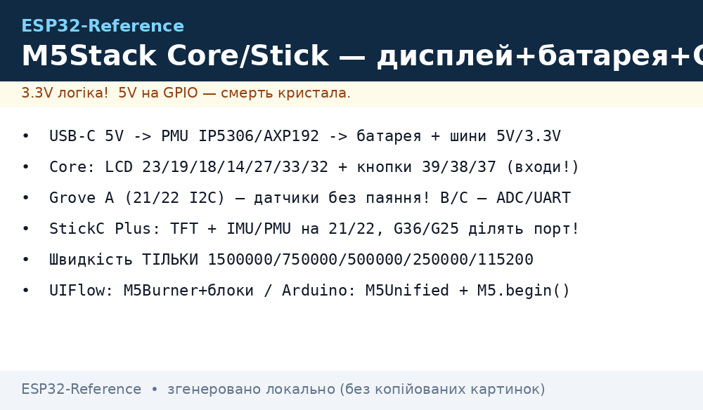
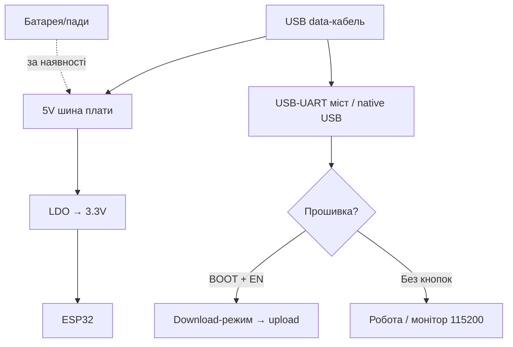

# M5Stack Core / Stick

> [!tip] Навіщо M5Stack
> Готовий продукт «з коробки»: дисплей + батарея + корпус + екосистема модулів Stack/Unit. Прототип виглядає як виріб, а не як макет з дротами. Ціна вища, зате економія часу величезна. Загальний огляд - [DevKit плати](../../../ESP32-Reference/00-Start/04-Devkit-plati.md), дисплеї - [TFT/LCD](../../../ESP32-Reference/11-Vivid/02-TFT-LCD-Epaper.md).
>
> [!warning] Екосистема закрита частково
> Розпіновка M-Bus/Grove своя, бібліотеки M5Unified/M5Stack - свої. Стандартні Arduino-приклади потребують адаптації пінів. Зате UIFlow дозволяє програмувати блоками без коду.

## Призначення

M5Stack Basic/Core2 - стекові контролери 54×54 мм: ESP32 + IPS-дисплей 2.0" (320×240) + батарея + слот microSD + динамік + 3 кнопки + Grove-порти. Модулі нарощуються «бутербродом» через M-Bus. M5StickC Plus - мініатюрний стік 48×24 мм: ESP32-PICO + TFT 1.14" (135×240) + батарея 120 мА·г + IMU + мікрофон + LED. Призначення: швидкі прототипи IoT-виробів, навчання (STEM), носимі пристрої, пульти, дашборди.

| Параметр | M5Stack Basic/Core2 | M5StickC Plus |
| --- | --- | --- |
| Призначення | Настільний контролер, хаб сенсорів | Носимий вузол, міні-пульт |
| Кристал | ESP32-D0WDQ6 (Basic) / ESP32-D0WD (Core2) | ESP32-PICO-D4 |
| Дисплей | 2.0" 320×240 IPS | 1.14" 135×240 TFT (ST7789v2) |

## Характеристики

| Характеристика | M5Stack Basic | M5Stack Core2 | M5StickC Plus |
| --- | --- | --- | --- |
| Кристал/модуль | ESP32-D0WDQ6, 16 МБ Flash | ESP32-D0WD, 16 МБ Flash + 8 МБ PSRAM | ESP32-PICO-D4, 4 МБ Flash |
| Дисплей | 2.0" ILI9342C 320×240 | 2.0" ILI9342C 320×240 + тач FT6336 | 1.14" ST7789v2 135×240 |
| Батарея | 110 мА·г, IP5306 | 390 мА·г, AXP192 | 120 мА·г, AXP192 |
| Звук | Динамік 1 Вт (DAC) | Динамік (I2S) + мікрофон | Зумер + мікрофон SPM1423 |
| Кнопки | 3× програмовані + Power | 3× сенсорні + Power + Reset | 2× (A/B) + Power/Reset |
| Порти | Grove A/B/C + M-Bus 30p | Grove A/B/C + M-Bus | Grove (I2C+IO+UART) + HAT |
| SD | microSD до 16 ГБ | microSD | Немає |
| USB | USB-C (CP2104/CH9102) | USB-C | USB-C |
| IMU | Немає (модулем) | MPU6886 (6-осьовий) | MPU6886 |
| RTC | Немає (модулем) | BM8563 | BM8563 |
| Розмір | 54×54×17 мм | 54×54×16 мм | 48×24×14 мм |

> [!tip] Живлення через M-Bus
> Нижня кришка (Base) містить батарею і роз'єм M-Bus: всі стекові модулі отримують 5V/3.3V/GND + I2C/SPI/UART через нього. Зовнішні датчики підключайте через Grove-кабелі (без паяння!), див. [I2C](../../../ESP32-Reference/04-Shini/03-I2C.md).

## Особливості розпіновки

M-Bus (30 пінів) виводить майже все, але частина зайнята:

| Сигнал | Basic/Core2 | Примітка |
| --- | --- | --- |
| LCD MOSI/MISO/CLK | GPIO23/19/18 | Зайняті дисплеєм |
| LCD CS/DC/RST/BL | GPIO14/27/33/32 | Зайняті, BL - PWM |
| SD MOSI/MISO/CLK/CS | GPIO23/19/18/4 | Спільний SPI з LCD |
| Кнопки A/B/C | GPIO39/38/37 | Тільки входи! |
| Динамік | GPIO25 (DAC, Basic) / I2S (Core2) | Зайнятий |
| Grove A (I2C) | GPIO21/22 | Вільна шина для сенсорів! |
| Grove B | GPIO26/36 | ADC/DAC |
| Grove C (UART) | GPIO16/17 | UART2 |
| Вільні M-Bus | GPIO2/5/12/13/15/0/1/3 | З обмеженнями strapping |

M5StickC Plus: Grove-порт G32/G33 + піни G0/G25/G26/G36 (G36/G25 ділять порт - одночасно один!). HAT-роз'єм додає ще піни. Внутрішні: TFT (15/13/23/18/5), IMU+PMU (21/22 I2C), мікрофон (0/34), LED/IR (10/9), RTC (21/22). Деталі strapping - [Strapping](../../../ESP32-Reference/03-GPIO/02-Strapping-pini.md).

## Особливості живлення

| Джерело | Параметри | Примітка |
| --- | --- | --- |
| USB-C 5V | 500 мА, зарядка + робота | C2C-кабелі на старих Basic не працюють! |
| Батарея | Basic 110 / Core2 390 / Stick 120 мА·г | Вистачає на 1-4 год активного екрана |
| Grove 5V | Вихід для Unit-модулів | Ліміт PMU (~500 мА сумарно) |
| Deep-sleep | AXP192/IP5306 ріжуть живлення вузлів | Stick вміє спати тижнями з таймером RTC |

> [!warning] USB-C ↔ USB-C на старих Basic
> Ревізії до 2018.2A не мають CC-резисторів - від C2C-кабелю і PD-зарядок не живляться. Використовуйте кабель A→C. На Core2/StickC Plus проблеми немає.

## Особливості USB-UART

Basic: CP2104 (старі) / CH9102 (нові). Core2: CP2104. StickC Plus: FTDI (вбудований). Швидкість завантаження специфічна для M5: 1500000 / 750000 / 500000 / 250000 / 115200 (інші швидкості дають збої!). Авторесет є. Драйвери: CP210x - SiLabs, CH9102 - WCH, FTDI - FTDIChip. Деталі - [USB-UART](../../../ESP32-Reference/13-Moduli-zhivlennya-rivniv/05-USB-UART-AutoReset.md).

## Кнопки

Basic: A/B/C (GPIO39/38/37) + червона Power (вкл - клік, викл - дабл-клік; при підключеному USB не вимикається!). Core2: сенсорні A/B/C + Power + Reset. StickC Plus: A (GPIO37) / B (GPIO39) + Power (клік - вкл/reset, утримання - викл). У UIFlow кнопки мапляться готовими блоками.

## Для чого підходить

- Прототип виробу за вечір: Core + ENV Unit (температура) + Relay Unit = термостат з екраном, без паяння.
- STEM-навчання: UIFlow-блоки, діти збирають програми мишкою.
- Носимий бейдж/пульт: StickC Plus з IMU (жести) + IR (керування телевізором).
- Дашборд MQTT/Home Assistant: Core2 з тачем як настільна панель.
- НЕ підходить: мінімальна ціна (DOIT у 5 разів дешевший), глибоке залізо (частина пінів захована), батарейні місяці роботи з екраном (екран їсть десятки мА).

## Прошивка: UIFlow vs Arduino

UIFlow (блоки/MicroPython): підключити по USB → M5Burner → прошити UIFlow-firmware → писати блоки в браузері. Ідеально для старту і STEM. Arduino: пакет `M5Stack` (плата `M5Stack-Core-ESP32` / `M5Stick-C`), бібліотека `M5Unified` (нова, універсальна) або `M5Stack`/`M5StickCPlus` (старі).

```ini
; PlatformIO — M5Stack Core
[env:m5stack-core]
platform = espressif32@6.7.0
board = m5stack-core-esp32
framework = arduino
upload_speed = 1500000
monitor_speed = 115200
lib_deps = m5stack/M5Unified@^1.1.0

; PlatformIO — M5StickC Plus
[env:m5stickc-plus]
platform = espressif32@6.7.0
board = m5stick-c
framework = arduino
upload_speed = 1500000
monitor_speed = 115200
lib_deps = m5stack/M5Unified@^1.1.0
```

```cpp
// Arduino + M5Unified (працює на Core і Stick)
#include <M5Unified.h>
void setup() {
  M5.begin();
  M5.Display.fillScreen(BLACK);
  M5.Display.drawString("Pryvit M5!", 20, 60);
}
void loop() {
  M5.update(); // кнопки!
  if (M5.BtnA.wasPressed()) M5.Display.fillScreen(RED);
  delay(50);
}
```

ESP-IDF: підтримується через M5Unified. MicroPython: UIFlow - це і є MicroPython з обгорткою.

## Типові помилки

| Симптом | Причина | Рішення |
| --- | --- | --- |
| Не шиється на 921600 | M5 вимагає свої швидкості | 1500000 або 750000 або 115200 |
| Не живиться від C2C | Старий Basic без CC-резисторів | Кабель USB-A → USB-C |
| Не вимикається кнопкою | USB підключений (так задумано) | Вимкити USB, потім дабл-клік Power |
| G36 не читає, коли G25 вихід | Ділять порт (StickC) | Другий пін у floating-input |
| Екран білий/перевернуті кольори | Стара бібліотека (TN→IPS зміна) | Оновити M5Stack lib ≥0.2.8 / M5Unified |
| Grove-сенсор не видно | Не той порт (A/B/C різні шини) | I2C-датчик тільки в порт A (21/22) |
| Швидкий розряд | Екран + Wi-Fi постійно | Гасити підсвітку, sleep, більший Base-акумулятор |

## Схема живлення та прошивки

> [!example] Фото/схема: 

```text
[USB-C 5V] ──► PMU (IP5306/AXP192) ──► заряд батареї + 5V/3.3V шини
  Батарея: Basic 110 / Core2 390 / Stick 120 мА·г. Від USB не вимикається!
  M-Bus/Grove: 5V+GND+I2C(21/22)+SPI+UART — модулі без паяння.

[ПК] ─USB-C─► CP2104/CH9102/FTDI ─► UART0, авторесет є.
  Швидкість ТІЛЬКИ: 1500000/750000/500000/250000/115200!
Кнопки: A/B/C + Power (дабл-клік = викл, без USB). Дисплей: BLK-PWM.
UIFlow: M5Burner → блоки в браузері. Arduino: M5Unified + M5.begin().
```

## Офіційні джерела

- M5Stack - офіційний сайт виробника (каталог Core/Stick, живі фото): <https://m5stack.com/>
- M5Stack Docs - M5Stack Basic (схема, M-Bus, Grove, живлення): <https://docs.m5stack.com/en/core/basic>
- M5Stack Docs - M5StickC Plus (розпіновка, AXP192, приклади): <https://docs.m5stack.com/en/core/m5stickc_plus>

### Mermaid: живлення і перша прошивка плати



- MPU6886 (TDK InvenSense): <https://invensense.tdk.com/products/motion-tracking/6-axis/mpu-6886/> - 6-axis IMU (кастом для M5Stack).
- BM8563 Datasheet (NXP, пошук PDF): [BM8563 search](https://www.alldatasheet.com/view.jsp?Searchword=BM8563) - RTC з будильником, I2C.

## Див. також

- [Головна карта](../../../ESP32-Reference/Home.md)
- [DevKit плати](../../../ESP32-Reference/00-Start/04-Devkit-plati.md)
- [TFT/LCD/E-paper](../../../ESP32-Reference/11-Vivid/02-TFT-LCD-Epaper.md)
- [I2C](../../../ESP32-Reference/04-Shini/03-I2C.md)
- [SPI](../../../ESP32-Reference/04-Shini/02-SPI.md)
- [BME280](../../../ESP32-Reference/10-Sensori/03-BME280-BMP280-SHT31.md)
- [Акумулятори TP4056](../../../ESP32-Reference/02-Zhivlennya/04-Akumulyatori-TP4056.md)
- [Sleep/ULP](../../../ESP32-Reference/07-Timeri-Son/03-Sleep-ULP.md)
- [Arduino/PlatformIO](../../../ESP32-Reference/09-Proshivka/02-Arduino-PlatformIO.md)
- [MicroPython](../../../ESP32-Reference/09-Proshivka/03-MicroPython.md)
- [FAQ](../../../ESP32-Reference/99-Dodatki/02-Troubleshooting-FAQ.md)
