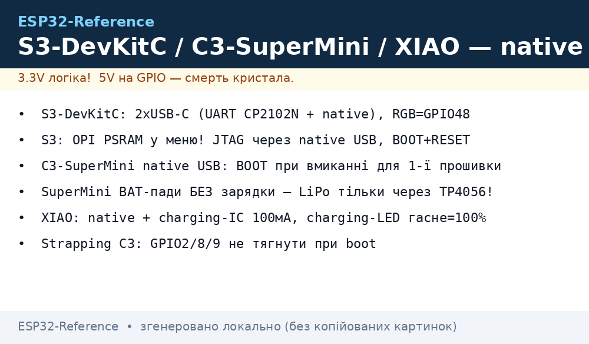
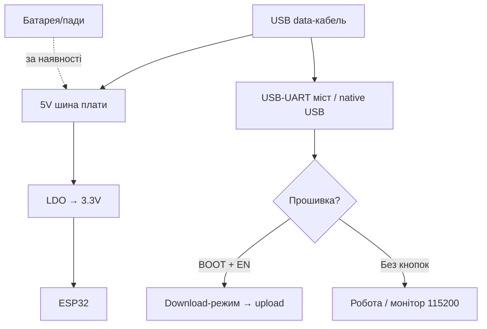

# S3-DevKitC / C3-SuperMini / XIAO

> [!tip] Навіщо нове покоління
> S3-DevKitC-1 - камера, дисплеї, USB-OTG і нейромережі. C3 SuperMini / XIAO C3 - крихітні батарейні датчики з BLE 5. XIAO S3/Sense - камера + мікрофон у 21×18 мм. Порівняння кристалів - [Порівняння чипів](../../../ESP32-Reference/00-Start/03-Porivnyannya-chipiv.md), огляд плат - [DevKit плати](../../../ESP32-Reference/00-Start/04-Devkit-plati.md).
>
> [!warning] Native USB замість моста!
> На S3/C3 прошивка йде через вбудований USB-CDC, а не окремий чип. Перша прошивка вимагає утримання BOOT, швидкості інші, монітор «зникає» при sleep. Деталі - [USB/JTAG](../../../ESP32-Reference/04-Shini/06-USB-OTG-JTAG.md).

## Призначення

ESP32-S3-DevKitC-1 - повнорозмірна налагоджувальна плата (68×54 мм) для S3: 45 програмованих GPIO, Octal PSRAM, 2×USB-C (UART + native), RGB-LED, кнопки BOOT/RESET. Призначення: камери, паралельні дисплеї, USB-пристрої, TinyML. C3 SuperMini (23×18 мм) - найдешевший Wi-Fi/BLE-вузол: 4 МБ Flash, native USB-C, deep-sleep ~15 мкА. XIAO ESP32C3/S3 (21×18 мм, Seeed) - «фірмовий» малюк: якісна антена (U.FL + PCB), charging-LED, Grove-шилди розширення, документація-рівень-Adafruit.

| Параметр | S3-DevKitC-1 | C3 SuperMini | XIAO C3 / S3 |
| --- | --- | --- | --- |
| Призначення | Камера/дисплеї/USB | Міні-датчики, маяки | Якісні міні-вироби |
| Кристал | S3 dual-core 240 МГц + AI | C3 RISC-V 160 МГц | C3 / S3R8 (8 МБ PSRAM у S3) |
| Розмір | 68×54 мм | 23×18 мм | 21×18 мм |

## Характеристики

| Характеристика | S3-DevKitC-1 | C3 SuperMini | XIAO ESP32C3 | XIAO ESP32S3 (Sense) |
| --- | --- | --- | --- | --- |
| Flash / PSRAM | 8-32 МБ / 8-16 МБ Octal | 4 МБ / немає | 4 МБ / немає | 8 МБ / 8 МБ |
| USB | 2× USB-C: UART (CP2102N) + native | 1× USB-C native | 1× USB-C native | 1× USB-C native |
| LED | RGB (GPIO48) + живлення | Синій (GPIO8) + живлення | Помаранчевий user + червоний charging | Ті ж + expansion |
| Кнопки | BOOT (GPIO0) + RESET | BOOT + RESET (крихітні!) | BOOT + RESET | BOOT + RESET |
| Батарея | Немає (паяти самому) | Пади BAT/GND (без зарядки!) | Пади BAT + charging-IC | Пади BAT + charging-IC |
| ADC | ~20 каналів, калібрований | 6 каналів ADC1 | 4 канали | 9 каналів |
| Камера | Роз'єм під OV2640/5640-модуль | Немає | Немає | OV2640/3660 на Sense-платі + мікрофон |
| Розмір | 68×54 мм | 23×18 мм | 21×18 мм | 21×18 мм (+21×39 Sense) |

> [!tip] XIAO Sense
> XIAO ESP32S3 Sense = малюк + expansion-плата з камерою OV3660, мікрофоном і слотом SD. Працює приклад CameraWebServer. Увага: камера їсть ~100 мА - від LiPo 300 мА·г вистачить на ~2 год стріму.

## Особливості розпіновки

S3-DevKitC-1: виведені майже всі GPIO 0-48 (крім зайнятих Flash/PSRAM: 26-37). USB-UART порт окремо, native-порт окремо - не переплутайте (шити через UART-порт!). RGB-LED на GPIO48 (бібліотека NeoPixel). JTAG вбудований через USB - дебаг без адаптера, див. [JTAG](../../../ESP32-Reference/09-Proshivka/05-JTAG-Debug.md).

C3 SuperMini (типова розпіновка): GPIO0-10 + 20/21 + RX/TX(20/21), I2C 8/9? - залежить від виробника! Увага: клонів SuperMini багато, схеми різняться. Strapping C3: GPIO2/8/9 - не тягнути при boot. ADC: тільки ADC1 (6 каналів), зате без Wi-Fi конфлікту. Деталі C3 - [C3/C6/H2](../../../ESP32-Reference/01-Hardware/04-ESP32-C3-C6-H2.md).

XIAO (стандарт Seeed): D0-D10 → GPIO1-10 (C3) / GPIO1-9,43,44 (S3), SDA/SCL, SCK/MISO/MOSI підписані. Charging-LED гасне при повному заряді. User-LED (помаранчевий) - на окремому GPIO (див. wiki плати). Пади BAT ззаду: +/− під LiPo 3.7V.

## Особливості живлення

| Джерело | S3-DevKitC-1 | C3 SuperMini / XIAO |
| --- | --- | --- |
| USB-C 5V | 500 мА+, LDO→3.3V | Те саме, ME6211/LDO малопотужний |
| Пін 5V | Вхід/вихід 5V шини | Вхід 5V (SuperMini), вихід USB (XIAO) |
| Пін 3V3 | Вихід ~500 мА | Вихід ~300-500 мА (XIAO - до 700 мА пік) |
| Батарея | Немає штатно | SuperMini: пади BAT без зарядки (потрібен TP4056!); XIAO: пади + charging-IC 100 мА |
| Deep-sleep | ~10 мкА (S3, USB вимкений) | C3 ~15 мкА, XIAO C3 ~44 мкА (charging-IC їсть!) |

> [!warning] SuperMini + LiPo безпосередньо = пожежа/вбивство плати
> На C3 SuperMini пади BAT - це ВХІД 3.7-5V без захисту і зарядки! LiPo туди можна, але заряджати тільки зовнішнім TP4056, див. [Заряд/BMS](../../../ESP32-Reference/13-Moduli-zhivlennya-rivniv/03-TP4056-IP5306-BMS-UPS.md). XIAO має вбудовану зарядку - там безпечно.

## Особливості USB-UART

S3-DevKitC-1 має ОБИДВА: CP2102N (UART-порт, драйвер SiLabs) + native USB S3 (другий роз'єм). Шити можна через будь-який; нативний вимагає BOOT при першій прошивці. C3 SuperMini / XIAO - тільки native USB-CDC: драйвера не треба, але потрібен data-кабель і правильна послідовність: утримати BOOT → вставити USB → відпустити → шити. Швидкість native - повна, baud не критичний. Якщо порт зник після sleep - натисніть Reset. Деталі - [USB-UART](../../../ESP32-Reference/13-Moduli-zhivlennya-rivniv/05-USB-UART-AutoReset.md).

## Кнопки

S3-DevKitC-1: великі BOOT + RESET - зручно. SuperMini: мікроскопічні, потрібен пінцет/ніготь; BOOT утримувати при вмиканні для download. XIAO: маленькі, але доступні; подвійний клік Reset на деяких прошивках = UF2-bootloader (перетягнути .uf2 файл!). RGB/user/charging LED допомагають зрозуміти режим.

## Для чого підходить

- S3-DevKitC-1: камера-проєкти, квадратні дисплеї 480×480, USB-клавіатури/мікрофони, TinyML (розпізнавання жестів/мовлення), дебаг через вбудований JTAG.
- C3 SuperMini: BLE-маяки, датчики дверей/температури на батареї, найдешевші Wi-Fi вузли (ціна кави).
- XIAO C3: ті ж + якість і документація, Grove-екосистема розширення.
- XIAO S3 Sense: міні-камера з мікрофоном, ML-трекер диких тварин, дверний дзвінок.
- НЕ підходить: S3 - для мініатюр (велика), SuperMini - для камер/дисплеїв (немає PSRAM/пінів), XIAO - для 5V-периферії (все одно 3.3V!).

## Прошивка

Arduino IDE: S3 - `ESP32S3 Dev Module`, USB CDC On Boot `Enabled`, PSRAM `OPI PSRAM`; C3 - `ESP32C3 Dev Module` / `XIAO_ESP32C3`; S3 XIAO - `XIAO_ESP32S3`. Пакет esp32 ≥2.0.8 (для XIAO).

```ini
; PlatformIO — S3 DevKitC
[env:s3-devkitc]
platform = espressif32
board = esp32-s3-devkitc-1
framework = arduino
upload_speed = 921600
monitor_speed = 115200
board_build.psram_type = opi
build_flags = -DBOARD_HAS_PSRAM

; PlatformIO — XIAO C3 / C3 SuperMini
[env:xiao-c3]
platform = espressif32
board = seeed_xiao_esp32c3
framework = arduino
monitor_speed = 115200

; PlatformIO — XIAO S3
[env:xiao-s3]
platform = espressif32
board = seeed_xiao_esp32s3
framework = arduino
monitor_speed = 115200
board_build.psram_type = opi
```

Перша прошивка native USB: утримувати BOOT → підключити USB → шити → Reset. ESP-IDF: цілі `esp32s3` / `esp32c3`. UF2 (XIAO): дабл-клік Reset → диск → перетягнути прошивку.

## Типові помилки

| Симптом | Причина | Рішення |
| --- | --- | --- |
| Порт не з'являється (C3/XIAO) | Не в download-режимі / charge-кабель | BOOT+підключити, data-кабель |
| Порт зник після прошивки | USB CDC не ввімкнено / sleep | USB CDC On Boot Enabled, Reset |
| S3 шиється в один порт, монітор в інший | Два роз'єми переплутані | UART-порт для прошивки, native для USB-проєктів |
| Камера на S3 без PSRAM не йде | PSRAM вимкнено в меню | OPI PSRAM + `BOARD_HAS_PSRAM` |
| SuperMini не стартує від LiPo | Немає зарядки/захисту, батарея в 0 | Зовнішній TP4056 + захищена батарея |
| XIAO гріється при зарядці | Норма (charging-IC) | Не накривати, струм 100 мА штатний |
| GPIO8/9 валять boot (C3) | Strapping-піни | Не підтягувати при старті |
| Старі приклади не компілюються | Пакет esp32 застарий | Оновити до ≥2.0.8 (XIAO) / ≥3.x (S3) |

## Схема живлення та прошивки

> [!example] Фото/схема: 

```text
S3-DevKitC-1: [USB-C UART-порт] ─► CP2102N ─► прошивка. [USB-C native] ─► S3-USB.
  5V ──► LDO ──► 3.3V (≤500 мА датчикам). Кнопки BOOT+RESET великі. RGB=GPIO48.
  Камера/дисплей — через PSRAM (OPI). JTAG — через native USB без адаптера!

C3 SuperMini: [USB-C native] ─► C3-USB (BOOT при вмиканні для 1-ї прошивки).
  BAT-пади БЕЗ зарядки — LiPo тільки через зовнішній TP4056!
XIAO C3/S3: [USB-C] ─► native + charging-IC ─► LiPo-пади (charging-LED гасне=100%).
  User-LED помаранчевий. Дабл-Reset = UF2-диск. I2C-датчики на SDA/SCL.
```

## Офіційні джерела

- Espressif - гайд ESP32-S3-DevKitC-1 (розпіновка, 2×USB, живлення): <https://docs.espressif.com/projects/esp-idf/en/latest/esp32s3/hw-reference/esp32s3/user-guide-devkitc-1.html>
- Espressif - гайд ESP32-C3-DevKitM-1 (C3 живлення, native USB, strapping): <https://docs.espressif.com/projects/esp-idf/en/latest/esp32c3/hw-reference/esp32c3/user-guide-devkitm-1.html>
- Seeed Wiki - XIAO ESP32C3 Getting Started (малюк, батарея, charging LED): <https://wiki.seeedstudio.com/XIAO_ESP32C3_Getting_Started/>
- Seeed Wiki - XIAO ESP32S3 Getting Started (Sense-камера, PSRAM, UF2): <https://wiki.seeedstudio.com/xiao_esp32s3_getting_started/>

### Mermaid: живлення і перша прошивка плати



## Див. також

- [Головна карта](../../../ESP32-Reference/Home.md)
- [DevKit плати](../../../ESP32-Reference/00-Start/04-Devkit-plati.md)
- [Порівняння чипів](../../../ESP32-Reference/00-Start/03-Porivnyannya-chipiv.md)
- [C3/C6/H2](../../../ESP32-Reference/01-Hardware/04-ESP32-C3-C6-H2.md)
- [USB/JTAG](../../../ESP32-Reference/04-Shini/06-USB-OTG-JTAG.md)
- [JTAG](../../../ESP32-Reference/09-Proshivka/05-JTAG-Debug.md)
- [RS485/CAN/Камера](../../../ESP32-Reference/12-Moduli-zvyazku/04-RS485-CAN-Ethernet-Kamera.md)
- [Заряд/BMS](../../../ESP32-Reference/13-Moduli-zhivlennya-rivniv/03-TP4056-IP5306-BMS-UPS.md)
- [Sleep/ULP](../../../ESP32-Reference/07-Timeri-Son/03-Sleep-ULP.md)
- [Arduino/PlatformIO](../../../ESP32-Reference/09-Proshivka/02-Arduino-PlatformIO.md)
- [FAQ](../../../ESP32-Reference/99-Dodatki/02-Troubleshooting-FAQ.md)
