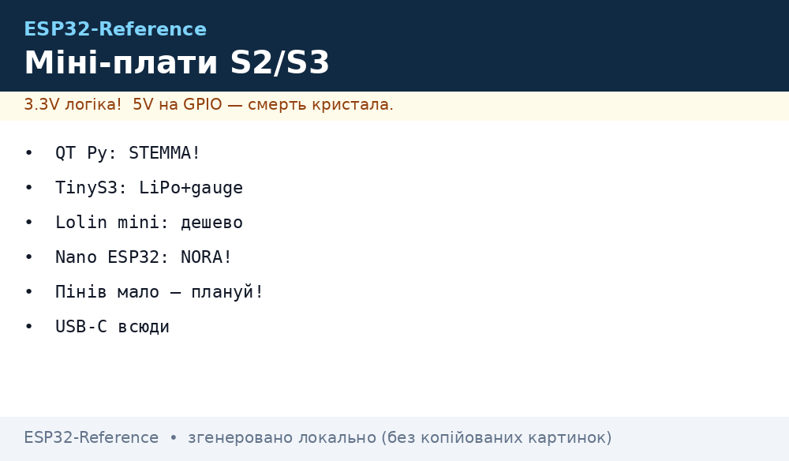
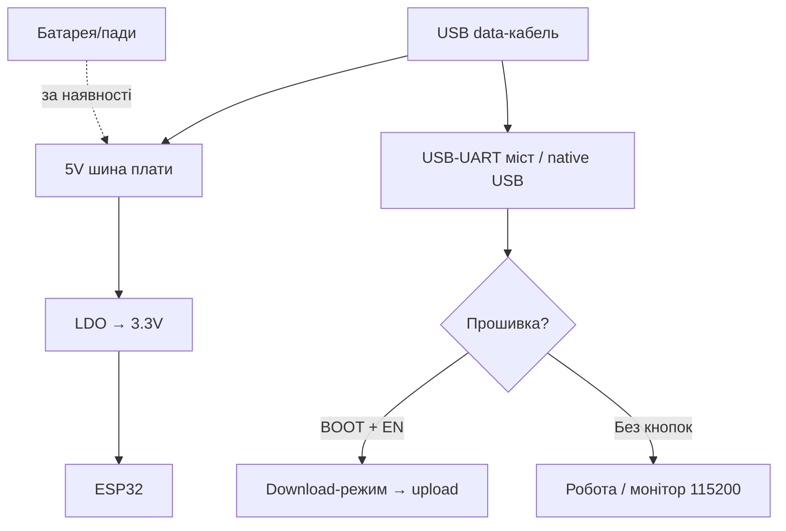

# Mini-Boards: QT Py / TinyS3 / Lolin mini / Nano ESP32

> [!tip] Навіщо міні-формат
> Коли DOIT DevKit завеликий, а XIAO (див. [S3/C3/XIAO](../../../ESP32-Reference/14-Devboards/08-S3-DevKitC-C3-SuperMini-XIAO.md)) замалий за можливостями - беруть «середніх малюків»: Adafruit QT Py (STEMMA-екосистема!), Unexpected Maker TinyS3/FeatherS3 (преміум + LiPo + монітор батареї!), Lolin S2/S3 mini (Wemos-спадщина, D1-mini-формфактор), Arduino Nano ESP32 (офіційна, Arduino-екосистема). Загальний огляд - [DevKit плати](../../../ESP32-Reference/00-Start/04-Devkit-plati.md), порівняння кристалів - [Порівняння чипів](../../../ESP32-Reference/00-Start/03-Porivnyannya-chipiv.md).
>
> [!warning] Мало пінів і native USB!
> Усі герої ноти (крім Nano ESP32 з мостом) прошиваються через вбудований USB-S3/S2, а не окремий UART-чип: перша прошивка вимагає BOOT, потрібен data-кабель. Пінів 11-27, тож камери/паралельні дисплеї - не сюди. Деталі - [USB/JTAG](../../../ESP32-Reference/04-Shini/06-USB-OTG-JTAG.md).

## Призначення

Adafruit QT Py ESP32-S2/S3 (22×18 мм) - малюки з роз'ємом STEMMA QT (SparkFun Qwiic-сумісний): I2C-датчики підключаються шлейфом без паяння. XIAO-сумісний футпринт з кастельованими падами - плату можна паяти плазом на власну PCB. Unexpected Maker TinyS3 (36×18 мм) / FeatherS3 (52×23 мм) - «преміум-малюки» з Австралії: 8-16 МБ Flash, 8 МБ PSRAM, зарядка LiPo, I2C fuel gauge (монітор батареї!), подвійні антени (PCB + u.FL). Lolin S2 mini / S3 mini (34×25 мм) - спадщина Wemos D1 mini: той же крок, сумісність з D1-mini-шилдами, MicroPython з коробки. Arduino Nano ESP32 - офіційна плата Arduino на модулі u-blox NORA-W106 (всередині ESP32-S3): Nano-формфактор, USB-C, 16 МБ Flash, офіційна підтримка MicroPython і Arduino Cloud.

| Параметр | QT Py S2/S3 | TinyS3 / FeatherS3 | Lolin S2/S3 mini | Nano ESP32 |
| --- | --- | --- | --- | --- |
| Призначення | STEMMA-датчики, носимі | Преміум батарейні вироби | Дешеві mini-вузли, D1-шилди | Arduino-екосистема, освіта |
| Кристал | S2 (без BLE!) / S3 | S3 | S2 / S3 | S3 (NORA-W106) |
| Розмір | 22×18 мм | 36×18 / 52×23 мм | 34×25 мм | 45×18 мм (Nano) |

## Характеристики

| Характеристика | QT Py S2 | QT Py S3 | TinyS3 | FeatherS3 | S2 mini / S3 mini | Nano ESP32 |
| --- | --- | --- | --- | --- | --- | --- |
| Кристал | ESP32-S2, 1 ядро 240 МГц | ESP32-S3, 2 ядра 240 МГц | ESP32-S3FN8 | ESP32-S3 | S2FN4R2 / S3FH4R2 | S3 (NORA-W106) |
| Flash / PSRAM | 4 МБ / 2 МБ | 8 МБ / 0 або 4 МБ / 2 МБ (2 версії!) | 8 МБ / 8 МБ | 16 МБ / 8 МБ | 4 МБ / 2 МБ | 16 МБ / 8 МБ |
| BLE | Немає (S2 без BLE!) | BLE 5 | BLE 5 + Mesh | BLE 5 + Mesh | S2: немає / S3: BLE 5 | BLE 5 |
| USB | USB-C native | USB-C native | USB-C native + Serial/JTAG | USB-C native + Serial/JTAG | USB-C native + OTG | USB-C (міст + native) |
| GPIO виведено | 13 (11 падів + 2 на QT) | 13 (11 падів + 2 на QT) | 17 | 21 | 27 | ~20 (Nano-гребінка) |
| I2C-роз'єм | STEMMA QT (Qwiic-сумісний!) | STEMMA QT | Немає | 2× STEMMA QT (на різних LDO!) | Немає (D1-шилди) | Немає |
| Батарея/зарядка | Пади під LiPo (діод, без зарядки!) | Пади під LiPo (діод, без зарядки!) | JST + зарядка + fuel gauge! | JST PH + зарядка + fuel gauge! | Пади (без зарядки!) | Пади (без зарядки) |
| RGB LED | NeoPixel + пін живлення | NeoPixel + пін живлення | RGB (через IO) | RGB (LDO2!) | S3 mini: RGB на IO47 | RGB + вбудований LED |
| Розмір | 22×18 мм | 22×18 мм | 36×18 мм | 52×23 мм | 34×25 мм | 45×18 мм |
| Ціна-орієнтир | ~$10 | ~$13-15 | ~$25-30 | ~$35-40 | ~$5-8 | ~$22-25 |

> [!tip] Дві версії QT Py S3
> Існує версія 8 МБ Flash без PSRAM (для CircuitPython з BLE) і версія 4 МБ Flash + 2 МБ PSRAM. Для Arduino/камери/дисплея беріть версію з PSRAM; для CircuitPython+BLE - 8-МБ.
>
> [!tip] Родичі Lolin
> Окрім mini, у Wemos-лінійці є повнорозмірна Lolin S3 і компактна S3 Zero - той же S3FH4R2, інший формфактор. Уся документація (схеми PDF, розміри, туторіали Arduino/MicroPython) лежить на wemos.cc в розділах S2/S3.

## Особливості розпіновки

QT Py: 11 падів + SDA/SCL на STEMMA QT-конекторі. Аналогових входів ~10 (високошвидкісні SPI-пади - без ADC). PWM/I2C/SPI/UART/I2S на будь-яких пінах (матриця S2/S3), 5× capacitive touch без обв'язки. Кастельовані краї = XIAO-сумісність. NeoPixel з окремим піном живлення - гасіть його для ultra-low sleep (~70 мкА разом з платою).

TinyS3: 17 GPIO на гребінці, TinyPICO-сумісність. FeatherS3: 21 GPIO у Feather-форматі (сумісність з Feather-шилдами!), 2× STEMMA QT - один на LDO1, другий на LDO2 (датчики на LDO2 гаснуть у deep-sleep автоматично!). RGB-діод живиться від керованого піна/LDO2 - перед використанням увімкніть живлення (див. pinout-картку плати).

Lolin S2/S3 mini: 27 IO з кроком D1 mini - стають на макетку і в D1-шилди (реле, датчики, дисплеї). Strapping S2: GPIO0/45/46; S3: GPIO0/3/45/46 - не тягнути при boot. RGB на S3 mini - IO47. Деталі strapping - [Strapping](../../../ESP32-Reference/03-GPIO/02-Strapping-pini.md).

Nano ESP32: класична Nano-гребінка (сумісність з Arduino-шилдами за кроком, але логіка 3.3V!). Частина пінів зайнята під USB-міст і RGB. Офіційна розпіновка - PDF на сторінці плати.

## Особливості живлення

| Джерело | QT Py | TinyS3 / FeatherS3 | Lolin mini | Nano ESP32 |
| --- | --- | --- | --- | --- |
| USB-C 5V | Робота + живлення датчиків | Робота + зарядка батареї | Робота | Робота + зарядка логіки |
| Пін 5V | Вхід/вихід шини | Вхід 4.8-5.2V / вихід ~4.9V | Вхід/вихід | Вхід/вихід (Vin) |
| Пін 3V3 | Вихід до 600 мА пік (AP2112) | Вихід 700 мА (LDO, у Feather - 2×!) | Вихід ~500 мА | Вихід (ліміт моста) |
| Батарея | Пади + діод до 6V, БЕЗ зарядки | JST + зарядка + fuel gauge (I2C!) | Пади без зарядки | Пади без зарядки |
| Deep-sleep | ~70 мкА (NeoPixel згашений) | Одиниці мкА (LED ізольовані від батареї!) | Сотні мкА (залежить від ревізії) | Вище (міст + RGB їдять) |

> [!warning] Батарея ≠ зарядка
> QT Py і Lolin mini мають лише ВХІД під батарею без charging-IC: LiPo заряджайте зовнішнім TP4056, див. [Заряд/BMS](../../../ESP32-Reference/13-Moduli-zhivlennya-rivniv/03-TP4056-IP5306-BMS-UPS.md). Тільки TinyS3/FeatherS3 заряджають LiPo штатно і вміють будити S3 по перериванню fuel gauge (низький заряд!).
>
> [!warning] Не в 3V3 і не в 5V!
> Батарею - тільки на BAT/VBAT-пади. У 3V3 - вб'єте S3 (4.2V > 3.3V!). У 5V - тільки стабільні 4.8-5.2V, інакше гойдалки живлення і «дивні» ребути.

## Особливості USB-UART

QT Py / Lolin mini: тільки native USB-CDC. Драйвера не треба, але кабель - обов'язково data. Перша прошивка: утримати BOOT → вставити USB → шити → Reset. Після deep-sleep порт «зникає» - натисніть Reset. Lolin за замовчуванням з MicroPython-прошивкою - порт видно як CDC одразу.

TinyS3/FeatherS3: native USB + USB Serial/JTAG. З коробки - CircuitPython з UF2-bootloader: дабл-клік Reset = диск для перетягування .uf2. Перехід між CircuitPython/MicroPython/Arduino: стерти Flash → BOOT+Reset → шити нове. RX/TX-піни НЕ з'єднані з USB - це вільний UART0 для модулів! Деталі - [USB-UART](../../../ESP32-Reference/13-Moduli-zhivlennya-rivniv/05-USB-UART-AutoReset.md).

Nano ESP32: класичний міст (драйвер потрібен) + native S3. Arduino IDE шиє через міст без танців з BOOT. Для MicroPython - офіційний інсталятор Arduino Lab for MicroPython.

## Кнопки

QT Py: Reset + BOOT/GPIO0 (маленькі, але доступні). Дабл-Reset на CircuitPython = UF2-диск. Lolin mini: BOOT + RST крихітні - пінцет у поміч; BOOT утримувати при вмиканні для першої прошивки. TinyS3/FeatherS3: BOOT + Reset + RGB-індикація режимів (фіолетовий = CircuitPython завантаження, зелений = UF2-диск змонтовано). Nano ESP32: Reset + BOOT під USB-C, плюс RGB-діод статусу прошивки в Arduino IDE.

## Порівняльна таблиця: розмір / піни / батарея / ціна

| Плата | Розмір, мм | GPIO | Батарея / зарядка | Монітор батареї | Ціна-орієнтир |
| --- | --- | --- | --- | --- | --- |
| QT Py S2 | 22×18 | 13 | Пади, без зарядки | Немає | ~$10 |
| QT Py S3 | 22×18 | 13 | Пади, без зарядки | Немає | ~$13-15 |
| TinyS3 | 36×18 | 17 | JST + зарядка | I2C fuel gauge! | ~$25-30 |
| FeatherS3 | 52×23 | 21 | JST PH + зарядка | I2C fuel gauge! | ~$35-40 |
| S2 mini | 34×25 | 27 | Пади, без зарядки | Немає | ~$5-6 |
| S3 mini | 34×25 | 27 | Пади, без зарядки | Немає | ~$6-8 |
| Nano ESP32 | 45×18 | ~20 | Пади, без зарядки | Немає | ~$22-25 |

> [!tip] Як читати таблицю
> Ціни - вуличний орієнтир (перевіряйте магазини). Найдешевший вхід - Lolin mini; найкраща батарея - TinyS3/FeatherS3; найменший - QT Py; найкраща Arduino-сумісність - Nano ESP32.

## Для чого підходить

- QT Py S2: найдешевші BLE-... ні, S2 без BLE! QT Py S2 - Wi-Fi-датчики без BLE, USB-HID (клавіатура/миша), STEMMA-прототипи без паяння.
- QT Py S3: BLE+Wi-Fi малюки, носимі, USB-MIDI/HID, датчики на STEMMA-шлейфах.
- TinyS3: батарейні вироби «поставив і забув» (датчик пошти, трекер, маяк) - fuel gauge скаже, коли міняти LiPo.
- FeatherS3: Feather-екосистема + 2 LDO (датчики, що гаснуть у сні) + 16 МБ Flash під великі прошивки (LVGL, аудіо).
- S2/S3 mini: заміна D1 mini в існуючих проєктах, дешеві кімнатні датчики, MicroPython-старт за 5 хвилин.
- Nano ESP32: освіта (Arduino Cloud, MicroPython 101), перехід з AVR-Nano на ESP32 без зміни кроку.
- НЕ підходить: камери/великі дисплеї (мало пінів і PSRAM - див. [S3/C3/XIAO](../../../ESP32-Reference/14-Devboards/08-S3-DevKitC-C3-SuperMini-XIAO.md)); 5V-периферія без перетворювачів рівнів; S2-плати - для BLE (його там немає!).

## Прошивка

Arduino IDE: плати `Adafruit QT Py ESP32-S2 / S3`, `Unexpected Maker TinyS3`, `LOLIN S2/S3 Mini`, `Arduino Nano ESP32`. Для S3: USB CDC On Boot `Enabled`, PSRAM - за версією плати. Пакет esp32 ≥2.0.8, для Nano - Arduino ESP32 Boards.

```ini
; PlatformIO — QT Py S3
[env:qtpy-s3]
platform = espressif32
board = adafruit_qtpy_esp32s3
framework = arduino
monitor_speed = 115200
board_build.psram_type = qspi

; PlatformIO — TinyS3 / FeatherS3
[env:tinys3]
platform = espressif32
board = um_tinys3
framework = arduino
monitor_speed = 115200

; PlatformIO — Lolin S2 mini / S3 mini
[env:lolin-s3-mini]
platform = espressif32
board = lolin_s3_mini
framework = arduino
monitor_speed = 115200

; PlatformIO — Arduino Nano ESP32
[env:nano-esp32]
platform = espressif32
board = arduino_nano_esp32
framework = arduino
monitor_speed = 115200
```

MicroPython/CircuitPython: Lolin mini - MicroPython прелоад (WebREPL/ampy одразу); Nano ESP32 - офіційний MicroPython через Arduino Lab; QT Py / UM - CircuitPython + UF2 (перетягнути .uf2 на змонтований диск). ESP-IDF: цілі `esp32s2` / `esp32s3`. Деталі середовищ - [Arduino/PlatformIO](../../../ESP32-Reference/09-Proshivka/02-Arduino-PlatformIO.md).

## Типові помилки

| Симптом | Причина | Рішення |
| --- | --- | --- |
| Порт не з'являється | Charge-кабель / не в download-режимі | Data-кабель, BOOT + підключити USB |
| Порт зник після sleep | Native USB спить разом з S2/S3 | Натиснути Reset; USB CDC On Boot Enabled |
| S2 не бачить BLE-пристрої | ESP32-S2 не має BLE взагалі! | Взяти S3-версію плати |
| QT Py S3: не вистачає RAM під дисплей | Версія 8 МБ без PSRAM | Версія 4 МБ + 2 МБ PSRAM |
| UM RGB не світиться | Живлення LED вимкнене (IO/LDO2) | Увімкнути пін живлення / LDO2 за pinout-карткою |
| LiPo на QT Py/Lolin не заряджається | Там немає charging-IC! | Зовнішній TP4056 |
| Батарея в 0 вбила Lolin | Немає захисту від перерозряду | Захищена батарея або BMS-плата |
| D1-шилд не став на mini | Різний крок/набір пінів у клонів | Звірити схему PDF з wemos.cc |
| Nano ESP32 не шиється | Старий пакет плат / не той порт | Arduino ESP32 Boards ≥2.0.x, порт моста |
| UF2-диск не монтується (UM) | CircuitPython затерто Arduino | Перепрошити UF2-bootloader за інструкцією UM |

## Схема живлення та прошивки

> [!example] Фото/схема: 

```text
QT Py: [USB-C native] ─► S2/S3-USB (BOOT при вмиканні для 1-ї прошивки).
  3V3 ≤600 мА датчикам. STEMMA QT: SDA/SCL/GND/3V3 — шлейф замість паяння!
  BAT-пади + діод (до 6V) БЕЗ зарядки — LiPo тільки через зовнішній TP4056!

TinyS3/FeatherS3: [USB-C] ─► S3-USB + charging-IC ─► JST-LiPo + I2C fuel gauge.
  5V-rail 4.8–5.2V. Feather: LDO2 (STEMMA №2, RGB) гасне в deep-sleep сам!
  Дабл-Reset = UF2-диск. VBUS-sense пін каже кодові, чи є 5V.

Lolin mini: [USB-C native] ─► S2/S3-USB, D1-формфактор 27 IO.
  MicroPython з коробки — REPL одразу. Зарядки немає!
Nano ESP32: [USB-C] ─► міст ─► UART0 (шити без BOOT) + native S3 для USB-проєктів.
  Nano-крок, логіка 3.3V! MicroPython — через Arduino Lab.
```

## Офіційні джерела

- Adafruit Learn - QT Py ESP32-S3 (піни, STEMMA QT, NeoPixel, живлення, sleep ~70 мкА): <https://learn.adafruit.com/adafruit-qt-py-esp32-s3>
- Unexpected Maker - ESP32-S3 docs (TinyS3/FeatherS3: матриця порівняння, fuel gauge, живлення, UF2): <https://esp32s3.com/>
- Wemos - Lolin S3 mini (характеристики, схема PDF, MicroPython/Arduino-туторіали): <https://www.wemos.cc/en/latest/s3/s3_mini.html>
- Arduino - Nano ESP32 (NORA-W106, USB-C, 16 МБ Flash, MicroPython): <https://docs.arduino.cc/hardware/nano-esp32/>
- Adafruit Learn - QT Py ESP32-S2 (піни, DAC, 6× touch, живлення, sleep ~70 мкА, uFL-версія): <https://learn.adafruit.com/adafruit-qt-py-esp32-s2> (перевірено webfetch 2026-09-29)
- Adafruit товари - ревізії заліза S2 (5325) / S3 8МБ без PSRAM (5426) / S3 4МБ+2МБ PSRAM (5700): <https://www.adafruit.com/product/5325>, <https://www.adafruit.com/product/5426>, <https://www.adafruit.com/product/5700>
- Wemos - Lolin S2 mini (S2FN4R2, D1-шилди, схема/розміри PDF, MicroPython/Arduino/CircuitPython-туторіали): <https://www.wemos.cc/en/latest/s2/s2_mini.html> (перевірено webfetch 2026-09-29)
- Wemos - S3-туторіали (старт MicroPython / Arduino для S3-серії): <https://www.wemos.cc/en/latest/tutorials/s3/get_started_with_micropython_s3.html>, <https://www.wemos.cc/en/latest/tutorials/s3/get_started_with_arduino_s3.html>
- Wemos - S2-туторіали (MicroPython / Arduino / CircuitPython для S2-серії): <https://www.wemos.cc/en/latest/tutorials/s2/get_started_with_micropython_s2.html>, <https://www.wemos.cc/en/latest/tutorials/s2/get_started_with_arduino_s2.html>
- Espressif - ESP32-S3 Datasheet (strapping-піни, native USB, ADC): <https://www.espressif.com/sites/default/files/documentation/esp32-s3_datasheet_en.pdf>
- Espressif - ESP32-S2 Datasheet (strapping-піни, DAC, USB): <https://www.espressif.com/sites/default/files/documentation/esp32-s2_datasheet_en.pdf>
- Diodes AP2112 (LDO на QT Py, 600 мА пік): <https://www.diodes.com/assets/Datasheets/AP2112.pdf>

## Повні картки плат (розгорнуто)

> [!tip] Як користуватись картками
> Кожна картка - самодостатній мінімум для старту: таблиця пінів, живлення, кнопки/BOOT-режим, USB, точна назва плати в Arduino IDE + готовий PlatformIO-ini, антена, сон, пастки. Точні GPIO-номери падів звіряйте зі схемами PDF і Pinouts-сторінками з «Офіційних джерел» - ревізії плат відрізняються! Загальні теми: strapping - [Strapping](../../../ESP32-Reference/03-GPIO/02-Strapping-pini.md), USB/JTAG - [USB/JTAG](../../../ESP32-Reference/04-Shini/06-USB-OTG-JTAG.md), сон - [Sleep/ULP](../../../ESP32-Reference/07-Timeri-Son/03-Sleep-ULP.md), батареї - [Акумулятори](../../../ESP32-Reference/02-Zhivlennya/04-Akumulyatori-TP4056.md), антени - [Антени/RF](../../../ESP32-Reference/01-Hardware/08-Anteni-RF.md), ADC - [ADC](../../../ESP32-Reference/06-Analog/01-ADC.md).

### Картка 1 - Adafruit QT Py ESP32-S2

Одноядерний S2-малюк (240 МГц, Wi-Fi, **без BLE!**) з 4 МБ Flash + 2 МБ PSRAM. Товар 5325; існує версія з u.FL-антеною замість PCB. Деталі кристала - [ESP32-S2](../../../ESP32-Reference/01-Hardware/02-ESP32-S2.md).

| Пад / порт | Сигнал | Функції | Примітки |
| --- | --- | --- | --- |
| A0-A3 | Аналогові входи | ADC 12 біт, touch, GPIO | Частина ADC-матриці S2 |
| SDA / SCL (пади) | I2C №1 | Датчики, дисплеї | + другий I2C на STEMMA QT! |
| TX / RX | UART | Консоль, GPS, модулі | Апаратний UART |
| SCK / MOSI / MISO | SPI | Дисплеї, SD, радіо | High-speed SPI-пади **без ADC!** |
| STEMMA QT (JST SH 4-pin) | SDA/SCL/GND/3V3 | Qwiic-сумісний I2C-шлейф | Без паяння! Grove - через кабель-адаптер |
| NeoPixel + пін живлення | RGB-діод | Статус, індикація | **Гасіть пін живлення перед сном**, інакше сон не ~70 мкА! |
| DAC | 8-біт аналоговий вихід | Звук/керування | Є тільки на S2 (на S3 DAC немає!) |
| Touch | 6× capacitive touch | Кнопки без деталей | Без зовнішньої обв'язки |
| Reset / BOOT (GPIO0) | Кнопки | Скидання / ROM-bootloader | Маленькі, але доступні |
| Кастельовані краї | XIAO-футпринт | Паяння плазом на свою PCB | Сумісність з Seeed XIAO за кроком |

Живлення: USB-C 5V; 3V3-регулятор AP2112 до **600 мА пік** (датчики + NeoPixel); BAT-пади на звороті **з діодом, вхід до 6V, БЕЗ зарядки** - LiPo тільки через зовнішній TP4056 (див. [Заряд/BMS](../../../ESP32-Reference/13-Moduli-zhivlennya-rivniv/03-TP4056-IP5306-BMS-UPS.md)). У 3V3 батарею не пхати (4.2V > 3.3V = смерть S2!).

Кнопки/BOOT: перша прошивка - утримати BOOT → вставити USB → шити → Reset. CircuitPython: подвійний Reset = UF2-диск (якщо затерто Arduino - перепрошити UF2-bootloader за гайдом Adafruit).

USB: тільки **native CDC**, драйвера не треба, кабель - обов'язково data. Після deep-sleep порт зникає - натиснути Reset.

Arduino board-definition: плати `Adafruit QT Py ESP32-S2`, USB CDC On Boot `Enabled`, пакет esp32 ≥2.0.8.

```ini
; PlatformIO — QT Py S2 (окремий env, не плутати з S3!)
[env:qtpy-s2]
platform = espressif32
board = adafruit_qtpy_esp32s2
framework = arduino
monitor_speed = 115200
board_build.psram_type = qspi
```

Антена: PCB-антена (у uFL-версії - роз'єм під зовнішню). Тримати зону антени над краєм плати, без міді/металу зверху-знизу, див. [Антени/RF](../../../ESP32-Reference/01-Hardware/08-Anteni-RF.md).

Сон: deep-sleep **~70 мкА** (замір Adafruit, NeoPixel згашений); light sleep - одиниці мА. Wi-Fi-модем в active - ~100+ мА, рахуйте батарею (див. [Споживання](../../../ESP32-Reference/02-Zhivlennya/03-Spozhivannya.md)).

Пастки: S2 **не має BLE взагалі** (BLE-сканери мовчатимуть!); всього 13 GPIO; 5V-толерантності немає (максимум ~3.6V на пін!); high-speed SPI-пади без ADC - не вішайте туди аналогові датчики.

### Картка 2 - Adafruit QT Py ESP32-S3 (дві версії!)

Двоядерний S3 (240 МГц, Wi-Fi + **BLE 5**), native USB (HID-клавіатура/миша, MIDI, диск!). **Увага - дві несумісні за пам'яттю версії** (замір Adafruit Learn):

| Версія | Flash / PSRAM | Для чого | Обмеження |
| --- | --- | --- | --- |
| 8 МБ Flash, без PSRAM (товар 5426) | 8 МБ / 0 | CircuitPython + BLE (під BLE вистачає місця!) | Без PSRAM - дисплеї/камера/аудіобуфери не влізуть |
| 4 МБ Flash + 2 МБ PSRAM (товар 5700) | 4 МБ / 2 МБ | Arduino, дисплеї, звук | У CircuitPython на 4-МБ платі **немає місця під BLE!** |

| Пад / порт | Сигнал | Функції | Примітки |
| --- | --- | --- | --- |
| A0-A3 | Аналогові входи | ADC 12 біт (~10 каналів на платі), GPIO | Як у S2, але **без DAC** (у S3 ЦАПа немає!) |
| SDA / SCL + STEMMA QT | 2× I2C | Датчики шлейфом | Qwiic-сумісність |
| TX / RX | UART | Консоль, модулі | Вільний, не з'єднаний з USB-мостом (моста немає!) |
| SCK / MOSI / MISO | SPI | Дисплеї, SD | High-speed пади без ADC |
| Touch | 5× capacitive touch | Кнопки | На один менше, ніж у S2 |
| NeoPixel + power-pin | RGB | Статус | Гасити перед сном! |
| Reset / BOOT | Кнопки | Скидання / download | Дабл-Reset = UF2 (CircuitPython) |

Живлення: як у S2 (AP2112 600 мА пік, BAT-пади + діод до 6V без зарядки). Кнопки/BOOT і USB - як у S2 (native CDC, data-кабель, Reset після сну).

Arduino board-definition: плати `Adafruit QT Py ESP32-S3`, USB CDC On Boot `Enabled`, PSRAM - за версією (QIO/QSPI для 2-МБ версії).

```ini
; PlatformIO — QT Py S3, ВЕРСІЯ 4МБ + 2МБ PSRAM (дисплеї/Arduino)
[env:qtpy-s3-psram]
platform = espressif32
board = adafruit_qtpy_esp32s3
framework = arduino
monitor_speed = 115200
board_build.psram_type = qspi
board_upload.flash_size = 4MB

; PlatformIO — QT Py S3, ВЕРСІЯ 8МБ без PSRAM (CircuitPython + BLE)
[env:qtpy-s3-8mb]
platform = espressif32
board = adafruit_qtpy_esp32s3
framework = arduino
monitor_speed = 115200
board_upload.flash_size = 8MB
```

Антена: PCB (орієнтація - зоною антени назовні виробу, див. [Антени/RF](../../../ESP32-Reference/01-Hardware/08-Anteni-RF.md)). Сон: deep-sleep **~70 мкА**, light sleep **2-4 мА** (заміри Adafruit).

Пастки: переплутати версії (купити 8-МБ під дисплей - не влізе буфер!); S3 без Bluetooth Classic (тільки BLE!); CircuitPython-BLE тільки на 8-МБ; 13 GPIO - камери/RGB-панелі не сюди.

### Картка 3 - Unexpected Maker TinyS3

Преміум-малюк 36.3×18 мм: S3FN8, **8 МБ Flash + 8 МБ PSRAM**, TinyPICO-сумісність, штатна LiPo-зарядка + **I2C fuel gauge з перериванням на RTC-IO** (будить S3 при розряді!). Серія [D] - подвійні антени (PCB + u.FL) з кодовим RF-перемикачем. Деталі S3 - [ESP32-S3](../../../ESP32-Reference/01-Hardware/03-ESP32-S3.md).

| Пін / порт | Сигнал | Функції | Примітки |
| --- | --- | --- | --- |
| 17× GPIO-гребінка | IO загального призначення | ADC1, touch, PWM, I2C/SPI/UART/I2S (матриця S3) | Серед них strapping IO0/3/45/46 - див. [Strapping](../../../ESP32-Reference/03-GPIO/02-Strapping-pini.md) |
| VBAT (JST + пади на звороті) | Вхід батареї | LiPo 1S + штатна зарядка + fuel gauge | **Тільки сюди**, не в 5V/3V3! |
| 5V | Вхід/вихід 4.8-5.2V | Зовнішні 5V / вихід ~4.9V при USB (падіння на діоді!) | Діапазон вхідний суворий: 4.8-5.2V |
| 3V3 | Вихід 700 мА (LDO) | Датчики, периферія | Масивний LDO, без просадок |
| VBUS-sense пін | Цифровий вхід | Ознака «є 5V» | Код вирішує: працюємо від мережі чи батареї |
| Fuel gauge (внутрішній I2C) | Монітор батареї | % заряду, напруга + INT на RTC-IO | Wake при низькому заряді! |
| RGB-діод (живлення через IO!) | Статус | NeoPixel-подібний | **Спочатку притягнути IO живлення в HIGH**, інакше темно! |
| RX / TX | UART0 (вільний!) | Модулі, GPS, RS485 | НЕ з'єднані з USB - для периферії! |
| USB-C | Native + USB Serial/JTAG | Прошивка, JTAG-дебіг, OTG | UF2-bootloader з коробки (CircuitPython) |

Живлення: USB-C → charging-IC → JST-LiPo; power/charge-світлодіоди **ізольовані на 5V-домен** (від батареї не світяться і не їдять - by design!). Порожня батарея: помаранчевий charge-LED блимає - це норма (чіп не відрізняє «повна» від «немає»). Boost-перетворювача немає: від батареї на піні 5V **напруги не буде** - 5V-датчикам потрібен свій step-up.

Кнопки/BOOT: BOOT + Reset. UF2-режим (CircuitPython на борту): Reset → дочекатись фіолетового RGB → натиснути BOOT → зелений = диск змонтовано, тягніть .uf2. Зміна середовища (CircuitPython↔MicroPython↔Arduino↔IDF): **стерти Flash** → утримати BOOT → клік Reset → відпустити BOOT → шити нове.

USB: native CDC (без драйверів) + USB Serial/JTAG (дебіг без зонда!, див. [JTAG](../../../ESP32-Reference/09-Proshivka/05-JTAG-Debug.md)).

Arduino board-definition: плати `Unexpected Maker TinyS3`, USB CDC On Boot `Enabled`, PSRAM `QSPI`.

```ini
; PlatformIO — TinyS3
[env:tinys3]
platform = espressif32
board = um_tinys3
framework = arduino
monitor_speed = 115200
board_build.psram_type = qspi
board_build.flash_size = 8MB
```

Антена: 3D high-gain PCB + u.FL (серія [D]); вибір антени - кодом через RF-перемикач (див. приклади UM). Орієнтація: PCB-антену - краєм плати назовні, u.FL-пігтейл не змотувати кільцем біля цифри.

Сон: **ultra-low** (одиниці мкА класу; світлодіоди від батареї вимкені схемно). LDO2-нюансів немає (один LDO) - датчики гасіть самі MOSFET/піном.

Пастки: RGB не світиться = не увімкнено IO живлення; батарея в 5V = зайвий струм світлодіодів + смерть логіки контролю; батарея в 3V3 = смерть S3 (4.2V!); strapping IO0 - кнопка BOOT вона ж користувацька: не тримати натиснутою при подачі живлення, інакше ROM-download замість старту (див. [Boot/Reset](../../../ESP32-Reference/01-Hardware/07-Boot-Strapping-Reset.md)).

### Картка 4 - Unexpected Maker FeatherS3

Feather-формат 52.3×23 мм під Feather-шилди: **16 МБ Flash + 8 МБ PSRAM**, **2× LDO 700 мА** (LDO2 керований + **авто-вимкнення в deep-sleep!**), **2× STEMMA QT на різних LDO** (датчики на LDO2 гаснуть у сні самі!), fuel gauge + VBUS-sense, JST PH зверху.

| Пін / порт | Сигнал | Функції | Примітки |
| --- | --- | --- | --- |
| 21× GPIO (Feather-ряд) | IO + Feather-стандарт (A0-A5, SCK/MOSI/MISO, RX/TX, SDA/SCL) | Шилди Feather-екосистеми | Strapping IO0/3/45/46 - перевірити проти шилда! |
| STEMMA QT №1 (LDO1) | I2C завжди живий | Датчики, що мають жити в сні (годинник, пробудження) | Живиться від LDO1 |
| STEMMA QT №2 (LDO2) | I2C з автовимкненням | Датчики-ненажери | **Гасне в deep-sleep автоматично** (LDO2 прив'язаний до IO + живлення Flash/PSRAM) |
| RGB-діод (живлення від LDO2!) | Статус | Індикація | **Увімкнути LDO2 перед використанням**, інакше темно! |
| VBAT (Header + JST PH) | LiPo + зарядка + fuel gauge | Батарейні вироби | Як у TinyS3 |
| 5V / 3V3 | 4.8-5.2V вхід / 2× 700 мА вихід | Потужна периферія | Два незалежні LDO |
| USB-C | Native + Serial/JTAG | UF2 / прошивка / дебіг | Як у TinyS3 |

Живлення/кнопки/USB/BOOT: ідентично TinyS3 (UF2 дабл-Reset через фіолетовий→зелений, стирання Flash при зміні середовища, 5V-діапазон, батарея тільки на VBAT).

Arduino board-definition: плати `Unexpected Maker FeatherS3`, CDC On Boot `Enabled`, PSRAM `QSPI`.

```ini
; PlatformIO — FeatherS3
[env:feathers3]
platform = espressif32
board = um_feathers3
framework = arduino
monitor_speed = 115200
board_build.psram_type = qspi
board_build.flash_size = 16MB
```

Антена: dual PCB + u.FL як у TinyS3. Сон: ultra-low + **LDO2 гасне сам** - ідеально для «поставив і забув» з датчиками на STEMMA №2.

Пастки: датчик на STEMMA №2 «зникає» після сну - так задумано (переініціалізуйте шину після wake!); RGB мовчить = LDO2 вимкнено; Feather-шилд 5V-логіки - через [перетворювач рівнів](../../../ESP32-Reference/13-Moduli-zhivlennya-rivniv/02-Level-Shifters.md), S3 не 5V-толерантний!

### Картка 5 - Lolin S2 mini

Wemos-спадщина 34.3×25.4 мм, 2.4 г: S2FN4R2, 4 МБ Flash + 2 МБ PSRAM, **27 IO**, крок D1 mini (стає в D1-шилди!), **MicroPython з коробки** (REPL одразу), підтримка Arduino/ESP-IDF/**CircuitPython** (окремі S2-туторіали Wemos!). Без RGB-діода, без зарядки.

| Пін / порт | Сигнал (D1-конвенція) | Функції | Примітки |
| --- | --- | --- | --- |
| D1 / D2 | I2C (SDA/SCL) | Датчики, дисплеї | Класика D1-розкладки |
| D5-D8 | SPI | Дисплеї, SD, радіо | Перевірити GPIO за Pin-картинкою wemos! |
| D0, D3, D4 | GPIO | Кнопки, LED, переривання | D3/D4 часто з підтяжками - дивитись strapping! |
| A0 | Аналоговий вхід | ADC, дільник батареї | Один виведений ADC - цінуйте! |
| DAC (S2!) | 8-біт вихід | Звук/керування | Є, бо кристал S2 |
| Touch | Capacitive touch S2 | Кнопки | Без обв'язки |
| USB-C | Native + OTG | Прошивка, USB-пристрої | Data-кабель! |

Живлення: USB-C 5V; 3V3-вихід ~500 мА; BAT-пади **без зарядки** (TP4056 зовні!). Strapping S2: **GPIO0/45/46** - не тягнути при boot (див. [Strapping](../../../ESP32-Reference/03-GPIO/02-Strapping-pini.md)).

Кнопки/BOOT: крихітні BOOT + RST (пінцет у поміч); перша прошивка - BOOT утримати при вмиканні. MicroPython прелоад: порт видно як CDC одразу.

USB: native CDC. Після сну порт зникає - Reset.

Arduino board-definition: плати `LOLIN S2 Mini`, CDC On Boot `Enabled`.

```ini
; PlatformIO — Lolin S2 mini
[env:lolin-s2-mini]
platform = espressif32
board = lolin_s2_mini
framework = arduino
monitor_speed = 115200
board_build.psram_type = qspi
```

Антена: PCB (keep-out зона на шовкографії - не заливати міддю!). Сон: сотні мкА залежно від ревізії (LDO + обв'язка не оптимізовані під сон).

Пастки: **S2 без BLE**; D1-шилд клона не став - звірити схему PDF з wemos.cc; MicroPython з коробки перезапишеться першим Arduino-скนี้чем (бекап скриптів!); 5V-датчики - тільки через дільник/перетворювач рівнів.

### Картка 6 - Lolin S3 mini

Той же D1-формфактор 34.3×25.4 мм, 3 г, але S3FH4R2: Wi-Fi + **BLE 5**, 4 МБ Flash + 2 МБ PSRAM, **27 IO**, **RGB-діод на IO47**, MicroPython з коробки.

| Пін / порт | Сигнал | Функції | Примітки |
| --- | --- | --- | --- |
| D1 / D2 | I2C | Датчики | D1-конвенція |
| D5-D8 | SPI | Дисплеї/SD | GPIO - за Pin-картинкою wemos! |
| A0 | ADC | Батарея/датчики | Дільник - у розділі монітора нижче |
| IO47 | RGB-діод | Статус (NeoPixel-тип) | Адресний, гасіть перед сном! |
| USB-C | Native + OTG | Прошивка, HID/MIDI | Data-кабель |
| Touch | Capacitive S3 | Кнопки | DAC **немає** (S3!) |

Живлення: як S2 mini (зарядки немає!). Strapping S3: **GPIO0/3/45/46**. Кнопки/BOOT/USB: як S2 mini.

Arduino board-definition: плати `LOLIN S3 Mini`, CDC On Boot `Enabled`, PSRAM `QSPI`.

```ini
; PlatformIO — Lolin S3 mini
[env:lolin-s3-mini]
platform = espressif32
board = lolin_s3_mini
framework = arduino
monitor_speed = 115200
board_build.psram_type = qspi
```

Антена/сон/пастки: як S2 mini, плюс: IO47-RGB тягне струм у сні (вимикати!); BLE є - можна маяки/сканери (див. [BLE](../../../ESP32-Reference/05-Radio/02-BLE-Bluetooth.md)).

### Картка 7 - Lolin S3 Zero / Lolin S3 (родичі mini)

Той же кристал **S3FH4R2**, інший формфактор: Zero - ще компактніша під вузькі корпуси, повнорозмірна S3 - під макетки з запасом пінів. Вся документація (схеми PDF, розміри, Arduino/MicroPython-туторіали) - у S3-розділі wemos.cc.

Arduino board-definition: плати `LOLIN S3 Mini`-сумісні налаштування або найближчий S3-профіль; окремого PIO-board для Zero може не бути в реєстрі - тоді fallback:

```ini
; PlatformIO — Lolin S3 Zero (fallback, якщо нема vendor-board)
[env:lolin-s3-zero]
platform = espressif32
board = esp32-s3-devkitc-1
framework = arduino
monitor_speed = 115200
board_build.psram_type = qspi
board_build.flash_size = 4MB
```

Антена/сон/пастки/живлення: як у S3 mini (PCB-антена, без зарядки, native USB, strapping S3). Перед замовленням корпусу - звірити Dimension-PDF саме своєї плати!

### Картка 8 - Arduino Nano ESP32

Офіційна Arduino на модулі **u-blox NORA-W106 (всередині ESP32-S3)**: Nano-крок 45×18 мм (стає в Arduino-шилди за кроком, але **логіка 3.3V!**), USB-C, **16 МБ Flash**, міст USB-UART + native S3, офіційний MicroPython (Arduino Lab for MicroPython, курс MicroPython 101), Arduino Cloud, **дебіг з коробки без зонда**, ESP-NOW. Пакет плат - Arduino ESP32 Boards (гілка ESP32 core 2.x, IDF v5.1.4).

| Пін / порт | Сигнал (Nano-конвенція) | Функції | Примітки |
| --- | --- | --- | --- |
| D0-D13 | Цифрові (~20 вільних сумарно з A-пінами) | GPIO, PWM, переривання | 3.3V! 5V-шилди - через перетворювач рівнів! |
| A0-A7 | Аналогові | ADC | Опорна - 3.3V |
| I2C / SPI / UART | Шини | Датчики, дисплеї, модулі | Матриця S3 - див. [I2C](../../../ESP32-Reference/04-Shini/03-I2C.md), [SPI](../../../ESP32-Reference/04-Shini/02-SPI.md), [UART](../../../ESP32-Reference/04-Shini/01-UART.md) |
| RGB-діод + вбудований LED | Статус | Індикація прошивки в IDE | Міст + RGB їдять у сні! |
| BOOT + Reset під USB-C | Кнопки | Download / скидання | Через міст шиється **без танців з BOOT** |
| USB-C | Міст (драйвер потрібен!) + native S3 | Прошивка / USB-проєкти | Два порти - не переплутати при виборі в IDE! |

Живлення: USB-C; Vin 5V вхід/вихід; 3V3-вихід з лімітом моста; BAT-пади без зарядки.

Arduino board-definition: плати `Arduino Nano ESP32` (менеджер плат - Arduino ESP32 Boards ≥2.0.x, порт **моста**).

```ini
; PlatformIO — Arduino Nano ESP32
[env:nano-esp32]
platform = espressif32
board = arduino_nano_esp32
framework = arduino
monitor_speed = 115200
board_build.psram_type = qspi
board_build.flash_size = 16MB
```

Антена: інтегрована в NORA-W106 (PCB-тип) - плату краєм з антеною назовні корпусу, металу поруч не тримати. Сон: вищий за малюків (міст + RGB), для батарейних місяців - не ця плата. MicroPython - офіційним інсталятором Arduino Lab.

Пастки: старий пакет плат (оновити!); вибрано порт native замість моста - не шиється; 5V-логіка AVR-шилдів у Nano-піни (поділить навпіл максимум - вб'є!); RGB/міст не дають чесного deep-sleep.

## Живлення детально: LiPo-зарядка і монітор батареї

> [!warning] Хто заряджає, а хто ні
> Штатний charging-IC є **тільки** в TinyS3/FeatherS3 (JST + fuel gauge). QT Py (пади + діод до 6V), Lolin mini (пади), Nano ESP32 (пади) - **без зарядки**: LiPo заряджайте зовнішнім TP4056, див. [Заряд/BMS](../../../ESP32-Reference/13-Moduli-zhivlennya-rivniv/03-TP4056-IP5306-BMS-UPS.md). Захист від перерозряду - або захищена батарея, або BMS-плата, інакше Lolin/QT Py вб'ють LiPo в нуль.

| Струм / параметр | QT Py S2/S3 | TinyS3 | FeatherS3 | Lolin mini | Nano ESP32 |
| --- | --- | --- | --- | --- | --- |
| Зарядка LiPo | Немає (TP4056 зовні!) | Штатна, JST | Штатна, JST PH | Немає (TP4056 зовні!) | Немає |
| Струм зарядки | - | ~500 мА типово (CC/CV 1S) | ~500 мА типово | - | - |
| Монітор батареї | Свій дільник на ADC (код нижче!) | I2C fuel gauge + INT→RTC-IO | I2C fuel gauge + INT→RTC-IO | Свій дільник на ADC | Свій дільник на ADC |
| VBUS-sense (чи є 5V) | Немає | Є (пін за pinout-карткою!) | Є | Немає | Немає |

Дільник для саморобного монітора (QT Py / Lolin / Nano): LiPo 3.0-4.2V треба вкласти в діапазон ADC. Беріть **100к + 100к (ділення ×2)**: 4.2V → 2.1V на ADC - безпечно для attenuation 11dB. Резистори ≥100к, щоб дільник не їв батарею (4.2V/200к ≈ 21 мкА - прийнятно; для ультра-економії - 470к+470к + конденсатор 100 нФ на середню точку!). Середню точку - на **вільний пін ADC1** (GPIO1-GPIO10 на S3; при увімкненому Wi-Fi користуйтесь тільки ADC1!). Калібруйте за мультиметром - заводський розкид ADC ±5-10%.

```cpp
// Arduino: монітор LiPo через дільник 100к/100к (×2). Плата: будь-яка міні.
// Пін підставте СВІЙ вільний ADC1! Перевірка: аналоговий вхід — [[06-Analog/01-ADC|ADC]].
#define VBAT_PIN 1          // <-- ваш ADC1-пін (S3: GPIO1..GPIO10)
#define DIVIDER_RATIO 2.0   // 100к/100к
#define V_EMPTY 3.0         // 0% — нижче не розряджати!
#define V_FULL  4.2         // 100%

void setup() {
  Serial.begin(115200);
  analogSetAttenuation(ADC_11db);   // повна шкала ~3.3V
}

float readVbat() {
  long sum = 0;
  for (int i = 0; i < 32; i++) sum += analogReadMilliVolts(VBAT_PIN);
  float vAdc = (sum / 32.0) / 1000.0;
  return vAdc * DIVIDER_RATIO;
}

int batPercent(float v) {
  if (v <= V_EMPTY) return 0;
  if (v >= V_FULL) return 100;
  return (int)((v - V_EMPTY) / (V_FULL - V_EMPTY) * 100.0);  // грубо, лінійно!
}

void loop() {
  float v = readVbat();
  Serial.printf("VBAT=%.2fV (%d%%)\n", v, batPercent(v));
  if (v < 3.3) Serial.println("(!) Низький заряд — спати!");
  delay(2000);
}
```

```python
# MicroPython (Lolin mini з коробки!): той самий дільник ×2
from machine import ADC, Pin
import time
adc = ADC(Pin(1))            # <-- ваш ADC1-пін
adc.atten(ADC.ATTN_11DB)
adc.width(ADC.WIDTH_12BIT)
while True:
    raw = sum(adc.read_u16() for _ in range(32)) // 32
    v = raw / 65535 * 3.3 * 2.0   # грубо! відкалібруйте за мультиметром
    print("VBAT=%.2fV" % v)
    time.sleep(2)
```

Fuel gauge на TinyS3/FeatherS3 (точний % і wake при розряді - краще за дільник!):

```cpp
// 1) VBUS-sense: чи є 5V? Номер піна — З PINOUT-КАРТКИ вашої ревізії UM!
#define VBUS_SENSE_PIN 34  // <-- ПРИКЛАД, підставте свій!
bool onUsbPower() { return digitalRead(VBUS_SENSE_PIN); }

// 2) Fuel gauge читається штатною helper-бібліотекою плати
// (приклад UM: функції battery/voltage — див. приклади до вашої плати на esp32s3.com).
// INT-ніжка gauge заведена на RTC-IO: можна будити S3 при низькому заряді:
#define FG_INT_PIN 33      // <-- ПРИКЛАД RTC-піна INT, підставте свій!
esp_sleep_enable_ext0_wakeup((gpio_num_t)FG_INT_PIN, 0);  // wake по LOW
esp_deep_sleep_start();
```

> [!tip] Дільник vs fuel gauge
> Дільник дешевий, але бреше (напруга LiPo нелінійна + пливе з температурою/струмом). Fuel gauge рахує кулони і дає чесний %. Для «поставив і забув на пів року» - тільки gauge + wake по INT.

## Антени: PCB vs chip vs u.FL + орієнтація

| Плата | Тип антени | Зовнішня антена? |
| --- | --- | --- |
| QT Py S2 / S3 | PCB-антена | Тільки uFL-версія S2 (пігтейл + виносна антена 2.4 ГГц!) |
| TinyS3 / FeatherS3 ([D]-серія) | PCB 3D high-gain + u.FL (dual!) | Так, вибір кодом через RF-перемикач |
| Lolin S2/S3 mini, S3 Zero | PCB-антена | Ні (паяти u.FL самотужки - зіпсуєте узгодження!) |
| Nano ESP32 (NORA-W106) | Інтегрована PCB в модулі | Ні |

Правила орієнтації (усі плати!): зона антени - **над краєм плати/корпусу**, під нею і над нею - ніякої міді, акумуляторів, металевих стійок; антени обох кінців лінка - **в одній поляризації** (обидві вертикально); u.FL-пігтейл не змотувати кільцем і не класти на цифрові шлейфи; металевий корпус = зовнішня антена назовні (тому uFL-версії і існують!). Теорія і далекобійність - [Антени/RF](../../../ESP32-Reference/01-Hardware/08-Anteni-RF.md).

## Deep-sleep: порівняльна таблиця струмів

| Плата | Deep-sleep, типово | Умови заміру / примітки |
| --- | --- | --- |
| QT Py S2 | **~70 мкА** (замір Adafruit!) | Пін живлення NeoPixel згашений |
| QT Py S3 | **~70 мкА** (замір Adafruit!) | Light sleep 2-4 мА; NeoPixel згашений |
| TinyS3 | Одиниці мкА | Power/charge-LED ізольовані на 5V-домен - від батареї не їдять! |
| FeatherS3 | Одиниці мкА | Плюс **LDO2 гасне сам** (датчики на STEMMA №2 - 0 мкА!) |
| Lolin S2/S3 mini | Сотні мкА (за ревізією) | LDO + обв'язка не для сну; RGB (S3 mini, IO47) вимикати! |
| Nano ESP32 | Вище за всіх малюків | USB-міст + RGB не сплять - для батарейних місяців не брати |

```cpp
// Класичний цикл «прокинувся — поміряв — заснув» (будь-яка міні-плата)
#include <esp_sleep.h>
#define NEO_POWER_PIN  ...  // <-- пін живлення NeoPixel/RGB ВАШОЇ плати, LOW = вимкнено

void goSleep(uint64_t sec) {
  digitalWrite(NEO_POWER_PIN, LOW);   // згасити RGB-діод!
  // FeatherS3: LDO2 згасне сам; TinyS3/QT Py/Lolin: периферію гасіть самі!
  esp_sleep_enable_timer_wakeup(sec * 1000000ULL);
  esp_deep_sleep_start();             // прокидання = reset, setup() з нуля
}
```

> [!warning] Native USB і сон
> Після `esp_deep_sleep_start()` порт native-CDC зникає з системи - для логу після wake натисніть **Reset** (порт перествориться). Монітор, що «завис» після сну, - не баг прошивки! USB CDC On Boot - `Enabled`, інакше перші секунди логу не буде видно.

## Типові пастки малих плат (розгорнуто)

1. **Мало пінів - плануйте матрицю заздалегідь.** 11-27 GPIO звучить багато, доки не відняти strapping (4), USB (2), RGB (1-2), I2C/SPI. Камера/паралельний дисплей сюди не влізуть - їм у [S3/C3/XIAO](../../../ESP32-Reference/14-Devboards/08-S3-DevKitC-C3-SuperMini-XIAO.md) або HMI (див. [HMI-плати](../../../ESP32-Reference/14-Devboards/11-HMI-Boards.md)).
2. **Strapping на малих платах б'є частіше.** Кнопка BOOT сидить на GPIO0: тримаєте її при подачі живлення - плата стартує в ROM-download, а не у ваш код. GPIO45/46 (S2/S3) з підтяжками шилдів/датчиків - ті ж «не стартує, доки не вимку датчик». Карта граблів - [Strapping](../../../ESP32-Reference/03-GPIO/02-Strapping-pini.md), стартова послідовність - [Boot/Reset](../../../ESP32-Reference/01-Hardware/07-Boot-Strapping-Reset.md).
3. **5V-толерантності немає ніде.** Максимум ~3.6V на будь-який GPIO. Датчик з 5V-виходом - через [шифтер](../../../ESP32-Reference/13-Moduli-zhivlennya-rivniv/02-Level-Shifters.md) або дільник, інакше «працює тиждень і вмирає».
4. **S2 ≠ BLE.** QT Py S2 / S2 mini не побачать жодного BLE-пристрою - це не баг бібліотеки, чипа без BLE не навчиш (порівняння - [Порівняння чипів](../../../ESP32-Reference/00-Start/03-Porivnyannya-chipiv.md), BLE - [BLE](../../../ESP32-Reference/05-Radio/02-BLE-Bluetooth.md)).
5. **Версія без PSRAM.** QT Py S3 8-МБ під дисплей/камеру/аудіо не стане (буферам ніде жити); зате тільки вона дає CircuitPython + BLE. Див. [Flash/PSRAM](../../../ESP32-Reference/01-Hardware/06-Flash-PSRAM.md).
6. **Батарея не в той пін.** VBAT-пади - для LiPo; 5V - тільки 4.8-5.2V; 3V3 - тільки вихід 3.3V (4.2V батареї вб'ють S3!). UM-плати це переживуть мовчки, Lolin/QT Py - з димом.
7. **Charge-кабель.** Третина «не шиється» - це кабель без data-жил. Перевірка за 10 секунд: той же кабель + телефон - дані йдуть?
8. **ADC2 + Wi-Fi.** Монітор батареї вішайте тільки на **ADC1** (S3: GPIO1-GPIO10), інакше з увімкненим Wi-Fi показання пливуть. Деталі - [ADC](../../../ESP32-Reference/06-Analog/01-ADC.md).
9. **UF2 затерто.** UM/QT Py після Arduino-прошивки втрачають UF2-диск - це не брак, перепрошийте bootloader за гайдом вендора і працюйте далі.
10. **Не той порт / не той пакет.** Nano ESP32 шиється через порт **моста** (драйвер!), native-порт - для USB-проєктів. Пакет Arduino ESP32 Boards ≥2.0.x, для UM/Lolin/Adafruit - свіжий esp32-кор. Середовища - [Arduino/PlatformIO](../../../ESP32-Reference/09-Proshivka/02-Arduino-PlatformIO.md), низькорівнево - [Esptool](../../../ESP32-Reference/09-Proshivka/04-Esptool-Flash.md).

### Mermaid: живлення і перша прошивка плати



## Див. також

- [Головна карта](../../../ESP32-Reference/Home.md)
- [DevKit плати](../../../ESP32-Reference/00-Start/04-Devkit-plati.md)
- [Порівняння чипів](../../../ESP32-Reference/00-Start/03-Porivnyannya-chipiv.md)
- [S3/C3/XIAO малюки](../../../ESP32-Reference/14-Devboards/08-S3-DevKitC-C3-SuperMini-XIAO.md)
- [HMI-плати](../../../ESP32-Reference/14-Devboards/11-HMI-Boards.md)
- [Ретро і носимі](../../../ESP32-Reference/14-Devboards/12-Retro-Wearable.md)
- [USB/JTAG](../../../ESP32-Reference/04-Shini/06-USB-OTG-JTAG.md)
- [Strapping](../../../ESP32-Reference/03-GPIO/02-Strapping-pini.md)
- [Sleep/ULP](../../../ESP32-Reference/07-Timeri-Son/03-Sleep-ULP.md)
- [Заряд/BMS](../../../ESP32-Reference/13-Moduli-zhivlennya-rivniv/03-TP4056-IP5306-BMS-UPS.md)
- [Arduino/PlatformIO](../../../ESP32-Reference/09-Proshivka/02-Arduino-PlatformIO.md)
- [FAQ](../../../ESP32-Reference/99-Dodatki/02-Troubleshooting-FAQ.md)
