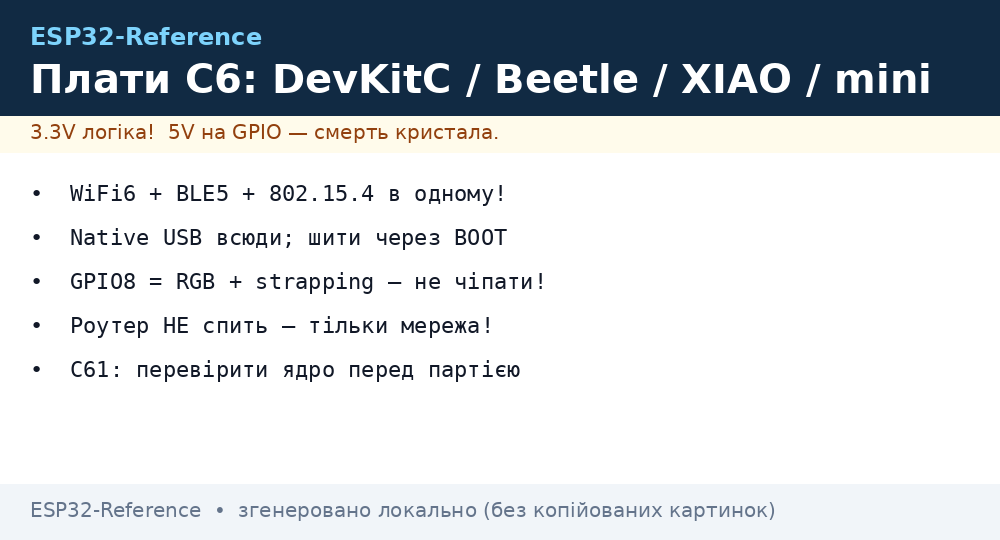
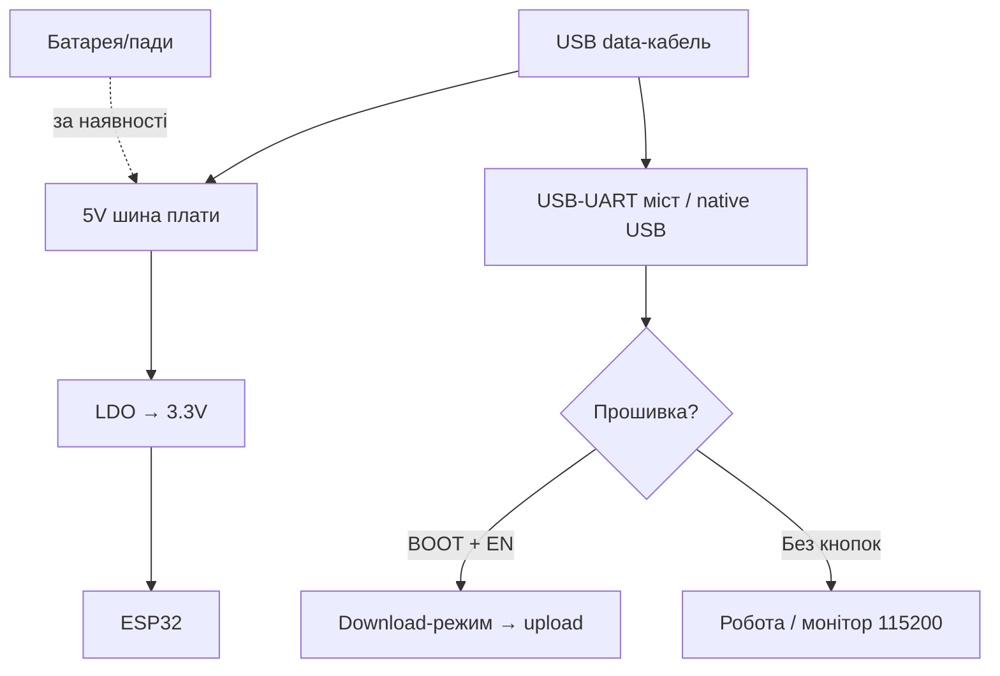

# DevKit плати C6/C61: DevKitC, Beetle, XIAO, SuperMini

## Призначення

ESP32-C6 - перший масовий кристал Espressif з WiFi 6 + BLE 5 + Zigbee + Thread (802.15.4) в одному. Плати під нього - міст між WiFi-світом і mesh-світом: один і той же вузол роздає Matter і слухає датчики. C61 - молодший брат (дешевший, урізаний RF).

База: старт - [Home](../../../ESP32-Reference/Home.md), чипи - [04-ESP32-C3-C6-H2](../../../ESP32-Reference/01-Hardware/04-ESP32-C3-C6-H2.md) і [10-ESP32-C5-C61](../../../ESP32-Reference/01-Hardware/10-ESP32-C5-C61.md), C3/XIAO-попередники - [08-S3-DevKitC-C3-SuperMini-XIAO](../../../ESP32-Reference/14-Devboards/08-S3-DevKitC-C3-SuperMini-XIAO.md), Matter - [09-Matter-Thread-Zigbee](../../../ESP32-Reference/15-Protokoli/09-Matter-Thread-Zigbee.md), сон - [Sleep](../../../ESP32-Reference/07-Timeri-Son/03-Sleep-ULP.md).

| Параметр | C6-DevKitC-1 | Beetle C6 | XIAO C6 | SuperMini C6 | C3-DevKitC-02 |
| --- | --- | --- | --- | --- | --- |
| Призначення | Референс, розробка 802.15.4 | Компактні mesh-вузли | Фірмовий малюк + Grove | Найдешевший C6 | Класика C3 повнорозмірна |
| Кристал | C6 RISC-V 160 МГц | C6 | C6 | C6 | C3 RISC-V 160 МГц |
| Радіо | WiFi6 + BLE5 + 802.15.4 | Те саме | Те саме | Те саме | WiFi4 + BLE5 (БЕЗ 15.4!) |
| Розмір | 68×54 мм | ~25×21 мм | 21×18 мм | 23×18 мм | 68×54 мм |


*Рис. Лінійка C6: DevKitC для столу, Beetle/XIAO/SuperMini для виробів; у всіх - native USB і 802.15.4-антена.*

## Характеристики

| Характеристика | C6-DevKitC-1 | Beetle C6 (DFRobot) | XIAO ESP32C6 | SuperMini C6 | C3-DevKitC-02 |
| --- | --- | --- | --- | --- | --- |
| Flash / PSRAM | 8 МБ / 512 КБ HP + LP | 4 МБ / 512 КБ | 4 МБ / 512 КБ | 4 МБ / 512 КБ | 4-8 МБ / немає |
| USB | 2× USB-C (UART + native) | 1× USB-C native | 1× USB-C native | 1× USB-C native | micro-USB UART + native |
| LED | RGB (GPIO8!) + живлення | Синій user + живлення | Помаранчевий + charging | Синій (GPIO8) | RGB + живлення |
| Кнопки | BOOT + RESET великі | BOOT + RESET малі | BOOT + RESET | Мікроскопічні! | BOOT + RESET |
| Батарея | Пади (без зарядки) | Пади BAT + charging | Пади BAT + charging-IC | Пади BAT без зарядки! | Немає |
| Антена | PCB + U.FL опційно | PCB | PCB + U.FL | PCB | PCB |
| Розмір | 68×54 мм | ~25×21 мм | 21×18 мм | 23×18 мм | 68×54 мм |

> [!warning] GPIO8 - RGB і strapping одночасно!
> На C6 вбудований RGB-діод висить на GPIO8, який є strapping-піном (JTAG/Boundary). Не тягнути GPIO8 назовні при boot - плата зависне в download. Після старту - звичайний NeoPixel-LED для статусів.

## Особливості розпіновки

C6-DevKitC-1: виведено GPIO 0-23 (крім зайнятих SPI-flash: 24-30). USB-Serial-JTAG вбудований - окремий UART-міст НЕ потрібен, але для 802.15.4-сніффера краще зовнішній. Beetle C6: DFRobot-розпіновка D0-D8 + I2C/UART/SPI підписані, 3.3V tolerant ТІЛЬКИ 3.3V! XIAO C6: стандарт Seeed D0-D10 (GPIO 0-7,15-23 залежно від ревізії - звіряти wiki!), Grove-роз'єм I2C. SuperMini C6: клони різняться - GPIO20/21 = UART, I2C на 6/7 у більшості, але перевіряти свою плату мультиметром! Strapping C6: GPIO8/9 - не чіпати при boot. Деталі чипа - [C3/C6/H2](../../../ESP32-Reference/01-Hardware/04-ESP32-C3-C6-H2.md).

## Особливості живлення

| Джерело | C6-DevKitC-1 | Beetle/XIAO/SuperMini C6 |
| --- | --- | --- |
| USB-C 5V | 500 мА+, LDO→3.3V | Те саме |
| Пін 5V | Вхід/вихід шини | Вхід (SuperMini/Beetle), вихід USB (XIAO) |
| Пін 3V3 | Вихід ~500 мА | ~300-500 мА |
| Батарея | Пади без зарядки | XIAO/Beetle: charging-IC; SuperMini: ТІЛЬКИ зовнішній TP4056! |
| Deep-sleep | ~7-15 мкА (модем вимкнений) | XIAO ~40+ мкА (charging-IC їсть, як у C3!) |
| 802.15.4 RX | +~90 мА до бюджету | Рахувати в mesh-режимі: роутер НЕ спить! |

> Mesh-вузол буває двох видів: sleepy end device (спить, батарея роки) і router (НЕ спить НІКОЛИ, тільки мережа!). Не проєктувати роутер на батареї - це фізично неможливо.

## Особливості USB-UART

Усі C6-плати - native USB (USB-Serial-JTAG вбудований у кристал). Драйвера не треба, потрібен data-кабель. Перша прошивка: BOOT → USB → шити → Reset (як C3, див. ноту 08). C6-DevKitC-1 має другий порт через CP2102N - шити через нього, якщо native зайнятий консоллю 802.15.4-логу. Швидкість native - повна; для Zigbee-сніффера тримати 115200.

## Кнопки

DevKitC: великі BOOT+RESET. Beetle/XIAO: малі, доступні. SuperMini C6: мікроскопічні (пінцет!). Подвійний клік Reset на XIAO = UF2 (перетягнути .uf2). RGB на GPIO8 - індикатор режимів після boot.

## Для чого підходить

- C6-DevKitC-1: розробка Zigbee/Thread/Matter, сніффер 802.15.4, WiFi 6 тести.
- Beetle C6: mesh-датчики в корпусах (малий + отвори під гвинти).
- XIAO C6: Grove-екосистема, швидкі прототипи Matter.
- SuperMini C6: найдешевші mesh-вузли великими партіями.
- C3-DevKitC-02: коли Thread НЕ потрібен, а потрібна зріла C3-екосистема.
- НЕ підходить: C6 для камер (немає DVP!), для USB-host (немає OTG!), для 5V-периферії.

## Прошивка

Arduino: `ESP32C6 Dev Module`, USB CDC On Boot `Enabled`. Zigbee: бібліотека esp-zigbee через Arduino-C6 (див. [Wireless](../../../ESP32-Reference/10-Sensori/39-Wireless-Sensors.md)). ESP-IDF: ціль `esp32c6`.

```ini
; PlatformIO — C6-DevKitC-1
[env:c6-devkitc]
platform = espressif32
board = esp32-c6-devkitc-1
framework = arduino
monitor_speed = 115200
build_flags = -DARDUINO_USB_CDC_ON_BOOT=1

; PlatformIO — XIAO C6 / Beetle C6 / SuperMini C6
[env:xiao-c6]
platform = espressif32
board = seeed_xiao_esp32c6
framework = arduino
monitor_speed = 115200
build_flags = -DARDUINO_USB_CDC_ON_BOOT=1
```

> C61: підтримка з’являється в нових Arduino-core/IDF - перед покупкою партії перевірити, що ваша версія ядра знає чип (див. [Версії](../../../ESP32-Reference/99-Dodatki/07-Versions.md))!

## Типові помилки

| Симптом | Причина | Рішення |
| --- | --- | --- |
| Завис в download, BOOT не допомагає | GPIO8/9 підтягнуті зовні | Вимкити периферію з 8/9 при boot |
| Порт зник після sleep | Native USB заснув | Reset; для логу - зовнішній UART |
| Zigbee не join | Немає координатора / не той канал | Permit join + той же канал 11-26 |
| Роутер сів за добу | Роутер не спить за визначенням | Роутер - тільки на мережі |
| C61 не шиється | Старе ядро без C61 | Оновити Arduino-core/IDF (Versions) |
| SuperMini C6 гріється від LiPo | Пади BAT без захисту | Зовнішній TP4056 + BMS |

## Схема живлення та прошивки

```text
USB-C (data!) ──► native USB C6 ──► шити (BOOT при першій)
5V ──► LDO ──► 3.3V ──► кристал + антена 802.15.4 (не екранувати!)
BAT-пади ──► [XIAO/Beetle: charging-IC] / [SuperMini: ЗОВНІШНІЙ TP4056!]
GPIO8 (RGB/strapping) ──► вільний при boot, далі NeoPixel-статус
```

## Офіційні джерела

- [ESP32-C6 DevKitC (Espressif)](https://docs.espressif.com/projects/esp-dev-kits/en/latest/esp32c6/esp32-c6-devkitc-1/user_guide.html) - схема, піни.
- [XIAO ESP32C6 (Seeed)](https://wiki.seeedstudio.com/xiao_esp32c6_getting_started/) - wiki, Grove, UF2.
- [Beetle ESP32-C6 (DFRobot)](https://wiki.dfrobot.com/dfr1117/) - розпіновка, приклади.
- [ESP Zigbee SDK](https://docs.espressif.com/projects/esp-zigbee-sdk/) - C6 як координатор/вузол.

### Mermaid: живлення і перша прошивка плати



## Див. також

- [Головна](../../../ESP32-Reference/Home.md)
- [C3/C6/H2](../../../ESP32-Reference/01-Hardware/04-ESP32-C3-C6-H2.md)
- [C5/C61](../../../ESP32-Reference/01-Hardware/10-ESP32-C5-C61.md)
- [08: S3/C3/XIAO](../../../ESP32-Reference/14-Devboards/08-S3-DevKitC-C3-SuperMini-XIAO.md)
- [Matter/Thread/Zigbee](../../../ESP32-Reference/15-Protokoli/09-Matter-Thread-Zigbee.md)
- [Бездротові сенсори](../../../ESP32-Reference/10-Sensori/39-Wireless-Sensors.md)
- [Заряд/BMS](../../../ESP32-Reference/13-Moduli-zhivlennya-rivniv/03-TP4056-IP5306-BMS-UPS.md)
- [USB-UART](../../../ESP32-Reference/13-Moduli-zhivlennya-rivniv/05-USB-UART-AutoReset.md)
- [Версії](../../../ESP32-Reference/99-Dodatki/07-Versions.md)
