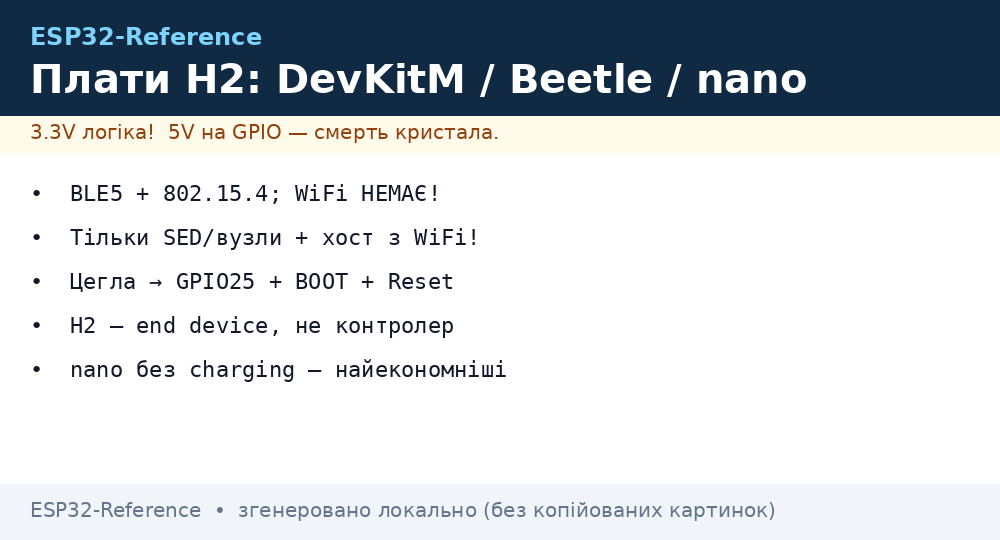
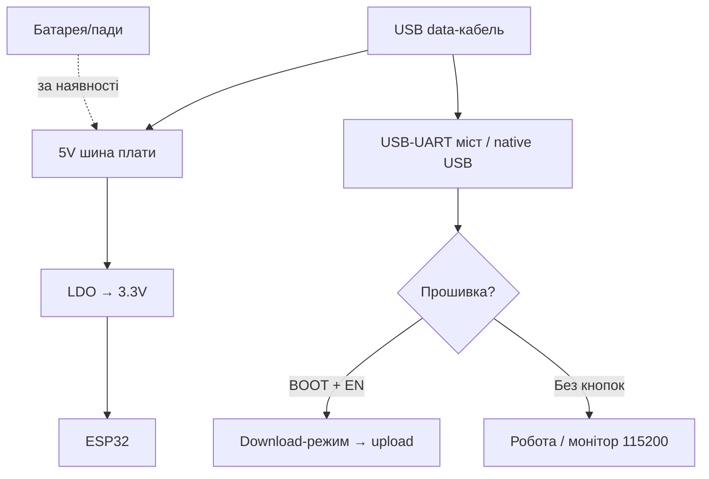

# DevKit плати H2: DevKitM, Beetle, nano (без WiFi!)

## Призначення

ESP32-H2 - дивний звір: BLE 5 + Zigbee + Thread Є, а WiFi НЕМАЄ взагалі. Призначення одне - дешевий батарейний mesh-вузол і Zigbee/Thread-компаньйон для P4/S3 (радіо-модуль при хості без радіо). Плата H2 без хоста з WiFi - острів без моста: дані нікуди подіти, крім mesh.

База: старт - [Home](../../../ESP32-Reference/Home.md), чипи - [04-ESP32-C3-C6-H2](../../../ESP32-Reference/01-Hardware/04-ESP32-C3-C6-H2.md), C6-брати - [13-ESP32C6-Boards](../../../ESP32-Reference/14-Devboards/13-ESP32C6-Boards.md), Matter - [09-Matter-Thread-Zigbee](../../../ESP32-Reference/15-Protokoli/09-Matter-Thread-Zigbee.md), бездротові сенсори - [39-Wireless-Sensors](../../../ESP32-Reference/10-Sensori/39-Wireless-Sensors.md).

| Параметр | H2-DevKitM-1 | Beetle H2 | nano H2 (клонові) |
| --- | --- | --- | --- |
| Призначення | Референс, компаньйон P4 | Компактні Zigbee-вузли | Найдешевші SED-датчики |
| Кристал | H2 RISC-V 96 МГц | H2 | H2 |
| Радіо | BLE5 + 802.15.4, WiFi НЕМАЄ | Те саме | Те саме |
| Розмір | 48×26 мм (M-формат) | ~25×21 мм | ~23×18 мм |


*Рис. H2-лінійка: DevKitM для столу, Beetle/nano для виробів; поруч завжди хост з WiFi (C6/S3/P4+C6).*

## Характеристики

| Характеристика | H2-DevKitM-1 | Beetle H2 | nano H2 |
| --- | --- | --- | --- |
| Flash | 4 МБ / немає PSRAM | 4 МБ | 4 МБ |
| USB | 1× USB-C native | 1× USB-C native | 1× USB-C native |
| LED | RGB (GPIO8!) + живлення | Синій user | Синій |
| Кнопки | BOOT + RESET | Малі BOOT + RESET | Мікроскопічні |
| Батарея | Пади (без зарядки) | Пади + charging | Пади без зарядки! |
| Антена | PCB | PCB | PCB |
| Розмір | 48×26 мм | ~25×21 мм | ~23×18 мм |

> [!danger] H2 ≠ WiFi!
> На H2 НЕ запуститься жоден WiFi-приклад: ні сканер, ні MQTT безпосередньо, ні OTA по WiFi. Прошивка заливається по USB, оновлення - по USB або через mesh (smp/suit - окрема тема). Хочеш хмару - поруч Border Router або хост (схема нижче).

## Архітектура «H2 + хост» (обов'язкова картинка в голові!)

```text
Варіант A — компаньйон:            Варіант B — Border Router поруч:
 H2-вузол (SED, батарея)            H2/C6-координатор (на мережі!)
   ↕ Thread/Zigbee                    ↕ Thread mesh
 C6 Border Router (на мережі!)        H2-датчики (батареї)
   ↕ WiFi/Ethernet                    |
 Хмара (MQTT/Matter)                Хмара
```

## Особливості розпіновки

H2-DevKitM-1: GPIO 0-27 (крім flash 24-27 частково). Beetle/nano: D0-D8 підписані, I2C/UART/SPI. Strapping H2: GPIO8/9 (той же RGB-конфлікт, що в C6!) + GPIO25 (download). USB-Serial-JTAG вбудований. JTAG-дебаг через USB - див. [JTAG](../../../ESP32-Reference/09-Proshivka/05-JTAG-Debug.md).

## Особливості живлення

| Джерело | H2-DevKitM-1 | Beetle/nano H2 |
| --- | --- | --- |
| USB-C 5V | 500 мА, LDO→3.3V | Те саме |
| Deep-sleep SED | ~7-12 мкА | nano без charging-IC - найекономніші! |
| Zigbee RX | ~90 мА (як C6) | Рахувати для роутерів |
| Батарея | Пади без зарядки | Beetle: charging-IC; nano: зовнішній TP4056! |

## Особливості USB-UART

Тільки native USB. Перша прошивка: BOOT → USB → шити → Reset. H2-devkit впав у «цеглу» (немає порту)? Утримати GPIO25 LOW + BOOT + Reset - примусовий download (див. режим завантаження в ноті C3/C6/H2).

## Кнопки

DevKitM: нормальні BOOT+RESET. Beetle: малі. nano: мікроскопічні. RGB GPIO8 - вільний при boot!

## Для чого підходить

- H2-DevKitM-1: розробка Zigbee-пристроїв, Thread SED-профілювання, компаньйон P4.
- Beetle H2: Zigbee-вимикачі/датчики з binding (без координатора вимикач↔лампа!).
- nano H2: одноразові SED-датчики великими партіями.
- НЕ підходить: все, де потрібен WiFi; камери; USB-host; автономна хмара без BR.

## Прошивка

ESP-IDF: ціль `esp32h2`. Arduino: `ESP32H2 Dev Module` (підтримка молодша за C6 - перевіряти ядро!).

```ini
; PlatformIO — H2-DevKitM-1
[env:h2-devkitm]
platform = espressif32
board = esp32-h2-devkitm-1
framework = arduino
monitor_speed = 115200
build_flags = -DARDUINO_USB_CDC_ON_BOOT=1
```

Zigbee-прошивка: esp-zigbee приклади (`light_bulb`/`light_switch` як старт, далі - свій сенсор). Thread: ot_sleepy_device. Matter: H2 - тільки end device (контролером бути не може - мало RAM!).

## Типові помилки

| Симптом | Причина | Рішення |
| --- | --- | --- |
| WiFi-приклад не компілюється | WiFi в H2 немає фізично | Переписати під BLE/15.4 |
| Немає порту після прошивки | Native USB заснув / цегла | Reset; примусово GPIO25+BOOT |
| SED сів за місяць | Poll period 100 мс замість 1000+ | Збільшити poll, рідший reporting |
| Matter-комісіонування падає | Немає BR / мало RAM | BR в мережі; H2 - тільки end device |
| GPIO8 периферія гальмує boot | Strapping-конфлікт | Звільнити 8/9/25 при boot |

## Схема живлення та прошивки

```text
USB-C (data!) ──► native USB H2 ──► шити (BOOT; цегла → GPIO25+BOOT+Reset)
BAT-пади ──► [Beetle: charging-IC] / [nano: ЗОВНІШНІЙ TP4056!]
Поруч ЗАВЖДИ: C6-BR або S3-хост з WiFi (інакше дані нікуди!)
```

## Офіційні джерела

- [ESP32-H2 DevKitM (Espressif)](https://docs.espressif.com/projects/esp-dev-kits/en/latest/esp32h2/esp32-h2-devkitm-1/user_guide.html) - схема, піни.
- [ESP Zigbee SDK](https://docs.espressif.com/projects/esp-zigbee-sdk/) - приклади під H2.
- [OpenThread sleepy device (Espressif)](https://docs.espressif.com/projects/esp-idf/en/latest/esp32h2/api-guides/openthread.html) - SED-профіль.

### Mermaid: живлення і перша прошивка плати



### Zigbee-binding без координатора (фішка H2!)

```text
Сценарій: вимикач H2 ↔ лампа H2 безпосередньо (координатор потрібен ОДИН раз для спарювання!):
  1. Обидва в permit-join → спарувались через координатор.
  2. Bind: вимикач прив'язує кластер OnOff лампи (Z2M → Bind або install-code).
  3. Координатор можна вимкнути — зв'язка працює!
Живлення: вимикач — CR2450 SED (роки), лампа — мережа (роутер!).
```

## Див. також

- [Головна](../../../ESP32-Reference/Home.md)
- [C3/C6/H2](../../../ESP32-Reference/01-Hardware/04-ESP32-C3-C6-H2.md)
- [13: C6-плати](../../../ESP32-Reference/14-Devboards/13-ESP32C6-Boards.md)
- [08: S3/C3/XIAO](../../../ESP32-Reference/14-Devboards/08-S3-DevKitC-C3-SuperMini-XIAO.md)
- [Matter/Thread/Zigbee](../../../ESP32-Reference/15-Protokoli/09-Matter-Thread-Zigbee.md)
- [Бездротові сенсори](../../../ESP32-Reference/10-Sensori/39-Wireless-Sensors.md)
- [JTAG](../../../ESP32-Reference/09-Proshivka/05-JTAG-Debug.md)
