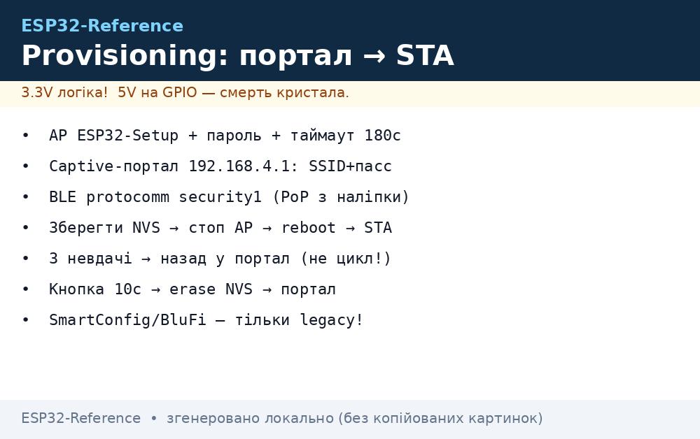
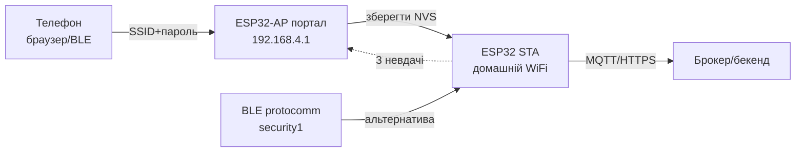

# Provisioning WiFi на ESP32 без перепрошивки

> [!warning] Відкритий портал provisioning без пароля і таймауту - дірка: будь-хто поруч перехопить пристрій!
> Пароль на SoftAP, таймаут порталу 3-5 хв, після успіху - гасити AP і чистити NVS при потребі.

База WiFi: [01-WiFi-STA-AP](../../../ESP32-Reference/05-Radio/01-WiFi-STA-AP.md), зберігання облікових [01-Partitions-NVS](../../../ESP32-Reference/08-Pamyat/01-Partitions-NVS.md), далі MQTT [MQTT](../../../ESP32-Reference/15-Protokoli/01-MQTT.md), старт [Home](../../../ESP32-Reference/Home.md).

## Призначення

Provisioning - введення SSID/пароля (і MQTT-налаштувань) у готовий пристрій без перепрошивки. Користувач підключається до тимчасової точки пристрою, вводить домашній WiFi - пристрій перезапускається вже клієнтом.

Варіанти:

- **WiFiManager (Arduino)** - captive-портал, найпростіше для хобі.
- **wifi_provisioning + protocomm (IDF)** - BLE або SoftAP-транспорт, security1/2, продакшен-підхід.
- **Ручний AP-портал (MicroPython)** - сокет-сервер на 192.168.4.1, мінімум залежностей.
- **ESP RainMaker** - коли потрібні хмара, застосунок і claiming з коробки.
- **SmartConfig / BluFi** - застереження: крихко, лише legacy.

## Параметри

| Параметр | Значення | Примітка |
| --- | --- | --- |
| WiFiManager AP | SSID `ESP32-Setup`, IP 192.168.4.1 | captive-портал + DNS-перехоплення |
| IDF BLE-provisioning | GATT-сервіс protocomm, security1 (PoP) / security2 | телефон поруч, без відкритого AP |
| IDF SoftAP-provisioning | AP + HTTP-endpoints protocomm | як WiFiManager, але з шифруванням |
| MP-портал | свій `socket` + форма HTML | ~60 рядків, повний контроль |
| RainMaker | claiming + MQTT до хмари Espressif | застосунки iOS/Android готові |
| SmartConfig | ESP-Touch по довжині пакетів | ламається на 5 ГГц/mesh, не радити |
| BluFi | BLE-канал закритого протоколу | лише Espressif-додаток, legacy |
| Безпека | пароль AP ≥ 8 символів, таймаут 180-300 с | після provision - стоп AP |
| Сховище | NVS (SSID/пасс), стирати при зміні власника | `nvs_flash_erase` / `WiFi.disconnect(true)` |
| Кнопка скидання | утримання GPIO 10 с → erase + reboot в портал | обов'язково для корпусного виробу |


*Рис. Provisioning-транспорта: BLE/SoftAP-портал віддає облікові, пристрій стає STA-клієнтом домашнього WiFi.*

### ASCII-схема

```text
ПЕРВИННИЙ СТАН (нема NVS-облікових / кнопка утримана)
────────────────────────────────────────────────────
 ESP32-AP "ESP32-Setup" (пароль! таймаут 180с)
   │
   ├─► Телефон підключається ──► captive-портал 192.168.4.1
   │     форма: SSID + пароль (+ MQTT-хост за потреби)
   │
   ├─► [IDF] BLE GATT protocomm security1 (PoP з наліпки) ──► ті самі поля
   │
   └─► Зберегти в NVS ──► стоп AP/BLE ──► reboot ──► STA до домашнього WiFi
                                                   │
ПІСЛЯ УСПІХУ: портал ЗАЧИНЕНО, пристрій ──► MQTT/HTTPS (див. 01/02)
НЕВДАЧА: лічильник 3 спроби ──► назад у портал (не висіти вічно!)
```

### Mermaid



## WiFiManager (Arduino): captive-портал

Поведінка: стартує STA, немає збереженої мережі або конект провалився - піднімає AP + DNS + вебсервер. Captive-портал сам відкривається на телефоні.

Безпека мінімум: `autoConnect("ESP32-Setup", "SetupPass123")` (пароль!), `setConfigPortalTimeout(180)`, після успіху - звичайний `loop()`. Кастомні поля (MQTT-хост/порт) через `WiFiManagerParameter`, зберігати в NVS/Preferences.

Підводні: портал, що не закрився після provision (завис в AP+STA) - явно `stopConfigPortal()` / перезавантаження; старі облікові в NVS після зміни роутера - довге утримання кнопки → `WiFi.disconnect(true)` + reboot.

## wifi_provisioning + protocomm (IDF): BLE / SoftAP

Продакшен-шлях: транспорт BLE (телефон поруч, ефір чистий) або SoftAP + HTTP, поверх - protocomm-сесія з security:

- security0 - без шифрування, тільки розробка;
- security1 - Curve25519 + PoP (proof-of-possession з наліпки на корпусі);
- security2 - SRP6a, рекомендовано для серії.

Сценарій: `wifi_prov_mgr_init()` → `wifi_prov_mgr_start_provisioning(security, pop, service_name)` → застосунок/додаток передає SSID → подія `WIFI_PROV_END` → `wifi_prov_mgr_deinit()` (звільнити BLE-пам'ять!) → STA-конект. Після успіху BLE вимикати (`esp_bt_mem_release`) - інакше RAM тече.

## Ручний AP-портал (MicroPython)

Коли бібліотек немає: підняти AP `esp32-setup`, сокет на 80, віддати форму, прийняти POST, записати `wifi.json`, reboot. Плюс - нуль залежностей і повний контроль; мінус - самому робити валідацію, таймаут і dnS-перехоплення (без нього користувач іде на 192.168.4.1 вручну).

## ESP RainMaker - оглядово

Коли брати: потрібні віддалене керування з інтернету, готові мобільні застосунки, claiming пристроїв, OTA з хмари - і немає своєї бекенд-команди. RainMaker дає агент на пристрої + хмару + застосунки; параметри (реле, температура) описуються моделлю і самі малюються в UI.

Коли НЕ брати: локальний пристрій без інтернету, свій бекенд уже є (тоді MQTT/HTTP з розділів 01-02), жорсткі вимоги до приватності даних.

## SmartConfig / BluFi: застереження

- **SmartConfig (ESP-Touch):** кодує SSID довжинами пакетів. Ламається на 5 ГГц, mesh-роумінгу, ізольованих AP. Тільки legacy-підтримка старих партій.
- **BluFi:** закритий BLE-протокол під додаток Espressif. Працює, але прив'язує до чужого застосунку.
- Новим виробам - WiFiManager (хобі) або wifi_provisioning security1/2 (серія).

## Код Arduino (WiFiManager, безпечний)

```cpp
#include <WiFi.h>
#include <WiFiManager.h>

#define RESET_PIN 0  // BOOT: утримати 10 с → забути WiFi

WiFiManagerParameter p_mqtt("mqtt", "MQTT host", "192.168.1.10", 40);

void setup() {
  Serial.begin(115200);
  pinMode(RESET_PIN, INPUT_PULLUP);
  WiFiManager wm;
  wm.addParameter(&p_mqtt);
  wm.setConfigPortalTimeout(180);          // не висіти вічно!
  wm.setConnectTimeout(20);
  // Скидання за кнопкою:
  if (digitalRead(RESET_PIN) == LOW) {
    delay(10000);
    if (digitalRead(RESET_PIN) == LOW) { wm.resetSettings(); ESP.restart(); }
  }
  // Пароль на AP — ОБОВ'ЯЗКОВО:
  if (!wm.autoConnect("ESP32-Setup", "SetupPass123")) {
    Serial.println("provision fail → reboot");
    ESP.restart();
  }
  Serial.println(WiFi.localIP());
  Serial.println(p_mqtt.getValue()); // → зберегти в Preferences/NVS
}

void loop() { /* робочий код: MQTT/HTTP */ }
```

## Код ESP-IDF (wifi_provisioning через BLE)

```c
#include "wifi_provisioning/manager.h"

void prov_start(const char *pop) {
    wifi_prov_mgr_config_t cfg = {
        .scheme = wifi_prov_scheme_ble,
        .scheme_event_handler = WIFI_PROV_SCHEME_BLE_EVENT_HANDLER_FREE_BTDM,
    };
    wifi_prov_mgr_init(cfg);
    // service_name видно в ефірі; PoP — з наліпки на корпусі
    wifi_prov_mgr_start_provisioning(WIFI_PROV_SECURITY_1, pop,
                                     "ESP32_ABC123", NULL);
    // Чекати подію WIFI_PROV_END, далі:
    // wifi_prov_mgr_deinit(); → esp_bt_mem_release(ESP_BT_MODE_BTDM);
}

// Події: WIFI_PROV_CRED_RECV (облікові отримано),
// WIFI_PROV_CRED_SUCCESS / FAIL (3 FAIL → лишити портал, не reboot-цикл),
// WIFI_PROV_END → deinit + робочий режим STA.
```

## Код MicroPython (ручний AP-портал)

```python
import network, socket, json, time, machine

CONF = "wifi.json"

def start_portal():
    ap = network.WLAN(network.AP_IF)
    ap.active(True)
    ap.config(essid="ESP32-Setup", password="SetupPass123")  # пароль!
    ap.ifconfig(("192.168.4.1", "255.255.255.0", "192.168.4.1", "8.8.8.8"))
    s = socket.socket(); s.bind(("0.0.0.0", 80)); s.listen(1)
    s.settimeout(1.0)
    t0 = time.time()
    while time.time() - t0 < 180:  # таймаут порталу!
        try: cl, _ = s.accept()
        except OSError: continue
        req = cl.recv(1024).decode()
        if "POST /save" in req:
            body = req.split("\r\n\r\n")[-1]  # ssid=..&pass=..&mqtt=..
            kv = dict(p.split("=") for p in body.split("&") if "=" in p)
            open(CONF, "w").write(json.dumps(kv))
            cl.send("HTTP/1.0 200 OK\r\n\r\nSaved. Rebooting...")
            cl.close(); time.sleep(1); machine.reset()
        else:
            html = ("<form method=POST action=/save>SSID:<input name=ssid><br>"
                    "PASS:<input name=pass type=password><br>"
                    "MQTT:<input name=mqtt value=192.168.1.10><br>"
                    "<input type=submit value=Save></form>")
            cl.send("HTTP/1.0 200 OK\r\nContent-Type: text/html\r\n\r\n" + html)
        cl.close()
    machine.reset()  # таймаут вийшов — reboot у робочий режим

try:
    kv = json.load(open(CONF))
    sta = network.WLAN(network.STA_IF); sta.active(True)
    sta.connect(kv["ssid"], kv["pass"])
    for _ in range(40):
        if sta.isconnected(): break
        time.sleep(0.5)
    if not sta.isconnected(): start_portal()
except OSError:
    start_portal()  # конфіга нема → портал
```

## Типові помилки

| Симптом | Причина | Рішення |
| --- | --- | --- |
| Портал висить після provision | немає `deinit`/reboot, AP+STA одночасно | `wifi_prov_mgr_deinit()` / `ESP.restart()` після успіху |
| Пристрій не бачить нову мережу | старі облікові в NVS | кнопка 10 с → `resetSettings()` / `nvs_flash_erase` |
| Captive-портал не спливає | немає DNS-перехоплення (ручний портал) | йти вручну на 192.168.4.1; у WiFiManager увімкнено |
| Цикл reboot ↔ портал | FAIL без лічильника | 3 спроби → лишити портал, не ребутитись |
| BLE-provisioning з'їв RAM | BTDM не звільнено після deinit | `esp_bt_mem_release(ESP_BT_MODE_BTDM)` |
| Чужі підключаються до Setup-AP | відкритий AP без таймауту | пароль ≥ 8 символів + timeout 180 с |
| SmartConfig не ловить | 5 ГГц / mesh / ізоляція AP | тільки 2.4 ГГц або перейти на BLE/SoftAP |
| PoP-наліпка одна на партію | клонування доступу | унікальний PoP на пристрій (MAC-based) |

## Офіційні джерела

- [Protocomm - ESP-IDF](https://docs.espressif.com/projects/esp-idf/en/stable/esp32/api-reference/provisioning/protocomm.html) - security0/1/2, BLE і SoftAP-транспорт.
- [WiFiManager - GitHub](https://github.com/tzapu/WiFiManager) - captive-портал, таймаути, кастомні параметри.
- [ESP RainMaker - Programming Guide](https://docs.espressif.com/projects/esp-rainmaker/en/latest/) - claiming, модель пристрою, OTA.
- [esp-rainmaker - GitHub](https://github.com/espressif/esp-rainmaker) - агент, приклади, застосунки.

## Див. також

- [Home](../../../ESP32-Reference/Home.md)
- [WiFi STA/AP](../../../ESP32-Reference/05-Radio/01-WiFi-STA-AP.md) - режими, що перемикає provisioning
- [OTA](../../../ESP32-Reference/08-Pamyat/03-OTA.md) - оновлення вже provisioned-пристроїв
- [NVS](../../../ESP32-Reference/08-Pamyat/01-Partitions-NVS.md) - де лежать облікові, стирання
- [FAQ](../../../ESP32-Reference/99-Dodatki/02-Troubleshooting-FAQ.md) - портал не стартує, цикли
- [MQTT](../../../ESP32-Reference/15-Protokoli/01-MQTT.md) - наступний крок після WiFi
- [HTTP/WebSocket](../../../ESP32-Reference/15-Protokoli/02-HTTP-WebSocket.md) - наступний крок після WiFi
- [mDNS/NTP/TLS](../../../ESP32-Reference/15-Protokoli/03-mDNS-NTP-TLS.md) - знахідка пристрою після provision
- [Cloud-Pipeline](../../../ESP32-Reference/15-Protokoli/05-Cloud-Pipeline.md) - куди течуть дані
