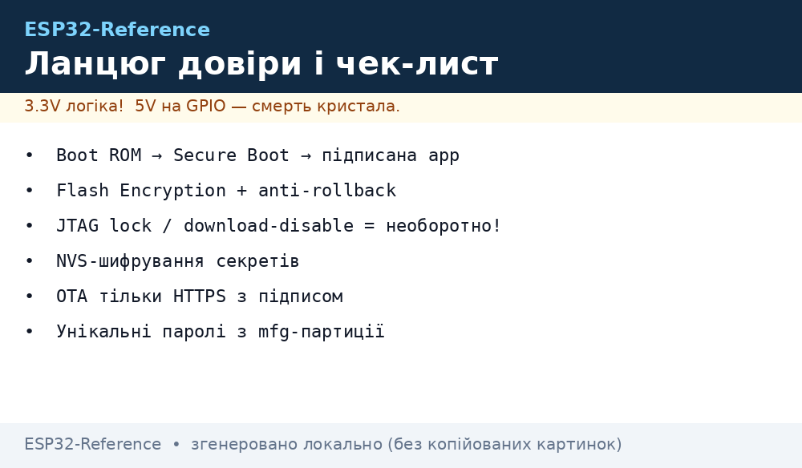
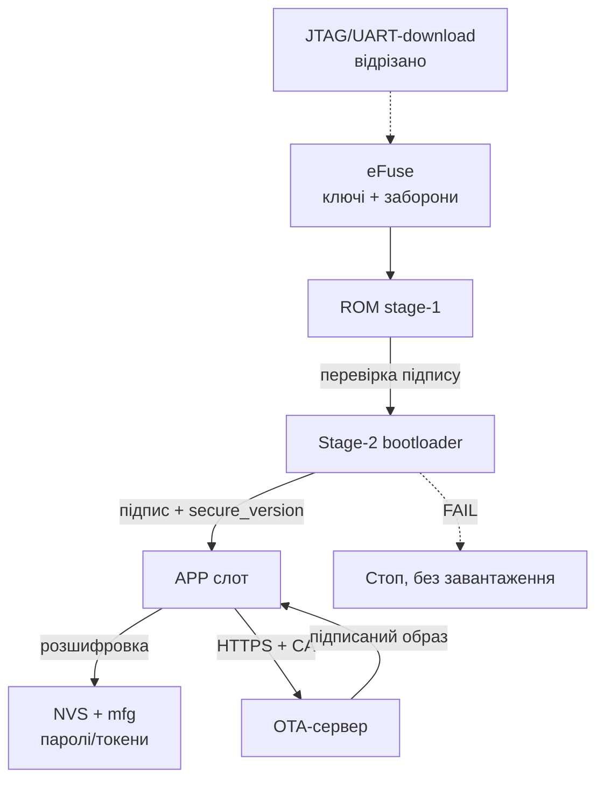

# Security Hardening ESP32 перед продакшеном

> [!warning] Прототип ≠ продукт!
> Плата з відкритим UART-логом, прошивкою без підпису і WiFi-паролем у plaintext-NVS - це демо для столу, а не виріб для клієнта. Пройди цей чек-лист ДО першої партії: половина пунктів незворотна (eFuse).

База: flash і підпис [04-Secure-Boot-Encrypt](../../../ESP32-Reference/08-Pamyat/04-Secure-Boot-Encrypt.md), доставка оновлень [OTA](../../../ESP32-Reference/08-Pamyat/03-OTA.md), дебаг [05-JTAG-Debug](../../../ESP32-Reference/09-Proshivka/05-JTAG-Debug.md), час і TLS [03-mDNS-NTP-TLS](../../../ESP32-Reference/15-Protokoli/03-mDNS-NTP-TLS.md), старт [Home](../../../ESP32-Reference/Home.md).

## Призначення

Hardening - це переведення пристрою з режиму «зручно розробляти» в режим «дорого зламати». Документ дає один чек-лист: що ввімкнути, що вимкнути, де це натискається і чим доведеться заплатити (гроші, час, ризик цегли). Охоплює Secure Boot, шифрування Flash, захист OTA, JTAG-лок та унікальні паролі на виріб.

## 1. Threat-model: від кого захищаємось

Фізичний доступ - головна відмінність embedded від сервера. Пристрій лежить у під'їзді, на даху, у полі: зловмисник може його розібрати.

| Загроза | Що вміє атакуючий | Що рятує |
| --- | --- | --- |
| Зчитування flash програматором / `esptool read_flash` | copiar прошивки, витягти паролі і ключі | Flash Encryption + NVS-шифрування |
| Підміна прошивки (своя з бекдором) | перепрошивка по UART або підміна OTA-файла | Secure Boot V2 + підписана OTA |
| Відкат на стару вразливу версію | прошити підписаний, але старий бінарник | Anti-rollback, secure version в eFuse |
| Сніфінг ефіру (WiFi, BLE, MQTT) | читає паролі, підміняє команди | WPA2/WPA3 + PMF, MQTTS/TLS, BLE bonding з шифруванням |
| Перехоплення provisioning | підключається до відкритого Setup-AP | Пароль на портал, таймаут, PoP (див. [Provisioning](../../../ESP32-Reference/15-Protokoli/04-Provisioning.md)) |
| Клонування пристроїв партії | копіює одну прошивку на 100 плат | Унікальні паролі/ключі на пристрій (mfg-партиція) |
| Витяг секретів з логів | UART-консоль сипле токенами | Рівень логів без секретів, консоль вимкнена в релізі |
| Віддалена експлуатація старої версії | ботнет з незапатчених вузлів | OTA тільки по HTTPS з підписом + rollback |

> [!caution] Фізичний доступ = повний доступ без криптографії!
> Без Flash Encryption + Secure Boot будь-хто з викруткою і USB-кабелем - твій «адмін». Корпус і пломби - затримка, а не захист.

## 2. Головний чек-лист: що вимкнути / ввімкнути

| № | Захід | Де вмикається | Ціна/ризик |
| --- | --- | --- | --- |
| 1 | Threat-model записано (таблиця вище) | цей документ + ADR під розписку | 1 година; ризик - будувати не той захист |
| 2 | Flash Encryption, Release-режим | `menuconfig` → Security features → Enable flash encryption; підсумок [04-Secure-Boot-Encrypt](../../../ESP32-Reference/08-Pamyat/04-Secure-Boot-Encrypt.md) | Незворотно; `read_flash` віддає шифротекст; бекап до ввімкнення |
| 3 | Secure Boot V2, підпис ECDSA/RSA | `menuconfig` → Secure Boot V2 + ключ на офлайн-машині; деталі [04-Secure-Boot-Encrypt](../../../ESP32-Reference/08-Pamyat/04-Secure-Boot-Encrypt.md) | Незворотно; втрата `signing.pem` = заморожений флот |
| 4 | Anti-rollback, secure version +1 на реліз | `CONFIG_BOOTLOADER_APP_ANTI_ROLLBACK`, `CONFIG_BOOTLOADER_APP_SECURE_VERSION` | Лічильник на 32 кроки; не ставити на factory/test-слоти |
| 5 | JTAG заблоковано (`DIS_USB_JTAG` / JTAG-disable) | eFuse / `menuconfig` (Secure Boot палить автоматично при першому старті) | Дебаг більше неможливий; дебажити ДО запаювання бітів |
| 6 | UART-download вимкнено (`DIS_DOWNLOAD_MODE`) | eFuse `DISABLE_DL_ENCRYPT/DECRYPT`, опція UART ROM download mode | Цегла при мертвій OTA - рятує тільки заміна модуля |
| 7 | NVS-шифрування, паролі НЕ в plaintext | `nvs_keys`-партиція + `CONFIG_NVS_ENCRYPTION`, WiFi/MQTT-пасс тільки туди | +4 КБ партиція, ключі залежать від Flash Encryption |
| 8 | WiFi: WPA2/WPA3 + PMF required | `pmf_cfg.required`, `WIFI_AUTH_WPA2_PSK` і вище | Старі роутери без PMF не підключаться - протестувати |
| 9 | BLE: privacy (RPA) + bonding + шифрування характеристик | `esp_ble_gap_config_local_privacy`, `ESP_LE_AUTH_REQ_SC_MITM_BOND` | Складніше pairing UX; без цього трекінг за MAC |
| 10 | OTA тільки по HTTPS + підпис образу | `esp_https_ota` з CA-bundle, Secure Boot перевіряє підпис | Потрібен PKI і сервер; HTTP-OTA заборонено в проді |
| 11 | Унікальні паролі/PoP на пристрій (mfg-партиція) | заводський стенд пише `mfg` (серійник, PoP, токен) | Інфраструктура персоналізації; один пароль на партію - заборонено |
| 12 | Ротація TLS-сертифікатів і API-токенів | сервер віддає новий токен по старій сесії; CA-bundle оновлюється з OTA | Прострочений CA = відвал флоту; тримати запасний корінь |
| 13 | UART-консоль вимкнена або без команд запису | `CONFIG_ESP_CONSOLE_NONE` / рівень логу `Error`, прибрати `console_repl` | Втрата польової діагностики - компенсувати coredump і хмарою |
| 14 | Debug-логи без секретів | рев'ю `ESP_LOGI` на `password/token/key/ssid-pass`, маскування `***` | 30 хв grep-рев'ю; один токен у логах = компрометація |
| 15 | Пароль на `/update` і provisioning-портал | `AsyncElegantOTA.begin(&server, "admin", per-device-pass)`, таймаут 180 с | Див. [Provisioning](../../../ESP32-Reference/15-Protokoli/04-Provisioning.md); відкритий портал = чужа прошивка |
| 16 | Фінальний прогон: `espefuse summary` + OTA-тест з підписом | стенд QA, 3+ жертовні модулі перед Release | Час QA; зате партія не стане цеглою |


*Рис. Ланцюг довіри: eFuse → Secure Boot → Flash Encryption → підписана OTA; NVS і mfg - під парасолькою шифрування.*

### ASCII-схема ланцюга довіри (boot → app → OTA)

```text
eFuse (корінь довіри, ONE-TIME)
  ├─ дайджест публічного ключа Secure Boot (перевірка підпису)
  ├─ ключ Flash Encryption (розшифровка на льоту)
  ├─ FLASH_CRYPT_CNT (що зашифровано)
  └─ DIS_DOWNLOAD_MODE / DIS_USB_JTAG (що відрізано назавжди)
        │
        ▼
ROM stage-1 (незмінний)
  ── перевіряє підпис stage-2 bootloader ── FAIL → стоп, без fallback
        │
        ▼
Stage-2 bootloader
  ── перевіряє підпис app-слота (Secure Boot V2)
  ── перевіряє secure_version ≥ eFuse (anti-rollback)
  ── розшифровує flash (AES-XTS)
        │
        ▼
APP (робоча прошивка)
  ── NVS читається розшифрованим (WiFi/MQTT-пасс НЕ в plaintext)
  ── TLS: NTP-час + CA-bundle (див. [[15-Protokoli/03-mDNS-NTP-TLS]])
  ── OTA: тільки HTTPS → підпис → запис у неактивний слот
        │
        ▼
OTA-сервер ──TLS──► пристрій ──► self-test ──► mark_valid / rollback
  старий підписаний образ з secure_version < eFuse ──► ВІДХИЛЕНО
```

### Mermaid



## 3. Flash Encryption + Secure Boot: короткий підсумок

Повна механіка - [04-Secure-Boot-Encrypt](../../../ESP32-Reference/08-Pamyat/04-Secure-Boot-Encrypt.md). Тут тільки прод-підсумок:

- Ключ шифрування генерує сам пристрій при першому старті (або вшивається на заводі, але унікальний на плату).
- Development-режим - для жертовних модулів: перепрошивання ще можливе.
- Release-режим - для партії: тільки зашифровані образи і підписана OTA.
- Secure Boot V2 перевіряє підпис bootloader і app на кожному старті і на кожній OTA.
- Порядок для продакшну: бекап ключів у 2 сховища → 3+ тести в Development → тільки потім Release на партії.

## 4. Anti-rollback: secure version

Навіть підписаний образ може бути старим і вразливим. Anti-rollback не дає відкотитись нижче записаної в eFuse версії безпеки.

```c
// menuconfig:
//   CONFIG_BOOTLOADER_APP_ANTI_ROLLBACK=y
//   CONFIG_BOOTLOADER_APP_SECURE_VERSION=3   // +1 на кожен security-реліз
//   CONFIG_BOOTLOADER_APP_ROLLBACK_ENABLE=y  // разом з anti-rollback
#include "esp_ota_ops.h"

// Після self-test нової версії — підтвердити, інакше відкат:
esp_ota_mark_app_valid_cancel_rollback();
// Провал self-test — примусовий відкат:
// esp_ota_mark_app_invalid_rollback_and_reboot();
```

Правила: версія в образі мусить бути ≥ версії в eFuse, інакше завантажувач відхилить слот. Бітів вистачає на ~32 підняття - не витрачати на кожен багфікс, тільки на security-релізи. Factory/test-слоти в цій схемі не підтримуються.

## 5. JTAG lock + UART-download-disable: ЗАСТЕРЕЖЕННЯ ПРО ЦЕГЛУ

> [!caution] Це точка неповернення!
> `DIS_USB_JTAG` і `DIS_DOWNLOAD_MODE` (а також `DISABLE_DL_ENCRYPT/DECRYPT`) перегорають НАЗАВЖДИ. Пристрій з мертвою прошивкою і відрізаним UART-завантаженням лікується тільки паяльником (заміна модуля).

Що коли відрізається:

| Біт / дія | Що закриває | Коли палити |
| --- | --- | --- |
| JTAG-disable (автоматично з Secure Boot / Flash Encryption) | апаратний дебаг, дамп RAM через адаптер | після останньої дебаг-сесії |
| `DIS_DOWNLOAD_MODE` / `DISABLE_DL_*` | `esptool write_flash`, читання flash по UART | тільки коли OTA з підписом протестована на 3+ платах |
| `RD_DIS` на ключах | навіть власник не прочитає eFuse | разом з релізом, після запису бекапів |

Мінімальний безпечний порядок: дебаг і QA → бекап ключів → Development-шифрування → підписана OTA → Release → і тільки потім JTAG/UART-lock.

## 6. NVS-шифрування ключів: паролі не в plaintext

WiFi-пароль, MQTT-логін/пароль, API-токени за замовчуванням лежать у NVS відкритим текстом. З увімкненим Flash Encryption увімкни і NVS-шифрування:

```text
# partitions.csv — партиція ключів NVS (мінімум 4 КБ, прапор encrypted):
nvs,      data, nvs,      0x9000, 0x6000,
nvs_keys, data, nvs_keys, 0xF000, 0x1000, encrypted
```

```c
// menuconfig: CONFIG_NVS_ENCRYPTION=y
// Дефолтна NVS шифрується автоматично через nvs_flash_init(),
// ключі генеруються в nvs_keys при першому старті.
```

Заборони: не класти секрети в `phy_init`, у незашифровані `data`-партиції, у LittleFS-файли без шифрування, у код (`const char *PASS = ...` читається з бінарника!). Унікальні секрети - у `mfg`-партицію із заводу (наступний розділ).

## 7. WiFi PMF + WPA3 і BLE privacy/bonding

Ефір слухають усі. Мінімум для WiFi - WPA2-PSK з увімкненим PMF (захист від deauth-атак і зриву сесії):

```c
wifi_config_t cfg = { /* ... .sta.threshold.authmode = WIFI_AUTH_WPA2_PSK ... */ };
// PMF: optional — для сумісності, required — для продакшену з новими AP:
cfg.sta.pmf_cfg.capable = true;
cfg.sta.pmf_cfg.required = true; // відхиляє AP без PMF — протестувати з цільовими роутерами!
```

WPA3-SAE - якщо цільові роутери його вміють; інакше WPA2/WPA3-transition. Деталі режимів - офіційний гайд Wi-Fi Security (див. джерела).

BLE-мінімум для носимих/кімнатних пристроїв:

- Privacy: resolvable private address (RPA) - інакше трекінг за статичним MAC по офісу.
- Pairing з bonding + MITM-захист (passkey/JustWorks за моделлю загроз), шифрування характеристик з секретами.
- Після provisioning BLE вимикати (`esp_bt_mem_release`), щоб не висіти відкритим GATT (див. [Provisioning](../../../ESP32-Reference/15-Protokoli/04-Provisioning.md)).

## 8. Ротація TLS-сертифікатів і API-токенів

Сертифікати вмирають (Let's Encrypt - 90 днів), токени течуть. Закладати ротацію в архітектуру, а не в авральний виїзд:

- CA-bundle оновлювати разом з OTA; тримати 2 корені (старий + новий) на перехідний період.
- Токен пристрою: видача на заводі в `mfg`, оновлення по автентифікованій сесії (`POST /rotate` зі старим токеном → новий токен у NVS).
- Час для перевірки терміну - тільки після NTP-синку, інакше валідний сертифікат буде відхилено (див. [03-mDNS-NTP-TLS](../../../ESP32-Reference/15-Protokoli/03-mDNS-NTP-TLS.md)).
- Fingerprint сертифіката - тимчасовий костиль для стенду, у проді ламається при кожному перевипуску.

## 9. OTA тільки по HTTPS з підписом

Прод-правила (механіка слотів - [OTA](../../../ESP32-Reference/08-Pamyat/03-OTA.md)):

1. Транспорт - тільки HTTPS з перевіркою CA і hostname. Чистий HTTP - стенд.
2. Образ підписаний тим самим ключем, що в eFuse; непідписаний відхиляє завантажувач.
3. `secure_version` монотонно зростає на security-релізах.
4. Після старту - self-test (WiFi, сенсори, дотягнувся до OTA-сервера) і тільки потім `mark_valid`, інакше rollback.
5. `/update`-ендпоінт під паролем, унікальним на пристрій.

```c
#include "esp_https_ota.h"
esp_http_client_config_t config = {
    .url = "https://ota.example.com/firmware.bin",
    .crt_bundle_attach = esp_crt_bundle_attach, // CA-bundle, НЕ setInsecure!
    .timeout_ms = 10000,
};
if (esp_https_ota(&config) == ESP_OK) esp_restart();
```

## 10. Унікальні паролі на пристрій (mfg-партиція)

Один пароль `admin/admin` на всю партію = один злив і мертвий флот. Заводський стенд пише в кожну плату свою `mfg`-партицію: серійник, PoP для provisioning, пароль `/update`, токен хмари.

```text
# partitions.csv:
mfg, data, undefined, 0x3A0000, 0x10000, encrypted
```

Друк наліпки з серійником + PoP клеїться на корпус. PoP видається за запитом власника, не лежить у публічному CSV. Скидання до заводських стирає WiFi-облікові, але НЕ затирає `mfg`.

## 11. Debug-логи без секретів

Логи - перше, що викладають на форум разом з токенами.

```c
// ПОГАНО:
ESP_LOGI("NET", "mqtt pass=%s token=%s", pass, token);
// ДОБРЕ:
ESP_LOGI("NET", "mqtt connected as %s", client_id);
ESP_LOGI("OTA", "token ...%s", token + strlen(token) - 4); // тільки хвіст
```

Чек перед релізом: `grep -rn "pass\|token\|key\|secret" main/ --include=*.c` і вичистити кожен `LOG` з секретом. Рівень релізних логів - `Error`, консоль без команд запису.

## 12. Команди espefuse / idf: тільки читання

> [!caution] НЕ виконуй команди запису (`burn_key`, `burn_efuse`, `efuse-burn`) без письмового чек-листа і бекапу!
> Нижче - безпечні команди читання. Команда запису в цьому документі навмисно НЕ наводиться повністю.

```bash
# Безпечно: подивитись стан бітів (що вже запаяно):
espefuse.py --port /dev/ttyUSB0 summary
idf.py efuse-summary

# Безпечно: перевірити підпис образу ОФЛАЙН-ключем (ключ не на пристрої!):
espsecure.py verify_signature --version 2 --keyfile signing.pem app-signed.bin

# Безпечно: перевірити, що flash уже шифрується (на живому пристрої):
esptool.py --port /dev/ttyUSB0 read_flash 0x10000 256 dump.bin
# Після Release там має бути шифротекст, а не читабельний код.
```

Запис - тільки на жертовному модулі, тільки за процедурою з [04-Secure-Boot-Encrypt](../../../ESP32-Reference/08-Pamyat/04-Secure-Boot-Encrypt.md) розділ 4, з двома бекапами ключів.

## Типові помилки

| Симптом | Причина | Рішення |
| --- | --- | --- |
| JTAG не чіпляється після захисту | Secure Boot / Flash Encryption відрізали JTAG | Це штатна поведінка; далі - логи, coredump, `esp-coredump.py`, софтверний трейс |
| Заблокований JTAG, а дебаг ще потрібен | біти запаяно на робочому зразку | Дебажити на незахищеному близнюці; захищений - тільки для регресійних прогонів |
| UART-завантаження вимкнено, прошивка мертва | `DIS_DOWNLOAD_MODE` + битий app, OTA не піднімається | Порятунку по дроту немає - заміна модуля; висновок: різати download тільки після 3+ вдалих OTA |
| `flash read err, 1000` по колу | plaintext залито поверх зашифрованого flash | Перевірити `FLASH_CRYPT_CNT`, лити шифрований образ або OTA; деталі [04-Secure-Boot-Encrypt](../../../ESP32-Reference/08-Pamyat/04-Secure-Boot-Encrypt.md) |
| Пристрій не стартує після підпису | ключ не той / secure_version нижче eFuse | `verify_signature` офлайн, звірити `CONFIG_BOOTLOADER_APP_SECURE_VERSION` |
| OTA падає з TLS-ошибкою | час 1970 (немає NTP) або прострочений CA | Спочатку SNTP-синк, потім TLS; ротувати CA-bundle (див. [03-mDNS-NTP-TLS](../../../ESP32-Reference/15-Protokoli/03-mDNS-NTP-TLS.md)) |
| MQTT-пароль витягли з дампа | NVS лежала в plaintext | Увімкнути NVS-шифрування, переписати секрети, старі відкликати |
| Один пароль на партію злили | немає mfg-персоналізації | Відкликати спільний секрет, ввести mfg + ротацію токенів |
| Токен світиться в логах на форумі | `LOGI` з секретом | Маскувати, знизити рівень, відкликати засвічений токен |
| PMF-required ні до чого не чіпляється | старі AP без PMF | Fallback: capable без required + WPA2, або оновити парк AP |
| Після ввімкнення захисту `esptool` мовчить | відрізано download / не той порт | Перевірити порт і біти через `summary`; якщо біти цілі - це цегла |

## Офіційні джерела

- [Security Overview - ESP-IDF](https://docs.espressif.com/projects/esp-idf/en/stable/esp32/security/security.html) - цілі, threat-model, огляд Secure Boot / Flash Encryption / Secure OTA / Secure Storage.
- [Flash Encryption - ESP-IDF](https://docs.espressif.com/projects/esp-idf/en/stable/esp32/security/flash-encryption.html) - Development vs Release, eFuse, наслідки.
- [Secure Boot v2 - ESP-IDF](https://docs.espressif.com/projects/esp-idf/en/stable/esp32/security/secure-boot-v2.html) - підпис RSA/ECDSA, ключі, best practices.
- [NVS Encryption - ESP-IDF](https://docs.espressif.com/projects/esp-idf/en/stable/esp32/api-reference/storage/nvs_encryption.html) - `nvs_keys`-партиція, шифрування облікових.
- [OTA / Anti-rollback - ESP-IDF](https://docs.espressif.com/projects/esp-idf/en/stable/esp32/api-reference/system/ota.html) - rollback, secure version, стани слотів.
- [Wi-Fi Security - ESP-IDF](https://docs.espressif.com/projects/esp-idf/en/stable/esp32/api-guides/wifi-security.html) - PMF, WPA3, Enterprise.
- [ESP-TLS - ESP-IDF](https://docs.espressif.com/projects/esp-idf/en/stable/esp32/api-reference/protocols/esp_tls.html) - CA, SNI, перевірка сервера.
- [ESP x509 Certificate Bundle - ESP-IDF](https://docs.espressif.com/projects/esp-idf/en/stable/esp32/api-reference/protocols/esp_crt_bundle.html) - bundle Mozilla для OTA і MQTTS.

## Див. також

- [Home](../../../ESP32-Reference/Home.md)
- [Secure Boot та Flash Encryption](../../../ESP32-Reference/08-Pamyat/04-Secure-Boot-Encrypt.md) - повна механіка ключів і eFuse
- [OTA](../../../ESP32-Reference/08-Pamyat/03-OTA.md) - слоти, rollback, HTTPS-доставка
- [JTAG-дебаг](../../../ESP32-Reference/09-Proshivka/05-JTAG-Debug.md) - дебажити до запаювання бітів
- [mDNS/NTP/TLS](../../../ESP32-Reference/15-Protokoli/03-mDNS-NTP-TLS.md) - час для TLS і CA-bundle
- [NVS](../../../ESP32-Reference/08-Pamyat/01-Partitions-NVS.md) - партиції `nvs`, `nvs_keys`, `mfg`
- [MQTT](../../../ESP32-Reference/15-Protokoli/01-MQTT.md) - паролі брокера зберігати шифровано
- [Provisioning](../../../ESP32-Reference/15-Protokoli/04-Provisioning.md) - PoP, пароль порталу, таймаут
- [FAQ](../../../ESP32-Reference/99-Dodatki/02-Troubleshooting-FAQ.md) - розбір зальотів
