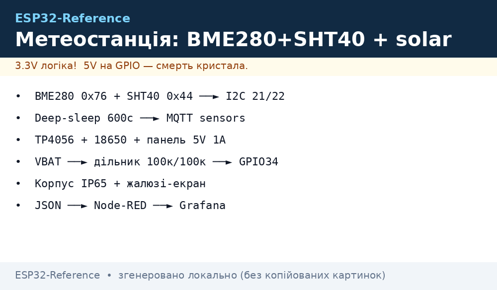
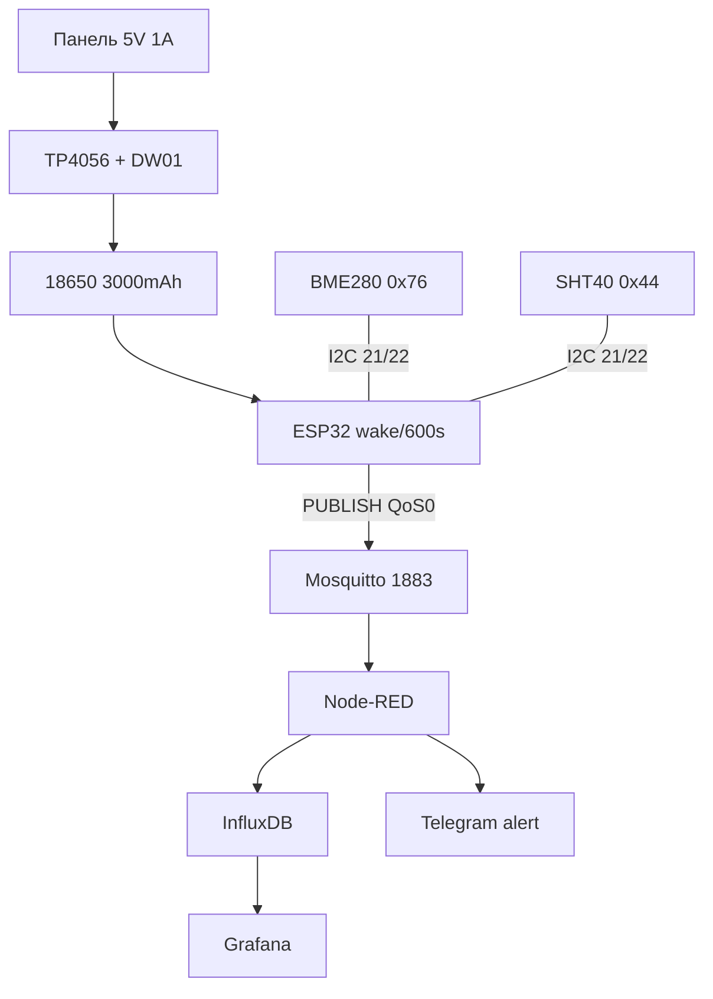

# Проєкт 1 - Метеостанція: BME280 + SHT40 → deep-sleep 10 хв → MQTT → solar


*Рис. Метеостанція: ESP32 + BME280/SHT40, живлення solar TP4056 + 18650, uplink MQTT.*

> [!tip] Що будуємо
> Автономна вулична метеостанція: кожні 10 хв прокидається, читає температуру/вологість/тиск, публікує JSON у MQTT, засинає. Живлення - сонячна панель + TP4056 + 18650. База: [WiFi](../../../ESP32-Reference/05-Radio/01-WiFi-STA-AP.md), [MQTT](../../../ESP32-Reference/15-Protokoli/01-MQTT.md), [Sleep](../../../ESP32-Reference/07-Timeri-Son/03-Sleep-ULP.md), [BME280](../../../ESP32-Reference/10-Sensori/03-BME280-BMP280-SHT31.md), [AHT/SHT40](../../../ESP32-Reference/10-Sensori/07-AHT10-AHT20-SHT40.md).

## 1. Мета

Вимірювати мікроклімат на вулиці/в теплиці без розетки і без обслуговування місяцями.

Сценарії використання:

- балкон/дача: температура + вологість + тиск → графіки в телефоні;
- теплиця: алерт «вологість > 90%» → провітрити;
- навчання: перший батарейний пристрій з deep-sleep і solar.

Вимоги до результату:

- час роботи без сонця - мінімум 7 діб;
- похибка температури ±0.5 °C, вологості ±3 %RH;
- один MQTT-топік, один JSON - без зоопарку форматів;
- корпус IP65: дощ і пил не страшні, конденсат відводиться.

| Параметр | Цільове значення | Як перевірити |
| --- | --- | --- |
| Цикл | wake → вимір → publish → sleep, 600 с | лог `uptime` у JSON |
| Споживання у сні | < 50 мкА на клемах батареї | мультиметр у розрив + |
| Споживання активне | < 120 мА середнє, 15 с | USB-тестер |
| Uplink | MQTT QoS 0, без retain | `mosquitto_sub -t 'device/#'` |
| Живлення | панель 5V 1A + 18650 3000 мАг | 7 діб без сонця |
| Корпус | IP65, гермовводи | полив зі шланга |

> [!warning] Два датчики - навіщо?
> BME280 дає тиск (прогноз погоди за трендом), SHT40 - точнішу вологість з heater проти конденсату. Якщо бюджет один - беріть SHT40. Див. [BME280](../../../ESP32-Reference/10-Sensori/03-BME280-BMP280-SHT31.md) та [SHT40](../../../ESP32-Reference/10-Sensori/07-AHT10-AHT20-SHT40.md).

## 2. BOM - комплектуючі

| Компонент | Нота довідника | Ціна, орієнтовно |
| --- | --- | --- |
| ESP32 DevKit (WROOM-32) | [DevKit](../../../ESP32-Reference/00-Start/04-Devkit-plati.md) | $6 |
| BME280 модуль (I2C, 3.3V) | [BME280](../../../ESP32-Reference/10-Sensori/03-BME280-BMP280-SHT31.md) | $3 |
| SHT40 модуль (I2C 0x44) | [SHT40](../../../ESP32-Reference/10-Sensori/07-AHT10-AHT20-SHT40.md) | $5 |
| TP4056 з захистом DW01 | [Заряд/BMS](../../../ESP32-Reference/13-Moduli-zhivlennya-rivniv/03-TP4056-IP5306-BMS-UPS.md) | $1 |
| 18650 3000 мАг (з захистом) | [Акумулятори](../../../ESP32-Reference/02-Zhivlennya/04-Akumulyatori-TP4056.md) | $5 |
| Сонячна панель 5V 1A (5W) | [Buck/Solar](../../../ESP32-Reference/13-Moduli-zhivlennya-rivniv/01-Buck-Boost-Solar.md) | $8 |
| MT3608 boost 18650→5V (опційно) | [Buck/Solar](../../../ESP32-Reference/13-Moduli-zhivlennya-rivniv/01-Buck-Boost-Solar.md) | $1 |
| Корпус IP65 150×110×70 + гермовводи | [Чек-листи](../../../ESP32-Reference/99-Dodatki/03-Cheklisti-montazhu.md) | $7 |
| Радіаційний екран-жалюзі (тарілка) | [BME280](../../../ESP32-Reference/10-Sensori/03-BME280-BMP280-SHT31.md) | $2 |
| Дільник батареї 100к/100к + 100 нФ | [ADC](../../../ESP32-Reference/06-Analog/01-ADC.md) | $0.5 |
| USB-UART кабель DATA | [USB-UART](../../../ESP32-Reference/13-Moduli-zhivlennya-rivniv/05-USB-UART-AutoReset.md) | $2 |

Разом: ~$40 без доставки.

Що НЕ брати:

- BME280 на 5V-логіці без shift - тільки 3.3V модулі;
- TP4056 без DW01-захисту - батарея помре від перерозряду;
- панель 6V без діода Шотткі - зворотний струм вночі.

## 3. Архітектура

### ASCII-схема

```text
                    ВУЛИЦЯ (IP65)
            +-----------------------------+
            |  Solar 5V --+--> TP4056 --+--> 18650 3000mAh
            |             |   (PROG 1A)  |
            |             +-- Schottky --+--> MT3608 --> 5V ESP32 VIN
            |                                          |
            |  BME280 (0x76) --I2C--> ESP32 <--I2C-- SHT40 (0x44)
            |   SDA GPIO21, SCL GPIO22, pull-up 4.7k
            |   VBAT --100k/100k--> GPIO34 (ADC контроль)
            +-----------------------------+
                              |
                    WiFi 2.4G  |  wake 600c
                              v
                 Mosquitto :1883 --mqtt-in--> Node-RED
                                                        +--> InfluxDB --> Grafana
                                                        +--> Telegram-alert
```

### Mermaid



Логіка циклу:

1. timer-wakeup кожні 600 с (див. [Sleep](../../../ESP32-Reference/07-Timeri-Son/03-Sleep-ULP.md));
2. читання BME280 + SHT40 + VBAT за < 3 с;
3. один PUBLISH і одразу `esp_deep_sleep_start()`;
4. LWT `status=offline` - норма для сплячого вузла, не лякатись.

## 4. Живлення та розрахунок

Баланс енергії (див. [Споживання](../../../ESP32-Reference/02-Zhivlennya/03-Spozhivannya.md)):

- сон: 50 мкА × 600 с ≈ 0.008 мАг за цикл;
- актив: 100 мА × 15 с ≈ 0.42 мАг за цикл;
- разом: ~0.43 мАг × 144 цикли/доба ≈ 62 мАг/доба;
- 3000 мАг / 62 ≈ 48 діб без сонця в теорії, 7-14 діб з ККД і саморозрядом.

Правила монтажу живлення:

- TP4056 PROG на 1A для денної зарядки, див. [Заряд](../../../ESP32-Reference/13-Moduli-zhivlennya-rivniv/03-TP4056-IP5306-BMS-UPS.md);
- діод Шотткі SS14 між панеллю і TP4056;
- дільник батареї 100к+100к на GPIO34, конд. 100 нФ (див. [ADC](../../../ESP32-Reference/06-Analog/01-ADC.md));
- товсті короткі дроти батареї, конд. 470 мкФ на 5V від просадок WiFi TX.

## 5. Прошивка покроково

Крок 0 - середовище: Arduino + PubSubClient (див. [Arduino](../../../ESP32-Reference/09-Proshivka/02-Arduino-PlatformIO.md)).

Крок 1 - I2C-сканер: переконатись, що видно 0x76 і 0x44 (див. [I2C](../../../ESP32-Reference/04-Shini/03-I2C.md)).

Крок 2 - читання датчиків окремо (Adafruit_BME280 + Adafruit_SHT4x).

Крок 3 - WiFi + MQTT з backoff (див. [WiFi](../../../ESP32-Reference/05-Radio/01-WiFi-STA-AP.md), [MQTT](../../../ESP32-Reference/15-Protokoli/01-MQTT.md)).

Крок 4 - VBAT через ADC1 (не ADC2 + WiFi!).

Крок 5 - deep-sleep 600 с + RTC-пам'ять лічильника циклів.

```cpp
#include <WiFi.h>
#include <PubSubClient.h>
#include <Wire.h>
#include <Adafruit_BME280.h>
#include <Adafruit_SHT4x.h>

#define SLEEP_SEC 600
#define ID "weather-01"
RTC_DATA_ATTR int bootCnt = 0;

WiFiClient net; PubSubClient mqtt(net);
Adafruit_BME280 bme; Adafruit_SHT4x sht;

float readVbat() { // 100k/100k -> GPIO34
  int raw = analogRead(34);          // [[06-Analog/01-ADC|ADC]]
  return raw * 3.3 / 4095 * 2.0;
}

bool mqttConnect() { // backoff 1/2/4/8 [[15-Protokoli/01-MQTT|MQTT]]
  mqtt.setServer("192.168.1.10", 1883);
  for (int a = 0; a < 4; a++) {
    if (mqtt.connect(ID, "esp", "SECRET",
        "device/" ID "/status", 1, 1, "offline"))
      return true;
    delay((1 << a) * 1000);
  }
  return false;
}

void setup() {
  bootCnt++;
  Wire.begin(21, 22);                // [[04-Shini/03-I2C|I2C]]
  bme.begin(0x76); sht.begin();
  sht.setHeater(SHT4X_NO_HEATER);
  WiFi.begin("SSID", "PASS");        // [[05-Radio/01-WiFi-STA-AP]]
  for (int i = 0; i < 40 && WiFi.status() != WL_CONNECTED; i++) delay(300);
  sensors_event_t h, t;
  sht.getEvent(&h, &t);
  float pres = bme.readPressure() / 100.0;
  float vbat = readVbat();
  if (WiFi.status() == WL_CONNECTED && mqttConnect()) {
    char js[220];
    snprintf(js, sizeof(js),
      "{\"t\":%.1f,\"rh\":%.1f,\"p\":%.1f,\"vbat\":%.2f,\"n\":%d}",
      t.temperature, h.relative_humidity, pres, vbat, bootCnt);
    mqtt.publish("device/" ID "/sensors", js); // QoS0, без retain
    mqtt.publish("device/" ID "/status", "online", true);
    delay(300);
  }
  esp_sleep_enable_timer_wakeup((uint64_t)SLEEP_SEC * 1000000ULL);
  esp_deep_sleep_start();            // [[07-Timeri-Son/03-Sleep-ULP]]
}
void loop() {}
```

Крок 6 - ESP-IDF варіант: ті ж кроки через esp-mqtt + `esp_sleep` (див. [IDF](../../../ESP32-Reference/09-Proshivka/01-ESP-IDF-setup.md)).

Крок 7 - MicroPython варіант: `umqtt.robust` + `machine.deepsleep(600000)` (див. [MicroPython](../../../ESP32-Reference/09-Proshivka/03-MicroPython.md)).

JSON-приклад для Node-RED (див. [Cloud](../../../ESP32-Reference/15-Protokoli/05-Cloud-Pipeline.md)):

```json
{"t": 21.4, "rh": 58.2, "p": 1002.3, "vbat": 4.02, "n": 123}
```

## 6. Корпус та монтаж IP65

- плата ESP32 вгорі корпусу, батарея внизу (тепло вгору не гріє датчик);
- датчики в окремому жалюзійному екрані знизу, НЕ в герметичному відсіку (конденсат!);
- гермовводи PG7 на панель і антену, силікагель-пакетик всередині;
- SHT40 heater: вмикати 1 с перед читанням при RH > 95% (див. [SHT40](../../../ESP32-Reference/10-Sensori/07-AHT10-AHT20-SHT40.md));
- чек-лист перед винесенням: [Чек-листи](../../../ESP32-Reference/99-Dodatki/03-Cheklisti-montazhu.md).

## 7. Налагодження

| Симптом | Куди дивитись |
| --- | --- |
| Brownout при publish | конд. 470 мкФ, короткий USB, див. FAQ №1 [FAQ](../../../ESP32-Reference/99-Dodatki/02-Troubleshooting-FAQ.md) |
| BME280 не видно | SDO→GND=0x76, сканер, FAQ №37 [FAQ](../../../ESP32-Reference/99-Dodatki/02-Troubleshooting-FAQ.md) |
| MQTT рветься | keepalive 30 с, буфер 1024, FAQ №15 [FAQ](../../../ESP32-Reference/99-Dodatki/02-Troubleshooting-FAQ.md) |
| Сон їсть міліампери | відпаяти LED, GPIO hold, FAQ №56 [FAQ](../../../ESP32-Reference/99-Dodatki/02-Troubleshooting-FAQ.md) |
| retain-шторм | retain тільки на status, FAQ №23 [FAQ](../../../ESP32-Reference/99-Dodatki/02-Troubleshooting-FAQ.md) |
| Час/графіки 1970 | SNTP перед publish, FAQ №65 [FAQ](../../../ESP32-Reference/99-Dodatki/02-Troubleshooting-FAQ.md) |

## Офіційні джерела

- [Adafruit BME280 - бібліотека](https://github.com/adafruit/Adafruit_BME280_Library) - I2C-адреси, oversampling.
- [Adafruit SHT4x - бібліотека](https://github.com/adafruit/Adafruit_SHT4X) - heater, точність.
- [ESP sleep - ESP-IDF](https://docs.espressif.com/projects/esp-idf/en/stable/esp32/api-reference/system/sleep_modes.html) - timer-wakeup, RTC-пам'ять.

## Див. також

- [Home](../../../ESP32-Reference/Home.md)
- [BME280](../../../ESP32-Reference/10-Sensori/03-BME280-BMP280-SHT31.md)
- [SHT40](../../../ESP32-Reference/10-Sensori/07-AHT10-AHT20-SHT40.md)
- [MQTT](../../../ESP32-Reference/15-Protokoli/01-MQTT.md)
- [Cloud-Pipeline](../../../ESP32-Reference/15-Protokoli/05-Cloud-Pipeline.md)
- [Sleep](../../../ESP32-Reference/07-Timeri-Son/03-Sleep-ULP.md)
- [Акумулятори](../../../ESP32-Reference/02-Zhivlennya/04-Akumulyatori-TP4056.md)
- [FAQ](../../../ESP32-Reference/99-Dodatki/02-Troubleshooting-FAQ.md)
- [GPS-трекер](../../../ESP32-Reference/16-Proekti/02-GPS-Tracker.md)
- [Енергомонітор](../../../ESP32-Reference/16-Proekti/04-Energy-Monitor.md)
