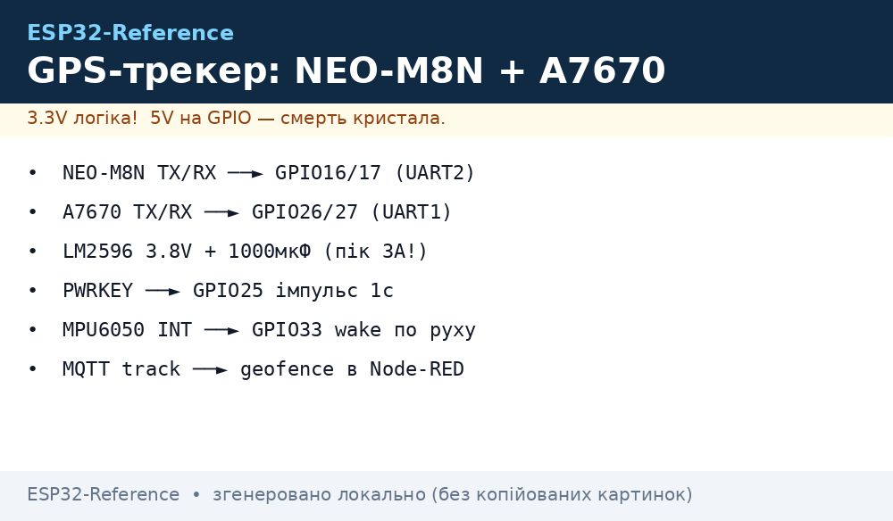
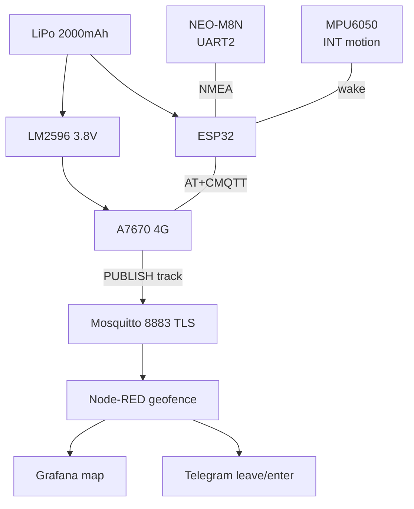
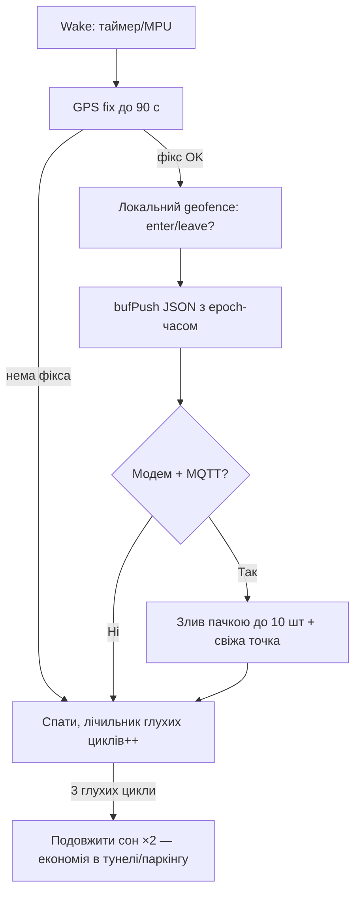

# Проєкт 2 - GPS-трекер: NEO-M8N + A7670 + MQTT + deep-sleep + LiPo


*Рис. Трекер: ESP32 + NEO-M8N (UART) + A7670 (4G), живлення LiPo, uplink MQTT.*

> [!tip] Що будуємо
> Трекер для авто/I2C-адаптера/велосипеда: прокидається раз на 2-5 хв або по руху, бере GPS-фікс, шле координати в MQTT, засинає. Зв'язок - 4G A7670 (наступник SIM800L). База: [SIM800L/GPS](../../../ESP32-Reference/12-Moduli-zvyazku/03-SIM800L-GPS.md), [4G](../../../ESP32-Reference/12-Moduli-zvyazku/07-SIM7600-W5500-MCP2515.md), [MQTT](../../../ESP32-Reference/15-Protokoli/01-MQTT.md), [Sleep](../../../ESP32-Reference/07-Timeri-Son/03-Sleep-ULP.md).

## 1. Мета

Знати, де об'єкт, без підписки на комерційні трекери і з повним контролем даних.

Сценарії:

- авто на стоянці: точка кожні 5 хв + алерт виїзду з geofence;
- велосипед/I2C-адаптер: точка кожні 2 хв у русі, раз на 30 хв у спокої;
- вантаж: LiPo + solar-підзаряд у кузові.

Вимоги:

- фікс < 60 с на вулиці (гарячий/теплий старт);
- похибка < 10 м на відкритому небі;
- 3+ доби від 2000 мАг при циклі 5 хв;
- geofence: коло/прямокутник + подія `enter/leave` у MQTT.

| Параметр | Ціль | Перевірка |
| --- | --- | --- |
| GPS | NEO-M8N, 72 канали, -167 дБм | GGA sats ≥ 6 |
| Модем | A7670 4G, MQTT(S) або HTTP | AT+CMQTTCONNECT OK |
| Цикл | 120-300 с + wake по MPU6050 | лог причини wakeup |
| Батарея | LiPo 2000 мАг + TP4056 | 3 доби треку |
| Топік | `device/<id>/track` JSON | sub у Node-RED |
| Geofence | радіус 300 м навколо дому | тест подій |

> [!warning] 4G ≠ 2G живлення!
> A7670 хоче 3.8V/3A піком, як SIM7600, а не 4.0V/2A SIM800L. Живлення - окремий buck 5→3.8V з конд. 1000 мкФ. Див. [4G](../../../ESP32-Reference/12-Moduli-zvyazku/07-SIM7600-W5500-MCP2515.md) і [GPS](../../../ESP32-Reference/12-Moduli-zvyazku/03-SIM800L-GPS.md).

## 2. BOM - комплектуючі

| Компонент | Нота довідника | Ціна, орієнтовно |
| --- | --- | --- |
| ESP32 DevKit (WROOM-32) | [DevKit](../../../ESP32-Reference/00-Start/04-Devkit-plati.md) | $6 |
| NEO-M8N модуль з антеною | [SIM800L/GPS](../../../ESP32-Reference/12-Moduli-zvyazku/03-SIM800L-GPS.md) | $10 |
| A7670E/SA модуль 4G + антена LTE | [4G](../../../ESP32-Reference/12-Moduli-zvyazku/07-SIM7600-W5500-MCP2515.md) | $25 |
| LiPo 2000 мАг + TP4056 (захист) | [Акумулятори](../../../ESP32-Reference/02-Zhivlennya/04-Akumulyatori-TP4056.md) | $8 |
| Buck LM2596 → 3.8V для A7670 | [Buck/Solar](../../../ESP32-Reference/13-Moduli-zhivlennya-rivniv/01-Buck-Boost-Solar.md) | $2 |
| MPU6050 (wake по руху) | [MPU6050](../../../ESP32-Reference/10-Sensori/04-MPU6050.md) | $2 |
| SIM-карта IoT/M2M | [4G](../../../ESP32-Reference/12-Moduli-zvyazku/07-SIM7600-W5500-MCP2515.md) | $3 |
| Корпус IP54 + гермоввід антен | [Чек-листи](../../../ESP32-Reference/99-Dodatki/03-Cheklisti-montazhu.md) | $5 |
| Дільник VBAT 100к/100к | [ADC](../../../ESP32-Reference/06-Analog/01-ADC.md) | $0.5 |

Разом: ~$60 + SIM-тариф.

Альтернативи:

- замість A7670 - SIM7600G (дорожчий, з GNSS всередині);
- замість MPU6050 - LIS3DH (менше їсть у перериванні);
- для міста - LILYGO T-Beam (ESP32+LoRa+GPS в одному): [T-Beam](../../../ESP32-Reference/14-Devboards/03-LILYGO-TDisplay-TBeam.md).

## 3. Архітектура

### ASCII-схема

```text
              ТРЕКЕР (авто / рюкзак)
     +--------------------------------------+
     |  LiPo 2000 --TP4056--> ESP32 VIN 5V  |
     |   +--> LM2596 (3.8V!) --> A7670 VCC |
     |   +-- 1000uF біля A7670 (пік 3A!)   |
     |                                     |
     |  NEO-M8N TX --> GPIO16 (RX2)         |
     |  NEO-M8N RX <-- GPIO17 (TX2)         |
     |  A7670  TX --> GPIO26 (RX1*)         |
     |  A7670  RX <-- GPIO27 (TX1*)         |
     |  A7670 PWRKEY <-- GPIO25 (імпульс 1c)|
     |  MPU6050 INT --> GPIO33 (wake)       |
     +--------------------------------------+
            | GPS-антена -> небо!  LTE-антена -> вікно
            v
     MQTT(S) :8883  topic device/<id>/track
            |
     Node-RED --> InfluxDB --> Grafana-map + geofence
```

`*` UART1 вільний, бо UART0 - консоль, UART2 - GPS.

### Mermaid



Цикл роботи:

1. wake: таймер 300 с АБО переривання MPU6050;
2. увімкнути GPS, чекати фікс до 90 с (HDOP < 2);
3. PUBLISH JSON + LWT, вимкнути GPS/модем ключем;
4. назад у deep-sleep (див. [Sleep](../../../ESP32-Reference/07-Timeri-Son/03-Sleep-ULP.md)).

Geofence рахуємо НЕ на трекері, а в Node-RED (економія батареї): haversine до центру + гістерезис 50 м.

## 4. Живлення та антени

- A7670: виставити 3.8V БЕЗ модуля, потім підключати; дроти товсті, < 10 см;
- PWRKEY: імпульс LOW 1 с для вмикання, статус по `AT` кожні 5 с до `OK`;
- GPS V_BCKP: батарейка CR1220 або суперкап - теплий старт 5 с замість 60 с;
- антени: GPS - активна 3.3V з видом неба, LTE і GPS рознести на 10+ см;
- VBAT-контроль дільником на GPIO35 (див. [ADC](../../../ESP32-Reference/06-Analog/01-ADC.md)).

Баланс: актив 60-90 с × ~250 мА (GPS+модем) ≈ 5 мАг/цикл → 288 циклів/доба при 5 хв - забагато! Тому в спокої цикл 30 хв (MPU6050 спить), у русі 2 хв. Реально 3-5 діб.

### Бюджет батареї з числами (рахуємо цикл!)

| Фаза циклу | Струм | Час | Заряд |
| --- | --- | --- | --- |
| Прокидання + GPS пошук фікса | ~70 мА (GPS) + ~30 мА (ESP32) | 30 с (теплий) / 90 с (холодний) | 0.8 / 2.5 мАг |
| Реєстрація модема + MQTT-publish | ~250 мА середній (піки 2-3A з конденсатора!) | 15-30 с | 1.0-2.0 мАг |
| Deep-sleep (все вимкнено ключами) | ~0.15 мА (ESP32) + ~0.05 мА (витоки) | решта циклу | ~0.2 мАг/год |
| **Разом теплий цикл 5 хв** | - | - | **~2 мАг** |

```text
LiPo 2000 мАг, корисних 80% = 1600 мАг (не розряджати в нуль — BMS відріже!).
Режим «рух» (цикл 2 хв = 720 циклів/доба × 2 мАг) = 1440 мАг/доба → ~1 доба. МАЛО!
Режим «змішаний» (12 год рух 2 хв + 12 год спокій 30 хв):
  360 × 2 + 24 × 2 = 768 мАг/доба → ~2 доби.
Режим «стоянка» (цикл 30 хв = 48 × 2) = 96 мАг/доба → ~16 діб. ДОБРЕ.
Висновок: MPU6050-wake — не опція, а умова виживання батареї. Холодні старти
(без V_BCKP!) потроюють ціну циклу — батарейка CR1220 окупається за тиждень.
```

## 5. Прошивка покроково

Крок 0 - перевірити модем AT-командами вручну (див. [4G](../../../ESP32-Reference/12-Moduli-zvyazku/07-SIM7600-W5500-MCP2515.md)).

Крок 1 - GPS окремо: читати NMEA, розібрати TinyGPS++ (див. [GPS](../../../ESP32-Reference/12-Moduli-zvyazku/03-SIM800L-GPS.md)).

Крок 2 - MPU6050 motion-INT → ext0-wakeup (див. [MPU6050](../../../ESP32-Reference/10-Sensori/04-MPU6050.md)).

Крок 3 - MQTT через A7670: `AT+CMQTTSTART` → `ACCQ` → `CONNECT` → `PUBLISH`.

Крок 4 - deep-sleep + RTC-пам'ять останнього фікса.

```cpp
#include <TinyGPS++.h>   // GPS-парсер
#include <Wire.h>
// UART2 = GPS (16/17), UART1 = A7670 (26/27) [[04-Shini/01-UART|UART]]
#define GPS_RX 16, GPS_TX 17
#define MOD_RX 26, MOD_TX 27, PWRKEY 25

TinyGPSPlus gps;
HardwareSerial Sgps(2), Smod(1);

void modOn() {
  pinMode(PWRKEY, OUTPUT); digitalWrite(PWRKEY, HIGH);
  delay(200); digitalWrite(PWRKEY, LOW); delay(1200);
  digitalWrite(PWRKEY, HIGH); delay(3000); // чекати реєстрації
}

bool waitFix(uint32_t ms) { // чекати валідний фікс
  uint32_t t0 = millis();
  while (millis() - t0 < ms) {
    while (Sgps.available()) gps.encode(Sgps.read());
    if (gps.location.isValid() && gps.hdop.hdop() < 2.0) return true;
    delay(50);
  }
  return false;
}

void setup() {
  Sgps.begin(9600, SERIAL_8N1, 16, 17);
  Smod.begin(115200, SERIAL_8N1, 26, 27);
  modOn();
  bool fix = waitFix(90000);
  if (fix) {
    char js[200];
    snprintf(js, sizeof(js),
      "{\"lat\":%.6f,\"lon\":%.6f,\"hdop\":%.1f,\"sats\":%d,\"vbat\":%.2f}",
      gps.location.lat(), gps.location.lng(),
      gps.hdop.hdop(), gps.satellites.value(), 3.95);
    // AT+CMQTT... PUBLISH js в topic device/track-01/track
    // [[15-Protokoli/01-MQTT|MQTT]] [[12-Moduli-zvyazku/07-SIM7600-W5500-MCP2515]]
  }
  esp_sleep_enable_timer_wakeup(300ULL * 1000000ULL);
  esp_deep_sleep_start(); // [[07-Timeri-Son/03-Sleep-ULP]]
}
void loop() {}
```

Крок 5 - Node-RED geofence (див. [Cloud](../../../ESP32-Reference/15-Protokoli/05-Cloud-Pipeline.md)):

```javascript
// function: haversine до дому + подія enter/leave з гістерезисом
const HOME = {lat: 50.4501, lon: 30.5234, r: 300};
function dist(a,b,c,d){ /* haversine, м */ }
msg.inside = dist(msg.payload.lat, msg.payload.lon, HOME.lat, HOME.lon, HOME.lat, HOME.lon) < HOME.r;
return msg;
```

### Крок 5а - Локальний geofence НА ТРЕКЕРІ (без мережі!)

Серверний geofence вмирає разом з покриттям. Трекер вміє сам: коло (haversine) + прямокутник, подія `enter/leave` з гістерезисом 50 м, стан - в RTC-пам'яті (переживає deep-sleep!).

```cpp
// Локальний geofence: коло + гістерезис, стан в RTC-пам'яті
RTC_DATA_ATTR bool wasInside = false;
struct Fence { double lat, lon, r; };   // метри
const Fence HOME = {50.4501, 30.5234, 300.0};
static double haversine(double la1, double lo1, double la2, double lo2) {
  const double R = 6371000.0, dLa = (la2 - la1) * 3.14159265 / 180.0;
  const double dLo = (lo2 - lo1) * 3.14159265 / 180.0;
  double a = sin(dLa/2)*sin(dLa/2) + cos(la1*3.14159265/180.0) * cos(la2*3.14159265/180.0) * sin(dLo/2)*sin(dLo/2);
  return 2 * R * asin(sqrt(a));
}
// Виклик після waitFix():
double d = haversine(gps.location.lat(), gps.location.lng(), HOME.lat, HOME.lon);
bool inside = wasInside ? (d < HOME.r + 50.0)   // вихід — тільки за r+50 (гістерезис!)
                        : (d < HOME.r - 50.0);  // вхід — тільки всередину r-50
if (inside != wasInside) {
  wasInside = inside;   // RTC: переживе deep-sleep
  // PUBLISH .../geofence {"event":"leave","d":300} — пріоритетно, навіть без фікса HDOP<2!
}
```

> Чому гістерезис: GPS-точка «дихає» ±10-30 м на стоянці. Без нього межа генерує enter/leave щоцикл - спам у MQTT і злив батареї на publish.

### Крок 5б - Буфер треків при втраті GSM (store-and-forward)

Поле без покриття - норма, а не виняток. Точки пишуться в LittleFS-кільце з епохальним часом (GPS RMC!) і зливаються пачкою при поверненні мережі, див. також [18-Cellular-LoRa-2](../../../ESP32-Reference/12-Moduli-zvyazku/18-Cellular-LoRa-2.md) (офлайн-буфер).

```cpp
// Спрощений кільцевий буфер: /trk/0000.json ... /trk/0199.json (200 точок)
#include <LittleFS.h>
#define BUF_MAX 200
void bufPush(const char* js) {
  static uint16_t head = 0;
  char path[24]; snprintf(path, sizeof(path), "/trk/%04d.json", head % BUF_MAX);
  File f = LittleFS.open(path, "w"); f.print(js); f.close(); head++;
}
bool bufDrainOne() {
  // знайти найстарший непідтверджений, PUBLISH, при +QMTPUB-ok видалити; повернути false якщо порожньо
  return false; // скелет: реалізація під свій AT-стек (CMQTT/QMT/HTTP)
}
// У циклі: bufPush(js) ЗАВЖДИ → якщо мережа є: while(bufDrainOne() && цикли<10);
// Ліміт: при переповненні кільце саме перезаписує найстаріші (head % BUF_MAX).
// Час точок: gps.date + gps.time → epoch; без валідного часу буфер — сміття!
```



### Крок 5в - OTA через модем (обережно!)

Прошивка 1-1.5 МБ через GPRS - повільно (5-15 хв) і дорого (трафік!), але рятує виїзд у поле.

```text
Схема (вбудований HTTP-стек A7670/EC200U):
  1. Хмара публікує .../fw {"ver":"1.4.0","url":"http://fw.example.com/trk_140.bin","sha":"..."}.
  2. Трекер качає AT+HTTPGET у файл (або стримом чанками 4 КБ — RAM!).
  3. SHA-256 файла звірити ДО прошивки. Не зійшлось — стерти, спати.
  4. ESP-IDF: esp_ota_begin/write/end + esp_ota_set_boot_partition; Arduino: Update.begin/writeStream.
  5. Два OTA-банки + відкат: перший boot з новою — self-test (GPS+модем живі?), провал — rollback.
Правила: OTA ТІЛЬКИ при VBAT батареї > 50% (або на зарядці), ТІЛЬКИ за розкладом
(не посеред нічного циклу), версія монотонно вгору (anti-rollback, див. 08-Pamyat/04).
```

## 6. Корпус та монтаж

- GPS-антена - верх корпусу, нічого металевого над нею;
- LTE-антена - боком, подалі від GPS на 10 см;
- трекер під лобовим склом або в I2C-адаптеру верхньою стороною вгору;
- LiPo в жорсткому відсіку, без перегинів, з BMS;
- чек-лист: [Чек-листи](../../../ESP32-Reference/99-Dodatki/03-Cheklisti-montazhu.md).

### Живлення від АКБ авто 12V (режим охорони)

```text
АКБ 12V (10.5–14.7V!) ──[запобіжник 2A]──[TVS SMBJ24A + PTC]──[buck 12→5V 3A]──► VIN трекера
  │                                                              (LiPo лишається як ДБЖ!)
  └── ACC (запалювання) ──[дільник 10к/3.3к]──► GPIO35: HIGH = їдемо (цикл 1 хв),
                                                 LOW = стоянка (цикл 30 хв + geofence!)
```

> Load dump (стрибок до 40-60V при знятті клеми на заведеній!) - TVS гасить, PTC розмикає. Без них перший же «прикур» - останній для трекера. Споживання в охороні < 5 мА середнього - АКБ 60 Аг вистачить на місяці; контроль: при < 11.8V трекер засинає надовго (не посадити авто!).

### Корпус IP65 для вулиці

| Елемент | Рішення |
| --- | --- |
| Коробка | IP65 100×70×45 з прокладкою, див. [03-Enclosure-Cert-Factory](../../../ESP32-Reference/17-Lab/03-Enclosure-Cert-Factory.md) |
| Антени назовні | SMA-переходи в стінці + гумові гумки; GPS-шайба на дах авто магнітом |
| Вентиляція | Gore-мембрана M12 (конденсат вбиває швидше за дощ) |
| Кріплення | DIN/магніти/стяжки - НЕ термоклей (попливе влітку) |
| SIM-доступ | Лоток з гумкою назовні або кришка на гвинтах (крадіжка SIM!) |

## 7. Налагодження

| Симптом | Куди дивитись |
| --- | --- |
| `+CREG: 0,0` / немає мережі | живлення 3.8V + 1000 мкФ, антена LTE, FAQ №32 [FAQ](../../../ESP32-Reference/99-Dodatki/02-Troubleshooting-FAQ.md) |
| GPS немає фікса 15 хв | вид неба, active-антена, FAQ №33 [FAQ](../../../ESP32-Reference/99-Dodatki/02-Troubleshooting-FAQ.md) |
| Модем ребутиться при publish | пік 3A, товсті дроти, FAQ №44 [FAQ](../../../ESP32-Reference/99-Dodatki/02-Troubleshooting-FAQ.md) |
| Батарея сідає за добу | цикли 30 хв у спокої, вимикати GPS ключем, FAQ №59 [FAQ](../../../ESP32-Reference/99-Dodatki/02-Troubleshooting-FAQ.md) |
| MQTT `rc=5` через 4G | APN оператора + логін, FAQ №22 [FAQ](../../../ESP32-Reference/99-Dodatki/02-Troubleshooting-FAQ.md) |
| Час 1970 у треках | NTP або GPS-time перед TLS, FAQ №65 [FAQ](../../../ESP32-Reference/99-Dodatki/02-Troubleshooting-FAQ.md) |

## Офіційні джерела

- [TinyGPS++ - GitHub](https://github.com/mikalhart/TinyGPSPlus) - парсер NMEA, hdop/sats.
- [SIMCom A7670 - AT manual](https://www.simcom.com/product/A7670.html) - CMQTT, PWRKEY, реєстрація.
- [u-blox M8 - даташит](https://www.u-blox.com/en/product/neo-m8-series) - GGA/RMC, backup-живлення.

## Див. також

- [Home](../../../ESP32-Reference/Home.md)
- [SIM800L/GPS](../../../ESP32-Reference/12-Moduli-zvyazku/03-SIM800L-GPS.md)
- [4G](../../../ESP32-Reference/12-Moduli-zvyazku/07-SIM7600-W5500-MCP2515.md)
- [MQTT](../../../ESP32-Reference/15-Protokoli/01-MQTT.md)
- [Sleep](../../../ESP32-Reference/07-Timeri-Son/03-Sleep-ULP.md)
- [MPU6050](../../../ESP32-Reference/10-Sensori/04-MPU6050.md)
- [Cat-1 + LoRa-2 (офлайн-буфер)](../../../ESP32-Reference/12-Moduli-zvyazku/18-Cellular-LoRa-2.md)
- [SIM + живлення модема](../../../ESP32-Reference/12-Moduli-zvyazku/26-SIM-Power.md)
- [OTA](../../../ESP32-Reference/08-Pamyat/03-OTA.md)
- [Корпус/сертифікація](../../../ESP32-Reference/17-Lab/03-Enclosure-Cert-Factory.md)
- [FAQ](../../../ESP32-Reference/99-Dodatki/02-Troubleshooting-FAQ.md)
- [Метеостанція](../../../ESP32-Reference/16-Proekti/01-Weather-Station.md)
- [Контроль доступу](../../../ESP32-Reference/16-Proekti/03-Access-Control.md)
