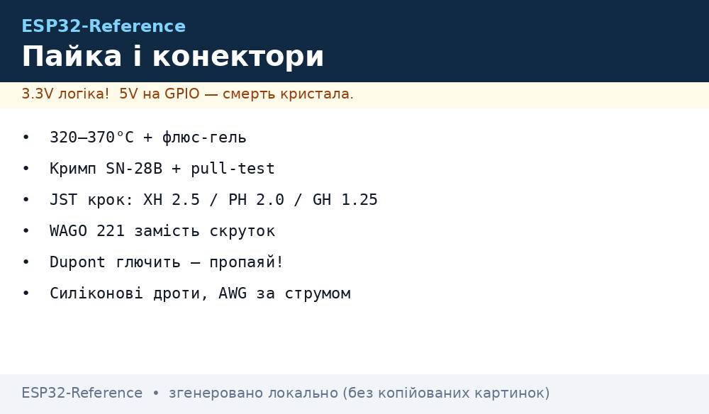
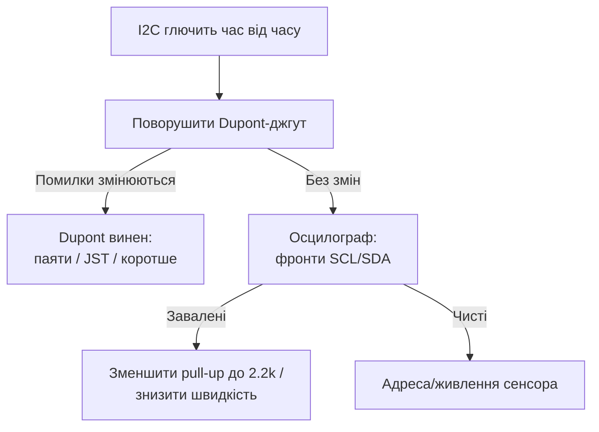

# Lab 2 - Пайка та роз'єми: температури, фен, кримп, JST, WAGO, Dupont, AWG


*Рис. Робоче місце: паяльник 320-370 °C, флюс-гель, оплітка, кримпер SN-28B, набір JST/WAGO/Dupont, силіконові дроти.*

> [!warning] Вентиляція!
> Пари флюсу (особливо активного) шкідливі. Паяти тільки з витяжкою або хоча б вентилятором у вікно. Після пайки мити руки - флюс і свинець не для організму.
>
> [!tip] Призначення розділу
> Ця нота - практика монтажу ESP32-пристроїв: чим і як паяти, як обтискати гільзи кримпером, які роз'єми де ставити і чому Dupont-кабелі - головне джерело «магічних» глюків I2C.

## 1. Призначення

Половина тем з [FAQ](../../../ESP32-Reference/99-Dodatki/02-Troubleshooting-FAQ.md) лікується паяльником: холодна пайка, соплі між пінами, відвалений Dupont, тонкий китайський USB-кабель. Нота відповідає:

- яка температура жала для свинцевого і безсвинцевого припою;
- коли брати фен, а коли паяльник;
- як обтиснути гільзу, щоб тримала кілограми (pull-test!);
- JST-XH/PH/GH/SH - що куди і з яким кроком;
- чому WAGO 221 кращий за гвинтовий клемник у польових умовах;
- які дроти (AWG/силікон) брати під який струм.

## 2. Пайка: температури, припій, флюс, оплітка

### 2.1. Температури жала

| Припій | Склад | Плавлення | Температура жала | Коментар |
| --- | --- | --- | --- | --- |
| Свинцевий | Sn63/Pb37 | 183 °C | 320-340 °C | Легко паяти, блищить; не для продажу в ЄС |
| Безсвинцевий | Sn96.5/Ag3/Cu0.5 (SAC305) | 217-220 °C | 350-370 °C | Тугоплавкий, матовий шов - це норма |
| Масивні полігони GND | будь-який | - | +20-30 °C або підігрів | Полігон відводить тепло |

Правила:

- жало завжди залуджене (блискуча крапля припою перед роботою);
- час контакту з падом - 2-3 с, не довше (відшарування пада, перегрів компонента);
- паяльник 60-75 Вт з регулюванням (T12/936-жала), не «сокира» 100 Вт без регулятора.

### 2.2. Флюс-гель і мідна оплітка

| Матеріал | Для чого | Як користуватись |
| --- | --- | --- |
| Флюс-гель RMA/no-clean (шприц) | Окислені пади, перепайка, SMD | Крапля на місце пайки → гріти → шов тече сам |
| Активний флюс (кислотний) | Тільки дроти, НЕ плати! | Після пайки змити спиртом, інакше з'їсть мідь |
| Мідна оплітка 1.5-2.5 мм | Зняти зайвий припій, прибрати соплю | Просочити флюсом, притиснути жалом, почекати вбирання |
| Сплав Розе / Вуда (демонтаж) | Зняти багатовивідний компонент | Знижує t° плавлення, потім фен + пінцет |

Ознаки доброго шва: конус-«вулканчик», блиск (свинцевий) або рівний мат (безсвинцевий), припій поєднує пад і вивід без кульки. Кулька = холодна пайка = майбутній глюк.

### 2.3. ASCII-схема: правильний контакт жала

```text
   ДОБРЕ:                          ПОГАНО:

   Жало ──┐                        Жало ──► тільки ніжка
          ├──► гріє ПАД + ВИВІД           (пад холодний → кільцева тріщина)
   Пад ───┘         одночасно
        │
   Припій подавати З ІНШОГО БОКУ
   (тече до тепла → сам обволікає)
```

### 2.4. Фен + термопрофіль (оглядово)

Фен - для SMD, роз'ємів з пластиком поруч і демонтажу. Орієнтовний профіль для безсвинцю:

| Фаза | Температура повітря | Час | Що відбувається |
| --- | --- | --- | --- |
| Підігрів | 120-150 °C | 60-90 с | Плата гріється рівномірно, без термошоку |
| Активація флюсу | 150-180 °C | 60 с | Флюс чистить оксиди |
| Пайка (reflow) | 235-250 °C пік | 20-40 с вище 217 °C | Припій плавиться, компоненти сідають |
| Охолодження | природне, без дуття | до <100 °C | Не рухати плату! |

Застереження:

- фен 350 °C впритул плавить JST-корпуси і здуває дрібні 0402 - тримати дистанцію, користуватись насадками;
- літій поруч із феном - заборонено (див. [Акумулятори](../../../ESP32-Reference/02-Zhivlennya/04-Akumulyatori-TP4056.md));
- ESP32-модуль феном не перепаювати без потреби - страждає калібрування RF.

## 3. Кримп SN-28B: гільзи Dupont/JST, pull-test

Поганий кримп гірший за пайку: окислюється, гріється, іскрить. Хороший кримп - газонепроникний контакт на десятиліття.

### 3.1. Анатомія гільзи

```text
   ГІЛЬЗА (вид збоку):

   ┌─ крила ІЗОЛЯЦІЇ (широкі) ─ обіймають ІЗОЛЯЦІЮ дроту
   │
   │   ┌─ крила ЖИЛИ (вузькі) ─ вгризаються в ЖИЛУ
   │   │
   ▼   ▼
   ════════╗
   ║ ІЗОЛ ║ ЖИЛА ║════► контактна частина (в корпус роз'єма)
   ════════╝
```

### 3.2. Процедура кримпу покроково (SN-28B)

1. Зняти ізоляцію 2-3 мм (стрипером, не зубами/ножем по жилах!).
2. Злегка скрутити жили, щоб не пушились.
3. Вставити гільзу в матрицю SN-28B потрібного перерізу (маркування на губках).
4. Покласти дріт: жила - під вузькі крила, ізоляція - під широкі.
5. Стиснути до клацання храповика (не розтискати посередині!).
6. Оглянути: крила загорнуті всередину (літера B у перерізі), жила не вилізла, ізоляція затиснута.
7. **Pull-test: смикнути з зусиллям ~1-2 кг. Вилізло - переробити!**
8. Вставити в корпус до клацання язичка, смикнути назад для контролю.

| Калібр SN-28B | Дріт | Гільза |
| --- | --- | --- |
| 0.25-1.0 мм² | Dupont 22-24 AWG | Dupont female/male |
| 0.1-0.5 мм² | JST-PH/GH тонкі | JST малі серії |
| 0.5-1.5 мм² | Живлення 20-22 AWG | JST-XH, НШВІ малі |

## 4. JST: XH / PH / GH / SH - крок і застосування

| Серія | Крок | Струм (макс) | Застосування в ESP32-проєктах |
| --- | --- | --- | --- |
| JST-XH | 2.50 мм | 3A | Балансирні роз'єми АКБ, живлення плат, вентилятори |
| JST-PH | 2.00 мм | 2A | Акумулятори 1S LiPo, маленькі мотори, датчики |
| JST-GH | 1.25 мм | 1A | Камери, дисплеї, шлейфи (аналог Molex PicoBlade) |
| JST-SH | 1.00 мм | 1A | Qwiic/Stemma-I2C шлейфи сенсорів |

> [!warning] Пастка PH vs XH
> Балансирний XH 2.50 мм і акумуляторний PH 2.00 мм схожі на око, але не взаємозамінні. Силове з'єднання «майже підійшло» плавиться під струмом. Перевіряти крок штангенциркулем!

```text
   КРОК = відстань між центрами сусідніх пінів:

   │◄──2.50──►│◄──2.50──►│   XH
   ●──────────●──────────●

   │◄─2.00─►│◄─2.00─►│        PH
   ●────────●────────●
```

Офіційні каталоги і кроки - на сайті виробника (див. Офіційні джерела).

## 5. WAGO 221 vs гвинтові клемники

| Критерій | WAGO 221 (важілець) | Гвинтовий клемник |
| --- | --- | --- |
| Монтаж | Відкрив важіль → вставив → закрив | Викрутка + момент затягування |
| Багатожильний дріт | Без наконечника, тримає сам | Тільки з НШВІ, інакше розпушується |
| Вібрація | Пружина самопідтискає | Гвинт слабшає → нагрів → пожежа |
| Перевірка | Прозорий корпус видно + тест-отвори | Розбирати |
| Ціна | Дорого (~$0.5-1), але перезапуск безкоштовний | Дешево |

Момент затягування гвинтових клемників - за даташитом (зазвичай 0.4-0.6 Н·м для малих). «Від душі» = зірвана різьба або перерізані жили. У щитку/корпусі з вібрацією - тільки WAGO або гвинт + пружинна шайба + щорічна протяжка.

## 6. Наконечники НШВІ

НШВІ (втулкові ізольовані) - обов'язкові для багатожильних дротів у гвинтових клемах і реле.

Процедура:

1. Зачистити дріт на довжину втулки.
2. Надягти НШВІ відповідного кольору/перерізу (0.5/0.75/1.0/1.5 мм²).
3. Обтиснути прес-кліщами з квадратним/шестигранним профілем (не плоскогубцями!).
4. Ізольована «спідничка» має впертись у зріз ізоляції.
5. Вставити в клему, затягнути нормованим моментом.

## 7. Dupont-ненадійність: чому глючить I2C

Dupont-перемички - для макету на 10 хвилин, не для пристрою.

| Проблема Dupont | Чому глючить саме I2C | Лікування |
| --- | --- | --- |
| Пружинний контакт слабшає | Додаткові 0.5-2 Ом + ємність на SDA/SCL | Паяти або JST-GH/SH шлейф |
| Довжина 20-30 см «локшиною» | Ємність шини > 400 пФ, фронти завалені | Коротше 10 см або знизити швидкість до 50-100 кГц |
| Поруч із WiFi-антеною | Наведення 2.4 ГГц на довгі неекрановані дроти | Кручена пара SDA+GND, SCL+GND |
| «Гніздо» розбовталось після 20 циклів | Періодичний NACK, «плаваючий» глюк | Замінити перемичку, потім - нормальний роз'єм |

Діагностика: поворушити джгут під час опитування сенсора. Помилки з'являються/зникають - це Dupont. Остаточно лікується паянням і фіксацією (див. [Прилади](../../../ESP32-Reference/17-Lab/01-Instruments.md) - декод шини аналізатором).



## 8. USB-кабелі: data vs charge

| Тип | Жили | Як розпізнати |
| --- | --- | --- |
| Data (повний) | VCC, GND, D+, D− (+екран) | Товстіший, порт з'являється, прошивка йде |
| Charge-only | Тільки VCC + GND | Тонкий/плоский з комплекту іграшок, струм є - порту немає |

Детект charge-only: USB-тестер показує струм, але COM-порт не з'являється (процедура - у [Прилади, розділ 7](../../../ESP32-Reference/17-Lab/01-Instruments.md)). Для прошивки тримати один перевірений короткий data-кабель, підписати його.

## 9. Силіконові дроти та AWG-таблиця струмів

Силіконова ізоляція не плавиться від жала і гнеться на морозі - стандарт для внутрішнього монтажу корпусів.

| AWG | Переріз, мм² | Тривалий струм (≈, вільний дріт) | Застосування |
| --- | --- | --- | --- |
| 28 | 0.08 | 0.5A | Сигнали, I2C/SPI шлейфи |
| 26 | 0.13 | 1A | Сигнали, UART |
| 24 | 0.21 | 2A | Сенсори з підігрівом, малі серво |
| 22 | 0.33 | 3-4A | Живлення ESP32-плат (VIN) |
| 20 | 0.52 | 5-6A | Загальний ввід 5V у корпус |
| 18 | 0.82 | 8-10A | Потужні навантаження, реле, стрічки |
| 16 | 1.31 | 12-15A | Силові лінії, АКБ |

Запас: брати на крок товстіше розрахункового, особливо в джгуті і в теплому корпусі (дерейнтинг ~30%).

```text
   ВВІД ЖИВЛЕННЯ В КОРПУС (приклад):

   [БЖ 5V 4A] ══ 18 AWG силікон, червоний/чорний ══► [клема/WAGO] ──► VIN
        │                                                        └─► GND
        └── запобіжник на + (номінал = макс. струм пристрою × 1.25)
```

## Типові помилки

| # | Помилка | Чому погано | Як правильно |
| --- | --- | --- | --- |
| 1 | 280 °C для безсвинцевого припою | Холодна пайка, «кульки» | 350-370 °C, див. таблицю 2.1 |
| 2 | Активний флюс на платі без змивання | З'їдає доріжки за місяці | RMA/no-clean; активний тільки на дроти + змивати |
| 3 | Кримп плоскогубцями | Контакт тримається «на чесному слові» | SN-28B + pull-test 1-2 кг |
| 4 | Жила не під тими крилами гільзи | Ізоляція в контакті жили → обрив | Жила - вузькі крила, ізоляція - широкі |
| 5 | PH замість XH «бо схоже» | Плавлення під струмом | Міряти крок штангенциркулем |
| 6 | Багатожильний дріт у гвинт без НШВІ | Розпушування, нагрів, іскріння | НШВІ + прес-кліщі |
| 7 | Dupont у готовому пристрої | «Магічні» NACK і ребути | Паяти / JST / фіксація джгута |
| 8 | Charge-кабель для прошивки | Порту немає, «драйвер не став» | Перевірений data-кабель, див. розділ 8 |
| 9 | Тонкий дріт 26 AWG на живлення 2A | Просадка, нагрів | 22 AWG і товстіше за таблицею 9 |
| 10 | Фен поруч з АКБ / JST-корпусом | Пожежа / поплавлений роз'єм | Прибрати АКБ, дистанція + насадки |

## Офіційні джерела

- [JST - каталоги роз'ємів (кроки, струми)](https://www.jst-mfg.com/product/detail_e.php?series=277) - XH/PH/GH/SH серії, корпуси і контакти.
- [WAGO - з'єднувачі та клеми](https://www.wago.com/us/products/electrical-interconnect/splicing-connectors-221) - серія 221, характеристики, інструкції монтажу.
- [Espressif - Hardware Design Guidelines](https://docs.espressif.com/projects/esp-hardware-design-guidelines/en/latest/esp32/index.html) - монтаж, розв'язка, вимоги до пайки модулів.
- [Espressif - esptool docs (UART/завантаження)](https://docs.espressif.com/projects/esptool/en/latest/esp32/index.html) - перевірка зв'язку після монтажу USB-UART.

## Див. також

- [Головна](../../../ESP32-Reference/Home.md)
- [Споживання](../../../ESP32-Reference/02-Zhivlennya/03-Spozhivannya.md)
- [Esptool-Flash](../../../ESP32-Reference/09-Proshivka/04-Esptool-Flash.md)
- [Чек-листи монтажу](../../../ESP32-Reference/99-Dodatki/03-Cheklisti-montazhu.md)
- [Прилади](../../../ESP32-Reference/17-Lab/01-Instruments.md)
- [Корпус, сертифікація, виробництво](../../../ESP32-Reference/17-Lab/03-Enclosure-Cert-Factory.md)
- [Ланцюги живлення](../../../ESP32-Reference/02-Zhivlennya/01-Lancjugi-zhivlennya.md)
- [Акумулятори](../../../ESP32-Reference/02-Zhivlennya/04-Akumulyatori-TP4056.md)
- [I2C](../../../ESP32-Reference/04-Shini/03-I2C.md)
- [USB-UART](../../../ESP32-Reference/13-Moduli-zhivlennya-rivniv/05-USB-UART-AutoReset.md)
