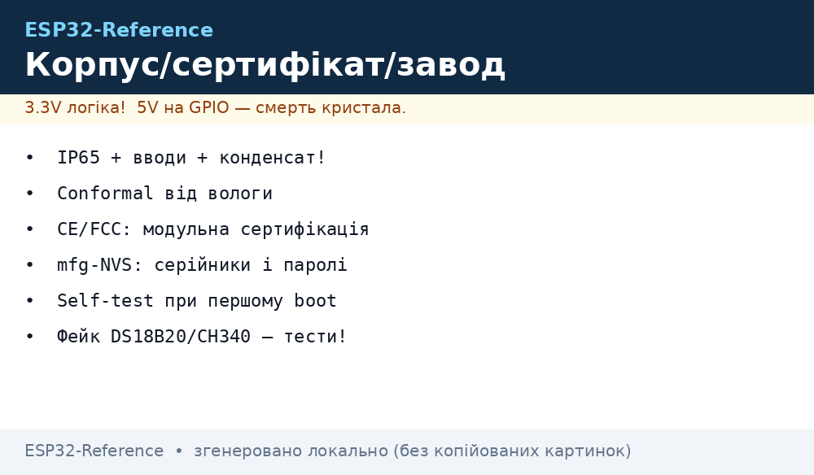
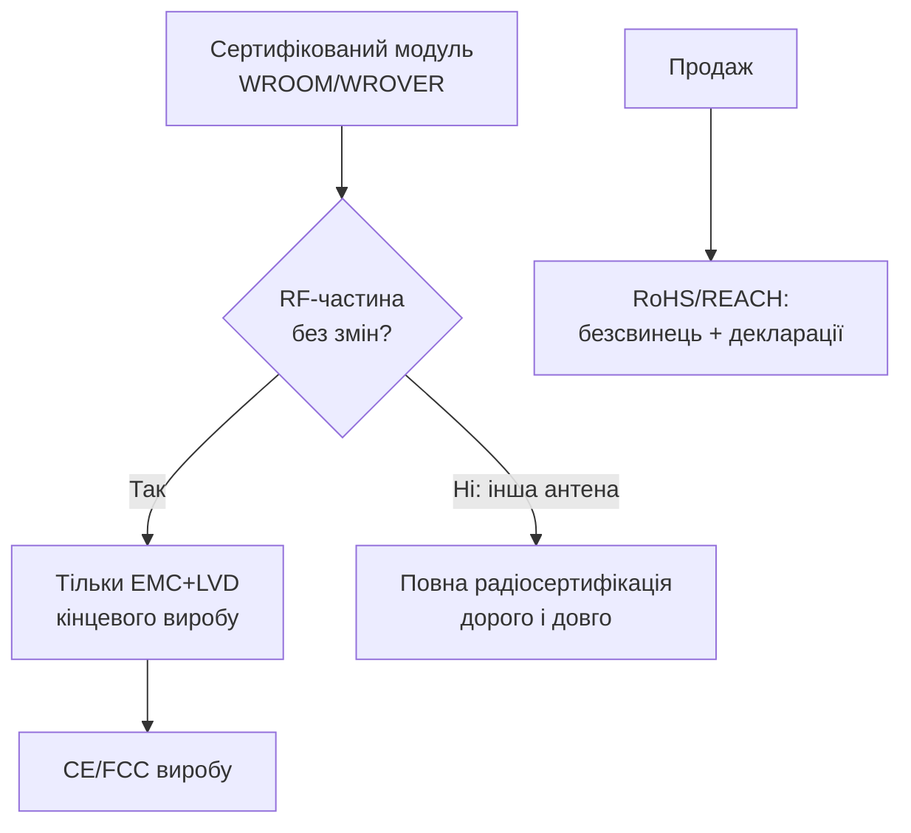
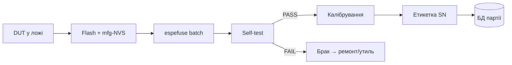

# Lab 3 - Корпус, сертифікація і виробництво: IP65, DIN, CE/FCC, mfg-NVS, ATE, підробки


*Рис. Вузол у корпусі IP65 на DIN-рейці: кабельні вводи, вентиляція з мембраною, плата з конформальним покриттям, етикетка з серійником.*

> [!warning] Мережа 220V і вулиця - без самодіяльності
> Пристрій з 220V у щитку монтує електрик, вуличний корпус заземлюється/герметизується за ПУЕ. Сертифікація (CE/FCC) - для продажу; один екземпляр собі - відповідальність ваша.
>
> [!tip] Призначення розділу
> Ця нота закриває шлях «від макету до виробу»: вибір корпусу, вологозахист, огляд сертифікації, заводське прошивання серійників/ключів і розпізнавання підроблених компонентів.

## 1. Призначення

Макет на столі живе вічно. Пристрій у під'їзді/теплиці/щитку вбивають: волога, пил, конденсат, перегрів, вібрація, стрибки живлення і «економія» на роз'ємах. Розділ відповідає:

- який корпус брати (IP65, DIN-рейка) і як заводити кабелі;
- вентиляція vs конденсат - одвічний компроміс;
- conformal vs potting - коли що;
- що означають CE/FCC/TELEC/RoHS/REACH і що таке модульна сертифікація;
- як на заводі шиють серійники/паролі/ключі (mfg-NVS) і палять eFuse партією;
- що таке перший-boot self-test і ATE-стенд;
- як відрізнити фейкові DS18B20/BME280/CH340/CP2102/AMS1117/SD-карти.

## 2. Корпуси: IP65, DIN-рейка, кабельні вводи

### 2.1. Класи захисту (спрощено)

| Код | Пил | Вода | Де ставити ESP32 |
| --- | --- | --- | --- |
| IP20 | ні | ні | Кімната, шафа автоматики |
| IP54 | частково | бризки | Під навісом, гараж |
| IP65 | пилонепроникний | струмені з будь-якого боку | Вулиця, теплиця, виробництво |
| IP66/IP67 | пилонепроникний | сильні струмені / занурення | Агресивне середовище (рідко треба) |

Друга цифра - про воду, перша - про пил. «IP65» без прокладки і вводів - просто коробка.

### 2.2. DIN-рейка і кабельні вводи

| Елемент | Вибір | Монтаж |
| --- | --- | --- |
| Корпус на DIN | 4-6TE бокс з перегородкою 220V/5V | Див. [Енергомонітор](../../../ESP32-Reference/16-Proekti/04-Energy-Monitor.md) |
| Кабельний ввід PG7/PG9 | Під діаметр КАБЕЛЮ, не отвору | Кабель з крапельником-петлею вниз |
| Заглушки | На всі невикористані отвори | Інакше IP65 = IP20 |
| Кріплення плати | Стійки + гвинти, не «на термоклеї» | Зазор до стінок ≥5 мм |
| Антена | Зовнішня через SMA або вікно без металу | Метал навколо вбудованої антени = немає зв'язку |

```text
   ВВІД КАБЕЛЮ ЗНИЗУ (крапельник):

        ┌───────── корпус IP65 ─────────┐
        │                               │
        │   [плата ESP32]               │
        │        │                      │
        └────────┼──────────────────────┘
                 │ PG-ввід затягнутий
                 │
              ╭──┴──╮  петля-каплевик
              │     │  (вода стікає, не тече всередину)
              │     │
```

### 2.3. ASCII-схема компонування вузла

```text
   +--------------------------------------------------+
   | КОРПУС IP65 (прокладка ціла, гвинти хрест-навхрест)|
   |                                                   |
   |  [ANT-зона без металу]    [плата ESP32 на стійках]|
   |        │                          │  │            |
   |   вікно/SMA              WAGO-клеми  │сенсори      |
   |                                       │           |
   |  PG9: живлення ──► запобіжник ──► БЖ ──┘           |
   |  PG7: сенсори ──► (петлі-крапельники вниз!)        |
   |  Мембрана Gore ── вирівнює тиск, випускає пару    |
   +--------------------------------------------------+
```

## 3. Вентиляція vs конденсат

Герметичний корпус без вентиляції: вдень нагрів → вночі охолодження → розрідження всмоктує вологе повітря через мікрощілини → конденсат на платі. Повністю відкритий: пил + комахи + прямий дощ.

| Підхід | Плюси | Мінуси | Коли |
| --- | --- | --- | --- |
| Повна герметизація + силікагель | Максимум захисту | Треба міняти силікагель, тиск «дихає» | Мала плата, рідке обслуговування |
| Мембрана (Gore-style) | Випускає пару, не пускає воду | Ціна, місце під мембрану | Вулиця з перепадами температур - РЕКОМЕНДОВАНО |
| Вентщілини з лабіринтом | Дешево, охолодження | IP падає до ~IP44 | Навіс, без прямого дощу |
| Активний обігрів/вентилятор | Немає конденсату | Живлення, точки відмови | Шафи з 220V |

Правила:

- дренажний отвір 2-3 мм у найнижчій точці (з сіткою від комах);
- плата вертикально або під кутом - вода не стоїть;
- силікагель-індикатор (синій→рожевий = міняти) при сервісі;
- конформальне покриття плати - другий рубіж (розділ 4).

## 4. Conformal vs potting

| Параметр | Conformal (лак/акрил/силікон) | Potting (компаунд) |
| --- | --- | --- |
| Товщина | 25-100 мкм, плата ремонтопридатна | Моноліт, ремонту немає |
| Вологозахист | Добрий (без занурення) | Максимальний |
| Тепловідвід | Не заважає | Епоксидка тримає тепло - рахувати! |
| Вага/ціна | Дешево, пензель/аерозоль | Дорого, форма, зважування |
| Коли | 90% вуличних ESP32-вузлів | Занурення, агресивна хімія, антивандальність |

Процедура нанесення лаку покроково:

1. Вимити плату спиртом, висушити.
2. Заклеїти маскою: роз'єми, кнопки, контакти програмування, антену, сенсори вологості/тиску (їм потрібне повітря!).
3. 2-3 тонкі шари з просушуванням, а не один товстий.
4. Перевірити під УФ (багато лаків флуоресціюють - видно пропуски).
5. Зняти маски, продзвонити контакти программатора.

> [!warning] Не заливати сенсори!
> BME280/SHT/AHT з залитими отворами - «мертві». Датчики газу (MQ), мікрофони, кнопки - маскувати обов'язково.

## 5. Сертифікація оглядово: CE/FCC/TELEC/RoHS/REACH

| Маркування | Що покриває | Важливо для ESP32 |
| --- | --- | --- |
| CE (ЄС) | EMC + радіо (RED) + безпека (LVD) + RoHS | Потрібна для продажу в ЄС |
| FCC (США) | Part 15 - випромінювання і сприйнятливість | Потрібна для продажу в США |
| TELEC/MIC (Японія) | Радіостандарт Японії | Для ринку JP |
| RoHS | Обмеження Pb/Hg/Cd/Cr-VI/PBB/PBDE | Безсвинцева пайка і компоненти |
| REACH | Хімічні речовини (SVHC) | Декларації постачальників |

### Модульна сертифікація - головний лайфхак

ESP32-модулі (WROOM/WROVER/MINI) вже мають FCC/CE/TELEC як радіомодулі. Використовуючи сертифікований модуль БЕЗ змін RF-частини (та сама антена, те саме розведення за гайдлайном), ви:

- не перепроходите повні радіотести з нуля;
- проходите тільки EMC/безпеку кінцевого виробу (дешевше на порядок).

Умови збереження модульності: не міняти антену/узгодження, не екранувати/розкривати модуль, дотримуватись відстаней з Hardware Design Guidelines. Змінили антену - сертифікат модуля недійсний.



## 6. Завод: mfg-NVS партиція (серійники/паролі/ключі)

Кожен пристрій з конвеєра мусить мати унікальні: серійник, пароль/AP-креденшали або ключі. Рішення Espressif - Manufacturing Utility (`mfg_gen.py`): з CSV генеруються per-device NVS-образи.

Процедура покроково:

1. Описати схему ключів у `sample_config.csv` (namespace + типи).
2. Заповнити `sample_values_singlepage_blob.csv`: серійники, ключі.
3. Згенерувати образи командою (приклад нижче).
4. Прошити кожен пристрій своїм `Sample-<id>.bin` разом з firmware.
5. Вести реєстр «серійник ↔ MAC ↔ покупець/об'єкт».

```bash
# Генерація per-device NVS-образів (див. Офіційні джерела: mass_mfg)
python mfg_gen.py generate samples/sample_config.csv \
  samples/sample_values_singlepage_blob.csv Sample 0x3000
# → bin/Sample-0001.bin, bin/Sample-0002.bin, ... (кожен свій!)
```

```text
   sample_config.csv (приклад):       sample_values_*.csv (приклад):
   ────────────────────────────       ─────────────────────────────────
   device,namespace,                  id,serial_no,dev_key
   serial_no,data,string               1,SN-000001,1a2b3c4d...
   dev_key,data,hex2bin                2,SN-000002,5e6faabb...
```

Прошивка одного образу на всі пристрої = один пароль на всіх = перший же розтин зливає всю партію. Ніколи так не робити для продажу.

## 7. espefuse batch: палити eFuse партією

eFuse - одноразові біти: ключі шифрування, secure-boot дайджести, MAC, захист читання. Помилка = цегла.

Безпечна процедура партії:

1. Відпрацювати ВСЕ на 2-3 жертовних платах.
2. Зберегти робочі команди в скрипт (один файл - одна партія).
3. `espefuse summary` до і після - в лог партії.
4. Палити одним прогоном (кілька команд в одному виклику - менше циклів запису).
5. Перевірити `check-error`, потім увімкнути read/write-protect.
6. Тільки після захистів - відвантажувати.

```bash
# Приклад batch-прогону (ЧИТАТИ доку espefuse перед виконанням!)
espefuse --port /dev/ttyUSB0 summary                    # знімок ДО
espefuse --port /dev/ttyUSB0 burn-key BLOCK_KEY0 enc_key.bin XTS_AES_128_KEY
espefuse --port /dev/ttyUSB0 burn-key-digest secure_boot_key.pem
espefuse --port /dev/ttyUSB0 check-error                 # контроль кодування
espefuse --port /dev/ttyUSB0 write-protect-efuse BLOCK_KEY0
espefuse --port /dev/ttyUSB0 summary                    # знімок ПІСЛЯ в архів
```

> [!danger] eFuse назад не відкотити
> `burn` іде тільки 0→1. Перевірка байтів перед пропалюванням - як перед стрибком: двічі. Виробничий скрипт без `--do-not-confirm` у ручному режимі.

## 8. Перший-boot self-test і ATE-стенд

### 8.1. Self-test при першому завантаженні

Прошивка при першому старті (порожня NVS) ганяє самоперевірку і кладе результат у NVS/лог:

| Тест | Як | Критерій PASS |
| --- | --- | --- |
| Flash | CRC партицій + запис/читання NVS | CRC збігся |
| PSRAM | Запис/читання патернів (за наявності) | 0 помилок |
| WiFi RF | Сканування ефіру, RSSI маяків | Знайдено ≥1 AP, RSSI > −80 |
| Сенсори | WHO_AM_I / пробне читання | ID збігся, дані в діапазоні |
| Живлення | ADC каліброваного дільника | Напруга в допусках |
| Годинник | Uptime + (опц.) NTP | Тікер живий |

```cpp
// Скелет first-boot self-test (ESP-IDF/Arduino логіка)
bool first_boot = !nvs_has("selftest");
if (first_boot) {
  bool ok = test_flash() && test_psram() && test_wifi_scan()
         && test_sensors() && test_power();
  nvs_set("selftest", ok ? "PASS" : "FAIL");
  if (!ok) blink_sos_forever();   // брак — видно без логу
}
```

### 8.2. ATE-стенд коротко

Автоматизований стенд для партії: ложе з pogo-пінами → прошивка → self-test → калібрування → етикетка.

```text
   ATE-СТЕНД (пого-ложе):

   [ПК: скрипт] ─USB──► [пого-плата: TX/RX/EN/BOOT/3V3/GND]
                              ║ pogo-pins (пружинні!)
                              ▼
                        [DUT — плата без роз'ємів]
                              │
   Кроки: flash → espefuse → mfg-NVS → self-test → калибровка →
          → друк етикетки SN → PASS/FAIL-штамп у БД
```

Мінімум стенду: pogo-адаптер під SWD/UART-пад, скрипт `flash+verify`, сканер штрих-коду серійника, коробка PASS/FAIL. Деталі пайки і контактів - у [Пайка та роз'єми](../../../ESP32-Reference/17-Lab/02-Soldering-Connectors.md).



## 9. ПІДРОБКИ-гайд: ознаки + тести

| Компонент | Ознаки підробки | Тест |
| --- | --- | --- |
| DS18B20 | Не читається scratchpad-CRC, «плаваюча» температура, маркування криве | CRC кожного читання; family code 0x28; тест −10…+85 °C проти еталона |
| BME280/BMP280 | ID 0x60 замість 0x58/0x60 плутанина, шум, «пилка» тиску | Прочитати chip-ID; порівняти з другим сенсором; BMP280 видають за BME280 (немає вологості!) |
| CH340/CP2102 | Не ставиться драйвер, гріється, VID/PID чужі | Перевірити VID:PID (1A86:7523 / 10C4:EA60); стабільність 921600 бод |
| AMS1117 | Просадка вже при 300-500 мА, перегрів | Навантажити 500 мА (див. [Прилади](../../../ESP32-Reference/17-Lab/01-Instruments.md)); Vout ≥ 3.15V |
| SD-карти | 64 ГБ за ціною 8 ГБ, швидкість запису кБ/с | H2testw/F3 повний прогін; реальна ємність = межа запису без помилок |
| ESP32 модулі | Кривий шов екрану, не той шрифт, MAC з дивного OUI | `esptool flash-id` + chip-info; звірити MAC OUI Espressif |

Процедура вхідного контролю партії:

1. Візуалка під лупою: маркування, шов екрану, сліди перемаркування (ацетон-тест крапки).
2. Електрика: ID-регістри сенсорів, VID/PID мостів, LDO під навантаженням.
3. RF-вибірково: RSSI/дальність проти еталонного модуля.
4. SD/Flash: повний тест запису (H2testw/F3, `esptool verify`).
5. Брак - окремий пакет з підписом, постачальнику - фото і претензія.

## Типові помилки

| # | Помилка | Чому погано | Як правильно |
| --- | --- | --- | --- |
| 1 | Корпус IP65 без вводів і заглушок | IP65 тільки на папері | PG-вводи за діаметром кабелю + заглушки |
| 2 | Кабель вгору без петлі-крапельника | Вода тече всередину по кабелю | Ввід знизу + петля |
| 3 | Металевий корпус навколо PCB-антени | WiFi «вмирає» | Вікно/зовнішня антена, див. схему 2.3 |
| 4 | Повна герметизація без мембрани | Конденсат з'їдає плату | Мембрана + дренаж + силікагель |
| 5 | Залитий лаком BME280 | Сенсор сліпий | Маскувати сенсори/роз'єми/антену |
| 6 | Зміна антени на сертифікованому модулі | Сертифікат недійсний | Модульна сертифікація - без змін RF |
| 7 | Один NVS-образ на всю партію | Один ключ на всіх пристроях | mfg-NVS per-device, розділ 6 |
| 8 | eFuse «на око» без summary-логів | Цегла без пояснень | Процедура розділу 7, спочатку жертовні плати |
| 9 | Без self-test на конвеєрі | Брак їде клієнту | First-boot тест + ATE, розділ 8 |
| 10 | Дешеві SD/сенсори без вхідного контролю | «Плаваючі» глюки в полі | Тести розділу 9 перед монтажем |

## Офіційні джерела

- [ESP-IDF - Manufacturing Utility (mfg-NVS)](https://docs.espressif.com/projects/esp-idf/en/latest/esp32/api-reference/storage/mass_mfg.html) - генерація per-device NVS-образів.
- [Espressif - espefuse docs](https://docs.espressif.com/projects/esptool/en/latest/esp32/espefuse/index.html) - пропалювання eFuse, захисти, check-error.
- [Espressif - esptool docs](https://docs.espressif.com/projects/esptool/en/latest/esp32/index.html) - прошивка і верифікація партії.
- [Espressif - Hardware Design Guidelines](https://docs.espressif.com/projects/esp-hardware-design-guidelines/en/latest/esp32/index.html) - вимоги до антени і розведення для збереження сертифікації модуля.

## Див. також

- [Головна](../../../ESP32-Reference/Home.md)
- [Споживання](../../../ESP32-Reference/02-Zhivlennya/03-Spozhivannya.md)
- [Esptool-Flash](../../../ESP32-Reference/09-Proshivka/04-Esptool-Flash.md)
- [Чек-листи монтажу](../../../ESP32-Reference/99-Dodatki/03-Cheklisti-montazhu.md)
- [Прилади](../../../ESP32-Reference/17-Lab/01-Instruments.md)
- [Пайка та роз'єми](../../../ESP32-Reference/17-Lab/02-Soldering-Connectors.md)
- [Ланцюги живлення](../../../ESP32-Reference/02-Zhivlennya/01-Lancjugi-zhivlennya.md)
- [Акумулятори](../../../ESP32-Reference/02-Zhivlennya/04-Akumulyatori-TP4056.md)
- [Partitions/NVS](../../../ESP32-Reference/08-Pamyat/01-Partitions-NVS.md)
- [Енергомонітор](../../../ESP32-Reference/16-Proekti/04-Energy-Monitor.md)
