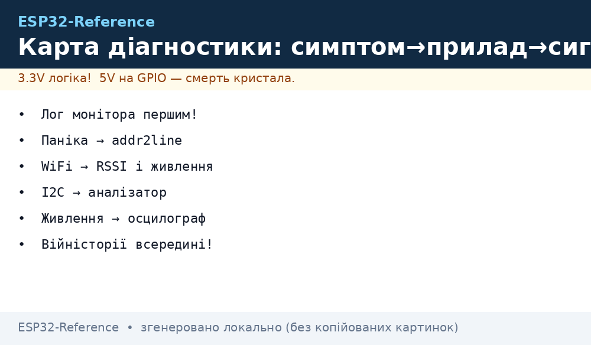
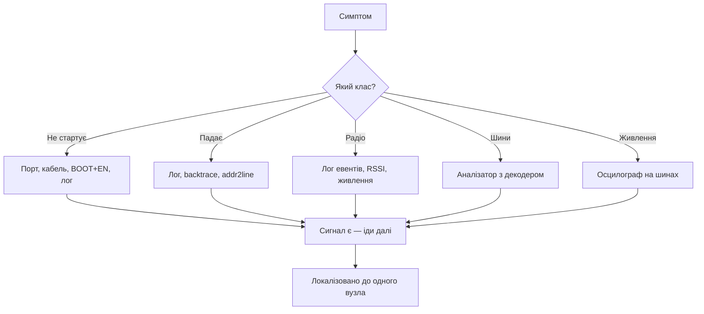

# Карта діагностики - симптом, інструмент, сигнал


*Рис. Від симптому до сигналу: яким приладом і що дивитись.*

> [!tip] Призначення ноти
> Дати таблицю-маршрут: симптом - яким приладом міряти - який сигнал шукати. Доповнення до [FAQ](../../../ESP32-Reference/99-Dodatki/02-Troubleshooting-FAQ.md), а не дубль.

## 1. Як користуватись картою

Знайди симптом у таблиці, візьми прилад, перевір сигнал. Сигналу немає - причина знайдена. Є - іди далі ланцюжком. Розбір причин по кожному симптому - в [FAQ](../../../ESP32-Reference/99-Dodatki/02-Troubleshooting-FAQ.md), тут тільки маршрут вимірів.

## 2. Завантаження і прошивка

| Симптом | Прилад | Сигнал |
| --- | --- | --- |
| Порту немає | Диспетчер пристроїв + інший кабель | COM-порт зявляється при підключенні |
| Логів немає | Serial monitor 115200 | Перший рядок boot при EN |
| Цикл reboot | Лог монітора | Причина ресету: brownout, panic, wdt |
| Заливка рветься | esptool на нижчій швидкості | `write_flash` доходить до 100% |
| Secure-boot цегла | Історія eFuse | Що спалено до прошивки! |

## 3. Паніки і зависання

| Симптом | Прилад | Сигнал |
| --- | --- | --- |
| Guru Meditation | Повний лог у файл | Backtrace + EXCVADDR |
| LoadProhibited | addr2line по ELF | Файл і рядок винуватця |
| Task watchdog | Лог ядра-порушника | Який таск не годує WDT |
| Тихе зависання | JTAG/OpenOCD halt | PC і стек зупиненого ядра |

```text
Конвеєр паніки:
  лог цілком у файл -> addr2line по backtrace -> файл:рядок;
  EXCVADDR нульовий — NULL-вказівник;
  EXCVADDR сміття — переповнення або чужа память.
```

## 4. WiFi і радіо

| Симптом | Прилад | Сигнал |
| --- | --- | --- |
| Не конектиться | Лог WiFi-евентів | Причина disconnect кодом |
| Слабкий сигнал | Сканування RSSI | Рівень на місці вузла |
| Рветься при TX | Осцилограф на 3.3V | Просадка в момент пакетів |
| BLE не видно | Сканер телефона | Advertising-пакети в ефірі |
| MQTT мовчить | Лог клієнта + брокер | CONNECT доходить чи ні |

## 5. Шини і сенсори

| Симптом | Прилад | Сигнал |
| --- | --- | --- |
| I2C NACK | Логічний аналізатор | Адреса на лінії vs даташит |
| I2C висить | Осцилограф на SCL | Лінія в нулі - слейв тримає |
| SPI зсув | Аналізатор з декодером | CPOL/CPHA з обох боків |
| АЦП шумить | Осцилограф на живленні | Пульсації синхронно з WiFi |
| Датчик бреше | Еталон поруч | Розбіжність з відомим добрим |

## 6. Живлення і сон

| Симптом | Прилад | Сигнал |
| --- | --- | --- |
| Brownout при WiFi | Осцилограф на VIN | Провал нижче порога |
| Струм сну великий | Амперметр у розрив | USB-UART і LDO їдять більше чипа! |
| Не прокидається | Лог wakeup-причини | Яке джерело спрацювало |
| CAM reboot на фото | Осцилограф на 5V | Просадка при PSRAM+камера |

## Mermaid: маршрут діагностики



## 7. Покажчик інструментів: що можу з тим, що є

| Маю | Можу перевірити | Не можу |
| --- | --- | --- |
| Тільки USB-кабель | Порт, лог, заливка | Все аналогове |
| Плюс мультиметр | Живлення, короткі, струм | Таймінги і протоколи |
| Плюс аналізатор | I2C/SPI/UART декодери | Аналоговий шум |
| Плюс осцилограф | Пульсації, кварци, фронти | Спектр радіо |
| Плюс JTAG | Halt, регістри, тихі зависання | Ціна часу налаштування |

```text
Пріоритет покупок:
  кабель з даними -> мультиметр -> аналізатор -> осцилограф -> JTAG-зонд.
```

## 8. Журнал діагностики: що записати

| Поле | Навіщо |
| --- | --- |
| Симптом дослівно | Повторити через місяць |
| Плата і ревізія | Клони поводяться по-різному! |
| Лог цілком | Перші рядки найважливіші |
| Що вже перевірено | Не ходити колами |
| Мінімальний скетч | Голий приклад з багом |

## 9. Війністорії карти: ще п'ять (В6-В10)

### В6. S3 не бачиться по USB

| Поле | Запис |
| --- | --- |
| Симптом | Порту немає після прошивки |
| Вимір | Не той розєм: UART замість native USB |
| Причина | Два порти на DevKitC, потрібен USB-OTG |
| Фікс | Правильний кабель у правильний розєм |

### В7. Strapping вбиває boot після монтажу

| Поле | Запис |
| --- | --- |
| Симптом | На макетці працювало, на платі - ні |
| Вимір | GPIO12 притягнуто периферією |
| Причина | Напруга flash вибралась не та |
| Фікс | Звільнити стрепінг-піни в розводці |

### В8. Deep-sleep їсть міліампери

| Поле | Запис |
| --- | --- |
| Симптом | Батарея сідає за тижні |
| Вимір | Без USB-UART - мікроампери, з ним - ні |
| Причина | Міст і LDO не сплять |
| Фікс | Міряти голий модуль, спати по-справжньому |

### В9. PSRAM не знайдено

| Поле | Запис |
| --- | --- |
| Симптом | `PSRAM not found` в лозі |
| Вимір | Конфіг без SPIRAM |
| Причина | Не увімкнено в menuconfig |
| Фікс | Увімкнути, перезібрати, перевірити розмір |

### В10. Час 1970 після кожної перезавантажки

| Поле | Запис |
| --- | --- |
| Симптом | TLS падає, логіка часу бреше |
| Вимір | SNTP не встигає до першого з'єднання |
| Причина | Немає очікування синхронізації |
| Фікс | Чекати time > 2024 року перед мережею |

## Див. також

- [Home](../../../ESP32-Reference/Home.md)
- [Troubleshooting-FAQ](../../../ESP32-Reference/99-Dodatki/02-Troubleshooting-FAQ.md)
- [03-Cheklisti-montazhu](../../../ESP32-Reference/99-Dodatki/03-Cheklisti-montazhu.md)
- [01-Instruments](../../../ESP32-Reference/17-Lab/01-Instruments.md)
- [Макетка](../../../ESP32-Reference/17-Lab/05-Breadboard-Mezhi.md)
- [05-JTAG-Debug](../../../ESP32-Reference/09-Proshivka/05-JTAG-Debug.md)
