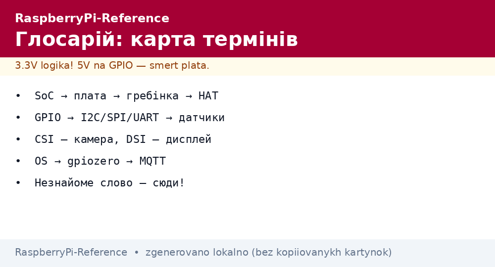
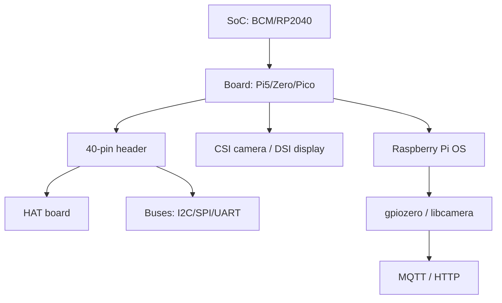

# Raspberry Pi glossary - SoC, GPIO, HAT, CSI, PIO and all reference terms

*Fig. Term map: hardware (SoC to board to HAT), interfaces (GPIO to buses to CSI/DSI), software (OS to libraries to cloud).*

> [!tip] What this note is
> Base dictionary: each term in one paragraph linked to a note. Read it on the first meeting with an unknown word. Entry: [how to use](../../../RaspberryPi-Reference/00-Start/01-Yak-koristuvatis-dovidnikom.md), next: [board comparison](../../../RaspberryPi-Reference/00-Start/03-Porivnyannya-plate.md).

## 1. Goal

Give single definitions so notes do not drift in terminology:

- hardware: SoC, models, memory, power supply;
- contacts: GPIO, pin header, HAT, buses;
- cameras and displays: CSI, DSI, Picamera2;
- software: OS, Imager, EEPROM, Device Tree.

## 2. Hardware: chips and boards

| Term | Meaning | Note |
| --- | --- | --- |
| SoC | crystal with CPU+GPU+memory (BCM2712, RP2040) | [SoC overview](../../../RaspberryPi-Reference/01-Hardware/01-SoC-Oglyad.md) |
| BCM2712 | Pi 5 chip: 4xA76 2.4 GHz, VideoCore VII | [BCM2712 and Pi 5](../../../RaspberryPi-Reference/01-Hardware/02-BCM2712-Pi5.md) |
| RP2040/RP2350 | Pico microcontrollers: M0+/M33, PIO | [RP2040 and RP2350](../../../RaspberryPi-Reference/01-Hardware/03-RP2040-RP2350.md) |
| Pi 5/4/Zero/Pico | board models of various classes | [Pi 5 flagship](../../../RaspberryPi-Reference/14-Devboards/01-Pi5-Flagman.md) |
| CM4/CM5 | Compute Module for embedding | [CM modules](../../../RaspberryPi-Reference/14-Devboards/05-CM4-CM5.md) |
| HAT | board for the 40-pin header with EEPROM | [Sense sensor board](../../../RaspberryPi-Reference/12-Moduli-zvyazku/01-Sense-HAT.md) |
| PoE HAT | power over Ethernet cable | [PoE power](../../../RaspberryPi-Reference/02-Zhivlennya/02-PoE-HAT.md) |

## 3. Contacts and buses

| Term | Meaning | Note |
| --- | --- | --- |
| GPIO | general purpose pin, 3.3V logic | [pin header and gpiozero](../../../RaspberryPi-Reference/03-GPIO/01-Header-Gpiozero.md) |
| 3.3V logic | HIGH=3.3V, 5V on input - death | [pin header and gpiozero](../../../RaspberryPi-Reference/03-GPIO/01-Header-Gpiozero.md) |
| I2C | two-wire sensor bus, 100/400 kHz | [I2C/SPI/UART buses](../../../RaspberryPi-Reference/04-Shini/01-I2C-SPI-UART.md) |
| SPI | fast bus for displays and ADCs | [I2C/SPI/UART buses](../../../RaspberryPi-Reference/04-Shini/01-I2C-SPI-UART.md) |
| UART | serial port, console and modems | I2C/SPI/UART buses |
| USB-CDC | virtual COM port of Pico and programmers | buses and USB |
| PWM | PWM: brightness, servo, sound | [PWM and interrupts](../../../RaspberryPi-Reference/03-GPIO/02-PWM-Pererivannya.md) |
| PIO | RP2040 programmable engines (hardware bit-bang) | [RP2040 and RP2350](../../../RaspberryPi-Reference/01-Hardware/03-RP2040-RP2350.md) |

## 4. Cameras, displays, sound

| Term | Meaning | Note |
| --- | --- | --- |
| CSI | camera flex cable (not USB!) | [CSI camera](../../../RaspberryPi-Reference/10-Sensori/06-Kamera-CSI.md) |
| DSI | display flex cable | [DSI/HDMI displays](../../../RaspberryPi-Reference/11-Vivid/01-DSI-HDMI-Displeyi.md) |
| Picamera2 | camera library of the new stack | [CSI camera](../../../RaspberryPi-Reference/10-Sensori/06-Kamera-CSI.md) |
| HDMI | monitor/TV, sound too | [DSI/HDMI displays](../../../RaspberryPi-Reference/11-Vivid/01-DSI-HDMI-Displeyi.md) |
| I2S | digital audio to DACs/microphones | [audio and HAT](../../../RaspberryPi-Reference/11-Vivid/03-Audio-HAT.md) |

## 5. Power supply and memory

| Term | Meaning | Note |
| --- | --- | --- |
| USB-C PD | Pi 4/5 power: 5V 3A/5A | [USB-C power](../../../RaspberryPi-Reference/02-Zhivlennya/01-USB-C-PD.md) |
| Undervoltage | lightning on screen = weak PSU | [USB-C power](../../../RaspberryPi-Reference/02-Zhivlennya/01-USB-C-PD.md) |
| UPS HAT | UPS on 18650 cells | [UPS boards](../../../RaspberryPi-Reference/02-Zhivlennya/03-UPS-18650.md) |
| SD/eMMC/NVMe | system media by speed | [memory media](../../../RaspberryPi-Reference/08-Pamyat/01-SD-eMMC-NVMe.md) |
| EEPROM | Pi 4/5 bootloader on board | [EEPROM boot](../../../RaspberryPi-Reference/09-Proshivka/02-EEPROM-Boot.md) |

## 6. Software and network

| Term | Meaning | Note |
| --- | --- | --- |
| Raspberry Pi OS | official OS (Bookworm) | [OS setup](../../../RaspberryPi-Reference/09-Proshivka/03-OS-Nalashtuvannya.md) |
| Imager | out of box SD flasher | [Imager flashing](../../../RaspberryPi-Reference/09-Proshivka/01-Imager-Headless.md) |
| Headless | no monitor, over SSH | [Imager flashing](../../../RaspberryPi-Reference/09-Proshivka/01-Imager-Headless.md) |
| Device Tree | hardware description for the kernel (config.txt) | [OS setup](../../../RaspberryPi-Reference/09-Proshivka/03-OS-Nalashtuvannya.md) |
| gpiozero | Python GPIO library | [pin header and gpiozero](../../../RaspberryPi-Reference/03-GPIO/01-Header-Gpiozero.md) |
| MQTT | telemetry protocol | [MQTT protocol](../../../RaspberryPi-Reference/15-Protokoli/01-MQTT.md) |
| HAT EEPROM | ID chip of the expansion board | [HAT and EEPROM](../../../RaspberryPi-Reference/03-GPIO/03-HAT-EEPROM.md) |

## 6.1 Network terms

| Term | Meaning |
| --- | --- |
| SSH | secure console over network, port 22 |
| VNC/RDP | remote graphical desktop |
| AP/STA | WiFi access point / client |
| DHCP | automatic IP issue by router |
| mDNS | `raspberrypi.local` name with no IP to remember |
| I2C address | 7-bit device number on the bus (`i2cdetect` scanner) |
| Baud | UART speed in baud (115200 - console standard) |
| Pull-up/down | input pull to power/ground against floating |
| Debounce | button bounce suppression (20-50 ms) |
| Duty cycle | PWM duty in percent |

## 7. How to read abbreviations on schematics

- `SDA/SCL` - I2C data/clock;
- `MOSI/MISO/SCK/CS` - SPI signals;
- `TXD/RXD` - UART (crossed!);
- `5V/3V3/GND` - header power and ground;
- `RUN` - board reset/start pin;
- `PoE` - power over twisted pair (only with HAT!).

## 7.1 Units and board marks

- `5V`, `3V3`, `GND` - header power rails;
- `RUN` - start/reset input (short to ground = reboot);
- `PoE` - twisted pair power contacts (work only with PoE HAT);
- `ACT` - green SD activity LED;
- `PWR` - red power LED (blinks on sag);
- `HDMI0/HDMI1` - primary and second outputs (first closer to USB-C);
- `CAM/DISP` - camera and display flexes (identical connectors, do not mix);
- `J2/J8` - header number on schematic (J8 - main 40-pin);
- `TP1/TP2` - power test points for a multimeter;
- `EEPROM` - bootloader chip (Pi 4/5, updated by utility).

## Common issues

| Symptom | Cause | Fix |
| --- | --- | --- |
| Term unclear | skipped the glossary | find the word here, then go to the note in the third column |
| CSI mixed with USB | both say "camera" | CSI - flex to the CAMERA socket, USB - to the port |
| HAT does not fit | 26-pin header (old Pi) | HAT needs 40 pins (B+ and newer) |
| 5V on GPIO | "Arduino allows it" | not allowed: 3.3V level, a level shifter is mandatory |
| PIO mixed with PWM | both "hardware" | PIO - Pico engines, PWM - width modulator |
| Pi EEPROM mixed with BIOS | other architecture | bootloader in SPI-flash, updated by utility |

## 9. Related notes

- [how to use](../../../RaspberryPi-Reference/00-Start/01-Yak-koristuvatis-dovidnikom.md) - reading paths.
- [board comparison](../../../RaspberryPi-Reference/00-Start/03-Porivnyannya-plate.md) - hardware choice.
- [environment choice](../../../RaspberryPi-Reference/00-Start/05-Vibir-seredovischa.md) - software choice.
- [home map](../../../RaspberryPi-Reference/Home.md) - full navigation.

## Official sources

- [Getting Started (Raspberry Pi docs)](https://www.raspberrypi.com/documentation/computers/getting-started.html) - first start terms.
- [Raspberry Pi OS (Raspberry Pi)](https://www.raspberrypi.com/software/) - system editions.
- [gpiozero docs (Read the Docs)](https://gpiozero.readthedocs.io/en/stable/) - GPIO object dictionary.
