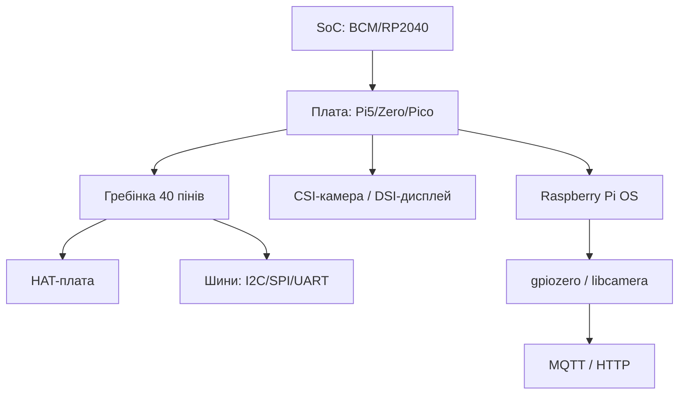

# Глосарій Raspberry Pi - SoC, GPIO, HAT, CSI, PIO і всі терміни бази

EN version: `00-Start/02-Glossary.en.md`

*Рис. Карта термінів: залізо (SoC→плата→HAT), інтерфейси (GPIO→шини→CSI/DSI), софт (OS→бібліотеки→хмара).*

> [!tip] Що це за нота
> Словник бази: кожен термін - одним абзацом з прив'язкою до ноти. Читати при першій зустрічі з незнайомим словом. Вхід: [як користуватись](../../../RaspberryPi-Reference/00-Start/01-Yak-koristuvatis-dovidnikom.md), далі: [порівняння моделей](../../../RaspberryPi-Reference/00-Start/03-Porivnyannya-plate.md).

## 1. Мета

Дати єдині визначення, щоб ноти не розходились у термінології:

- залізо: SoC, моделі, пам'ять, живлення;
- контакти: GPIO, гребінка, HAT, шини;
- камери і дисплеї: CSI, DSI, Picamera2;
- софт: OS, Imager, EEPROM, Device Tree.

## 2. Залізо: чипи і плати

| Термін | Значення | Нота |
| --- | --- | --- |
| SoC | кристал з CPU+GPU+пам'яттю (BCM2712, RP2040) | [огляд SoC](../../../RaspberryPi-Reference/01-Hardware/01-SoC-Oglyad.md) |
| BCM2712 | чип Pi 5: 4×A76 2.4 ГГц, VideoCore VII | [BCM2712 і Pi 5](../../../RaspberryPi-Reference/01-Hardware/02-BCM2712-Pi5.md) |
| RP2040/RP2350 | мікроконтролери Pico: M0+/M33, PIO | [RP2040 і RP2350](../../../RaspberryPi-Reference/01-Hardware/03-RP2040-RP2350.md) |
| Pi 5/4/Zero/Pico | моделі плат різних класів | [флагман Pi 5](../../../RaspberryPi-Reference/14-Devboards/01-Pi5-Flagman.md) |
| CM4/CM5 | Compute Module для вбудовування | [модулі CM](../../../RaspberryPi-Reference/14-Devboards/05-CM4-CM5.md) |
| HAT | плата на гребінку 40 пінів з EEPROM | [сенсорна Sense-плата](../../../RaspberryPi-Reference/12-Moduli-zvyazku/01-Sense-HAT.md) |
| PoE HAT | живлення по Ethernet-кабелю | [живлення PoE](../../../RaspberryPi-Reference/02-Zhivlennya/02-PoE-HAT.md) |

## 3. Контакти і шини

| Термін | Значення | Нота |
| --- | --- | --- |
| GPIO | пін загального призначення, 3.3V логіка | [гребінка і gpiozero](../../../RaspberryPi-Reference/03-GPIO/01-Header-Gpiozero.md) |
| 3.3V логіка | HIGH=3.3V, 5V на вхід - смерть | [гребінка і gpiozero](../../../RaspberryPi-Reference/03-GPIO/01-Header-Gpiozero.md) |
| I2C | двопровідна шина датчиків, 100/400 кГц | [шини I2C/SPI/UART](../../../RaspberryPi-Reference/04-Shini/01-I2C-SPI-UART.md) |
| SPI | швидка шина дисплеїв і АЦП | [шини I2C/SPI/UART](../../../RaspberryPi-Reference/04-Shini/01-I2C-SPI-UART.md) |
| UART | послідовний порт, консоль і модеми | шини I2C/SPI/UART |
| USB-CDC | віртуальний COM-порт Pico і програматорів | шини і USB |
| PWM | ШІМ: яскравість, серво, звук | [ШІМ і переривання](../../../RaspberryPi-Reference/03-GPIO/02-PWM-Pererivannya.md) |
| PIO | програмовані автомати RP2040 (апаратний bit-bang) | [RP2040 і RP2350](../../../RaspberryPi-Reference/01-Hardware/03-RP2040-RP2350.md) |

## 4. Камери, дисплеї, звук

| Термін | Значення | Нота |
| --- | --- | --- |
| CSI | шлейф камери (не USB!) | [камера CSI](../../../RaspberryPi-Reference/10-Sensori/06-Kamera-CSI.md) |
| DSI | шлейф дисплея | [дисплеї DSI/HDMI](../../../RaspberryPi-Reference/11-Vivid/01-DSI-HDMI-Displeyi.md) |
| Picamera2 | бібліотека камер нового стека | [камера CSI](../../../RaspberryPi-Reference/10-Sensori/06-Kamera-CSI.md) |
| HDMI | монітор/телевізор, звук теж | [дисплеї DSI/HDMI](../../../RaspberryPi-Reference/11-Vivid/01-DSI-HDMI-Displeyi.md) |
| I2S | цифровий звук на ЦАП/мікрофони | [аудіо і HAT](../../../RaspberryPi-Reference/11-Vivid/03-Audio-HAT.md) |

## 5. Живлення і пам'ять

| Термін | Значення | Нота |
| --- | --- | --- |
| USB-C PD | живлення Pi 4/5: 5V 3A/5A | [живлення USB-C](../../../RaspberryPi-Reference/02-Zhivlennya/01-USB-C-PD.md) |
| Undervoltage | блискавка на екрані = слабкий БЖ | [живлення USB-C](../../../RaspberryPi-Reference/02-Zhivlennya/01-USB-C-PD.md) |
| UPS HAT | безперебійник на 18650 | [UPS-плати](../../../RaspberryPi-Reference/02-Zhivlennya/03-UPS-18650.md) |
| SD/eMMC/NVMe | носії системи за швидкістю | [носії пам'яті](../../../RaspberryPi-Reference/08-Pamyat/01-SD-eMMC-NVMe.md) |
| EEPROM | завантажувач Pi 4/5 на платі | [завантаження EEPROM](../../../RaspberryPi-Reference/09-Proshivka/02-EEPROM-Boot.md) |

## 6. Софт і мережа

| Термін | Значення | Нота |
| --- | --- | --- |
| Raspberry Pi OS | офіційна ОС (Bookworm) | [налаштування ОС](../../../RaspberryPi-Reference/09-Proshivka/03-OS-Nalashtuvannya.md) |
| Imager | прошивальник SD з коробки | [прошивка Imager](../../../RaspberryPi-Reference/09-Proshivka/01-Imager-Headless.md) |
| Headless | без монітора, через SSH | [прошивка Imager](../../../RaspberryPi-Reference/09-Proshivka/01-Imager-Headless.md) |
| Device Tree | опис заліза для ядра (config.txt) | [налаштування ОС](../../../RaspberryPi-Reference/09-Proshivka/03-OS-Nalashtuvannya.md) |
| gpiozero | Python-бібліотека GPIO | [гребінка і gpiozero](../../../RaspberryPi-Reference/03-GPIO/01-Header-Gpiozero.md) |
| MQTT | протокол телеметрії | [протокол MQTT](../../../RaspberryPi-Reference/15-Protokoli/01-MQTT.md) |
| HAT EEPROM | мікросхема ID плати розширення | [HAT і EEPROM](../../../RaspberryPi-Reference/03-GPIO/03-HAT-EEPROM.md) |

## 6.1 Мережеві терміни

| Термін | Значення |
| --- | --- |
| SSH | безпечна консоль по мережі, порт 22 |
| VNC/RDP | графічний стіл віддалено |
| AP/STA | точка доступу / клієнт WiFi |
| DHCP | автоматична видача IP роутером |
| mDNS | ім'я `raspberrypi.local` без запам'ятовування IP |
| I2C-адреса | 7-бітний номер пристрою на шині (сканер `i2cdetect`) |
| Baud | швидкість UART в бодах (115200 - стандарт консолі) |
| Pull-up/down | підтяжка входу до живлення/землі проти «плавання» |
| Debounce | придушення брязкоту кнопки (20-50 мс) |
| Duty cycle | шпаруватість ШІМ у відсотках |

## 7. Як читати скорочення на схемах

- `SDA/SCL` - дані/такт I2C;
- `MOSI/MISO/SCK/CS` - SPI-сигнали;
- `TXD/RXD` - UART (перехресно!);
- `5V/3V3/GND` - живлення і земля гребінки;
- `RUN` - пін скидання/запуску плати;
- `PoE` - живлення по витій парі (тільки з HAT!).

## 7.1 Одиниці і позначки на платах

- `5V`, `3V3`, `GND` - шини живлення гребінки;
- `RUN` - вхід запуску/скидання (коротнути на землю = ребут);
- `PoE` - контакти живлення по витій парі (працюють лише з PoE HAT);
- `ACT` - зелений світлодіод активності SD-карти;
- `PWR` - червоний світлодіод живлення (моргає при просадці);
- `HDMI0/HDMI1` - основний і другий виходи (перший ближче до USB-C);
- `CAM/DISP` - шлейфи камери і дисплея (ідентичні роз'єми, не плутати);
- `J2/J8` - номер гребінки на схемі (J8 - основна 40-пінова);
- `TP1/TP2` - тест-поїнти живлення для мультиметра;
- `EEPROM` - мікросхема завантажувача (Pi 4/5, оновлюється утилітою).

## 8. Типові помилки

| Симптом | Причина | Лікування |
| --- | --- | --- |
| Термін незрозумілий | пропустили глосарій | шукати слово тут, далі - в ноту з третьої колонки |
| CSI плутають з USB | обидва - «камера» | CSI - шлейф до роз'єму CAMERA, USB - в порт |
| HAT не стає | гребінка 26 пінів (старі Pi) | HAT треба 40 пінів (B+ і новіші) |
| 5V на GPIO | «а на Arduino можна» | не можна: рівень 3.3V, перетворювач рівнів обов'язковий |
| PIO плутають з PWM | обидва «апаратні» | PIO - автомати Pico, PWM - модулятор ширини |
| EEPROM Pi плутають з BIOS | інша архітектура | завантажувач у SPI-flash, оновлюється утилітою |

## 9. Суміжні ноти

- [як користуватись](../../../RaspberryPi-Reference/00-Start/01-Yak-koristuvatis-dovidnikom.md) - маршрути читання.
- [порівняння моделей](../../../RaspberryPi-Reference/00-Start/03-Porivnyannya-plate.md) - вибір заліза.
- [вибір середовища](../../../RaspberryPi-Reference/00-Start/05-Vibir-seredovischa.md) - вибір софту.
- [головна карта](../../../RaspberryPi-Reference/Home.md) - повна навігація.

## Офіційні джерела

- [Getting Started (Raspberry Pi docs)](https://www.raspberrypi.com/documentation/computers/getting-started.html) - терміни першого запуску.
- [Raspberry Pi OS (Raspberry Pi)](https://www.raspberrypi.com/software/) - редакції системи.
- [gpiozero docs (Read the Docs)](https://gpiozero.readthedocs.io/en/stable/) - словник GPIO-об'єктів.
