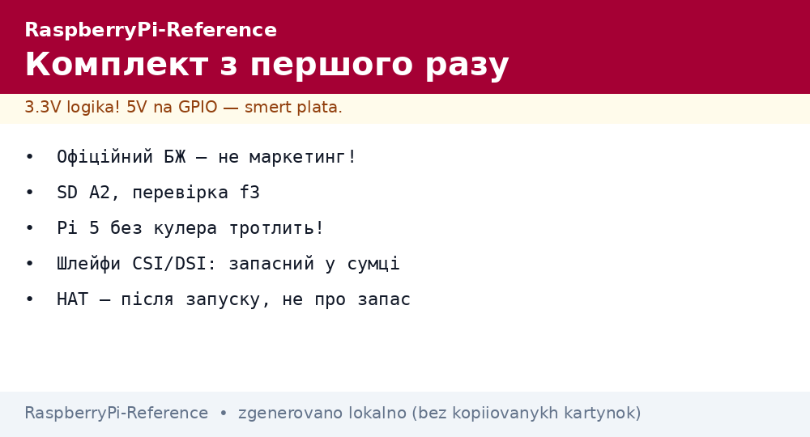
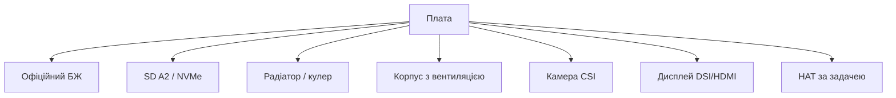

# Плати і аксесуари Raspberry Pi - офіційний БЖ, SD, корпуси, камери

EN version: `00-Start/04-Devkit-plati.en.md`

*Рис. Обов'язковий мінімум: плата + офіційний БЖ + SD A2 + охолодження; далі - камера, дисплей, HAT.*

> [!tip] Що це за нота
> Чекліст покупки: що обов'язково, що бажано, що не брати. Половина «непрацюючих» Pi - це економія на БЖ і SD-карті. Після покупки - [середовище](../../../RaspberryPi-Reference/00-Start/05-Vibir-seredovischa.md) і прошивка. Плати детально: флагман Pi 5.

## 1. Мета

Зібрати комплект з першого разу:

- обов'язковий мінімум під кожну модель;
- як відрізнити нормальний БЖ і SD-карту від сміття;
- охолодження: коли вистачить радіатора, коли треба кулер;
- камери і дисплеї: оригінал проти сумісних.

## 2. Обов'язковий мінімум

| Модель | БЖ | Носій | Охолодження |
| --- | --- | --- | --- |
| Pi 5 | USB-C PD 27W (5V 5A) | SD A2 / NVMe-HAT | активний кулер |
| Pi 4 | USB-C 15W (5V 3A) | SD A2 | радіатор мінімум |
| Zero 2 W | micro-USB 12.5W | SD A2 | зазвичай не треба |
| Pico (W) | micro-USB від ПК/БЖ | flash на борту (2 МБ) | не треба |
| CM4/CM5 | від плати-носія | eMMC / NVMe / SD | за навантаженням |

Офіційний БЖ - не маркетинг: тримає 5.1V під піком, дешеві просідають до 4.6V і дають блискавку.

## 3. SD-карти: як обрати

- клас A2 (Application Performance) - випадкові операції ОС, не лише потік;
- об'єм 32-64 ГБ для системи, більше - для медіа/логів;
- бренди з контролером під Linux-навантаження (Samsung EVO, SanDisk Extreme);
- перевірка підробки: `f3` або H2testw повним обсягом до прошивки;
- резерв: образ SD бекапимо `dd` раз на місяць (див. носії пам'яті).

## 4. Корпуси і охолодження

- Pi 5 без кулера під навантаженням тротлить за хвилини - активний обов'язковий;
- офіційний корпус з кулером - тихий і достатній для сервера;
- металеві корпуси-тепловідводи (Flirc) - безшумна альтернатива;
- Zero - голий або міні-корпус, перегріву немає;
- термопрокладка замість пасти на SoC - простіше і достатньо.

## 5. Камери і дисплеї

| Аксесуар | Оригінал | Сумісний | Нота |
| --- | --- | --- | --- |
| Camera Module 3 | 12 Мп, автофокус | ArduCam аналоги | камера CSI |
| AI Camera | Sony IMX500 + Hailo | - | камера CSI |
| Display 7" DSI | 800×480, тач | Waveshare аналоги | [дисплеї](../../../RaspberryPi-Reference/11-Vivid/01-DSI-HDMI-Displeyi.md) |
| Display 5" DSI | компактний | - | дисплеї |

Шлейфи CSI/DSI крихкі: згин під 90° біля роз'єму - перелом. Запасний шлейф у сумці економить тиждень.

## 5.1 Кабелі і перехідники

| Перехід | Навіщо | Примітка |
| --- | --- | --- |
| micro-HDMI → HDMI | Pi 4/Zero до монітора | два порти на Pi 4, один на Zero |
| USB-OTG micro | клавіатура/миша на Zero | хаб з живленням для двох пристроїв |
| USB-C якісний | живлення без просадок | товсті жили, довжина до 1.5 м |
| CSI/DSI шлейфи | камера/дисплей | різна довжина, запасний в сумці |
| GPIO-удлиннювач | HAT поверх корпусу | stacking header 2x20 |

Дешеві micro-HDMI кабелі без екрану дають іскри на картинці 4K. Для Zero беріть перевірений кабель одразу.

## 6. Де купувати і що не брати

- офіційні реселери (список на raspberrypi.com) - гарантія і свіжі ревізії;
- маркетплейси - тільки з перевіркою продавця, багато клонів БЖ;
- НЕ брати: БЖ «5V 3A» без бренду, SD без класу A2, корпуси-глухарі без вентиляції;
- HATи - за задачею після першого запуску, не «про запас».

## 7. Бюджет комплектів (порядок)

| Комплект | Склад | Орієнтир |
| --- | --- | --- |
| Мінімум Zero 2 W | плата + БЖ + SD 32 ГБ | найдешевший вхід у Linux |
| Стандарт Pi 4 | плата 4 ГБ + БЖ + SD 64 ГБ + корпус | робоча конячка |
| Максимум Pi 5 | плата 8 ГБ + PD 27W + NVMe + кулер + корпус | сервер/десктоп |
| Pico-старт | Pico W + макетка + дроти + датчик | мікроконтролерний вхід |

## 7.1 Інструменти столу мейкера

| Інструмент | Навіщо | Мінімум |
| --- | --- | --- |
| Мультиметр | 5V/3V3, продзвонка, струм USB | будь-який цифровий |
| USB-тестер | вольти/ампери/ват-години живлення | з екраном, до 3A+ |
| Викрутки/пінцет | гвинти корпусу, джампери | PH0/PH1, пінцет гострий |
| Паяльник + флюс | гребінки Pico, дроти | 60W регульований, жало конус |
| Логічний аналізатор | I2C/SPI/UART вживу | 8 каналів, 24 МГц (клон Saleae) |
| Лабораторний БЖ | імітація просадок, струми | 0-15V, 0-3A з обмеженням |
| Термометр/пірометр | перегрів SoC і стабілізаторів | ІЧ-пістолет достатньо |

Без мультиметра і USB-тестера діагностика живлення - ворожіння. Аналізатор окупається на першій же мовчазній шині.

Наступний рівень після аналізатора:

- осцилограф бачить просадки і дзвін, яких цифровий захват не покаже;
- струмові кліщі - струм без розриву кола;
- тепловізор телефону - гарячі стабілізатори і коротилки;
- лабораторний БЖ з обмеженням - безпечне перше вмикання;
- дим-стоппер (лампа в розриві) - рятує від феєрверка;
- лупа/мікроскоп - мікротріщини паяння і перемички.

## 8. Типові помилки

| Симптом | Причина | Лікування |
| --- | --- | --- |
| Блискавка на екрані | слабкий БЖ | офіційний БЖ під модель |
| Випадкові зависання | підроблена SD | перевірка f3, заміна на A2 |
| Pi 5 скидає частоту | немає охолодження | кулер + термопрокладка |
| Камера чорна | шлейф не тим боком | синя смуга до роз'єму, защіпнути |
| HAT не сів | корпус заважає гребінці | подовжувач гребінки (stacking header) |
| Переплатив удвічі | кіт «все включено» з непотребом | купувати за чеклістом розділу 2 |

## 9. Суміжні ноти

- [порівняння моделей](../../../RaspberryPi-Reference/00-Start/03-Porivnyannya-plate.md) - вибір плати.
- [флагман Pi 5](../../../RaspberryPi-Reference/14-Devboards/01-Pi5-Flagman.md) - плата детально.
- [живлення USB-C](../../../RaspberryPi-Reference/02-Zhivlennya/01-USB-C-PD.md) - вимоги живлення.
- [носії пам'яті](../../../RaspberryPi-Reference/08-Pamyat/01-SD-eMMC-NVMe.md) - SD і NVMe.
- [камера CSI](../../../RaspberryPi-Reference/10-Sensori/06-Kamera-CSI.md) - камери детально.

## Офіційні джерела

- [Raspberry Pi 4 Model B (Raspberry Pi)](https://www.raspberrypi.com/products/raspberry-pi-4-model-b/) - комплект і живлення.
- [Raspberry Pi Zero 2 W (Raspberry Pi)](https://www.raspberrypi.com/products/raspberry-pi-zero-2-w/) - малюк і аксесуари.
- [Compute Module 4 (Raspberry Pi)](https://www.raspberrypi.com/products/compute-module-4/) - вбудовування і носії.
- [RP2350 Datasheet (Raspberry Pi)](https://datasheets.raspberrypi.com/rp2350/rp2350-datasheet.pdf) - кристал Pico 2.
