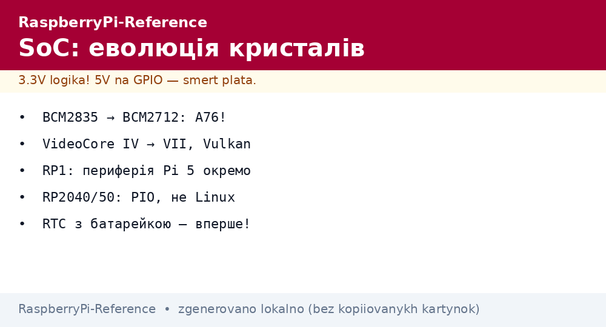
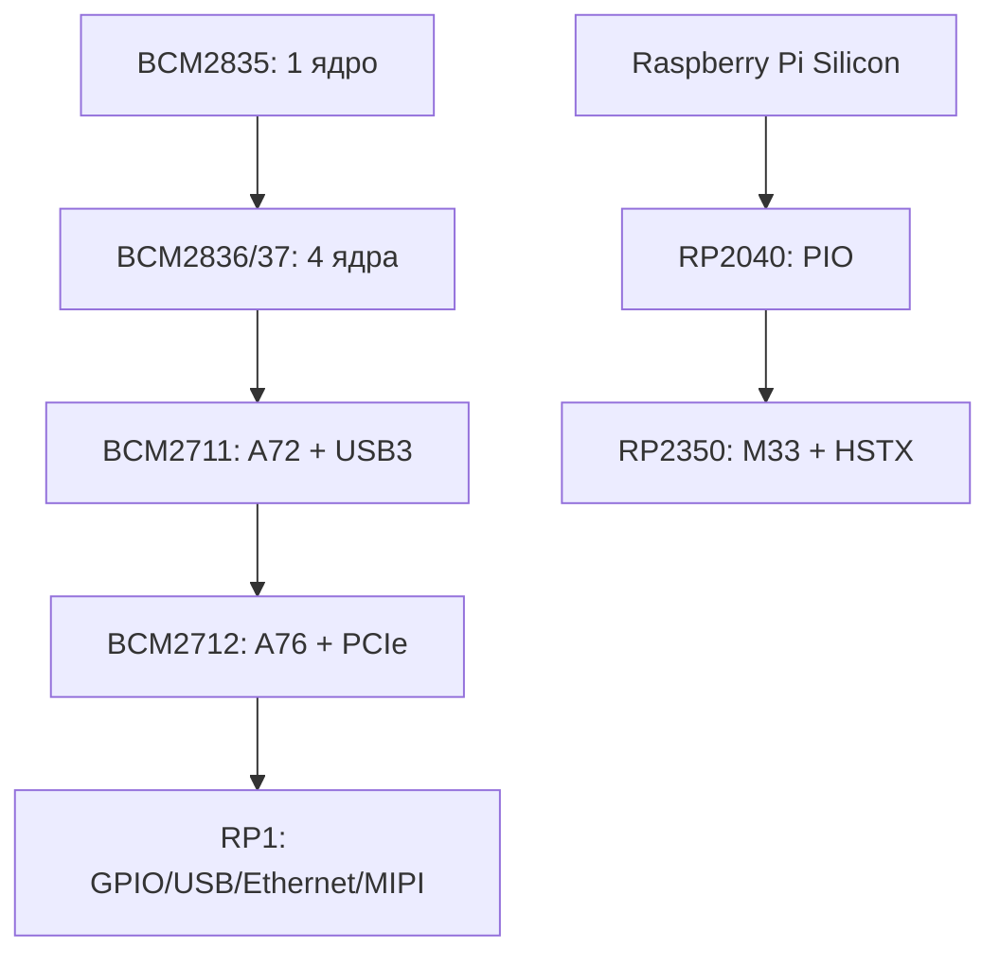

# SoC Raspberry Pi - від BCM2835 до BCM2712, VideoCore і RP1

EN version: `RaspberryPi-Reference/01-Hardware/01-SoC-Oglyad.en.md`

*Рис. Еволюція SoC: CPU росте A53→A76, графіка VideoCore VI→VII, периферія Pi 5 винесена в RP1.*

> [!tip] Що це за нота
> Карта кристалів: що всередині кожної плати і чому Pi 5 такий швидкий. Деталі по чипах: [BCM2712 і Pi 5](../../../RaspberryPi-Reference/01-Hardware/02-BCM2712-Pi5.md), [RP2040 і RP2350](../../../RaspberryPi-Reference/01-Hardware/03-RP2040-RP2350.md). Вибір плати: [порівняння моделей](../../../RaspberryPi-Reference/00-Start/03-Porivnyannya-plate.md).

## 1. Мета

Зрозуміти залізо, щоб обирати плату свідомо:

- лінійка BCM: що змінювалось від Pi 1 до Pi 5;
- VideoCore: графіка, кодеки, камери;
- RP1: чому периферія Pi 5 - окремий чип;
- RP2040/RP2350: інший клас, мікроконтролери.

| Чип | Плати | CPU | Графіка |
| --- | --- | --- | --- |
| BCM2835 | Pi 1, Zero W v1 | 1×ARM1176 | VideoCore IV |
| BCM2836 (Pi 2): 4×A7; BCM2837 (Pi 3): 4×A53 | Pi 2/3 | A7/A53 | VideoCore IV |
| BCM2711 | Pi 4, CM4, 400 | 4×A72 1.5 ГГц | VideoCore VI |
| BCM2712 | Pi 5, CM5, 500 | 4×A76 2.4 ГГц | VideoCore VII |
| RP2040 | Pico / W | 2×M0+ 133 МГц | немає |
| RP2350 | Pico 2 / 2W | 2×M33 150 МГц | немає |

## 2. Архітектура еволюції

Прорив Pi 5 - не лише A76: швидкість дають LPDDR4X-4267, PCIe 2.0 і винесена в RP1 периферія без заторів.

## 3. VideoCore: графіка і медіа

- VideoCore IV (до Pi 3): OpenGL ES 2.0, H.264 декодер;
- VideoCore VI (Pi 4): 4Kp60 H.265 декодер, два HDMI;
- VideoCore VII (Pi 5): 800 МГц, два 4Kp60, Vulkan 1.3;
- ISP (обробка камер) - окремий блок, працює з libcamera;
- апаратний H.264 енкодер є на Pi 4; на Pi 5 кодування - програмне (CPU).

## 4. RP1: південний міст Pi 5

- свій кристал Raspberry Pi Silicon: GPIO, 2×USB3, 2×USB2, Ethernet, 2×MIPI, АЦП немає;
- зв'язок з BCM2712 - PCIe x4, затримки мікросекунди;
- звідси нюанси: таймінги GPIO інші, ніж на Pi 4 (див. пін-ноти);
- прошивка RP1 оновлюється разом з EEPROM.

## 5. Пам'ять

- LPDDR2 (старі) → LPDDR4 (Pi 4) → LPDDR4X-4267 (Pi 5);
- 512 МБ Zero 2 W вистачає Lite, десктоп хоче 4+ ГБ;
- swap на SD вбиває карту - zram замість свопа;
- GPU-пам'ять виділяється динамічно (не `gpu_mem` як раніше).

## 6. Інтерфейси кристала

| Блок | Pi 4 (BCM2711) | Pi 5 (BCM2712+RP1) |
| --- | --- | --- |
| USB | 2×3.0 + 2×2.0 (VLI) | 2×3.0 + 2×2.0 (RP1) |
| Ethernet | Gigabit (VLI) | Gigabit (RP1) + PoE-HAT-плата |
| MIPI | 2×CSI + DSI | 2×CSI (4 лінії) + DSI |
| PCIe | USB-контролер | x1 для NVMe-HAT |
| RTC | немає (FAKE-HWCLOCK) | є, з батарейкою! |

Вбудований RTC з роз'ємом батарейки - вперше в лінійці, забудьте про NTP-залежність часу.

## 7. RP2040/RP2350 коротко

- мікроконтролери, не Linux: детермінований час, сон у мікроамперах;
- PIO-автомати: UART/SPI/I2S/DVI програмно, без завантаження CPU;
- RP2350 додає HSTX (швидкісний вивід), ARM M33 + RISC-V на вибір, більше RAM;
- детально - окрема нота RP-лінійки.

## 7.1 Швидкі цифри для спору

| Тест | Pi 4 | Pi 5 | Zero 2 W | Pico 2 |
| --- | --- | --- | --- | --- |
| Sysbench CPU (1 потік) | ~220 | ~580 | ~120 | - |
| Пам'ять (МБ/с) | ~4000 | ~12000 | ~1500 | - |
| GPIO toggle (МГц) | ~20 | ~30 | ~15 | PIO 62.5 |
| Boot з SD (с) | ~25 | ~15 | ~60 | миттєво |
| Простій (W) | 2.5 | 3 | 0.5 | 0.05 |

Цифри орієнтовні для порівняння порядків, не для дисертації. Правило вибору: якщо задача впирається в CPU - Pi 5, в піни і час - Pico, в ціну і вати - Zero 2 W.

Додатково про пам'ять:

- LPDDR4X-4267 у Pi 5 - саме вона годує A76 без голоду;
- Zero 2 W з 512 МБ живе на zram: стиснення RAM 1:2 без SD-свопу;
- Pico: вся RAM - SRAM, детермінована латентність, ніяких кеш-сюрпризів;
- CM-версії повторюють характеристики базових плат.

## 8. Типові помилки

| Симптом | Причина | Лікування |
| --- | --- | --- |
| Чекав GPU-пам'ять як на Pi 3 | `gpu_mem` застарів | динамічний розподіл, налаштування не потрібні |
| GPIO Pi 5 «повільніший» | периферія через RP1/PCIe | прямі регістри RP1 або прийняти латентність |
| Немає RTC на Pi 4 | його там немає | fake-hwclock + NTP, або HAT з DS3231 |
| PCIe не бачить NVMe | стара прошивка EEPROM | оновити bootloader, увімкнути PCIe |
| Плутають BCM-нумерацію з пінами | BCM2711 - чип, BCM17 - пін | чип vs GPIO-номер - різні речі |

## 9. Суміжні ноти

- [BCM2712 і Pi 5](../../../RaspberryPi-Reference/01-Hardware/02-BCM2712-Pi5.md) - флагман детально.
- [RP2040 і RP2350](../../../RaspberryPi-Reference/01-Hardware/03-RP2040-RP2350.md) - мікроконтролери.
- [порівняння моделей](../../../RaspberryPi-Reference/00-Start/03-Porivnyannya-plate.md) - вибір плати.
- [флагман Pi 5](../../../RaspberryPi-Reference/14-Devboards/01-Pi5-Flagman.md) - плата детально.
- [завантаження EEPROM](../../../RaspberryPi-Reference/09-Proshivka/02-EEPROM-Boot.md) - прошивка завантажувача.

## 9.1 Швидка шпаргалка SoC

- Pi 1/Zero v1 - ARM1176, музейна полиця;
- Pi 2/3 - A53/A72, VideoCore IV, USB через хаб;
- Pi 4 - A72, USB3 і Gigabit чесні;
- Pi 5 - A76, PCIe, RP1, RTC;
- Pico - M0+/M33, PIO, мікроампери;
- сумніваєшся - дивись таблицю розділу 1.
- залізо без розуміння софта - цеглина з кулером;
- софт без розуміння заліза - гальма і блискавка.

## 9.2 Де шукати еррати кристалів

- офіційні errata-Silicon PDF на raspberrypi.com під кожен чип;
- форумні треди з позначкою staff - підтверджені баги;
- ядро: `dmesg` показує ревізію і застосовані воркарунди;
- перед серією - прочитати errata повністю, не лише заголовки;
- сумнівний біт периферії - обхід програмно, не чекати ревізію.

## Офіційні джерела

- [Raspberry Pi 5 (Raspberry Pi)](https://www.raspberrypi.com/products/raspberry-pi-5/) - BCM2712, RP1, пам'ять.
- [Raspberry Pi 4 Model B (Raspberry Pi)](https://www.raspberrypi.com/products/raspberry-pi-4-model-b/) - BCM2711 для порівняння.
- [Getting Started (Raspberry Pi docs)](https://www.raspberrypi.com/documentation/computers/getting-started.html) - архітектура плат.
