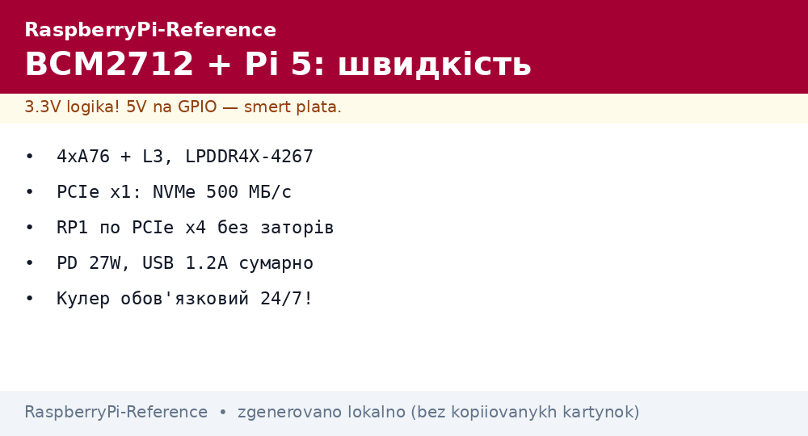
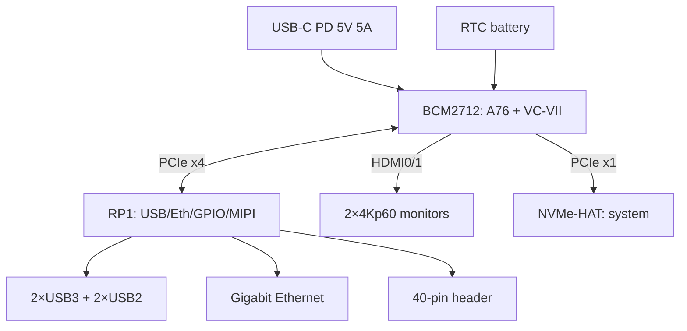

# BCM2712 and Raspberry Pi 5 - A76, PCIe, RP1 and PD power supply


*Fig. BCM2712 (CPU+GPU) + RP1 (all peripherals) + PCIe (NVMe) + RTC: flagship anatomy.*

> [!tip] What this note is
> Deep dive into the flagship: what gives speed, where peripherals went, how to power and cool. Line overview: [SoC overview](../../../RaspberryPi-Reference/01-Hardware/01-SoC-Oglyad.md), board as a product: [Pi 5 flagship](../../../RaspberryPi-Reference/14-Devboards/01-Pi5-Flagman.md).

## 1. Goal

To squeeze everything from Pi 5 with no surprises:

- where the 2-3x gain over Pi 4 hides;
- how to enable PCIe/NVMe and RTC;
- 5V 5A power supply: when 3A is enough and when not;
- cooling under sustained load.

| Block | BCM2712 | Gain over Pi 4 |
| --- | --- | --- |
| CPU | 4×A76 2.4 GHz, 512 KB L2 + 2 MB L3 | ~2.5× |
| GPU | VideoCore VII 800 MHz, Vulkan 1.3 | ~2× |
| RAM | LPDDR4X-4267 up to 16 GB | faster bus |
| I/O | RP1 over PCIe x4 | no VLI bottlenecks |
| Disks | PCIe 2.0 x1 for NVMe | only USB3 before |

## 2. Board architecture



Power button on the board - a first: short press (menu), long press (power off). UART console comes out on a separate 3-pin connector.

## 3. PCIe and NVMe

- FPC PCIe 2.0 x1 connector - official NVMe HATs (M.2 2230/2242);
- enable: `dtparam=pciex1` in config.txt + fresh EEPROM;
- system on NVMe: Imager flashing straight to disk, no SD needed;
- speed ~500 MB/s - the x1 lane limit, enough for a server;
- DRAM-less SSDs run cooler - take those.

## 4. RTC with battery

- 2-pin JST-SH connector for a battery (official);
- time lives without network - a field logger with no NTP;
- wake-up alarm: `echo +60 > /sys/class/rtc/rtc0/wakealarm`;
- fake-hwclock is no longer needed, remove the package.

## 5. 5V 5A power supply

- official 27W PSU (PD): 5V 5A for the board + USB peripherals;
- old 3A PSU - works, but USB is limited to 600 mA total;
- kernel warnings about weak power - see `dmesg`;
- PoE+ HAT - alternative for ceiling/cabinet (see power supply).

## 6. Cooling

| Load | Passive | Active cooler | Case with cooler |
| --- | --- | --- | --- |
| Idle | 45 °C | 35 °C | 38 °C |
| Server | 70 °C | 55 °C | 58 °C |
| Full stress | throttling at 80 °C+ | 65 °C | 68 °C |

Throttling starts at 80 °C: frequency drops, the server slows. For 24/7 an active cooler is mandatory.

## 7. Working code: board monitor

```python
from gpiozero import CPUTemperature
import time
import os

cpu = CPUTemperature()
ALARM = '/sys/class/hwmon/hwmon0/in0_lcrit_alarm'

while True:
    t = cpu.temperature
    with open('/sys/devices/system/cpu/cpufreq/policy0/scaling_cur_freq') as f:
        freq = int(f.read()) // 1000
    volt = 'n/a'
    if os.path.exists(ALARM):
        volt = open(ALARM).read().strip()
    print(f"CPU {t:.1f}C {freq}MHz undervolt:{volt}")
    time.sleep(5)
```

The undervoltage flag is the first sign of a weak PSU. When it triggers, replace the power supply, do not ignore it.

## 7.1 PCIe devices beyond NVMe

The x1 lane is not only disks:

- Coral TPU (PCIe version) - ML inference without USB;
- 2.5G Ethernet cards - a router on steroids;
- SATA controllers - HDD array for NAS;
- CAN-FD and RS485 industrial cards;
- limit: one lane, HAT power up to 5W without external.

Before buying a card - check the driver for the Bookworm kernel: `lspci -k` shows who claimed the device.

Power compatibility:

- the slot gives 3.3V, take 5V from the header or separately;
- cards with their own power (SATA) are more stable;
- the total board budget is not elastic - count the watts.

## Common issues

| Symptom | Cause | Fix |
| --- | --- | --- |
| NVMe not visible | missing `dtparam=pciex1` | config.txt + reboot |
| Lightning bolt with 3A PSU | USB peripherals eat current | official 27W PD or fewer USB devices |
| Throttling under load | no cooler | active cooling |
| Time resets | no RTC battery | JST battery, `hwclock -w` |
| Does not boot from old SD | image older than Bookworm | fresh image for Pi 5 |
| Fan roars | default curve | `pwm-fan` overlay with hysteresis |

## 9. Related notes

- [SoC overview](../../../RaspberryPi-Reference/01-Hardware/01-SoC-Oglyad.md) - place of BCM2712 in the line.
- [Pi 5 flagship](../../../RaspberryPi-Reference/14-Devboards/01-Pi5-Flagman.md) - board as a product.
- [USB-C power supply](../../../RaspberryPi-Reference/02-Zhivlennya/01-USB-C-PD.md) - PSU in detail.
- [EEPROM boot](../../../RaspberryPi-Reference/09-Proshivka/02-EEPROM-Boot.md) - bootloader firmware.
- [memory media](../../../RaspberryPi-Reference/08-Pamyat/01-SD-eMMC-NVMe.md) - NVMe in detail.

## 9.1 Quick Pi 5 cheat sheet

- power: 27W PD, otherwise USB limits;
- disk: `dtparam=pciex1` + fresh EEPROM;
- heat: cooler for 24/7, throttling from 80 °C;
- time: JST battery + `hwclock -w`;
- monitor: `vcgencmd` temperature and throttling.

## Official sources

- [Raspberry Pi 5 (Raspberry Pi)](https://www.raspberrypi.com/products/raspberry-pi-5/) - specs, power supply, PCIe.
- [Getting Started (Raspberry Pi docs)](https://www.raspberrypi.com/documentation/computers/getting-started.html) - first Pi 5 start.
- [gpiozero docs (Read the Docs)](https://gpiozero.readthedocs.io/en/stable/) - CPU and pin monitoring.
