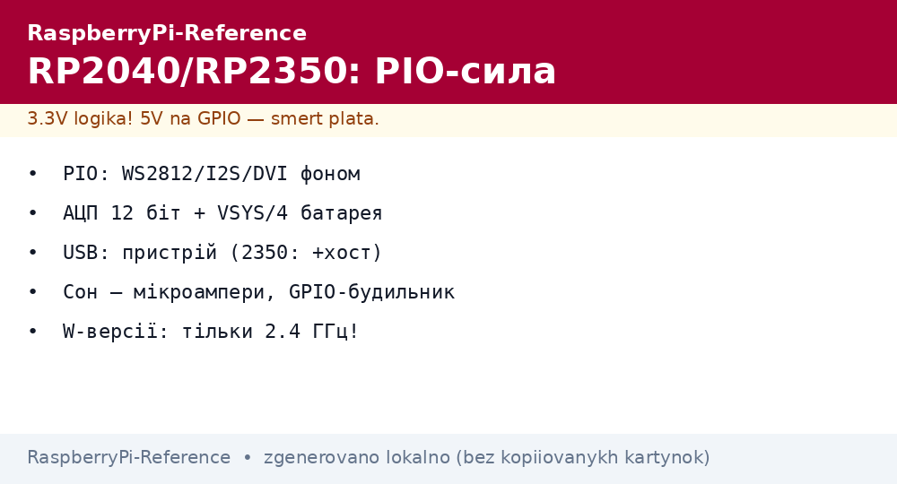

# RP2040 і RP2350 - PIO-автомати, АЦП і сон мікроконтролерів Pico


*Рис. RP2040/RP2350: два ядра, PIO-автомати замість фіксованої периферії, АЦП і USB - усе за долари.*

> [!tip] Що це за нота
> Інший клас пристроїв: не Linux, а детермінований реальний час. PIO - головна фішка: UART/SPI/I2S/DVI програмними автоматами. Плати: [родина Pico](../../../RaspberryPi-Reference/14-Devboards/03-Pico-W-Family.md), середовище: [вибір середовища](../../../RaspberryPi-Reference/00-Start/05-Vibir-seredovischa.md).

## 1. Мета

Освоїти Pico як залізну периферію і самостійний вузол:

- чим RP2350 кращий за RP2040 і чи варто переходити;
- PIO: що це і три типові застосування;
- АЦП, температура кристала, USB-пристрій;
- сон у мікроамперах для батарейних вузлів.

| Параметр | RP2040 | RP2350 |
| --- | --- | --- |
| CPU | 2×M0+ 133 МГц | 2×M33 150 МГц (або RISC-V) |
| RAM | 264 КБ | 520 КБ |
| Flash | зовнішня, до 16 МБ | зовнішня, до 16 МБ |
| PIO | 2 блоки × 4 автомати | 3 блоки × 4 автомати |
| АЦП | 12 біт, 4 канали + температура | 12 біт, покращений |
| USB | пристрій 1.1 | пристрій + хост |
| Безпека | немає | Secure Boot, OTP |

## 2. Архітектура

```mermaid
flowchart TB
  C0[Ядро 0: логіка] <-->|FIFO| C1[Ядро 1: реальний час]
  C0 <--> PIO[PIO-автомати: WS2812/I2S/DVI]
  C0 <--> ADC[АЦП 12 біт + температура]
  C0 <--> USB[USB-CDC/HID]
  PIO --> LED[NeoPixel-стрічка]
  PIO --> DVI[DVI-відео (RP2350)]
  ADC --> SENS[Датчики]
```

PIO-автомати працюють незалежно від ядер: запустив програму на 32 інструкції - і забув, таймінги тримає залізо.

## 3. PIO: три хіти

- WS2812 NeoPixel: точні 800 кГц без блокування CPU;
- I2S-аудіо: потік у ЦАП фоном;
- DVI/HDMI-відео (PicoDVI): 640×480 програмно - RP2350 розкриває повністю;
- програму пишемо асемблером PIO (9 команд) або генератором `pioasm`.

## 4. АЦП і живлення

- 4 канали + вбудований датчик температури кристала;
- опорна 3.3V - точність як у стабілізатора, калібруємо за відомим джерелом;
- VSYS/4 на ADC3 - міряти власну батарею без дільника;
- живлення: 5V USB або 1.8-5.5V на VSYS (батарея безпосередньо!);
- сон: dormant з RTC - одиниці мікроампер, будильник по GPIO.

## 5. Робочий код (MicroPython)

```python
from machine import ADC, Pin
from rp2 import PIO, StateMachine, asm_pio
import time

@asm_pio(sideset_init=PIO.OUT_LOW, out_shiftdir=PIO.SHIFT_LEFT,
         autopull=True, pull_thresh=24)
def ws2812():
    T1 = 2
    T2 = 5
    T3 = 3
    wrap_target()
    label("bitloop")
    out(x, 1)               .side(0)    [T3 - 1]
    jmp(not_x, "do_zero")   .side(1)    [T1 - 1]
    jmp("bitloop")          .side(1)    [T2 - 1]
    label("do_zero")
    nop()                   .side(0)    [T2 - 1]
    wrap()

sm = StateMachine(0, ws2812, freq=8000000, sideset_base=Pin(0))
sm.active(1)

adc = ADC(26)

while True:
    raw = adc.read_u16()
    volt = raw * 3.3 / 65535
    print("ADC", raw, volt)
    sm.put(bytes([0, 255, 0]) * 8)
    time.sleep(1)
```

Той же PIO-автомат крутить NeoPixel, поки Python читає АЦП - жодних конфліктів таймінгів.

## 6. Робочий код (C SDK)

- `pico-sdk`, CMake, скрипт `pico_project.py` генерує каркас;
- PIO-програми компілює `pioasm` у заголовки;
- `sleep_run_from_xosc` + dormant - мінімальне споживання;
- multicore: `multicore_launch_core1` - друге ядро під драйвери;
- SWD-налагодження через другий Pico (Picoprobe) за 4 долари;
- приклад blink з PIO - перший тест після збірки тулчейну.

## 7. W-версії: радіо на борту

- Pico W / Pico 2 W: WiFi + BT через чип CYW43439;
- MicroPython: модуль `network`, MQTT - `umqtt.simple`;
- C SDK: lwIP у комплекті, приклади TCP/UDP;
- антена на платі - не закривати металом корпусу;
- deep-sleep зі збереженням WiFi немає - прокидаємось і перепідключаємось;
- BT: класичний SPP і BLE-периферія (залежить від прошивки CYW43).

## 7.1 Живлення від батареї детально

- Li-ion 3.7V на VSYS безпосередньо: діапазон 1.8-5.5V покриває розряд;
- заряд - окремий TP4056, Pico заряджати не вміє;
- контроль: ADC3 міряє VSYS/4, поріг відсічки 3.0V;
- сон між вимірами: dormant + RTC-будильник, середнє - мікроампери;
- сонячна панель 5V + TP4056 - автономність місяцями;
- суперконденсатор замість батареї - для частих коротких циклів.

## 8. Типові помилки

| Симптом | Причина | Лікування |
| --- | --- | --- |
| PIO не встигає | частота автомата занизька | `freq` під протокол (WS2812 - 8 МГц) |
| АЦП пливе | опорна 3.3V гуляє від USB | окремий LDO або калібрування за TL431 |
| USB не бачиться | кабель charge-only без даних | повноцінний кабель, перевірити D+/D− |
| Друге ядро вісить | немає `fifo` синхронізації | черга FIFO + прапорці, не спільні змінні |
| WiFi рветься | антена закрита | винести плату з металевого корпусу |
| C SDK не збирається | немає ARM-тулчейну | `arm-none-eabi-gcc` за гайдом SDK |

## 9. Суміжні ноти

- [огляд SoC](../../../RaspberryPi-Reference/01-Hardware/01-SoC-Oglyad.md) - місце RP-кристалів.
- [родина Pico](../../../RaspberryPi-Reference/14-Devboards/03-Pico-W-Family.md) - плати детально.
- [вибір середовища](../../../RaspberryPi-Reference/00-Start/05-Vibir-seredovischa.md) - MicroPython проти C SDK.
- [NeoPixel і серво](../../../RaspberryPi-Reference/11-Vivid/02-NeoPixel-Servo-Rele.md) - куди йдуть PIO-сигнали.
- [зовнішні АЦП](../../../RaspberryPi-Reference/06-Analog/01-ADC-Zovnishnye.md) - коли вбудованого мало.

## Офіційні джерела

- [RP2040 Datasheet (Raspberry Pi)](https://datasheets.raspberrypi.com/rp2040/rp2040-datasheet.pdf) - PIO, АЦП, USB.
- [RP2350 Datasheet (Raspberry Pi)](https://datasheets.raspberrypi.com/rp2350/rp2350-datasheet.pdf) - M33, HSTX, безпека.
- [Getting Started (Raspberry Pi docs)](https://www.raspberrypi.com/documentation/computers/getting-started.html) - старт Pico і Linux.
