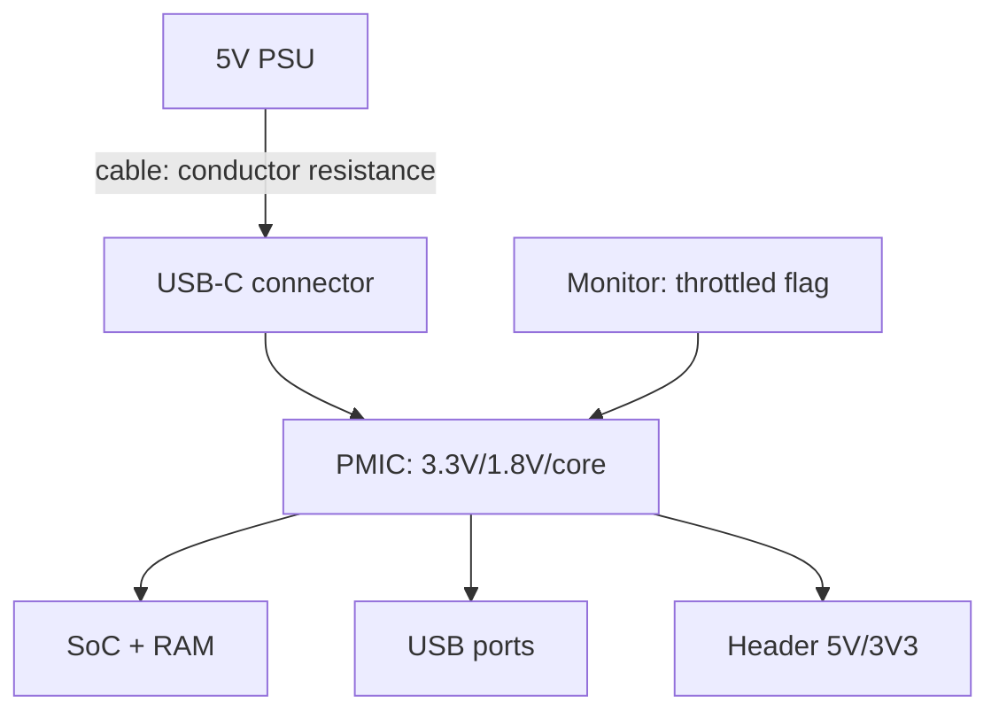

# Raspberry Pi Power Supply - USB-C PD, Sags and the Undervoltage Bolt


*Fig. Power chain: 5V PSU → quality cable → USB-C → PMIC → 3.3V/1.8V; a weak link gives the bolt.*

> [!tip] What this note is
> Cause number one of all strange glitches: weak power. The bolt on the screen, random reboots, USB dropouts - all from here. Kit choice: [boards and accessories], monitoring: [BCM2712 and Pi 5](../../../RaspberryPi-Reference/01-Hardware/02-BCM2712-Pi5.md).

## 1. Goal

Close power once and for all:

- how many amps each model really needs;
- official PSU versus a market "5V 3A";
- cable as a sag source (conductor resistance!);
- diagnostics: flag, USB tester, logs.

| Model | Stock PSU | Real peak | USB limit |
| --- | --- | --- | --- |
| Pi 5 | PD 27W (5V 5A) | ~12W | 1.6A total |
| Pi 5 with a 3A PSU | works, USB cut | ~8W | 600 mA |
| Pi 4 | 15W (5V 3A) | ~7W | 1.2A total |
| Zero 2 W | 12.5W (5V 2.5A) | ~2W | OTG hub separately |
| Pico | USB 5V / VSYS | ~0.5W | - |

## 2. Power architecture



A sag in any link means undervoltage: the core drops frequency, USB falls off, the SD card corrupts. The flag stays until reboot.

## 3. Official PSUs in detail

- 27W PD (Pi 5): 5V 5A over the PD protocol, cable in the box;
- 15W (Pi 4): 5V 3A, USB-C without PD;
- 12.5W micro-USB: Zero/older boards;
- 5.1V instead of 5.0V - headroom for cable drop (the official trick);
- "5V 3A" clones: lie about current, sag to 4.5V.

## 4. Cable decides

- conductor resistance: thin 28AWG over 1.5 m = -0.5V at 3A;
- quality short 20AWG cable - a must-have;
- USB tester in series shows the truth: volts under load;
- test: `stress-ng` + watch voltage and the flag;
- unpowered hubs + disks = guaranteed dropouts.

## 5. Working code: power watchdog

```python
import subprocess
import time

def get_throttled():
    out = subprocess.check_output(['vcgencmd', 'get_throttled']).decode()
    return int(out.strip().split('=')[1], 16)

FLAGS = {
    0x1: 'undervoltage зараз',
    0x2: 'тротлінг ARM зараз',
    0x4: 'тротлінг температури зараз',
    0x10000: 'undervoltage був',
    0x20000: 'тротлінг був',
    0x40000: 'перегрів був',
}

while True:
    v = get_throttled()
    if v == 0:
        print('power OK')
    else:
        for bit, msg in FLAGS.items():
            if v & bit:
                print('ALARM:', msg)
    time.sleep(60)
```

A nonzero flag after a day is a reason to swap the PSU/cable, even if it "seems to work". History never lies.

## 6. USB limits and peripherals

- Pi 5 + PD: 1.6A for all USB together (1.2A is the Pi 4 limit, do not confuse);
- Pi 5 + 3A PSU: the core cuts to 600 mA (warning in the logs);
- 2.5 inch SSD + anything else - through a powered hub;
- measure with a USB tester, never guess;
- the PoE option is a separate twisted-pair power note.

## 7. Field and batteries

- power bank with a PD trigger: request the 5V profile explicitly;
- 12V to 5V buck in a car: starter peaks must never reach the board;
- supercapacitor on the input - survive short dips;
- solar panel + MPPT + battery - full autonomy;
- more detail in the PoE and UPS power notes.

## Common issues

| Symptom | Cause | Fix |
| --- | --- | --- |
| Bolt on the screen | weak PSU/cable | official PSU + short cable |
| Random reboots under load | peak sag | USB tester, link replacement |
| USB disk disappears | port current limit | powered hub |
| Flag after a night | night peak/heat | throttled log, cooler |
| Does not start at all | 4.0V on the input | measure on TP1/header, swap PSU |
| PSU itself heats up | overload/fake | 30 % current headroom, original |

## 9. Power cheat sheet

- Pi 5 - only PD 27W for full USB;
- cable short and thick, not from the junk box;
- `vcgencmd get_throttled` - the first command on glitches;
- USB disks - through a powered hub;
- PoE/UPS - for 24/7 and the field.

## 10. Related notes

- [boards and accessories] - PSU choice.
- [BCM2712 and Pi 5](../../../RaspberryPi-Reference/01-Hardware/02-BCM2712-Pi5.md) - flagship appetites.
- [Pi 5 flagship](../../../RaspberryPi-Reference/14-Devboards/01-Pi5-Flagman.md) - board USB limits.
- [OS setup](../../../RaspberryPi-Reference/09-Proshivka/03-OS-Nalashtuvannya.md) - health monitoring.
- [main map](../../../RaspberryPi-Reference/Home.md) - full navigation.

## 9.1 Five-minute diagnostics

- bolt/reboots → USB tester in series, watch the volts;
- `vcgencmd get_throttled` → decode the flag bits;
- swap PSU and cable one by one - find the guilty link;
- unplug USB disks for the test time;
- record values before/after - for the node history.

## Official sources

- [27W Power Supply (Raspberry Pi)](https://www.raspberrypi.com/products/27w-power-supply/) - PD profile, compatibility.
- [Raspberry Pi 5 (Raspberry Pi)](https://www.raspberrypi.com/products/raspberry-pi-5/) - power requirements.
- [Getting Started (Raspberry Pi docs)](https://www.raspberrypi.com/documentation/computers/getting-started.html) - first start and power.
