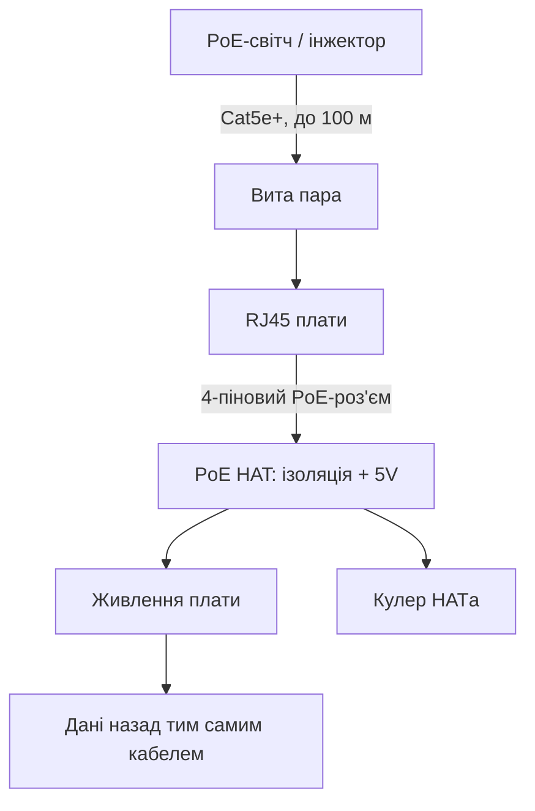

# PoE HAT для Raspberry Pi - живлення і мережа одним кабелем

EN version: `02-Zhivlennya/02-PoE-HAT.en.md`


*Рис. PoE-тракт: світч-інжектор → вита пара → трансформатор HAT → 5V на плату + кулер.*

> [!tip] Що це за нота
> Стеля, шафа, вулиця: один кабель несе і біти, і вати. PoE HAT (15W) і PoE+ HAT (25W+) для Pi 3B+/4/5. Альтернатива розетці: [живлення USB-C](../../../RaspberryPi-Reference/02-Zhivlennya/01-USB-C-PD.md), безперебійність - UPS-HAT-плата (нота черги 4).

## 1. Мета

Повісити Pi туди, де немає розетки:

- стандарти PoE: що дає світч, що бере HAT;
- монтаж: 4-піновий PoE-роз'єм плати + стійки;
- кулер HATа: керування і шум;
- межі: коли PoE не вистачить.

| Стандарт | Потужність | HAT | Для плат |
| --- | --- | --- | --- |
| 802.3af | 15W | PoE HAT | Pi 3B+, Pi 4 |
| 802.3at (PoE+) | 25W+ | PoE+ HAT | Pi 4, Pi 5 |
| Пасивний 24V | поза стандартом | інжектори | обережно, несумісно! |

Пасивні інжектори 12/24V в PoE-HAT встромляти заборонено - спалить вхід. Тільки активний 802.3af/at.

## 2. Архітектура тракту



Гальванічна ізоляція всередині HAT - мережева земля не з'єднана з землею плати. Це фіча безпеки, не баг.

## 3. Монтаж покроково

- вимкнути все, зняти старі стійки;
- HAT на 40-пінову гребінку + 4-піновий PoE-конектор;
- стійки з комплекту, затягнути хрест-навхрест;
- кулер HATа - назовні, не в корпус-глухар;
- кабель Cat5e і вище, обжим за схемою B;
- увімкнути порт PoE на світчі (за замовчуванням часто вимкнений!).

## 4. Кулер PoE HAT

- керується автоматично за температурою SoC;
- шумний на максимумі - для спальні не варіант;
- заміна на тихіший 25×25 з тим самим роз'ємом;
- крива - через `dtoverlay` параметри;
- пасивний Flirc + PoE: тихо, але стежити за тротлінгом.

## 5. Робочий код: монітор PoE-вузла

```python
import subprocess
import time

def net_speed():
    with open('/sys/class/net/eth0/statistics/rx_bytes') as f:
        rx1 = int(f.read())
    with open('/sys/class/net/eth0/statistics/tx_bytes') as f:
        tx1 = int(f.read())
    time.sleep(5)
    with open('/sys/class/net/eth0/statistics/rx_bytes') as f:
        rx2 = int(f.read())
    with open('/sys/class/net/eth0/statistics/tx_bytes') as f:
        tx2 = int(f.read())
    return (rx2 - rx1) / 5, (tx2 - tx1) / 5

while True:
    rx, tx = net_speed()
    t = subprocess.check_output(['vcgencmd', 'measure_temp']).decode().strip()
    print(f"{t} RX {rx/1024:.0f} KB/s TX {tx/1024:.0f} KB/s")
```

Раз на 5 секунд - картина завантаження каналу. Падіння до нуля вдень - привід перевірити світч, а не плату.

## 6. Бюджет потужності

- PoE HAT (af): 12W корисних - Pi 4 + камера + датчики ок;
- PoE+ HAT (at): 20W+ - Pi 5 з NVMe вистачає;
- USB-диски і мотори - за межею, тільки окреме живлення;
- довжина кабелю 100 м - втрати в межах стандарту;
- бюджет PoE-світча ділимо на всі порти, не лише наш.

## 7. Світч vs інжектор

| Варіант | Коли | Ціна/порт |
| --- | --- | --- |
| PoE-світч 4-8 портів | 2+ вузли | дорожче, зручніше |
| PoE-інжектор | один вузол | дешево, +1 коробочка |
| PoE-спліттер | живлення не-PoE плати | для Zero/Pico в полі |

## 8. Типові помилки

| Симптом | Причина | Лікування |
| --- | --- | --- |
| Не стартує взагалі | порт PoE вимкнений на світчі | увімкнути PoE на порту |
| Циклічні ребути | пасивний інжектор / мало ват | активний af/at за класом HATа |
| Мережа є, живлення немає | кабель 2 пари (не всі 8 жил) | Cat5e 4 пари, переобжати |
| Кулер реве постійно | пил/спека в шафі | чистка, вентиляція шафи |
| Дим з HATа | пасивні 24V в активний вхід | тільки 802.3af/at джерела! |
| Не вліз у корпус | HAT + кулер вище стінок | високий корпус або відкритий стенд |

## 9. Швидка шпаргалка PoE

- тільки активний af/at, ніяких пасивних вольтів;
- кабель 4 пари, до 100 м;
- кулер HATа - рахувати шум;
- бюджет ват: HAT + USB + запас на перехідні навантаження;
- стікер «PoE» на вузол - щоб не воткнули БЖ.

## 10. Суміжні ноти

- [живлення USB-C](../../../RaspberryPi-Reference/02-Zhivlennya/01-USB-C-PD.md) - класичне живлення.
- [робоча Pi 4](../../../RaspberryPi-Reference/14-Devboards/02-Pi4-Robocha.md) - плата під HAT.
- [флагман Pi 5](../../../RaspberryPi-Reference/14-Devboards/01-Pi5-Flagman.md) - PoE+ для флагмана.
- [налаштування ОС](../../../RaspberryPi-Reference/09-Proshivka/03-OS-Nalashtuvannya.md) - мережа вузла.
- [головна карта](../../../RaspberryPi-Reference/Home.md) - повна навігація.

## 9.1 Чекліст PoE-монтажу

- клас HATа відповідає класу джерела (af/at);
- кабель 4 пари, тест обжиму тестером;
- порт PoE увімкнений на світчі;
- кулер крутиться, шум прийнятний;
- стікер PoE на вузлі і на порту світча.
- фото монтажу в документацію вузла.
- запасний HAT на полиці для критичних точок.
- довжина кабелю в паспорті вузла (до 100 м).
- грозозахист на вуличних прольотах.

## Офіційні джерела

- [PoE+ HAT (Raspberry Pi)](https://www.raspberrypi.com/products/poe-plus-hat/) - характеристики, сумісність.
- [Raspberry Pi 4 Model B (Raspberry Pi)](https://www.raspberrypi.com/products/raspberry-pi-4-model-b/) - PoE-роз'єм плати.
- [Getting Started (Raspberry Pi docs)](https://www.raspberrypi.com/documentation/computers/getting-started.html) - HAT і розширення.
