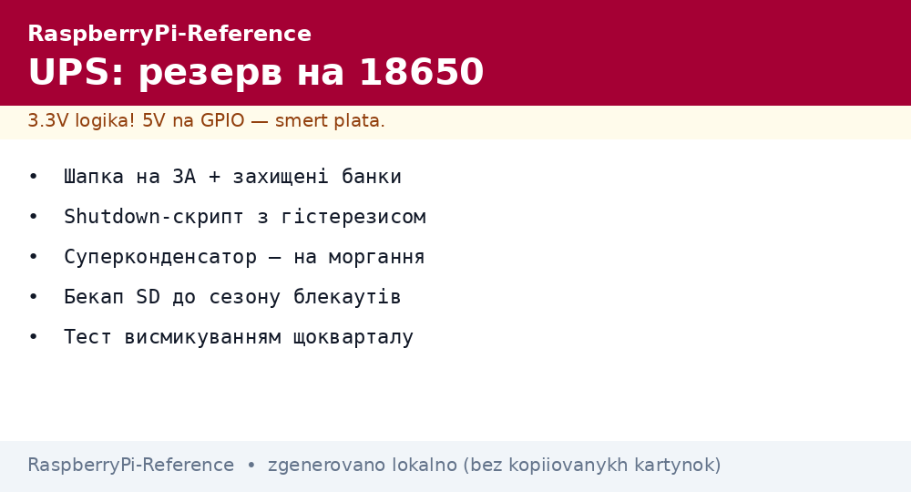
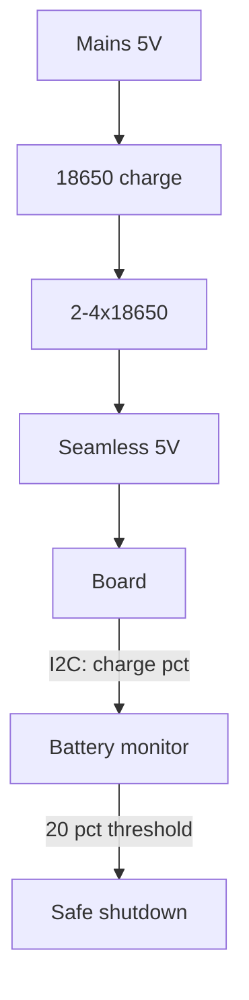

# Raspberry Pi Backup Power - UPS HAT, 18650 and Supercapacitors


*Fig. UPS path: mains → charge → 18650 → seamless 5V; a script powers the system down before depletion.*

> [!tip] What this note is
> Field and unstable mains: the node survives outages and powers down cleanly instead of killing the SD card. 18650-HAT boards, shutdown script, supercapacitors for short dips. Base: [USB-C power supply](../../../RaspberryPi-Reference/02-Zhivlennya/01-USB-C-PD.md), [PoE power supply](../../../RaspberryPi-Reference/02-Zhivlennya/02-PoE-HAT.md).

## 1. Goal

Survive a blackout without losses:

- UPS-HAT board: choice for the board model;
- 18650: how long it holds and how to charge;
- safe-shutdown script on a battery threshold;
- supercapacitors for sub-minute dips.

| Option | Backup time | For what |
| --- | --- | --- |
| UPS HAT + 2x18650 | 2-6 hours (depends on the board) | field, cottage |
| UPS HAT + 4x18650 | 6-12 hours | a day without light |
| 100F supercapacitor | 1-3 minutes | clean shutdown |
| Power bank with UPS mode | hours | fast and crude |

## 2. Backup architecture



Key point: the board must not know about the outage while charge remains. It learns only for a clean shutdown.

## 3. UPS-HAT boards: what to take

- Waveshare UPS HAT (C): I2C monitor, buttons, Pi 4/5 support;
- DFRobot Solar Power Manager: sun + battery + USB output;
- look at: output current (3A minimum for Pi 4/5), pass-through charging;
- 18650 only protected, or a BMS board on the HAT;
- honest capacity: a 3000 mAh cell = ~10 Wh usable.

## 4. Safe-shutdown script

```python
import time
import os
import smbus

bus = smbus.SMBus(1)
LOW_BAT = 20
SHUTDOWN_FILE = '/tmp/lowbat.flag'

def battery_pct():
    raw = bus.read_word_data(0x36, 0x04)
    return ((raw & 0xFF) << 8 | (raw >> 8)) / 256.0

low_since = None
while True:
    pct = battery_pct()
    print(f"battery {pct:.0f}%")
    if pct < LOW_BAT:
        if low_since is None:
            low_since = time.time()
        if time.time() - low_since > 300:
            os.system('sudo shutdown -h now')
    else:
        low_since = None
    time.sleep(60)
```

Five-minute hysteresis below the threshold guards against false trips on peaks. See the I2C monitor address in the specific HAT manual.

## 5. Supercapacitors

- 2x100F in series (5.4V) through balancing resistors;
- enough for 1-3 minutes - time to flush cache and go dark;
- charge through a limiting resistor (sparks otherwise);
- never confuse with batteries: self-discharge in a day;
- ideal for "light blinked", not for the night.

## 6. Autonomy math

| Consumption | 2x18650 (20 Wh) | 4x18650 (40 Wh) |
| --- | --- | --- |
| Zero 2 W, 1W | ~18 hours | ~36 hours |
| Pi 4 idle, 3W | ~6 hours | ~12 hours |
| Pi 5 server, 7W | ~2.5 hours | ~5 hours |
| Pi 5 stress, 12W | ~1.5 hours | ~3 hours |

Converter efficiency ~85 % already counted. Cold eats 20-30 % of capacity - double headroom in winter.

## 7. 18650 safety rules

- only protected cells or BMS on the HAT;
- never solder directly to cells - spot welding or holders;
- storage at 40-60 % charge, in a cool place;
- swollen/heating goes to recycling, not to the drawer;
- 0.5C charge current maximum for longevity.

## Common issues

| Symptom | Cause | Fix |
| --- | --- | --- |
| Dies right at switch-off | HAT cannot hold peak current | 3A+ HAT, fresh batteries |
| Corrupt SD after blackout | no shutdown script | script + 20 % threshold |
| Power bank switches with a gap | no UPS (pass-through) mode | pass-through models only |
| Charge stuck at 80 % | overheat while charging | ventilation, lower current |
| Drains fast at night | WiFi never sleeps | modem sleep, rarer polling |
| Supercapacitor does not hold | self-discharge + leakage | only for minute-long dips |

## 9. Backup cheat sheet

- 3A HAT + protected 18650;
- shutdown script with 5 min hysteresis;
- SD backup before blackout season;
- supercapacitor for blinks, not for nights;
- test: pull the plug and time it.

## 10. Related notes

- [USB-C power supply](../../../RaspberryPi-Reference/02-Zhivlennya/01-USB-C-PD.md) - stock power.
- [PoE power supply](../../../RaspberryPi-Reference/02-Zhivlennya/02-PoE-HAT.md) - mains alternative.
- [OS setup](../../../RaspberryPi-Reference/09-Proshivka/03-OS-Nalashtuvannya.md) - script systemd service.
- [Zero 2 W tiny](../../../RaspberryPi-Reference/14-Devboards/04-Zero-2W.md) - longest-living node.
- [main map](../../../RaspberryPi-Reference/Home.md) - full navigation.

## 9.1 Quarterly backup test

- pull the mains, time to shutdown;
- verify the log: threshold, hysteresis, clean power-down;
- measure cell capacity by discharge (they age!);
- clean holder contacts of oxides;
- refresh the next-test date on the sticker.

## Official sources

- [UPS HAT C (Waveshare Wiki)](https://www.waveshare.com/wiki/UPS_HAT_(C)) - I2C monitor, buttons, schematics.
- [Raspberry Pi OS (Raspberry Pi)](https://www.raspberrypi.com/software/) - system for the node.
- [gpiozero docs (Read the Docs)](https://gpiozero.readthedocs.io/en/stable/) - HAT buttons and LEDs.
