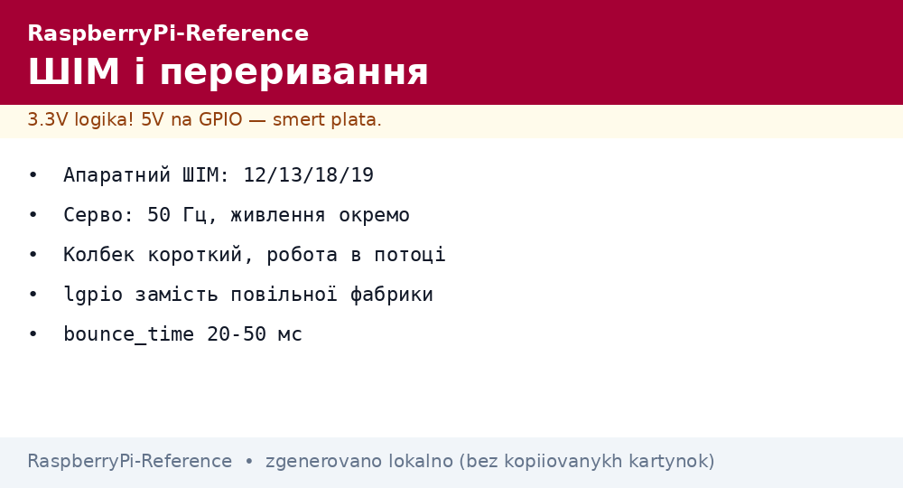
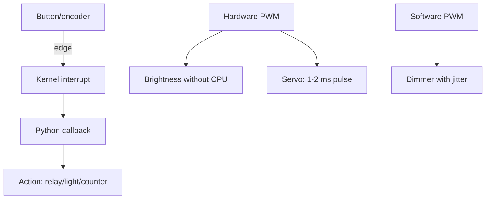

# PWM and Interrupts on Raspberry Pi - Brightness, Servo and Events


*Fig. Hardware PWM lives on fixed pins, interrupts fire on edges; the rest is software emulation with jitter.*

> [!tip] What this note is
> Second GPIO level: smooth control and event reaction without loop polling. Base: [pin header and gpiozero](../../../RaspberryPi-Reference/03-GPIO/01-Header-Gpiozero.md), next - buses: [I2C/SPI/UART buses](../../../RaspberryPi-Reference/04-Shini/01-I2C-SPI-UART.md) - queue 2 note.

## 1. Goal

Move from "on/off" to smooth control:

- hardware PWM: where it is and how it differs from software;
- servo: angles through pulse width;
- interrupts: buttons, encoders, sensor signals;
- lgpio: when gpiozero is slow.

| Channel | Pins (BCM) | Hardware? |
| --- | --- | --- |
| PWM0 | 12, 18 | yes |
| PWM1 | 13, 19 | yes |
| Other GPIO | any | software (jitter!) |
| Interrupts | all GPIO | on edge/level |

## 2. Event architecture



Rule: in the callback - fast (flag/queue), heavy work in the main thread. A long callback loses edges.

## 3. Servo in detail

- period 20 ms (50 Hz), pulse 1-2 ms = 0-180 deg;
- servo power separately (surge current up to 1A!);
- common ground with the board mandatory;
- min/max calibration for the specific model;
- more than 2 servos - PCA9685 over I2C (16 channels, 12 bit).

## 4. Buttons and encoders on interrupts

- button: falling edge + `bounce_time`;
- KY-040 encoder: two A/B channels, 4-state machine;
- fast pulses (>1 kHz) - only C/lgpio, not Python;
- pulse counter - only `+= 1` in the callback.

## 5. Working code

```python
from gpiozero import PWMLED, Servo, Button
from gpiozero.pins.lgpio import LGPIOFactory
from signal import pause

factory = LGPIOFactory()
led = PWMLED(18, pin_factory=factory)
servo = Servo(12, pin_factory=factory,
              min_pulse_width=0.001, max_pulse_width=0.002)
btn = Button(27, bounce_time=0.05, pin_factory=factory)
counter = {'n': 0}

def brighter():
    led.value = min(1.0, led.value + 0.1)

def dimmer():
    led.value = max(0.0, led.value - 0.1)

btn.when_pressed = lambda: servo.mid()
servo.min()
led.pulse(fade_in_time=1, fade_out_time=1, n=None, background=True)

enc_btn = Button(22, bounce_time=0.02, pin_factory=factory)
enc_btn.when_pressed = lambda: counter.update(n=counter['n'] + 1)

print("серво, LED і лічильник активні")
pause()
```

`LGPIOFactory` - a fast pin factory instead of the slow default. `servo.mid/min/max` - ready positions with no math.

## 6. lgpio: when faster is needed

- default gpiozero - slow factory (compatibility);
- lgpio - direct access through the kernel API;
- alerts - microsecond edge stamps;
- PWM to MHz - software, but stable;
- install: `pip install lgpio`, factory into every object.

## 7. Jitter and its limits

| Source | Jitter | Cured by |
| --- | --- | --- |
| Software PWM | ±100 us | hardware channel |
| Python callback | ±1 ms | C/lgpio, short callbacks |
| WiFi load | bursts | isolated core (isolcpus) |
| SD lag | tens of ms | RAM buffers, zram |

For music/servo without trembling - only hardware PWM or PCA9685.

## Common issues

| Symptom | Cause | Fix |
| --- | --- | --- |
| Servo trembles | software PWM | hardware pins 12/13/18/19 |
| Missed presses | long callback | callback is a flag, work goes to the thread |
| Encoder counts backwards | A/B swapped | swap channels |
| LED flickers | software PWM jitter | hardware channel or PCA9685 |
| Servo does not hold | weak power | separate 5V 2A PSU for the servo |
| Button "fires" | no bounce_time | 20-50 ms per button type |

## 9. Event cheat sheet

- jitter-free PWM: pins 12/13/18/19;
- servo: 50 Hz, 1-2 ms, separate power;
- buttons: edge + bounce_time;
- fast path: lgpio factory;
- callback short, work in the thread.

## 10. Related notes

- [pin header and gpiozero](../../../RaspberryPi-Reference/03-GPIO/01-Header-Gpiozero.md) - first pins.
- [HAT and EEPROM](../../../RaspberryPi-Reference/03-GPIO/03-HAT-EEPROM.md) - expansion boards.
- External ADCs for analog sensors - queue 3 note.
- [OS setup](../../../RaspberryPi-Reference/09-Proshivka/03-OS-Nalashtuvannya.md) - groups and rights.
- [main map](../../../RaspberryPi-Reference/Home.md) - full navigation.

## 9.1 Choice: gpiozero or lgpio

- gpiozero: learning, slow events, readability;
- lgpio: kilohertz, exact timings, long PWM;
- hybrid: logic on gpiozero, critical path on lgpio;
- gradual migration: factory first, then alerts;
- measure jitter before and after - in numbers, not feelings.

## Official sources

- [gpiozero docs (Read the Docs)](https://gpiozero.readthedocs.io/en/stable/) - PWMLED, Servo, events.
- [Getting Started (Raspberry Pi docs)](https://www.raspberrypi.com/documentation/computers/getting-started.html) - pin map and PWM.
- [Raspberry Pi OS (Raspberry Pi)](https://www.raspberrypi.com/software/) - system and libraries.
