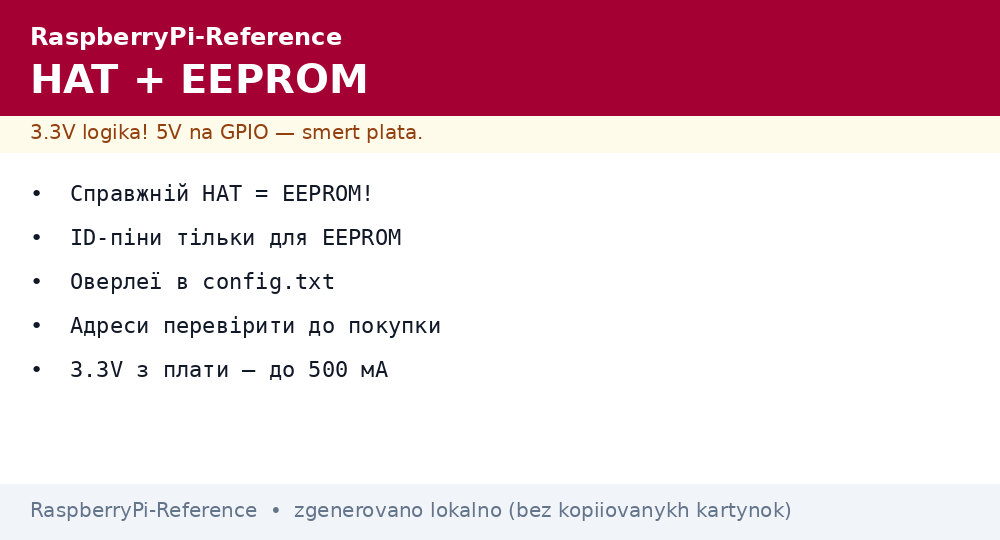
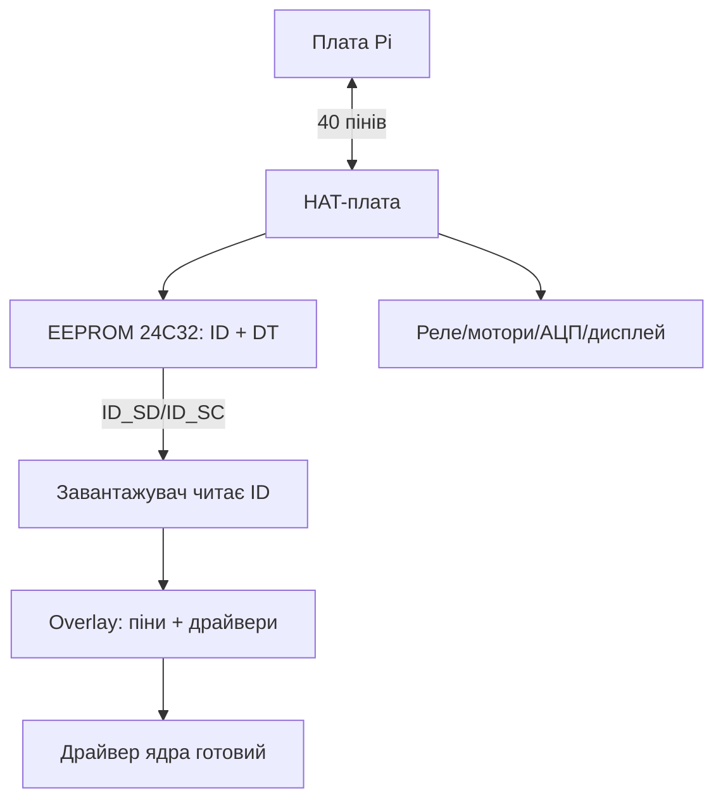

# HAT-плати і EEPROM-ідентифікація - стандарт розширення Pi


*Рис. HAT-стек: плата сідає на гребінку 40, ID_SD/ID_SC читають EEPROM, оверлей піднімає драйвери.*

> [!tip] Що це за нота
> Механіка і електроніка розширення: що робить плату «справжнім HAT», як працює автоопреділення, які HATи брати під задачі. Практика HATів - розділ модулів (глибоко в 03-GPIO/03). База: [гребінка і gpiozero](../../../RaspberryPi-Reference/03-GPIO/01-Header-Gpiozero.md), [ШІМ і переривання](../../../RaspberryPi-Reference/03-GPIO/02-PWM-Pererivannya.md).

## 1. Мета

Проєктувати і вибирати HATи свідомо:

- вимоги стандарту HAT: розміри, кріплення, EEPROM;
- ID_SD/ID_SC: як плата представляється системі;
- Device Tree overlays: драйвери без перезбірки ядра;
- огляд класів HATів: реле, мотори, АЦП, PoE, дисплеї.

| Вимога HAT | Значення |
| --- | --- |
| Гребінка | 2×20, повна, наскрізна (stacking) |
| EEPROM | ID + Device Tree фрагмент |
| Механіка | 65×56 мм, отвори як у Pi |
| Живлення | back-power через гребінку дозволено |
| Піни | ID_SD (27) + ID_SC (28) - тільки для EEPROM! |

## 2. Архітектура стеку



Плата читає EEPROM ще до ядра: правильний HAT піднімається сам, без ручних `dtoverlay` (хоча ручні ніхто не скасовував).

## 3. EEPROM детально

- чип 24C32, адреса за ID_SD/ID_SC (не загальна I2C-шина!);
- формат: UUID плати, назва виробника, GPIO-карта, DT-фрагмент;
- утиліти `eepmake/eepdump` - зібрати і перевірити образ;
- прошивка EEPROM HATа - один раз при виробництві;
- читання з Pi: `eepdump` показує, що бачить система.

## 4. Device Tree overlays

- фрагмент описує зайняті піни і параметри драйверів;
- лежать в `/boot/firmware/overlays/`, список - у README поруч;
- вмикання: `dtoverlay=назва,параметр=значення`;
- свої плати - пишемо `.dts`, компілюємо `dtc`, кладемо поруч;
- конфлікт пінів двох HATів - дивитись карту до покупки.

## 5. Робочий код: інспектор HAT

```python
import os
import glob

def hat_info():
    info = {}
    eep = '/proc/device-tree/hat'
    if not os.path.exists(eep):
        return {'hat': None}
    for f in ['product', 'vendor', 'product_id', 'product_ver', 'uuid']:
        p = os.path.join(eep, f)
        if os.path.exists(p):
            with open(p, errors='ignore') as fh:
                info[f] = fh.read().strip('\x00').strip()
    info['overlays'] = sorted(
        os.path.basename(x) for x in glob.glob('/proc/device-tree/__overrides__/*')
    )[:20]
    return info

if __name__ == '__main__':
    import json
    print(json.dumps(hat_info(), indent=2, ensure_ascii=False))
```

`/proc/device-tree/hat` з'являється лише зі справжнім HAT (є EEPROM). Немає каталогу - плата «просто шилд», налаштовуємо руками.

## 6. Класи HATів: що брати

| Клас | Приклади | На що дивитись |
| --- | --- | --- |
| Реле | 2-4 канали, опторозв'язка | струм контактів, snubber |
| Мотори | DC + степпери, ШІМ | струм моста, охолодження |
| АЦП/ЦАП | 16-24 біт | опорна напруга, шум |
| PoE/PoE+ | живлення по кабелю | клас af/at |
| Дисплеї | TFT + тач | драйвер і оверлей в комплекті |
| Аудіо | ЦАП + підсилювач | I2S, не USB (латентність) |
| Прототипні | Proto HAT з полем | EEPROM під свій ID |

## 7. Стекінг: кілька плат разом

- наскрізна гребінка (stacking header) - HAT поверх HATа;
- правило: різні шини/адреси, спільна тільки земля і живлення;
- конфлікти I2C-адрес - перевіряти до складання;
- висота стійок під найвищий компонент;
- сумарний струм 3.3V - не більше 500 мА з плати.

## 8. Типові помилки

| Симптом | Причина | Лікування |
| --- | --- | --- |
| HAT не визначається | немає EEPROM (це шилд) | ручний dtoverlay за мануалом |
| Два HATи конфліктують | однакові I2C-адреси | перемички адреси або різні шини |
| Плата не стартує з HATом | КЗ або back-power конфлікт | зняти HAT, продзвонити живлення |
| ID_SD/ID_SC зайняті датчиком | ці піни - тільки EEPROM | перенести датчик на вільні GPIO |
| Оверлей не застосовується | опечатка в config.txt | `vcdbg log msg`, перевірити ім'я |
| Механічно не сів | корпус заважає | подовжувач гребінки |

## 9. Швидка шпаргалка HAT

- справжній HAT = EEPROM + автоопреділення;
- ID-піни 27/28 - святі, не чіпати;
- карту пінів читати до покупки;
- стекінг - різні адреси, спільна земля;
- струм 3.3V з плати - до 500 мА.

## 10. Суміжні ноти

- [гребінка і gpiozero](../../../RaspberryPi-Reference/03-GPIO/01-Header-Gpiozero.md) - база пінів.
- [ШІМ і переривання](../../../RaspberryPi-Reference/03-GPIO/02-PWM-Pererivannya.md) - сигнали HATів.
- [живлення PoE](../../../RaspberryPi-Reference/02-Zhivlennya/02-PoE-HAT.md) - PoE-HAT-плати.
- [налаштування ОС](../../../RaspberryPi-Reference/09-Proshivka/03-OS-Nalashtuvannya.md) - оверлеї в config.txt.
- [головна карта](../../../RaspberryPi-Reference/Home.md) - повна навігація.

## 9.1 Свій HAT за вихідні

- Proto HAT + EEPROM 24C32 на ID-шині;
- `eepmake` збирає образ, прошиваємо один раз;
- DT-фрагмент описує піни і параметри;
- тестуємо на окремій платі, не на бойовій;
- документація: схема, карта пінів, приклад коду.

## Офіційні джерела

- [Getting Started (Raspberry Pi docs)](https://www.raspberrypi.com/documentation/computers/getting-started.html) - HAT і розширення.
- [Raspberry Pi OS (Raspberry Pi)](https://www.raspberrypi.com/software/) - оверлеї і config.txt.
- [gpiozero docs (Read the Docs)](https://gpiozero.readthedocs.io/en/stable/) - робота з пінами HATів.
- [HAT+ Specification (Raspberry Pi)](https://datasheets.raspberrypi.com/hat/hat-plus-specification.pdf) - механіка, EEPROM і живлення HAT+.
