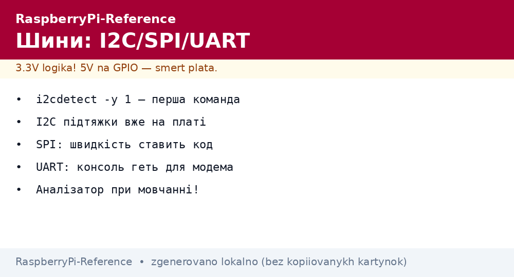
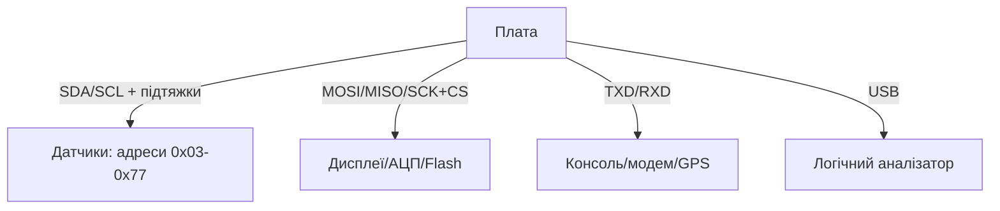

# Шини Raspberry Pi - I2C, SPI і UART з налаштуванням та кодом


*Рис. Три шини з одних пінів: I2C - датчики, SPI - дисплеї, UART - консоль і модеми; швидкості і підтяжки.*

> [!tip] Що це за нота
> Практичний мінімум шин: увімкнути, знайти пристрій, погнати дані. I2C - датчики, SPI - дисплеї/АЦП, UART - консоль/модеми/GPS. База: [гребінка і gpiozero](../../../RaspberryPi-Reference/03-GPIO/01-Header-Gpiozero.md), [налаштування ОС](../../../RaspberryPi-Reference/09-Proshivka/03-OS-Nalashtuvannya.md).

## 1. Мета

Підняти всі три шини за вечір:

- увімкнення через raspi-config / config.txt без магії;
- сканери: хто висить на шині і на якій адресі;
- швидкості: коли вистачить дефолту, коли крутити;
- типові граблі: рівні, підтяжки, конфлікти.

| Шина | Піни (BCM) | Дефолтна швидкість | Максимум |
| --- | --- | --- | --- |
| I2C-1 | SDA 2, SCL 3 | 100 кГц | 400 кГц+ |
| SPI0 | 7-11 | ~10 МГц | 60+ МГц |
| UART0 | TXD 14, RXD 15 | 115200 | 4 Мбіт/с |

## 2. Архітектура шин



I2C-підтяжки вже на платі (1.8 кОм). SPI і UART підтяжок не мають - idle-рівні тримають самі пристрої.

## 3. I2C детально

- увімкнення: `raspi-config nonint do_i2c 0` або `dtparam=i2c_arm=on`;
- сканер: `i2cdetect -y 1` - таблиця адрес;
- швидкість: `dtparam=i2c_arm_baudrate=400000`;
- довжина: до 1 м на 100 кГц, далі - розширювачі/нижча швидкість;
- конфлікт адрес - перемички на модулях або друга шина (i2c-3..6 оверлеями);
- clock-stretching повільних чипів - ядро терпить, біт-бенг ні.

## 4. SPI детально

- увімкнення: `dtparam=spi=on`, пристрої `/dev/spidev0.0`, `/dev/spidev0.1`;
- швидкість задає драйвер/бібліотека (дисплеї 20-60 МГц);
- довжина: до 20 см на повній швидкості, далі - нижче або буфери;
- кілька пристроїв - окремі CS, такт спільний;
- SPI1-SPI6 - додаткові контролери оверлеями (див. README оверлеїв).

## 5. Робочий код: сканери трьох шин

```python
import subprocess

def i2c_scan():
    out = subprocess.check_output(['i2cdetect', '-y', '1']).decode()
    found = []
    for line in out.splitlines()[1:]:
        for cell in line.split()[1:]:
            if cell != '--':
                found.append('0x' + cell)
    return found

def spi_loopback():
    import spidev
    spi = spidev.SpiDev()
    spi.open(0, 0)
    spi.max_speed_hz = 1000000
    resp = spi.xfer2([0x9F, 0x00, 0x00, 0x00])
    spi.close()
    return resp

def uart_echo():
    import serial
    s = serial.Serial('/dev/serial0', 115200, timeout=1)
    s.write(b'AT\r\n')
    return s.readline()

if __name__ == '__main__':
    print('I2C:', i2c_scan())
    print('SPI:', spi_loopback())
    print('UART:', uart_echo())
```

Пакети: `i2c-tools`, `python3-spidev`, `python3-serial`. Консоль на UART0 вимикаємо (`enable_uart=0` + прибрати `console=serial0`), якщо порт потрібен модему.

## 6. UART детально

- `/dev/serial0` - аліас на справжній порт (Pi 4/5 - повноцінний);
- BT займає основний UART на старих - віддаємо BT mini-UART;
- швидкості нестандартні - `stty` або termios;
- RS485 - через перетворювач з DE/RE на GPIO;
- GPS: 9600 8N1, NMEA-рядки, PPS - окремим піном.

## 7. Живлення пристроїв на шинах

- датчики 3.3V - з пінів 1/17 (до 500 мА сумарно);
- 5V модулі - з пінів 2/4, логіку через перетворювач рівнів;
- довгі шлейфи - живлення окремим дротом, не по сигнальному;
- розв'язка I2C (ADuM) - для вулиці і гроз.

## 8. Типові помилки

| Симптом | Причина | Лікування |
| --- | --- | --- |
| `i2cdetect` порожній | шина не увімкнена | raspi-config / dtparam |
| Адреси `UU` замість номерів | зайняті ядром (EEPROM/RTC) | це нормально, свої шукаємо поруч |
| SPI сміття на швидкості | довгі дроти | коротше 20 см або нижча швидкість |
| UART мовчить | консоль тримає порт | прибрати console, вимкнути getty |
| Два однакові датчики | одна адреса | перемичка ADDR або друга шина |
| Працює, потім висне | просадка 3.3V | окреме живлення модулів |

## 9. Швидка шпаргалка шин

- I2C: `i2cdetect -y 1`, 100 кГц для старту;
- SPI: `/dev/spidev0.0`, швидкість - в коді;
- UART: `/dev/serial0`, консоль геть для модема;
- рівні 3.3V, 5V - через перетворювач рівнів;
- аналізатор - при першому мовчанні.

## 10. Суміжні ноти

- [гребінка і gpiozero](../../../RaspberryPi-Reference/03-GPIO/01-Header-Gpiozero.md) - піни шин.
- [логічний аналізатор](../../../RaspberryPi-Reference/04-Shini/02-Logic-Analyzer.md) - відладка шин.
- [налаштування ОС](../../../RaspberryPi-Reference/09-Proshivka/03-OS-Nalashtuvannya.md) - config.txt і групи.
- [клімат BME280](../../../RaspberryPi-Reference/10-Sensori/01-BME280-Klimat.md) - перший I2C-датчик.
- [головна карта](../../../RaspberryPi-Reference/Home.md) - повна навігація.

## 9.1 Адресна книга шин

- I2C: 0x03-0x77 вільні, `UU` - зайняті ядром;
- SPI: CE0/CE1 вбудовані, решта - будь-який GPIO;
- UART: `/dev/serial0` - аліас, не апаратура;
- швидкості записувати в README проєкту;
- другу шину піднімати оверлеєм, не bit-bang.

## Офіційні джерела

- [Getting Started (Raspberry Pi docs)](https://www.raspberrypi.com/documentation/computers/getting-started.html) - шини і config.txt.
- [gpiozero docs (Read the Docs)](https://gpiozero.readthedocs.io/en/stable/) - робота з пінами шин.
- [Raspberry Pi OS (Raspberry Pi)](https://www.raspberrypi.com/software/) - утиліти i2c-tools.
