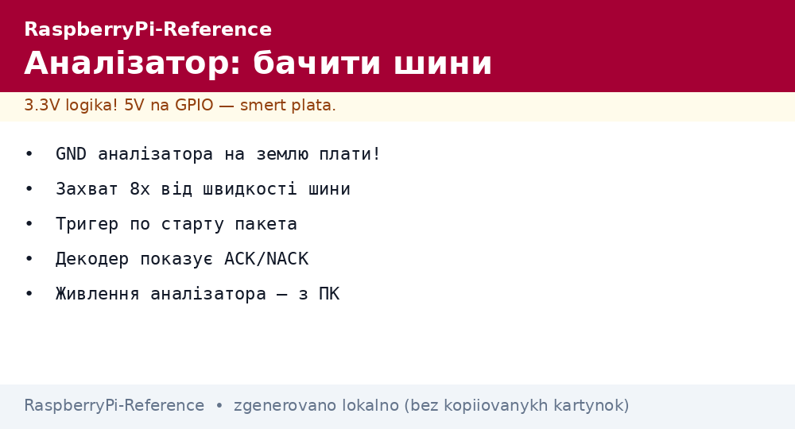
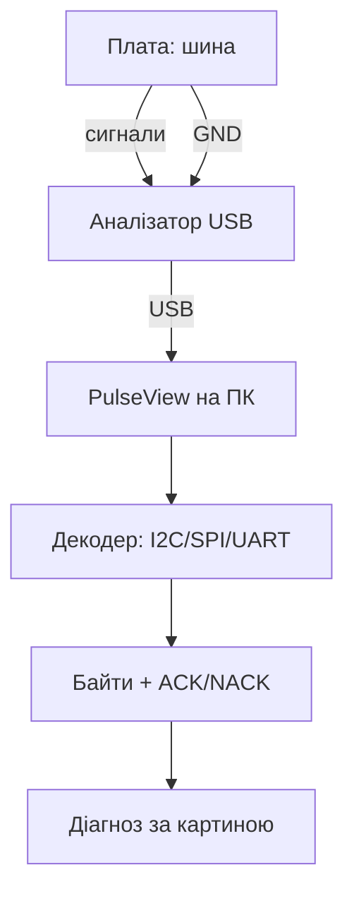

# Логічний аналізатор і відладка шин - Saleae-клони та PulseView


*Рис. Аналізатор слухає шину паралельно: клони на землю плати, канали на сигнали, декодер показує байти.*

> [!tip] Що це за нота
> Інструмент №1 при «шина мовчить»: бачимо, хто винен - софт, адреса, рівні чи дроти. Клон за 10 доларів + PulseView закривають 95 % задач. База: [шини I2C/SPI/UART](../../../RaspberryPi-Reference/04-Shini/01-I2C-SPI-UART.md), [гребінка і gpiozero](../../../RaspberryPi-Reference/03-GPIO/01-Header-Gpiozero.md).

## 1. Мета

Навчитись бачити шини очима:

- підключення аналізатора без впливу на схему;
- PulseView: захват, декодери, вимірювання;
- картини поломок: що означає кожна;
- коли аналізатора мало і треба осцилограф.

| Канал | Сигнал | Куди чіпляти |
| --- | --- | --- |
| 0 | GND | земля плати (обов'язково!) |
| 1 | SDA / MOSI / TXD | дані |
| 2 | SCL / SCK / RXD | такт/прийом |
| 3 | CS / DE | вибір кристала |
| 4+ | IRQ, додаткові | за потребою |

## 2. Архітектура виміру



Аналізатор - слухач, не учасник: входи високоомні, шину не вантажать. Живлення аналізатора - з USB ПК, не з плати!

## 3. PulseView за 5 хвилин

- драйвер fx2lafrankdriver, прошивка заливається сама;
- частота захвату: мінімум 8× від швидкості шини;
- тригер по спаду SDA/CS - ловимо початок пакета;
- декодер I2C: адреса + R/W + ACK видно одразу;
- експорт захвату - прикласти до питання на форумі.

## 4. Картини поломок I2C

| Картина | Діагноз |
| --- | --- |
| SDA в нулі постійно | хтось тримає шину (завислий слейв) |
| Адреса є, NACK | немає пристрою / не та адреса |
| Старт без стопів | софт не закриває транзакції |
| Сміття на фронтах | довгі дроти, немає підтяжок |
| 9-й такт без ACK | слейв не встигає (clock-stretch ігнор) |

## 5. Робочий код: самоперевірка шин

```python
import subprocess

def check_i2c():
    out = subprocess.check_output(['i2cdetect', '-y', '1']).decode()
    devs = [c for line in out.splitlines()[1:]
            for c in line.split()[1:] if c not in ('--', 'UU')]
    print('I2C devices:', devs if devs else 'NONE - check wiring')
    return devs

def check_spi():
    try:
        import spidev
        s = spidev.SpiDev()
        s.open(0, 0)
        s.max_speed_hz = 1000000
        r = s.xfer2([0x00])
        s.close()
        print('SPI open OK, reply:', r)
        return True
    except Exception as e:
        print('SPI FAIL:', e)
        return False

def check_uart():
    import serial
    try:
        s = serial.Serial('/dev/serial0', 115200, timeout=1)
        s.close()
        print('UART open OK')
        return True
    except Exception as e:
        print('UART FAIL:', e)
        return False

if __name__ == '__main__':
    check_i2c()
    check_spi()
    check_uart()
```

Самоперевірка перед аналізатором: половина проблем - неуважність, а не залізо. Аналізатор дістаємо, коли скрипт каже «все ок», а датчик мовчить.

## 6. SPI/UART картини

- SPI: немає тактів - CS не той пін/не той пристрій;
- SPI: такти є, MISO в нулі - слейв не відповідає;
- UART: framing errors - не та швидкість;
- UART: сміття замість AT - рівні 5V/3.3V переплутані;
- загальне: спочатку земля, потім живлення, потім сигнали.

## 7. Коли треба осцилограф

- просадки живлення в піку (аналізатор їх не бачить);
- дзвін і викиди на фронтах довгих ліній;
- аналогові рівні: чи дотягує HIGH до порогу;
- USB/Ethernet - тільки осцилограф з диференційними пробами;
- бюджетний DSO138 - мінімум, нормальний - 100 МГц.

## 8. Типові помилки

| Симптом | Причина | Лікування |
| --- | --- | --- |
| PulseView не бачить пристрій | драйвер/прошивка клона | Zadig (Windows) або fx2lafrankdriver |
| Захват - пряма лінія | земля не підключена | GND аналізатора на землю плати! |
| Декодер маячня | не та швидкість захвату | мінімум 8× від шини |
| I2C видно, байтів немає | тригер не там | тригер по спаду SDA |
| Аналізатор гріється/висне | живиться від плати | живлення тільки з USB ПК |
| Все чисто, а не працює | логічні рівні ок, а живлення ні | осцилограф на VCC, USB-тестер |

## 9. Швидка шпаргалка відладки

- спочатку земля, потім живлення, потім сигнали;
- самоперевірка скриптом - до аналізатора;
- захват 8×, тригер по старту пакета;
- картину звіряти з таблицею розділу 4/6;
- експорт захвату - до питання спільноті.

## 10. Суміжні ноти

- [шини I2C/SPI/UART](../../../RaspberryPi-Reference/04-Shini/01-I2C-SPI-UART.md) - що слухаємо.
- [гребінка і gpiozero](../../../RaspberryPi-Reference/03-GPIO/01-Header-Gpiozero.md) - куди чіплятись.
- [живлення USB-C](../../../RaspberryPi-Reference/02-Zhivlennya/01-USB-C-PD.md) - коли винне живлення.
- [арсенал приладів](../../../RaspberryPi-Reference/17-Lab/01-Priladi.md) - повна лабораторія.
- [головна карта](../../../RaspberryPi-Reference/Home.md) - повна навігація.

## Офіційні джерела

- [Getting Started (Raspberry Pi docs)](https://www.raspberrypi.com/documentation/computers/getting-started.html) - шини і налагодження.
- [gpiozero docs (Read the Docs)](https://gpiozero.readthedocs.io/en/stable/) - тестові скрипти пінів.
- [Raspberry Pi OS (Raspberry Pi)](https://www.raspberrypi.com/software/) - утиліти i2c-tools і SPI.
