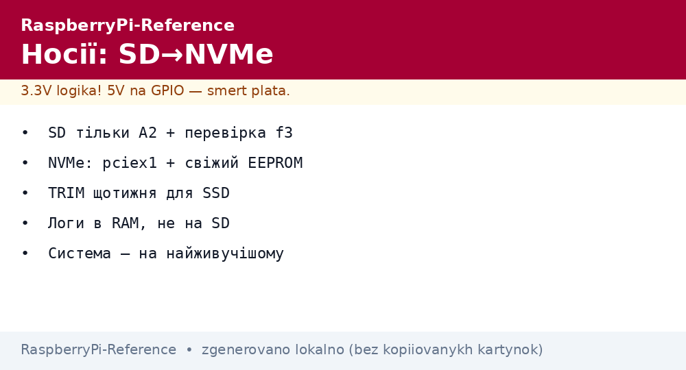
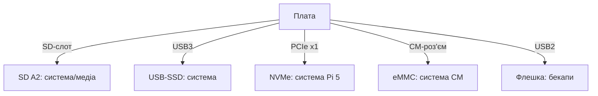

# Носії Raspberry Pi - SD, eMMC, NVMe і USB-диски


*Рис. Драбина швидкості і живучості: SD → USB-SSD → NVMe → eMMC; вибір за бюджетом і задачею.*

> [!tip] Що це за нота
> Дискова підсистема повністю: що куди ставити, як не вбити SD за пів року, коли переходити на NVMe. Прошивка: [прошивка Imager](../../../RaspberryPi-Reference/09-Proshivka/01-Imager-Headless.md), boot-порядок: [завантаження EEPROM](../../../RaspberryPi-Reference/09-Proshivka/02-EEPROM-Boot.md).

## 1. Мета

Обрати носій під задачу і продовжити йому життя:

- порівняння носіїв чесними цифрами;
- SD: класи, підробки, знос і боротьба з ним;
- NVMe на Pi 5: HAT-плати, диски, система без SD;
- USB-диски: коли вистачить коробки.

| Носій | Швидкість | Живучість | Ціна |
| --- | --- | --- | --- |
| SD A2 | ~40 МБ/с | низька (зношується) | копійки |
| USB-SSD SATA | ~350 МБ/с | висока (TRIM) | середня |
| NVMe (Pi 5) | ~500 МБ/с (x1) | висока | вища + HAT-плата |
| eMMC (CM) | ~200 МБ/с | висока | у ціні модуля |

## 2. Архітектура варіантів



Золоте правило: система - на найживучіщому, медіа - на найбільшому, бекап - окремо.

## 3. SD-карти: вижити максимум

- клас A2 обов'язково (випадкові операції ОС);
- об'єм з запасом 50 % - контролеру є де розкладати знос;
- `f3`/`H2testw` повним обсягом до першої прошивки;
- логи в RAM, своп вимкнений або zram;
- моніторинг: раптові read-only - передсмертний симптом;
- заміна раз на 1-2 роки в 24/7 - планово, не за фактом.

## 4. NVMe на Pi 5

- офіційна M.2 HAT+ (2230/2242) або сторонні під 2280;
- `dtparam=pciex1` + свіжий EEPROM, інакше диска немає;
- Imager пише систему прямо на NVMe;
- SSD без DRAM-буфера - менше гріється;
- Gen3-диски працюють у Gen2-режимі лінії - без проблем.

## 5. Робочий код: здоров'я дисків

```bash
#!/bin/bash
# disk-health.sh — щотижнева перевірка
echo "== usage =="
df -h / /boot/firmware | awk '{print $1, $5, $6}'
echo "== SD wear (approx) =="
dmesg | grep -i "mmc.*error" | tail -3 || echo "mmc errors: none"
echo "== NVMe temp =="
if [ -e /dev/nvme0 ]; then
  sudo nvme smart-log /dev/nvme0 | grep -E "temperature|percentage_used"
else
  echo "no nvme"
fi
echo "== USB resets =="
dmesg | grep -c "usb.*reset" || true
echo "== largest dirs =="
du -sh /var/log /tmp 2>/dev/null
```

USB-ресети в логах - перша ознака слабкого живлення диска. Температура NVMe понад 70 °C - додати радіатор/потік.

## 6. USB-диски і флешки

- SSD SATA в USB3-коробці - золота середина для Pi 4;
- UAS увімкнений ядром, TRIM - командою `fstrim -a` щотижня;
- живлення: коробка з окремим входом для 3.5" HDD;
- флешки - тільки для бекапів і перенесення, не система;
- NTFS/exFAT для обміну з Windows, ext4 - для системи.

## 7. Файлові системи

| ФС | Коли | Нотатка |
| --- | --- | --- |
| ext4 | система завжди | журнал, надійність |
| FAT32 | boot-розділ, флешки | сумісність |
| exFAT | великі файли для Windows | пакет exfat-fuse |
| btrfs | снапшоти (просунуті) | стиснення + відкат |
| overlayfs | read-only кіоски | система незмінна |

## 8. Типові помилки

| Симптом | Причина | Лікування |
| --- | --- | --- |
| Раптово read-only | SD померла | бекап, нова A2, відновлення |
| NVMe не видно | немає pciex1/старий EEPROM | обидва разом + ребут |
| USB-диск відвалюється | живлення | хаб з живленням, короткий кабель |
| Повільно через пів року | забитий диск + немає TRIM | `fstrim`, запас 30 % вільних |
| Не bootається з USB/NVMe | порядок в EEPROM | BOOT_ORDER 0xf416 (6 = NVMe) |
| btrfs не монтується | збій без чистої зупинки | `btrfs rescue`, бекап заздалегідь |

## 9. Швидка шпаргалка носіїв

- система - на найживучіщому носії;
- SD тільки A2 + перевірка f3;
- NVMe: pciex1 + свіжий EEPROM;
- TRIM щотижня для SSD;
- бекап до, а не після.

## 10. Суміжні ноти

- [прошивка Imager](../../../RaspberryPi-Reference/09-Proshivka/01-Imager-Headless.md) - запис образів.
- [завантаження EEPROM](../../../RaspberryPi-Reference/09-Proshivka/02-EEPROM-Boot.md) - порядок носіїв.
- [бекапи і клони](../../../RaspberryPi-Reference/08-Pamyat/02-Backup-Clone.md) - стратегія копій.
- [флагман Pi 5](../../../RaspberryPi-Reference/14-Devboards/01-Pi5-Flagman.md) - NVMe-HAT-плати.
- [головна карта](../../../RaspberryPi-Reference/Home.md) - повна навігація.

## 11. Вибір носія однією таблицею

- система на SD: тільки A2 + бекапи;
- система на USB-SSD: золота середина Pi 4;
- система на NVMe: максимум Pi 5;
- дані окремо від системи завжди;
- швидкість міряти `hdparm -t`, не вірити написам.
- температуру NVMe дивитись в smart-логах.
- USB-коробку брати з UAS-підтримкою.
- систему і дані тримати на різних носіях.
- етикетка на кожній карті: вузол і дата.
- картрідер USB3 для швидкого клонування.

## Офіційні джерела

- [Getting Started (Raspberry Pi docs)](https://www.raspberrypi.com/documentation/computers/getting-started.html) - носії і завантаження.
- [Raspberry Pi OS (Raspberry Pi)](https://www.raspberrypi.com/software/) - образи під носії.
- [rpi-imager (Raspberry Pi, GitHub)](https://github.com/raspberrypi/rpi-imager) - запис на будь-який носій.
