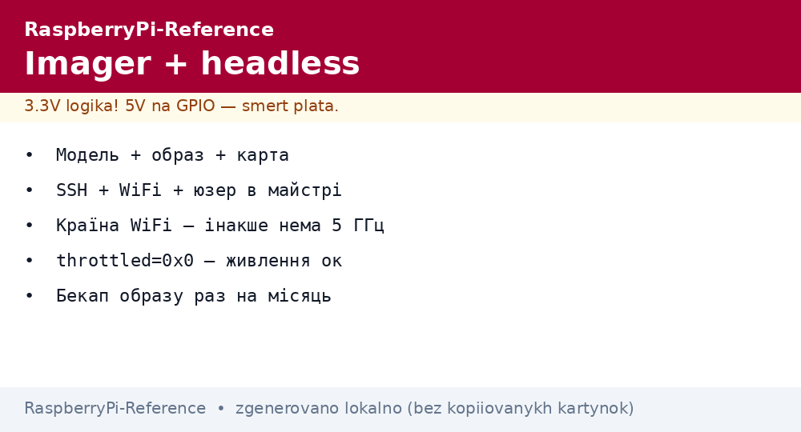
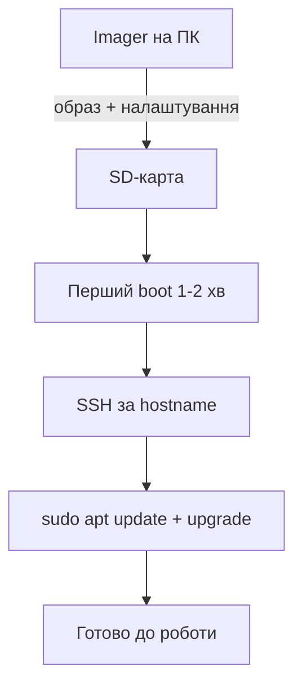

# Raspberry Pi Imager і headless - прошивка SD з SSH і WiFi


*Рис. Imager пише образ і одразу налаштовує: користувач, SSH, WiFi, hostname - плата стартує готова.*

> [!tip] Що це за нота
> Нульовий крок володіння Pi: правильна прошивка економить години. Усе - в одному вікні Imager, без ручних файлів. Вибір ОС: [вибір середовища](../../../RaspberryPi-Reference/00-Start/05-Vibir-seredovischa.md), далі: [налаштування ОС](../../../RaspberryPi-Reference/09-Proshivka/03-OS-Nalashtuvannya.md).

## 1. Мета

Прошити і запустити Pi без монітора:

- вибір образу під плату і задачу;
- налаштування в Imager: користувач, SSH, WiFi, локаль;
- перевірка першого boot за світлодіодами і мережею;
- типові граблі Etcher-еру і старих гайдів.

| Образ | Коли | Об'єм |
| --- | --- | --- |
| Pi OS Desktop 64-bit | десктоп, медіа, навчання | ~3 ГБ |
| Pi OS Lite 64-bit | сервери, IoT, Zero | ~500 МБ |
| Pi OS Lite 32-bit | Zero W v1, старе | ~500 МБ |
| Ubuntu Server | ROS, знайомий стек | ~1 ГБ |

## 2. Архітектура процесу



Старі файли `ssh` і `wpa_supplicant.conf` більше не потрібні - Imager пише все сам у перший розділ.

## 3. Майстер Imager покроково

- Choose Device - точна модель (Pi 5 / Pi 4 / Zero 2 W);
- Choose OS - за таблицею вище;
- Choose Storage - карта (дані зітруться!);
- Діалог налаштувань (колишня «шестерня» Imager v1): hostname, користувач+пароль, WiFi+пароль+країна, SSH з ключем;
- Write → Yes → чекаємо верифікацію;
- SD в плату, живлення - і не чіпати 2 хвилини.

## 4. Перше підключення

- `ssh user@raspberrypi.local` (mDNS) або IP з роутера;
- пароль з Imager, не `raspberry` (його більше немає);
- `sudo raspi-config`: розширити FS, локаль, часовий пояс;
- `sudo apt update && sudo apt full-upgrade -y && sudo reboot`;
- ключі: `ssh-copy-id` - далі без паролів.

## 5. Робочий код: first-boot скрипт

```bash
#!/bin/bash
# first-boot.sh — прогнати один раз по SSH
set -e
sudo raspi-config nonint do_hostname my-node-01
sudo raspi-config nonint do_wifi_country UA
sudo apt update && sudo apt full-upgrade -y
sudo apt install -y git vim htop i2c-tools python3-pip
sudo raspi-config nonint do_i2c 0
sudo raspi-config nonint do_spi 0
sudo raspi-config nonint do_ssh 0
echo "reboot now: sudo reboot"
```

`nonint` - неінтерактивний режим raspi-config для скриптів. I2C/SPI вмикаємо одразу - знадобляться датчикам.

## 6. WiFi нюанси

- країна UA/ваша - без неї 5 ГГц не працює;
- 5 ГГц канали DFS - роутер може мовчати хвилинами;
- статичний IP - резервація на роутері за MAC;
- `nmcli` - новий інструмент (NetworkManager замість dhcpcd);
- відвал WiFi - watchdog-скрипт з `ping` і перезапуском інтерфейсу.

## 7. Перевірка здоров'я після установки

| Тест | Команда | Норма |
| --- | --- | --- |
| Живлення | `vcgencmd get_throttled` | `0x0` |
| Температура | `vcgencmd measure_temp` | < 60 °C |
| Диск | `df -h /` | < 70 % |
| Пам'ять | `free -h` | swap ≈ 0 |
| Аптайм-сервіси | `systemctl --failed` | порожньо |

`throttled=0x50000` - було просідання живлення: міняти БЖ, навіть якщо зараз працює.

## 7.1 Масове прошивання партії

- один «золотий» образ: налаштували раз, клонуємо всім;
- Imager CLI: `rpi-imager --cli --sd-card` у скрипті;
- hostname і SSH-ключі - унікальні на плату (шаблон + серійник);
- верифікація запису увімкнена завжди;
- стікер MAC/серійник на корпус одразу після прошивки;
- перший boot партії - по одній платі, не всі разом;
- журнал: яка карта в яку плату, дата, версія образу;
- запасні карти з золотим образом - 10 % партії.

Паралельне прошивання - через USB-хаб з живленням на 4+ картрідерів. Послідовно надійніше, паралельно швидше: вибір за дедлайном.

## 8. Типові помилки

| Симптом | Причина | Лікування |
| --- | --- | --- |
| Не bootається взагалі | крива SD або образ не під плату | перевірка f3, свіжий образ |
| SSH відхиляє | не увімкнули в Imager | перепрошити з SSH або монітор+клавіатура |
| WiFi не конектиться | немає країни або 5 ГГц DFS | країна, точка 2.4 ГГц для старту |
| `raspberrypi.local` не резолвиться | немає mDNS на ПК | IP з роутера, nmap-скан |
| Старий пароль не підходить | `pi/raspberry` видалені | користувач з Imager |
| Imager не бачить карту | картрідер/адаптер | інший рідер, пряме гніздо |

## 9. Суміжні ноти

- [вибір середовища](../../../RaspberryPi-Reference/00-Start/05-Vibir-seredovischa.md) - яка ОС навіщо.
- [налаштування ОС](../../../RaspberryPi-Reference/09-Proshivka/03-OS-Nalashtuvannya.md) - система після старту.
- [завантаження EEPROM](../../../RaspberryPi-Reference/09-Proshivka/02-EEPROM-Boot.md) - порядок boot.
- [носії пам'яті](../../../RaspberryPi-Reference/08-Pamyat/01-SD-eMMC-NVMe.md) - SD детально.
- [живлення USB-C](../../../RaspberryPi-Reference/02-Zhivlennya/01-USB-C-PD.md) - щоб не було блискавки.

## 10. Швидка шпаргалка Imager

- модель + образ + карта - три кліки;
- діалог налаштувань: hostname, юзер, SSH, WiFi, країна;
- верифікацію не вимикати;
- перший boot - 2 хвилини не чіпати;
- `throttled=0x0` - все добре.

## Офіційні джерела

- [Raspberry Pi OS (Raspberry Pi)](https://www.raspberrypi.com/software/) - образи і Imager.
- [Getting Started (Raspberry Pi docs)](https://www.raspberrypi.com/documentation/computers/getting-started.html) - headless-процес.
- [rpi-imager (Raspberry Pi, GitHub)](https://github.com/raspberrypi/rpi-imager) - опції і кастомізація.

## 10. Тестування масового розгортання

- Після іміджу перевіряйте `throttled=0x0` на кожній платі (температурний контроль).
- Якщо `0x50000` — перегрев або слабкий БЖ, не запускайте виробництво.
- Збережіть `lsusb -t` та `dmesg | grep -i "usb\|mmc\|nvme"` для кожного серійного номера.
- Лог з `journalctl -u ssh` перевіряйте перед здачею вузла в експлуатацію.
- Оновлюйте імідж раз на квартал (Bookworm → наступний LTS), щоб не накопичувати CVE.
