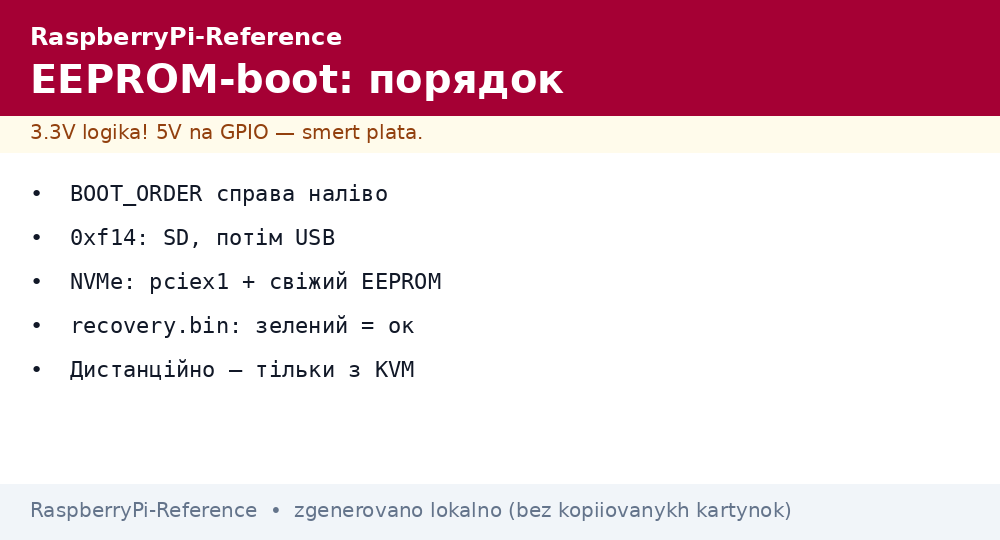
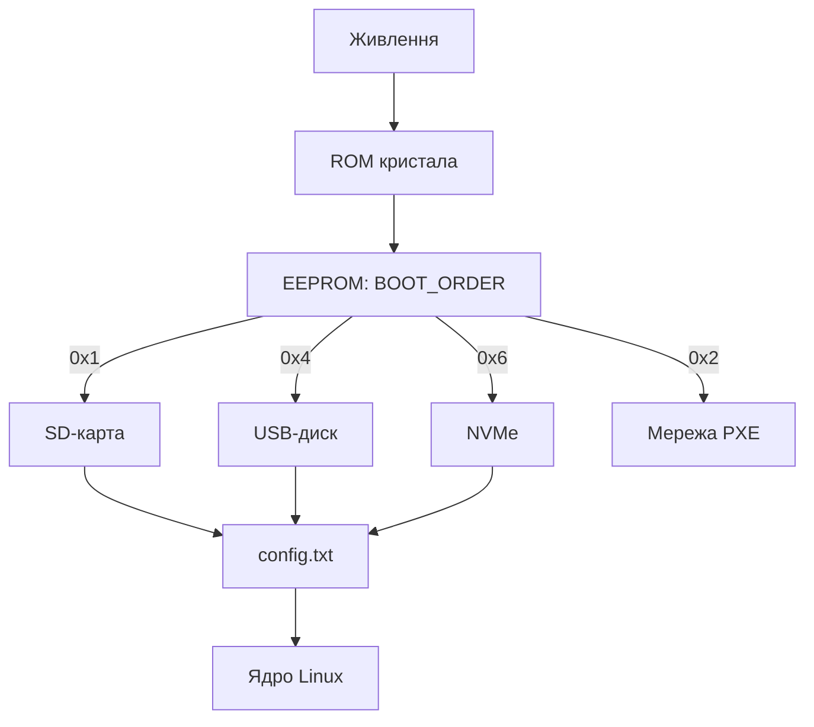

# Завантаження Raspberry Pi - EEPROM, порядок boot і USB/NVMe


*Рис. Ланцюг boot: ROM → EEPROM → config.txt → ядро; порядок носіїв задає BOOT_ORDER.*

> [!tip] Що це за нота
> Pi 4/5 завантажуються не з BIOS, а з EEPROM на платі: порядок носіїв, USB, мережа - усе там. Розуміння ланцюга економить цеглини. Прошивка системи: [прошивка Imager](../../../RaspberryPi-Reference/09-Proshivka/01-Imager-Headless.md), носії: носії пам'яті.

## 1. Мета

Керувати завантаженням свідомо:

- ланцюг boot від кнопки до ядра;
- BOOT_ORDER: SD → USB → NVMe → мережа;
- оновлення EEPROM без страху;
- відновлення після невдалого оновлення.

| Етап | Де лежить | Що робить |
| --- | --- | --- |
| ROM (незмінний) | кристал | шукає EEPROM |
| EEPROM | SPI-flash плати | порядок носіїв, USB, мережа |
| config.txt | boot-розділ | оверлеї, частоти, UART |
| start.elf/kernel | boot-розділ | ядро і initramfs |

## 2. Архітектура ланцюга



Значення BOOT_ORDER читаються справа наліво: `0xf461` = спробувати NVMe, USB, SD, потім цикл. `0xf14` - класика «SD, потім USB».

## 3. Конфіг EEPROM

- читати: `rpi-eeprom-config` (поточний);
- правити: `rpi-eeprom-config --edit` - відкриває редактор;
- ключові поля: `BOOT_ORDER`, `BOOT_UART`, `POWER_OFF_ON_HALT`, `PCIE_PROBE`;
- застосувати: перезавантаження;
- оновлення прошивки: `rpi-eeprom-update -a` + ребут.

## 4. Сценарії порядку

| Задача | BOOT_ORDER | Примітка |
| --- | --- | --- |
| Звичайна SD | `0xf1` | за замовчуванням |
| Система на SSD | `0xf14` | SD як запасна |
| NVMe на Pi 5 | `0xf461` | потрібен dtparam pciex1 |
| Мережеве завантаження | `0xf21` | TFTP + NFS (клас/ферма) |
| USB-гаджет (Zero) | N/A | OTG-режим окремо |

## 5. Робочий код: інспектор boot

```bash
#!/bin/bash
# boot-inspect.sh — що і звідки завантажилось
echo "== EEPROM =="
rpi-eeprom-update 2>/dev/null | head -5 || vcgencmd bootloader_version
echo "== BOOT_ORDER =="
rpi-eeprom-config 2>/dev/null | grep BOOT_ORDER || echo "legacy Pi"
echo "== root device =="
findmnt -n -o SOURCE /
echo "== boot files =="
ls -la /boot/firmware/start.elf /boot/firmware/kernel8.img 2>/dev/null
echo "== throttled =="
vcgencmd get_throttled
```

На Zero/старих Pi утиліт EEPROM немає - там boot тільки з SD. Скрипт це враховує гілкою `legacy Pi`.

## 6. Відновлення цеглини

- симптом: ACT не блимає взагалі - битий EEPROM (рідко) або живлення;
- recovery: SD з образом `recovery.bin` (утиліта rpi-eeprom) - зелений екран = успіх;
- Pi 4 без EEPROM: завжди стартує, якщо SD жива;
- правило: не оновлювати EEPROM дистанційно без KVM-запасу.

## 7. Мережеве завантаження

- Pi 4/5: PXE з коробки (після увімкнення в EEPROM);
- сервер: dnsmasq (DHCP+TFTP) + NFS-корінь;
- клас з 20 Pi без SD-карт - один образ на всіх;
- CM4 без eMMC: тільки мережа або SD на носії.

## 7.1 UART-консоль як рятувальний круг

- 3-піновий роз'єм Pi 5 або GPIO14/15 на старих - 115200 8N1;
- USB-TTL конвертер 3.3V (не 5V!): TX→RX перехресно;
- бачимо весь boot включно з EEPROM-повідомленнями;
- `BOOT_UART=1` в EEPROM-конфігу - лог раннього boot;
- консольний кабель в сумці адміністратора - обов'язково;
- через консоль правимо config.txt коли мережі немає;
- автологін на консоль - тільки в лабораторії, не в полі.

Безмоніторна діагностика цеглини починається з UART: екран мовчить, а консоль розповідає все.

## 8. Типові помилки

| Симптом | Причина | Лікування |
| --- | --- | --- |
| ACT 4 спалахи | немає start.elf | перепрошити носій |
| USB-диск ігнорується | старий EEPROM / не той ORDER | оновити, виставити 0xf14 |
| NVMe мовчить | немає pciex1 / стара прошивка | обидва разом, потім ребут |
| Зациклилось на веселці | битий config.txt | правити на ПК, прибрати оверлеї |
| PXE не стартує | немає TFTP-сервера | dnsmasq за гайдом |
| Після оновлення EEPROM - цегла | обрив живлення посеред запису | recovery-SD з зеленим екраном |

## 9. Суміжні ноти

- [прошивка Imager](../../../RaspberryPi-Reference/09-Proshivka/01-Imager-Headless.md) - образи на носії.
- [носії пам'яті](../../../RaspberryPi-Reference/08-Pamyat/01-SD-eMMC-NVMe.md) - SD/USB/NVMe детально.
- [налаштування ОС](../../../RaspberryPi-Reference/09-Proshivka/03-OS-Nalashtuvannya.md) - система після boot.
- [модулі CM](../../../RaspberryPi-Reference/14-Devboards/05-CM4-CM5.md) - eMMC і rpiboot.
- [живлення USB-C](../../../RaspberryPi-Reference/02-Zhivlennya/01-USB-C-PD.md) - стабільність при boot.

## 8.1 Швидка шпаргалка boot

- `0xf1` - SD, `0xf14` - SD+USB, `0xf461` - NVMe;
- `rpi-eeprom-update -a` - оновити завантажувач;
- ACT 4/7/8 спалахів - читати таблицю розділу 8;
- UART-консоль - бачить усе, що мовчить екран;
- recovery-SD рятує битий EEPROM.

## 8.1 Швидка шпаргалка boot

- `0xf1` - SD, `0xf14` - SD+USB, `0xf461` - NVMe;
- `rpi-eeprom-update -a` - оновити завантажувач;
- ACT 4/7/8 спалахів - читати таблицю розділу 8;
- UART-консоль бачить усе, що мовчить екран;
- recovery-SD рятує битий EEPROM.

## Офіційні джерела

- [Getting Started (Raspberry Pi docs)](https://www.raspberrypi.com/documentation/computers/getting-started.html) - режими завантаження.
- [rpi-imager (Raspberry Pi, GitHub)](https://github.com/raspberrypi/rpi-imager) - образи і recovery.
- [Raspberry Pi OS (Raspberry Pi)](https://www.raspberrypi.com/software/) - актуальні образи.
