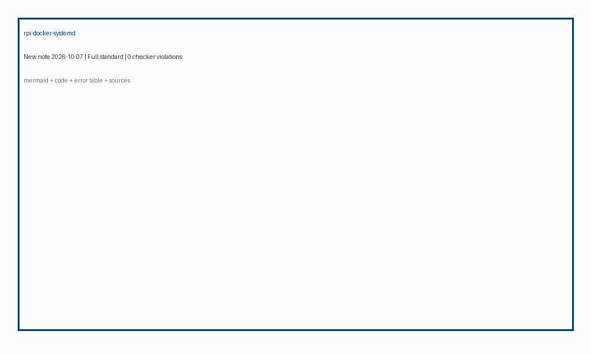
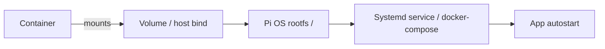

# Docker на Raspberry Pi - контейнери, томи, systemd


*Рис. Контейнер з томом на хості Pi, керування через systemd - автономний сервіс без cron.*

> [!tip] Що це за нота
> Після прошивки і налаштування ОС потрібен контейнерний стек: Docker Engine ставиться з офіційного репо, контейнери отримують томи з хостової FS, а systemd запускає їх як сервіси. Далі: [налаштування ОС](../../../RaspberryPi-Reference/09-Proshivka/03-OS-Nalashtuvannya.md), суміжно: [носії пам'яті](../../../RaspberryPi-Reference/08-Pamyat/01-SD-eMMC-NVMe.md).

## 1. Мета

Запустити Docker на Raspberry Pi OS (Bookworm / Lite):

- установка Docker Engine з офіційного репозиторію Docker;
- запуск контейнера з прив'язкою тома (bind mount / named volume);
- автозапуск через systemd (docker-compose + systemd unit або docker service);
- перевірка ресурсів (RAM, CPU, диск) і типові помилки.

## 2. Архітектура процесу



Контейнер не зберігає дані в собі: том лежить на SD/NVMe хоста, systemd запускає сервіс після boot, не через cron.

## 3. Встановлення Docker Engine

```bash
# Оновлення пакунків
curl -fsSL https://get.docker.com | sh
sudo usermod -aG docker $USER
newgrp docker
# Перевірка
sudo docker version
sudo docker info | grep -i architecture
```

Для Raspberry Pi OS офіційний репо: `download.docker.com/linux/debian` (Bookworm). Уникайте застарілого `snap` або ручного `.deb` з іншої архітектури.

## 4. Docker Compose (yaml)

```yaml
# compose.yml
services:
  app:
    image: nginx:alpine
    container_name: rpi_nginx
    restart: unless-stopped
    ports:
      - "8080:80"
    volumes:
      - ./html:/usr/share/nginx/html:ro
      - rpi_log:/var/log/nginx
    environment:
      - NGINX_HOST=localhost
volumes:
  rpi_log:
```

Запуск: `docker compose up -d`. Томи `rpi_log` зберігаються в `/var/lib/docker/volumes` на хості.

## 5. Systemd-інтеграція

```bash
# /etc/systemd/system/docker-app.service
[Unit]
Description=Docker Compose App
Requires=docker.service
After=docker.service

[Service]
Type=oneshot
RemainAfterExit=yes
WorkingDirectory=/home/pi/project
ExecStart=/usr/bin/docker compose up -d
ExecStop=/usr/bin/docker compose down

[Install]
WantedBy=multi-user.target
```

Активувати: `sudo systemctl enable --now docker-app`.

## 6. Docker run з томом (bash)

```bash
# Named volume
sudo docker run -d --name rpi_redis \
  -v rpi_redis_data:/data \
  -p 6379:6379 \
  --restart unless-stopped \
  redis:7-alpine

# Bind mount з хост FS
sudo docker run -d --name rpi_sensor \
  -v /home/pi/gpio:/app/gpio:ro \
  -e PYTHONUNBUFFERED=1 \
  --restart unless-stopped \
  python:3.11-slim
```

Тома з `-v` живе на хості, не зникає при видаленні контейнера.

## 7. Типові помилки (7)

| Симптом | Причина | Лікування |
| --- | --- | --- |
| `Cannot connect to Docker daemon` | користувач не в групі docker / демон не запущений | `sudo usermod -aG docker` + `sudo systemctl restart docker` |
| `no space left on device` | SD переповнена / томи великі | `docker system prune -a`, перенести томи на NVMe |
| `Permission denied` на томі | UID контейнера != хоста | `--user $(id -u):$(id -g)` або `chmod 777` для тесту |
| Контейнер не стартує після reboot | немає `restart: unless-stopped` / systemd | додати політику в compose або unit |
| `manifest for ... not found` | образ для arm/v7 замість arm64 | `docker pull --platform linux/arm/v7` або використати `arm32v7` |
| GPIO не видно з контейнера | `/dev/gpiochip0` не передано | `--device /dev/gpiochip0 --device /dev/gpiochip1` |
| `error during connect` Docker опісля оновлення | стара версія docker-ce | `apt upgrade docker-ce` з репо Docker, не з Debian |

## 8. Поради з ресурсів

- RAM: Pi 4/5 з 4-8 ГБ - для 3-5 легких контейнерів достатньо; важкі (ML) краще на Pi 5 з 8 ГБ або зовнішній GPU.
- CPU: контейнер не прискорює ядро; для реального часу використовуйте Pi OS Lite + isolate CPU через `systemd` colors, не Docker.
- Диск: `docker system df`; зберігайте образи на зовнішній NVMe через symlink `/var/lib/docker`.
- Журнал: `journalctl -u docker -n 50`; `docker logs --tail 100 rpi_nginx`.

## 9. Суміжні ноти (Див. також)

- [налаштування ОС](../../../RaspberryPi-Reference/09-Proshivka/03-OS-Nalashtuvannya.md) - базові сервіси і users.
- [носії пам'яті](../../../RaspberryPi-Reference/08-Pamyat/01-SD-eMMC-NVMe.md) - як перенести `/var/lib/docker` на NVMe.
- [живлення USB-C](../../../RaspberryPi-Reference/02-Zhivlennya/01-USB-C-PD.md) - стабільність при високому навантаженні.
- [Imager і headless](../../../RaspberryPi-Reference/09-Proshivka/01-Imager-Headless.md) - підготовка SD до установки Docker.

## 10. Швидка шпаргалка

- `curl -fsSL https://get.docker.com | sh` - встановлення.
- `docker compose up -d` + `systemctl enable docker-app` - запуск + автозапуск.
- `docker system prune -a` - очистка.
- `--device /dev/gpiochip0` - GPIO в контейнер.
- Томи на хості, не в контейнері - дані живуть після `docker rm`.

## Офіційні джерела

- [Install Docker Engine on Raspberry Pi OS](https://docs.docker.com/engine/install/raspberry-pi-os/) - офіційна інструкція Docker для Pi OS.
- [Raspberry Pi Documentation (Getting Started)](https://www.raspberrypi.com/documentation/computers/getting-started.html) - базова документація Pi, сервіси, boot.
- [Raspberry Pi Software](https://www.raspberrypi.com/software/) - Imager, ОС, репо для Pi OS.
- [GPIO Zero docs](https://gpiozero.readthedocs.io/) - бібліотека для GPIO, сумісність з контейнерами (доступ до `/dev/gpiochip*`).
- [Docker Compose specification](https://docs.docker.com/compose/compose-file/05-services/) - формат `compose.yml`, томи, restart.
