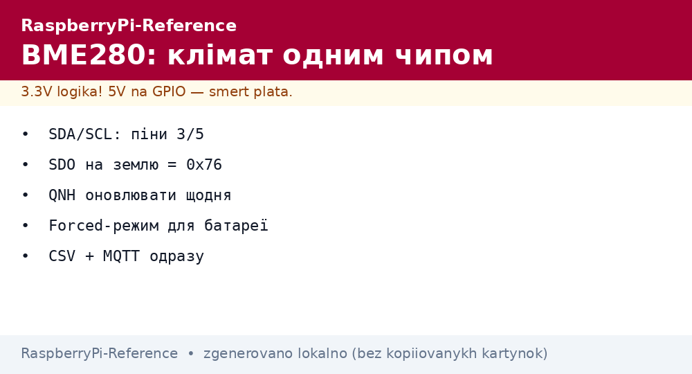
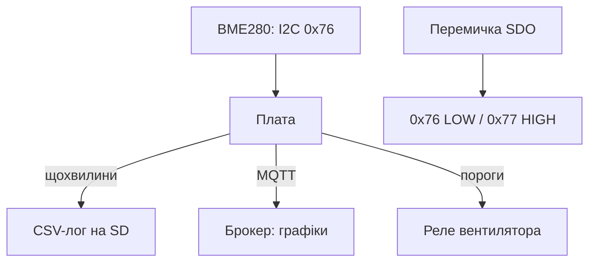

# Клімат на Raspberry Pi - BME280: тиск, вологість і температура


*Рис. BME280 на I2C: три виміри одним чипом - температура, вологість, тиск; адреса перемичкою SDO.*

> [!tip] Що це за нота
> Перший датчик кожного мейкера: один чип закриває метеостанцію. I2C, готови бібліотеки, точність з коробки. Шина: [шини I2C/SPI/UART](../../../RaspberryPi-Reference/04-Shini/01-I2C-SPI-UART.md), старт: [гребінка і gpiozero](../../../RaspberryPi-Reference/03-GPIO/01-Header-Gpiozero.md).

## 1. Мета

Запустити кліматичний вузол за вечір:

- підключення BME280: 4 дроти, адреса 0x76/0x77;
- бібліотеки: Adafruit/CircuitPython і чистий smbus;
- висота над рівнем моря з тиску;
- точка роси і абсолютна вологість - формули;
- логування в файл + графік.

| Параметр | Діапазон | Точність |
| --- | --- | --- |
| Температура | −40…+85 °C | ±1 °C |
| Вологість | 0-100 % | ±3 % |
| Тиск | 300-1100 гПа | ±1 гПа |
| Живлення | 1.8-3.6V (модулі - 5V з LDO) | - |

## 2. Архітектура вузла



Два однакові датчики на шині - розвести SDO: один LOW, другий HIGH. Більше двох - мультиплексор TCA9548A.

## 3. Підключення

| BME280-модуль | Плата | Примітка |
| --- | --- | --- |
| VIN | 3V3 (пін 1/17) | модулі GY - 5V ок, але 3V3 чистіше |
| GND | земля (пін 6/9/14) | поруч із SDA/SCL |
| SCL | GPIO3 (пін 5) | загальна шина |
| SDA | GPIO2 (пін 3) | загальна шина |
| SDO | GND/VCC | адреса 0x76/0x77 |
| CSB | VCC | режим I2C (не SPI!) |

Модулі GY-BME280/Purple: вбудований LDO і перетворювач рівнів - живимо хоч 5V. Голі чипи - тільки 3.3V.

## 4. Бібліотеки: три шляхи

- Adafruit Blinka + `adafruit-circuitpython-bme280` - найшвидший старт;
- `RPi.bme280` (пітонівський smbus2) - легкий, без залежностей;
- чистий smbus2 вручну - для навчання і мінімуму;
- C (`bme280` Bosch API) - коли Python повільний;
- всі читають калібрувальні коефіцієнти з EEPROM чипа самі.

## 5. Робочий код

```python
import time
import math
import board
import busio
import adafruit_bme280
import paho.mqtt.client as mqtt

i2c = busio.I2C(board.SCL, board.SDA)
bme = adafruit_bme280.Adafruit_BME280_I2C(i2c, address=0x76)
bme.sea_level_pressure = 1013.25

cl = mqtt.Client()
cl.connect("broker.local", 1883, 60)
cl.loop_start()

def dew_point(t, h):
    a, b = 17.27, 237.7
    g = (a * t) / (b + t) + math.log(h / 100.0)
    return (b * g) / (a - g)

while True:
    t = bme.temperature
    h = bme.relative_humidity
    p = bme.pressure
    alt = bme.altitude
    dp = dew_point(t, h)
    line = f"{time.strftime('%F %T')},{t:.1f},{h:.0f},{p:.1f},{alt:.0f},{dp:.1f}\n"
    with open('/home/pi/climate.csv', 'a') as f:
        f.write(line)
    cl.publish("home/climate", f"{t:.1f},{h:.0f},{p:.1f}")
    time.sleep(60)
```

Висоту рахуємо відносно `sea_level_pressure`: оновлюємо QNH з метеослужби раз на день, інакше «пливе» з погодою.

## 6. Точка роси і комфорт

- формула Магнуса (у коді вище) - достатньо для дому;
- точка роси вище 16 °C - душно, вище 20 °C - цвіль близько;
- абсолютна вологість: `216.7 × (h/100 × 6.112 × e^(17.67t/(243.5+t)) / (273.15+t))` г/м3;
- керування осушувачем/зволожувачем - за абсолютною, не відносною!
- провітрювання - коли вулична абсолютна нижча за кімнатну.

## 7. Розміщення датчика

- не над батареєю, не на сонці, не біля вікна з протягу;
- висота 1-1.5 м, тінь, вентиляція навколо;
- корпус з жалюзі (Стівенсон-екран з мисок - класика);
- саморозігрів чипа +1-2 °C: режим forced, опитування раз на хвилину;
- звірка: другий датчик поруч тиждень, дельта температур до 0.5 °C - норма.

## 8. Типові помилки

| Симптом | Причина | Лікування |
| --- | --- | --- |
| `IOError: [Errno 121]` | немає пристрою на шині | `i2cdetect -y 1`, перевірити SDA/SCL |
| Адреса не та | SDO перемичка | LOW=0x76, HIGH=0x77, звірити код |
| Температура +2 °C | саморозігрів + часте опитування | forced-режим, раз на хвилину |
| Тиск «не той» | QNH не оновлено | оновити sea_level_pressure |
| Вологість 100 % постійно | конденсат у корпусі | вентиляція, силікагель |
| Працює, потім висне | довгі дроти I2C | коротше 30 см або нижча швидкість |

## 9. Швидка шпаргалка BME280

- SDA/SCL: піни 3/5, підтяжки вже є;
- адреса: SDO на землю = 0x76;
- sea_level_pressure оновлювати щодня;
- forced-режим для батареї;
- CSV + MQTT - лог і графіки одразу.

## 10. Суміжні ноти

- [шини I2C/SPI/UART](../../../RaspberryPi-Reference/04-Shini/01-I2C-SPI-UART.md) - шина детально.
- [гребінка і gpiozero](../../../RaspberryPi-Reference/03-GPIO/01-Header-Gpiozero.md) - піни.
- [готова метеостанція](../../../RaspberryPi-Reference/16-Proekti/01-Meteostantsiya.md) - повний проєкт.
- [телеметрія в MQTT](../../../RaspberryPi-Reference/15-Protokoli/01-MQTT.md) - протокол і брокер.
- [головна карта](../../../RaspberryPi-Reference/Home.md) - повна навігація.

## Офіційні джерела

- [BME280 (Adafruit)](https://www.adafruit.com/product/2650) - модуль, адресація SDO.
- [gpiozero docs (Read the Docs)](https://gpiozero.readthedocs.io/en/stable/) - піни і скрипти.
- [Getting Started (Raspberry Pi docs)](https://www.raspberrypi.com/documentation/computers/getting-started.html) - I2C і raspi-config.
