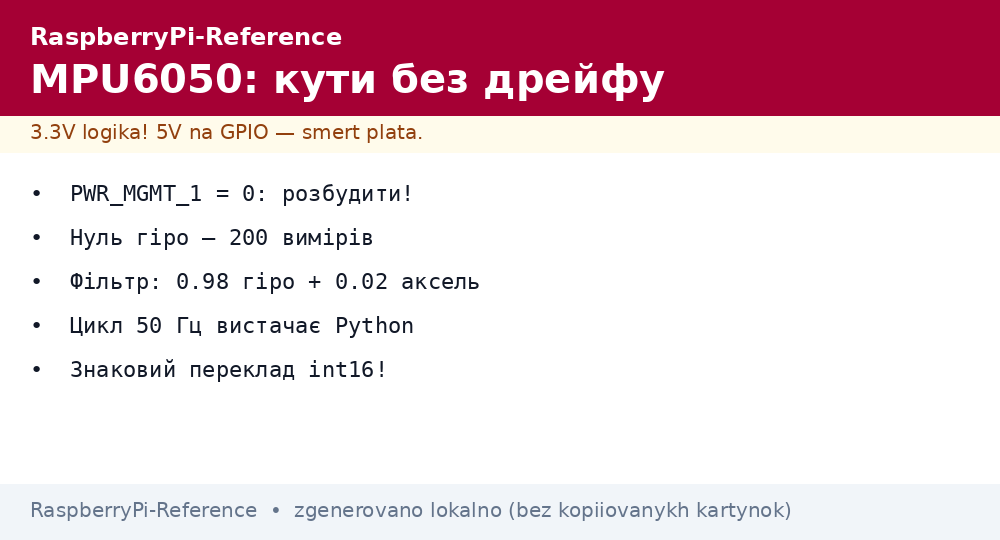
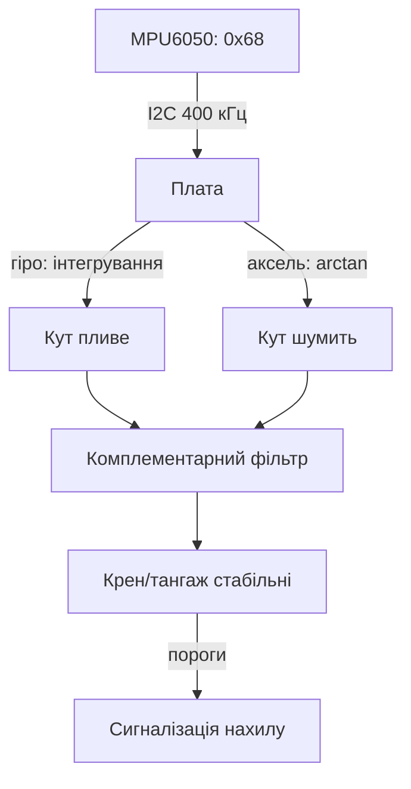

# Рух на Raspberry Pi - MPU6050: гіроскоп, акселерометр і кути


*Рис. MPU6050: гіроскоп міряє швидкість повороту, акселерометр - напрям вниз; разом дають кути.*

> [!tip] Що це за нота
> База інерціальних вимірів: нахил платформи, детектор руху, перший крок до IMU-фільтрів. Калман не потрібен - вистачить комплементарного. Шина: [шини I2C/SPI/UART](../../../RaspberryPi-Reference/04-Shini/01-I2C-SPI-UART.md), живлення: [живлення USB-C](../../../RaspberryPi-Reference/02-Zhivlennya/01-USB-C-PD.md).

## 1. Мета

Отримати стабільні кути нахилу:

- сирі дані гіроскопа і акселерометра по I2C;
- чому окремо вони брешуть (дрейф і шум);
- комплементарний фільтр трьома рядками;
- калібрування нуля і детектор руху.

| Сенсор | Що міряє | Проблема соло |
| --- | --- | --- |
| Гіроскоп | кутова швидкість °/с | дрейф нуля інтегрується |
| Акселерометр | вектор g (нахил) | шум + чутливий до прискорень |
| Разом (фільтр) | кут крен/тангаж | стабільно в статиці |

## 2. Архітектура виміру



Формула: `кут = 0.98 × (кут + гіро×dt) + 0.02 × аксель`. Гіро - швидкий, аксель - чесний: фільтр бере найкраще з обох.

## 3. Підключення і регістри

| Пін MPU6050 | Плата | Примітка |
| --- | --- | --- |
| VCC | 3V3 | модуль GY - 5V ок |
| GND | земля | поруч |
| SCL/SDA | піни 5/3 | шина I2C-1 |
| AD0 | GND/VCC | адреса 0x68/0x69 |
| INT | GPIO вільний | data-ready переривання |

Прокидання: регістр PWR_MGMT_1 = 0 (розбудити зі сну). Діапазони: гіро ±250 °/с, аксель ±2g для старту.

## 4. Калібрування нуля

- покласти нерухомо на 10 секунд, усереднити 500 вимірів;
- зсуви гіроскопа відняти завжди (дрейф росте з температурою);
- аксель калібруємо 6 положеннями (по осях ±g) для точності;
- зсуви зберігаємо у файл, не калібруємо щоразу;
- перекалібрування - при зміні температури на 10+ °C.

## 5. Робочий код

```python
import time
import math
import smbus

ADDR = 0x68
bus = smbus.SMBus(1)

def write_reg(reg, val):
    bus.write_byte_data(ADDR, reg, val)

def read_words(reg, n):
    raw = bus.read_i2c_block_data(ADDR, reg, n * 2)
    out = []
    for i in range(n):
        v = (raw[2*i] << 8) | raw[2*i+1]
        if v > 32767:
            v -= 65536
        out.append(v)
    return out

write_reg(0x6B, 0)
write_reg(0x1B, 0)
write_reg(0x1C, 0)
time.sleep(0.1)

cal = [0.0, 0.0, 0.0]
for _ in range(200):
    g = read_words(0x43, 3)
    cal[0] += g[0]; cal[1] += g[1]; cal[2] += g[2]
    time.sleep(0.005)
cal = [c / 200.0 for c in cal]

pitch = 0.0
roll = 0.0
last = time.time()
while True:
    now = time.time()
    dt = now - last
    last = now
    g = read_words(0x43, 3)
    a = read_words(0x3B, 3)
    gx = (g[0] - cal[0]) / 131.0
    gy = (g[1] - cal[1]) / 131.0
    acc_pitch = math.degrees(math.atan2(a[0], a[2]))
    acc_roll = math.degrees(math.atan2(a[1], a[2]))
    pitch = 0.98 * (pitch + gy * dt) + 0.02 * acc_pitch
    roll = 0.98 * (roll + gx * dt) + 0.02 * acc_roll
    print(f"pitch {pitch:.1f} roll {roll:.1f}")
    time.sleep(0.02)
```

Дільник 131 - чутливість при ±250 °/с. Цикл 50 Гц: вистачає Python без пропусків.

## 6. Детектор руху і нахилу

- рух: модуль вектора акселерометра відхиляється від 1g;
- нахил: крен/тангаж за порогом 30° - тривога;
- вільне падіння: модуль близько 0g;
- удар: сплеск модуля понад 2g;
- гістерезис порогів - проти дзвінків тривоги.

## 7. Куди далі: 9-DOF

- магнітометр дає азимут (курс), якого тут немає;
- тиск дає висоту - третя координата;
- GPS дає позицію і швидкість;
- разом - повна навігація (див. ноти компаса і GPS черги 3-4);
- для дрона - швидкість циклу 200+ Гц і RT-ядро.

## 8. Типові помилки

| Симптом | Причина | Лікування |
| --- | --- | --- |
| Кут пливе за хвилину | не віднятий нуль гіроскопа | калібрування 200 вимірів при старті |
| Шум ±5° | тільки акселерометр | комплементарний фільтр |
| I2C NACK | адреса AD0 | 0x68 при AD0=GND, 0x69 при VCC |
| Дані завмирають | шина висить | `i2cdetect`, рестарт шини, коротші дроти |
| Стрибки при русі | фільтр вірить акселерометру в динаміці | збільшити вагу гіро (0.99) |
| Переповнення int | забули знаковий переклад | відняти 65536 при v > 32767 |

## 9. Швидка шпаргалка IMU

- розбудити: PWR_MGMT_1 = 0;
- нуль гіро - усередненням при спокої;
- фільтр: 0.98 гіро + 0.02 аксель;
- цикл 50 Гц вистачає Python;
- вібрації - механічний демпфер.

## 10. Суміжні ноти

- [шини I2C/SPI/UART](../../../RaspberryPi-Reference/04-Shini/01-I2C-SPI-UART.md) - шина детально.
- [гребінка і gpiozero](../../../RaspberryPi-Reference/03-GPIO/01-Header-Gpiozero.md) - пін INT.
- [клімат BME280](../../../RaspberryPi-Reference/10-Sensori/01-BME280-Klimat.md) - сенсор-сусід по шині.
- [живлення USB-C](../../../RaspberryPi-Reference/02-Zhivlennya/01-USB-C-PD.md) - стабільність вимірів.
- [головна карта](../../../RaspberryPi-Reference/Home.md) - повна навігація.

## Офіційні джерела

- [MPU-6050 (Adafruit)](https://www.adafruit.com/product/3886) - модуль, AD0-адресація.
- [gpiozero docs (Read the Docs)](https://gpiozero.readthedocs.io/en/stable/) - піни і скрипти.
- [Getting Started (Raspberry Pi docs)](https://www.raspberrypi.com/documentation/computers/getting-started.html) - I2C і налаштування.
