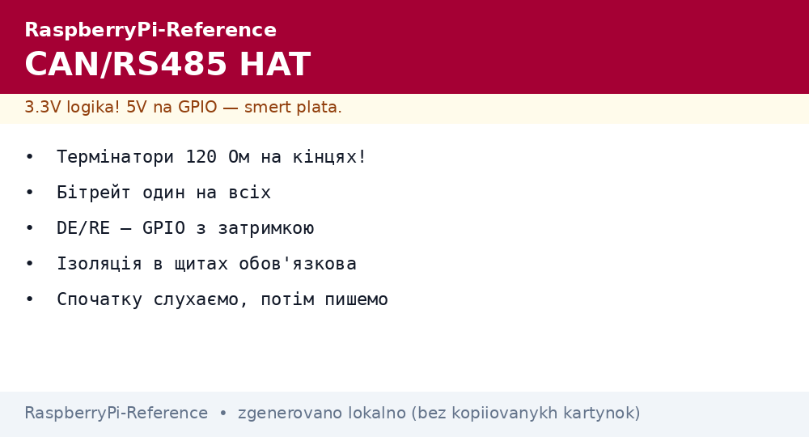
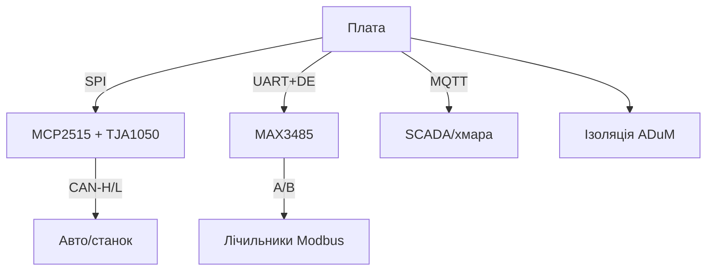

# CAN і RS485 HAT для Raspberry Pi - промислові шини


*Рис. Промисловий міст: CAN-трансивер в автошину, RS485 - в Modbus-лінію, плата - шлюз у MQTT.*

> [!tip] Що це за нота
> Мова заводів і авто: CAN (машини, станки) і RS485/Modbus (лічильники, ПЛК). HATи з трансиверами + термінаторами + ізоляцією. Шини: [шини I2C/SPI/UART](../../../RaspberryPi-Reference/04-Shini/01-I2C-SPI-UART.md), протоколи - ноти черги 4 (Modbus).

## 1. Мета

Говорити з промисловістю:

- CAN HAT (MCP2515 + TJA1050): читати автошину, керувати вузлами;
- RS485 HAT (MAX3485/ізольований): Modbus RTU до лічильників;
- термінатори 120 Ом: де ставити, де знімати;
- шлюз CAN/Modbus → MQTT.

| Шина | Топологія | Швидкість | Дальність |
| --- | --- | --- | --- |
| CAN 2.0 | лінія, 120 Ом з обох кінців | до 1 Мбіт/с | 40 м - 1 км |
| CAN-FD | як CAN, швидше дані | до 8 Мбіт/с | коротше |
| RS485 | лінія, термінатор на кінцях | до 10 Мбіт/с | до 1200 м |

## 2. Архітектура шлюзу



Ізольовані HATи - для щитів з перешкодами: землі плати і поля розділені. Неізольовані - для столу.

## 3. CAN HAT детально

- MCP2515 по SPI 10 МГц + переривання INT;
- оверлей `mcp2515-can0`, швидкість в параметрах;
- інтерфейс `can0` в системі - `ip`, `candump`, `cansend`;
- фільтри/маски MCP2515 - в залізі, не вантажити CPU;
- 11-бітні і 29-бітні ідентифікатори одночасно.

## 4. RS485 HAT детально

- MAX3485 або ізольований аналог;
- DE/RE на GPIO: передача - HIGH, прийом - LOW;
- термінатор 120 Ом перемичкою (тільки на кінцях лінії!);
- bias-резистори тримають лінію в паузі;
- швидкості Modbus: 9600/19200/115200, парність за пристроєм.

## 5. Робочий код

```bash
# CAN: підняти і слухати
sudo ip link set can0 type can bitrate 500000
sudo ip link set can0 up
candump can0
cansend can0 123#DEADBEEF
```

```python
import serial
import struct
import time

ser = serial.Serial('/dev/serial0', 9600, timeout=1)

def modbus_read(slave, reg, n=1):
    req = struct.pack('>BBHH', slave, 0x04, reg, n)
    crc = 0xFFFF
    for b in req:
        crc ^= b
        for _ in range(8):
            crc = (crc >> 1) ^ 0xA001 if crc & 1 else crc >> 1
    ser.write(req + struct.pack('<H', crc))
    time.sleep(0.05)
    return ser.read(5 + 2 * n)

if __name__ == '__main__':
    raw = modbus_read(1, 0x0000, 2)
    print('reply:', raw.hex())
```

CRC-16 Modbus рахуємо самі - 6 рядків, без бібліотек. Повноцінний клієнт - `pymodbus` з pip.

## 6. Термінатори і топологія

- CAN: 120 Ом на двох кінцях, середина - без;
- RS485: так само, плюс bias 560 Ом на одному кінці;
- зірка замість лінії - відбиття і помилки;
- довжина відгалужень - сантиметри, не метри;
- екран кабелю - заземлений з одного боку.

## 7. Безпека промислового

- читати CAN авто - ок, писати - тільки знаючи наслідки;
- гальванічна ізоляція в щитах обов'язкова;
- запобіжники в живлення HATа;
- логування всього трафіку перед втручанням;
- тестовий стенд, не бойовий щит.

## 8. Типові помилки

| Симптом | Причина | Лікування |
| --- | --- | --- |
| `can0` немає | оверлей не підключено | dtoverlay + ребут, `dmesg` |
| Тиша на шині | немає термінатора | 120 Ом на кінцях |
| Сміття в candump | не той бітрейт | звірити з мережею (125/250/500K) |
| Modbus timeout | DE/RE не перемикається | GPIO керування, затримка 5 мс |
| CRC не сходиться | порядок байтів | little-endian CRC, big-endian дані |
| Працює, потім стоп | перешкоди без ізоляції | ізольований HAT, екран |

## 9. Швидка шпаргалка шин

- термінатори 120 Ом тільки на кінцях;
- бітрейт однаковий у всіх вузлів;
- DE/RE - GPIO з затримкою;
- CRC рахуємо завжди, довіри немає;
- спочатку слухаємо, потім пишемо.

## 10. Суміжні ноти

- [шини I2C/SPI/UART](../../../RaspberryPi-Reference/04-Shini/01-I2C-SPI-UART.md) - транспортний рівень.
- [HAT і EEPROM](../../../RaspberryPi-Reference/03-GPIO/03-HAT-EEPROM.md) - механіка HAT-плат.
- [мирна Sense-шапка](../../../RaspberryPi-Reference/12-Moduli-zvyazku/01-Sense-HAT.md) - сенсори без промисловості.
- [налаштування ОС](../../../RaspberryPi-Reference/09-Proshivka/03-OS-Nalashtuvannya.md) - can-utils установка.
- [головна карта](../../../RaspberryPi-Reference/Home.md) - повна навігація.

## 9.1 Логування промислового трафіку

- `candump -l` пише все у файл з мітками;
- кільцевий буфер: доба по колу, старе треться;
- мітки часу з GPS-PPS для розбору аварій;
- фільтр `can0,123:7FF` - тільки потрібні ID;
- архів аварій - окремо від рутини.

## Офіційні джерела

- [2-CH CAN HAT (Waveshare)](https://www.waveshare.com/wiki/2-CH_CAN_HAT) - підключення, оверлеї.
- [MCP2515 (Microchip)](https://www.microchip.com/en-us/product/mcp2515) - контролер, фільтри, SPI.
- [NEO-M9N module (u-blox)](https://www.u-blox.com/en/product/neo-m9n-module) - точний час для міток шини.
